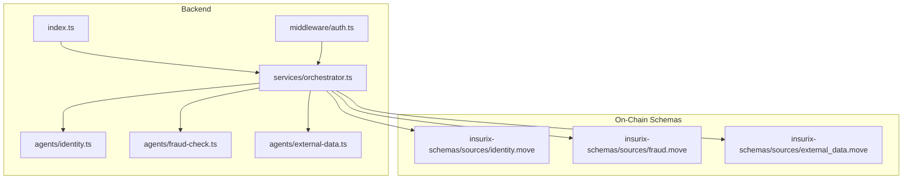
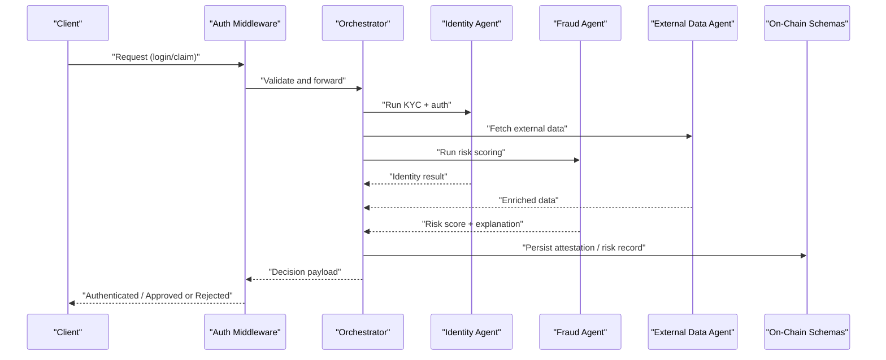
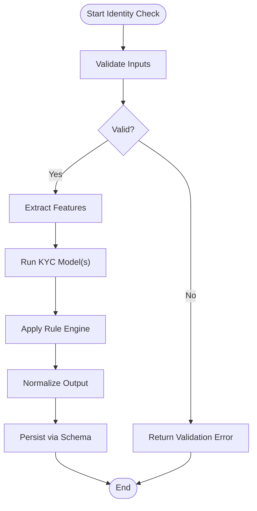
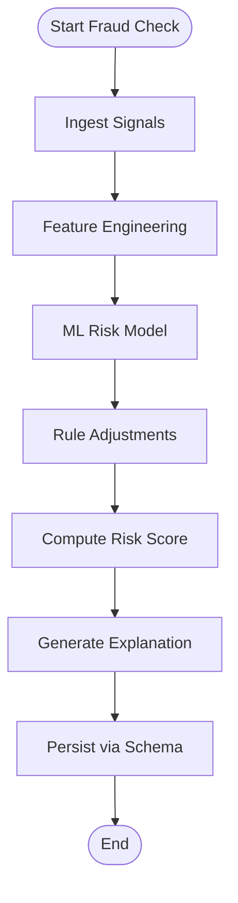
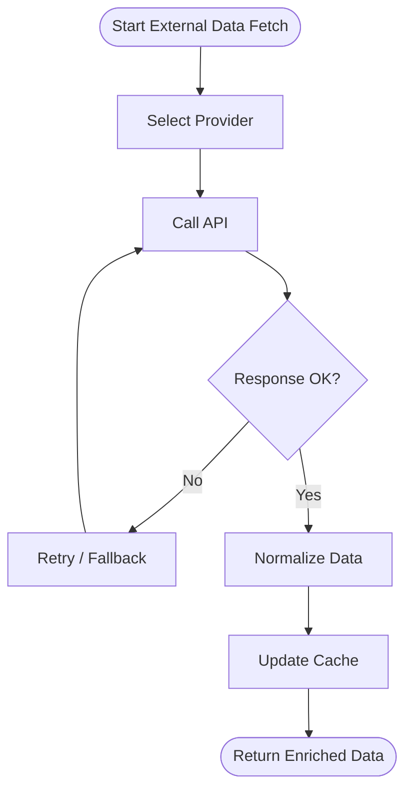
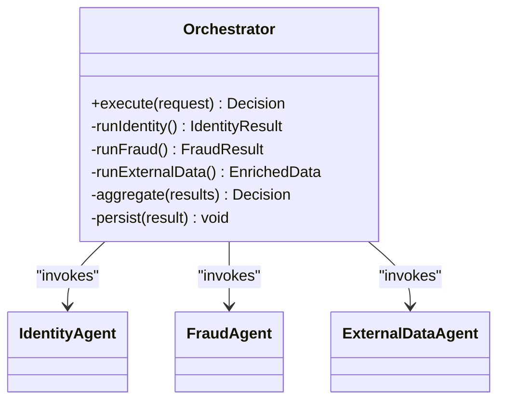
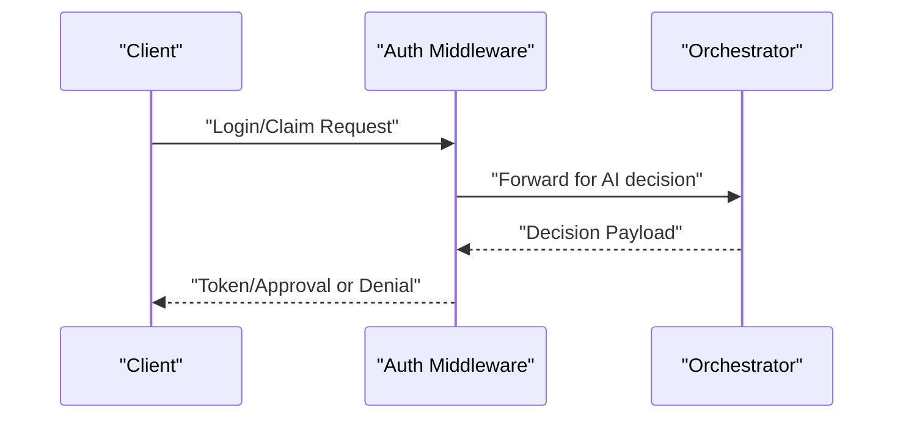
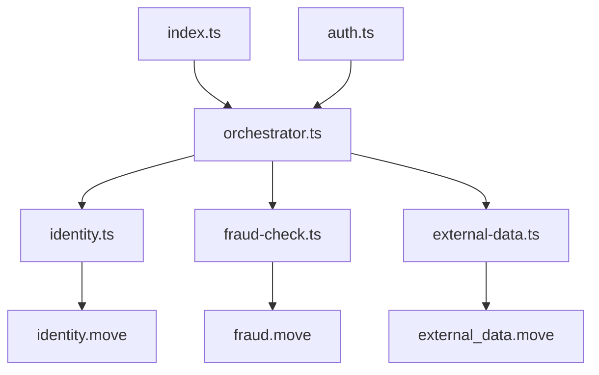

# AI Integration

<cite>
**Referenced Files in This Document**
- [backend/src/agents/identity.ts](file://backend/src/agents/identity.ts)
- [backend/src/agents/fraud-check.ts](file://backend/src/agents/fraud-check.ts)
- [backend/src/agents/external-data.ts](file://backend/src/agents/external-data.ts)
- [backend/src/services/orchestrator.ts](file://backend/src/services/orchestrator.ts)
- [backend/src/middleware/auth.ts](file://backend/src/middleware/auth.ts)
- [backend/src/index.ts](file://backend/src/index.ts)
- [contracts/insurix-schemas/sources/identity.move](file://contracts/insurix-schemas/sources/identity.move)
- [contracts/insurix-schemas/sources/fraud.move](file://contracts/insurix-schemas/sources/fraud.move)
- [contracts/insurix-schemas/sources/external_data.move](file://contracts/insurix-schemas/sources/external_data.move)
- [docs/design/insurix-ai-workflow.md](file://docs/design/insurix-ai-workflow.md)
</cite>

## Table of Contents
1. [Introduction](#introduction)
2. [Project Structure](#project-structure)
3. [Core Components](#core-components)
4. [Architecture Overview](#architecture-overview)
5. [Detailed Component Analysis](#detailed-component-analysis)
6. [Dependency Analysis](#dependency-analysis)
7. [Performance Considerations](#performance-considerations)
8. [Troubleshooting Guide](#troubleshooting-guide)
9. [Conclusion](#conclusion)
10. [Appendices](#appendices)

## Introduction
This document explains the Insurix protocol’s AI integration for identity verification, fraud detection, and external data verification. It covers how the backend orchestrates AI agents, how on-chain schemas represent results, and how to configure providers, extend logic, and tune performance. The goal is to help developers implement KYC-compliant user authentication, integrate risk scoring, and interpret model outputs reliably.

## Project Structure
The AI-related functionality spans backend agents, an orchestrator service, middleware for authentication, and Move schemas that formalize identity, fraud, and external data structures. Design documentation outlines the end-to-end workflow.

**Diagram sources**
- [backend/src/index.ts](file://backend/src/index.ts)
- [backend/src/services/orchestrator.ts](file://backend/src/services/orchestrator.ts)
- [backend/src/agents/identity.ts](file://backend/src/agents/identity.ts)
- [backend/src/agents/fraud-check.ts](file://backend/src/agents/fraud-check.ts)
- [backend/src/agents/external-data.ts](file://backend/src/agents/external-data.ts)
- [backend/src/middleware/auth.ts](file://backend/src/middleware/auth.ts)
- [contracts/insurix-schemas/sources/identity.move](file://contracts/insurix-schemas/sources/identity.move)
- [contracts/insurix-schemas/sources/fraud.move](file://contracts/insurix-schemas/sources/fraud.move)
- [contracts/insurix-schemas/sources/external_data.move](file://contracts/insurix-schemas/sources/external_data.move)

**Section sources**
- [backend/src/index.ts](file://backend/src/index.ts)
- [backend/src/services/orchestrator.ts](file://backend/src/services/orchestrator.ts)
- [backend/src/agents/identity.ts](file://backend/src/agents/identity.ts)
- [backend/src/agents/fraud-check.ts](file://backend/src/agents/fraud-check.ts)
- [backend/src/agents/external-data.ts](file://backend/src/agents/external-data.ts)
- [backend/src/middleware/auth.ts](file://backend/src/middleware/auth.ts)
- [contracts/insurix-schemas/sources/identity.move](file://contracts/insurix-schemas/sources/identity.move)
- [contracts/insurix-schemas/sources/fraud.move](file://contracts/insurix-schemas/sources/fraud.move)
- [contracts/insurix-schemas/sources/external_data.move](file://contracts/insurix-schemas/sources/external_data.move)
- [docs/design/insurix-ai-workflow.md](file://docs/design/insurix-ai-workflow.md)

## Core Components
- Identity Verification Agent: Performs KYC checks and user authentication flows, producing structured identity attestations.
- Fraud Detection Agent: Applies pattern recognition and risk scoring to transactions or claims, returning risk levels and explanations.
- External Data Agent: Integrates with real-world data sources to enrich and verify inputs used by identity and fraud pipelines.
- Orchestrator Service: Coordinates agent execution, manages timeouts, retries, and aggregates results into a unified decision payload.
- Authentication Middleware: Enforces access control and integrates AI-driven decisions into session/token issuance.

Key responsibilities:
- Input validation and normalization before inference.
- Provider selection and configuration for different verification vendors.
- Aggregation and interpretation of model outputs.
- On-chain schema alignment for persistent records.

**Section sources**
- [backend/src/agents/identity.ts](file://backend/src/agents/identity.ts)
- [backend/src/agents/fraud-check.ts](file://backend/src/agents/fraud-check.ts)
- [backend/src/agents/external-data.ts](file://backend/src/agents/external-data.ts)
- [backend/src/services/orchestrator.ts](file://backend/src/services/orchestrator.ts)
- [backend/src/middleware/auth.ts](file://backend/src/middleware/auth.ts)

## Architecture Overview
The AI pipeline follows a request-driven orchestration flow:
- Client requests authentication or claim processing.
- Middleware validates and forwards to the orchestrator.
- Orchestrator invokes identity, fraud, and external data agents in parallel or sequence based on policy.
- Agents call ML models or external APIs, normalize outputs, and return structured results.
- Orchestrator aggregates results, applies thresholds/policies, and returns a decision.
- Results are persisted via on-chain schemas for auditability.

**Diagram sources**
- [backend/src/middleware/auth.ts](file://backend/src/middleware/auth.ts)
- [backend/src/services/orchestrator.ts](file://backend/src/services/orchestrator.ts)
- [backend/src/agents/identity.ts](file://backend/src/agents/identity.ts)
- [backend/src/agents/fraud-check.ts](file://backend/src/agents/fraud-check.ts)
- [backend/src/agents/external-data.ts](file://backend/src/agents/external-data.ts)
- [contracts/insurix-schemas/sources/identity.move](file://contracts/insurix-schemas/sources/identity.move)
- [contracts/insurix-schemas/sources/fraud.move](file://contracts/insurix-schemas/sources/fraud.move)
- [contracts/insurix-schemas/sources/external_data.move](file://contracts/insurix-schemas/sources/external_data.move)

## Detailed Component Analysis

### Identity Verification Agent
Responsibilities:
- Collects and normalizes identity inputs (e.g., documents, biometrics).
- Calls provider-specific KYC services and ML models.
- Produces structured identity attestations aligned with on-chain schemas.
- Supports configurable providers and fallback strategies.

Configuration options:
- Provider selection (e.g., vendor A/B), API keys, endpoints.
- Thresholds for acceptance/rejection.
- Timeout and retry policies.
- Custom algorithm hooks for pre/post-processing.

Inference pipeline:
- Input validation -> feature extraction -> model inference -> rule evaluation -> output normalization.

Result interpretation:
- Confidence scores, pass/fail flags, and human-readable reasons.
- Mapping to identity schema fields for persistence.

**Diagram sources**
- [backend/src/agents/identity.ts](file://backend/src/agents/identity.ts)
- [contracts/insurix-schemas/sources/identity.move](file://contracts/insurix-schemas/sources/identity.move)

**Section sources**
- [backend/src/agents/identity.ts](file://backend/src/agents/identity.ts)
- [contracts/insurix-schemas/sources/identity.move](file://contracts/insurix-schemas/sources/identity.move)

### Fraud Detection Agent
Responsibilities:
- Implements pattern recognition algorithms for transaction or claim analysis.
- Computes risk scores and generates explanations.
- Integrates with external signals (e.g., device fingerprinting, IP reputation).
- Supports custom rules and model ensembles.

Risk scoring mechanism:
- Feature aggregation from multiple sources.
- Model inference (e.g., classifier/regressor).
- Rule-based adjustments and thresholding.
- Output includes risk level, confidence, and contributing factors.

Deployment considerations:
- Batch vs. online inference modes.
- Caching of frequent patterns.
- Drift monitoring and retraining triggers.

**Diagram sources**
- [backend/src/agents/fraud-check.ts](file://backend/src/agents/fraud-check.ts)
- [contracts/insurix-schemas/sources/fraud.move](file://contracts/insurix-schemas/sources/fraud.move)

**Section sources**
- [backend/src/agents/fraud-check.ts](file://backend/src/agents/fraud-check.ts)
- [contracts/insurix-schemas/sources/fraud.move](file://contracts/insurix-schemas/sources/fraud.move)

### External Data Agent
Responsibilities:
- Connects to real-world data sources (e.g., registries, credit bureaus, sanctions lists).
- Normalizes heterogeneous responses into a unified format.
- Provides caching and rate-limit handling.
- Supplies enriched features to identity and fraud agents.

Integration points:
- Provider adapters for different APIs.
- Retry/backoff and circuit breaker patterns.
- Secret management for credentials.

**Diagram sources**
- [backend/src/agents/external-data.ts](file://backend/src/agents/external-data.ts)
- [contracts/insurix-schemas/sources/external_data.move](file://contracts/insurix-schemas/sources/external_data.move)

**Section sources**
- [backend/src/agents/external-data.ts](file://backend/src/agents/external-data.ts)
- [contracts/insurix-schemas/sources/external_data.move](file://contracts/insurix-schemas/sources/external_data.move)

### Orchestrator Service
Responsibilities:
- Coordinates multi-agent workflows with configurable sequencing and concurrency.
- Manages timeouts, retries, and error propagation.
- Aggregates results into a unified decision payload.
- Persists outcomes using on-chain schemas.

Workflow patterns:
- Parallel execution for independent agents.
- Conditional branching based on intermediate results.
- Policy enforcement and final decision logic.

**Diagram sources**
- [backend/src/services/orchestrator.ts](file://backend/src/services/orchestrator.ts)
- [backend/src/agents/identity.ts](file://backend/src/agents/identity.ts)
- [backend/src/agents/fraud-check.ts](file://backend/src/agents/fraud-check.ts)
- [backend/src/agents/external-data.ts](file://backend/src/agents/external-data.ts)

**Section sources**
- [backend/src/services/orchestrator.ts](file://backend/src/services/orchestrator.ts)

### Authentication Middleware
Responsibilities:
- Validates incoming requests and integrates AI decisions into session/token issuance.
- Enforces policies derived from identity and fraud results.
- Returns standardized responses for success or rejection.

Integration points:
- Reads orchestrator decision payloads.
- Applies access control rules.
- Emits audit events.

**Diagram sources**
- [backend/src/middleware/auth.ts](file://backend/src/middleware/auth.ts)
- [backend/src/services/orchestrator.ts](file://backend/src/services/orchestrator.ts)

**Section sources**
- [backend/src/middleware/auth.ts](file://backend/src/middleware/auth.ts)

## Dependency Analysis
- Backend entrypoint initializes services and routes that depend on the orchestrator.
- Orchestrator depends on identity, fraud, and external data agents.
- Agents depend on provider configurations and on-chain schemas for persistence.
- Middleware depends on orchestrator decisions to enforce access control.

**Diagram sources**
- [backend/src/index.ts](file://backend/src/index.ts)
- [backend/src/services/orchestrator.ts](file://backend/src/services/orchestrator.ts)
- [backend/src/agents/identity.ts](file://backend/src/agents/identity.ts)
- [backend/src/agents/fraud-check.ts](file://backend/src/agents/fraud-check.ts)
- [backend/src/agents/external-data.ts](file://backend/src/agents/external-data.ts)
- [backend/src/middleware/auth.ts](file://backend/src/middleware/auth.ts)
- [contracts/insurix-schemas/sources/identity.move](file://contracts/insurix-schemas/sources/identity.move)
- [contracts/insurix-schemas/sources/fraud.move](file://contracts/insurix-schemas/sources/fraud.move)
- [contracts/insurix-schemas/sources/external_data.move](file://contracts/insurix-schemas/sources/external_data.move)

**Section sources**
- [backend/src/index.ts](file://backend/src/index.ts)
- [backend/src/services/orchestrator.ts](file://backend/src/services/orchestrator.ts)
- [backend/src/agents/identity.ts](file://backend/src/agents/identity.ts)
- [backend/src/agents/fraud-check.ts](file://backend/src/agents/fraud-check.ts)
- [backend/src/agents/external-data.ts](file://backend/src/agents/external-data.ts)
- [backend/src/middleware/auth.ts](file://backend/src/middleware/auth.ts)
- [contracts/insurix-schemas/sources/identity.move](file://contracts/insurix-schemas/sources/identity.move)
- [contracts/insurix-schemas/sources/fraud.move](file://contracts/insurix-schemas/sources/fraud.move)
- [contracts/insurix-schemas/sources/external_data.move](file://contracts/insurix-schemas/sources/external_data.move)

## Performance Considerations
- Concurrency: Run independent agents in parallel to reduce latency.
- Caching: Cache external data and frequent model inputs; invalidate on changes.
- Timeouts and Retries: Configure per-provider timeouts and exponential backoff.
- Batching: For fraud detection, batch similar requests when possible.
- Model Serving: Use optimized inference endpoints; consider quantization or ONNX where applicable.
- Monitoring: Track latency, error rates, and drift metrics; alert on anomalies.

[No sources needed since this section provides general guidance]

## Troubleshooting Guide
Common issues and resolutions:
- Provider failures: Implement fallback providers and circuit breakers; log errors and metrics.
- Timeouts: Increase timeouts gradually; identify slow dependencies; add partial results handling.
- Invalid inputs: Strengthen validation and provide clear error messages; normalize inputs early.
- Model drift: Monitor prediction distributions; trigger retraining or rollback procedures.
- Persistence errors: Ensure schema compatibility; handle version migrations gracefully.

**Section sources**
- [backend/src/agents/external-data.ts](file://backend/src/agents/external-data.ts)
- [backend/src/agents/fraud-check.ts](file://backend/src/agents/fraud-check.ts)
- [backend/src/agents/identity.ts](file://backend/src/agents/identity.ts)
- [backend/src/services/orchestrator.ts](file://backend/src/services/orchestrator.ts)

## Conclusion
Insurix’s AI integration combines modular agents, robust orchestration, and on-chain schemas to deliver secure KYC compliance, fraud detection, and external data verification. By configuring providers, extending agents, and tuning performance, teams can build reliable, auditable, and scalable AI-driven insurance workflows.

[No sources needed since this section summarizes without analyzing specific files]

## Appendices

### Configuration Options
- Identity Providers: Vendor endpoints, API keys, thresholds, fallback order.
- Fraud Models: Model versions, thresholds, rule sets, ensemble weights.
- External Data: Provider adapters, rate limits, cache TTL, secrets management.
- Orchestration: Concurrency limits, timeouts, retry policies, error handling strategies.

[No sources needed since this section provides general guidance]

### Extending the AI Agent System
- Add a new agent module implementing input/output contracts.
- Register the agent in the orchestrator with desired sequencing and policies.
- Align outputs with on-chain schemas for persistence.
- Provide tests and monitoring hooks.

[No sources needed since this section provides general guidance]

### Example Workflows
- KYC Flow: Collect documents -> run identity agent -> persist attestation -> approve/deny.
- Claim Flow: Ingest claim -> enrich with external data -> run fraud agent -> decide settlement path.
- Authentication Flow: Login request -> identity check -> fraud check -> issue token if approved.

[No sources needed since this section provides general guidance]