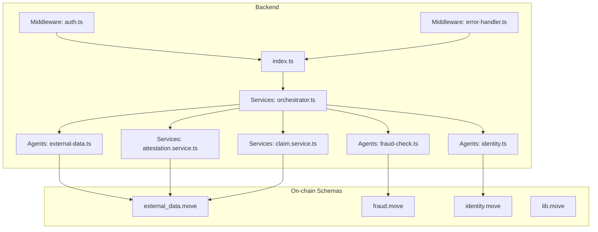
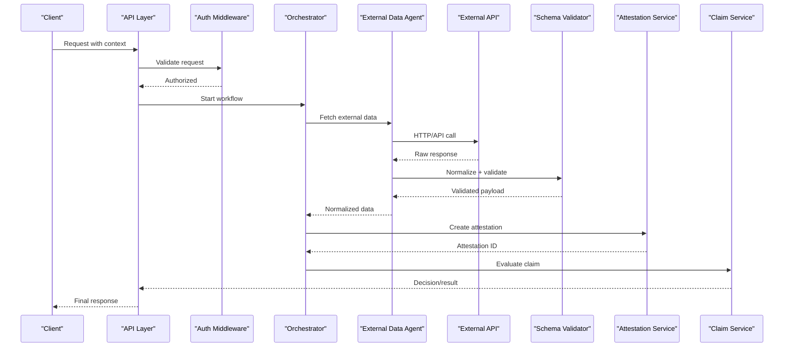
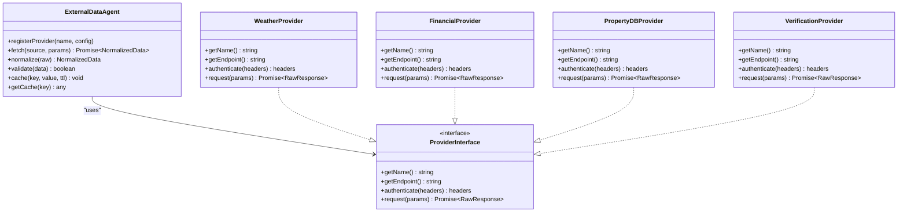
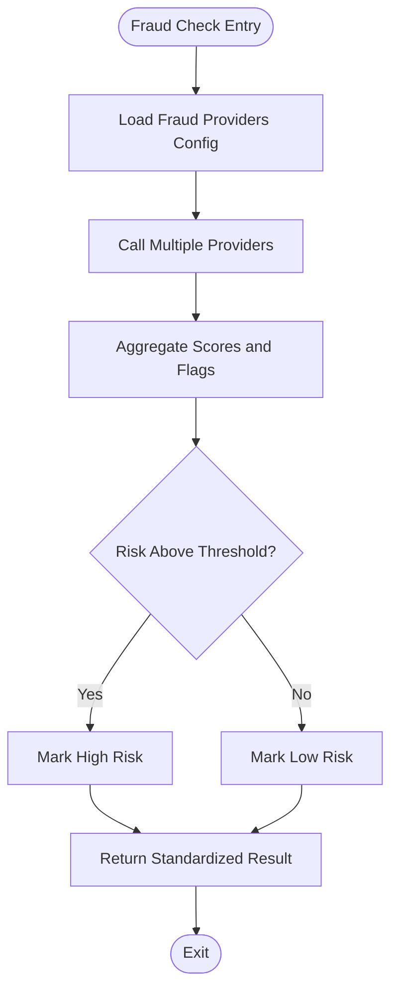
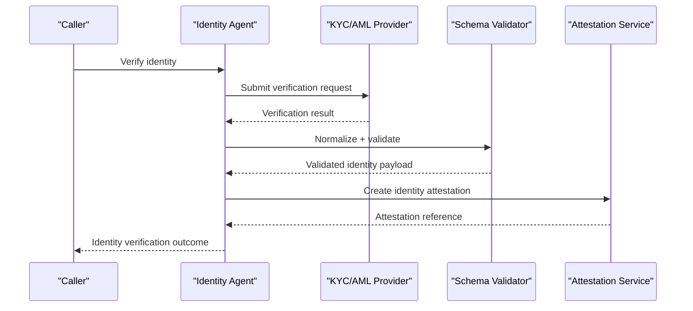
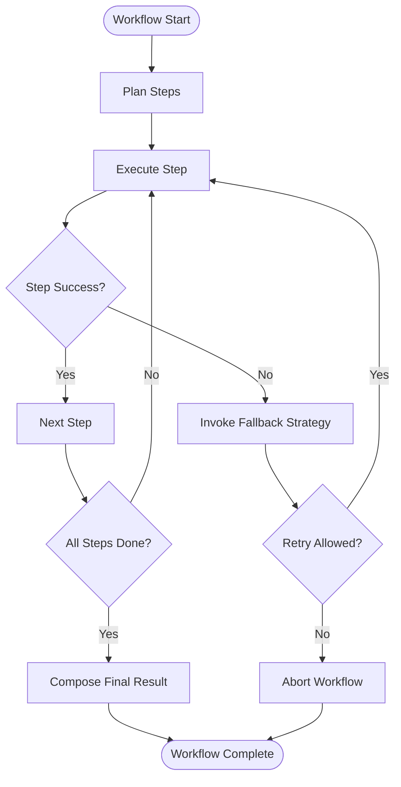
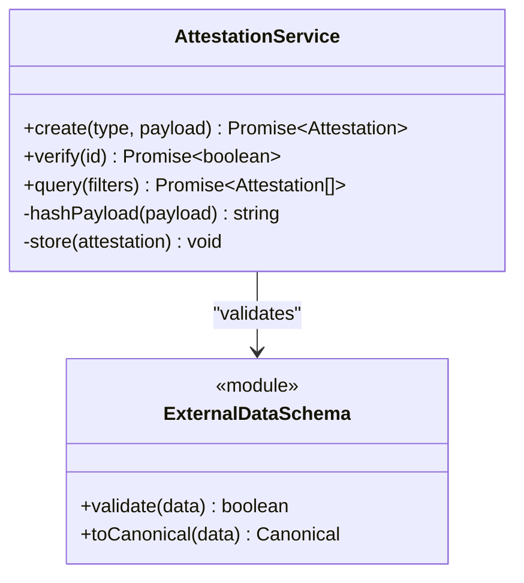
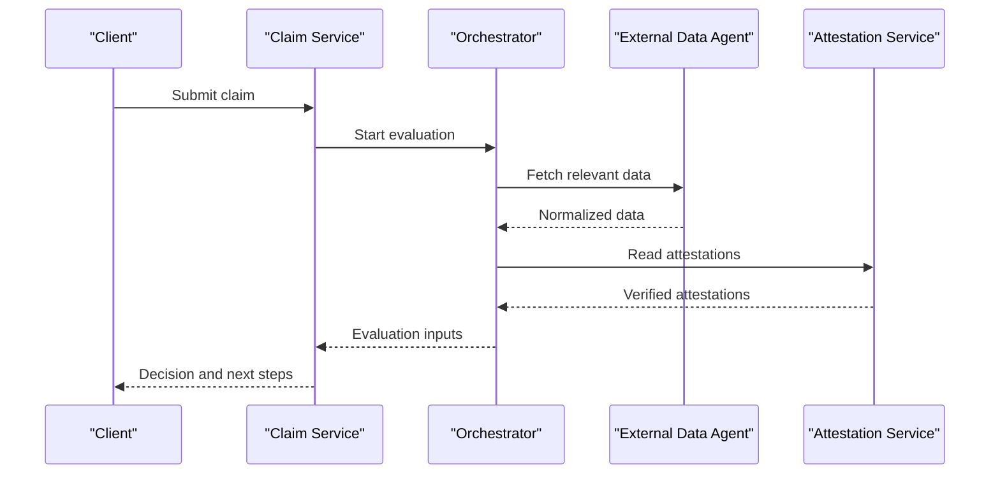
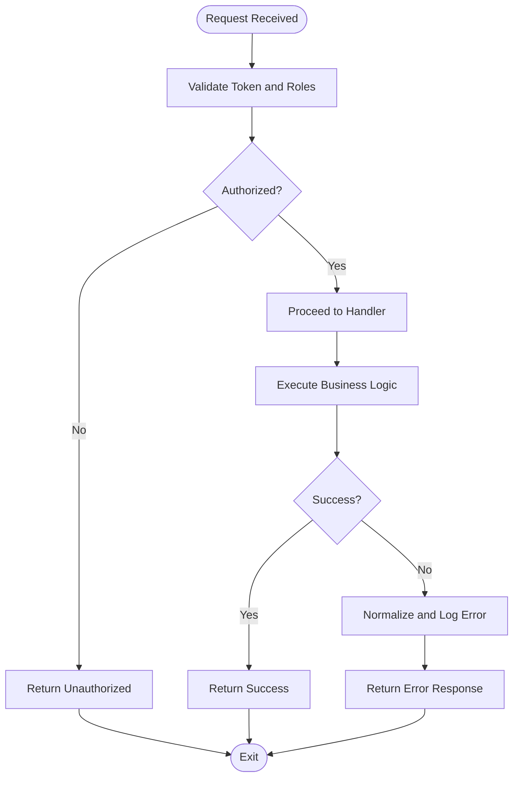
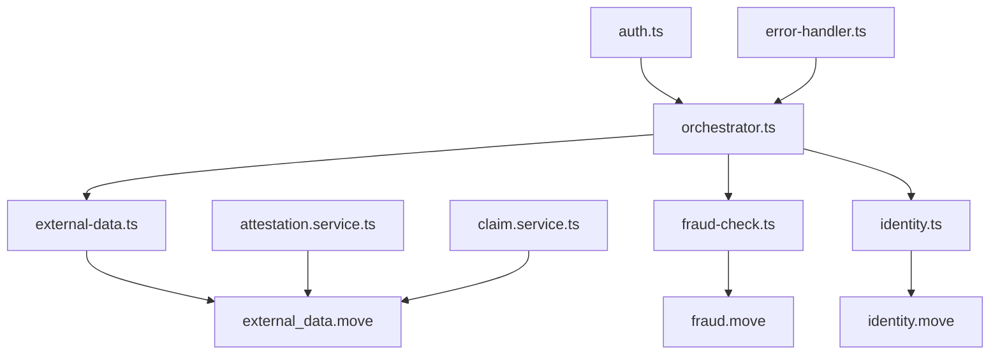

# External Data Integration

<cite>
**Referenced Files in This Document**
- [external-data.ts](file://backend/src/agents/external-data.ts)
- [fraud-check.ts](file://backend/src/agents/fraud-check.ts)
- [identity.ts](file://backend/src/agents/identity.ts)
- [attestation.service.ts](file://backend/src/services/attestation.service.ts)
- [claim.service.ts](file://backend/src/services/claim.service.ts)
- [orchestrator.ts](file://backend/src/services/orchestrator.ts)
- [error-handler.ts](file://backend/src/middleware/error-handler.ts)
- [auth.ts](file://backend/src/middleware/auth.ts)
- [external_data.move](file://contracts/insurix-schemas/sources/external_data.move)
- [fraud.move](file://contracts/insurix-schemas/sources/fraud.move)
- [identity.move](file://contracts/insurix-schemas/sources/identity.move)
- [lib.move](file://contracts/insurix-schemas/sources/lib.move)
- [external_data_tests.move](file://contracts/insurix-schemas/tests/external_data_tests.move)
- [fraud_tests.move](file://contracts/insurix-schemas/tests/fraud_tests.move)
- [identity_tests.move](file://contracts/insurix-schemas/tests/identity_tests.move)
- [index.ts](file://backend/src/index.ts)
</cite>

## Table of Contents
1. [Introduction](#introduction)
2. [Project Structure](#project-structure)
3. [Core Components](#core-components)
4. [Architecture Overview](#architecture-overview)
5. [Detailed Component Analysis](#detailed-component-analysis)
6. [Dependency Analysis](#dependency-analysis)
7. [Performance Considerations](#performance-considerations)
8. [Troubleshooting Guide](#troubleshooting-guide)
9. [Conclusion](#conclusion)
10. [Appendices](#appendices)

## Introduction
This document explains how Insurix integrates external data sources to power real-time insurance workflows. It covers the Oracle-style architecture for fetching and validating third-party information, supported data source categories (weather services, financial markets, property databases, verification services), caching and rate limiting strategies, error handling patterns, configuration approaches for new sources, custom transformers, validation pipelines, and secure API integration guidelines. The goal is to enable developers to extend Insurix with reliable, auditable, and secure external data integrations.

## Project Structure
Insurix implements external data integration primarily through backend agents and services that coordinate with on-chain schemas and tests. Key areas include:
- Backend agents for external data retrieval and specialized checks (fraud, identity).
- Services that orchestrate attestations and claims using external inputs.
- Middleware for authentication and centralized error handling.
- On-chain Move schemas and tests defining external data structures and validations.

**Diagram sources**
- [index.ts](file://backend/src/index.ts)
- [external-data.ts](file://backend/src/agents/external-data.ts)
- [fraud-check.ts](file://backend/src/agents/fraud-check.ts)
- [identity.ts](file://backend/src/agents/identity.ts)
- [orchestrator.ts](file://backend/src/services/orchestrator.ts)
- [attestation.service.ts](file://backend/src/services/attestation.service.ts)
- [claim.service.ts](file://backend/src/services/claim.service.ts)
- [auth.ts](file://backend/src/middleware/auth.ts)
- [error-handler.ts](file://backend/src/middleware/error-handler.ts)
- [external_data.move](file://contracts/insurix-schemas/sources/external_data.move)
- [fraud.move](file://contracts/insurix-schemas/sources/fraud.move)
- [identity.move](file://contracts/insurix-schemas/sources/identity.move)
- [lib.move](file://contracts/insurix-schemas/sources/lib.move)

**Section sources**
- [index.ts](file://backend/src/index.ts)
- [external-data.ts](file://backend/src/agents/external-data.ts)
- [fraud-check.ts](file://backend/src/agents/fraud-check.ts)
- [identity.ts](file://backend/src/agents/identity.ts)
- [orchestrator.ts](file://backend/src/services/orchestrator.ts)
- [attestation.service.ts](file://backend/src/services/attestation.service.ts)
- [claim.service.ts](file://backend/src/services/claim.service.ts)
- [auth.ts](file://backend/src/middleware/auth.ts)
- [error-handler.ts](file://backend/src/middleware/error-handler.ts)
- [external_data.move](file://contracts/insurix-schemas/sources/external_data.move)
- [fraud.move](file://contracts/insurix-schemas/sources/fraud.move)
- [identity.move](file://contracts/insurix-schemas/sources/identity.move)
- [lib.move](file://contracts/insurix-schemas/sources/lib.move)

## Core Components
- External Data Agent: Centralized module responsible for discovering, configuring, and invoking external data sources. It normalizes responses into a common schema consumed by downstream services.
- Fraud Check Agent: Specialized agent that queries fraud-related signals and returns normalized risk indicators.
- Identity Agent: Handles identity verification signals from external providers and produces standardized identity attestations.
- Orchestrator Service: Coordinates multi-step workflows combining multiple agents and services to produce final decisions or attestations.
- Attestation Service: Builds and persists attestations based on validated external data and policy rules.
- Claim Service: Uses external data to evaluate claims, compute outcomes, and trigger settlement flows.
- Authentication Middleware: Enforces access control for endpoints that interact with external data operations.
- Error Handler Middleware: Centralizes error normalization, logging, and safe responses for upstream consumers.

These components work together to ensure external data is fetched securely, transformed consistently, validated against on-chain schemas, and used reliably in business logic.

**Section sources**
- [external-data.ts](file://backend/src/agents/external-data.ts)
- [fraud-check.ts](file://backend/src/agents/fraud-check.ts)
- [identity.ts](file://backend/src/agents/identity.ts)
- [orchestrator.ts](file://backend/src/services/orchestrator.ts)
- [attestation.service.ts](file://backend/src/services/attestation.service.ts)
- [claim.service.ts](file://backend/src/services/claim.service.ts)
- [auth.ts](file://backend/src/middleware/auth.ts)
- [error-handler.ts](file://backend/src/middleware/error-handler.ts)

## Architecture Overview
The external data architecture follows an Oracle-like pattern:
- Ingestion: Agents call external APIs with proper authentication and retries.
- Normalization: Responses are converted into a unified internal format.
- Validation: Data is validated against Move-based schemas and policy rules.
- Attestation: Validated data is recorded as attestations for auditability.
- Consumption: Claims and other services consume attestations to make decisions.

**Diagram sources**
- [orchestrator.ts](file://backend/src/services/orchestrator.ts)
- [external-data.ts](file://backend/src/agents/external-data.ts)
- [attestation.service.ts](file://backend/src/services/attestation.service.ts)
- [claim.service.ts](file://backend/src/services/claim.service.ts)
- [auth.ts](file://backend/src/middleware/auth.ts)
- [external_data.move](file://contracts/insurix-schemas/sources/external_data.move)

## Detailed Component Analysis

### External Data Agent
Responsibilities:
- Source registry and configuration management.
- Rate limiting and retry policies per provider.
- Response normalization and schema validation.
- Caching strategy for frequently accessed data.

Key behaviors:
- Supports pluggable providers via a consistent interface.
- Applies environment-specific credentials and endpoints.
- Produces canonical payloads consumed by services.

**Diagram sources**
- [external-data.ts](file://backend/src/agents/external-data.ts)

**Section sources**
- [external-data.ts](file://backend/src/agents/external-data.ts)

### Fraud Check Agent
Responsibilities:
- Query fraud signal providers.
- Aggregate risk scores and flags.
- Return standardized fraud indicators for decision engines.

Behavior highlights:
- Combines multiple signals with weighted scoring.
- Enforces timeouts and fallbacks when providers are unavailable.

**Diagram sources**
- [fraud-check.ts](file://backend/src/agents/fraud-check.ts)

**Section sources**
- [fraud-check.ts](file://backend/src/agents/fraud-check.ts)

### Identity Agent
Responsibilities:
- Retrieve identity verification results from external KYC/AML providers.
- Normalize identity attributes and verification status.
- Produce identity attestations for downstream use.

**Diagram sources**
- [identity.ts](file://backend/src/agents/identity.ts)
- [attestation.service.ts](file://backend/src/services/attestation.service.ts)
- [identity.move](file://contracts/insurix-schemas/sources/identity.move)

**Section sources**
- [identity.ts](file://backend/src/agents/identity.ts)
- [attestation.service.ts](file://backend/src/services/attestation.service.ts)
- [identity.move](file://contracts/insurix-schemas/sources/identity.move)

### Orchestrator Service
Responsibilities:
- Coordinate multi-agent workflows for complex decisions.
- Manage sequencing, parallelism, and fallbacks.
- Ensure consistent state and audit trails across steps.

**Diagram sources**
- [orchestrator.ts](file://backend/src/services/orchestrator.ts)

**Section sources**
- [orchestrator.ts](file://backend/src/services/orchestrator.ts)

### Attestation Service
Responsibilities:
- Build attestations from validated external data.
- Persist references and metadata for auditability.
- Provide query interfaces for downstream consumers.

**Diagram sources**
- [attestation.service.ts](file://backend/src/services/attestation.service.ts)
- [external_data.move](file://contracts/insurix-schemas/sources/external_data.move)

**Section sources**
- [attestation.service.ts](file://backend/src/services/attestation.service.ts)
- [external_data.move](file://contracts/insurix-schemas/sources/external_data.move)

### Claim Service
Responsibilities:
- Use external data and attestations to evaluate claims.
- Compute payouts or denials based on policy rules.
- Trigger settlement actions upon approval.

**Diagram sources**
- [claim.service.ts](file://backend/src/services/claim.service.ts)
- [orchestrator.ts](file://backend/src/services/orchestrator.ts)
- [external-data.ts](file://backend/src/agents/external-data.ts)
- [attestation.service.ts](file://backend/src/services/attestation.service.ts)

**Section sources**
- [claim.service.ts](file://backend/src/services/claim.service.ts)
- [orchestrator.ts](file://backend/src/services/orchestrator.ts)
- [external-data.ts](file://backend/src/agents/external-data.ts)
- [attestation.service.ts](file://backend/src/services/attestation.service.ts)

### Middleware: Authentication and Error Handling
- Authentication middleware enforces token validation and role checks before external data operations.
- Error handler middleware centralizes error formatting, logging, and safe responses to clients.

**Diagram sources**
- [auth.ts](file://backend/src/middleware/auth.ts)
- [error-handler.ts](file://backend/src/middleware/error-handler.ts)

**Section sources**
- [auth.ts](file://backend/src/middleware/auth.ts)
- [error-handler.ts](file://backend/src/middleware/error-handler.ts)

## Dependency Analysis
External data dependencies span backend agents, services, and on-chain schemas. The following diagram shows key relationships:

**Diagram sources**
- [external-data.ts](file://backend/src/agents/external-data.ts)
- [fraud-check.ts](file://backend/src/agents/fraud-check.ts)
- [identity.ts](file://backend/src/agents/identity.ts)
- [orchestrator.ts](file://backend/src/services/orchestrator.ts)
- [attestation.service.ts](file://backend/src/services/attestation.service.ts)
- [claim.service.ts](file://backend/src/services/claim.service.ts)
- [auth.ts](file://backend/src/middleware/auth.ts)
- [error-handler.ts](file://backend/src/middleware/error-handler.ts)
- [external_data.move](file://contracts/insurix-schemas/sources/external_data.move)
- [fraud.move](file://contracts/insurix-schemas/sources/fraud.move)
- [identity.move](file://contracts/insurix-schemas/sources/identity.move)

**Section sources**
- [external-data.ts](file://backend/src/agents/external-data.ts)
- [fraud-check.ts](file://backend/src/agents/fraud-check.ts)
- [identity.ts](file://backend/src/agents/identity.ts)
- [orchestrator.ts](file://backend/src/services/orchestrator.ts)
- [attestation.service.ts](file://backend/src/services/attestation.service.ts)
- [claim.service.ts](file://backend/src/services/claim.service.ts)
- [auth.ts](file://backend/src/middleware/auth.ts)
- [error-handler.ts](file://backend/src/middleware/error-handler.ts)
- [external_data.move](file://contracts/insurix-schemas/sources/external_data.move)
- [fraud.move](file://contracts/insurix-schemas/sources/fraud.move)
- [identity.move](file://contracts/insurix-schemas/sources/identity.move)

## Performance Considerations
- Caching: Implement TTL-based caches keyed by stable identifiers (e.g., location codes, asset IDs). Prefer read-through caches with background refresh for hot keys.
- Rate Limiting: Apply per-provider limits with exponential backoff and jitter. Queue bursts and respect provider quotas to avoid throttling.
- Parallelism: Use concurrent fetches where independent to reduce latency; enforce global concurrency caps to protect downstream systems.
- Timeouts: Set strict timeouts per provider and fail fast with clear error messages.
- Validation Overhead: Keep schema validation lightweight; pre-validate inputs to minimize rework.
- Memory Management: Stream large payloads and avoid retaining unnecessary raw responses.

[No sources needed since this section provides general guidance]

## Troubleshooting Guide
Common issues and resolutions:
- Provider Unavailable: Detect timeouts and network errors; switch to fallback providers or cached values if available.
- Invalid Credentials: Rotate secrets and verify environment variables; log credential presence without exposing sensitive values.
- Schema Mismatch: Align normalized payloads with Move schemas; update validators when provider responses change.
- Rate Limit Exceeded: Back off and queue requests; monitor provider dashboards and adjust quotas.
- Audit Gaps: Ensure every successful fetch creates an attestation with traceable metadata.

Operational tips:
- Enable structured logging with correlation IDs.
- Add health checks for each provider endpoint.
- Maintain versioned adapters for provider changes.

**Section sources**
- [error-handler.ts](file://backend/src/middleware/error-handler.ts)
- [external_data_tests.move](file://contracts/insurix-schemas/tests/external_data_tests.move)
- [fraud_tests.move](file://contracts/insurix-schemas/tests/fraud_tests.move)
- [identity_tests.move](file://contracts/insurix-schemas/tests/identity_tests.move)

## Conclusion
Insurix’s external data integration leverages modular agents, robust orchestration, and on-chain validation to deliver reliable, auditable insights from third-party sources. By adopting standardized normalization, strong caching and rate limiting, and comprehensive error handling, teams can confidently add new data sources while maintaining security and performance.

[No sources needed since this section summarizes without analyzing specific files]

## Appendices

### Supported Data Sources
- Weather Services: Real-time weather conditions, historical climate data, and alerts.
- Financial Markets: Price feeds, indices, and market volatility metrics.
- Property Databases: Ownership records, valuation estimates, and zoning information.
- Third-Party Verification: KYC/AML checks, sanctions screening, and reputation signals.

[No sources needed since this section provides general guidance]

### Configuration Examples
- Adding a New Data Source:
  - Define a provider adapter implementing the standard interface.
  - Register the provider with base URL, authentication method, and timeout settings.
  - Map provider fields to the canonical schema used by services.
- Custom Data Transformers:
  - Implement transform functions that normalize provider responses.
  - Include unit tests for edge cases and malformed payloads.
- Data Validation Pipelines:
  - Integrate Move-based validators to enforce schema constraints.
  - Fail fast on invalid inputs and log detailed diagnostics.

[No sources needed since this section provides general guidance]

### Secure API Integration Guidelines
- Authentication:
  - Use short-lived tokens and rotate secrets regularly.
  - Store credentials in secure vaults; never hardcode secrets.
- Transport Security:
  - Enforce HTTPS and certificate pinning where feasible.
  - Validate server certificates and reject weak ciphers.
- Data Minimization:
  - Request only necessary fields; mask sensitive data in logs.
- Access Control:
  - Restrict endpoints via role-based permissions.
  - Audit all external data operations with immutable logs.

[No sources needed since this section provides general guidance]