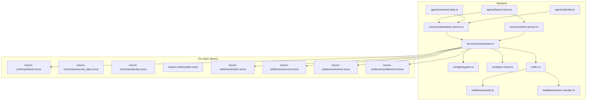
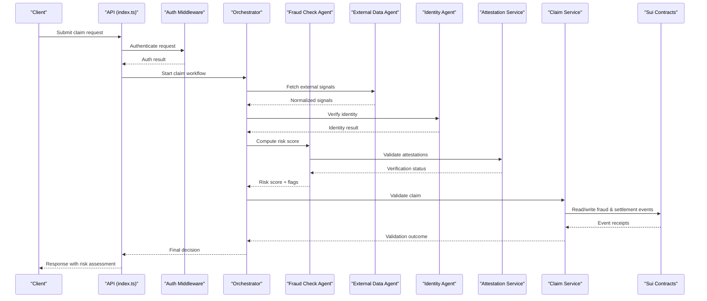
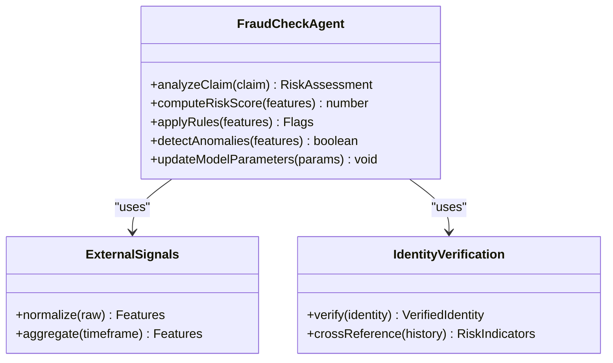
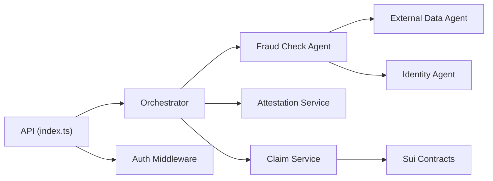

# Fraud Detection System

<cite>
**Referenced Files in This Document**
- [fraud-check.ts](file://backend/src/agents/fraud-check.ts)
- [external-data.ts](file://backend/src/agents/external-data.ts)
- [identity.ts](file://backend/src/agents/identity.ts)
- [attestation.service.ts](file://backend/src/services/attestation.service.ts)
- [claim.service.ts](file://backend/src/services/claim.service.ts)
- [orchestrator.ts](file://backend/src/services/orchestrator.ts)
- [index.ts](file://backend/src/index.ts)
- [keypairs.ts](file://backend/src/config/keypairs.ts)
- [sui-client.ts](file://backend/src/config/sui-client.ts)
- [auth.ts](file://backend/src/middleware/auth.ts)
- [error-handler.ts](file://backend/src/middleware/error-handler.ts)
- [fraud.move](file://contracts/insurix-schemas/sources/fraud.move)
- [external_data.move](file://contracts/insurix-schemas/sources/external_data.move)
- [identity.move](file://contracts/insurix-schemas/sources/identity.move)
- [lib.move](file://contracts/insurix-schemas/sources/lib.move)
- [claim.move](file://contracts/insurix-settlement/sources/claim.move)
- [escrow.move](file://contracts/insurix-settlement/sources/escrow.move)
- [events.move](file://contracts/insurix-settlement/sources/events.move)
- [settlement.move](file://contracts/insurix-settlement/sources/settlement.move)
- [insurix-ai-workflow.md](file://docs/design/insurix-ai-workflow.md)
- [backlog.md](file://docs/implementation/backlog.md)
</cite>

## Table of Contents
1. [Introduction](#introduction)
2. [Project Structure](#project-structure)
3. [Core Components](#core-components)
4. [Architecture Overview](#architecture-overview)
5. [Detailed Component Analysis](#detailed-component-analysis)
6. [Dependency Analysis](#dependency-analysis)
7. [Performance Considerations](#performance-considerations)
8. [Troubleshooting Guide](#troubleshooting-guide)
9. [Conclusion](#conclusion)
10. [Appendices](#appendices)

## Introduction
This document explains the Insurix fraud detection system with a focus on pattern recognition algorithms, machine learning models for fraud identification, risk scoring mechanisms, and the real-time detection pipeline. It also covers historical pattern analysis, anomaly detection capabilities, integration with blockchain transaction monitoring, claim validation checks, and suspicious activity flagging. Configuration options for fraud thresholds, custom rule engines, and model training parameters are documented, along with examples for extending detection algorithms and integrating new patterns.

## Project Structure
The fraud detection system spans backend services, agents, configuration, middleware, and on-chain schemas and settlement contracts:
- Backend agents implement fraud checking, external data ingestion, and identity verification.
- Services orchestrate attestations, claims processing, and end-to-end workflows.
- Configuration manages keypairs and Sui client setup.
- Middleware handles authentication and error handling.
- On-chain Move schemas define fraud-related types and events; settlement contracts manage claims and escrow flows.
- Documentation outlines AI workflow and implementation backlog.

**Diagram sources**
- [fraud-check.ts](file://backend/src/agents/fraud-check.ts)
- [external-data.ts](file://backend/src/agents/external-data.ts)
- [identity.ts](file://backend/src/agents/identity.ts)
- [attestation.service.ts](file://backend/src/services/attestation.service.ts)
- [claim.service.ts](file://backend/src/services/claim.service.ts)
- [orchestrator.ts](file://backend/src/services/orchestrator.ts)
- [keypairs.ts](file://backend/src/config/keypairs.ts)
- [sui-client.ts](file://backend/src/config/sui-client.ts)
- [auth.ts](file://backend/src/middleware/auth.ts)
- [error-handler.ts](file://backend/src/middleware/error-handler.ts)
- [index.ts](file://backend/src/index.ts)
- [fraud.move](file://contracts/insurix-schemas/sources/fraud.move)
- [external_data.move](file://contracts/insurix-schemas/sources/external_data.move)
- [identity.move](file://contracts/insurix-schemas/sources/identity.move)
- [lib.move](file://contracts/insurix-schemas/sources/lib.move)
- [claim.move](file://contracts/insurix-settlement/sources/claim.move)
- [escrow.move](file://contracts/insurix-settlement/sources/escrow.move)
- [events.move](file://contracts/insurix-settlement/sources/events.move)
- [settlement.move](file://contracts/insurix-settlement/sources/settlement.move)

**Section sources**
- [fraud-check.ts](file://backend/src/agents/fraud-check.ts)
- [external-data.ts](file://backend/src/agents/external-data.ts)
- [identity.ts](file://backend/src/agents/identity.ts)
- [attestation.service.ts](file://backend/src/services/attestation.service.ts)
- [claim.service.ts](file://backend/src/services/claim.service.ts)
- [orchestrator.ts](file://backend/src/services/orchestrator.ts)
- [keypairs.ts](file://backend/src/config/keypairs.ts)
- [sui-client.ts](file://backend/src/config/sui-client.ts)
- [auth.ts](file://backend/src/middleware/auth.ts)
- [error-handler.ts](file://backend/src/middleware/error-handler.ts)
- [index.ts](file://backend/src/index.ts)
- [fraud.move](file://contracts/insurix-schemas/sources/fraud.move)
- [external_data.move](file://contracts/insurix-schemas/sources/external_data.move)
- [identity.move](file://contracts/insurix-schemas/sources/identity.move)
- [lib.move](file://contracts/insurix-schemas/sources/lib.move)
- [claim.move](file://contracts/insurix-settlement/sources/claim.move)
- [escrow.move](file://contracts/insurix-settlement/sources/escrow.move)
- [events.move](file://contracts/insurix-settlement/sources/events.move)
- [settlement.move](file://contracts/insurix-settlement/sources/settlement.move)

## Core Components
- Fraud Check Agent: Implements pattern recognition and ML-based scoring to identify potential fraud signals from claim and identity data. It integrates with external data sources and identity verification results to compute risk scores and flags.
- External Data Agent: Ingests and normalizes third-party signals used by fraud detection, such as device fingerprints, IP reputation, and behavioral telemetry.
- Identity Agent: Validates identities and cross-references them against known risk indicators and on-chain attestations.
- Attestation Service: Manages creation, verification, and lifecycle of attestations that underpin trust and compliance in the fraud pipeline.
- Claim Service: Processes claims, performs validation checks, and coordinates with fraud detection to approve or reject claims based on risk outcomes.
- Orchestrator: Coordinates the end-to-end flow across agents and services, ensuring deterministic execution and consistent state transitions.
- Configuration: Provides cryptographic keypairs and Sui client configuration required for on-chain interactions.
- Middleware: Handles authentication and centralized error handling for API endpoints.

**Section sources**
- [fraud-check.ts](file://backend/src/agents/fraud-check.ts)
- [external-data.ts](file://backend/src/agents/external-data.ts)
- [identity.ts](file://backend/src/agents/identity.ts)
- [attestation.service.ts](file://backend/src/services/attestation.service.ts)
- [claim.service.ts](file://backend/src/services/claim.service.ts)
- [orchestrator.ts](file://backend/src/services/orchestrator.ts)
- [keypairs.ts](file://backend/src/config/keypairs.ts)
- [sui-client.ts](file://backend/src/config/sui-client.ts)
- [auth.ts](file://backend/src/middleware/auth.ts)
- [error-handler.ts](file://backend/src/middleware/error-handler.ts)

## Architecture Overview
The fraud detection architecture combines off-chain analytics with on-chain verification:
- Real-time pipeline: Claims enter via API, pass through authentication, and are processed by the orchestrator. The fraud check agent evaluates signals from external data and identity verification to produce a risk score and flags.
- Historical analysis: Past transactions and attestations are analyzed to detect recurring patterns and anomalies.
- Anomaly detection: Statistical and ML techniques identify deviations from expected behavior.
- Blockchain integration: On-chain Move schemas define fraud-related types and events; settlement contracts enforce rules and manage escrow flows.

**Diagram sources**
- [index.ts](file://backend/src/index.ts)
- [auth.ts](file://backend/src/middleware/auth.ts)
- [orchestrator.ts](file://backend/src/services/orchestrator.ts)
- [fraud-check.ts](file://backend/src/agents/fraud-check.ts)
- [external-data.ts](file://backend/src/agents/external-data.ts)
- [identity.ts](file://backend/src/agents/identity.ts)
- [attestation.service.ts](file://backend/src/services/attestation.service.ts)
- [claim.service.ts](file://backend/src/services/claim.service.ts)
- [fraud.move](file://contracts/insurix-schemas/sources/fraud.move)
- [events.move](file://contracts/insurix-settlement/sources/events.move)
- [claim.move](file://contracts/insurix-settlement/sources/claim.move)
- [escrow.move](file://contracts/insurix-settlement/sources/escrow.move)
- [settlement.move](file://contracts/insurix-settlement/sources/settlement.move)

## Detailed Component Analysis

### Fraud Check Agent
The fraud check agent implements pattern recognition and ML-based scoring:
- Pattern recognition: Detects recurring behaviors across claims and identities using feature extraction and similarity measures.
- Machine learning models: Applies trained classifiers to predict fraud probability based on input features.
- Risk scoring: Aggregates signals into a composite risk score with configurable thresholds.
- Suspicious activity flagging: Emits flags when risk exceeds defined levels or when anomalies are detected.

**Diagram sources**
- [fraud-check.ts](file://backend/src/agents/fraud-check.ts)
- [external-data.ts](file://backend/src/agents/external-data.ts)
- [identity.ts](file://backend/src/agents/identity.ts)

**Section sources**
- [fraud-check.ts](file://backend/src/agents/fraud-check.ts)
- [external-data.ts](file://backend/src/agents/external-data.ts)
- [identity.ts](file://backend/src/agents/identity.ts)

### External Data Agent
The external data agent ingests and normalizes third-party signals:
- Data sources: Device fingerprints, IP reputation, behavioral telemetry, and other risk signals.
- Normalization: Standardizes formats and scales features for consistent analysis.
- Aggregation: Combines multiple signals over time windows to improve detection accuracy.

**Section sources**
- [external-data.ts](file://backend/src/agents/external-data.ts)

### Identity Agent
The identity agent validates identities and cross-references risk indicators:
- Verification: Confirms identity attributes and signatures.
- Cross-reference: Compares against historical records and on-chain attestations to detect inconsistencies.

**Section sources**
- [identity.ts](file://backend/src/agents/identity.ts)

### Attestation Service
The attestation service manages attestations critical to fraud prevention:
- Creation: Generates attestations for verified entities and claims.
- Verification: Ensures attestations are valid and not revoked.
- Lifecycle: Tracks issuance, updates, and revocation states.

**Section sources**
- [attestation.service.ts](file://backend/src/services/attestation.service.ts)

### Claim Service
The claim service processes claims and performs validation checks:
- Validation: Enforces business rules and policy constraints.
- Coordination: Integrates with fraud detection and on-chain settlement logic.
- Outcome: Produces approval/rejection decisions based on risk assessments.

**Section sources**
- [claim.service.ts](file://backend/src/services/claim.service.ts)

### Orchestrator
The orchestrator coordinates the end-to-end workflow:
- Flow control: Sequences steps across agents and services.
- State management: Maintains consistent state transitions during processing.
- Error handling: Centralizes error propagation and recovery strategies.

**Section sources**
- [orchestrator.ts](file://backend/src/services/orchestrator.ts)

### Configuration
Configuration components provide essential settings:
- Keypairs: Manages cryptographic keys for signing and verification.
- Sui client: Configures connection parameters and network settings.

**Section sources**
- [keypairs.ts](file://backend/src/config/keypairs.ts)
- [sui-client.ts](file://backend/src/config/sui-client.ts)

### Middleware
Middleware ensures secure and robust API operations:
- Authentication: Validates requests and enforces access controls.
- Error handling: Centralizes error responses and logging.

**Section sources**
- [auth.ts](file://backend/src/middleware/auth.ts)
- [error-handler.ts](file://backend/src/middleware/error-handler.ts)

### On-chain Schemas and Settlement Contracts
On-chain components define fraud-related types and settlement logic:
- Fraud schema: Defines types and events for fraud detection and reporting.
- External data schema: Structures external signals for on-chain use.
- Identity schema: Encodes identity information and verification states.
- Settlement contracts: Manage claims, escrow, and event emissions for transparency and auditability.

**Section sources**
- [fraud.move](file://contracts/insurix-schemas/sources/fraud.move)
- [external_data.move](file://contracts/insurix-schemas/sources/external_data.move)
- [identity.move](file://contracts/insurix-schemas/sources/identity.move)
- [lib.move](file://contracts/insurix-schemas/sources/lib.move)
- [claim.move](file://contracts/insurix-settlement/sources/claim.move)
- [escrow.move](file://contracts/insurix-settlement/sources/escrow.move)
- [events.move](file://contracts/insurix-settlement/sources/events.move)
- [settlement.move](file://contracts/insurix-settlement/sources/settlement.move)

## Dependency Analysis
The system exhibits clear separation of concerns with well-defined dependencies:
- Agents depend on external data and identity verification to enrich inputs.
- Services coordinate agents and interact with on-chain contracts.
- Configuration and middleware support core functionality without introducing tight coupling.

**Diagram sources**
- [fraud-check.ts](file://backend/src/agents/fraud-check.ts)
- [external-data.ts](file://backend/src/agents/external-data.ts)
- [identity.ts](file://backend/src/agents/identity.ts)
- [attestation.service.ts](file://backend/src/services/attestation.service.ts)
- [claim.service.ts](file://backend/src/services/claim.service.ts)
- [orchestrator.ts](file://backend/src/services/orchestrator.ts)
- [index.ts](file://backend/src/index.ts)
- [auth.ts](file://backend/src/middleware/auth.ts)
- [fraud.move](file://contracts/insurix-schemas/sources/fraud.move)
- [claim.move](file://contracts/insurix-settlement/sources/claim.move)

**Section sources**
- [fraud-check.ts](file://backend/src/agents/fraud-check.ts)
- [external-data.ts](file://backend/src/agents/external-data.ts)
- [identity.ts](file://backend/src/agents/identity.ts)
- [attestation.service.ts](file://backend/src/services/attestation.service.ts)
- [claim.service.ts](file://backend/src/services/claim.service.ts)
- [orchestrator.ts](file://backend/src/services/orchestrator.ts)
- [index.ts](file://backend/src/index.ts)
- [auth.ts](file://backend/src/middleware/auth.ts)
- [fraud.move](file://contracts/insurix-schemas/sources/fraud.move)
- [claim.move](file://contracts/insurix-settlement/sources/claim.move)

## Performance Considerations
- Real-time latency: Optimize external data fetching and identity verification to minimize delays.
- Model inference: Use efficient ML inference pipelines and caching where appropriate.
- Throughput: Scale horizontally to handle high claim volumes during peak periods.
- On-chain costs: Minimize unnecessary writes and optimize event emissions to reduce gas usage.

[No sources needed since this section provides general guidance]

## Troubleshooting Guide
Common issues and resolutions:
- Authentication failures: Verify middleware configuration and token validation.
- External data errors: Check connectivity and fallback strategies for third-party APIs.
- Identity verification mismatches: Review cross-referencing logic and historical data integrity.
- On-chain interaction errors: Inspect contract state and event logs for discrepancies.

**Section sources**
- [auth.ts](file://backend/src/middleware/auth.ts)
- [error-handler.ts](file://backend/src/middleware/error-handler.ts)

## Conclusion
The Insurix fraud detection system integrates advanced pattern recognition and machine learning with robust on-chain verification to deliver reliable fraud identification and risk scoring. Its modular architecture supports extensibility, allowing new detection patterns and algorithms to be incorporated seamlessly. Proper configuration of thresholds, rule engines, and model parameters ensures adaptability to evolving fraud tactics.

[No sources needed since this section summarizes without analyzing specific files]

## Appendices

### Configuration Options
- Fraud thresholds: Define acceptable risk levels and corresponding actions.
- Custom rule engines: Implement domain-specific rules for specialized scenarios.
- Model training parameters: Configure hyperparameters and datasets for continuous improvement.

**Section sources**
- [fraud-check.ts](file://backend/src/agents/fraud-check.ts)
- [attestation.service.ts](file://backend/src/services/attestation.service.ts)
- [claim.service.ts](file://backend/src/services/claim.service.ts)

### Extending Detection Algorithms
- Add new features: Extend external data ingestion to include novel signals.
- Integrate ML models: Plug in updated classifiers or ensemble methods.
- Update rules: Modify rule engine configurations to reflect new fraud patterns.

**Section sources**
- [external-data.ts](file://backend/src/agents/external-data.ts)
- [fraud-check.ts](file://backend/src/agents/fraud-check.ts)

### Integration Examples
- New blockchain integrations: Extend on-chain schemas and settlement contracts for additional chains.
- Enhanced claim validation: Incorporate additional policy checks and compliance requirements.

**Section sources**
- [fraud.move](file://contracts/insurix-schemas/sources/fraud.move)
- [claim.move](file://contracts/insurix-settlement/sources/claim.move)
- [settlement.move](file://contracts/insurix-settlement/sources/settlement.move)

### Workflow Documentation
- AI workflow design: Refer to design documents for end-to-end process details.
- Implementation backlog: Track ongoing enhancements and planned features.

**Section sources**
- [insurix-ai-workflow.md](file://docs/design/insurix-ai-workflow.md)
- [backlog.md](file://docs/implementation/backlog.md)