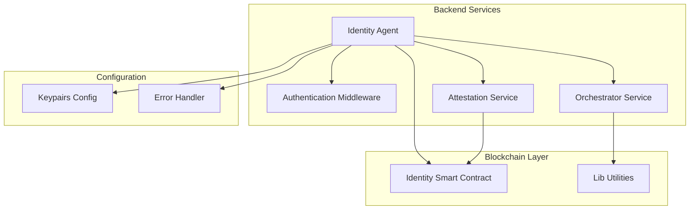
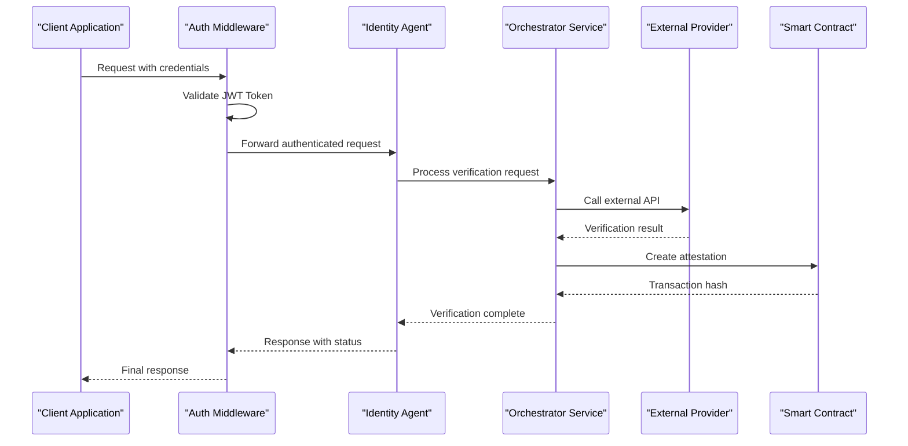
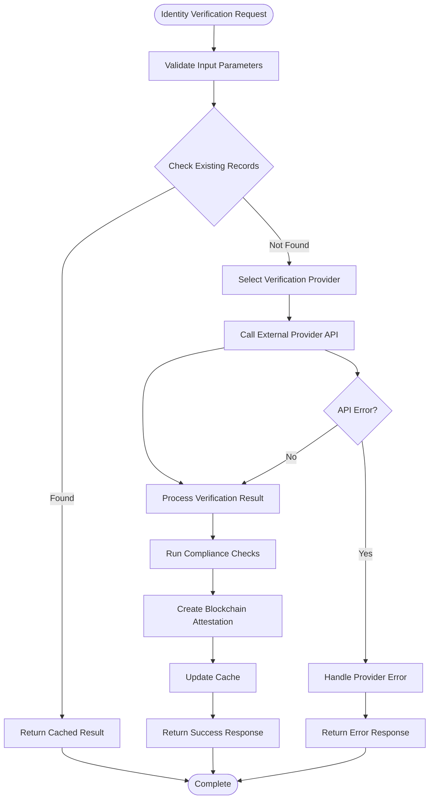
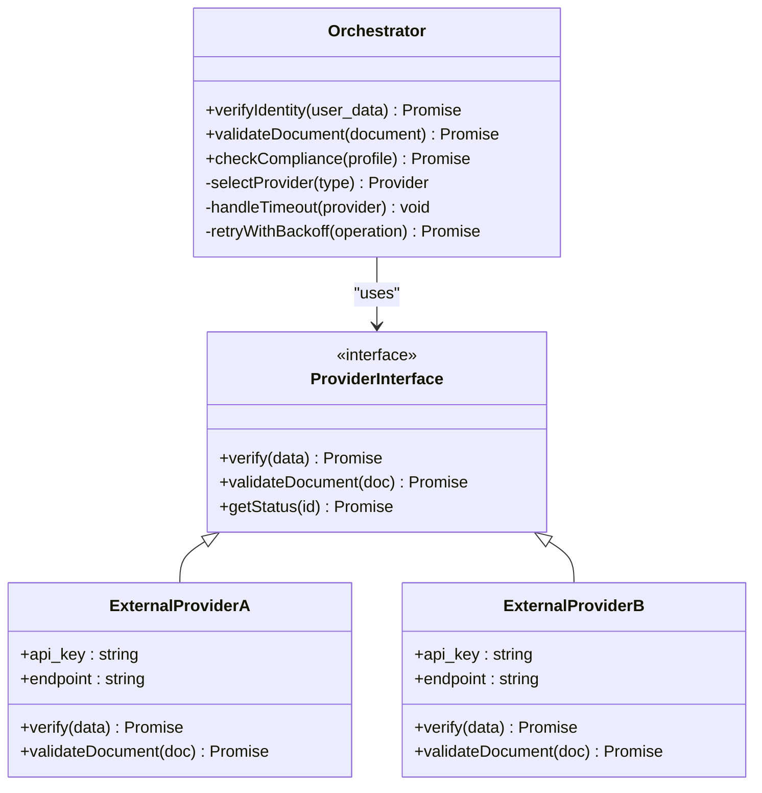
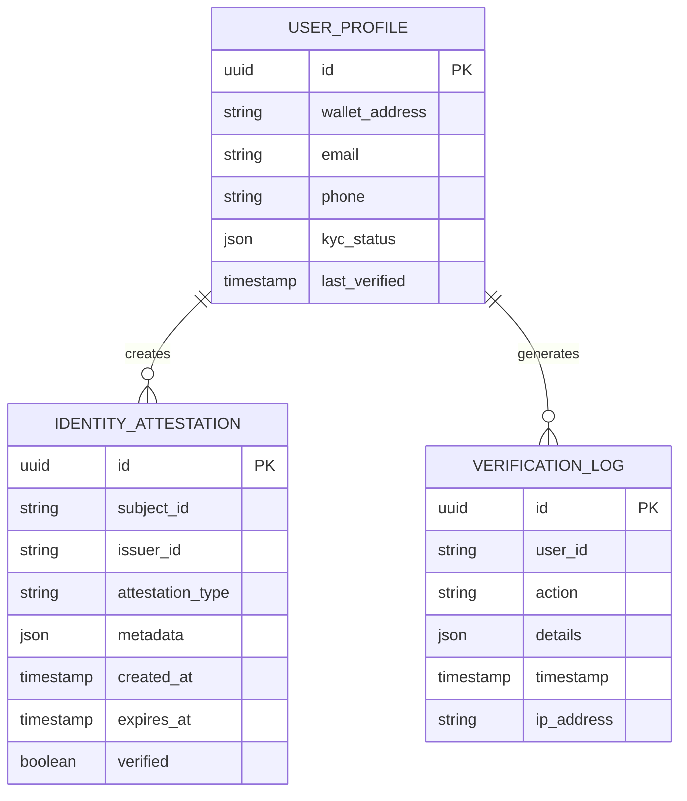
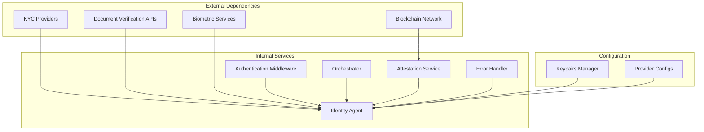

# Identity Verification Agent

<cite>
**Referenced Files in This Document**
- [backend/src/agents/identity.ts](file://backend/src/agents/identity.ts)
- [backend/src/middleware/auth.ts](file://backend/src/middleware/auth.ts)
- [contracts/insurix-schemas/sources/identity.move](file://contracts/insurix-schemas/sources/identity.move)
- [backend/src/services/orchestrator.ts](file://backend/src/services/orchestrator.ts)
- [backend/src/config/keypairs.ts](file://backend/src/config/keypairs.ts)
- [backend/src/middleware/error-handler.ts](file://backend/src/middleware/error-handler.ts)
- [backend/src/services/attestation.service.ts](file://backend/src/services/attestation.service.ts)
- [contracts/insurix-schemas/sources/lib.move](file://contracts/insurix-schemas/sources/lib.move)
</cite>

## Table of Contents
1. [Introduction](#introduction)
2. [Project Structure](#project-structure)
3. [Core Components](#core-components)
4. [Architecture Overview](#architecture-overview)
5. [Detailed Component Analysis](#detailed-component-analysis)
6. [Dependency Analysis](#dependency-analysis)
7. [Performance Considerations](#performance-considerations)
8. [Troubleshooting Guide](#troubleshooting-guide)
9. [Conclusion](#conclusion)
10. [Appendices](#appendices)

## Introduction

The Insurix Identity Verification Agent is a comprehensive KYC (Know Your Customer) compliance system designed to handle user authentication, identity validation, and regulatory compliance in insurance applications. The system integrates multiple external identity providers, supports document verification workflows, and implements biometric authentication capabilities while maintaining strict data privacy measures and encryption standards.

This agent serves as the central component for managing identity-related operations across the Insurix platform, ensuring compliance with financial regulations and providing secure, scalable identity verification services.

## Project Structure

The identity verification system is organized into several key components:



**Diagram sources**
- [backend/src/agents/identity.ts](file://backend/src/agents/identity.ts)
- [backend/src/middleware/auth.ts](file://backend/src/middleware/auth.ts)
- [backend/src/services/orchestrator.ts](file://backend/src/services/orchestrator.ts)
- [contracts/insurix-schemas/sources/identity.move](file://contracts/insurix-schemas/sources/identity.move)

**Section sources**
- [backend/src/agents/identity.ts](file://backend/src/agents/identity.ts)
- [backend/src/middleware/auth.ts](file://backend/src/middleware/auth.ts)
- [contracts/insurix-schemas/sources/identity.move](file://contracts/insurix-schemas/sources/identity.move)

## Core Components

### Identity Agent
The primary identity verification agent that orchestrates all KYC-related operations including user registration, document verification, and compliance checks.

### Authentication Middleware
Handles JWT token validation, session management, and access control for identity-related endpoints.

### Orchestrator Service
Manages the workflow coordination between different identity verification providers and internal validation processes.

### Attestation Service
Handles blockchain-based attestation creation and verification for identity claims.

### Configuration Management
Secure configuration handling for cryptographic keys and provider-specific settings.

**Section sources**
- [backend/src/agents/identity.ts](file://backend/src/agents/identity.ts)
- [backend/src/services/orchestrator.ts](file://backend/src/services/orchestrator.ts)
- [backend/src/services/attestation.service.ts](file://backend/src/services/attestation.service.ts)

## Architecture Overview

The identity verification system follows a layered architecture pattern with clear separation of concerns:



**Diagram sources**
- [backend/src/middleware/auth.ts](file://backend/src/middleware/auth.ts)
- [backend/src/agents/identity.ts](file://backend/src/agents/identity.ts)
- [backend/src/services/orchestrator.ts](file://backend/src/services/orchestrator.ts)

## Detailed Component Analysis

### Identity Agent Implementation

The identity agent serves as the main entry point for all KYC operations, implementing a modular approach to support multiple verification providers and compliance frameworks.

#### Key Features:
- Multi-provider identity verification
- Real-time document validation
- Biometric authentication support
- Regulatory compliance checking
- Audit trail generation

#### Data Flow:


**Diagram sources**
- [backend/src/agents/identity.ts](file://backend/src/agents/identity.ts)
- [backend/src/services/orchestrator.ts](file://backend/src/services/orchestrator.ts)

### Authentication Middleware

The authentication middleware provides secure access control and session management for identity-related operations.

#### Security Features:
- JWT token validation and refresh
- Role-based access control
- Rate limiting and throttling
- Request signing and verification
- Session state management

#### Integration Points:
- HTTP request interception
- User context injection
- Permission validation
- Audit logging

**Section sources**
- [backend/src/middleware/auth.ts](file://backend/src/middleware/auth.ts)

### Orchestrator Service

The orchestrator service coordinates complex identity verification workflows across multiple providers and validation steps.

#### Workflow Management:
- Parallel provider calls
- Fallback mechanism selection
- Timeout handling
- Retry logic with exponential backoff
- Progress tracking and reporting

#### Provider Abstraction:


**Diagram sources**
- [backend/src/services/orchestrator.ts](file://backend/src/services/orchestrator.ts)

### Attestation Service

The attestation service manages blockchain-based identity attestations and verifications using Move smart contracts.

#### Blockchain Integration:
- Secure attestation creation
- Cryptographic signature verification
- On-chain record management
- Cross-chain compatibility

#### Smart Contract Interface:


**Diagram sources**
- [contracts/insurix-schemas/sources/identity.move](file://contracts/insurix-schemas/sources/identity.move)

**Section sources**
- [backend/src/services/attestation.service.ts](file://backend/src/services/attestation.service.ts)
- [contracts/insurix-schemas/sources/identity.move](file://contracts/insurix-schemas/sources/identity.move)

## Dependency Analysis

The identity verification system has well-defined dependencies between components:



**Diagram sources**
- [backend/src/config/keypairs.ts](file://backend/src/config/keypairs.ts)
- [backend/src/middleware/error-handler.ts](file://backend/src/middleware/error-handler.ts)

**Section sources**
- [backend/src/config/keypairs.ts](file://backend/src/config/keypairs.ts)
- [backend/src/middleware/error-handler.ts](file://backend/src/middleware/error-handler.ts)

## Performance Considerations

### Optimization Strategies:
- **Caching Layer**: Implement Redis caching for frequently accessed identity data
- **Connection Pooling**: Use connection pools for database and external API connections
- **Async Processing**: Offload heavy verification tasks to background workers
- **Load Balancing**: Distribute requests across multiple identity provider instances
- **Compression**: Enable gzip compression for large document payloads

### Monitoring and Metrics:
- Request latency tracking per provider
- Error rate monitoring and alerting
- Provider availability and performance metrics
- Database query performance optimization
- Memory usage and garbage collection tuning

## Troubleshooting Guide

### Common Issues and Solutions:

#### Authentication Failures:
- Verify JWT token expiration and refresh mechanisms
- Check middleware configuration and secret keys
- Validate CORS settings and request headers
- Review rate limiting configurations

#### Provider Integration Errors:
- Implement proper error handling and retry logic
- Add circuit breaker patterns for failing providers
- Configure appropriate timeouts and fallback providers
- Monitor API rate limits and quotas

#### Performance Bottlenecks:
- Profile database queries and optimize indexes
- Implement connection pooling for external APIs
- Add caching layers for static configuration data
- Monitor memory usage and optimize data structures

**Section sources**
- [backend/src/middleware/error-handler.ts](file://backend/src/middleware/error-handler.ts)

## Conclusion

The Insurix Identity Verification Agent provides a robust, scalable solution for KYC compliance and identity verification in insurance applications. The modular architecture supports multiple verification providers, ensures regulatory compliance, and maintains high security standards through blockchain-based attestations and advanced encryption techniques.

Key benefits include:
- **Scalability**: Horizontal scaling support for high-volume verification requests
- **Flexibility**: Plugin architecture for easy integration of new verification providers
- **Security**: Multi-layered security with encryption, signing, and audit trails
- **Compliance**: Built-in regulatory compliance features and reporting capabilities
- **Reliability**: Redundant provider support and comprehensive error handling

## Appendices

### Configuration Examples

#### Provider Configuration Template:
```json
{
  "providers": {
    "kyc_provider_a": {
      "api_key": "${KYC_PROVIDER_A_KEY}",
      "endpoint": "https://api.provider-a.com/v1",
      "timeout": 30000,
      "retries": 3,
      "fallback": true
    },
    "document_verification": {
      "api_key": "${DOC_VERIFICATION_KEY}",
      "endpoint": "https://doc-api.provider-b.com/v2",
      "supported_formats": ["jpg", "png", "pdf"],
      "max_file_size": "10MB"
    }
  }
}
```

### API Endpoints Reference:

| Endpoint | Method | Description | Authentication |
|----------|--------|-------------|----------------|
| `/api/identity/verify` | POST | Submit identity for verification | JWT Required |
| `/api/identity/status/:id` | GET | Check verification status | JWT Required |
| `/api/identity/document` | POST | Upload document for verification | JWT Required |
| `/api/identity/biometric` | POST | Perform biometric verification | JWT Required |
| `/api/identity/compliance` | GET | Get compliance status | JWT Required |

### Security Best Practices:
- Always use HTTPS for all API communications
- Implement proper input validation and sanitization
- Use environment variables for sensitive configuration
- Regular security audits and penetration testing
- Comprehensive audit logging for all identity operations