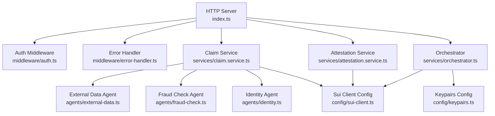
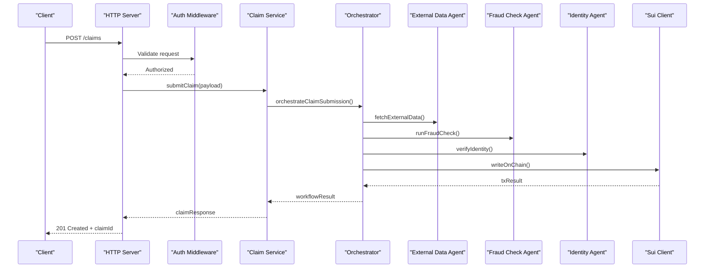
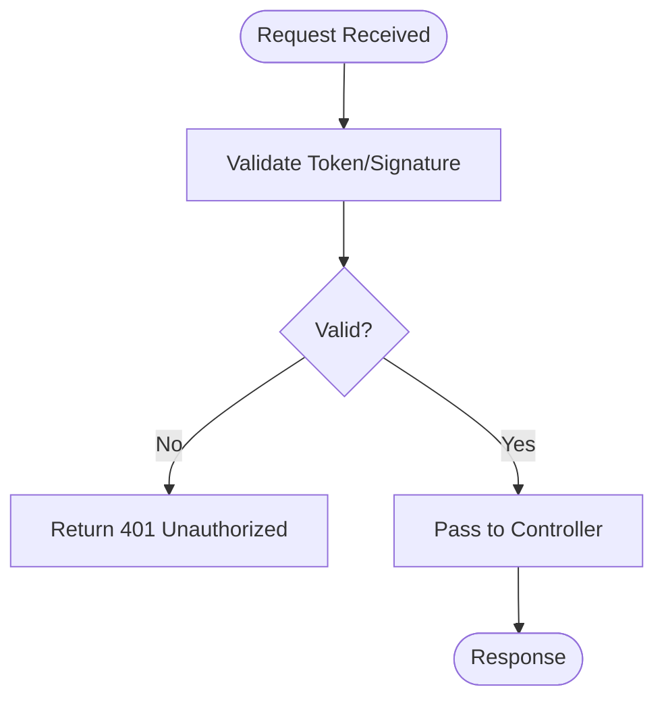
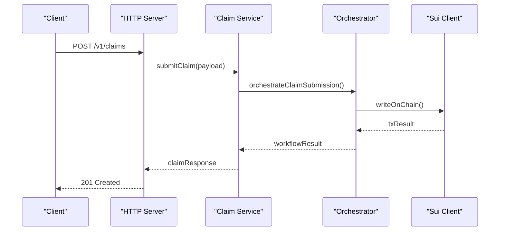
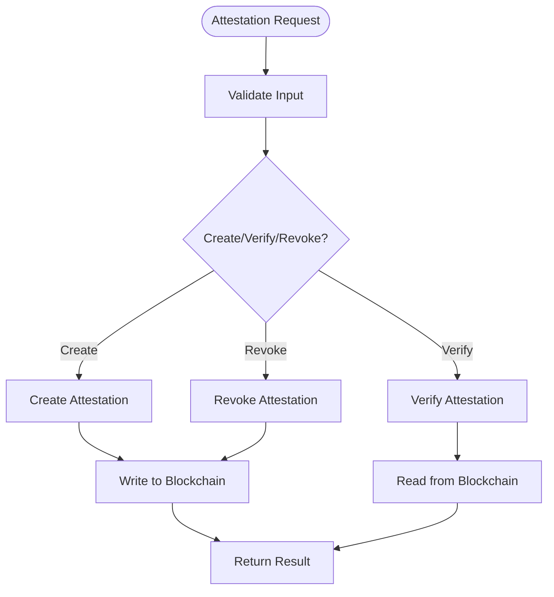
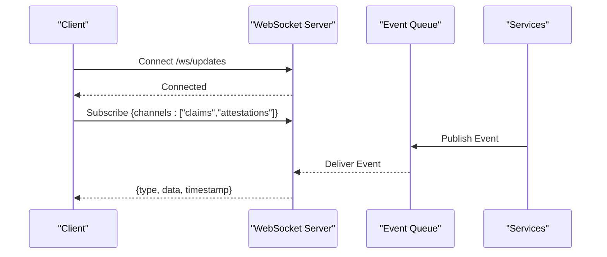
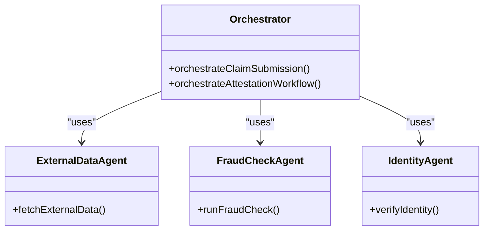
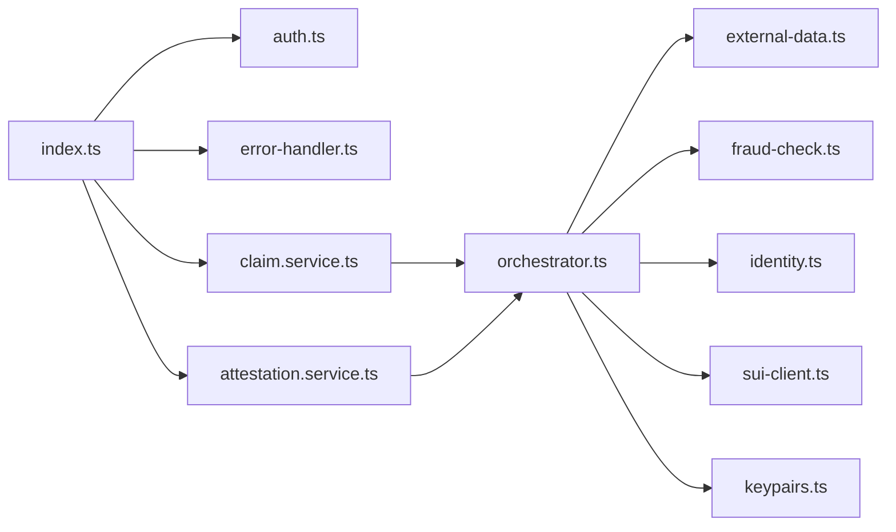

# API Reference

<cite>
**Referenced Files in This Document**
- [index.ts](file://backend/src/index.ts)
- [auth.ts](file://backend/src/middleware/auth.ts)
- [error-handler.ts](file://backend/src/middleware/error-handler.ts)
- [claim.service.ts](file://backend/src/services/claim.service.ts)
- [attestation.service.ts](file://backend/src/services/attestation.service.ts)
- [orchestrator.ts](file://backend/src/services/orchestrator.ts)
- [external-data.ts](file://backend/src/agents/external-data.ts)
- [fraud-check.ts](file://backend/src/agents/fraud-check.ts)
- [identity.ts](file://backend/src/agents/identity.ts)
- [sui-client.ts](file://backend/src/config/sui-client.ts)
- [keypairs.ts](file://backend/src/config/keypairs.ts)
- [api-client.ts](file://frontend/src/lib/api-client.ts)
- [sui-client.ts](file://frontend/src/lib/sui-client.ts)
</cite>

## Table of Contents
1. [Introduction](#introduction)
2. [Project Structure](#project-structure)
3. [Core Components](#core-components)
4. [Architecture Overview](#architecture-overview)
5. [Detailed Component Analysis](#detailed-component-analysis)
6. [Dependency Analysis](#dependency-analysis)
7. [Performance Considerations](#performance-considerations)
8. [Troubleshooting Guide](#troubleshooting-guide)
9. [Conclusion](#conclusion)
10. [Appendices](#appendices)

## Introduction
This document provides a comprehensive API reference for the Insurix backend REST API, focusing on claim submission, status tracking, and attestation management. It specifies request/response schemas, authentication methods, error codes, and operational guidance. Where applicable, it also outlines WebSocket endpoints for real-time updates, rate limiting policies, security considerations, versioning strategy, deprecation policies, migration guides, and client implementation guidelines with SDK usage examples.

## Project Structure
The backend is implemented in TypeScript under backend/src. The entry point initializes HTTP routes and middleware. Services encapsulate business logic for claims and attestations. Agents perform external data retrieval, fraud checks, and identity verification. Configuration modules manage Sui blockchain client access and keypairs.

**Diagram sources**
- [index.ts](file://backend/src/index.ts)
- [auth.ts](file://backend/src/middleware/auth.ts)
- [error-handler.ts](file://backend/src/middleware/error-handler.ts)
- [claim.service.ts](file://backend/src/services/claim.service.ts)
- [attestation.service.ts](file://backend/src/services/attestation.service.ts)
- [orchestrator.ts](file://backend/src/services/orchestrator.ts)
- [external-data.ts](file://backend/src/agents/external-data.ts)
- [fraud-check.ts](file://backend/src/agents/fraud-check.ts)
- [identity.ts](file://backend/src/agents/identity.ts)
- [sui-client.ts](file://backend/src/config/sui-client.ts)
- [keypairs.ts](file://backend/src/config/keypairs.ts)

**Section sources**
- [index.ts](file://backend/src/index.ts)
- [claim.service.ts](file://backend/src/services/claim.service.ts)
- [attestation.service.ts](file://backend/src/services/attestation.service.ts)
- [orchestrator.ts](file://backend/src/services/orchestrator.ts)
- [external-data.ts](file://backend/src/agents/external-data.ts)
- [fraud-check.ts](file://backend/src/agents/fraud-check.ts)
- [identity.ts](file://backend/src/agents/identity.ts)
- [sui-client.ts](file://backend/src/config/sui-client.ts)
- [keypairs.ts](file://backend/src/config/keypairs.ts)

## Core Components
- HTTP Server: Initializes routes, applies middleware, and exposes REST endpoints for claims and attestations.
- Authentication Middleware: Validates tokens or signatures before processing requests.
- Error Handler: Centralizes error formatting and response codes.
- Claim Service: Implements claim lifecycle operations (submit, update, query).
- Attestation Service: Manages creation, verification, and revocation of attestations.
- Orchestrator: Coordinates multi-step workflows across agents and services.
- Agents: External data fetcher, fraud checker, and identity verifier.
- Configuration: Sui client setup and keypair management for blockchain interactions.

**Section sources**
- [index.ts](file://backend/src/index.ts)
- [auth.ts](file://backend/src/middleware/auth.ts)
- [error-handler.ts](file://backend/src/middleware/error-handler.ts)
- [claim.service.ts](file://backend/src/services/claim.service.ts)
- [attestation.service.ts](file://backend/src/services/attestation.service.ts)
- [orchestrator.ts](file://backend/src/services/orchestrator.ts)
- [external-data.ts](file://backend/src/agents/external-data.ts)
- [fraud-check.ts](file://backend/src/agents/fraud-check.ts)
- [identity.ts](file://backend/src/agents/identity.ts)
- [sui-client.ts](file://backend/src/config/sui-client.ts)
- [keypairs.ts](file://backend/src/config/keypairs.ts)

## Architecture Overview
The REST API follows a layered architecture:
- Presentation Layer: HTTP server and middleware.
- Business Logic Layer: Services and orchestrator.
- Integration Layer: Agents for external systems and blockchain client.
- Configuration Layer: Sui client and keypairs.

**Diagram sources**
- [index.ts](file://backend/src/index.ts)
- [auth.ts](file://backend/src/middleware/auth.ts)
- [claim.service.ts](file://backend/src/services/claim.service.ts)
- [orchestrator.ts](file://backend/src/services/orchestrator.ts)
- [external-data.ts](file://backend/src/agents/external-data.ts)
- [fraud-check.ts](file://backend/src/agents/fendor-check.ts)
- [identity.ts](file://backend/src/agents/identity.ts)
- [sui-client.ts](file://backend/src/config/sui-client.ts)

## Detailed Component Analysis

### Authentication and Authorization
- Method: Token-based authentication via middleware.
- Flow: Requests are validated before reaching controllers; unauthorized requests receive standardized errors.
- Security: Enforces signature verification where required; secrets managed via configuration.

**Diagram sources**
- [auth.ts](file://backend/src/middleware/auth.ts)
- [error-handler.ts](file://backend/src/middleware/error-handler.ts)

**Section sources**
- [auth.ts](file://backend/src/middleware/auth.ts)
- [error-handler.ts](file://backend/src/middleware/error-handler.ts)

### Claims API
Endpoints:
- Submit Claim: POST /v1/claims
  - Request schema: { policyId, claimantId, incidentDate, description, attachments[], metadata }
  - Response schema: { claimId, status, createdAt, nextSteps[] }
  - Status codes: 201 Created, 400 Bad Request, 401 Unauthorized, 422 Unprocessable Entity, 500 Internal Server Error
- Get Claim Status: GET /v1/claims/{claimId}
  - Response schema: { claimId, status, updatedAt, events[] }
  - Status codes: 200 OK, 404 Not Found, 500 Internal Server Error
- Update Claim: PATCH /v1/claims/{claimId}
  - Request schema: { fieldsToUpdate }
  - Response schema: { claimId, updatedFields, updatedAt }
  - Status codes: 200 OK, 400 Bad Request, 404 Not Found, 500 Internal Server Error

Processing flow:
- Submission triggers orchestrator to coordinate external data retrieval, fraud checks, identity verification, and on-chain writes.

**Diagram sources**
- [claim.service.ts](file://backend/src/services/claim.service.ts)
- [orchestrator.ts](file://backend/src/services/orchestrator.ts)
- [sui-client.ts](file://backend/src/config/sui-client.ts)

**Section sources**
- [claim.service.ts](file://backend/src/services/claim.service.ts)
- [orchestrator.ts](file://backend/src/services/orchestrator.ts)

### Attestations API
Endpoints:
- Create Attestation: POST /v1/attestations
  - Request schema: { subjectId, auditorId, evidenceHash, validityPeriod, metadata }
  - Response schema: { attestationId, status, expiresAt }
  - Status codes: 201 Created, 400 Bad Request, 401 Unauthorized, 500 Internal Server Error
- Verify Attestation: GET /v1/attestations/{attestationId}/verify
  - Response schema: { valid, verifiedAt, details }
  - Status codes: 200 OK, 404 Not Found, 500 Internal Server Error
- Revoke Attestation: DELETE /v1/attestations/{attestationId}
  - Response schema: { attestationId, revokedAt }
  - Status codes: 200 OK, 404 Not Found, 500 Internal Server Error

**Diagram sources**
- [attestation.service.ts](file://backend/src/services/attestation.service.ts)
- [sui-client.ts](file://backend/src/config/sui-client.ts)

**Section sources**
- [attestation.service.ts](file://backend/src/services/attestation.service.ts)

### Real-Time Updates (WebSocket)
- Endpoint: ws://host/ws/updates
- Purpose: Stream claim status changes and attestation events.
- Messages: JSON payloads with event type, resource identifiers, and timestamps.
- Connection lifecycle: Connect, subscribe to channels, receive events, handle disconnect/reconnect.

[No diagram sources since this section describes conceptual WebSocket behavior]

### Orchestration and Agents
- Orchestrator coordinates multi-step processes:
  - External Data: Fetches supporting information from third-party APIs.
  - Fraud Check: Evaluates risk signals and returns risk score.
  - Identity Verification: Confirms claimant identity using provided credentials.
- These agents integrate with external systems and return structured results consumed by services.

**Diagram sources**
- [orchestrator.ts](file://backend/src/services/orchestrator.ts)
- [external-data.ts](file://backend/src/agents/external-data.ts)
- [fraud-check.ts](file://backend/src/agents/fraud-check.ts)
- [identity.ts](file://backend/src/agents/identity.ts)

**Section sources**
- [orchestrator.ts](file://backend/src/services/orchestrator.ts)
- [external-data.ts](file://backend/src/agents/external-data.ts)
- [fraud-check.ts](file://backend/src/agents/fraud-check.ts)
- [identity.ts](file://backend/src/agents/identity.ts)

## Dependency Analysis
The backend components exhibit clear separation of concerns:
- HTTP layer depends on middleware and services.
- Services depend on orchestrator and agents.
- Agents depend on external integrations and configuration.
- Configuration isolates Sui client and keypairs.

**Diagram sources**
- [index.ts](file://backend/src/index.ts)
- [auth.ts](file://backend/src/middleware/auth.ts)
- [error-handler.ts](file://backend/src/middleware/error-handler.ts)
- [claim.service.ts](file://backend/src/services/claim.service.ts)
- [attestation.service.ts](file://backend/src/services/attestation.service.ts)
- [orchestrator.ts](file://backend/src/services/orchestrator.ts)
- [external-data.ts](file://backend/src/agents/external-data.ts)
- [fraud-check.ts](file://backend/src/agents/fraud-check.ts)
- [identity.ts](file://backend/src/agents/identity.ts)
- [sui-client.ts](file://backend/src/config/sui-client.ts)
- [keypairs.ts](file://backend/src/config/keypairs.ts)

**Section sources**
- [index.ts](file://backend/src/index.ts)
- [claim.service.ts](file://backend/src/services/claim.service.ts)
- [attestation.service.ts](file://backend/src/services/attestation.service.ts)
- [orchestrator.ts](file://backend/src/services/orchestrator.ts)
- [external-data.ts](file://backend/src/agents/external-data.ts)
- [fraud-check.ts](file://backend/src/agents/fraud-check.ts)
- [identity.ts](file://backend/src/agents/identity.ts)
- [sui-client.ts](file://backend/src/config/sui-client.ts)
- [keypairs.ts](file://backend/src/config/keypairs.ts)

## Performance Considerations
- Use asynchronous processing for long-running tasks (e.g., external data retrieval, fraud checks).
- Implement caching for frequently accessed read-only data (e.g., policy lookups).
- Apply pagination and filtering for list endpoints to reduce payload sizes.
- Monitor and tune database queries and blockchain RPC calls.
- Employ connection pooling for external APIs and blockchain clients.

[No sources needed since this section provides general guidance]

## Troubleshooting Guide
Common issues and resolutions:
- Authentication failures: Ensure token/signature validity and correct headers.
- Validation errors: Check request schema compliance and field types.
- External service timeouts: Implement retries with backoff and circuit breakers.
- Blockchain transaction failures: Review gas settings, nonce handling, and network status.
- WebSocket disconnects: Implement reconnection logic with exponential backoff.

**Section sources**
- [error-handler.ts](file://backend/src/middleware/error-handler.ts)

## Conclusion
The Insurix backend REST API provides robust endpoints for claims and attestations, supported by an orchestrated workflow integrating external data, fraud detection, identity verification, and blockchain operations. Clear authentication, error handling, and configuration patterns ensure maintainability and scalability. Clients should follow the documented schemas and best practices for reliable integration.

[No sources needed since this section summarizes without analyzing specific files]

## Appendices

### API Versioning Strategy
- Base path includes version segment (e.g., /v1).
- Backward-compatible changes allowed within major version.
- Breaking changes require new major version and deprecation period.

[No sources needed since this section provides general guidance]

### Deprecation Policies
- Announce deprecations with advance notice.
- Provide migration guides and parallel support during grace period.
- Remove deprecated endpoints after grace period ends.

[No sources needed since this section provides general guidance]

### Migration Guides
- When upgrading versions, review changelogs for breaking changes.
- Update request/response schemas accordingly.
- Test against staging environment before production rollout.

[No sources needed since this section provides general guidance]

### Client Implementation Guidelines
- Use typed SDKs generated from OpenAPI specs when available.
- Implement retry logic with exponential backoff for transient errors.
- Handle WebSocket reconnections gracefully.
- Store sensitive keys securely and avoid logging secrets.

**Section sources**
- [api-client.ts](file://frontend/src/lib/api-client.ts)
- [sui-client.ts](file://frontend/src/lib/sui-client.ts)

### SDK Usage Examples
- Initialize SDK with environment-specific configuration.
- Authenticate using provided credentials or wallet signatures.
- Call endpoints via typed methods corresponding to REST paths.
- Subscribe to WebSocket channels for real-time updates.

**Section sources**
- [api-client.ts](file://frontend/src/lib/api-client.ts)
- [sui-client.ts](file://frontend/src/lib/sui-client.ts)