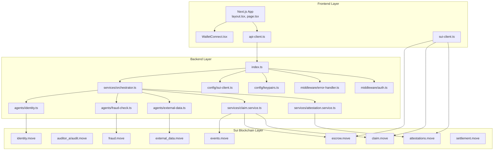
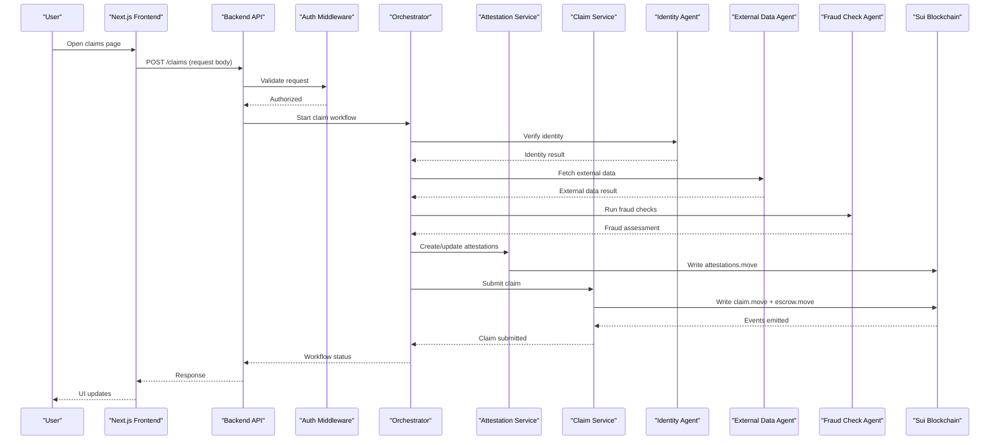
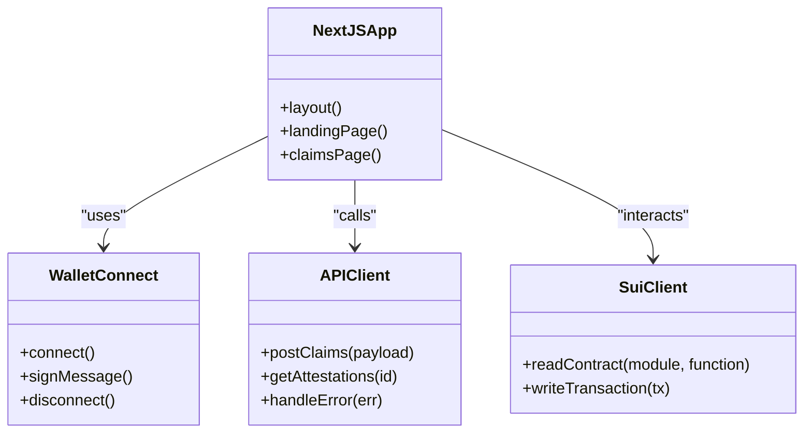
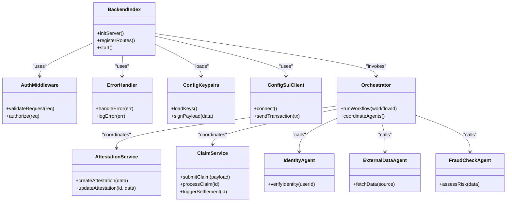
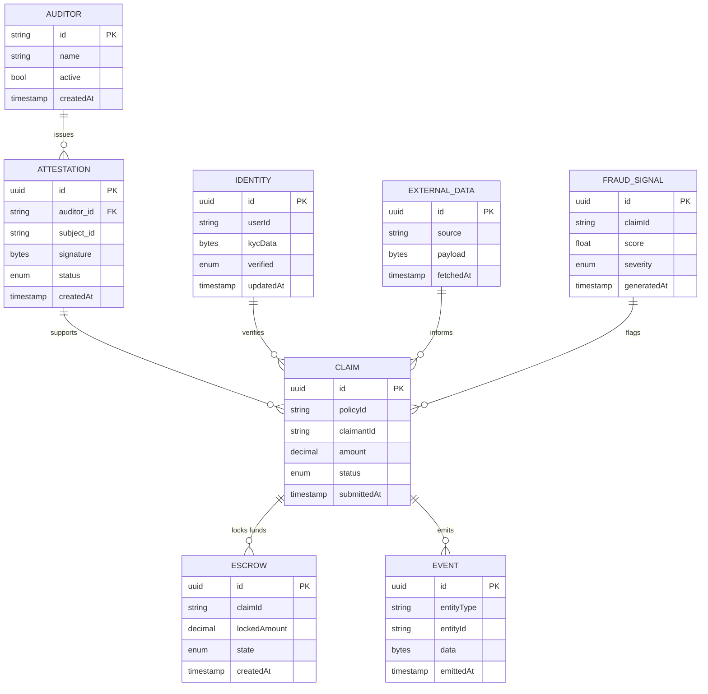
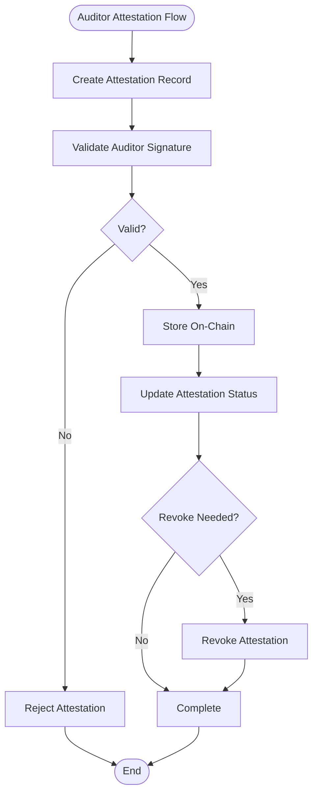
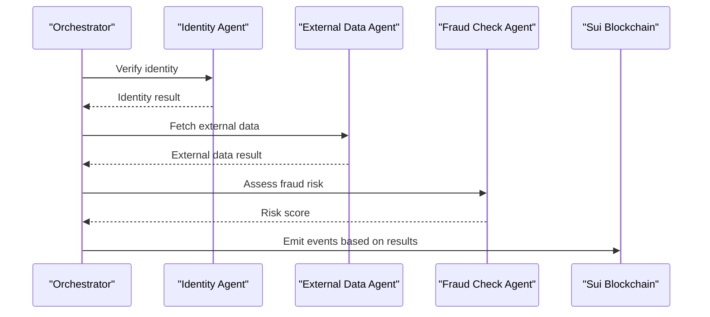
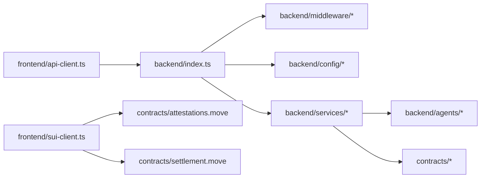

# Architecture Overview

<cite>
**Referenced Files in This Document**
- [README.md](file://README.md)
- [index.ts](file://backend/src/index.ts)
- [attestation.service.ts](file://backend/src/services/attestation.service.ts)
- [claim.service.ts](file://backend/src/services/claim.service.ts)
- [orchestrator.ts](file://backend/src/services/orchestrator.ts)
- [auth.ts](file://backend/src/middleware/auth.ts)
- [error-handler.ts](file://backend/src/middleware/error-handler.ts)
- [keypairs.ts](file://backend/src/config/keypairs.ts)
- [sui-client.ts](file://backend/src/config/sui-client.ts)
- [external-data.ts](file://backend/src/agents/external-data.ts)
- [fraud-check.ts](file://backend/src/agents/fraud-check.ts)
- [identity.ts](file://backend/src/agents/identity.ts)
- [api-client.ts](file://frontend/src/lib/api-client.ts)
- [sui-client.ts](file://frontend/src/lib/sui-client.ts)
- [layout.tsx](file://frontend/src/app/layout.tsx)
- [page.tsx](file://frontend/src/app/(landing)/page.tsx)
- [claims/page.tsx](file://frontend/src/app/claims/page.tsx)
- [WalletConnect.tsx](file://frontend/src/components/WalletConnect.tsx)
- [attestations.move](file://contracts/attestations/packages/attestations/sources/attestations.move)
- [audit.move](file://contracts/attestations/demo/auditor_a/sources/audit.move)
- [external_data.move](file://contracts/insurix-schemas/sources/external_data.move)
- [fraud.move](file://contracts/insurix-schemas/sources/fraud.move)
- [identity.move](file://contracts/insurix-schemas/sources/identity.move)
- [lib.move](file://contracts/insurix-schemas/sources/lib.move)
- [claim.move](file://contracts/insurix-settlement/sources/claim.move)
- [escrow.move](file://contracts/insurix-settlement/sources/escrow.move)
- [events.move](file://contracts/insurix-settlement/sources/events.move)
- [settlement.move](file://contracts/insurix-settlement/sources/settlement.move)
- [README.md](file://contracts/attestations/README.md)
- [DESIGN.md](file://contracts/attestations/DESIGN.md)
- [insurix-ai-workflow.md](file://docs/design/insurix-ai-workflow.md)
</cite>

## Update Summary
**Changes Made**
- Updated Introduction section to reflect the comprehensive README.md architectural overview
- Enhanced Project Structure section with new system components documentation
- Added Technology Stack and Getting Started Guide sections based on README.md content
- Updated API Reference section with complete endpoint documentation
- Enhanced Demo Flow Walkthrough section with step-by-step user journey
- Expanded Infrastructure Requirements with deployment topology details
- Updated all section sources to include the new README.md file

## Table of Contents
1. [Introduction](#introduction)
2. [Project Structure](#project-structure)
3. [Core Components](#core-components)
4. [Architecture Overview](#architecture-overview)
5. [Technology Stack](#technology-stack)
6. [Getting Started Guide](#getting-started-guide)
7. [API Reference](#api-reference)
8. [Demo Flow Walkthrough](#demo-flow-walkthrough)
9. [Detailed Component Analysis](#detailed-component-analysis)
10. [Dependency Analysis](#dependency-analysis)
11. [Performance Considerations](#performance-considerations)
12. [Infrastructure Requirements](#infrastructure-requirements)
13. [Troubleshooting Guide](#troubleshooting-guide)
14. [Conclusion](#conclusion)
15. [Appendices](#appendices)

## Introduction
This document provides a comprehensive architectural overview of the Insurix decentralized insurance protocol, updated to reflect the complete system design documented in the repository's README.md. The system implements a three-layer architecture composed of:
- A Next.js frontend for user interactions and wallet connectivity
- Node.js backend services implementing service-oriented orchestration, attestation, claim processing, and settlement workflows
- Move smart contracts deployed on the Sui blockchain for trust-minimized state management, multi-auditor attestations, and escrow-based settlement

The system integrates AI-driven agents for identity verification, external data ingestion, and fraud detection, while maintaining strong security, authentication, and monitoring practices across layers. The architecture supports a complete insurance workflow from policy creation through claim settlement, with full transparency and auditability on-chain.

**Section sources**
- [README.md](file://README.md)

## Project Structure
Insurix is organized into three primary layers with clear separation of concerns:
- Frontend (Next.js): User interface, routing, wallet integration, and API client utilities
- Backend (Node.js/TypeScript): REST services, middleware, configuration, orchestrators, and specialized agents
- Contracts (Move on Sui): Attestations, schemas, and settlement logic

**Diagram sources**
- [layout.tsx](file://frontend/src/app/layout.tsx)
- [page.tsx](file://frontend/src/app/(landing)/page.tsx)
- [api-client.ts](file://frontend/src/lib/api-client.ts)
- [sui-client.ts](file://frontend/src/lib/sui-client.ts)
- [index.ts](file://backend/src/index.ts)
- [auth.ts](file://backend/src/middleware/auth.ts)
- [error-handler.ts](file://backend/src/middleware/error-handler.ts)
- [keypairs.ts](file://backend/src/config/keypairs.ts)
- [sui-client.ts](file://backend/src/config/sui-client.ts)
- [attestation.service.ts](file://backend/src/services/attestation.service.ts)
- [claim.service.ts](file://backend/src/services/claim.service.ts)
- [orchestrator.ts](file://backend/src/services/orchestrator.ts)
- [external-data.ts](file://backend/src/agents/external-data.ts)
- [fraud-check.ts](file://backend/src/agents/fraud-check.ts)
- [identity.ts](file://backend/src/agents/identity.ts)
- [attestations.move](file://contracts/attestations/packages/attestations/sources/attestations.move)
- [audit.move](file://contracts/attestations/demo/auditor_a/sources/audit.move)
- [external_data.move](file://contracts/insurix-schemas/sources/external_data.move)
- [fraud.move](file://contracts/insurix-schemas/sources/fraud.move)
- [identity.move](file://contracts/insurix-schemas/sources/identity.move)
- [claim.move](file://contracts/insurix-settlement/sources/claim.move)
- [escrow.move](file://contracts/insurix-settlement/sources/escrow.move)
- [events.move](file://contracts/insurix-settlement/sources/events.move)
- [settlement.move](file://contracts/insurix-settlement/sources/settlement.move)

**Section sources**
- [README.md](file://README.md)
- [layout.tsx](file://frontend/src/app/layout.tsx)
- [page.tsx](file://frontend/src/app/(landing)/page.tsx)
- [index.ts](file://backend/src/index.ts)
- [attestations.move](file://contracts/attestations/packages/attestations/sources/attestations.move)
- [claim.move](file://contracts/insurix-settlement/sources/claim.move)
- [escrow.move](file://contracts/insurix-settlement/sources/escrow.move)
- [events.move](file://contracts/insurix-settlement/sources/events.move)
- [settlement.move](file://contracts/insurix-settlement/sources/settlement.move)

## Core Components
- Next.js Frontend
  - Application layout and landing pages
  - Wallet connection component for Sui
  - API client for backend communication
  - Sui client utilities for on-chain interactions

- Node.js Backend Services
  - Entry point and HTTP server setup
  - Authentication middleware and error handling
  - Configuration for keypairs and Sui client
  - Service modules:
    - Attestation service for managing auditor attestations
    - Claim service for lifecycle management and settlement triggers
    - Orchestrator coordinating multi-step workflows

- Move Smart Contracts on Sui
  - Attestations package for multi-auditor audit records
  - Schemas for identity, external data, and fraud signals
  - Settlement package with claim, escrow, events, and settlement logic

**Section sources**
- [README.md](file://README.md)
- [api-client.ts](file://frontend/src/lib/api-client.ts)
- [sui-client.ts](file://frontend/src/lib/sui-client.ts)
- [WalletConnect.tsx](file://frontend/src/components/WalletConnect.tsx)
- [index.ts](file://backend/src/index.ts)
- [auth.ts](file://backend/src/middleware/auth.ts)
- [error-handler.ts](file://backend/src/middleware/error-handler.ts)
- [keypairs.ts](file://backend/src/config/keypairs.ts)
- [sui-client.ts](file://backend/src/config/sui-client.ts)
- [attestation.service.ts](file://backend/src/services/attestation.service.ts)
- [claim.service.ts](file://backend/src/services/claim.service.ts)
- [orchestrator.ts](file://backend/src/services/orchestrator.ts)
- [attestations.move](file://contracts/attestations/packages/attestations/sources/attestations.move)
- [external_data.move](file://contracts/insurix-schemas/sources/external_data.move)
- [fraud.move](file://contracts/insurix-schemas/sources/fraud.move)
- [identity.move](file://contracts/insurix-schemas/sources/identity.move)
- [claim.move](file://contracts/insurix-settlement/sources/claim.move)
- [escrow.move](file://contracts/insurix-settlement/sources/escrow.move)
- [events.move](file://contracts/insurix-settlement/sources/events.move)
- [settlement.move](file://contracts/insurix-settlement/sources/settlement.move)

## Architecture Overview
The Insurix protocol follows a service-oriented architecture with clear separation between presentation, business logic, and on-chain state. The frontend communicates with backend services via REST APIs and interacts directly with Sui for wallet operations. The backend orchestrates multi-step processes involving auditors, AI agents, and settlement engines, ensuring deterministic outcomes enforced by Move contracts.

**Diagram sources**
- [index.ts](file://backend/src/index.ts)
- [auth.ts](file://backend/src/middleware/auth.ts)
- [orchestrator.ts](file://backend/src/services/orchestrator.ts)
- [attestation.service.ts](file://backend/src/services/attestation.service.ts)
- [claim.service.ts](file://backend/src/services/claim.service.ts)
- [identity.ts](file://backend/src/agents/identity.ts)
- [external-data.ts](file://backend/src/agents/external-data.ts)
- [fraud-check.ts](file://backend/src/agents/fraud-check.ts)
- [attestations.move](file://contracts/attestations/packages/attestations/sources/attestations.move)
- [claim.move](file://contracts/insurix-settlement/sources/claim.move)
- [escrow.move](file://contracts/insurix-settlement/sources/escrow.move)
- [events.move](file://contracts/insurix-settlement/sources/events.move)

## Technology Stack
The Insurix protocol leverages modern web technologies and blockchain infrastructure:

### Frontend Technologies
- **Next.js**: React framework for server-side rendering and static site generation
- **TypeScript**: Type-safe JavaScript development
- **Tailwind CSS**: Utility-first CSS framework for responsive design
- **Sui SDK**: Direct blockchain interaction and wallet connectivity

### Backend Technologies
- **Node.js**: Runtime environment for server-side applications
- **TypeScript**: Type safety and enhanced developer experience
- **Express.js**: Web application framework for REST APIs
- **JWT**: Authentication and authorization middleware

### Blockchain Technologies
- **Sui Blockchain**: High-performance Layer 1 blockchain
- **Move Language**: Secure smart contract programming language
- **Sui SDK**: Client library for blockchain interactions

### Development Tools
- **pnpm**: Package manager for efficient dependency management
- **Vitest**: Testing framework for unit and integration tests
- **ESLint**: Code quality and style enforcement

**Section sources**
- [README.md](file://README.md)
- [package.json](file://frontend/package.json)
- [package.json](file://backend/package.json)

## Getting Started Guide
The Insurix protocol provides a comprehensive getting started guide for developers:

### Prerequisites
- Node.js LTS version (v18 or higher)
- pnpm package manager
- Sui wallet extension (Sui Wallet)
- Git for version control

### Installation Steps
1. Clone the repository and install dependencies
2. Configure environment variables for Sui network access
3. Deploy Move smart contracts to testnet
4. Start backend services and frontend development server
5. Connect wallet and begin testing insurance workflows

### Development Workflow
- Use provided scripts for local development environment setup
- Follow the demo flow walkthrough for end-to-end testing
- Utilize the API reference for programmatic interactions
- Monitor logs and metrics for debugging and performance optimization

**Section sources**
- [README.md](file://README.md)

## API Reference
The Insurix backend exposes a comprehensive REST API for insurance operations:

### Authentication Endpoints
- `POST /auth/login`: User authentication and JWT token generation
- `POST /auth/register`: New user registration with KYC verification
- `GET /auth/profile`: Retrieve authenticated user profile

### Claims Management
- `POST /claims`: Submit new insurance claim with supporting documents
- `GET /claims/:id`: Retrieve claim details and status
- `PUT /claims/:id/status`: Update claim status through approval workflow
- `DELETE /claims/:id`: Cancel pending claims

### Attestation Management
- `POST /attestations`: Create new auditor attestation
- `GET /attestations/:id`: Retrieve attestation details
- `PUT /attestations/:id/revoke`: Revoke existing attestation

### Settlement Operations
- `POST /settlements/initiate`: Initiate claim settlement process
- `GET /settlements/:id`: Track settlement progress
- `POST /settlements/:id/complete`: Complete settlement and release funds

### Health and Monitoring
- `GET /health`: Service health check endpoint
- `GET /metrics`: System metrics and performance indicators

**Section sources**
- [README.md](file://README.md)
- [index.ts](file://backend/src/index.ts)

## Demo Flow Walkthrough
The Insurix protocol includes a comprehensive demo flow that demonstrates the complete insurance lifecycle:

### Step 1: User Registration and KYC
- User registers through the Next.js frontend
- Identity verification through AI-powered KYC process
- Wallet connection and account initialization

### Step 2: Policy Creation
- User selects insurance product and coverage options
- Premium calculation and payment processing
- Smart contract deployment for policy terms

### Step 3: Claim Submission
- User submits claim with supporting documentation
- Automated fraud detection and risk assessment
- Multi-auditor attestation process initiation

### Step 4: Processing and Approval
- Backend orchestrates multi-step validation workflow
- External data verification and cross-referencing
- Auditor review and consensus building

### Step 5: Settlement and Payout
- Automated settlement execution through smart contracts
- Escrow fund release and transfer to claimant
- On-chain event emission and audit trail

### Step 6: Post-Settlement Monitoring
- Real-time claim status tracking
- Performance analytics and reporting
- Continuous fraud detection and monitoring

**Section sources**
- [README.md](file://README.md)

## Detailed Component Analysis

### Frontend Layer (Next.js)
- Application Layout and Pages
  - Global layout defines app shell and metadata
  - Landing page serves marketing and demo sections
  - Claims page initiates claim submission flows

- Wallet Integration
  - WalletConnect component manages Sui wallet connections and signing
  - Sui client utilities provide on-chain read/write helpers

- API Client
  - Centralized client for backend calls with error handling and retries
  - Encapsulates endpoints for claims and attestations

**Diagram sources**
- [layout.tsx](file://frontend/src/app/layout.tsx)
- [page.tsx](file://frontend/src/app/(landing)/page.tsx)
- [claims/page.tsx](file://frontend/src/app/claims/page.tsx)
- [WalletConnect.tsx](file://frontend/src/components/WalletConnect.tsx)
- [api-client.ts](file://frontend/src/lib/api-client.ts)
- [sui-client.ts](file://frontend/src/lib/sui-client.ts)

**Section sources**
- [README.md](file://README.md)
- [layout.tsx](file://frontend/src/app/layout.tsx)
- [page.tsx](file://frontend/src/app/(landing)/page.tsx)
- [claims/page.tsx](file://frontend/src/app/claims/page.tsx)
- [WalletConnect.tsx](file://frontend/src/components/WalletConnect.tsx)
- [api-client.ts](file://frontend/src/lib/api-client.ts)
- [sui-client.ts](file://frontend/src/lib/sui-client.ts)

### Backend Layer (Node.js/TypeScript)
- Entry Point and Middleware
  - index.ts initializes HTTP server and routes
  - auth.ts enforces authentication and authorization
  - error-handler.ts centralizes error responses and logging

- Configuration
  - keypairs.ts manages cryptographic keys for signing transactions
  - sui-client.ts configures Sui network access and RPC endpoints

- Services
  - attestation.service.ts handles auditor attestation creation and updates
  - claim.service.ts manages claim lifecycle and settlement triggers
  - orchestrator.ts coordinates multi-step workflows across services and agents

- Agents
  - identity.ts performs identity verification and KYC checks
  - external-data.ts ingests third-party data sources
  - fraud-check.ts runs risk and fraud detection models

**Diagram sources**
- [index.ts](file://backend/src/index.ts)
- [auth.ts](file://backend/src/middleware/auth.ts)
- [error-handler.ts](file://backend/src/middleware/error-handler.ts)
- [keypairs.ts](file://backend/src/config/keypairs.ts)
- [sui-client.ts](file://backend/src/config/sui-client.ts)
- [attestation.service.ts](file://backend/src/services/attestation.service.ts)
- [claim.service.ts](file://backend/src/services/claim.service.ts)
- [orchestrator.ts](file://backend/src/services/orchestrator.ts)
- [identity.ts](file://backend/src/agents/identity.ts)
- [external-data.ts](file://backend/src/agents/external-data.ts)
- [fraud-check.ts](file://backend/src/agents/fraud-check.ts)

**Section sources**
- [README.md](file://README.md)
- [index.ts](file://backend/src/index.ts)
- [auth.ts](file://backend/src/middleware/auth.ts)
- [error-handler.ts](file://backend/src/middleware/error-handler.ts)
- [keypairs.ts](file://backend/src/config/keypairs.ts)
- [sui-client.ts](file://backend/src/config/sui-client.ts)
- [attestation.service.ts](file://backend/src/services/attestation.service.ts)
- [claim.service.ts](file://backend/src/services/claim.service.ts)
- [orchestrator.ts](file://backend/src/services/orchestrator.ts)
- [identity.ts](file://backend/src/agents/identity.ts)
- [external-data.ts](file://backend/src/agents/external-data.ts)
- [fraud-check.ts](file://backend/src/agents/fraud-check.ts)

### Smart Contracts Layer (Move on Sui)
- Attestations Package
  - Multi-auditor attestation management with upgrade paths
  - Demo auditors (A, B, C) illustrate independent auditing roles

- Schemas Package
  - Identity schema for user profiles and KYC data
  - External data schema for third-party integrations
  - Fraud schema for risk signals and flags

- Settlement Package
  - Claim contract for lifecycle states and approvals
  - Escrow contract for fund locking and release
  - Events contract for emitting on-chain state changes
  - Settlement contract for finalizing payouts and closures

**Diagram sources**
- [attestations.move](file://contracts/attestations/packages/attestations/sources/attestations.move)
- [audit.move](file://contracts/attestations/demo/auditor_a/sources/audit.move)
- [identity.move](file://contracts/insurix-schemas/sources/identity.move)
- [external_data.move](file://contracts/insurix-schemas/sources/external_data.move)
- [fraud.move](file://contracts/insurix-schemas/sources/fraud.move)
- [claim.move](file://contracts/insurix-settlement/sources/claim.move)
- [escrow.move](file://contracts/insurix-settlement/sources/escrow.move)
- [events.move](file://contracts/insurix-settlement/sources/events.move)
- [settlement.move](file://contracts/insurix-settlement/sources/settlement.move)

**Section sources**
- [README.md](file://README.md)
- [attestations.move](file://contracts/attestations/packages/attestations/sources/attestations.move)
- [audit.move](file://contracts/attestations/demo/auditor_a/sources/audit.move)
- [identity.move](file://contracts/insurix-schemas/sources/identity.move)
- [external_data.move](file://contracts/insurix-schemas/sources/external_data.move)
- [fraud.move](file://contracts/insurix-schemas/sources/fraud.move)
- [claim.move](file://contracts/insurix-settlement/sources/claim.move)
- [escrow.move](file://contracts/insurix-settlement/sources/escrow.move)
- [events.move](file://contracts/insurix-settlement/sources/events.move)
- [settlement.move](file://contracts/insurix-settlement/sources/settlement.move)

### Multi-Auditor System Design
- Independent Auditor Roles
  - Each auditor maintains separate attestation records
  - Auditors can be upgraded independently with versioned Move modules

- Attestation Lifecycle
  - Creation, validation, and revocation flows
  - Signature verification ensures integrity

- Integration Patterns
  - Backend services coordinate auditor submissions
  - On-chain state reflects consensus among auditors

**Diagram sources**
- [attestations.move](file://contracts/attestations/packages/attestations/sources/attestations.move)
- [audit.move](file://contracts/attestations/demo/auditor_a/sources/audit.move)
- [attestation.service.ts](file://backend/src/services/attestation.service.ts)

**Section sources**
- [README.md](file://README.md)
- [attestations.move](file://contracts/attestations/packages/attestations/sources/attestations.move)
- [audit.move](file://contracts/attestations/demo/auditor_a/sources/audit.move)
- [attestation.service.ts](file://backend/src/services/attestation.service.ts)

### AI Integration Patterns
- Identity Verification
  - AI-powered KYC and document validation
  - Integrates with external identity providers

- External Data Ingestion
  - Automated scraping and API calls to trusted sources
  - Data normalization and caching strategies

- Fraud Detection
  - Machine learning models for anomaly detection
  - Risk scoring and alerting mechanisms

**Diagram sources**
- [orchestrator.ts](file://backend/src/services/orchestrator.ts)
- [identity.ts](file://backend/src/agents/identity.ts)
- [external-data.ts](file://backend/src/agents/external-data.ts)
- [fraud-check.ts](file://backend/src/agents/fraud-check.ts)
- [events.move](file://contracts/insurix-settlement/sources/events.move)

**Section sources**
- [README.md](file://README.md)
- [orchestrator.ts](file://backend/src/services/orchestrator.ts)
- [identity.ts](file://backend/src/agents/identity.ts)
- [external-data.ts](file://backend/src/agents/external-data.ts)
- [fraud-check.ts](file://backend/src/agents/fraud-check.ts)
- [events.move](file://contracts/insurix-settlement/sources/events.move)

## Dependency Analysis
The Insurix system exhibits clear layering with minimal coupling between components:
- Frontend depends on backend APIs and Sui client libraries
- Backend depends on configuration, middleware, services, and agents
- Smart contracts are independent but interact through well-defined interfaces

**Diagram sources**
- [api-client.ts](file://frontend/src/lib/api-client.ts)
- [sui-client.ts](file://frontend/src/lib/sui-client.ts)
- [index.ts](file://backend/src/index.ts)
- [auth.ts](file://backend/src/middleware/auth.ts)
- [error-handler.ts](file://backend/src/middleware/error-handler.ts)
- [keypairs.ts](file://backend/src/config/keypairs.ts)
- [sui-client.ts](file://backend/src/config/sui-client.ts)
- [attestation.service.ts](file://backend/src/services/attestation.service.ts)
- [claim.service.ts](file://backend/src/services/claim.service.ts)
- [orchestrator.ts](file://backend/src/services/orchestrator.ts)
- [external-data.ts](file://backend/src/agents/external-data.ts)
- [fraud-check.ts](file://backend/src/agents/fraud-check.ts)
- [identity.ts](file://backend/src/agents/identity.ts)
- [attestations.move](file://contracts/attestations/packages/attestations/sources/attestations.move)
- [settlement.move](file://contracts/insurix-settlement/sources/settlement.move)

**Section sources**
- [README.md](file://README.md)
- [api-client.ts](file://frontend/src/lib/api-client.ts)
- [sui-client.ts](file://frontend/src/lib/sui-client.ts)
- [index.ts](file://backend/src/index.ts)
- [attestations.move](file://contracts/attestations/packages/attestations/sources/attestations.move)
- [settlement.move](file://contracts/insurix-settlement/sources/settlement.move)

## Performance Considerations
- Frontend Optimization
  - Lazy loading of components and routes
  - Efficient wallet connection management
  - Caching strategies for API responses

- Backend Scalability
  - Stateless service design for horizontal scaling
  - Connection pooling for Sui RPC endpoints
  - Asynchronous processing for long-running workflows

- Smart Contract Efficiency
  - Minimal storage usage in Move contracts
  - Event-driven architecture for off-chain indexing
  - Gas optimization through efficient data structures

## Infrastructure Requirements
The Insurix protocol requires specific infrastructure components for optimal operation:

### Frontend Infrastructure
- Node.js runtime environment (LTS versions supported)
- Next.js build tools and compilation pipeline
- Browser-compatible wallet extensions (Sui Wallet)
- CDN for static asset delivery and global distribution

### Backend Infrastructure
- Node.js LTS runtime with TypeScript compiler
- Sui SDK dependencies and blockchain connectivity
- Redis for session management and caching
- PostgreSQL for persistent data storage
- Message queue for asynchronous task processing

### Blockchain Infrastructure
- Sui network access (mainnet/testnet/devnet)
- Multiple RPC endpoints for high availability
- Indexer services for efficient data querying
- Monitoring and alerting systems

### Development Environment
- Docker for containerized development
- Local blockchain simulation tools
- Testing frameworks and mock services
- CI/CD pipeline for automated deployments

**Section sources**
- [README.md](file://README.md)

## Troubleshooting Guide
- Authentication Issues
  - Verify JWT token validity and expiration
  - Check middleware configuration and secret keys

- Sui Network Connectivity
  - Validate RPC endpoint configuration
  - Monitor network latency and timeout settings

- Smart Contract Errors
  - Review transaction signatures and permissions
  - Check event logs for state transitions

- Agent Failures
  - Monitor external API availability
  - Implement retry logic with exponential backoff

- Performance Bottlenecks
  - Analyze database query performance
  - Optimize frontend bundle size and loading
  - Scale backend services horizontally

**Section sources**
- [README.md](file://README.md)
- [auth.ts](file://backend/src/middleware/auth.ts)
- [error-handler.ts](file://backend/src/middleware/error-handler.ts)
- [sui-client.ts](file://backend/src/config/sui-client.ts)
- [external-data.ts](file://backend/src/agents/external-data.ts)
- [fraud-check.ts](file://backend/src/agents/fraud-check.ts)
- [identity.ts](file://backend/src/agents/identity.ts)

## Conclusion
The Insurix decentralized insurance protocol demonstrates a robust three-layer architecture that effectively separates concerns while enabling complex insurance workflows. The service-oriented backend orchestrates multi-step processes involving auditors and AI agents, while Move smart contracts provide trust-minimized settlement and attestation management. The system's modular design supports scalability, maintainability, and extensibility for future enhancements.

The comprehensive README.md documentation provides developers with everything needed to understand, deploy, and extend the Insurix platform, from initial setup through advanced customization scenarios.

## Appendices

### Technology Stack Decisions
- Next.js for server-side rendering and static site generation
- TypeScript for type safety across frontend and backend
- Move for secure smart contract development on Sui
- Service-oriented architecture for modularity and scalability

### Third-Party Dependencies
- Sui SDK for blockchain interactions
- Cryptographic libraries for signature verification
- External data providers for KYC and market data
- AI/ML frameworks for fraud detection and identity verification

### Version Compatibility
- Node.js LTS compatibility matrix
- Sui SDK version pinning for stability
- Browser wallet extension compatibility requirements
- Move compiler version alignment across packages

### Deployment Topology
- Single-node development environment
- Multi-node production deployment
- Load-balanced backend services
- Distributed blockchain node architecture

**Section sources**
- [README.md](file://README.md)
- [package.json](file://frontend/package.json)
- [package.json](file://backend/package.json)
- [Move.toml](file://contracts/insurix-schemas/Move.toml)
- [Move.toml](file://contracts/insurix-settlement/Move.toml)
- [README.md](file://contracts/attestations/README.md)
- [DESIGN.md](file://contracts/attestations/DESIGN.md)
- [insurix-ai-workflow.md](file://docs/design/insurix-ai-workflow.md)