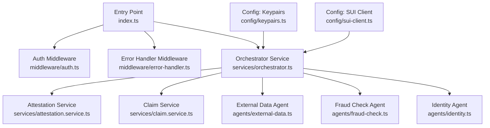
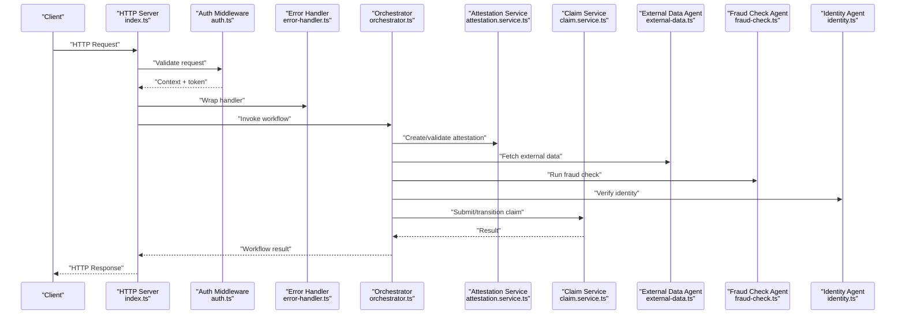
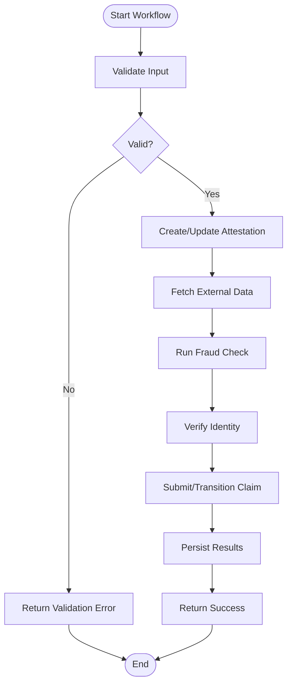
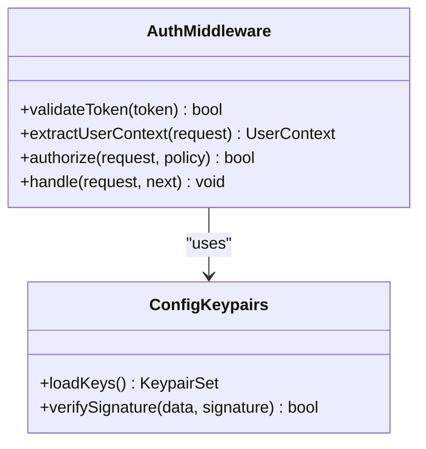
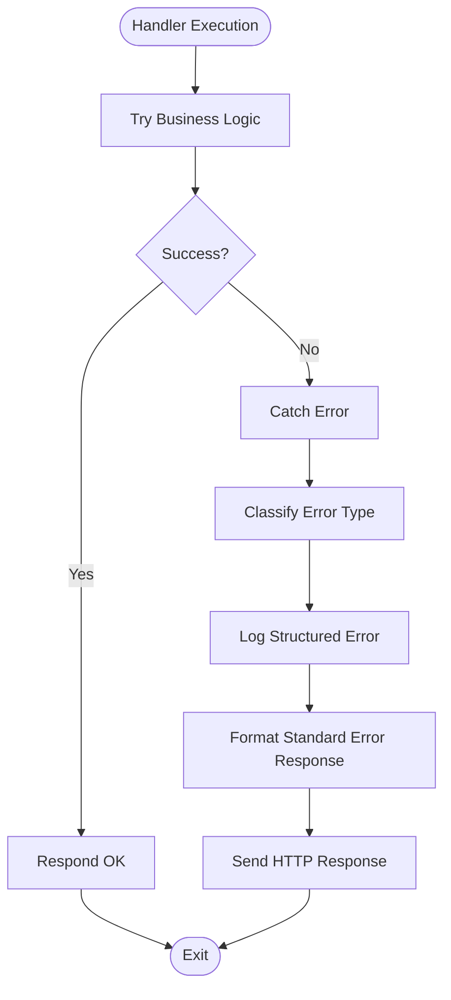
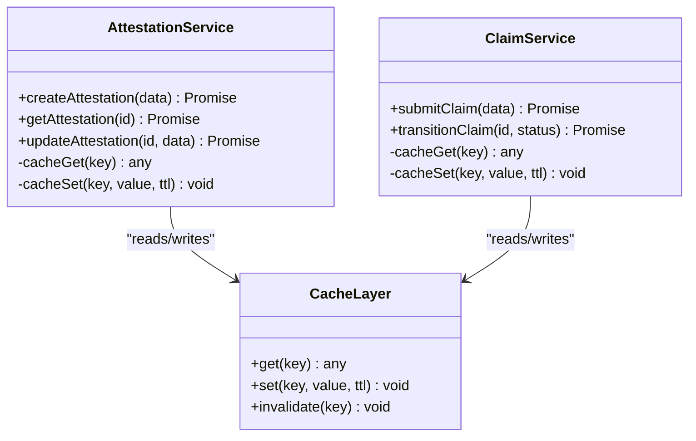
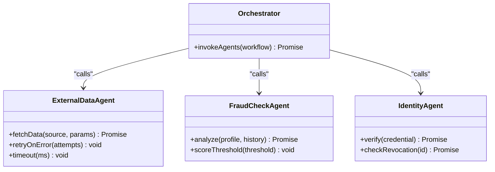
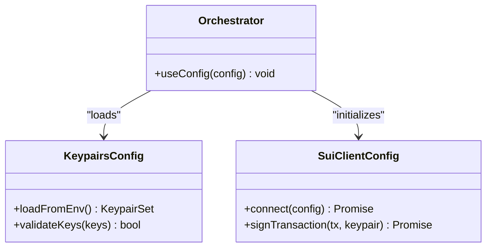
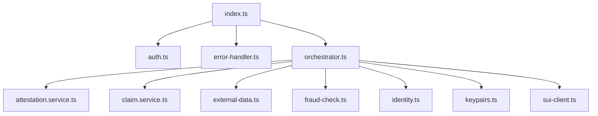

# Backend Services Architecture

<cite>
**Referenced Files in This Document**
- [index.ts](file://backend/src/index.ts)
- [orchestrator.ts](file://backend/src/services/orchestrator.ts)
- [attestation.service.ts](file://backend/src/services/attestation.service.ts)
- [claim.service.ts](file://backend/src/services/claim.service.ts)
- [auth.ts](file://backend/src/middleware/auth.ts)
- [error-handler.ts](file://backend/src/middleware/error-handler.ts)
- [external-data.ts](file://backend/src/agents/external-data.ts)
- [fraud-check.ts](file://backend/src/agents/fraud-check.ts)
- [identity.ts](file://backend/src/agents/identity.ts)
- [keypairs.ts](file://backend/src/config/keypairs.ts)
- [sui-client.ts](file://backend/src/config/sui-client.ts)
</cite>

## Table of Contents
1. [Introduction](#introduction)
2. [Project Structure](#project-structure)
3. [Core Components](#core-components)
4. [Architecture Overview](#architecture-overview)
5. [Detailed Component Analysis](#detailed-component-analysis)
6. [Dependency Analysis](#dependency-analysis)
7. [Performance Considerations](#performance-considerations)
8. [Troubleshooting Guide](#troubleshooting-guide)
9. [Conclusion](#conclusion)

## Introduction
This document describes the backend services architecture for Insurix, focusing on a service-oriented design with an orchestrator pattern, middleware stack, and dependency injection. It explains RESTful API design, authentication middleware, error handling strategies, database connectivity, caching mechanisms, external service integrations, configuration management, environment-specific settings, secret handling, logging, monitoring, performance profiling, scalability, load balancing, and microservice communication patterns. The goal is to provide both high-level architectural insights and detailed component analysis to help developers understand, extend, and operate the system effectively.

## Project Structure
The backend resides under backend/src and is organized by concerns:
- Entry point and server bootstrap
- Services implementing business logic (attestation, claim, orchestrator)
- Agents for external data, fraud checks, and identity verification
- Middleware for authentication and centralized error handling
- Configuration for keypairs and SUI client setup

**Diagram sources**
- [index.ts](file://backend/src/index.ts)
- [auth.ts](file://backend/src/middleware/auth.ts)
- [error-handler.ts](file://backend/src/middleware/error-handler.ts)
- [orchestrator.ts](file://backend/src/services/orchestrator.ts)
- [attestation.service.ts](file://backend/src/services/attestation.service.ts)
- [claim.service.ts](file://backend/src/services/claim.service.ts)
- [external-data.ts](file://backend/src/agents/external-data.ts)
- [fraud-check.ts](file://backend/src/agents/fraud-check.ts)
- [identity.ts](file://backend/src/agents/identity.ts)
- [keypairs.ts](file://backend/src/config/keypairs.ts)
- [sui-client.ts](file://backend/src/config/sui-client.ts)

**Section sources**
- [index.ts](file://backend/src/index.ts)
- [orchestrator.ts](file://backend/src/services/orchestrator.ts)
- [attestation.service.ts](file://backend/src/services/attestation.service.ts)
- [claim.service.ts](file://backend/src/services/claim.service.ts)
- [auth.ts](file://backend/src/middleware/auth.ts)
- [error-handler.ts](file://backend/src/middleware/error-handler.ts)
- [external-data.ts](file://backend/src/agents/external-data.ts)
- [fraud-check.ts](file://backend/src/agents/fraud-check.ts)
- [identity.ts](file://backend/src/agents/identity.ts)
- [keypairs.ts](file://backend/src/config/keypairs.ts)
- [sui-client.ts](file://backend/src/config/sui-client.ts)

## Core Components
- Orchestrator Service: Central coordinator that composes workflows across attestation, claim processing, and agent calls. It manages dependencies, sequencing, retries, and error propagation.
- Attestation Service: Encapsulates attestation lifecycle operations such as creation, validation, and storage.
- Claim Service: Handles claim submission, validation, state transitions, and settlement coordination.
- Authentication Middleware: Validates requests, enforces authorization policies, and injects user context into downstream handlers.
- Error Handler Middleware: Centralizes error formatting, logging, and response standardization.
- Agents: External-facing modules for data retrieval, fraud detection, and identity verification.
- Configuration: Secure loading of keypairs and SUI client settings from environment variables or secrets managers.

Key responsibilities and interactions are illustrated below.

**Section sources**
- [orchestrator.ts](file://backend/src/services/orchestrator.ts)
- [attestation.service.ts](file://backend/src/services/attestation.service.ts)
- [claim.service.ts](file://backend/src/services/claim.service.ts)
- [auth.ts](file://backend/src/middleware/auth.ts)
- [error-handler.ts](file://backend/src/middleware/error-handler.ts)
- [external-data.ts](file://backend/src/agents/external-data.ts)
- [fraud-check.ts](file://backend/src/agents/fraud-check.ts)
- [identity.ts](file://backend/src/agents/identity.ts)
- [keypairs.ts](file://backend/src/config/keypairs.ts)
- [sui-client.ts](file://backend/src/config/sui-client.ts)

## Architecture Overview
The backend follows a service-oriented architecture with an orchestrator coordinating domain services and agents. Middleware provides cross-cutting concerns like authentication and error handling. Configuration is injected into services and agents to ensure environment-specific behavior and secure secret handling.

**Diagram sources**
- [index.ts](file://backend/src/index.ts)
- [auth.ts](file://backend/src/middleware/auth.ts)
- [error-handler.ts](file://backend/src/middleware/error-handler.ts)
- [orchestrator.ts](file://backend/src/services/orchestrator.ts)
- [attestation.service.ts](file://backend/src/services/attestation.service.ts)
- [claim.service.ts](file://backend/src/services/claim.service.ts)
- [external-data.ts](file://backend/src/agents/external-data.ts)
- [fraud-check.ts](file://backend/src/agents/fraud-check.ts)
- [identity.ts](file://backend/src/agents/identity.ts)

## Detailed Component Analysis

### Orchestrator Pattern
The orchestrator coordinates multi-step workflows across services and agents. It encapsulates business process logic, handles sequencing, retries, and error aggregation, and ensures consistent responses.

**Diagram sources**
- [orchestrator.ts](file://backend/src/services/orchestrator.ts)
- [attestation.service.ts](file://backend/src/services/attestation.service.ts)
- [external-data.ts](file://backend/src/agents/external-data.ts)
- [fraud-check.ts](file://backend/src/agents/fraud-check.ts)
- [identity.ts](file://backend/src/agents/identity.ts)
- [claim.service.ts](file://backend/src/services/claim.service.ts)

**Section sources**
- [orchestrator.ts](file://backend/src/services/orchestrator.ts)

### Authentication Middleware
Authentication validates tokens, extracts user context, and enforces authorization rules before routing to handlers. It integrates with configuration for signing keys and issuer settings.

**Diagram sources**
- [auth.ts](file://backend/src/middleware/auth.ts)
- [keypairs.ts](file://backend/src/config/keypairs.ts)

**Section sources**
- [auth.ts](file://backend/src/middleware/auth.ts)
- [keypairs.ts](file://backend/src/config/keypairs.ts)

### Error Handling Strategy
Centralized error handling normalizes errors, logs details, and returns consistent HTTP responses. It supports custom error types and structured logging for observability.

**Diagram sources**
- [error-handler.ts](file://backend/src/middleware/error-handler.ts)

**Section sources**
- [error-handler.ts](file://backend/src/middleware/error-handler.ts)

### Database Connectivity and Caching
Database access is abstracted through services and agents. Caching can be implemented at the service layer to reduce latency and external calls. Typical patterns include read-through caches, write-behind updates, and TTL-based invalidation.

[No sources needed since this diagram shows conceptual caching patterns]

### External Service Integrations
Agents encapsulate external calls for data retrieval, fraud checks, and identity verification. They handle retries, timeouts, and circuit breakers to improve resilience.

**Diagram sources**
- [external-data.ts](file://backend/src/agents/external-data.ts)
- [fraud-check.ts](file://backend/src/agents/fraud-check.ts)
- [identity.ts](file://backend/src/agents/identity.ts)
- [orchestrator.ts](file://backend/src/services/orchestrator.ts)

**Section sources**
- [external-data.ts](file://backend/src/agents/external-data.ts)
- [fraud-check.ts](file://backend/src/agents/fraud-check.ts)
- [identity.ts](file://backend/src/agents/identity.ts)
- [orchestrator.ts](file://backend/src/services/orchestrator.ts)

### Configuration Management and Secrets
Configuration is loaded via dedicated modules for keypairs and SUI client settings. Environment variables and secrets managers should be used to avoid hardcoding sensitive values.

**Diagram sources**
- [keypairs.ts](file://backend/src/config/keypairs.ts)
- [sui-client.ts](file://backend/src/config/sui-client.ts)
- [orchestrator.ts](file://backend/src/services/orchestrator.ts)

**Section sources**
- [keypairs.ts](file://backend/src/config/keypairs.ts)
- [sui-client.ts](file://backend/src/config/sui-client.ts)

## Dependency Analysis
Dependencies between components are managed through dependency injection patterns. Services depend on configuration and agents; middleware depends on configuration for cryptographic operations.

**Diagram sources**
- [index.ts](file://backend/src/index.ts)
- [auth.ts](file://backend/src/middleware/auth.ts)
- [error-handler.ts](file://backend/src/middleware/error-handler.ts)
- [orchestrator.ts](file://backend/src/services/orchestrator.ts)
- [attestation.service.ts](file://backend/src/services/attestation.service.ts)
- [claim.service.ts](file://backend/src/services/claim.service.ts)
- [external-data.ts](file://backend/src/agents/external-data.ts)
- [fraud-check.ts](file://backend/src/agents/fraud-check.ts)
- [identity.ts](file://backend/src/agents/identity.ts)
- [keypairs.ts](file://backend/src/config/keypairs.ts)
- [sui-client.ts](file://backend/src/config/sui-client.ts)

**Section sources**
- [index.ts](file://backend/src/index.ts)
- [orchestrator.ts](file://backend/src/services/orchestrator.ts)

## Performance Considerations
- Caching: Implement read-through and write-behind caching for frequently accessed data to reduce latency and external calls.
- Concurrency: Use asynchronous processing and worker pools for heavy tasks like fraud checks and identity verification.
- Timeouts and Retries: Configure appropriate timeouts and retry policies for external services to prevent cascading failures.
- Connection Pooling: Ensure database and HTTP clients use connection pooling to optimize resource usage.
- Profiling: Integrate performance profiling tools to identify bottlenecks and measure throughput.

[No sources needed since this section provides general guidance]

## Troubleshooting Guide
- Authentication Failures: Verify token signatures, issuer configurations, and keypair validity.
- Error Responses: Check structured logs for error classification and message formatting.
- External Service Errors: Inspect agent logs for timeouts, retries, and circuit breaker states.
- Configuration Issues: Validate environment variables and secret manager integration.

**Section sources**
- [auth.ts](file://backend/src/middleware/auth.ts)
- [error-handler.ts](file://backend/src/middleware/error-handler.ts)
- [external-data.ts](file://backend/src/agents/external-data.ts)
- [fraud-check.ts](file://backend/src/agents/fraud-check.ts)
- [identity.ts](file://backend/src/agents/identity.ts)
- [keypairs.ts](file://backend/src/config/keypairs.ts)

## Conclusion
The Insurix backend employs a robust service-oriented architecture with an orchestrator pattern, middleware stack, and dependency injection. It emphasizes secure configuration management, resilient external integrations, and comprehensive error handling. By following the outlined patterns and best practices, the system can scale horizontally, integrate seamlessly with microservices, and maintain high availability and performance.

[No sources needed since this section summarizes without analyzing specific files]