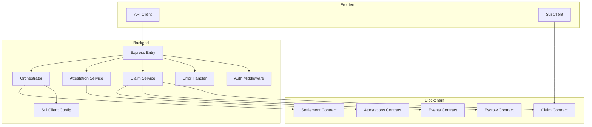
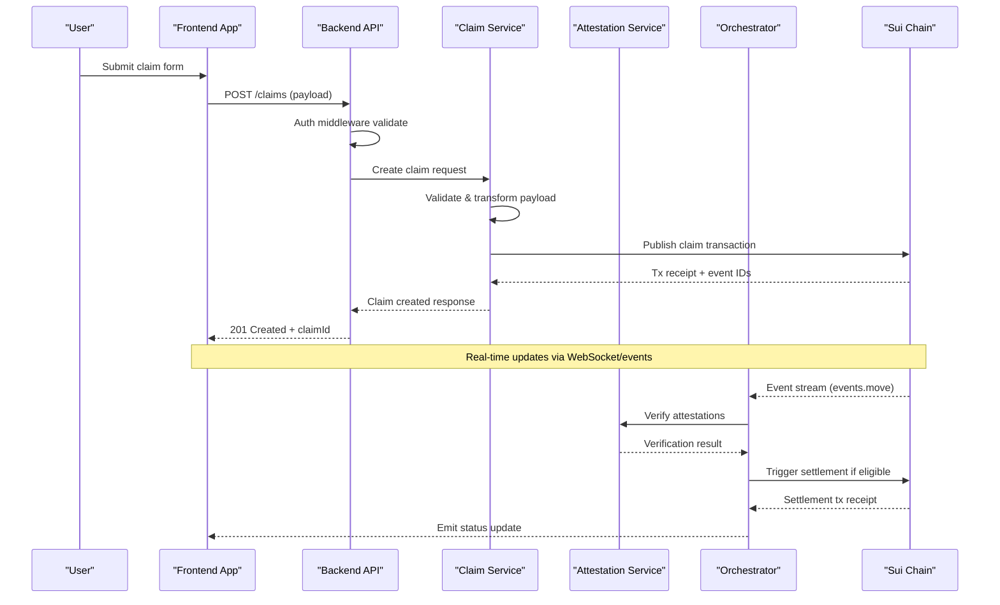
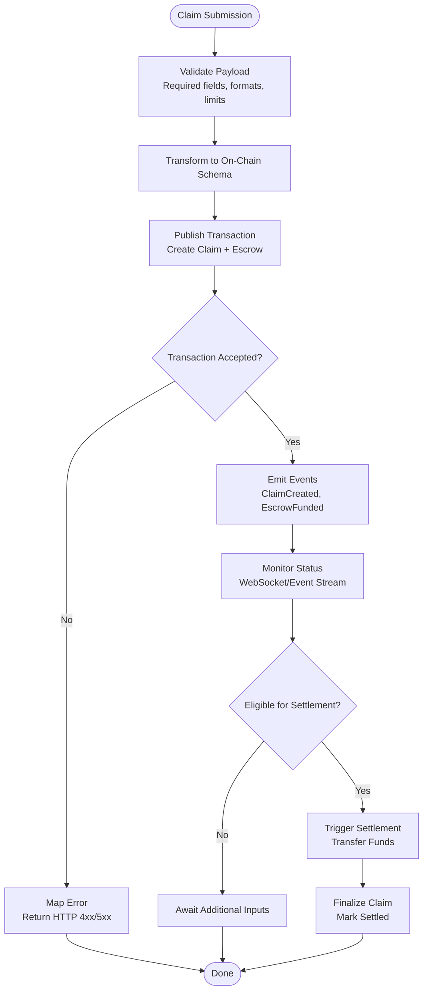
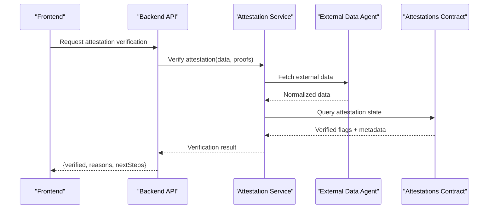
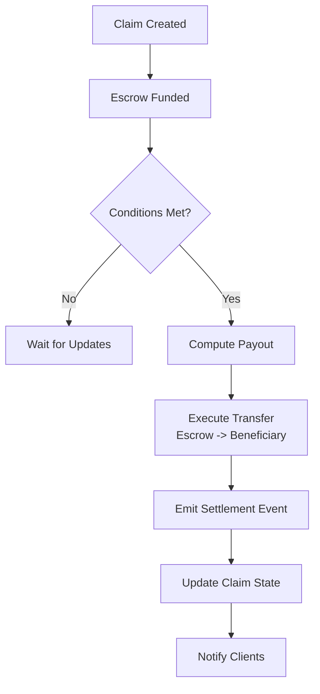
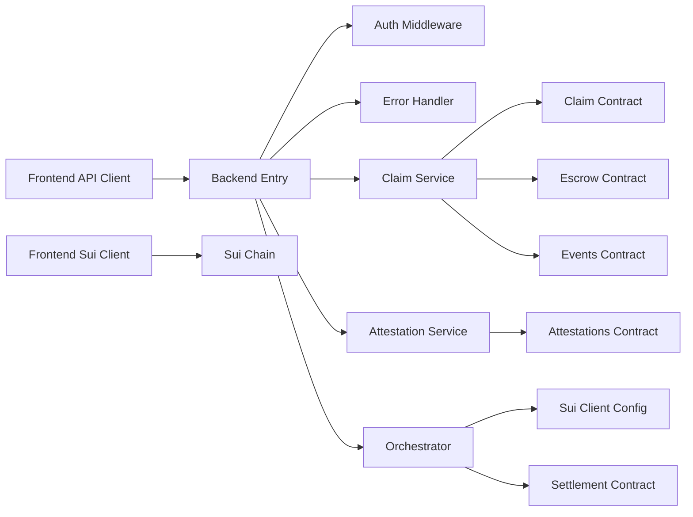

# Data Flow Patterns

<cite>
**Referenced Files in This Document**
- [backend/src/index.ts](file://backend/src/index.ts)
- [backend/src/services/claim.service.ts](file://backend/src/services/claim.service.ts)
- [backend/src/services/attestation.service.ts](file://backend/src/services/attestation.service.ts)
- [backend/src/services/orchestrator.ts](file://backend/src/services/orchestrator.ts)
- [backend/src/middleware/auth.ts](file://backend/src/middleware/auth.ts)
- [backend/src/middleware/error-handler.ts](file://backend/src/middleware/error-handler.ts)
- [backend/src/config/sui-client.ts](file://backend/src/config/sui-client.ts)
- [frontend/src/lib/api-client.ts](file://frontend/src/lib/api-client.ts)
- [frontend/src/lib/sui-client.ts](file://frontend/src/lib/sui-client.ts)
- [contracts/insurix-settlement/sources/claim.move](file://contracts/insurix-settlement/sources/claim.move)
- [contracts/insurix-settlement/sources/escrow.move](file://contracts/insurix-settlement/sources/escrow.move)
- [contracts/insurix-settlement/sources/events.move](file://contracts/insurix-settlement/sources/events.move)
- [contracts/insurix-settlement/sources/settlement.move](file://contracts/insurix-settlement/sources/settlement.move)
- [contracts/attestations/packages/attestations/sources/attestations.move](file://contracts/attestations/packages/attestations/sources/attestations.move)
</cite>

## Table of Contents
1. [Introduction](#introduction)
2. [Project Structure](#project-structure)
3. [Core Components](#core-components)
4. [Architecture Overview](#architecture-overview)
5. [Detailed Component Analysis](#detailed-component-analysis)
6. [Dependency Analysis](#dependency-analysis)
7. [Performance Considerations](#performance-considerations)
8. [Troubleshooting Guide](#troubleshooting-guide)
9. [Conclusion](#conclusion)
10. [Appendices](#appendices)

## Introduction
This document describes end-to-end data flow patterns for Insurix, covering user interactions through the frontend, backend services, and blockchain transactions on Sui. It explains claim processing workflows, attestation verification, settlement automation, data transformation and validation rules, error handling at each layer, real-time updates via WebSocket communications and event propagation, data synchronization strategies, conflict resolution, offline support patterns, and privacy and compliance considerations across the pipeline.

## Project Structure
Insurix is organized into three primary layers:
- Frontend (Next.js): User interface, wallet integration, API client, and Sui client utilities.
- Backend (Node/TypeScript): REST APIs, middleware for authentication and error handling, services for claims and attestations, orchestrator for workflow coordination, and configuration for Sui client access.
- Smart Contracts (Move): On-chain models for identity, external data, fraud checks, attestations, claims, escrow, events, and settlement logic.

**Diagram sources**
- [backend/src/index.ts](file://backend/src/index.ts)
- [backend/src/middleware/auth.ts](file://backend/src/middleware/auth.ts)
- [backend/src/middleware/error-handler.ts](file://backend/src/middleware/error-handler.ts)
- [backend/src/services/claim.service.ts](file://backend/src/services/claim.service.ts)
- [backend/src/services/attestation.service.ts](file://backend/src/services/attestation.service.ts)
- [backend/src/services/orchestrator.ts](file://backend/src/services/orchestrator.ts)
- [backend/src/config/sui-client.ts](file://backend/src/config/sui-client.ts)
- [frontend/src/lib/api-client.ts](file://frontend/src/lib/api-client.ts)
- [frontend/src/lib/sui-client.ts](file://frontend/src/lib/sui-client.ts)
- [contracts/insurix-settlement/sources/claim.move](file://contracts/insurix-settlement/sources/claim.move)
- [contracts/insurix-settlement/sources/escrow.move](file://contracts/insurix-settlement/sources/escrow.move)
- [contracts/insurix-settlement/sources/events.move](file://contracts/insurix-settlement/sources/events.move)
- [contracts/insurix-settlement/sources/settlement.move](file://contracts/insurix-settlement/sources/settlement.move)
- [contracts/attestations/packages/attestations/sources/attestations.move](file://contracts/attestations/packages/attestations/sources/attestations.move)

**Section sources**
- [backend/src/index.ts](file://backend/src/index.ts)
- [frontend/src/lib/api-client.ts](file://frontend/src/lib/api-client.ts)
- [frontend/src/lib/sui-client.ts](file://frontend/src/lib/sui-client.ts)

## Core Components
- Frontend API Client: Encapsulates HTTP requests to backend endpoints, serializes payloads, and handles retries and error mapping.
- Frontend Sui Client: Manages wallet connection, signing transactions, and reading on-chain state.
- Backend Express Entry: Initializes middleware stack, registers routes, and exposes REST endpoints for claims and attestations.
- Auth Middleware: Validates tokens or signatures, enforces authorization, and injects user context.
- Error Handler: Centralized error formatting, logging, and consistent HTTP responses.
- Claim Service: Orchestrates claim lifecycle operations, validates inputs, transforms data, and interacts with on-chain contracts.
- Attestation Service: Verifies and records attestations, integrates with external data agents, and ensures integrity checks.
- Orchestrator: Coordinates multi-step workflows, manages state transitions, and triggers settlement automation.
- Sui Client Config: Provides network configuration, keypair management, and RPC endpoints.

**Section sources**
- [backend/src/index.ts](file://backend/src/index.ts)
- [backend/src/middleware/auth.ts](file://backend/src/middleware/auth.ts)
- [backend/src/middleware/error-handler.ts](file://backend/src/middleware/error-handler.ts)
- [backend/src/services/claim.service.ts](file://backend/src/services/claim.service.ts)
- [backend/src/services/attestation.service.ts](file://backend/src/services/attestation.service.ts)
- [backend/src/services/orchestrator.ts](file://backend/src/services/orchestrator.ts)
- [backend/src/config/sui-client.ts](file://backend/src/config/sui-client.ts)
- [frontend/src/lib/api-client.ts](file://frontend/src/lib/api-client.ts)
- [frontend/src/lib/sui-client.ts](file://frontend/src/lib/sui-client.ts)

## Architecture Overview
The system follows a layered architecture:
- Presentation Layer (Frontend): UI components, wallet integration, and API/Sui clients.
- Application Layer (Backend): REST APIs, middleware, services, and orchestration.
- Data Layer (Blockchain): Move smart contracts defining state machines for claims, escrow, events, and settlement; attestations package provides verifiable credentials.

**Diagram sources**
- [backend/src/index.ts](file://backend/src/index.ts)
- [backend/src/middleware/auth.ts](file://backend/src/middleware/auth.ts)
- [backend/src/services/claim.service.ts](file://backend/src/services/claim.service.ts)
- [backend/src/services/attestation.service.ts](file://backend/src/services/attestation.service.ts)
- [backend/src/services/orchestrator.ts](file://backend/src/services/orchestrator.ts)
- [contracts/insurix-settlement/sources/events.move](file://contracts/insurix-settlement/sources/events.move)
- [contracts/insurix-settlement/sources/claim.move](file://contracts/insurix-settlement/sources/claim.move)
- [contracts/insurix-settlement/sources/settlement.move](file://contracts/insurix-settlement/sources/settlement.move)

## Detailed Component Analysis

### Claim Processing Workflow
End-to-end claim processing involves:
- Input validation and transformation in the backend service.
- On-chain creation of a claim object and associated escrow.
- Event emission for downstream consumers.
- Automated settlement when conditions are met.

**Diagram sources**
- [backend/src/services/claim.service.ts](file://backend/src/services/claim.service.ts)
- [contracts/insurix-settlement/sources/claim.move](file://contracts/insurix-settlement/sources/claim.move)
- [contracts/insurix-settlement/sources/escrow.move](file://contracts/insurix-settlement/sources/escrow.move)
- [contracts/insurix-settlement/sources/events.move](file://contracts/insurix-settlement/sources/events.move)
- [contracts/insurix-settlement/sources/settlement.move](file://contracts/insurix-settlement/sources/settlement.move)

**Section sources**
- [backend/src/services/claim.service.ts](file://backend/src/services/claim.service.ts)
- [contracts/insurix-settlement/sources/claim.move](file://contracts/insurix-settlement/sources/claim.move)
- [contracts/insurix-settlement/sources/escrow.move](file://contracts/insurix-settlement/sources/escrow.move)
- [contracts/insurix-settlement/sources/events.move](file://contracts/insurix-settlement/sources/events.move)
- [contracts/insurix-settlement/sources/settlement.move](file://contracts/insurix-settlement/sources/settlement.move)

### Attestation Verification Process
Attestations ensure verifiable claims about external data or identities:
- Backend attestation service coordinates verification against on-chain attestations.
- External data agents fetch and normalize third-party information.
- Integrity checks include signature verification and policy enforcement.

**Diagram sources**
- [backend/src/services/attestation.service.ts](file://backend/src/services/attestation.service.ts)
- [contracts/attestations/packages/attestations/sources/attestations.move](file://contracts/attestations/packages/attestations/sources/attestations.move)

**Section sources**
- [backend/src/services/attestation.service.ts](file://backend/src/services/attestation.service.ts)
- [contracts/attestations/packages/attestations/sources/attestations.move](file://contracts/attestations/packages/attestations/sources/attestations.move)

### Settlement Automation
Settlement automation triggers transfers when claim conditions are satisfied:
- Orchestrator monitors events and eligibility criteria.
- Settlement contract executes fund transfers from escrow to beneficiaries.
- Events propagate status changes to frontend and monitoring systems.

**Diagram sources**
- [backend/src/services/orchestrator.ts](file://backend/src/services/orchestrator.ts)
- [contracts/insurix-settlement/sources/settlement.move](file://contracts/insurix-settlement/sources/settlement.move)
- [contracts/insurix-settlement/sources/escrow.move](file://contracts/insurix-settlement/sources/escrow.move)
- [contracts/insurix-settlement/sources/events.move](file://contracts/insurix-settlement/sources/events.move)

**Section sources**
- [backend/src/services/orchestrator.ts](file://backend/src/services/orchestrator.ts)
- [contracts/insurix-settlement/sources/settlement.move](file://contracts/insurix-settlement/sources/settlement.move)
- [contracts/insurix-settlement/sources/escrow.move](file://contracts/insurix-settlement/sources/escrow.move)
- [contracts/insurix-settlement/sources/events.move](file://contracts/insurix-settlement/sources/events.move)

### Data Transformation and Validation Rules
- Frontend performs basic input validation and formats payloads for backend consumption.
- Backend applies schema validation, business rule checks, and transforms data to on-chain types.
- On-chain contracts enforce immutability and state transitions with strict type constraints.

Key validation points:
- Required fields presence and format correctness.
- Numeric ranges and currency precision.
- Signature and proof verification for attestations.
- Idempotency keys to prevent duplicate submissions.

**Section sources**
- [frontend/src/lib/api-client.ts](file://frontend/src/lib/api-client.ts)
- [backend/src/services/claim.service.ts](file://backend/src/services/claim.service.ts)
- [backend/src/services/attestation.service.ts](file://backend/src/services/attestation.service.ts)

### Error Handling at Each Layer
- Frontend maps HTTP errors to user-friendly messages and retry policies.
- Backend centralizes error handling with standardized responses and logging.
- Blockchain errors map to transaction failures with revert reasons captured by services.

Patterns:
- Retry with exponential backoff for transient network issues.
- Circuit breaker for failing external data sources.
- Dead letter queues for failed transactions requiring manual intervention.

**Section sources**
- [backend/src/middleware/error-handler.ts](file://backend/src/middleware/error-handler.ts)
- [frontend/src/lib/api-client.ts](file://frontend/src/lib/api-client.ts)

### Real-Time Updates and WebSocket Communications
- Backend emits events via WebSocket channels for claim status changes.
- Frontend subscribes to channels and updates UI reactively.
- On-chain events are indexed and forwarded to clients.

Flow:
- Client connects to WebSocket endpoint.
- Server authenticates and binds channels per user/claim.
- Events published by orchestrator or services push updates.

**Section sources**
- [backend/src/index.ts](file://backend/src/index.ts)
- [backend/src/services/orchestrator.ts](file://backend/src/services/orchestrator.ts)

### Data Synchronization Strategies and Conflict Resolution
- Optimistic updates on frontend with eventual consistency.
- Conflict resolution based on version vectors or timestamps.
- Idempotent operations using unique claim IDs and sequence numbers.

Strategies:
- Merge conflicts resolved by last-writer-wins with audit trails.
- Reconciliation jobs to sync backend state with on-chain reality.

**Section sources**
- [backend/src/services/claim.service.ts](file://backend/src/services/claim.service.ts)
- [contracts/insurix-settlement/sources/claim.move](file://contracts/insurix-settlement/sources/claim.move)

### Offline Support Patterns
- Local storage caches pending operations and queue them for sync.
- Background sync when connectivity resumes.
- Graceful degradation with read-only mode when backend unavailable.

**Section sources**
- [frontend/src/lib/api-client.ts](file://frontend/src/lib/api-client.ts)

### Privacy, Encryption, and Compliance
- Sensitive data encrypted at rest and in transit (TLS).
- Pseudonymous identities on-chain; personal data off-chain with references.
- Access controls enforced via auth middleware and role-based permissions.
- Compliance with data protection regulations through audit logs and consent management.

**Section sources**
- [backend/src/middleware/auth.ts](file://backend/src/middleware/auth.ts)
- [backend/src/config/sui-client.ts](file://backend/src/config/sui-client.ts)

## Dependency Analysis
Dependencies between components:
- Frontend depends on backend APIs and Sui client for direct blockchain interactions.
- Backend services depend on Sui client config and on-chain contracts.
- Orchestrator depends on event streams and settlement logic.

**Diagram sources**
- [frontend/src/lib/api-client.ts](file://frontend/src/lib/api-client.ts)
- [frontend/src/lib/sui-client.ts](file://frontend/src/lib/sui-client.ts)
- [backend/src/index.ts](file://backend/src/index.ts)
- [backend/src/middleware/auth.ts](file://backend/src/middleware/auth.ts)
- [backend/src/middleware/error-handler.ts](file://backend/src/middleware/error-handler.ts)
- [backend/src/services/claim.service.ts](file://backend/src/services/claim.service.ts)
- [backend/src/services/attestation.service.ts](file://backend/src/services/attestation.service.ts)
- [backend/src/services/orchestrator.ts](file://backend/src/services/orchestrator.ts)
- [backend/src/config/sui-client.ts](file://backend/src/config/sui-client.ts)
- [contracts/insurix-settlement/sources/claim.move](file://contracts/insurix-settlement/sources/claim.move)
- [contracts/insurix-settlement/sources/escrow.move](file://contracts/insurix-settlement/sources/escrow.move)
- [contracts/insurix-settlement/sources/events.move](file://contracts/insurix-settlement/sources/events.move)
- [contracts/insurix-settlement/sources/settlement.move](file://contracts/insurix-settlement/sources/settlement.move)
- [contracts/attestations/packages/attestations/sources/attestations.move](file://contracts/attestations/packages/attestations/sources/attestations.move)

**Section sources**
- [backend/src/index.ts](file://backend/src/index.ts)
- [backend/src/services/claim.service.ts](file://backend/src/services/claim.service.ts)
- [backend/src/services/orchestrator.ts](file://backend/src/services/orchestrator.ts)
- [frontend/src/lib/api-client.ts](file://frontend/src/lib/api-client.ts)

## Performance Considerations
- Batch on-chain transactions where possible to reduce gas costs.
- Cache frequently accessed on-chain state in backend memory or Redis.
- Use pagination and selective field queries for large datasets.
- Implement rate limiting and circuit breakers for external dependencies.
- Optimize WebSocket message payloads and debounce frequent updates.

[No sources needed since this section provides general guidance]

## Troubleshooting Guide
Common issues and resolutions:
- Authentication failures: Check token validity and middleware configuration.
- Transaction reverts: Inspect revert reasons and adjust input parameters.
- Event delivery delays: Verify WebSocket connections and indexer health.
- Data inconsistencies: Run reconciliation jobs and check idempotency keys.

Diagnostic steps:
- Enable detailed logging in backend services.
- Monitor on-chain events and transaction receipts.
- Validate schemas and transformations with test fixtures.

**Section sources**
- [backend/src/middleware/error-handler.ts](file://backend/src/middleware/error-handler.ts)
- [backend/src/services/claim.service.ts](file://backend/src/services/claim.service.ts)
- [backend/src/services/orchestrator.ts](file://backend/src/services/orchestrator.ts)

## Conclusion
Insurix implements robust data flow patterns spanning frontend, backend, and blockchain layers. The system ensures reliable claim processing, verifiable attestations, and automated settlements with strong error handling, real-time updates, and privacy safeguards. Continuous monitoring and reconciliation maintain consistency and compliance across the pipeline.

[No sources needed since this section summarizes without analyzing specific files]

## Appendices
- Glossary of terms: Claim, Attestation, Escrow, Settlement, Event, Idempotency.
- Configuration reference: Sui client settings, environment variables, and network endpoints.
- API reference: Endpoints for claims and attestations with request/response schemas.

[No sources needed since this section provides general guidance]