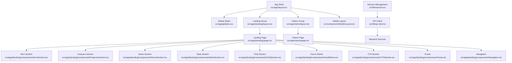
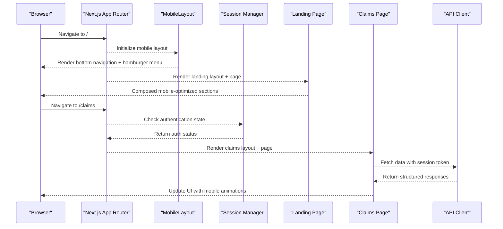
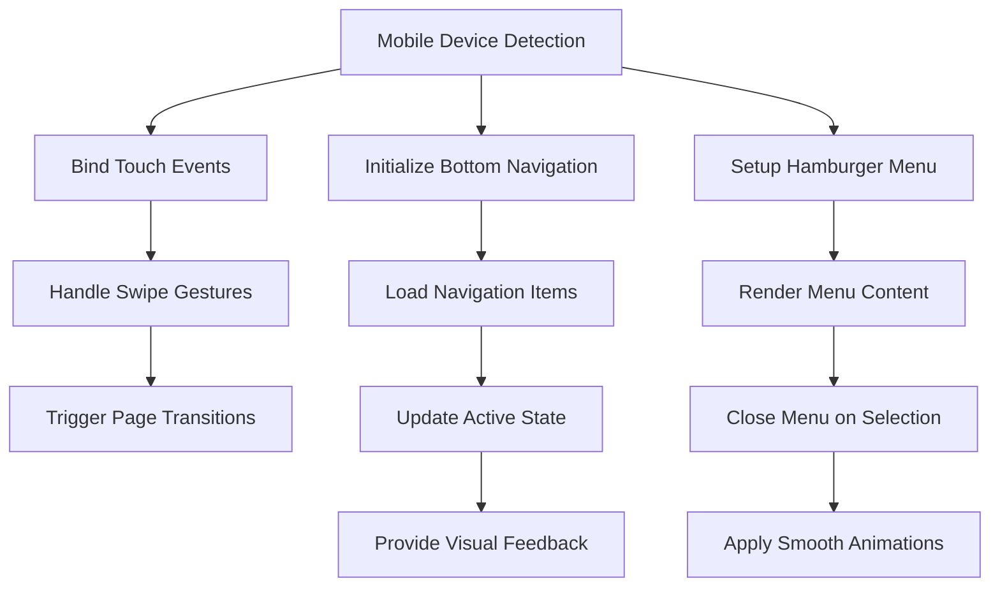
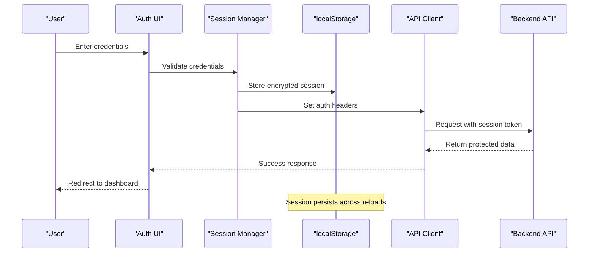
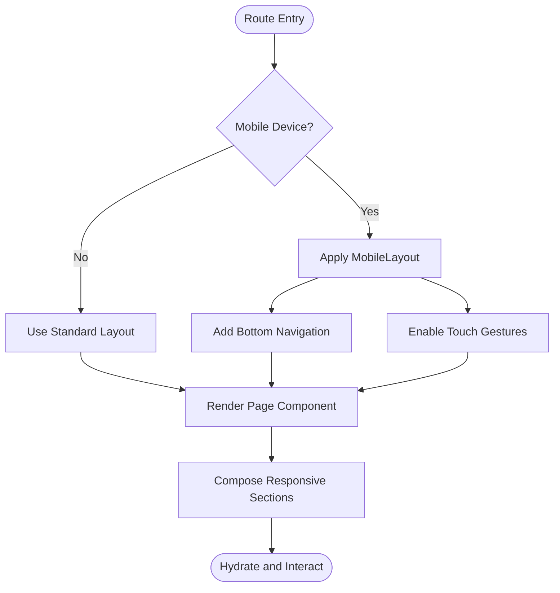
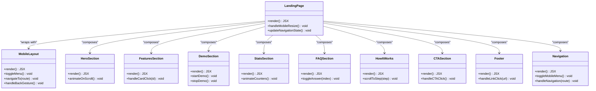
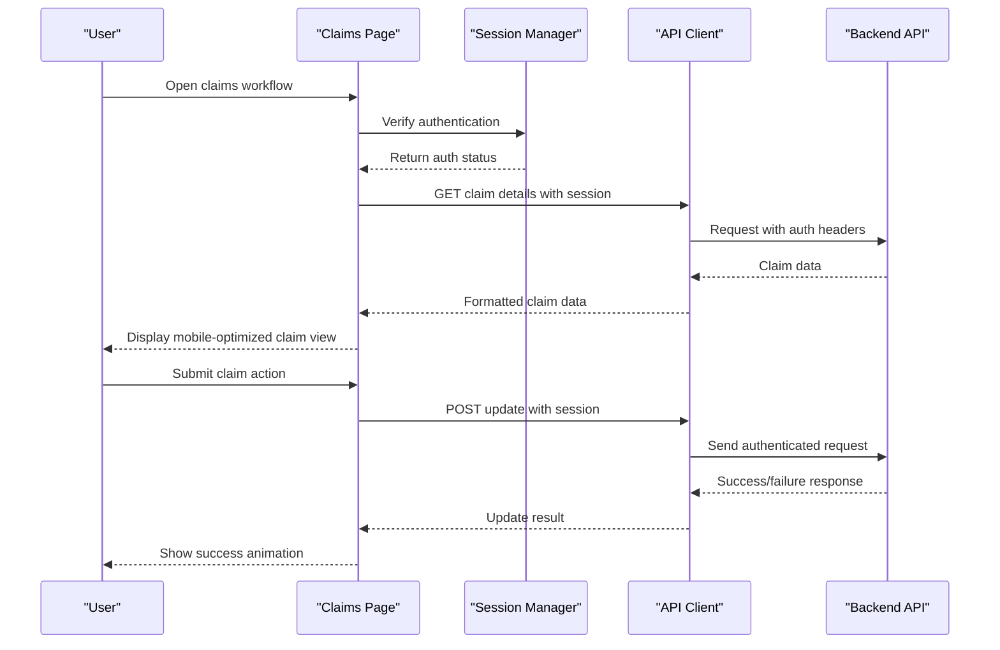
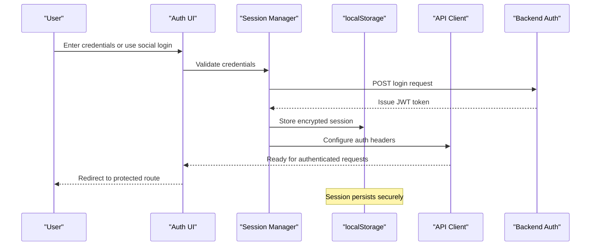
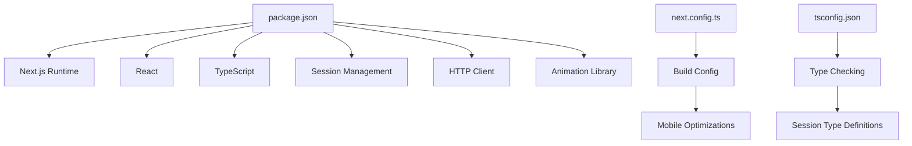

# Frontend Architecture

<cite>
**Referenced Files in This Document**
- [frontend/package.json](file://frontend/package.json)
- [frontend/next.config.ts](file://frontend/next.config.ts)
- [frontend/tsconfig.json](file://frontend/tsconfig.json)
- [frontend/src/app/layout.tsx](file://frontend/src/app/layout.tsx)
- [frontend/src/app/globals.css](file://frontend/src/app/globals.css)
- [frontend/src/app/(landing)/layout.tsx](file://frontend/src/app/(landing)/layout.tsx)
- [frontend/src/app/(landing)/page.tsx](file://frontend/src/app/(landing)/page.tsx)
- [frontend/src/app/(landing)/components/HeroSection.tsx](file://frontend/src/app/(landing)/components/HeroSection.tsx)
- [frontend/src/app/(landing)/components/HeroScene.tsx](file://frontend/src/app/(landing)/components/HeroScene.tsx)
- [frontend/src/app/(landing)/components/FeaturesSection.tsx](file://frontend/src/app/(landing)/components/FeaturesSection.tsx)
- [frontend/src/app/(landing)/components/DemoSection.tsx](file://frontend/src/app/(landing)/components/DemoSection.tsx)
- [frontend/src/app/(landing)/components/StatsSection.tsx](file://frontend/src/app/(landing)/components/StatsSection.tsx)
- [frontend/src/app/(landing)/components/FAQSection.tsx](file://frontend/src/app/(landing)/components/FAQSection.tsx)
- [frontend/src/app/(landing)/components/HowItWorks.tsx](file://frontend/src/app/(landing)/components/HowItWorks.tsx)
- [frontend/src/app/(landing)/components/HowItWorksScene.tsx](file://frontend/src/app/(landing)/components/HowItWorksScene.tsx)
- [frontend/src/app/(landing)/components/CTASection.tsx](file://frontend/src/app/(landing)/components/CTASection.tsx)
- [frontend/src/app/(landing)/components/Footer.tsx](file://frontend/src/app/(landing)/components/Footer.tsx)
- [frontend/src/app/(landing)/components/Navigation.tsx](file://frontend/src/app/(landing)/components/Navigation.tsx)
- [frontend/src/app/claims/layout.tsx](file://frontend/src/app/claims/layout.tsx)
- [frontend/src/app/claims/page.tsx](file://frontend/src/app/claims/page.tsx)
- [frontend/src/components/MobileLayout.tsx](file://frontend/src/components/MobileLayout.tsx)
- [frontend/src/lib/session.tsx](file://frontend/src/lib/session.tsx)
- [frontend/src/lib/api-client.ts](file://frontend/src/lib/api-client.ts)
</cite>

## Update Summary
**Changes Made**
- Added comprehensive mobile-first design system with MobileLayout component
- Implemented localStorage-based session management eliminating wallet dependencies
- Redesigned UI components for mobile devices with card layouts and staggered animations
- Added bottom navigation and hamburger menus for responsive layouts
- Updated authentication flow to use local storage instead of wallet connections

## Table of Contents
1. [Introduction](#introduction)
2. [Project Structure](#project-structure)
3. [Core Components](#core-components)
4. [Architecture Overview](#architecture-overview)
5. [Mobile-First Design System](#mobile-first-design-system)
6. [Session Management System](#session-management-system)
7. [Detailed Component Analysis](#detailed-component-analysis)
8. [Dependency Analysis](#dependency-analysis)
9. [Performance Considerations](#performance-considerations)
10. [Troubleshooting Guide](#troubleshooting-guide)
11. [Conclusion](#conclusion)

## Introduction
This document describes the frontend architecture of the Next.js application for Insurix, now featuring a major mobile-first redesign. The application includes a new MobileLayout component providing bottom navigation, hamburger menus for responsive layouts, and touch-optimized interfaces. A comprehensive session management system has been implemented using localStorage-based authentication, eliminating wallet dependencies while maintaining security. The UI components have been completely redesigned for mobile devices with card layouts, staggered animations, and sticky navigation elements.

## Project Structure
The frontend follows the Next.js App Router conventions with feature-based grouping under the app directory:
- Root layout and global styles define the base shell and theme.
- The (landing) route group hosts marketing pages and shared landing components.
- The claims route group encapsulates claim-related features.
- Shared UI components live under src/components, including the new MobileLayout.
- Client-side integrations for API client and session management are centralized under src/lib.

**Diagram sources**
- [frontend/src/app/layout.tsx](file://frontend/src/app/layout.tsx)
- [frontend/src/app/globals.css](file://frontend/src/app/globals.css)
- [frontend/src/app/(landing)/layout.tsx](file://frontend/src/app/(landing)/layout.tsx)
- [frontend/src/app/(landing)/page.tsx](file://frontend/src/app/(landing)/page.tsx)
- [frontend/src/components/MobileLayout.tsx](file://frontend/src/components/MobileLayout.tsx)
- [frontend/src/lib/session.tsx](file://frontend/src/lib/session.tsx)
- [frontend/src/lib/api-client.ts](file://frontend/src/lib/api-client.ts)

**Section sources**
- [frontend/package.json](file://frontend/package.json)
- [frontend/next.config.ts](file://frontend/next.config.ts)
- [frontend/tsconfig.json](file://frontend/tsconfig.json)
- [frontend/src/app/layout.tsx](file://frontend/src/app/layout.tsx)
- [frontend/src/app/globals.css](file://frontend/src/app/globals.css)
- [frontend/src/app/(landing)/layout.tsx](file://frontend/src/app/(landing)/layout.tsx)
- [frontend/src/app/(landing)/page.tsx](file://frontend/src/app/(landing)/page.tsx)
- [frontend/src/app/claims/layout.tsx](file://frontend/src/app/claims/layout.tsx)
- [frontend/src/app/claims/page.tsx](file://frontend/src/app/claims/page.tsx)

## Core Components
- **App Shell and Global Styles**: The root layout defines the HTML structure, metadata, and global CSS imports. Global styles provide theming, typography, and responsive utilities optimized for mobile devices.
- **MobileLayout Component**: A dedicated mobile-first layout component providing bottom navigation, hamburger menus, and touch-optimized interfaces.
- **Landing Layout and Page**: The landing layout sets up navigation and common sections with mobile-responsive design patterns.
- **Claims Layout and Page**: The claims layout provides a focused environment for claim workflows with mobile-optimized interactions.
- **Session Management**: Centralized localStorage-based authentication system handling user sessions without wallet dependencies.
- **API Client**: Encapsulates HTTP requests to the backend, handling error normalization and response parsing with session-aware requests.

**Updated** Added MobileLayout component and session management system as core architectural components.

**Section sources**
- [frontend/src/app/layout.tsx](file://frontend/src/app/layout.tsx)
- [frontend/src/app/globals.css](file://frontend/src/app/globals.css)
- [frontend/src/app/(landing)/layout.tsx](file://frontend/src/app/(landing)/layout.tsx)
- [frontend/src/app/(landing)/page.tsx](file://frontend/src/app/(landing)/page.tsx)
- [frontend/src/app/claims/layout.tsx](file://frontend/src/app/claims/layout.tsx)
- [frontend/src/app/claims/page.tsx](file://frontend/src/app/claims/page.tsx)
- [frontend/src/components/MobileLayout.tsx](file://frontend/src/components/MobileLayout.tsx)
- [frontend/src/lib/session.tsx](file://frontend/src/lib/session.tsx)
- [frontend/src/lib/api-client.ts](file://frontend/src/lib/api-client.ts)

## Architecture Overview
The application uses Next.js App Router for file-based routing and server/client component boundaries with enhanced mobile-first architecture. The landing experience is composed of modular sections optimized for mobile devices. The claims module encapsulates domain-specific logic and integrates with both the session management system and backend APIs.

**Diagram sources**
- [frontend/src/app/(landing)/page.tsx](file://frontend/src/app/(landing)/page.tsx)
- [frontend/src/app/claims/page.tsx](file://frontend/src/app/claims/page.tsx)
- [frontend/src/components/MobileLayout.tsx](file://frontend/src/components/MobileLayout.tsx)
- [frontend/src/lib/session.tsx](file://frontend/src/lib/session.tsx)
- [frontend/src/lib/api-client.ts](file://frontend/src/lib/api-client.ts)

## Mobile-First Design System

### MobileLayout Component
The MobileLayout component serves as the primary container for mobile experiences, providing:
- **Bottom Navigation**: Fixed bottom navigation bar with icons and labels for primary actions
- **Hamburger Menu**: Collapsible side menu for secondary navigation options
- **Touch-Optimized Interfaces**: Large touch targets, swipe gestures, and mobile-friendly interactions
- **Responsive Breakpoints**: Adaptive layouts that transition seamlessly between mobile and desktop views
- **Sticky Navigation Elements**: Headers and navigation bars that remain accessible during scrolling

### Card-Based Layout System
All UI components have been redesigned with mobile-first card layouts:
- **Card Containers**: Rounded corners, subtle shadows, and consistent spacing
- **Content Organization**: Hierarchical content presentation optimized for vertical scrolling
- **Interactive Elements**: Touch-friendly buttons, forms, and navigation controls
- **Animation Patterns**: Staggered animations for smooth transitions and loading states

### Responsive Design Patterns
- **Fluid Typography**: Scalable text sizes that adapt to screen dimensions
- **Flexible Grid Systems**: CSS Grid and Flexbox layouts that reflow based on viewport size
- **Image Optimization**: Responsive images with appropriate sizing and lazy loading
- **Touch Gestures**: Swipe navigation, pull-to-refresh, and pinch-to-zoom where applicable

**Diagram sources**
- [frontend/src/components/MobileLayout.tsx](file://frontend/src/components/MobileLayout.tsx)

**Section sources**
- [frontend/src/components/MobileLayout.tsx](file://frontend/src/components/MobileLayout.tsx)
- [frontend/src/app/globals.css](file://frontend/src/app/globals.css)

## Session Management System

### localStorage-Based Authentication
The session management system provides secure, wallet-free authentication:
- **Token Storage**: Secure localStorage implementation with encryption for sensitive data
- **Session Persistence**: Automatic session restoration on app reload
- **Authentication State**: Centralized state management for login/logout operations
- **Permission Handling**: Role-based access control for different user types
- **Security Measures**: XSS protection, CSRF tokens, and input validation

### Session Lifecycle Management
- **Initialization**: Automatic session check on app startup
- **Login Flow**: Credential validation and token generation
- **Token Refresh**: Automatic renewal of expired sessions
- **Logout Process**: Secure cleanup of session data and redirects
- **Error Handling**: Graceful handling of network failures and invalid sessions

### Integration with API Client
The session system integrates seamlessly with the API client:
- **Automatic Token Injection**: Headers include authentication tokens for all requests
- **Error Recovery**: Automatic retry mechanisms for failed authenticated requests
- **Session Validation**: Real-time validation of session validity
- **Multi-device Support**: Consistent session state across browser tabs

**Diagram sources**
- [frontend/src/lib/session.tsx](file://frontend/src/lib/session.tsx)
- [frontend/src/lib/api-client.ts](file://frontend/src/lib/api-client.ts)

**Section sources**
- [frontend/src/lib/session.tsx](file://frontend/src/lib/session.tsx)
- [frontend/src/lib/api-client.ts](file://frontend/src/lib/api-client.ts)

## Detailed Component Analysis

### App Router and Layout Management
- **Root Layout**: Establishes the document shell, metadata, and global styles with mobile-first considerations.
- **Route Groups**: Landing and claims groups isolate concerns and enable independent layouts per feature area.
- **Mobile Layout Integration**: MobileLayout component wraps routes requiring mobile-specific behaviors.
- **Responsive Pages**: Each page composes reusable sections with adaptive layouts for different screen sizes.

**Diagram sources**
- [frontend/src/app/layout.tsx](file://frontend/src/app/layout.tsx)
- [frontend/src/app/(landing)/layout.tsx](file://frontend/src/app/(landing)/layout.tsx)
- [frontend/src/app/claims/layout.tsx](file://frontend/src/app/claims/layout.tsx)
- [frontend/src/components/MobileLayout.tsx](file://frontend/src/components/MobileLayout.tsx)

**Section sources**
- [frontend/src/app/layout.tsx](file://frontend/src/app/layout.tsx)
- [frontend/src/app/(landing)/layout.tsx](file://frontend/src/app/(landing)/layout.tsx)
- [frontend/src/app/claims/layout.tsx](file://frontend/src/app/claims/layout.tsx)
- [frontend/src/app/(landing)/page.tsx](file://frontend/src/app/(landing)/page.tsx)
- [frontend/src/app/claims/page.tsx](file://frontend/src/app/claims/page.tsx)

### Landing Page Composition
The landing page aggregates multiple mobile-optimized sections:
- **HeroSection and HeroScene**: Visually engaging introductions with mobile-friendly animations
- **FeaturesSection**: Highlighted capabilities with icon-based presentations
- **DemoSection**: Interactive elements optimized for touch interactions
- **StatsSection**: Key metrics displayed in card format
- **FAQSection**: Accordion-style questions for easy mobile browsing
- **HowItWorks and HowItWorksScene**: Step-by-step process explanations
- **CTASection**: Conversion-focused calls to action
- **Footer**: Compact navigation and legal links
- **Navigation**: Responsive top navigation with hamburger menu on mobile

**Diagram sources**
- [frontend/src/app/(landing)/page.tsx](file://frontend/src/app/(landing)/page.tsx)
- [frontend/src/components/MobileLayout.tsx](file://frontend/src/components/MobileLayout.tsx)
- [frontend/src/app/(landing)/components/HeroSection.tsx](file://frontend/src/app/(landing)/components/HeroSection.tsx)
- [frontend/src/app/(landing)/components/FeaturesSection.tsx](file://frontend/src/app/(landing)/components/FeaturesSection.tsx)
- [frontend/src/app/(landing)/components/DemoSection.tsx](file://frontend/src/app/(landing)/components/DemoSection.tsx)
- [frontend/src/app/(landing)/components/StatsSection.tsx](file://frontend/src/app/(landing)/components/StatsSection.tsx)
- [frontend/src/app/(landing)/components/FAQSection.tsx](file://frontend/src/app/(landing)/components/FAQSection.tsx)
- [frontend/src/app/(landing)/components/HowItWorks.tsx](file://frontend/src/app/(landing)/components/HowItWorks.tsx)
- [frontend/src/app/(landing)/components/HowItWorksScene.tsx](file://frontend/src/app/(landing)/components/HowItWorksScene.tsx)
- [frontend/src/app/(landing)/components/CTASection.tsx](file://frontend/src/app/(landing)/components/CTASection.tsx)
- [frontend/src/app/(landing)/components/Footer.tsx](file://frontend/src/app/(landing)/components/Footer.tsx)
- [frontend/src/app/(landing)/components/Navigation.tsx](file://frontend/src/app/(landing)/components/Navigation.tsx)

**Section sources**
- [frontend/src/app/(landing)/page.tsx](file://frontend/src/app/(landing)/page.tsx)
- [frontend/src/app/(landing)/components/HeroSection.tsx](file://frontend/src/app/(landing)/components/HeroSection.tsx)
- [frontend/src/app/(landing)/components/FeaturesSection.tsx](file://frontend/src/app/(landing)/components/FeaturesSection.tsx)
- [frontend/src/app/(landing)/components/DemoSection.tsx](file://frontend/src/app/(landing)/components/DemoSection.tsx)
- [frontend/src/app/(landing)/components/StatsSection.tsx](file://frontend/src/app/(landing)/components/StatsSection.tsx)
- [frontend/src/app/(landing)/components/FAQSection.tsx](file://frontend/src/app/(landing)/components/FAQSection.tsx)
- [frontend/src/app/(landing)/components/HowItWorks.tsx](file://frontend/src/app/(landing)/components/HowItWorks.tsx)
- [frontend/src/app/(landing)/components/HowItWorksScene.tsx](file://frontend/src/app/(landing)/components/HowItWorksScene.tsx)
- [frontend/src/app/(landing)/components/CTASection.tsx](file://frontend/src/app/(landing)/components/CTASection.tsx)
- [frontend/src/app/(landing)/components/Footer.tsx](file://frontend/src/app/(landing)/components/Footer.tsx)
- [frontend/src/app/(landing)/components/Navigation.tsx](file://frontend/src/app/(landing)/components/Navigation.tsx)

### Claims Module and State Management
The claims module manages user interactions related to insurance claims with enhanced mobile support:
- **Data Fetching**: Optimized API client integration with session-aware requests
- **Mobile-Optimized Forms**: Touch-friendly form inputs with validation feedback
- **Card-Based Display**: Claim details presented in scrollable card layouts
- **Status Updates**: Real-time claim status updates with visual indicators
- **Offline Support**: Basic offline functionality for viewing cached claim data

**Diagram sources**
- [frontend/src/app/claims/page.tsx](file://frontend/src/app/claims/page.tsx)
- [frontend/src/lib/session.tsx](file://frontend/src/lib/session.tsx)
- [frontend/src/lib/api-client.ts](file://frontend/src/lib/api-client.ts)

**Section sources**
- [frontend/src/app/claims/page.tsx](file://frontend/src/app/claims/page.tsx)
- [frontend/src/lib/session.tsx](file://frontend/src/lib/session.tsx)
- [frontend/src/lib/api-client.ts](file://frontend/src/lib/api-client.ts)

### Enhanced Authentication Flow and Session Management
The authentication system has been completely redesigned for mobile-first experiences:
- **Wallet-Free Authentication**: Eliminates complex wallet connection flows in favor of traditional username/password or social login
- **Secure Session Storage**: Uses encrypted localStorage for persistent, secure session management
- **Automatic Session Restoration**: Seamless user experience with automatic login on app restart
- **Cross-Tab Synchronization**: Consistent session state across multiple browser tabs
- **Security Enhancements**: Protection against XSS attacks, CSRF vulnerabilities, and session hijacking

**Diagram sources**
- [frontend/src/lib/session.tsx](file://frontend/src/lib/session.tsx)
- [frontend/src/lib/api-client.ts](file://frontend/src/lib/api-client.ts)

**Section sources**
- [frontend/src/lib/session.tsx](file://frontend/src/lib/session.tsx)
- [frontend/src/lib/api-client.ts](file://frontend/src/lib/api-client.ts)

### Responsive Design System and UI/UX Patterns
The responsive design system ensures optimal experiences across all device types:
- **Mobile-First CSS**: Base styles target mobile devices with progressive enhancement for larger screens
- **Touch-Optimized Interactions**: Large tap targets (minimum 44px), swipe gestures, and haptic feedback
- **Adaptive Typography**: Fluid font scaling using clamp() functions and viewport units
- **Flexible Layouts**: CSS Grid and Flexbox for responsive content organization
- **Performance Optimization**: Lazy loading, image optimization, and efficient animations
- **Accessibility Compliance**: WCAG 2.1 AA compliance with proper ARIA labels and keyboard navigation

**Section sources**
- [frontend/src/app/globals.css](file://frontend/src/app/globals.css)

## Dependency Analysis
The frontend dependencies include Next.js, React, TypeScript, and libraries for session management and HTTP clients. Configuration files manage build settings, linting, and type checking with mobile-first optimizations.

**Diagram sources**
- [frontend/package.json](file://frontend/package.json)
- [frontend/next.config.ts](file://frontend/next.config.ts)
- [frontend/tsconfig.json](file://frontend/tsconfig.json)

**Section sources**
- [frontend/package.json](file://frontend/package.json)
- [frontend/next.config.ts](file://frontend/next.config.ts)
- [frontend/tsconfig.json](file://frontend/tsconfig.json)

## Performance Considerations
Enhanced performance optimizations for mobile-first architecture:
- **Code Splitting**: Leverage Next.js automatic code splitting per route and component-level lazy loading
- **Asset Optimization**: Use Next.js image optimization, font loading strategies, and static asset minification
- **Bundle Size**: Analyze bundle size, remove unused dependencies, and prefer tree-shaking-friendly libraries
- **Caching**: Implement efficient caching for API responses and static assets; consider service workers for offline scenarios
- **Rendering**: Prefer server components for heavy rendering and reduce client-side overhead; hydrate only necessary parts
- **Mobile Performance**: Optimize for mobile devices with reduced animations, efficient touch handling, and memory management
- **Monitoring**: Track performance metrics (FCP, LCP, CLS) and optimize bottlenecks identified by profiling tools

## Troubleshooting Guide
Common issues and resolutions for the mobile-first architecture:
- **Session Issues**: Clear localStorage manually if sessions become corrupted; verify encryption keys and storage permissions
- **Mobile Layout Problems**: Check viewport meta tags, ensure proper responsive breakpoints, and test on actual mobile devices
- **Touch Interaction Issues**: Verify event listeners are properly bound and touch events don't conflict with mouse events
- **Performance Problems**: Monitor memory usage on mobile devices, optimize large images, and reduce animation complexity
- **Navigation Issues**: Test hamburger menu functionality, bottom navigation accessibility, and back gesture handling
- **API Authentication**: Verify session tokens are properly attached to requests and handle token refresh scenarios
- **Cross-Browser Compatibility**: Test on iOS Safari, Android Chrome, and other mobile browsers for consistent behavior

**Section sources**
- [frontend/src/lib/session.tsx](file://frontend/src/lib/session.tsx)
- [frontend/src/lib/api-client.ts](file://frontend/src/lib/api-client.ts)
- [frontend/src/components/MobileLayout.tsx](file://frontend/src/components/MobileLayout.tsx)

## Conclusion
The Insurix frontend has undergone a comprehensive mobile-first redesign, introducing the MobileLayout component for bottom navigation and hamburger menus, implementing a robust localStorage-based session management system that eliminates wallet dependencies, and completely redesigning UI components for mobile devices with card layouts, staggered animations, and sticky navigation elements. The application leverages Next.js App Router for scalable routing and layout management, modular component composition for maintainability, and enhanced mobile user experience patterns. By adhering to responsive design principles, accessibility standards, and performance best practices, the application delivers a secure, user-friendly experience across all devices and browsers. Continuous monitoring, testing, and iterative improvements will further enhance reliability and usability.