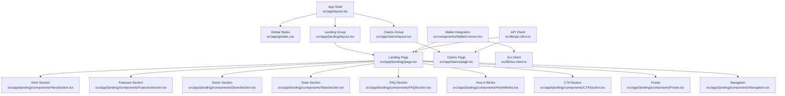
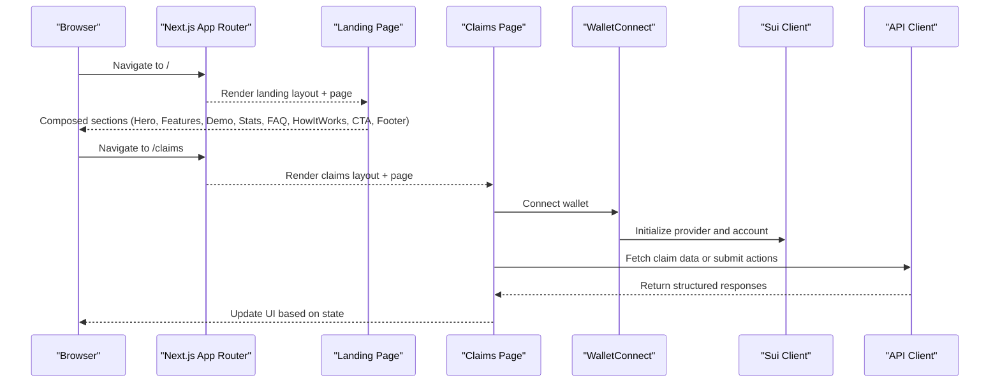
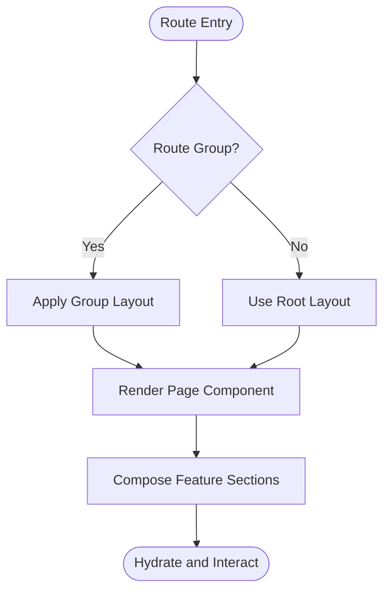
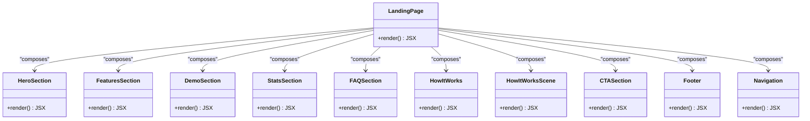
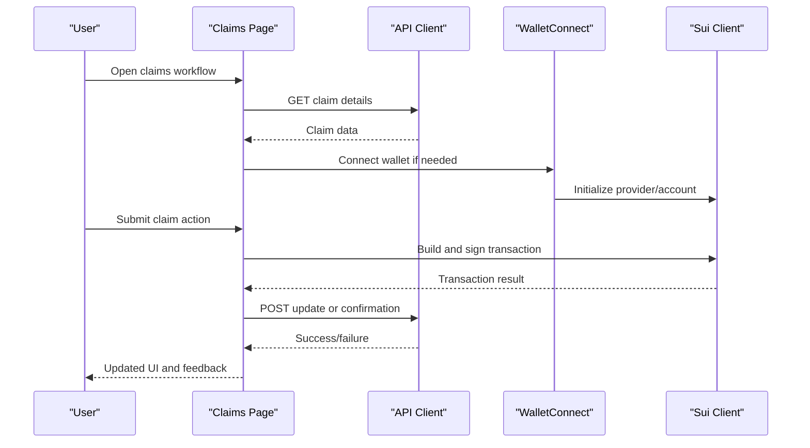
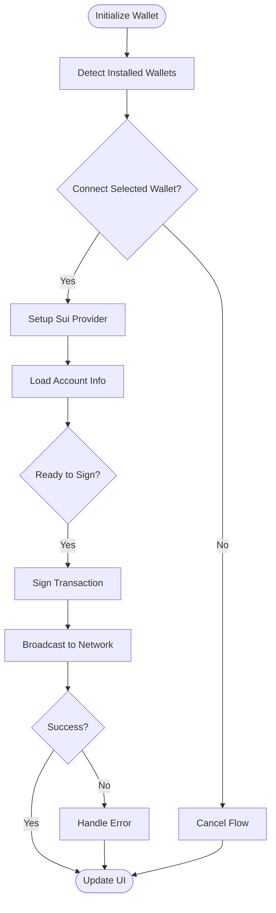
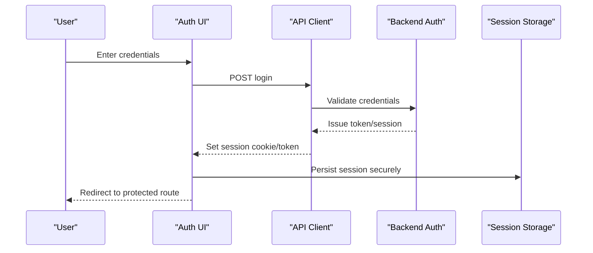
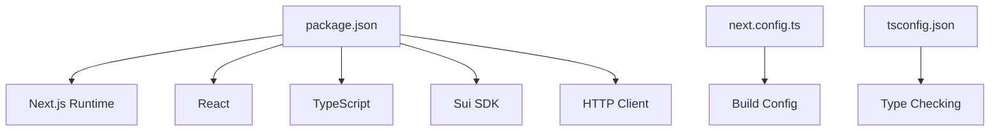

# Frontend Architecture

<cite>
**Referenced Files in This Document**
- [frontend/package.json](file://frontend/package.json)
- [frontend/next.config.ts](file://frontend/next.config.ts)
- [frontend/tsconfig.json](file://frontend/tsconfig.json)
- [frontend/src/app/layout.tsx](file://frontend/src/app/layout.tsx)
- [frontend/src/app/globals.css](file://frontend/src/app/globals.css)
- [frontend/src/app/(landing)/layout.tsx](file://frontend/src/app/(landing)/layout.tsx)
- [frontend/src/app/(landing)/page.tsx](file://frontend/src/app/(landing)/page.tsx)
- [frontend/src/app/(landing)/components/HeroSection.tsx](file://frontend/src/app/(landing)/components/HeroSection.tsx)
- [frontend/src/app/(landing)/components/HeroScene.tsx](file://frontend/src/app/(landing)/components/HeroScene.tsx)
- [frontend/src/app/(landing)/components/FeaturesSection.tsx](file://frontend/src/app/(landing)/components/FeaturesSection.tsx)
- [frontend/src/app/(landing)/components/DemoSection.tsx](file://frontend/src/app/(landing)/components/DemoSection.tsx)
- [frontend/src/app/(landing)/components/StatsSection.tsx](file://frontend/src/app/(landing)/components/StatsSection.tsx)
- [frontend/src/app/(landing)/components/FAQSection.tsx](file://frontend/src/app/(landing)/components/FAQSection.tsx)
- [frontend/src/app/(landing)/components/HowItWorks.tsx](file://frontend/src/app/(landing)/components/HowItWorks.tsx)
- [frontend/src/app/(landing)/components/HowItWorksScene.tsx](file://frontend/src/app/(landing)/components/HowItWorksScene.tsx)
- [frontend/src/app/(landing)/components/CTASection.tsx](file://frontend/src/app/(landing)/components/CTASection.tsx)
- [frontend/src/app/(landing)/components/Footer.tsx](file://frontend/src/app/(landing)/components/Footer.tsx)
- [frontend/src/app/(landing)/components/Navigation.tsx](file://frontend/src/app/(landing)/components/Navigation.tsx)
- [frontend/src/app/claims/layout.tsx](file://frontend/src/app/claims/layout.tsx)
- [frontend/src/app/claims/page.tsx](file://frontend/src/app/claims/page.tsx)
- [frontend/src/components/WalletConnect.tsx](file://frontend/src/components/WalletConnect.tsx)
- [frontend/src/lib/sui-client.ts](file://frontend/src/lib/sui-client.ts)
- [frontend/src/lib/api-client.ts](file://frontend/src/lib/api-client.ts)
</cite>

## Table of Contents
1. [Introduction](#introduction)
2. [Project Structure](#project-structure)
3. [Core Components](#core-components)
4. [Architecture Overview](#architecture-overview)
5. [Detailed Component Analysis](#detailed-component-analysis)
6. [Dependency Analysis](#dependency-analysis)
7. [Performance Considerations](#performance-considerations)
8. [Troubleshooting Guide](#troubleshooting-guide)
9. [Conclusion](#conclusion)

## Introduction
This document describes the frontend architecture of the Next.js application for Insurix. It covers the app router structure, component hierarchy, state management patterns, wallet integration using the Sui SDK, authentication and session handling, responsive design system, component library organization, routing strategies, page composition, layout management, performance optimizations, code splitting, asset management, accessibility compliance, cross-browser compatibility, and mobile responsiveness.

## Project Structure
The frontend follows the Next.js App Router conventions with feature-based grouping under the app directory:
- Root layout and global styles define the base shell and theme.
- The (landing) route group hosts marketing pages and shared landing components.
- The claims route group encapsulates claim-related features.
- Shared UI components live under src/components.
- Client-side integrations for Sui SDK and API client are centralized under src/lib.

**Diagram sources**
- [frontend/src/app/layout.tsx](file://frontend/src/app/layout.tsx)
- [frontend/src/app/globals.css](file://frontend/src/app/globals.css)
- [frontend/src/app/(landing)/layout.tsx](file://frontend/src/app/(landing)/layout.tsx)
- [frontend/src/app/(landing)/page.tsx](file://frontend/src/app/(landing)/page.tsx)
- [frontend/src/app/(landing)/components/HeroSection.tsx](file://frontend/src/app/(landing)/components/HeroSection.tsx)
- [frontend/src/app/(landing)/components/FeaturesSection.tsx](file://frontend/src/app/(landing)/components/FeaturesSection.tsx)
- [frontend/src/app/(landing)/components/DemoSection.tsx](file://frontend/src/app/(landing)/components/DemoSection.tsx)
- [frontend/src/app/(landing)/components/StatsSection.tsx](file://frontend/src/app/(landing)/components/StatsSection.tsx)
- [frontend/src/app/(landing)/components/FAQSection.tsx](file://frontend/src/app/(landing)/components/FAQSection.tsx)
- [frontend/src/app/(landing)/components/HowItWorks.tsx](file://frontend/src/app/(landing)/components/HowItWorks.tsx)
- [frontend/src/app/(landing)/components/HowItWorksScene.tsx](file://frontend/src/app/(landing)/components/HowItWorksScene.tsx)
- [frontend/src/app/(landing)/components/CTASection.tsx](file://frontend/src/app/(landing)/components/CTASection.tsx)
- [frontend/src/app/(landing)/components/Footer.tsx](file://frontend/src/app/(landing)/components/Footer.tsx)
- [frontend/src/app/(landing)/components/Navigation.tsx](file://frontend/src/app/(landing)/components/Navigation.tsx)
- [frontend/src/app/claims/layout.tsx](file://frontend/src/app/claims/layout.tsx)
- [frontend/src/app/claims/page.tsx](file://frontend/src/app/claims/page.tsx)
- [frontend/src/components/WalletConnect.tsx](file://frontend/src/components/WalletConnect.tsx)
- [frontend/src/lib/sui-client.ts](file://frontend/src/lib/sui-client.ts)
- [frontend/src/lib/api-client.ts](file://frontend/src/lib/api-client.ts)

**Section sources**
- [frontend/package.json](file://frontend/package.json)
- [frontend/next.config.ts](file://frontend/next.config.ts)
- [frontend/tsconfig.json](file://frontend/tsconfig.json)
- [frontend/src/app/layout.tsx](file://frontend/src/app/layout.tsx)
- [frontend/src/app/globals.css](file://frontend/src/app/globals.css)
- [frontend/src/app/(landing)/layout.tsx](file://frontend/src/app/(landing)/layout.tsx)
- [frontend/src/app/(landing)/page.tsx](file://frontend/src/app/(landing)/page.tsx)
- [frontend/src/app/claims/layout.tsx](file://frontend/src/app/claims/layout.tsx)
- [frontend/src/app/claims/page.tsx](file://frontend/src/app/claims/page.tsx)

## Core Components
- App Shell and Global Styles: The root layout defines the HTML structure, metadata, and global CSS imports. Global styles provide theming, typography, and responsive utilities.
- Landing Layout and Page: The landing layout sets up navigation and common sections. The landing page composes multiple feature sections to present product value propositions.
- Claims Layout and Page: The claims layout provides a focused environment for claim workflows. The claims page orchestrates claim interactions and integrates with backend services and wallet operations.
- Wallet Integration: The WalletConnect component abstracts wallet connection flows and exposes methods for signing transactions via the Sui SDK client.
- Sui Client: Centralized configuration and helpers for interacting with the Sui network, including provider setup, account management, and transaction building.
- API Client: Encapsulates HTTP requests to the backend, handling error normalization and response parsing.

**Section sources**
- [frontend/src/app/layout.tsx](file://frontend/src/app/layout.tsx)
- [frontend/src/app/globals.css](file://frontend/src/app/globals.css)
- [frontend/src/app/(landing)/layout.tsx](file://frontend/src/app/(landing)/layout.tsx)
- [frontend/src/app/(landing)/page.tsx](file://frontend/src/app/(landing)/page.tsx)
- [frontend/src/app/claims/layout.tsx](file://frontend/src/app/claims/layout.tsx)
- [frontend/src/app/claims/page.tsx](file://frontend/src/app/claims/page.tsx)
- [frontend/src/components/WalletConnect.tsx](file://frontend/src/components/WalletConnect.tsx)
- [frontend/src/lib/sui-client.ts](file://frontend/src/lib/sui-client.ts)
- [frontend/src/lib/api-client.ts](file://frontend/src/lib/api-client.ts)

## Architecture Overview
The application uses Next.js App Router for file-based routing and server/client component boundaries. The landing experience is composed of modular sections that can be independently optimized and tested. The claims module encapsulates domain-specific logic and integrates with both the Sui SDK and backend APIs.

**Diagram sources**
- [frontend/src/app/(landing)/page.tsx](file://frontend/src/app/(landing)/page.tsx)
- [frontend/src/app/claims/page.tsx](file://frontend/src/app/claims/page.tsx)
- [frontend/src/components/WalletConnect.tsx](file://frontend/src/components/WalletConnect.tsx)
- [frontend/src/lib/sui-client.ts](file://frontend/src/lib/sui-client.ts)
- [frontend/src/lib/api-client.ts](file://frontend/src/lib/api-client.ts)

## Detailed Component Analysis

### App Router and Layout Management
- Root layout establishes the document shell, metadata, and global styles. It ensures consistent behavior across all routes.
- Route groups (landing, claims) isolate concerns and enable independent layouts per feature area.
- Each page composes reusable sections or modules, keeping files focused and testable.

**Diagram sources**
- [frontend/src/app/layout.tsx](file://frontend/src/app/layout.tsx)
- [frontend/src/app/(landing)/layout.tsx](file://frontend/src/app/(landing)/layout.tsx)
- [frontend/src/app/claims/layout.tsx](file://frontend/src/app/claims/layout.tsx)
- [frontend/src/app/(landing)/page.tsx](file://frontend/src/app/(landing)/page.tsx)
- [frontend/src/app/claims/page.tsx](file://frontend/src/app/claims/page.tsx)

**Section sources**
- [frontend/src/app/layout.tsx](file://frontend/src/app/layout.tsx)
- [frontend/src/app/(landing)/layout.tsx](file://frontend/src/app/(landing)/layout.tsx)
- [frontend/src/app/claims/layout.tsx](file://frontend/src/app/claims/layout.tsx)
- [frontend/src/app/(landing)/page.tsx](file://frontend/src/app/(landing)/page.tsx)
- [frontend/src/app/claims/page.tsx](file://frontend/src/app/claims/page.tsx)

### Landing Page Composition
The landing page aggregates multiple sections to tell a cohesive story:
- HeroSection and HeroScene introduce the product visually.
- FeaturesSection highlights core capabilities.
- DemoSection showcases interactive elements.
- StatsSection presents key metrics.
- FAQSection addresses common questions.
- HowItWorks and HowItWorksScene explain processes.
- CTASection drives conversions.
- Footer provides navigation and legal links.
- Navigation offers top-level access and responsive menu behavior.

**Diagram sources**
- [frontend/src/app/(landing)/page.tsx](file://frontend/src/app/(landing)/page.tsx)
- [frontend/src/app/(landing)/components/HeroSection.tsx](file://frontend/src/app/(landing)/components/HeroSection.tsx)
- [frontend/src/app/(landing)/components/FeaturesSection.tsx](file://frontend/src/app/(landing)/components/FeaturesSection.tsx)
- [frontend/src/app/(landing)/components/DemoSection.tsx](file://frontend/src/app/(landing)/components/DemoSection.tsx)
- [frontend/src/app/(landing)/components/StatsSection.tsx](file://frontend/src/app/(landing)/components/StatsSection.tsx)
- [frontend/src/app/(landing)/components/FAQSection.tsx](file://frontend/src/app/(landing)/components/FAQSection.tsx)
- [frontend/src/app/(landing)/components/HowItWorks.tsx](file://frontend/src/app/(landing)/components/HowItWorks.tsx)
- [frontend/src/app/(landing)/components/HowItWorksScene.tsx](file://frontend/src/app/(landing)/components/HowItWorksScene.tsx)
- [frontend/src/app/(landing)/components/CTASection.tsx](file://frontend/src/app/(landing)/components/CTASection.tsx)
- [frontend/src/app/(landing)/components/Footer.tsx](file://frontend/src/app/(landing)/components/Footer.tsx)
- [frontend/src/app/(landing)/components/Navigation.tsx](file://frontend/src/app/(landing)/components/Navigation.tsx)

**Section sources**
- [frontend/src/app/(landing)/page.tsx](file://frontend/src/app/(landing)/page.tsx)
- [frontend/src/app/(landing)/components/HeroSection.tsx](file://frontend/src/app/(landing)/components/HeroSection.tsx)
- [frontend/src/app/(landing)/components/FeaturesSection.tsx](file://frontend/src/app/(landing)/components/FeaturesSection.tsx)
- [frontend/src/app/(landing)/components/DemoSection.tsx](file://frontend/src/app/(landing)/components/DemoSection.tsx)
- [frontend/src/app/(landing)/components/StatsSection.tsx](file://frontend/src/app/(landing)/components/StatsSection.tsx)
- [frontend/src/app/(landing)/components/FAQSection.tsx](file://frontend/src/app/(landing)/components/FAQSection.tsx)
- [frontend/src/app/(landing)/components/HowItWorks.tsx](file://frontend/src/app/(landing)/components/HowItWorks.tsx)
- [frontend/src/app/(landing)/components/HowItWorksScene.tsx](file://frontend/src/app/(landing)/components/HowItWorksScene.tsx)
- [frontend/src/app/(landing)/components/CTASection.tsx](file://frontend/src/app/(landing)/components/CTASection.tsx)
- [frontend/src/app/(landing)/components/Footer.tsx](file://frontend/src/app/(landing)/components/Footer.tsx)
- [frontend/src/app/(landing)/components/Navigation.tsx](file://frontend/src/app/(landing)/components/Navigation.tsx)

### Claims Module and State Management
The claims module manages user interactions related to insurance claims. It coordinates:
- Data fetching from the API client.
- Wallet connection and transaction signing via the Sui client.
- Local state updates to reflect claim status and results.

**Diagram sources**
- [frontend/src/app/claims/page.tsx](file://frontend/src/app/claims/page.tsx)
- [frontend/src/lib/api-client.ts](file://frontend/src/lib/api-client.ts)
- [frontend/src/components/WalletConnect.tsx](file://frontend/src/components/WalletConnect.tsx)
- [frontend/src/lib/sui-client.ts](file://frontend/src/lib/sui-client.ts)

**Section sources**
- [frontend/src/app/claims/page.tsx](file://frontend/src/app/claims/page.tsx)
- [frontend/src/lib/api-client.ts](file://frontend/src/lib/api-client.ts)
- [frontend/src/components/WalletConnect.tsx](file://frontend/src/components/WalletConnect.tsx)
- [frontend/src/lib/sui-client.ts](file://frontend/src/lib/sui-client.ts)

### Wallet Integration Using Sui SDK
The wallet integration abstracts connection and signing flows:
- WalletConnect handles user prompts and state synchronization.
- SuiClient configures the network provider and exposes helper functions for account and transaction operations.
- Error handling covers rejected connections, network issues, and invalid payloads.

**Diagram sources**
- [frontend/src/components/WalletConnect.tsx](file://frontend/src/components/WalletConnect.tsx)
- [frontend/src/lib/sui-client.ts](file://frontend/src/lib/sui-client.ts)

**Section sources**
- [frontend/src/components/WalletConnect.tsx](file://frontend/src/components/WalletConnect.tsx)
- [frontend/src/lib/sui-client.ts](file://frontend/src/lib/sui-client.ts)

### Authentication Flow and Session Management
Authentication and session handling typically involve:
- Backend token issuance upon successful login.
- Secure storage of tokens (e.g., httpOnly cookies or secure local storage).
- Middleware or client-side guards to protect routes and enforce authenticated states.
- Automatic refresh mechanisms for long-lived sessions.

[No sources needed since this section outlines general patterns without analyzing specific files]

### Responsive Design System and UI/UX Patterns
- Global styles define typography scales, color tokens, spacing units, and breakpoints.
- Components use flexible layouts (flexbox/grid), relative units, and media queries for responsiveness.
- Accessibility attributes (aria-*), semantic HTML, keyboard navigation, and focus management ensure inclusive experiences.
- Visual consistency is maintained through shared components and design tokens.

**Section sources**
- [frontend/src/app/globals.css](file://frontend/src/app/globals.css)

## Dependency Analysis
The frontend dependencies include Next.js, React, TypeScript, and libraries for Sui SDK integration and HTTP clients. Configuration files manage build settings, linting, and type checking.

**Diagram sources**
- [frontend/package.json](file://frontend/package.json)
- [frontend/next.config.ts](file://frontend/next.config.ts)
- [frontend/tsconfig.json](file://frontend/tsconfig.json)

**Section sources**
- [frontend/package.json](file://frontend/package.json)
- [frontend/next.config.ts](file://frontend/next.config.ts)
- [frontend/tsconfig.json](file://frontend/tsconfig.json)

## Performance Considerations
- Code Splitting: Leverage Next.js automatic code splitting per route and component-level lazy loading where appropriate.
- Asset Optimization: Use Next.js image optimization, font loading strategies, and static asset minification.
- Bundle Size: Analyze bundle size, remove unused dependencies, and prefer tree-shaking-friendly libraries.
- Caching: Implement efficient caching for API responses and static assets; consider service workers for offline scenarios.
- Rendering: Prefer server components for heavy rendering and reduce client-side overhead; hydrate only necessary parts.
- Monitoring: Track performance metrics (FCP, LCP, CLS) and optimize bottlenecks identified by profiling tools.

[No sources needed since this section provides general guidance]

## Troubleshooting Guide
Common issues and resolutions:
- Wallet Connection Failures: Verify installed wallets, correct network configuration, and permissions. Check browser console errors and network logs.
- API Errors: Inspect request payloads, headers, and backend responses. Normalize error messages and surface actionable feedback to users.
- Hydration Mismatches: Ensure consistent server and client rendering; avoid window-dependent code in server components.
- Routing Issues: Confirm route group syntax and file naming conventions; validate dynamic segments and redirects.
- Accessibility Problems: Validate aria attributes, contrast ratios, and keyboard navigation; run automated audits and manual testing.

**Section sources**
- [frontend/src/components/WalletConnect.tsx](file://frontend/src/components/WalletConnect.tsx)
- [frontend/src/lib/api-client.ts](file://frontend/src/lib/api-client.ts)
- [frontend/src/lib/sui-client.ts](file://frontend/src/lib/sui-client.ts)

## Conclusion
The Insurix frontend leverages Next.js App Router for scalable routing and layout management, modular component composition for maintainability, and robust wallet integration via the Sui SDK. By adhering to responsive design principles, accessibility standards, and performance best practices, the application delivers a secure, user-friendly experience across devices and browsers. Continuous monitoring, testing, and iterative improvements will further enhance reliability and usability.