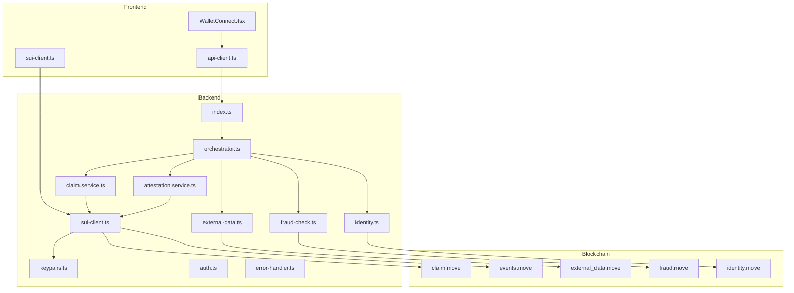
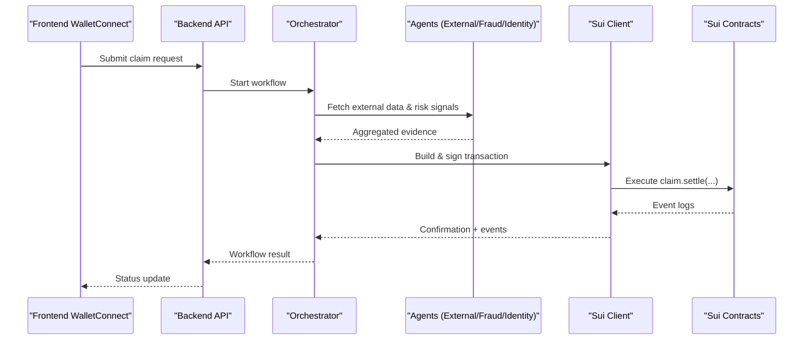
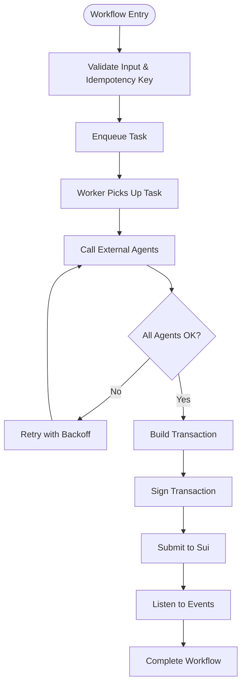
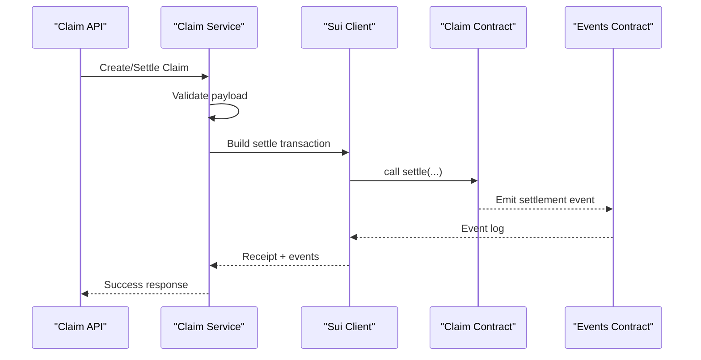
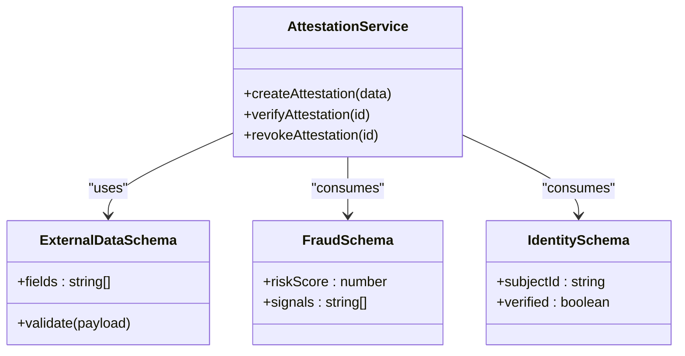
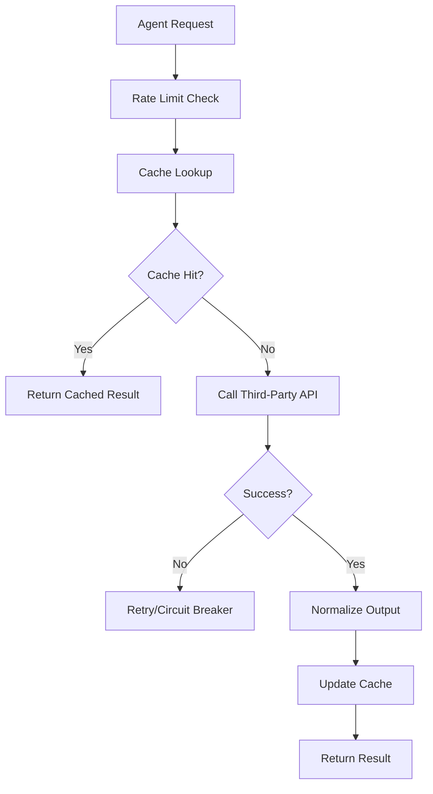
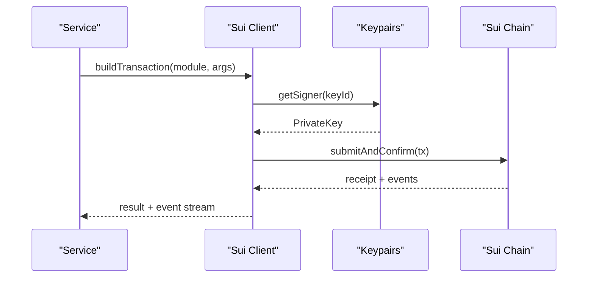
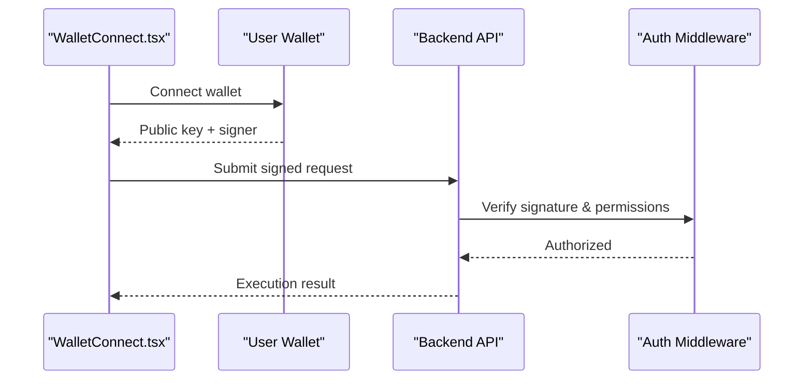
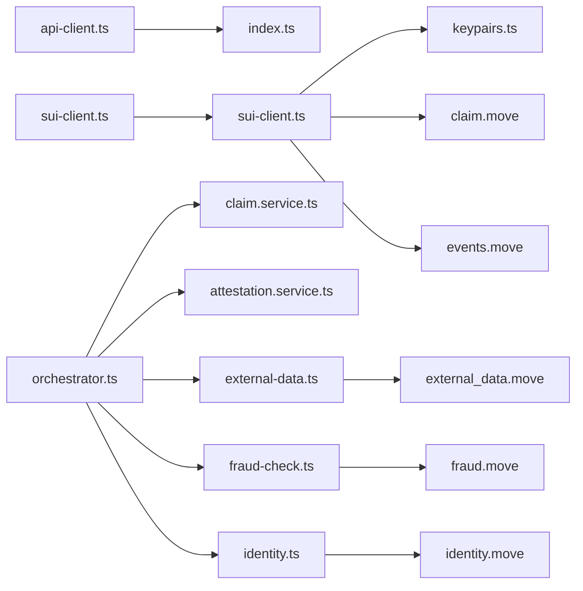

# Integration Patterns

<cite>
**Referenced Files in This Document**
- [backend/src/index.ts](file://backend/src/index.ts)
- [backend/src/config/keypairs.ts](file://backend/src/config/keypairs.ts)
- [backend/src/config/sui-client.ts](file://backend/src/config/sui-client.ts)
- [backend/src/middleware/auth.ts](file://backend/src/middleware/auth.ts)
- [backend/src/middleware/error-handler.ts](file://backend/src/middleware/error-handler.ts)
- [backend/src/agents/external-data.ts](file://backend/src/agents/external-data.ts)
- [backend/src/agents/fraud-check.ts](file://backend/src/agents/fraud-check.ts)
- [backend/src/agents/identity.ts](file://backend/src/agents/identity.ts)
- [backend/src/services/attestation.service.ts](file://backend/src/services/attestation.service.ts)
- [backend/src/services/claim.service.ts](file://backend/src/services/claim.service.ts)
- [backend/src/services/orchestrator.ts](file://backend/src/services/orchestrator.ts)
- [frontend/src/components/WalletConnect.tsx](file://frontend/src/components/WalletConnect.tsx)
- [frontend/src/lib/api-client.ts](file://frontend/src/lib/api-client.ts)
- [frontend/src/lib/sui-client.ts](file://frontend/src/lib/sui-client.ts)
- [contracts/insurix-settlement/sources/claim.move](file://contracts/insurix-settlement/sources/claim.move)
- [contracts/insurix-settlement/sources/events.move](file://contracts/insurix-settlement/sources/events.move)
- [contracts/insurix-schemas/sources/external_data.move](file://contracts/insurix-schemas/sources/external_data.move)
- [contracts/insurix-schemas/sources/fraud.move](file://contracts/insurix-schemas/sources/fraud.move)
- [contracts/insurix-schemas/sources/identity.move](file://contracts/insurix-schemas/sources/identity.move)
</cite>

## Table of Contents
1. [Introduction](#introduction)
2. [Project Structure](#project-structure)
3. [Core Components](#core-components)
4. [Architecture Overview](#architecture-overview)
5. [Detailed Component Analysis](#detailed-component-analysis)
6. [Dependency Analysis](#dependency-analysis)
7. [Performance Considerations](#performance-considerations)
8. [Troubleshooting Guide](#troubleshooting-guide)
9. [Conclusion](#conclusion)

## Introduction
This document describes the integration patterns used across the Insurix ecosystem to connect external services (AI agents, oracles, third-party APIs), integrate with the Sui blockchain via the Sui SDK, and orchestrate asynchronous workflows with robust fault tolerance. It covers wallet connectivity, signature verification, multi-chain readiness, message queuing, retries, rate limiting, circuit breakers, and security best practices for key management and secure communication.

## Project Structure
The Insurix codebase is organized into backend services, frontend components, and Move smart contracts:
- Backend: Node.js/TypeScript services implementing agent integrations, claim processing, attestation handling, and Sui client configuration.
- Frontend: Next.js application with wallet connection utilities and API clients for interacting with backend services and Sui.
- Contracts: Move modules defining schemas for external data, fraud signals, identity, and settlement flows including events.

**Diagram sources**
- [backend/src/index.ts](file://backend/src/index.ts)
- [backend/src/services/orchestrator.ts](file://backend/src/services/orchestrator.ts)
- [backend/src/services/claim.service.ts](file://backend/src/services/claim.service.ts)
- [backend/src/services/attestation.service.ts](file://backend/src/services/attestation.service.ts)
- [backend/src/agents/external-data.ts](file://backend/src/agents/external-data.ts)
- [backend/src/agents/fraud-check.ts](file://backend/src/agents/fraud-check.ts)
- [backend/src/agents/identity.ts](file://backend/src/agents/identity.ts)
- [backend/src/config/sui-client.ts](file://backend/src/config/sui-client.ts)
- [backend/src/config/keypairs.ts](file://backend/src/config/keypairs.ts)
- [frontend/src/components/WalletConnect.tsx](file://frontend/src/components/WalletConnect.tsx)
- [frontend/src/lib/api-client.ts](file://frontend/src/lib/api-client.ts)
- [frontend/src/lib/sui-client.ts](file://frontend/src/lib/sui-client.ts)
- [contracts/insurix-settlement/sources/claim.move](file://contracts/insurix-settlement/sources/claim.move)
- [contracts/insurix-settlement/sources/events.move](file://contracts/insurix-settlement/sources/events.move)
- [contracts/insurix-schemas/sources/external_data.move](file://contracts/insurix-schemas/sources/external_data.move)
- [contracts/insurix-schemas/sources/fraud.move](file://contracts/insurix-schemas/sources/fraud.move)
- [contracts/insurix-schemas/sources/identity.move](file://contracts/insurix-schemas/sources/identity.move)

**Section sources**
- [backend/src/index.ts](file://backend/src/index.ts)
- [backend/src/services/orchestrator.ts](file://backend/src/services/orchestrator.ts)
- [frontend/src/components/WalletConnect.tsx](file://frontend/src/components/WalletConnect.tsx)
- [frontend/src/lib/api-client.ts](file://frontend/src/lib/api-client.ts)
- [frontend/src/lib/sui-client.ts](file://frontend/src/lib/sui-client.ts)

## Core Components
- Orchestrator service coordinates multi-step workflows involving AI agents, oracles, and blockchain transactions.
- Claim service manages lifecycle of claims, integrates with Sui settlement contracts, and emits/listens to on-chain events.
- Attestation service handles creation, verification, and revocation of attestations using Sui SDK and Move schemas.
- External data, fraud-check, and identity agents encapsulate calls to third-party APIs and transform results into canonical formats consumed by contracts.
- Sui client configuration centralizes network settings, keypair management, and transaction signing utilities.
- Frontend wallet component enables user wallet connections and offloads signing to the user’s wallet while delegating execution to backend services.

**Section sources**
- [backend/src/services/orchestrator.ts](file://backend/src/services/orchestrator.ts)
- [backend/src/services/claim.service.ts](file://backend/src/services/claim.service.ts)
- [backend/src/services/attestation.service.ts](file://backend/src/services/attestation.service.ts)
- [backend/src/agents/external-data.ts](file://backend/src/agents/external-data.ts)
- [backend/src/agents/fraud-check.ts](file://backend/src/agents/fraud-check.ts)
- [backend/src/agents/identity.ts](file://backend/src/agents/identity.ts)
- [backend/src/config/sui-client.ts](file://backend/src/config/sui-client.ts)
- [backend/src/config/keypairs.ts](file://backend/src/config/keypairs.ts)
- [frontend/src/components/WalletConnect.tsx](file://frontend/src/components/WalletConnect.tsx)

## Architecture Overview
Insurix follows a layered architecture:
- Presentation layer (frontend) handles UI and wallet connectivity.
- API layer exposes endpoints for claim submission, attestation operations, and status queries.
- Service layer orchestrates business logic and integrates with external agents and blockchain.
- Blockchain layer interacts with Sui via the Sui SDK and Move contracts.

**Diagram sources**
- [frontend/src/components/WalletConnect.tsx](file://frontend/src/components/WalletConnect.tsx)
- [backend/src/index.ts](file://backend/src/index.ts)
- [backend/src/services/orchestrator.ts](file://backend/src/services/orchestrator.ts)
- [backend/src/agents/external-data.ts](file://backend/src/agents/external-data.ts)
- [backend/src/agents/fraud-check.ts](file://backend/src/agents/fraud-check.ts)
- [backend/src/agents/identity.ts](file://backend/src/agents/identity.ts)
- [backend/src/config/sui-client.ts](file://backend/src/config/sui-client.ts)
- [contracts/insurix-settlement/sources/claim.move](file://contracts/insurix-settlement/sources/claim.move)
- [contracts/insurix-settlement/sources/events.move](file://contracts/insurix-settlement/sources/events.move)

## Detailed Component Analysis

### Orchestration and Asynchronous Processing
The orchestrator composes multiple agent calls and blockchain interactions into a cohesive workflow. It supports:
- Message queuing for decoupled tasks (e.g., background job queues).
- Retry mechanisms with exponential backoff for transient failures.
- Circuit breaker patterns to fail fast when downstream services are unhealthy.
- Idempotency keys to prevent duplicate processing.

**Diagram sources**
- [backend/src/services/orchestrator.ts](file://backend/src/services/orchestrator.ts)
- [backend/src/agents/external-data.ts](file://backend/src/agents/external-data.ts)
- [backend/src/agents/fraud-check.ts](file://backend/src/agents/fraud-check.ts)
- [backend/src/agents/identity.ts](file://backend/src/agents/identity.ts)
- [backend/src/config/sui-client.ts](file://backend/src/config/sui-client.ts)

**Section sources**
- [backend/src/services/orchestrator.ts](file://backend/src/services/orchestrator.ts)

### Claim Service and Settlement Flow
The claim service manages claim lifecycle and settlement:
- Validates inputs and constructs settlement payloads.
- Interacts with Sui settlement contracts to finalize payouts or hold funds in escrow.
- Emits and listens to on-chain events for state transitions.

**Diagram sources**
- [backend/src/services/claim.service.ts](file://backend/src/services/claim.service.ts)
- [backend/src/config/sui-client.ts](file://backend/src/config/sui-client.ts)
- [contracts/insurix-settlement/sources/claim.move](file://contracts/insurix-settlement/sources/claim.move)
- [contracts/insurix-settlement/sources/events.move](file://contracts/insurix-settlement/sources/events.move)

**Section sources**
- [backend/src/services/claim.service.ts](file://backend/src/services/claim.service.ts)
- [contracts/insurix-settlement/sources/claim.move](file://contracts/insurix-settlement/sources/claim.move)
- [contracts/insurix-settlement/sources/events.move](file://contracts/insurix-settlement/sources/events.move)

### Attestation Service and Schema Integration
Attestations are created, verified, and revoked through the attestation service:
- Uses Move schemas for external data, fraud signals, and identity to ensure on-chain consistency.
- Integrates with Sui SDK to publish and query attestations.
- Supports revocation workflows and audit trails.

**Diagram sources**
- [backend/src/services/attestation.service.ts](file://backend/src/services/attestation.service.ts)
- [contracts/insurix-schemas/sources/external_data.move](file://contracts/insurix-schemas/sources/external_data.move)
- [contracts/insurix-schemas/sources/fraud.move](file://contracts/insurix-schemas/sources/fraud.move)
- [contracts/insurix-schemas/sources/identity.move](file://contracts/insurix-schemas/sources/identity.move)

**Section sources**
- [backend/src/services/attestation.service.ts](file://backend/src/services/attestation.service.ts)
- [contracts/insurix-schemas/sources/external_data.move](file://contracts/insurix-schemas/sources/external_data.move)
- [contracts/insurix-schemas/sources/fraud.move](file://contracts/insurix-schemas/sources/fraud.move)
- [contracts/insurix-schemas/sources/identity.move](file://contracts/insurix-schemas/sources/identity.move)

### Agent Integrations (External Data, Fraud, Identity)
Agents encapsulate third-party API calls and normalize outputs:
- External data agent fetches market or policy data from oracles.
- Fraud-check agent evaluates risk signals and returns structured scores.
- Identity agent verifies subject identities and returns standardized proofs.

**Diagram sources**
- [backend/src/agents/external-data.ts](file://backend/src/agents/external-data.ts)
- [backend/src/agents/fraud-check.ts](file://backend/src/agents/fraud-check.ts)
- [backend/src/agents/identity.ts](file://backend/src/agents/identity.ts)

**Section sources**
- [backend/src/agents/external-data.ts](file://backend/src/agents/external-data.ts)
- [backend/src/agents/fraud-check.ts](file://backend/src/agents/fraud-check.ts)
- [backend/src/agents/identity.ts](file://backend/src/agents/identity.ts)

### Sui SDK Integration, Signing, and Event Listening
The Sui client centralizes:
- Network configuration and RPC endpoints.
- Keypair management for transaction signing.
- Building, signing, and submitting transactions.
- Event subscription and filtering for settlement and attestation events.

**Diagram sources**
- [backend/src/config/sui-client.ts](file://backend/src/config/sui-client.ts)
- [backend/src/config/keypairs.ts](file://backend/src/config/keypairs.ts)
- [contracts/insurix-settlement/sources/events.move](file://contracts/insurix-settlement/sources/events.move)

**Section sources**
- [backend/src/config/sui-client.ts](file://backend/src/config/sui-client.ts)
- [backend/src/config/keypairs.ts](file://backend/src/config/keypairs.ts)

### Wallet Connectivity and Signature Verification
Frontend wallet component connects users’ wallets and delegates signing:
- Establishes wallet connection and retrieves public keys.
- Offloads signing to the user’s wallet for security.
- Sends signed payloads to backend for validation and execution.

**Diagram sources**
- [frontend/src/components/WalletConnect.tsx](file://frontend/src/components/WalletConnect.tsx)
- [backend/src/middleware/auth.ts](file://backend/src/middleware/auth.ts)
- [frontend/src/lib/api-client.ts](file://frontend/src/lib/api-client.ts)

**Section sources**
- [frontend/src/components/WalletConnect.tsx](file://frontend/src/components/WalletConnect.tsx)
- [backend/src/middleware/auth.ts](file://backend/src/middleware/auth.ts)
- [frontend/src/lib/api-client.ts](file://frontend/src/lib/api-client.ts)

## Dependency Analysis
The system exhibits clear separation of concerns:
- Frontend depends on API client and Sui client for user interactions.
- Backend orchestrators depend on agents and Sui client for external integrations and blockchain operations.
- Contracts define immutable schemas and event structures consumed by services.

**Diagram sources**
- [frontend/src/lib/api-client.ts](file://frontend/src/lib/api-client.ts)
- [frontend/src/lib/sui-client.ts](file://frontend/src/lib/sui-client.ts)
- [backend/src/index.ts](file://backend/src/index.ts)
- [backend/src/services/orchestrator.ts](file://backend/src/services/orchestrator.ts)
- [backend/src/services/claim.service.ts](file://backend/src/services/claim.service.ts)
- [backend/src/services/attestation.service.ts](file://backend/src/services/attestation.service.ts)
- [backend/src/agents/external-data.ts](file://backend/src/agents/external-data.ts)
- [backend/src/agents/fraud-check.ts](file://backend/src/agents/fraud-check.ts)
- [backend/src/agents/identity.ts](file://backend/src/agents/identity.ts)
- [backend/src/config/sui-client.ts](file://backend/src/config/sui-client.ts)
- [backend/src/config/keypairs.ts](file://backend/src/config/keypairs.ts)
- [contracts/insurix-settlement/sources/claim.move](file://contracts/insurix-settlement/sources/claim.move)
- [contracts/insurix-settlement/sources/events.move](file://contracts/insurix-settlement/sources/events.move)
- [contracts/insurix-schemas/sources/external_data.move](file://contracts/insurix-schemas/sources/external_data.move)
- [contracts/insurix-schemas/sources/fraud.move](file://contracts/insurix-schemas/sources/fraud.move)
- [contracts/insurix-schemas/sources/identity.move](file://contracts/insurix-schemas/sources/identity.move)

**Section sources**
- [backend/src/services/orchestrator.ts](file://backend/src/services/orchestrator.ts)
- [backend/src/config/sui-client.ts](file://backend/src/config/sui-client.ts)
- [frontend/src/lib/api-client.ts](file://frontend/src/lib/api-client.ts)

## Performance Considerations
- Use caching at agent layers to reduce latency and external API costs.
- Implement rate limiting per tenant or endpoint to protect downstream services.
- Apply circuit breakers around third-party APIs and Sui RPC endpoints to avoid cascading failures.
- Employ idempotent operations and deduplication keys to handle retries safely.
- Batch event subscriptions and filter on-chain events efficiently to minimize overhead.
- Scale workers horizontally for high-throughput claim processing.

[No sources needed since this section provides general guidance]

## Troubleshooting Guide
Common issues and resolutions:
- Authentication failures: Ensure signatures match expected algorithms and public keys; verify middleware configuration.
- Sui transaction errors: Check gas limits, network endpoints, and contract versions; inspect event logs for partial executions.
- Agent timeouts: Configure retry policies and fallback responses; monitor health checks and circuit breaker states.
- Event listener drift: Re-sync event cursors and validate sequence numbers; implement checkpointing.

**Section sources**
- [backend/src/middleware/auth.ts](file://backend/src/middleware/auth.ts)
- [backend/src/middleware/error-handler.ts](file://backend/src/middleware/error-handler.ts)
- [backend/src/config/sui-client.ts](file://backend/src/config/sui-client.ts)

## Conclusion
Insurix integrates external AI agents, oracles, and third-party APIs with robust orchestration, resilient messaging, and secure blockchain interactions on Sui. The design emphasizes fault tolerance, performance, and security through rate limiting, circuit breakers, idempotency, and strong key management. By following these patterns, teams can extend integrations confidently while maintaining reliability and compliance.