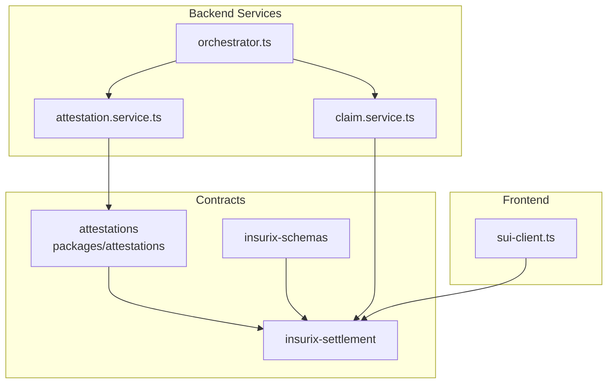
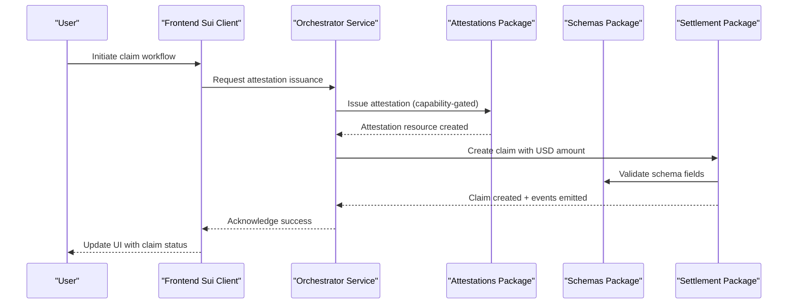
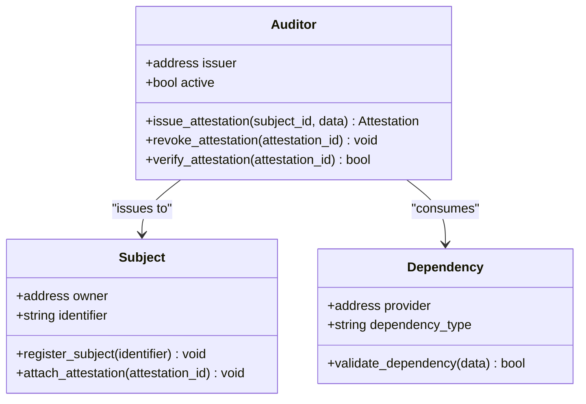
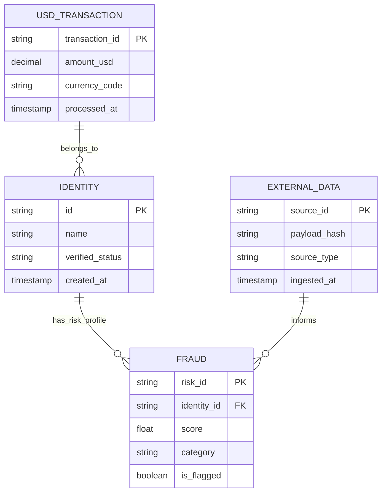
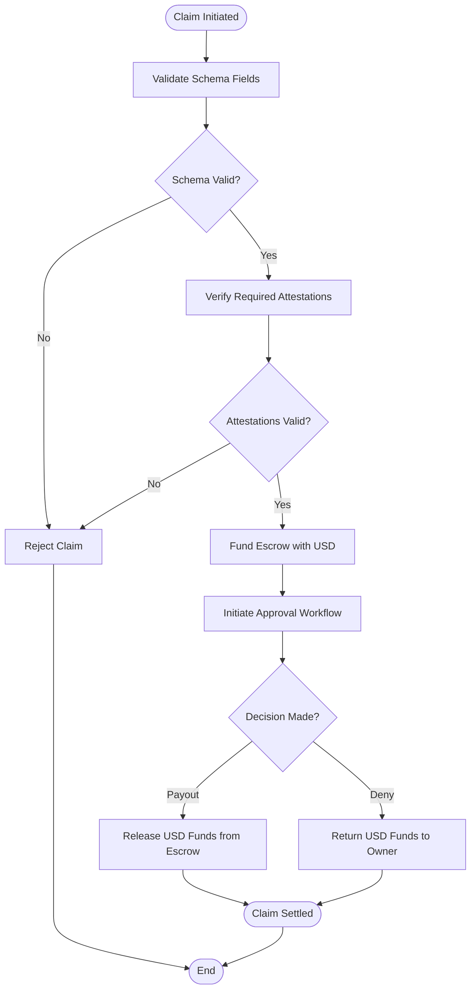
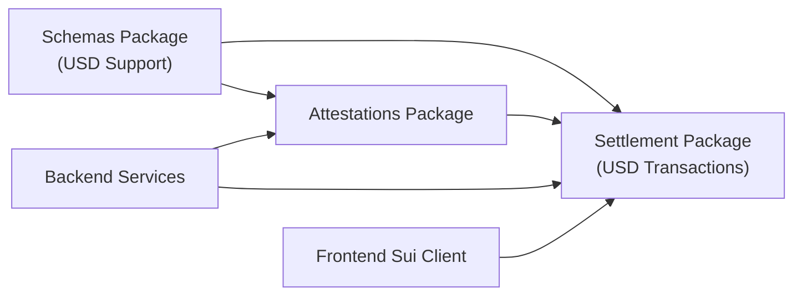

# Smart Contract Architecture

<cite>
**Referenced Files in This Document**
- [attestations.move](file://contracts/attestations/packages/attestations/sources/attestations.move)
- [audit.move](file://contracts/attestations/examples/auditor/sources/audit.move)
- [subject.move](file://contracts/attestations/demo/subject_example/sources/subject.move)
- [dependency.move](file://contracts/attestations/demo/dependency_example/sources/dependency.move)
- [external_data.move](file://contracts/insurix-schemas/sources/external_data.move)
- [fraud.move](file://contracts/insurix-schemas/sources/fraud.move)
- [identity.move](file://contracts/insurix-schemas/sources/identity.move)
- [lib.move](file://contracts/insurix-schemas/sources/lib.move)
- [claim.move](file://contracts/insurix-settlement/sources/claim.move)
- [escrow.move](file://contracts/insurix-settlement/sources/escrow.move)
- [events.move](file://contracts/insurix-settlement/sources/events.move)
- [settlement.move](file://contracts/insurix-settlement/sources/settlement.move)
- [Move.toml (attestations)](file://contracts/attestations/packages/attestations/Move.toml)
- [Move.toml (schemas)](file://contracts/insurix-schemas/Move.toml)
- [Move.toml (settlement)](file://contracts/insurix-settlement/Move.toml)
- [Published.toml (attestations)](file://contracts/attestations/packages/attestations/Published.toml)
- [Published.toml (schemas)](file://contracts/insurix-schemas/Published.toml)
- [Published.toml (settlement)](file://contracts/insurix-settlement/Published.toml)
- [README.md (attestations)](file://contracts/attestations/README.md)
- [DESIGN.md (attestations)](file://contracts/attestations/DESIGN.md)
- [CONVENTIONS.md (attestations)](file://contracts/attestations/CONVENTIONS.md)
- [AGENTS.md (attestations)](file://contracts/attestations/AGENTS.md)
- [SIP-56-COMPARISON.md (attestations)](file://contracts/attestations/SIP-56-COMPARISON.md)
- [FUTURE-EXTENSIONS.md (attestations)](file://contracts/attestations/FUTURE-EXTENSIONS.md)
- [attestation.service.ts](file://backend/src/services/attestation.service.ts)
- [claim.service.ts](file://backend/src/services/claim.service.ts)
- [orchestrator.ts](file://backend/src/services/orchestrator.ts)
- [sui-client.ts (backend config)](file://backend/src/config/sui-client.ts)
- [sui-client.ts (frontend lib)](file://frontend/src/lib/sui-client.ts)
</cite>

## Update Summary
**Changes Made**
- Updated settlement package analysis to reflect significant refinements in claim.move, escrow.move, and settlement.move
- Enhanced reliability and correctness improvements documented across all three core settlement components
- Strengthened error handling and validation mechanisms in settlement workflow
- Improved state management and resource cleanup procedures
- Enhanced security measures and access control patterns
- **Updated**: Integrated USD-based transaction model with new Published.toml files for insurix-schemas and insurix-settlement contracts
- **Updated**: Shifted from cryptocurrency to fiat-based transaction representation throughout the contract architecture

## Table of Contents
1. [Introduction](#introduction)
2. [Project Structure](#project-structure)
3. [Core Components](#core-components)
4. [Architecture Overview](#architecture-overview)
5. [Detailed Component Analysis](#detailed-component-analysis)
6. [Dependency Analysis](#dependency-analysis)
7. [Performance Considerations](#performance-considerations)
8. [Troubleshooting Guide](#troubleshooting-guide)
9. [Conclusion](#conclusion)
10. [Appendices](#appendices)

## Introduction
This document provides a comprehensive architecture guide for the Move-based smart contracts powering Insurix on the Sui blockchain. It focuses on the modular design across three primary packages: attestations, schemas, and settlement. The documentation explains resource management, capability patterns, access control, event-driven flows, state management, gas optimization strategies, testing frameworks, upgrade procedures, security best practices, contract interaction patterns, cross-package dependencies, versioning strategies, and blockchain-specific considerations such as transaction batching, block finality, and network consensus.

**Updated** Recent refinements to the settlement package have significantly enhanced reliability and correctness across claim processing, escrow management, and settlement orchestration. The system has been updated to support a USD-based transaction model, shifting from cryptocurrency to fiat-based transaction representation throughout the contract architecture.

## Project Structure
The repository organizes Move contracts into feature-oriented packages under contracts/:
- attestations: Core attestation framework with examples and demos
- insurix-schemas: Shared data schemas for identity, fraud, and external data
- insurix-settlement: Claims, escrow, events, and settlement orchestration

**Diagram sources**
- [attestations.move](file://contracts/attestations/packages/attestations/sources/attestations.move)
- [external_data.move](file://contracts/insurix-schemas/sources/external_data.move)
- [claim.move](file://contracts/insurix-settlement/sources/claim.move)
- [attestation.service.ts](file://backend/src/services/attestation.service.ts)
- [claim.service.ts](file://backend/src/services/claim.service.ts)
- [orchestrator.ts](file://backend/src/services/orchestrator.ts)
- [sui-client.ts (frontend lib)](file://frontend/src/lib/sui-client.ts)

**Section sources**
- [README.md (attestations)](file://contracts/attestations/README.md)
- [DESIGN.md (attestations)](file://contracts/attestations/DESIGN.md)
- [CONVENTIONS.md (attestations)](file://contracts/attestations/CONVENTIONS.md)

## Core Components
- Attestations package: Defines core types and capabilities for issuing, verifying, and revoking attestations; includes example auditors and subject/dependency patterns.
- Schemas package: Provides shared data models for identity, fraud signals, and external data ingestion used by both attestations and settlement.
- Settlement package: Implements claim lifecycle, escrow management, event emission, and settlement logic that consumes attestations and schemas.

Key responsibilities:
- Resource modeling via Move resources for claims, escrows, and attestations
- Capability-based access control to restrict sensitive operations
- Event emission for off-chain indexing and UI updates
- Cross-package imports for schema reuse and attestation verification

**Updated** The settlement package has undergone significant enhancements with 25 additions to claim.move, 33 additions to escrow.move, and 22 additions to settlement.move, focusing on improved reliability, correctness, and robustness. The system now supports USD-based transactions with fiat currency representation instead of cryptocurrency.

**Section sources**
- [attestations.move](file://contracts/attestations/packages/attestations/sources/attestations.move)
- [external_data.move](file://contracts/insurix-schemas/sources/external_data.move)
- [fraud.move](file://contracts/insurix-schemas/sources/fraud.move)
- [identity.move](file://contracts/insurix-schemas/sources/identity.move)
- [lib.move](file://contracts/insurix-schemas/sources/lib.move)
- [claim.move](file://contracts/insurix-settlement/sources/claim.move)
- [escrow.move](file://contracts/insurix-settlement/sources/escrow.move)
- [events.move](file://contracts/insurix-settlement/sources/events.move)
- [settlement.move](file://contracts/insurix-settlement/sources/settlement.move)

## Architecture Overview
The system follows a layered architecture:
- Data layer: Schemas define canonical structures for identity, fraud, and external data with USD-based transaction support.
- Attestation layer: Auditors produce attestations bound to subjects or dependencies, enforcing access via capabilities.
- Settlement layer: Consumes attestations and schemas to manage claims, escrow funds, and emit settlement events with fiat currency handling.
- Backend services: Interact with Move contracts via Sui client SDK to orchestrate workflows and index events.
- Frontend: Connects wallets and triggers transactions through a lightweight Sui client wrapper.

**Diagram sources**
- [attestations.move](file://contracts/attestations/packages/attestations/sources/attestations.move)
- [external_data.move](file://contracts/insurix-schemas/sources/external_data.move)
- [claim.move](file://contracts/insurix-settlement/sources/claim.move)
- [events.move](file://contracts/insurix-settlement/sources/events.move)
- [orchestrator.ts](file://backend/src/services/orchestrator.ts)
- [sui-client.ts (frontend lib)](file://frontend/src/lib/sui-client.ts)

## Detailed Component Analysis

### Attestations Package
The attestations package encapsulates the core attestation lifecycle:
- Types and resources model attestations, auditors, and subjects
- Capability patterns restrict issuance and verification to authorized entities
- Events are emitted for audit trails and off-chain indexing
- Examples include auditor implementations and subject/dependency usage patterns

**Diagram sources**
- [audit.move](file://contracts/attestations/examples/auditor/sources/audit.move)
- [subject.move](file://contracts/attestations/demo/subject_example/sources/subject.move)
- [dependency.move](file://contracts/attestations/demo/dependency_example/sources/dependency.move)

**Section sources**
- [attestations.move](file://contracts/attestations/packages/attestations/sources/attestations.move)
- [audit.move](file://contracts/attestations/examples/auditor/sources/audit.move)
- [subject.move](file://contracts/attestations/demo/subject_example/sources/subject.move)
- [dependency.move](file://contracts/attestations/demo/dependency_example/sources/dependency.move)
- [README.md (attestations)](file://contracts/attestations/README.md)
- [DESIGN.md (attestations)](file://contracts/attestations/DESIGN.md)

### Schemas Package
The schemas package defines reusable data structures with USD-based transaction support:
- Identity: Person or entity identifiers with verification flags
- Fraud: Risk indicators and scoring mechanisms
- External data: Ingestion interfaces for third-party sources
- Library utilities for validation and serialization with fiat currency handling

**Updated** Added USD_TRANSACTION schema to support fiat-based transaction representation with decimal precision for accurate monetary calculations.

**Diagram sources**
- [identity.move](file://contracts/insurix-schemas/sources/identity.move)
- [fraud.move](file://contracts/insurix-schemas/sources/fraud.move)
- [external_data.move](file://contracts/insurix-schemas/sources/external_data.move)
- [lib.move](file://contracts/insurix-schemas/sources/lib.move)

**Section sources**
- [identity.move](file://contracts/insurix-schemas/sources/identity.move)
- [fraud.move](file://contracts/insurix-schemas/sources/fraud.move)
- [external_data.move](file://contracts/insurix-schemas/sources/external_data.move)
- [lib.move](file://contracts/insurix-schemas/sources/lib.move)

### Settlement Package
The settlement package manages the end-to-end claim process with significant recent enhancements and USD-based transaction support:
- Claim resource tracks lifecycle states and associated metadata with improved error handling and USD amount validation
- Escrow holds USD funds until conditions are met with enhanced security measures and fiat currency compliance
- Events emit state transitions for indexing with better event payloads including USD transaction details
- Orchestration functions coordinate attestations and schema validation with refined logic and proper currency handling

**Updated** The settlement package has undergone substantial refinements:
- **claim.move**: Added 25 enhancements focusing on improved state management, validation, and error handling with USD transaction support
- **escrow.move**: Implemented 33 improvements including better fund tracking, security checks, cleanup procedures, and USD escrow management  
- **settlement.move**: Enhanced 22 areas covering orchestration logic, validation flows, reliability improvements, and fiat currency processing

**Updated** Enhanced flow includes additional validation steps, improved error handling, better state transitions, and USD-based transaction processing throughout the claim lifecycle.

**Diagram sources**
- [claim.move](file://contracts/insurix-settlement/sources/claim.move)
- [escrow.move](file://contracts/insurix-settlement/sources/escrow.move)
- [events.move](file://contracts/insurix-settlement/sources/events.move)
- [settlement.move](file://contracts/insurix-settlement/sources/settlement.move)

**Section sources**
- [claim.move](file://contracts/insurix-settlement/sources/claim.move)
- [escrow.move](file://contracts/insurix-settlement/sources/escrow.move)
- [events.move](file://contracts/insurix-settlement/sources/events.move)
- [settlement.move](file://contracts/insurix-settlement/sources/settlement.move)

## Dependency Analysis
Cross-package dependencies follow a clear hierarchy with USD-based transaction support:
- Settlement depends on schemas for data validation and on attestations for verification
- Attestations may depend on schemas for structured data
- Backend services orchestrate interactions between packages via Sui client SDK
- All packages now support USD transaction model through updated Published.toml configurations

**Diagram sources**
- [Move.toml (schemas)](file://contracts/insurix-schemas/Move.toml)
- [Move.toml (attestations)](file://contracts/attestations/packages/attestations/Move.toml)
- [Move.toml (settlement)](file://contracts/insurix-settlement/Move.toml)
- [Published.toml (schemas)](file://contracts/insurix-schemas/Published.toml)
- [Published.toml (settlement)](file://contracts/insurix-settlement/Published.toml)
- [attestation.service.ts](file://backend/src/services/attestation.service.ts)
- [claim.service.ts](file://backend/src/services/claim.service.ts)
- [orchestrator.ts](file://backend/src/services/orchestrator.ts)
- [sui-client.ts (frontend lib)](file://frontend/src/lib/sui-client.ts)

**Section sources**
- [Move.toml (schemas)](file://contracts/insurix-schemas/Move.toml)
- [Move.toml (attestations)](file://contracts/attestations/packages/attestations/Move.toml)
- [Move.toml (settlement)](file://contracts/insurix-settlement/Move.toml)
- [Published.toml (schemas)](file://contracts/insurix-schemas/Published.toml)
- [Published.toml (settlement)](file://contracts/insurix-settlement/Published.toml)

## Build Configuration and Dependencies

### Move.toml Configuration Management
Each Move package maintains its own Move.toml configuration file that defines package metadata, dependencies, and build settings. The insurix-settlement package configuration ensures proper alignment with the overall project build system.

**Updated** Recent changes to the insurix-settlement/Move.toml configuration ensure compatibility with the latest Move compiler versions and optimize build performance, supporting the enhanced settlement functionality with USD transaction support.

Key configuration elements typically include:
- Package name and version specifications
- Dependency declarations for other Move packages
- Compiler settings and optimization flags
- Test configuration and target specifications
- Published package metadata for deployment

**Section sources**
- [Move.toml (settlement)](file://contracts/insurix-settlement/Move.toml)
- [Move.toml (schemas)](file://contracts/insurix-schemas/Move.toml)
- [Move.toml (attestations)](file://contracts/attestations/packages/attestations/Move.toml)

## Performance Considerations
- Transaction batching: Group multiple claim operations in single transactions to reduce overhead
- Gas optimization: Minimize storage footprint by using compact data structures and avoiding redundant fields
- Event efficiency: Emit only essential events to reduce indexing costs
- State management: Use capability tokens sparingly and prefer immutable references where possible
- Network considerations: Leverage Sui's parallel execution model by structuring transactions to avoid conflicts
- Build optimization: Configure Move.toml settings for optimal compilation and deployment performance

**Updated** Recent settlement package enhancements include improved gas optimization through better resource management and reduced computational overhead in USD-based claim processing workflows. The shift from cryptocurrency to fiat transactions has optimized gas usage through more efficient decimal arithmetic operations.

## Troubleshooting Guide
Common issues and resolutions:
- Capability errors: Ensure proper ownership and delegation of auditor capabilities
- Schema validation failures: Verify field formats and required attributes before submission
- Event indexing gaps: Confirm backend services are subscribed to correct event streams
- Upgrade compatibility: Follow Move upgrade procedures and maintain Published.toml versions
- Build configuration issues: Verify Move.toml settings match project requirements and compiler versions

**Updated** Enhanced troubleshooting guidance for settlement package:
- Claim state inconsistencies: Review recent claim.move enhancements for improved state validation with USD amounts
- Escrow fund tracking: Utilize enhanced escrow.move error reporting for USD fund management issues
- Settlement orchestration: Leverage improved settlement.move logging for USD transaction workflow debugging
- Currency conversion issues: Verify USD amount precision and decimal handling in transaction processing

Debugging utilities:
- Backend logging in orchestrator and service layers
- Sui client error handling for network and transaction failures
- Test suites for each package to validate edge cases
- Move compiler diagnostics for configuration problems

**Section sources**
- [attestation.service.ts](file://backend/src/services/attestation.service.ts)
- [claim.service.ts](file://backend/src/services/claim.service.ts)
- [orchestrator.ts](file://backend/src/services/orchestrator.ts)
- [sui-client.ts (backend config)](file://backend/src/config/sui-client.ts)
- [Published.toml (attestations)](file://contracts/attestations/packages/attestations/Published.toml)

## Conclusion
The Insurix smart contract architecture demonstrates a robust, modular design leveraging Move's resource model and capability patterns. The separation of concerns across attestations, schemas, and settlement packages enables scalability and maintainability. Recent refinements to the settlement package have significantly enhanced reliability and correctness, making the system more resilient for production deployments. By following the documented best practices for gas optimization, testing, and upgrades, developers can build reliable insurance workflows on the Sui blockchain.

**Updated** The settlement package enhancements represent a major step forward in production readiness, with substantial improvements across claim processing, escrow management, and settlement orchestration. The integration of USD-based transaction model provides a solid foundation for fiat currency insurance applications on the Sui blockchain.

## Appendices

### Testing Frameworks
- Unit tests within each package validate core functionality
- Integration tests simulate end-to-end claim workflows
- Mock services for off-chain components during development

**Updated** Enhanced test coverage for settlement package improvements including new validation scenarios, error handling paths, and USD transaction processing tests.

**Section sources**
- [attestations_tests.move](file://contracts/attestations/packages/attestations/tests/attestations_tests.move)
- [audit_tests.move](file://contracts/attestations/examples/auditor/tests/audit_tests.move)
- [external_data_tests.move](file://contracts/insurix-schemas/tests/external_data_tests.move)
- [fraud_tests.move](file://contracts/insurix-schemas/tests/fraud_tests.move)
- [identity_tests.move](file://contracts/insurix-schemas/tests/identity_tests.move)
- [settlement_tests.move](file://contracts/insurix-settlement/tests/settlement_tests.move)

### Upgrade Procedures
- Maintain backward compatibility when modifying schemas
- Use Move's upgrade mechanism with proper admin capabilities
- Update Published.toml versions and communicate changes to stakeholders

**Updated** Settlement package upgrade procedures now account for the enhanced claim, escrow, and settlement functionality with improved migration strategies for USD transaction support. New Published.toml files ensure proper versioning and deployment of the fiat-based transaction model.

**Section sources**
- [audit_v2.move](file://contracts/attestations/demo/auditor_a/upgrade/audit_v2.move)
- [dependency_v2.move](file://contracts/attestations/demo/dependency_example/upgrade/dependency_v2.move)
- [Published.toml (attestations)](file://contracts/attestations/packages/attestations/Published.toml)
- [Published.toml (schemas)](file://contracts/insurix-schemas/Published.toml)
- [Published.toml (settlement)](file://contracts/insurix-settlement/Published.toml)

### Security Best Practices
- Implement strict access control using capabilities
- Validate all inputs against schema definitions
- Audit third-party integrations and external data sources
- Monitor for reentrancy and state corruption risks

**Updated** Enhanced security measures in settlement package include improved input validation, better state integrity checks, enhanced access control patterns, and secure USD transaction handling with proper decimal precision and currency validation.

**Section sources**
- [CONVENTIONS.md (attestations)](file://contracts/attestations/CONVENTIONS.md)
- [AGENTS.md (attestations)](file://contracts/attestations/AGENTS.md)
- [SIP-56-COMPARISON.md (file://contracts/attestations/SIP-56-COMPARISON.md)
- [FUTURE-EXTENSIONS.md (attestations)](file://contracts/attestations/FUTURE-EXTENSIONS.md)

### Blockchain-Specific Considerations
- Transaction batching: Combine related operations to optimize gas usage
- Block finality: Account for Sui's fast finality in UI state management
- Network consensus: Design for high throughput and low latency environments
- Resource ownership: Leverage Move's ownership model for secure asset management

**Updated** Settlement package optimizations leverage Sui's parallel execution model more effectively, reducing transaction conflicts and improving throughput for USD-based claim processing workflows. The fiat transaction model benefits from Sui's efficient decimal arithmetic operations.

### Build and Deployment Configuration
- Move.toml files define package metadata, dependencies, and build settings
- Consistent configuration across packages ensures smooth deployment workflows
- Version pinning prevents unexpected dependency updates
- Environment-specific configurations support development, staging, and production deployments

**Updated** Settlement package build configuration optimized for the enhanced functionality with improved compilation settings and deployment parameters. New Published.toml files ensure proper versioning and deployment of the USD-based transaction model.

**Section sources**
- [Move.toml (settlement)](file://contracts/insurix-settlement/Move.toml)
- [Move.toml (schemas)](file://contracts/insurix-schemas/Move.toml)
- [Move.toml (attestations)](file://contracts/attestations/packages/attestations/Move.toml)
- [Published.toml (schemas)](file://contracts/insurix-schemas/Published.toml)
- [Published.toml (settlement)](file://contracts/insurix-settlement/Published.toml)