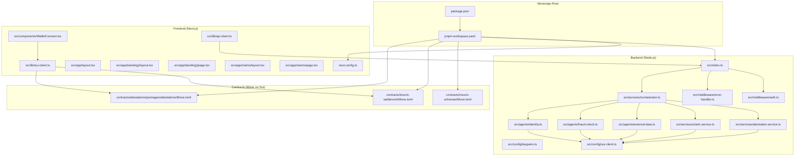
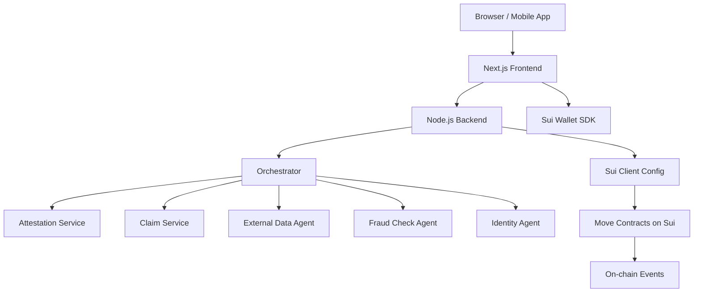
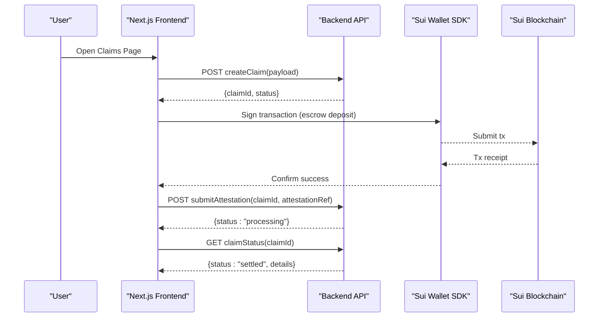
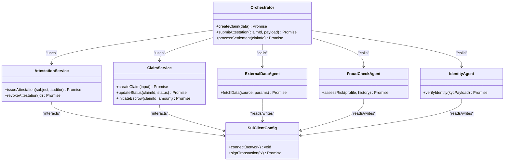
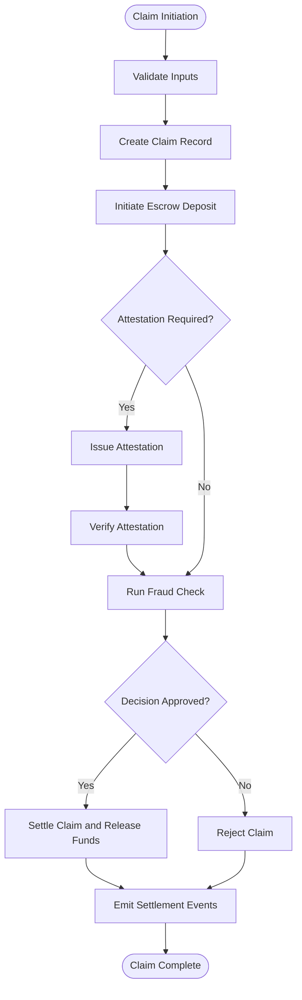
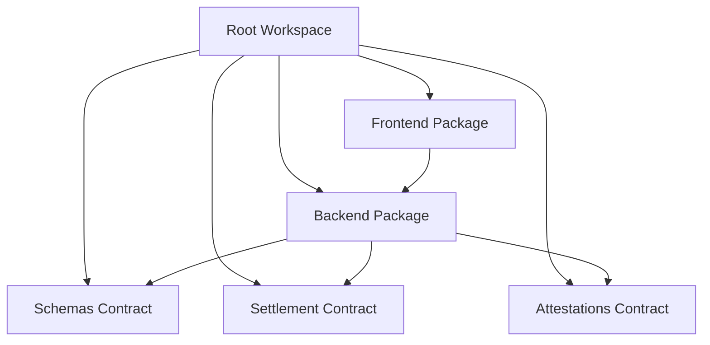

# System Architecture

<cite>
**Referenced Files in This Document**
- [package.json](file://package.json)
- [pnpm-workspace.yaml](file://pnpm-workspace.yaml)
- [frontend/package.json](file://frontend/package.json)
- [frontend/next.config.ts](file://frontend/next.config.ts)
- [frontend/src/app/layout.tsx](file://frontend/src/app/layout.tsx)
- [frontend/src/app/(landing)/layout.tsx](file://frontend/src/app/(landing)/layout.tsx)
- [frontend/src/app/(landing)/page.tsx](file://frontend/src/app/(landing)/page.tsx)
- [frontend/src/app/claims/layout.tsx](file://frontend/src/app/claims/layout.tsx)
- [frontend/src/app/claims/page.tsx](file://frontend/src/app/claims/page.tsx)
- [frontend/src/components/WalletConnect.tsx](file://frontend/src/components/WalletConnect.tsx)
- [frontend/src/lib/api-client.ts](file://frontend/src/lib/api-client.ts)
- [frontend/src/lib/sui-client.ts](file://frontend/src/lib/sui-client.ts)
- [backend/src/index.ts](file://backend/src/index.ts)
- [backend/src/config/keypairs.ts](file://backend/src/config/keypairs.ts)
- [backend/src/config/sui-client.ts](file://backend/src/config/sui-client.ts)
- [backend/src/middleware/auth.ts](file://backend/src/middleware/auth.ts)
- [backend/src/middleware/error-handler.ts](file://backend/src/middleware/error-handler.ts)
- [backend/src/services/orchestrator.ts](file://backend/src/services/orchestrator.ts)
- [backend/src/services/attestation.service.ts](file://backend/src/services/attestation.service.ts)
- [backend/src/services/claim.service.ts](file://backend/src/services/claim.service.ts)
- [backend/src/agents/external-data.ts](file://backend/src/agents/external-data.ts)
- [backend/src/agents/fraud-check.ts](file://backend/src/agents/fraud-check.ts)
- [backend/src/agents/identity.ts](file://backend/src/agents/identity.ts)
- [contracts/insurix-schemas/Move.toml](file://contracts/insurix-schemas/Move.toml)
- [contracts/insurix-settlement/Move.toml](file://contracts/insurix-settlement/Move.toml)
- [contracts/attestations/packages/attestations/Move.toml](file://contracts/attestations/packages/attestations/Move.toml)
</cite>

## Table of Contents
1. [Introduction](#introduction)
2. [Project Structure](#project-structure)
3. [Core Components](#core-components)
4. [Architecture Overview](#architecture-overview)
5. [Detailed Component Analysis](#detailed-component-analysis)
6. [Dependency Analysis](#dependency-analysis)
7. [Performance Considerations](#performance-considerations)
8. [Troubleshooting Guide](#troubleshooting-guide)
9. [Conclusion](#conclusion)
10. [Appendices](#appendices)

## Introduction
This document describes the Insurix system architecture, focusing on a three-layer pattern: Next.js frontend, Node.js backend services, and Move smart contracts deployed on the Sui blockchain. It explains how the monorepo is organized with pnpm workspaces, defines component boundaries across layers, and maps data flows between them. It also covers service-oriented design principles, API gateway patterns, inter-service communication, deployment topology, containerization strategy, and infrastructure requirements.

## Project Structure
Insurix is implemented as a monorepo managed by pnpm workspaces. The top-level workspace configuration coordinates multiple packages:
- Frontend: A Next.js application providing user interfaces for claims and landing pages, integrating with wallets and backend APIs.
- Backend: A Node.js/TypeScript service exposing REST endpoints, orchestrating business logic, interacting with Sui via SDK clients, and coordinating agents for external data, identity verification, and fraud checks.
- Contracts: Move packages defining schemas, attestations, and settlement logic for claims and escrow.

**Diagram sources**
- [pnpm-workspace.yaml](file://pnpm-workspace.yaml)
- [frontend/next.config.ts](file://frontend/next.config.ts)
- [frontend/src/app/layout.tsx](file://frontend/src/app/layout.tsx)
- [frontend/src/app/(landing)/layout.tsx](file://frontend/src/app/(landing)/layout.tsx)
- [frontend/src/app/(landing)/page.tsx](file://frontend/src/app/(landing)/page.tsx)
- [frontend/src/app/claims/layout.tsx](file://frontend/src/app/claims/layout.tsx)
- [frontend/src/app/claims/page.tsx](file://frontend/src/app/claims/page.tsx)
- [frontend/src/components/WalletConnect.tsx](file://frontend/src/components/WalletConnect.tsx)
- [frontend/src/lib/api-client.ts](file://frontend/src/lib/api-client.ts)
- [frontend/src/lib/sui-client.ts](file://frontend/src/lib/sui-client.ts)
- [backend/src/index.ts](file://backend/src/index.ts)
- [backend/src/middleware/auth.ts](file://backend/src/middleware/auth.ts)
- [backend/src/middleware/error-handler.ts](file://backend/src/middleware/error-handler.ts)
- [backend/src/services/orchestrator.ts](file://backend/src/services/orchestrator.ts)
- [backend/src/services/attestation.service.ts](file://backend/src/services/attestation.service.ts)
- [backend/src/services/claim.service.ts](file://backend/src/services/claim.service.ts)
- [backend/src/agents/external-data.ts](file://backend/src/agents/external-data.ts)
- [backend/src/agents/fraud-check.ts](file://backend/src/agents/fraud-check.ts)
- [backend/src/agents/identity.ts](file://backend/src/agents/identity.ts)
- [backend/src/config/keypairs.ts](file://backend/src/config/keypairs.ts)
- [backend/src/config/sui-client.ts](file://backend/src/config/sui-client.ts)
- [contracts/insurix-schemas/Move.toml](file://contracts/insurix-schemas/Move.toml)
- [contracts/insurix-settlement/Move.toml](file://contracts/insurix-settlement/Move.toml)
- [contracts/attestations/packages/attestations/Move.toml](file://contracts/attestations/packages/attestations/Move.toml)

**Section sources**
- [pnpm-workspace.yaml](file://pnpm-workspace.yaml)
- [package.json](file://package.json)
- [frontend/package.json](file://frontend/package.json)
- [frontend/next.config.ts](file://frontend/next.config.ts)

## Core Components
- Frontend Application Layer
  - Next.js app shell and route groups define UI boundaries for landing and claims experiences.
  - Wallet integration enables direct Sui interactions for signing and reading chain state.
  - API client abstracts calls to backend services for orchestration and off-chain processing.
- Backend Service Layer
  - Central entrypoint exposes HTTP endpoints and middleware for authentication and error handling.
  - Orchestrator coordinates multi-step workflows combining attestations, claim lifecycle, and agent-driven validations.
  - Specialized services encapsulate domain logic for attestations and claims.
  - Agents interact with external systems and Sui for data retrieval, identity checks, and fraud analysis.
  - Configuration modules manage keypairs and Sui client setup.
- Smart Contract Layer (Move on Sui)
  - Schemas package defines shared types and structures used across contracts.
  - Settlement package implements claim and escrow logic with events for auditability.
  - Attestations package provides mechanisms for issuing and revoking audits/attestations.

**Section sources**
- [frontend/src/app/layout.tsx](file://frontend/src/app/layout.tsx)
- [frontend/src/app/(landing)/layout.tsx](file://frontend/src/app/(landing)/layout.tsx)
- [frontend/src/app/(landing)/page.tsx](file://frontend/src/app/(landing)/page.tsx)
- [frontend/src/app/claims/layout.tsx](file://frontend/src/app/claims/layout.tsx)
- [frontend/src/app/claims/page.tsx](file://frontend/src/app/claims/page.tsx)
- [frontend/src/components/WalletConnect.tsx](file://frontend/src/components/WalletConnect.tsx)
- [frontend/src/lib/api-client.ts](file://frontend/src/lib/api-client.ts)
- [frontend/src/lib/sui-client.ts](file://frontend/src/lib/sui-client.ts)
- [backend/src/index.ts](file://backend/src/index.ts)
- [backend/src/middleware/auth.ts](file://backend/src/middleware/auth.ts)
- [backend/src/middleware/error-handler.ts](file://backend/src/middleware/error-handler.ts)
- [backend/src/services/orchestrator.ts](file://backend/src/services/orchestrator.ts)
- [backend/src/services/attestation.service.ts](file://backend/src/services/attestation.service.ts)
- [backend/src/services/claim.service.ts](file://backend/src/services/claim.service.ts)
- [backend/src/agents/external-data.ts](file://backend/src/agents/external-data.ts)
- [backend/src/agents/fraud-check.ts](file://backend/src/agents/fraud-check.ts)
- [backend/src/agents/identity.ts](file://backend/src/agents/identity.ts)
- [backend/src/config/keypairs.ts](file://backend/src/config/keypairs.ts)
- [backend/src/config/sui-client.ts](file://backend/src/config/sui-client.ts)
- [contracts/insurix-schemas/Move.toml](file://contracts/insurix-schemas/Move.toml)
- [contracts/insurix-settlement/Move.toml](file://contracts/insurix-settlement/Move.toml)
- [contracts/attestations/packages/attestations/Move.toml](file://contracts/attestations/packages/attestations/Move.toml)

## Architecture Overview
The system follows a three-layer architecture:
- Presentation Layer (Next.js): Renders UI, manages client-side state, integrates wallet for Sui interactions, and delegates complex operations to backend services.
- Application Layer (Node.js): Implements business logic, orchestrates workflows, enforces security via middleware, and communicates with both external services and Sui blockchain.
- Data Layer (Sui Blockchain + Off-chain Storage): Encapsulates immutable state and critical transitions in Move contracts; off-chain storage may be used for large payloads or logs referenced by on-chain hashes.

**Diagram sources**
- [frontend/src/lib/api-client.ts](file://frontend/src/lib/api-client.ts)
- [frontend/src/lib/sui-client.ts](file://frontend/src/lib/sui-client.ts)
- [backend/src/index.ts](file://backend/src/index.ts)
- [backend/src/services/orchestrator.ts](file://backend/src/services/orchestrator.ts)
- [backend/src/services/attestation.service.ts](file://backend/src/services/attestation.service.ts)
- [backend/src/services/claim.service.ts](file://backend/src/services/claim.service.ts)
- [backend/src/agents/external-data.ts](file://backend/src/agents/external-data.ts)
- [backend/src/agents/fraud-check.ts](file://backend/src/agents/fraud-check.ts)
- [backend/src/agents/identity.ts](file://backend/src/agents/identity.ts)
- [backend/src/config/sui-client.ts](file://backend/src/config/sui-client.ts)
- [contracts/insurix-settlement/Move.toml](file://contracts/insurix-settlement/Move.toml)
- [contracts/attestations/packages/attestations/Move.toml](file://contracts/attestations/packages/attestations/Move.toml)

## Detailed Component Analysis

### Frontend Components and Data Flow
- Route Groups and Layouts
  - Landing and claims routes are organized under route groups to separate marketing content from application features.
  - Shared layout components provide consistent navigation and global context.
- Wallet Integration
  - WalletConnect component handles connection, account selection, and signing requests through Sui SDK.
- API Client
  - api-client.ts centralizes HTTP calls to backend endpoints, standardizing request/response handling and error propagation.
- Sui Client
  - sui-client.ts configures network settings and exposes helpers for reading chain state and constructing transactions.

**Diagram sources**
- [frontend/src/app/claims/page.tsx](file://frontend/src/app/claims/page.tsx)
- [frontend/src/components/WalletConnect.tsx](file://frontend/src/components/WalletConnect.tsx)
- [frontend/src/lib/api-client.ts](file://frontend/src/lib/api-client.ts)
- [frontend/src/lib/sui-client.ts](file://frontend/src/lib/sui-client.ts)
- [backend/src/index.ts](file://backend/src/index.ts)
- [backend/src/services/claim.service.ts](file://backend/src/services/claim.service.ts)
- [backend/src/services/attestation.service.ts](file://backend/src/services/attestation.service.ts)

**Section sources**
- [frontend/src/app/(landing)/layout.tsx](file://frontend/src/app/(landing)/layout.tsx)
- [frontend/src/app/(landing)/page.tsx](file://frontend/src/app/(landing)/page.tsx)
- [frontend/src/app/claims/layout.tsx](file://frontend/src/app/claims/layout.tsx)
- [frontend/src/app/claims/page.tsx](file://frontend/src/app/claims/page.tsx)
- [frontend/src/components/WalletConnect.tsx](file://frontend/src/components/WalletConnect.tsx)
- [frontend/src/lib/api-client.ts](file://frontend/src/lib/api-client.ts)
- [frontend/src/lib/sui-client.ts](file://frontend/src/lib/sui-client.ts)

### Backend Services and Orchestration
- Entry Point and Middleware
  - index.ts initializes the server, registers middleware for authentication and error handling, and mounts routes.
  - auth.ts validates tokens and enforces access control policies.
  - error-handler.ts normalizes errors and responses across endpoints.
- Orchestrator
  - orchestrator.ts coordinates multi-step processes such as claim creation, validation, and settlement, invoking specialized services and agents.
- Domain Services
  - attestation.service.ts manages issuance and verification of attestations.
  - claim.service.ts handles claim lifecycle states and interacts with settlement contracts.
- Agents
  - external-data.ts fetches and normalizes third-party data.
  - fraud-check.ts performs risk scoring and decisioning.
  - identity.ts verifies identities against trusted sources.
- Configuration
  - keypairs.ts manages cryptographic keys for signing transactions.
  - sui-client.ts configures network connections and RPC endpoints.

**Diagram sources**
- [backend/src/services/orchestrator.ts](file://backend/src/services/orchestrator.ts)
- [backend/src/services/attestation.service.ts](file://backend/src/services/attestation.service.ts)
- [backend/src/services/claim.service.ts](file://backend/src/services/claim.service.ts)
- [backend/src/agents/external-data.ts](file://backend/src/agents/external-data.ts)
- [backend/src/agents/fraud-check.ts](file://backend/src/agents/fraud-check.ts)
- [backend/src/agents/identity.ts](file://backend/src/agents/identity.ts)
- [backend/src/config/sui-client.ts](file://backend/src/config/sui-client.ts)

**Section sources**
- [backend/src/index.ts](file://backend/src/index.ts)
- [backend/src/middleware/auth.ts](file://backend/src/middleware/auth.ts)
- [backend/src/middleware/error-handler.ts](file://backend/src/middleware/error-handler.ts)
- [backend/src/services/orchestrator.ts](file://backend/src/services/orchestrator.ts)
- [backend/src/services/attestation.service.ts](file://backend/src/services/attestation.service.ts)
- [backend/src/services/claim.service.ts](file://backend/src/services/claim.service.ts)
- [backend/src/agents/external-data.ts](file://backend/src/agents/external-data.ts)
- [backend/src/agents/fraud-check.ts](file://backend/src/agents/fraud-check.ts)
- [backend/src/agents/identity.ts](file://backend/src/agents/identity.ts)
- [backend/src/config/keypairs.ts](file://backend/src/config/keypairs.ts)
- [backend/src/config/sui-client.ts](file://backend/src/config/sui-client.ts)

### Smart Contracts and State Management
- Schemas Package
  - Defines shared types and structures consumed by other contracts.
- Settlement Package
  - Implements claim lifecycle, escrow management, and event emission for transparency.
- Attestations Package
  - Provides mechanisms for auditors to issue and revoke attestations tied to subjects.

**Diagram sources**
- [contracts/insurix-schemas/Move.toml](file://contracts/insurix-schemas/Move.toml)
- [contracts/insurix-settlement/Move.toml](file://contracts/insurix-settlement/Move.toml)
- [contracts/attestations/packages/attestations/Move.toml](file://contracts/attestations/packages/attestations/Move.toml)

**Section sources**
- [contracts/insurix-schemas/Move.toml](file://contracts/insurix-schemas/Move.toml)
- [contracts/insurix-settlement/Move.toml](file://contracts/insurix-settlement/Move.toml)
- [contracts/attestations/packages/attestations/Move.toml](file://contracts/attestations/packages/attestations/Move.toml)

## Dependency Analysis
The monorepo uses pnpm workspaces to coordinate dependencies across frontend, backend, and contracts. Each package declares its own dependencies, while the root workspace file ensures consistent installation and linking.

**Diagram sources**
- [pnpm-workspace.yaml](file://pnpm-workspace.yaml)
- [package.json](file://package.json)
- [frontend/package.json](file://frontend/package.json)
- [contracts/insurix-schemas/Move.toml](file://contracts/insurix-schemas/Move.toml)
- [contracts/insurix-settlement/Move.toml](file://contracts/insurix-settlement/Move.toml)
- [contracts/attestations/packages/attestations/Move.toml](file://contracts/attestations/packages/attestations/Move.toml)

**Section sources**
- [pnpm-workspace.yaml](file://pnpm-workspace.yaml)
- [package.json](file://package.json)
- [frontend/package.json](file://frontend/package.json)

## Performance Considerations
- Frontend
  - Use Next.js optimizations like code splitting, image optimization, and server-side rendering where appropriate to reduce initial load times.
  - Debounce heavy computations and batch API calls to minimize network overhead.
- Backend
  - Implement caching for frequently accessed external data and identity checks.
  - Use asynchronous processing queues for long-running tasks like fraud assessments.
  - Optimize Sui client usage by batching transactions and reusing connections.
- Contracts
  - Minimize on-chain storage writes; prefer emitting events and storing minimal state.
  - Design efficient data structures to reduce gas costs and improve throughput.

[No sources needed since this section provides general guidance]

## Troubleshooting Guide
- Authentication Failures
  - Ensure token validation middleware is correctly configured and secrets are set.
  - Verify that frontend passes valid headers and cookies.
- Sui Network Issues
  - Check network configuration in sui-client.ts and ensure correct RPC endpoints.
  - Monitor transaction receipts and handle retries gracefully.
- Error Handling
  - Standardize error responses using error-handler.ts to simplify debugging.
  - Log contextual information without exposing sensitive data.

**Section sources**
- [backend/src/middleware/auth.ts](file://backend/src/middleware/auth.ts)
- [backend/src/middleware/error-handler.ts](file://backend/src/middleware/error-handler.ts)
- [backend/src/config/sui-client.ts](file://backend/src/config/sui-client.ts)

## Conclusion
Insurix adopts a clear three-layer architecture that separates concerns across presentation, application, and blockchain layers. The monorepo structure with pnpm workspaces facilitates coordinated development and deployment. Service-oriented design principles enable modular, maintainable backend logic, while Move contracts enforce trust-minimized state transitions on Sui. Proper deployment topology, containerization, and infrastructure planning will ensure scalability and reliability.

[No sources needed since this section summarizes without analyzing specific files]

## Appendices
- Deployment Topology
  - Frontend hosted on static hosting or edge networks.
  - Backend deployed as containers behind an API gateway for routing and rate limiting.
  - Sui node access via managed RPC providers or self-hosted nodes.
- Containerization Strategy
  - Dockerize frontend and backend with multi-stage builds.
  - Use environment variables for configuration and secrets management.
- Infrastructure Requirements
  - Sufficient compute resources for backend services.
  - Reliable Sui RPC endpoints with high availability.
  - Monitoring and logging pipelines for observability.

[No sources needed since this section provides general guidance]