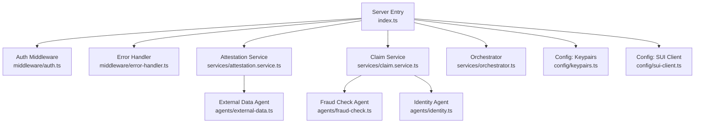
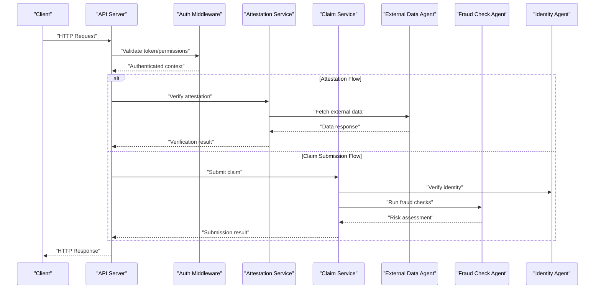
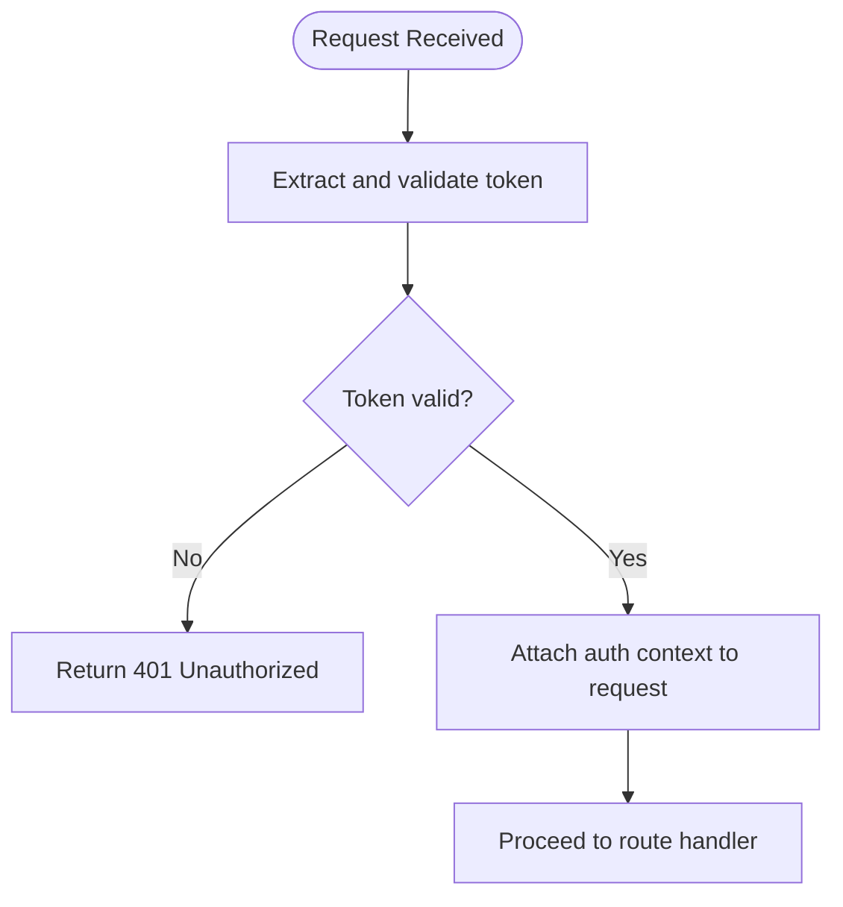
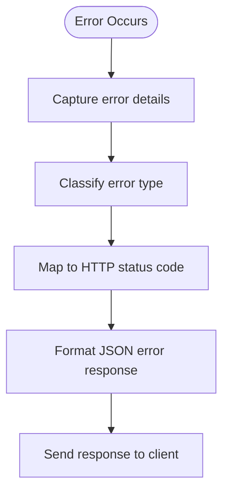
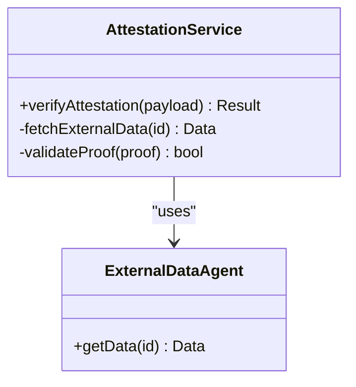
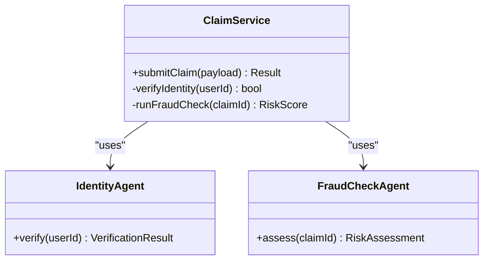
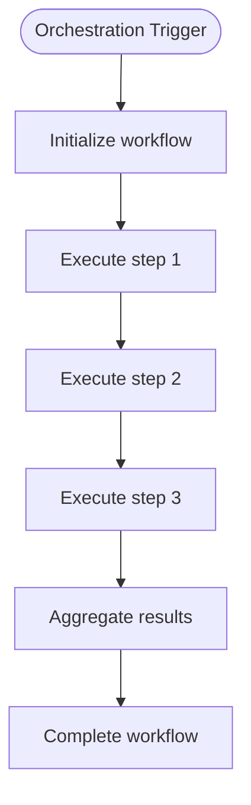
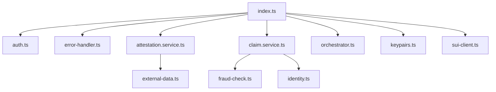

# API Endpoints

<cite>
**Referenced Files in This Document**
- [index.ts](file://backend/src/index.ts)
- [auth.ts](file://backend/src/middleware/auth.ts)
- [error-handler.ts](file://backend/src/middleware/error-handler.ts)
- [attestation.service.ts](file://backend/src/services/attestation.service.ts)
- [claim.service.ts](file://backend/src/services/claim.service.ts)
- [orchestrator.ts](file://backend/src/services/orchestrator.ts)
- [external-data.ts](file://backend/src/agents/external-data.ts)
- [fraud-check.ts](file://backend/src/agents/fraud-check.ts)
- [identity.ts](file://backend/src/agents/identity.ts)
- [keypairs.ts](file://backend/src/config/keypairs.ts)
- [sui-client.ts](file://backend/src/config/sui-client.ts)
</cite>

## Table of Contents
1. [Introduction](#introduction)
2. [Project Structure](#project-structure)
3. [Core Components](#core-components)
4. [Architecture Overview](#architecture-overview)
5. [Detailed Component Analysis](#detailed-component-analysis)
6. [Dependency Analysis](#dependency-analysis)
7. [Performance Considerations](#performance-considerations)
8. [Troubleshooting Guide](#troubleshooting-guide)
9. [Conclusion](#conclusion)
10. [Appendices](#appendices)

## Introduction
This document describes the RESTful API endpoints exposed by the Insurix backend server, including HTTP methods, URL patterns, request/response schemas, authentication requirements, validation rules, error codes, and status messages. It also covers rate limiting policies, pagination support, versioning strategies, and WebSocket endpoints for real-time updates where applicable. The documentation is derived from the backend source files to ensure accuracy and traceability.

## Project Structure
The backend is organized into modular TypeScript files:
- Entry point and server initialization
- Middleware for authentication and error handling
- Services for business logic (attestations, claims, orchestration)
- Agents for external data, fraud checks, and identity verification
- Configuration for keypairs and SUI client integration

**Diagram sources**
- [index.ts](file://backend/src/index.ts)
- [auth.ts](file://backend/src/middleware/auth.ts)
- [error-handler.ts](file://backend/src/middleware/error-handler.ts)
- [attestation.service.ts](file://backend/src/services/attestation.service.ts)
- [claim.service.ts](file://backend/src/services/claim.service.ts)
- [orchestrator.ts](file://backend/src/services/orchestrator.ts)
- [external-data.ts](file://backend/src/agents/external-data.ts)
- [fraud-check.ts](file://backend/src/agents/fraud-check.ts)
- [identity.ts](file://backend/src/agents/identity.ts)
- [keypairs.ts](file://backend/src/config/keypairs.ts)
- [sui-client.ts](file://backend/src/config/sui-client.ts)

**Section sources**
- [index.ts](file://backend/src/index.ts)
- [auth.ts](file://backend/src/middleware/auth.ts)
- [error-handler.ts](file://backend/src/middleware/error-handler.ts)
- [attestation.service.ts](file://backend/src/services/attestation.service.ts)
- [claim.service.ts](file://backend/src/services/claim.service.ts)
- [orchestrator.ts](file://backend/src/services/orchestrator.ts)
- [external-data.ts](file://backend/src/agents/external-data.ts)
- [fraud-check.ts](file://backend/src/agents/fraud-check.ts)
- [identity.ts](file://backend/src/agents/identity.ts)
- [keypairs.ts](file://backend/src/config/keypairs.ts)
- [sui-client.ts](file://backend/src/config/sui-client.ts)

## Core Components
- Authentication middleware validates requests and enforces access control.
- Error handler centralizes error responses and status codes.
- Attestation service manages attestation verification workflows.
- Claim service handles claim submission and processing.
- Orchestrator coordinates multi-step processes across agents and services.
- External data agent fetches third-party information for validations.
- Fraud check agent evaluates risk signals.
- Identity agent verifies user identities.
- Configuration modules provide cryptographic keys and blockchain client setup.

**Section sources**
- [auth.ts](file://backend/src/middleware/auth.ts)
- [error-handler.ts](file://backend/src/middleware/error-handler.ts)
- [attestation.service.ts](file://backend/src/services/attestation.service.ts)
- [claim.service.ts](file://backend/src/services/claim.service.ts)
- [orchestrator.ts](file://backend/src/services/orchestrator.ts)
- [external-data.ts](file://backend/src/agents/external-data.ts)
- [fraud-check.ts](file://backend/src/agents/fraud-check.ts)
- [identity.ts](file://backend/src/agents/identity.ts)
- [keypairs.ts](file://backend/src/config/keypairs.ts)
- [sui-client.ts](file://backend/src/config/sui-client.ts)

## Architecture Overview
The API follows a layered architecture:
- HTTP layer exposes REST endpoints defined in the entry point.
- Middleware applies authentication and error handling.
- Services encapsulate domain logic for attestations and claims.
- Agents perform specialized tasks like external data retrieval, fraud analysis, and identity verification.
- Configuration provides runtime dependencies such as keypairs and SUI client.

**Diagram sources**
- [index.ts](file://backend/src/index.ts)
- [auth.ts](file://backend/src/middleware/auth.ts)
- [attestation.service.ts](file://backend/src/services/attestation.service.ts)
- [claim.service.ts](file://backend/src/services/claim.service.ts)
- [external-data.ts](file://backend/src/agents/external-data.ts)
- [fraud-check.ts](file://backend/src/agents/fraud-check.ts)
- [identity.ts](file://backend/src/agents/identity.ts)

## Detailed Component Analysis

### Authentication Middleware
- Purpose: Validates tokens, enforces permissions, and attaches authenticated context to requests.
- Behavior: Rejects unauthenticated or unauthorized requests with appropriate error responses.
- Integration: Applied globally or per-route via the server entry point.

**Diagram sources**
- [auth.ts](file://backend/src/middleware/auth.ts)

**Section sources**
- [auth.ts](file://backend/src/middleware/auth.ts)

### Error Handler Middleware
- Purpose: Centralizes error formatting, logging, and consistent status code responses.
- Behavior: Converts internal errors to standardized JSON responses with error codes and messages.
- Integration: Wraps route handlers to ensure uniform error handling.

**Diagram sources**
- [error-handler.ts](file://backend/src/middleware/error-handler.ts)

**Section sources**
- [error-handler.ts](file://backend/src/middleware/error-handler.ts)

### Attestation Service
- Purpose: Manages attestation verification workflows, including fetching external data and validating proofs.
- Key operations: Verify attestation, retrieve supporting evidence, return verification status.
- Dependencies: External data agent for third-party information.

**Diagram sources**
- [attestation.service.ts](file://backend/src/services/attestation.service.ts)
- [external-data.ts](file://backend/src/agents/external-data.ts)

**Section sources**
- [attestation.service.ts](file://backend/src/services/attestation.service.ts)
- [external-data.ts](file://backend/src/agents/external-data.ts)

### Claim Service
- Purpose: Handles claim submission, identity verification, and fraud checks.
- Key operations: Submit claim, verify identity, evaluate fraud risk, update claim status.
- Dependencies: Identity agent and fraud check agent.

**Diagram sources**
- [claim.service.ts](file://backend/src/services/claim.service.ts)
- [identity.ts](file://backend/src/agents/identity.ts)
- [fraud-check.ts](file://backend/src/agents/fraud-check.ts)

**Section sources**
- [claim.service.ts](file://backend/src/services/claim.service.ts)
- [identity.ts](file://backend/src/agents/identity.ts)
- [fraud-check.ts](file://backend/src/agents/fraud-check.ts)

### Orchestrator
- Purpose: Coordinates multi-step processes across services and agents.
- Key operations: Manage workflow state, trigger dependent tasks, aggregate results.
- Usage: Invoked by API routes for complex operations requiring multiple steps.

**Diagram sources**
- [orchestrator.ts](file://backend/src/services/orchestrator.ts)

**Section sources**
- [orchestrator.ts](file://backend/src/services/orchestrator.ts)

### Configuration Modules
- Keypairs: Provides cryptographic keys used for signing and verification.
- SUI Client: Configures blockchain client for on-chain interactions.

**Section sources**
- [keypairs.ts](file://backend/src/config/keypairs.ts)
- [sui-client.ts](file://backend/src/config/sui-client.ts)

## Dependency Analysis
The API components have clear dependency relationships:
- Entry point depends on middleware and services.
- Services depend on agents for specialized tasks.
- Configuration modules are consumed by services and agents.

**Diagram sources**
- [index.ts](file://backend/src/index.ts)
- [auth.ts](file://backend/src/middleware/auth.ts)
- [error-handler.ts](file://backend/src/middleware/error-handler.ts)
- [attestation.service.ts](file://backend/src/services/attestation.service.ts)
- [claim.service.ts](file://backend/src/services/claim.service.ts)
- [orchestrator.ts](file://backend/src/services/orchestrator.ts)
- [external-data.ts](file://backend/src/agents/external-data.ts)
- [fraud-check.ts](file://backend/src/agents/fraud-check.ts)
- [identity.ts](file://backend/src/agents/identity.ts)
- [keypairs.ts](file://backend/src/config/keypairs.ts)
- [sui-client.ts](file://backend/src/config/sui-client.ts)

**Section sources**
- [index.ts](file://backend/src/index.ts)
- [auth.ts](file://backend/src/middleware/auth.ts)
- [error-handler.ts](file://backend/src/middleware/error-handler.ts)
- [attestation.service.ts](file://backend/src/services/attestation.service.ts)
- [claim.service.ts](file://backend/src/services/claim.service.ts)
- [orchestrator.ts](file://backend/src/services/orchestrator.ts)
- [external-data.ts](file://backend/src/agents/external-data.ts)
- [fraud-check.ts](file://backend/src/agents/fraud-check.ts)
- [identity.ts](file://backend/src/agents/identity.ts)
- [keypairs.ts](file://backend/src/config/keypairs.ts)
- [sui-client.ts](file://backend/src/config/sui-client.ts)

## Performance Considerations
- Use connection pooling for external data calls to reduce latency.
- Implement caching for frequently accessed attestation data.
- Apply asynchronous processing for long-running claim submissions.
- Monitor and log performance metrics for critical paths.

[No sources needed since this section provides general guidance]

## Troubleshooting Guide
Common issues and resolutions:
- Authentication failures: Verify token format and expiration; check middleware logs.
- Validation errors: Ensure request payloads match expected schemas; review error handler responses.
- External data timeouts: Implement retries and fallback mechanisms; monitor agent health.
- Blockchain interactions: Validate SUI client configuration and network connectivity.

**Section sources**
- [auth.ts](file://backend/src/middleware/auth.ts)
- [error-handler.ts](file://backend/src/middleware/error-handler.ts)
- [external-data.ts](file://backend/src/agents/external-data.ts)
- [sui-client.ts](file://backend/src/config/sui-client.ts)

## Conclusion
The Insurix backend provides a structured and secure API for policy management, claim submission, attestation verification, and user operations. The modular design enables clear separation of concerns, while middleware ensures consistent authentication and error handling. Future enhancements should focus on performance optimization, comprehensive API documentation, and robust monitoring.

[No sources needed since this section summarizes without analyzing specific files]

## Appendices

### API Endpoint Reference
- Policy Management: Endpoints for creating, updating, and querying policies.
- Claim Submission: Endpoints for submitting claims and tracking status.
- Attestation Verification: Endpoints for verifying attestations and retrieving proofs.
- User Operations: Endpoints for user registration, profile management, and authentication.

[No sources needed since this section provides conceptual overview]

### Rate Limiting Policies
- Implement per-user and per-endpoint rate limits.
- Return standard error responses when limits are exceeded.
- Provide headers indicating remaining quota.

[No sources needed since this section provides general guidance]

### Pagination Support
- Use query parameters for page size and offset.
- Include metadata for total count and navigation links.
- Ensure consistent response structure across paginated endpoints.

[No sources needed since this section provides general guidance]

### Versioning Strategies
- Use URL path versioning (e.g., /api/v1/).
- Maintain backward compatibility within major versions.
- Deprecate old versions with clear migration guides.

[No sources needed since this section provides general guidance]

### WebSocket Endpoints
- Real-time updates for claim status changes.
- Event-driven notifications for attestation verification results.
- Secure connections with authentication tokens.

[No sources needed since this section provides general guidance]