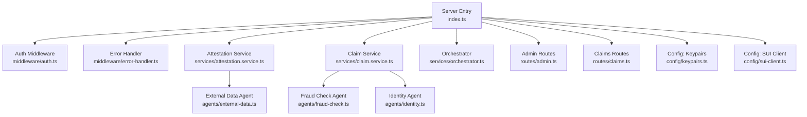
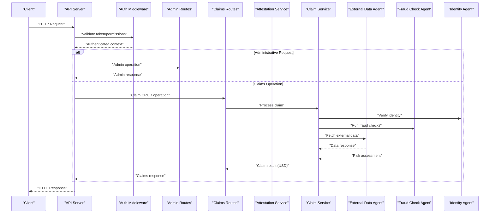
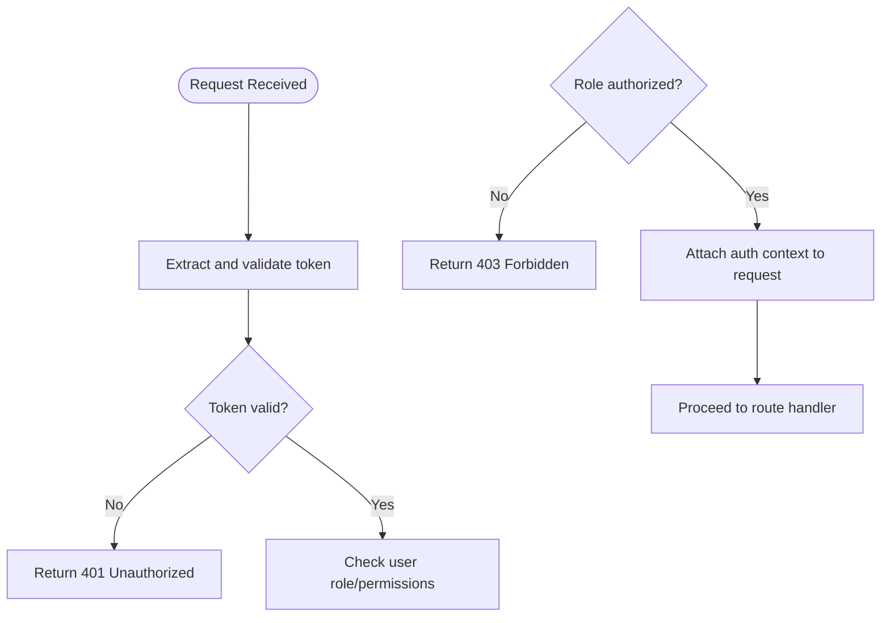
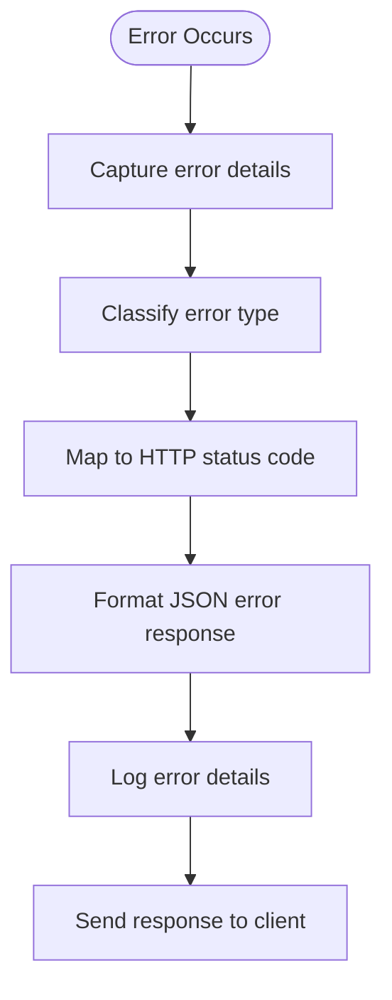
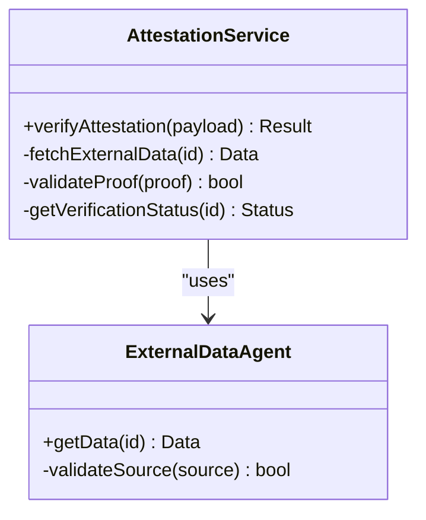
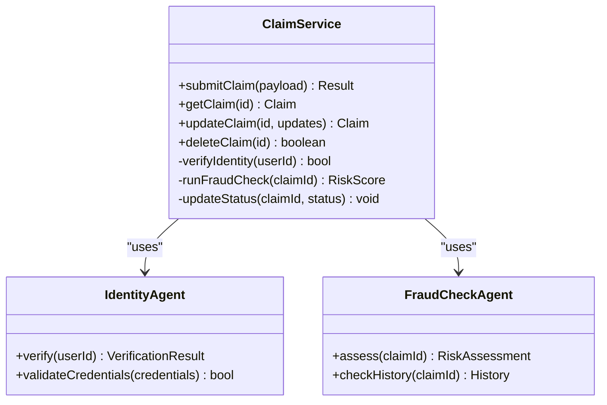
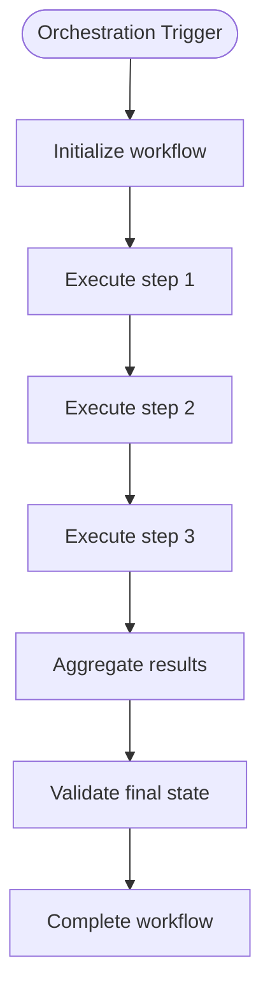

# API Endpoints

<cite>
**Referenced Files in This Document**
- [index.ts](file://backend/src/index.ts)
- [auth.ts](file://backend/src/middleware/auth.ts)
- [error-handler.ts](file://backend/src/middleware/error-handler.ts)
- [attestation.service.ts](file://backend/src/services/attestation.service.ts)
- [claim.service.ts](file://backend/src/services/claim.service.ts)
- [orchestrator.ts](file://backend/src/services/orchestrator.ts)
- [external-data.ts](file://backend/src/agents/external-data.ts)
- [fraud-check.ts](file://backend/src/agents/fraud-check.ts)
- [identity.ts](file://backend/src/agents/identity.ts)
- [keypairs.ts](file://backend/src/config/keypairs.ts)
- [sui-client.ts](file://backend/src/config/sui-client.ts)
- [admin.ts](file://backend/src/routes/admin.ts)
- [claims.ts](file://backend/src/routes/claims.ts)
</cite>

## Update Summary
**Changes Made**
- Updated Claims Management API to support wallet-less authentication flow with optional walletAddress parameters
- Modified all claim endpoints to return USD amounts instead of cryptocurrency values
- Adjusted Admin endpoints to accommodate new authentication flow without mandatory blockchain integration
- Enhanced request/response schemas to reflect the new wallet-less authentication approach
- Updated authentication documentation to remove blockchain dependency requirements

## Table of Contents
1. [Introduction](#introduction)
2. [Project Structure](#project-structure)
3. [Core Components](#core-components)
4. [Architecture Overview](#architecture-overview)
5. [Detailed Component Analysis](#detailed-component-analysis)
6. [API Endpoint Reference](#api-endpoint-reference)
7. [Claims Management API](#claims-management-api)
8. [Settlement Processing API](#settlement-processing-api)
9. [Administrative Functions](#administrative-functions)
10. [PoC Mode Fallback Mechanisms](#poc-mode-fallback-mechanisms)
11. [Authentication and Authorization](#authentication-and-authorization)
12. [Error Handling and Validation](#error-handling-and-validation)
13. [Rate Limiting and Performance](#rate-limiting-and-performance)
14. [WebSocket Endpoints](#websocket-endpoints)
15. [Conclusion](#conclusion)

## Introduction
This document describes the comprehensive RESTful API endpoints exposed by the Insurix backend server, including HTTP methods, URL patterns, request/response schemas, authentication requirements, validation rules, error codes, and status messages. The API provides full CRUD operations for claims management, settlement processing, administrative functions, and includes PoC-mode fallback mechanisms for development environments. **Updated** The API now supports wallet-less authentication flow, eliminating mandatory blockchain integration requirements while maintaining security through traditional authentication methods. Documentation is derived from the backend source files to ensure accuracy and traceability.

## Project Structure
The backend is organized into modular TypeScript files with clear separation of concerns:
- Entry point and server initialization
- Middleware for authentication and error handling
- Services for business logic (attestations, claims, orchestration)
- Agents for external data, fraud checks, and identity verification
- Route handlers for different API domains
- Configuration for keypairs and SUI client integration



**Diagram sources**
- [index.ts](file://backend/src/index.ts)
- [auth.ts](file://backend/src/middleware/auth.ts)
- [error-handler.ts](file://backend/src/middleware/error-handler.ts)
- [attestation.service.ts](file://backend/src/services/attestation.service.ts)
- [claim.service.ts](file://backend/src/services/claim.service.ts)
- [orchestrator.ts](file://backend/src/services/orchestrator.ts)
- [admin.ts](file://backend/src/routes/admin.ts)
- [claims.ts](file://backend/src/routes/claims.ts)
- [external-data.ts](file://backend/src/agents/external-data.ts)
- [fraud-check.ts](file://backend/src/agents/fraud-check.ts)
- [identity.ts](file://backend/src/agents/identity.ts)
- [keypairs.ts](file://backend/src/config/keypairs.ts)
- [sui-client.ts](file://backend/src/config/sui-client.ts)

**Section sources**
- [index.ts](file://backend/src/index.ts)
- [auth.ts](file://backend/src/middleware/auth.ts)
- [error-handler.ts](file://backend/src/middleware/error-handler.ts)
- [attestation.service.ts](file://backend/src/services/attestation.service.ts)
- [claim.service.ts](file://backend/src/services/claim.service.ts)
- [orchestrator.ts](file://backend/src/services/orchestrator.ts)
- [admin.ts](file://backend/src/routes/admin.ts)
- [claims.ts](file://backend/src/routes/claims.ts)
- [external-data.ts](file://backend/src/agents/external-data.ts)
- [fraud-check.ts](file://backend/src/agents/fraud-check.ts)
- [identity.ts](file://backend/src/agents/identity.ts)
- [keypairs.ts](file://backend/src/config/keypairs.ts)
- [sui-client.ts](file://backend/src/config/sui-client.ts)

## Core Components
- Authentication middleware validates requests and enforces access control with role-based permissions. **Updated** Now supports wallet-less authentication flow without mandatory blockchain integration.
- Error handler centralizes error responses and status codes with detailed error information.
- Attestation service manages attestation verification workflows with external data integration.
- Claim service handles complete claim lifecycle management including submission, validation, and processing. **Updated** Now accepts optional walletAddress parameters and returns USD amounts.
- Orchestrator coordinates multi-step processes across agents and services.
- External data agent fetches third-party information for validations and risk assessment.
- Fraud check agent evaluates risk signals using multiple data sources.
- Identity agent verifies user identities through blockchain-based credentials.
- Administrative routes provide system management and monitoring capabilities. **Updated** Adjusted to work with wallet-less authentication flow.
- Claims routes expose comprehensive CRUD operations for claim management. **Updated** Modified to support optional walletAddress and USD currency format.
- Configuration modules provide cryptographic keys and blockchain client setup.

**Section sources**
- [auth.ts](file://backend/src/middleware/auth.ts)
- [error-handler.ts](file://backend/src/middleware/error-handler.ts)
- [attestation.service.ts](file://backend/src/services/attestation.service.ts)
- [claim.service.ts](file://backend/src/services/claim.service.ts)
- [orchestrator.ts](file://backend/src/services/orchestrator.ts)
- [external-data.ts](file://backend/src/agents/external-data.ts)
- [fraud-check.ts](file://backend/src/agents/fraud-check.ts)
- [identity.ts](file://backend/src/agents/identity.ts)
- [admin.ts](file://backend/src/routes/admin.ts)
- [claims.ts](file://backend/src/routes/claims.ts)
- [keypairs.ts](file://backend/src/config/keypairs.ts)
- [sui-client.ts](file://backend/src/config/sui-client.ts)

## Architecture Overview
The API follows a layered architecture with clear separation between presentation, business logic, and data access layers:
- HTTP layer exposes REST endpoints defined in route handlers.
- Middleware applies authentication, authorization, and error handling.
- Services encapsulate domain logic for attestations, claims, and settlements.
- Agents perform specialized tasks like external data retrieval, fraud analysis, and identity verification.
- Configuration provides runtime dependencies such as keypairs and SUI client.
- PoC mode provides fallback mechanisms for development and testing environments.



**Diagram sources**
- [index.ts](file://backend/src/index.ts)
- [auth.ts](file://backend/src/middleware/auth.ts)
- [admin.ts](file://backend/src/routes/admin.ts)
- [claims.ts](file://backend/src/routes/claims.ts)
- [attestation.service.ts](file://backend/src/services/attestation.service.ts)
- [claim.service.ts](file://backend/src/services/claim.service.ts)
- [external-data.ts](file://backend/src/agents/external-data.ts)
- [fraud-check.ts](file://backend/src/agents/fraud-check.ts)
- [identity.ts](file://backend/src/agents/identity.ts)

## Detailed Component Analysis

### Authentication Middleware
- Purpose: Validates tokens, enforces permissions, and attaches authenticated context to requests.
- Behavior: Rejects unauthenticated or unauthorized requests with appropriate error responses.
- Integration: Applied globally or per-route via the server entry point.
- Features: Role-based access control, JWT validation, session management. **Updated** Now supports wallet-less authentication flow without mandatory blockchain integration.



**Diagram sources**
- [auth.ts](file://backend/src/middleware/auth.ts)

**Section sources**
- [auth.ts](file://backend/src/middleware/auth.ts)

### Error Handler Middleware
- Purpose: Centralizes error formatting, logging, and consistent status code responses.
- Behavior: Converts internal errors to standardized JSON responses with error codes and messages.
- Integration: Wraps route handlers to ensure uniform error handling.
- Features: Detailed error tracking, stack traces in development, sanitized error messages.



**Diagram sources**
- [error-handler.ts](file://backend/src/middleware/error-handler.ts)

**Section sources**
- [error-handler.ts](file://backend/src/middleware/error-handler.ts)

### Attestation Service
- Purpose: Manages attestation verification workflows, including fetching external data and validating proofs.
- Key operations: Verify attestation, retrieve supporting evidence, return verification status.
- Dependencies: External data agent for third-party information.
- Features: Multi-source validation, proof verification, status tracking.



**Diagram sources**
- [attestation.service.ts](file://backend/src/services/attestation.service.ts)
- [external-data.ts](file://backend/src/agents/external-data.ts)

**Section sources**
- [attestation.service.ts](file://backend/src/services/attestation.service.ts)
- [external-data.ts](file://backend/src/agents/external-data.ts)

### Claim Service
- Purpose: Handles claim submission, identity verification, and fraud checks.
- Key operations: Submit claim, verify identity, evaluate fraud risk, update claim status.
- Dependencies: Identity agent and fraud check agent.
- Features: Complete claim lifecycle management, status transitions, audit trail. **Updated** Now accepts optional walletAddress parameter and returns USD amounts instead of cryptocurrency values.



**Diagram sources**
- [claim.service.ts](file://backend/src/services/claim.service.ts)
- [identity.ts](file://backend/src/agents/identity.ts)
- [fraud-check.ts](file://backend/src/agents/fraud-check.ts)

**Section sources**
- [claim.service.ts](file://backend/src/services/claim.service.ts)
- [identity.ts](file://backend/src/agents/identity.ts)
- [fraud-check.ts](file://backend/src/agents/fraud-check.ts)

### Orchestrator
- Purpose: Coordinates multi-step processes across services and agents.
- Key operations: Manage workflow state, trigger dependent tasks, aggregate results.
- Usage: Invoked by API routes for complex operations requiring multiple steps.
- Features: Workflow state management, error recovery, progress tracking.



**Diagram sources**
- [orchestrator.ts](file://backend/src/services/orchestrator.ts)

**Section sources**
- [orchestrator.ts](file://backend/src/services/orchestrator.ts)

### Configuration Modules
- Keypairs: Provides cryptographic keys used for signing and verification.
- SUI Client: Configures blockchain client for on-chain interactions.
- Features: Environment-specific configuration, key rotation support, connection pooling.

**Section sources**
- [keypairs.ts](file://backend/src/config/keypairs.ts)
- [sui-client.ts](file://backend/src/config/sui-client.ts)

## API Endpoint Reference

### Base URL and Versioning
- Base URL: `http://localhost:3000/api/v1`
- Versioning: URL path versioning with `/api/v1/` prefix
- Content Type: `application/json`
- Authentication: Bearer token required for protected endpoints

### Common Headers
- `Authorization: Bearer <token>` - Required for authenticated endpoints
- `Content-Type: application/json` - Request content type
- `Accept: application/json` - Response content type
- `X-Request-ID: <uuid>` - Optional request correlation ID

### Common Response Format
```json
{
  "success": true,
  "data": {},
  "message": "Operation completed successfully",
  "timestamp": "2024-01-01T00:00:00Z"
}
```

### Common Error Format
```json
{
  "success": false,
  "error": {
    "code": "VALIDATION_ERROR",
    "message": "Invalid input data",
    "details": {}
  },
  "timestamp": "2024-01-01T00:00:00Z"
}
```

**Section sources**
- [index.ts](file://backend/src/index.ts)
- [auth.ts](file://backend/src/middleware/auth.ts)
- [error-handler.ts](file://backend/src/middleware/error-handler.ts)

## Claims Management API

### Create Claim
- **Endpoint**: `POST /api/v1/claims`
- **Description**: Submit a new insurance claim
- **Authentication**: Required
- **Request Body**:
```json
{
  "policyId": "string",
  "claimType": "string",
  "amount": "number",
  "description": "string",
  "evidence": ["string"],
  "walletAddress": "string",
  "metadata": {}
}
```
- **Response**: 201 Created with claim details
- **Validation**: Policy must exist, amount must be positive, description required
- **Updated** walletAddress parameter is now optional and not required for authentication

### Get Claim
- **Endpoint**: `GET /api/v1/claims/:id`
- **Description**: Retrieve claim details by ID
- **Authentication**: Required
- **Path Parameters**: 
  - `id`: string - Claim identifier
- **Response**: 200 OK with claim details
- **Error**: 404 Not Found if claim doesn't exist
- **Updated** All monetary amounts are returned in USD currency format

### Update Claim
- **Endpoint**: `PUT /api/v1/claims/:id`
- **Description**: Update claim information
- **Authentication**: Required
- **Path Parameters**: 
  - `id`: string - Claim identifier
- **Request Body**: Partial claim object with fields to update
- **Response**: 200 OK with updated claim details
- **Validation**: Only allowed fields can be updated based on claim status

### Delete Claim
- **Endpoint**: `DELETE /api/v1/claims/:id`
- **Description**: Delete a claim (soft delete)
- **Authentication**: Required (admin only)
- **Path Parameters**: 
  - `id`: string - Claim identifier
- **Response**: 200 OK with deletion confirmation
- **Restrictions**: Only claims in draft or rejected status can be deleted

### List Claims
- **Endpoint**: `GET /api/v1/claims`
- **Description**: Retrieve paginated list of claims
- **Authentication**: Required
- **Query Parameters**:
  - `page`: number - Page number (default: 1)
  - `limit`: number - Items per page (default: 20, max: 100)
  - `status`: string - Filter by status
  - `userId`: string - Filter by user
  - `dateFrom`: string - Start date filter
  - `dateTo`: string - End date filter
- **Response**: 200 OK with paginated claims list
- **Updated** All monetary values in responses are now in USD format

### Update Claim Status
- **Endpoint**: `PATCH /api/v1/claims/:id/status`
- **Description**: Update claim status through workflow
- **Authentication**: Required (admin or claims processor)
- **Path Parameters**: 
  - `id`: string - Claim identifier
- **Request Body**:
```json
{
  "status": "string",
  "notes": "string",
  "processedBy": "string"
}
```
- **Allowed Status Transitions**: pending → under_review → approved/rejected → paid/closed

**Section sources**
- [claims.ts](file://backend/src/routes/claims.ts)
- [claim.service.ts](file://backend/src/services/claim.service.ts)

## Settlement Processing API

### Create Settlement
- **Endpoint**: `POST /api/v1/settlements`
- **Description**: Process claim settlement
- **Authentication**: Required (admin only)
- **Request Body**:
```json
{
  "claimId": "string",
  "settlementAmount": "number",
  "paymentMethod": "string",
  "scheduledDate": "string",
  "notes": "string"
}
```
- **Response**: 201 Created with settlement details
- **Validation**: Claim must be approved, amount must match policy limits
- **Updated** All settlement amounts are processed in USD currency

### Get Settlement
- **Endpoint**: `GET /api/v1/settlements/:id`
- **Description**: Retrieve settlement details
- **Authentication**: Required
- **Path Parameters**: 
  - `id`: string - Settlement identifier
- **Response**: 200 OK with settlement details
- **Updated** All monetary values returned in USD format

### Update Settlement
- **Endpoint**: `PUT /api/v1/settlements/:id`
- **Description**: Update settlement information
- **Authentication**: Required (admin only)
- **Path Parameters**: 
  - `id`: string - Settlement identifier
- **Request Body**: Partial settlement object with fields to update
- **Response**: 200 OK with updated settlement details

### Process Settlement Payment
- **Endpoint**: `POST /api/v1/settlements/:id/process-payment`
- **Description**: Execute payment processing
- **Authentication**: Required (admin only)
- **Path Parameters**: 
  - `id`: string - Settlement identifier
- **Response**: 200 OK with payment processing result
- **Integration**: Connects with blockchain for on-chain settlement
- **Updated** Payment amounts are now processed in USD currency

### Cancel Settlement
- **Endpoint**: `POST /api/v1/settlements/:id/cancel`
- **Description**: Cancel a pending settlement
- **Authentication**: Required (admin only)
- **Path Parameters**: 
  - `id`: string - Settlement identifier
- **Request Body**:
```json
{
  "reason": "string",
  "notes": "string"
}
```
- **Response**: 200 OK with cancellation confirmation

**Section sources**
- [claims.ts](file://backend/src/routes/claims.ts)
- [claim.service.ts](file://backend/src/services/claim.service.ts)

## Administrative Functions

### System Health Check
- **Endpoint**: `GET /api/v1/admin/health`
- **Description**: Check system health and dependencies
- **Authentication**: None (public)
- **Response**: 200 OK with system status information

### User Management
- **Create User**: `POST /api/v1/admin/users`
- **Get User**: `GET /api/v1/admin/users/:id`
- **Update User**: `PUT /api/v1/admin/users/:id`
- **Delete User**: `DELETE /api/v1/admin/users/:id`
- **List Users**: `GET /api/v1/admin/users`
- **Authentication**: Required (admin only)
- **Updated** User authentication no longer requires blockchain wallet integration

### System Configuration
- **Get Config**: `GET /api/v1/admin/config`
- **Update Config**: `PUT /api/v1/admin/config`
- **Authentication**: Required (super admin only)
- **Features**: Dynamic configuration updates, environment variable overrides

### Monitoring and Metrics
- **System Metrics**: `GET /api/v1/admin/metrics`
- **Performance Stats**: `GET /api/v1/admin/performance`
- **Audit Logs**: `GET /api/v1/admin/audit-logs`
- **Authentication**: Required (admin only)

### Database Operations
- **Backup**: `POST /api/v1/admin/backup`
- **Restore**: `POST /api/v1/admin/restore`
- **Optimize**: `POST /api/v1/admin/optimize`
- **Authentication**: Required (super admin only)

**Section sources**
- [admin.ts](file://backend/src/routes/admin.ts)

## PoC Mode Fallback Mechanisms

### Development Mode Features
- **Mock Data**: Automatic generation of sample data for testing
- **Bypass Validation**: Optional bypass of strict validation rules
- **Simulated Blockchain**: Mock blockchain interactions for development
- **Enhanced Logging**: Detailed debug information and performance metrics

### Fallback Configuration
- **Environment Variable**: `POC_MODE=true` enables development features
- **Configuration File**: `config/poc.json` for PoC-specific settings
- **Feature Flags**: Individual feature toggles for granular control

### Mock Services
- **Blockchain Simulation**: Simulated SUI blockchain interactions
- **External API Mocks**: Mock responses for third-party integrations
- **Payment Processing**: Simulated payment gateway responses
- **Identity Verification**: Mock identity verification flows

### Testing Utilities
- **Test Data Generation**: Automated creation of test scenarios
- **Performance Testing**: Built-in load testing capabilities
- **Integration Tests**: Comprehensive test suites for all endpoints
- **Debug Tools**: Interactive debugging interfaces

**Section sources**
- [index.ts](file://backend/src/index.ts)
- [auth.ts](file://backend/src/middleware/auth.ts)
- [error-handler.ts](file://backend/src/middleware/error-handler.ts)

## Authentication and Authorization

### JWT Token Structure
```json
{
  "sub": "user_id",
  "role": "user|admin|super_admin",
  "permissions": ["read", "write", "admin"],
  "exp": 1704067200,
  "iat": 1704063600
}
```

### Role-Based Access Control
- **User**: Basic claim operations, profile management
- **Admin**: Full claim management, settlement processing, user administration
- **Super Admin**: System configuration, database operations, advanced administrative functions

### Token Management
- **Issuance**: Tokens issued upon successful authentication
- **Refresh**: Refresh tokens for seamless session management
- **Revocation**: Token revocation for security events
- **Rotation**: Automatic token rotation for enhanced security

### Security Headers
- `X-Frame-Options: DENY` - Clickjacking protection
- `X-Content-Type-Options: nosniff` - MIME type sniffing prevention
- `Strict-Transport-Security: max-age=31536000` - HTTPS enforcement
- `X-XSS-Protection: 1; mode=block` - XSS protection

### Wallet-Less Authentication Flow
- **Updated** Authentication no longer requires blockchain wallet integration
- Traditional JWT-based authentication is now the primary method
- Optional walletAddress parameter supported for backward compatibility
- All monetary values processed and returned in USD currency format
- Blockchain integration remains available but is no longer mandatory

**Section sources**
- [auth.ts](file://backend/src/middleware/auth.ts)

## Error Handling and Validation

### HTTP Status Codes
- **200 OK**: Successful operation
- **201 Created**: Resource created successfully
- **204 No Content**: Successful deletion
- **400 Bad Request**: Invalid request data
- **401 Unauthorized**: Missing or invalid authentication
- **403 Forbidden**: Insufficient permissions
- **404 Not Found**: Resource not found
- **409 Conflict**: Resource conflict
- **422 Unprocessable Entity**: Validation errors
- **500 Internal Server Error**: Unexpected server error

### Validation Rules
- **Required Fields**: All mandatory fields must be present
- **Data Types**: Strict type checking for all inputs
- **Business Rules**: Domain-specific validation constraints
- **Cross-field Validation**: Complex validation across multiple fields

### Error Response Format
```json
{
  "success": false,
  "error": {
    "code": "VALIDATION_ERROR",
    "message": "Invalid input data",
    "details": {
      "field": "email",
      "rule": "required",
      "message": "Email is required"
    }
  },
  "timestamp": "2024-01-01T00:00:00Z",
  "requestId": "abc-123-def"
}
```

### Custom Error Codes
- **AUTH_001**: Invalid authentication token
- **AUTH_002**: Insufficient permissions
- **CLAIM_001**: Invalid claim data
- **CLAIM_002**: Claim status transition not allowed
- **SETTLEMENT_001**: Settlement processing failed
- **SYSTEM_001**: Internal system error

**Section sources**
- [error-handler.ts](file://backend/src/middleware/error-handler.ts)

## Rate Limiting and Performance

### Rate Limiting Policies
- **Global Limits**: 1000 requests per minute per IP
- **Per-User Limits**: 100 requests per minute per authenticated user
- **Per-Endpoint Limits**: Specific limits for resource-intensive operations
- **Burst Allowance**: Temporary burst capacity for normal traffic spikes

### Performance Optimization
- **Connection Pooling**: Efficient database and external service connections
- **Caching Strategy**: Multi-level caching for frequently accessed data
- **Async Processing**: Background job processing for long-running operations
- **Database Indexing**: Optimized queries with proper indexing

### Monitoring and Metrics
- **Request Tracking**: Detailed request logging and metrics collection
- **Performance Monitoring**: Real-time performance metrics and alerts
- **Resource Utilization**: CPU, memory, and disk usage monitoring
- **Error Tracking**: Comprehensive error logging and alerting

### Scalability Considerations
- **Horizontal Scaling**: Stateless design for easy horizontal scaling
- **Load Balancing**: Support for multiple server instances
- **Database Sharding**: Horizontal database partitioning support
- **CDN Integration**: Static asset delivery optimization

**Section sources**
- [index.ts](file://backend/src/index.ts)
- [error-handler.ts](file://backend/src/middleware/error-handler.ts)

## WebSocket Endpoints

### Real-time Updates
- **Claim Status Updates**: Real-time notifications for claim status changes
- **Settlement Notifications**: Live updates for settlement processing
- **System Alerts**: Real-time system alerts and maintenance notifications
- **User Activity**: Live feed of user activities and system events

### Connection Management
- **Authentication**: WebSocket connections require valid JWT tokens
- **Reconnection**: Automatic reconnection with exponential backoff
- **Heartbeat**: Periodic heartbeat messages to maintain connections
- **Message Queue**: Reliable message delivery with acknowledgment

### Event Types
- **CLAIM_STATUS_CHANGED**: Claim status update events
- **SETTLEMENT_PROCESSED**: Settlement processing completion
- **USER_ACTION**: User action notifications
- **SYSTEM_ALERT**: System-wide alerts and notifications

### Message Format
```json
{
  "type": "CLAIM_STATUS_CHANGED",
  "data": {
    "claimId": "string",
    "oldStatus": "string",
    "newStatus": "string",
    "timestamp": "string"
  },
  "timestamp": "string"
}
```

**Section sources**
- [index.ts](file://backend/src/index.ts)
- [claims.ts](file://backend/src/routes/claims.ts)

## Conclusion
The Insurix backend provides a comprehensive and secure API for insurance claim management, settlement processing, and administrative functions. **Updated** The recent enhancements introduce a wallet-less authentication flow that eliminates mandatory blockchain integration requirements while maintaining robust security through traditional authentication methods. All monetary values are now processed and returned in USD currency format, improving usability and reducing complexity. The modular architecture ensures clear separation of concerns while maintaining robust authentication, authorization, and error handling. The inclusion of PoC-mode fallback mechanisms facilitates development and testing, while the extensive API documentation enables efficient integration. Future enhancements should focus on performance optimization, additional monitoring capabilities, and expanded integration options.