# Backend API Routes

<cite>
**Referenced Files in This Document**
- [index.ts](file://backend/src/index.ts)
- [admin.ts](file://backend/src/routes/admin.ts)
- [claims.ts](file://backend/src/routes/claims.ts)
- [auth.ts](file://backend/src/middleware/auth.ts)
- [error-handler.ts](file://backend/src/middleware/error-handler.ts)
- [attestation.service.ts](file://backend/src/services/attestation.service.ts)
- [claim.service.ts](file://backend/src/services/claim.service.ts)
- [orchestrator.ts](file://backend/src/services/orchestrator.ts)
- [external-data.ts](file://backend/src/agents/external-data.ts)
- [fraud-check.ts](file://backend/src/agents/fraud-check.ts)
- [identity.ts](file://backend/src/agents/identity.ts)
- [sui-client.ts](file://backend/src/config/sui-client.ts)
- [keypairs.ts](file://backend/src/config/keypairs.ts)
</cite>

## Table of Contents
1. [Introduction](#introduction)
2. [Project Structure](#project-structure)
3. [Core Components](#core-components)
4. [Architecture Overview](#architecture-overview)
5. [Detailed Component Analysis](#detailed-component-analysis)
6. [Dependency Analysis](#dependency-analysis)
7. [Performance Considerations](#performance-considerations)
8. [Troubleshooting Guide](#troubleshooting-guide)
9. [Conclusion](#conclusion)

## Introduction
This document explains the backend API routes for the Insurix project, focusing on how HTTP endpoints are organized, how requests flow through middleware and services, and how blockchain interactions are coordinated via Sui client configuration. It is intended for both developers integrating with the API and reviewers assessing the system’s architecture and data flows.

## Project Structure
The backend organizes functionality into clear layers:
- Entry point initializes the server and registers routes and middleware.
- Routes define HTTP endpoints for admin and claims operations.
- Middleware handles authentication and centralized error handling.
- Services encapsulate business logic for attestations, claims, and orchestration across agents.
- Agents implement specialized workflows such as external data fetching, fraud checks, and identity verification.
- Configuration provides Sui client setup and keypair management.

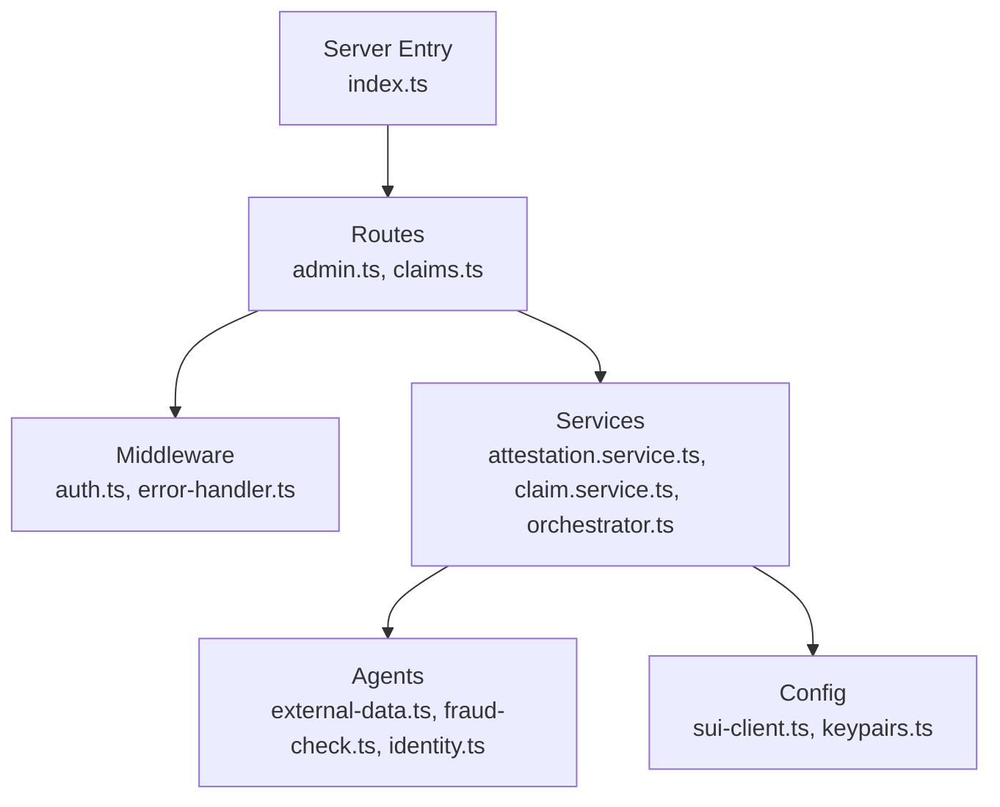

**Diagram sources**
- [index.ts](file://backend/src/index.ts)
- [admin.ts](file://backend/src/routes/admin.ts)
- [claims.ts](file://backend/src/routes/claims.ts)
- [auth.ts](file://backend/src/middleware/auth.ts)
- [error-handler.ts](file://backend/src/middleware/error-handler.ts)
- [attestation.service.ts](file://backend/src/services/attestation.service.ts)
- [claim.service.ts](file://backend/src/services/claim.service.ts)
- [orchestrator.ts](file://backend/src/services/orchestrator.ts)
- [external-data.ts](file://backend/src/agents/external-data.ts)
- [fraud-check.ts](file://backend/src/agents/fraud-check.ts)
- [identity.ts](file://backend/src/agents/identity.ts)
- [sui-client.ts](file://backend/src/config/sui-client.ts)
- [keypairs.ts](file://backend/src/config/keypairs.ts)

**Section sources**
- [index.ts](file://backend/src/index.ts)
- [admin.ts](file://backend/src/routes/admin.ts)
- [claims.ts](file://backend/src/routes/claims.ts)

## Core Components
- Server entrypoint wires up routing and global middleware.
- Admin routes expose administrative endpoints for managing attestations and system state.
- Claims routes expose endpoints for creating, querying, and processing claims.
- Authentication middleware validates requests before they reach route handlers.
- Error handler middleware centralizes error responses and logging.
- Services implement domain logic: attestation lifecycle, claim lifecycle, and orchestration across agents.
- Agents perform specialized tasks: external data retrieval, fraud detection, and identity verification.
- Configuration manages Sui client connectivity and cryptographic keys.

**Section sources**
- [index.ts](file://backend/src/index.ts)
- [auth.ts](file://backend/src/middleware/auth.ts)
- [error-handler.ts](file://backend/src/middleware/error-handler.ts)
- [attestation.service.ts](file://backend/src/services/attestation.service.ts)
- [claim.service.ts](file://backend/src/services/claim.service.ts)
- [orchestrator.ts](file://backend/src/services/orchestrator.ts)
- [external-data.ts](file://backend/src/agents/external-data.ts)
- [fraud-check.ts](file://backend/src/agents/fraud-check.ts)
- [identity.ts](file://backend/src/agents/identity.ts)
- [sui-client.ts](file://backend/src/config/sui-client.ts)
- [keypairs.ts](file://backend/src/config/keypairs.ts)

## Architecture Overview
The API follows a layered architecture where routes delegate to services, which coordinate agents and interact with the Sui blockchain via configured clients. Authentication and error handling are applied globally.

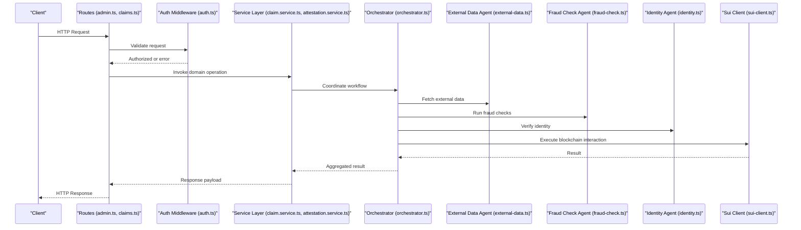

**Diagram sources**
- [claims.ts](file://backend/src/routes/claims.ts)
- [admin.ts](file://backend/src/routes/admin.ts)
- [auth.ts](file://backend/src/middleware/auth.ts)
- [claim.service.ts](file://backend/src/services/claim.service.ts)
- [attestation.service.ts](file://backend/src/services/attestation.service.ts)
- [orchestrator.ts](file://backend/src/services/orchestrator.ts)
- [external-data.ts](file://backend/src/agents/external-data.ts)
- [fraud-check.ts](file://backend/src/agents/fraud-check.ts)
- [identity.ts](file://backend/src/agents/identity.ts)
- [sui-client.ts](file://backend/src/config/sui-client.ts)

## Detailed Component Analysis

### Admin Routes
Admin endpoints manage attestations and system-level operations. Typical responsibilities include:
- Creating, updating, and revoking attestations.
- Querying audit records and statuses.
- Managing auditor identities and permissions.

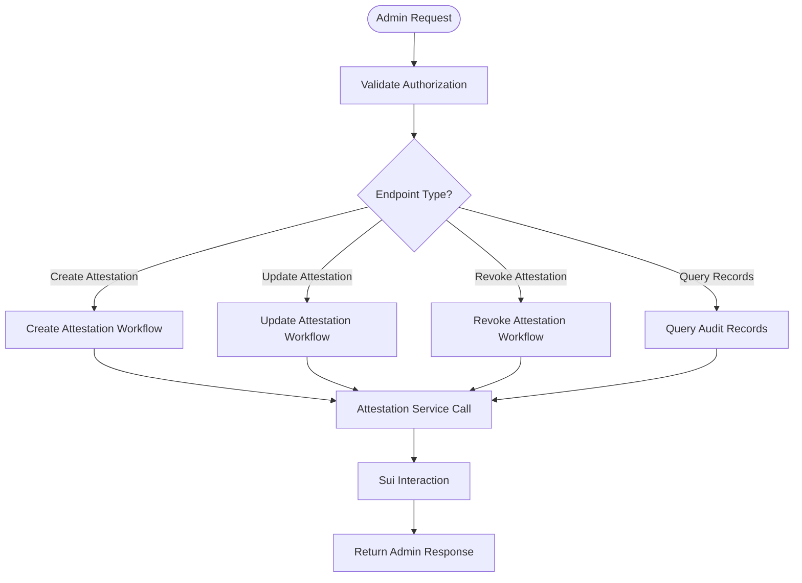

**Diagram sources**
- [admin.ts](file://backend/src/routes/admin.ts)
- [attestation.service.ts](file://backend/src/services/attestation.service.ts)
- [orchestrator.ts](file://backend/src/services/orchestrator.ts)
- [sui-client.ts](file://backend/src/config/sui-client.ts)

**Section sources**
- [admin.ts](file://backend/src/routes/admin.ts)
- [attestation.service.ts](file://backend/src/services/attestation.service.ts)

### Claims Routes
Claims endpoints handle the end-to-end lifecycle of insurance claims:
- Submitting new claims with supporting evidence.
- Retrieving claim details and status.
- Initiating processing workflows that involve external data, fraud checks, and identity verification.

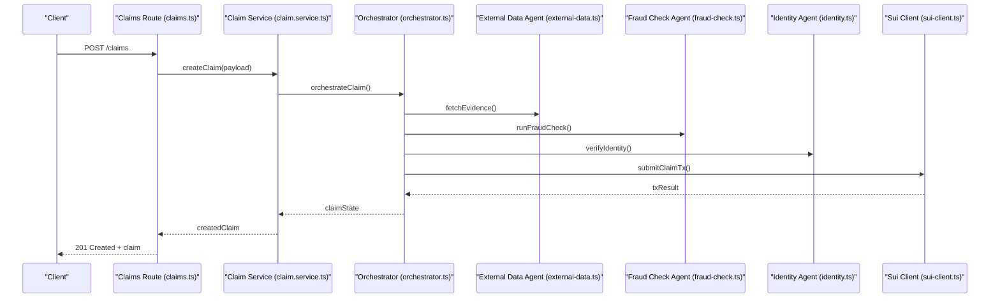

**Diagram sources**
- [claims.ts](file://backend/src/routes/claims.ts)
- [claim.service.ts](file://backend/src/services/claim.service.ts)
- [orchestrator.ts](file://backend/src/services/orchestrator.ts)
- [external-data.ts](file://backend/src/agents/external-data.ts)
- [fraud-check.ts](file://backend/src/agents/fraud-check.ts)
- [identity.ts](file://backend/src/agents/identity.ts)
- [sui-client.ts](file://backend/src/config/sui-client.ts)

**Section sources**
- [claims.ts](file://backend/src/routes/claims.ts)
- [claim.service.ts](file://backend/src/services/claim.service.ts)

### Middleware: Authentication
Authentication middleware ensures only authorized requests reach route handlers. It typically:
- Validates tokens or session credentials.
- Attaches user context to the request object.
- Rejects unauthorized requests with appropriate error codes.

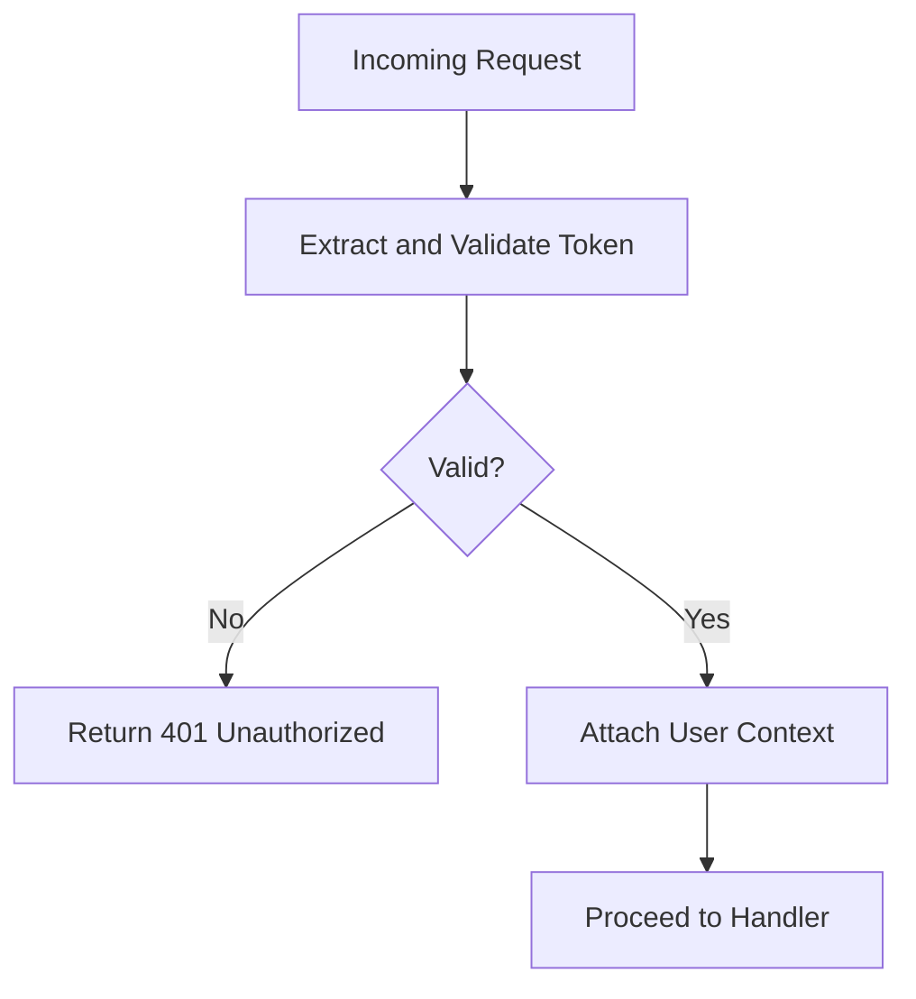

**Diagram sources**
- [auth.ts](file://backend/src/middleware/auth.ts)

**Section sources**
- [auth.ts](file://backend/src/middleware/auth.ts)

### Middleware: Error Handling
Centralized error handling ensures consistent error responses and logging across all routes. It typically:
- Catches exceptions thrown by handlers.
- Normalizes error payloads.
- Logs diagnostic information securely.

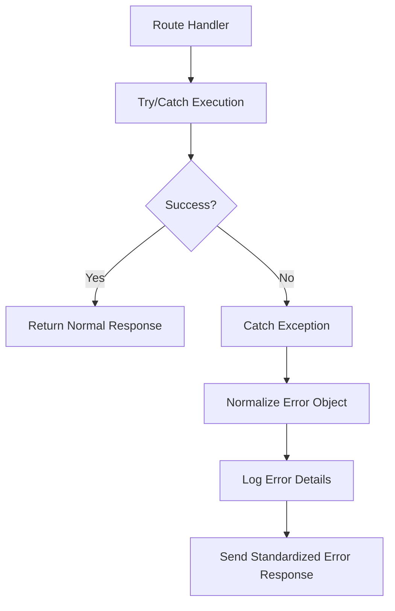

**Diagram sources**
- [error-handler.ts](file://backend/src/middleware/error-handler.ts)

**Section sources**
- [error-handler.ts](file://backend/src/middleware/error-handler.ts)

### Services: Attestation Service
The attestation service encapsulates business logic for managing attestations:
- Creating attestations based on audit results.
- Updating attestation metadata and status.
- Revoking attestations when necessary.
- Interacting with blockchain via orchestrated transactions.

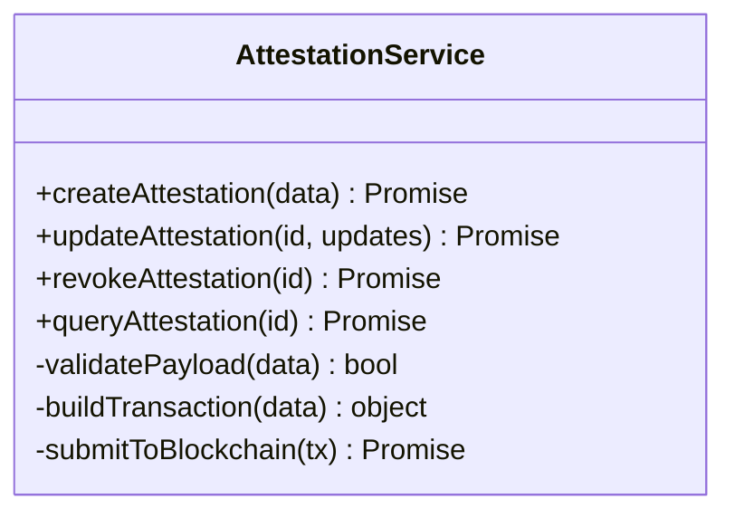

**Diagram sources**
- [attestation.service.ts](file://backend/src/services/attestation.service.ts)
- [orchestrator.ts](file://backend/src/services/orchestrator.ts)
- [sui-client.ts](file://backend/src/config/sui-client.ts)

**Section sources**
- [attestation.service.ts](file://backend/src/services/attestation.service.ts)

### Services: Claim Service
The claim service manages the claim lifecycle:
- Validating claim submissions.
- Coordinating multi-step processing via the orchestrator.
- Persisting claim states and returning structured responses.

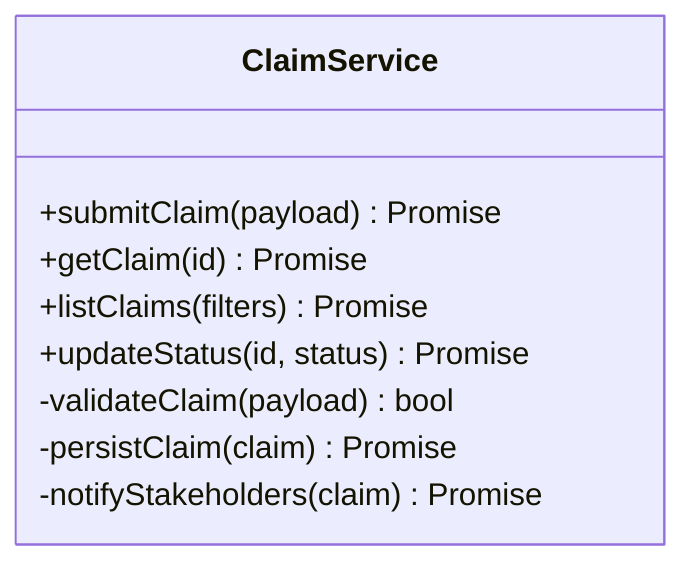

**Diagram sources**
- [claim.service.ts](file://backend/src/services/claim.service.ts)
- [orchestrator.ts](file://backend/src/services/orchestrator.ts)

**Section sources**
- [claim.service.ts](file://backend/src/services/claim.service.ts)

### Services: Orchestrator
The orchestrator coordinates complex workflows involving multiple agents and blockchain interactions:
- Sequencing external data retrieval, fraud checks, and identity verification.
- Aggregating results and deciding next steps.
- Executing Sui transactions and handling outcomes.

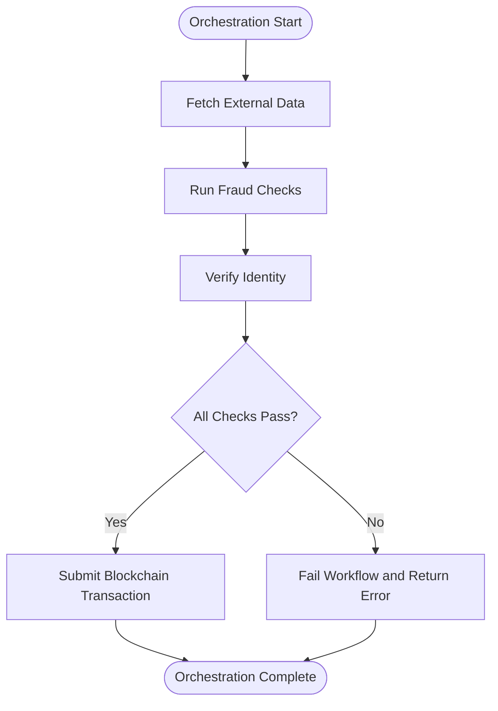

**Diagram sources**
- [orchestrator.ts](file://backend/src/services/orchestrator.ts)
- [external-data.ts](file://backend/src/agents/external-data.ts)
- [fraud-check.ts](file://backend/src/agents/fraud-check.ts)
- [identity.ts](file://backend/src/agents/identity.ts)
- [sui-client.ts](file://backend/src/config/sui-client.ts)

**Section sources**
- [orchestrator.ts](file://backend/src/services/orchestrator.ts)

### Agents: External Data, Fraud Check, Identity
Agents implement specialized tasks:
- External data agent retrieves and normalizes third-party data.
- Fraud check agent evaluates risk signals and returns risk scores.
- Identity agent verifies user identities against trusted sources.

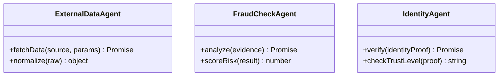

**Diagram sources**
- [external-data.ts](file://backend/src/agents/external-data.ts)
- [fraud-check.ts](file://backend/src/agents/fraud-check.ts)
- [identity.ts](file://backend/src/agents/identity.ts)

**Section sources**
- [external-data.ts](file://backend/src/agents/external-data.ts)
- [fraud-check.ts](file://backend/src/agents/fraud-check.ts)
- [identity.ts](file://backend/src/agents/identity.ts)

### Configuration: Sui Client and Keypairs
Configuration modules provide:
- Sui client initialization and connection settings.
- Keypair management for signing transactions and authenticating operations.

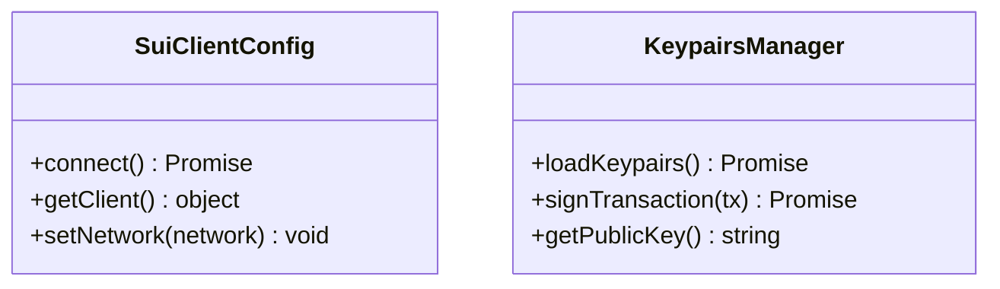

**Diagram sources**
- [sui-client.ts](file://backend/src/config/sui-client.ts)
- [keypairs.ts](file://backend/src/config/keypairs.ts)

**Section sources**
- [sui-client.ts](file://backend/src/config/sui-client.ts)
- [keypairs.ts](file://backend/src/config/keypairs.ts)

## Dependency Analysis
The backend exhibits clear separation of concerns:
- Routes depend on middleware for cross-cutting concerns and on services for business logic.
- Services depend on agents for specialized tasks and on configuration for blockchain access.
- Agents are loosely coupled and focused on single responsibilities.
- Configuration is isolated and consumed by services and agents as needed.

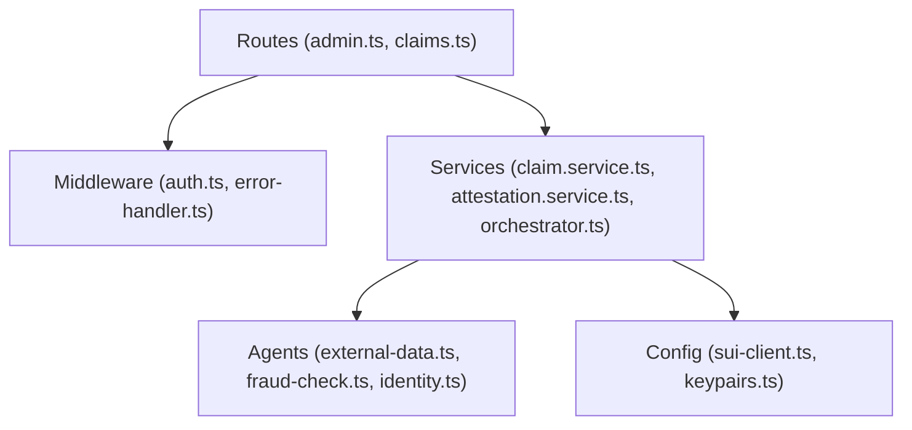

**Diagram sources**
- [admin.ts](file://backend/src/routes/admin.ts)
- [claims.ts](file://backend/src/routes/claims.ts)
- [auth.ts](file://backend/src/middleware/auth.ts)
- [error-handler.ts](file://backend/src/middleware/error-handler.ts)
- [claim.service.ts](file://backend/src/services/claim.service.ts)
- [attestation.service.ts](file://backend/src/services/attestation.service.ts)
- [orchestrator.ts](file://backend/src/services/orchestrator.ts)
- [external-data.ts](file://backend/src/agents/external-data.ts)
- [fraud-check.ts](file://backend/src/agents/fraud-check.ts)
- [identity.ts](file://backend/src/agents/identity.ts)
- [sui-client.ts](file://backend/src/config/sui-client.ts)
- [keypairs.ts](file://backend/src/config/keypairs.ts)

**Section sources**
- [admin.ts](file://backend/src/routes/admin.ts)
- [claims.ts](file://backend/src/routes/claims.ts)
- [auth.ts](file://backend/src/middleware/auth.ts)
- [error-handler.ts](file://backend/src/middleware/error-handler.ts)
- [claim.service.ts](file://backend/src/services/claim.service.ts)
- [attestation.service.ts](file://backend/src/services/attestation.service.ts)
- [orchestrator.ts](file://backend/src/services/orchestrator.ts)
- [external-data.ts](file://backend/src/agents/external-data.ts)
- [fraud-check.ts](file://backend/src/agents/fraud-check.ts)
- [identity.ts](file://backend/src/agents/identity.ts)
- [sui-client.ts](file://backend/src/config/sui-client.ts)
- [keypairs.ts](file://backend/src/config/keypairs.ts)

## Performance Considerations
- Prefer asynchronous I/O for external data and blockchain calls to avoid blocking.
- Cache frequently accessed external data to reduce latency and network overhead.
- Batch blockchain transactions where possible to minimize gas costs and confirmations.
- Implement rate limiting on sensitive endpoints to protect against abuse.
- Use connection pooling for any persistent backends or databases.

[No sources needed since this section provides general guidance]

## Troubleshooting Guide
Common issues and resolutions:
- Authentication failures: Ensure token format and validity; verify middleware configuration.
- Blockchain errors: Check Sui client connectivity and keypair permissions; inspect transaction payloads.
- Orchestration timeouts: Review agent response times and adjust timeouts accordingly.
- Error responses: Inspect standardized error payloads and logs produced by the error handler.

**Section sources**
- [auth.ts](file://backend/src/middleware/auth.ts)
- [error-handler.ts](file://backend/src/middleware/error-handler.ts)
- [sui-client.ts](file://backend/src/config/sui-client.ts)
- [keypairs.ts](file://backend/src/config/keypairs.ts)

## Conclusion
The Insurix backend organizes API routes around clear responsibilities: admin and claims endpoints delegate to services that orchestrate specialized agents and interact with the Sui blockchain. Middleware centralizes authentication and error handling, while configuration isolates blockchain connectivity and key management. This structure supports maintainability, scalability, and robust error handling across the system.

[No sources needed since this section summarizes without analyzing specific files]