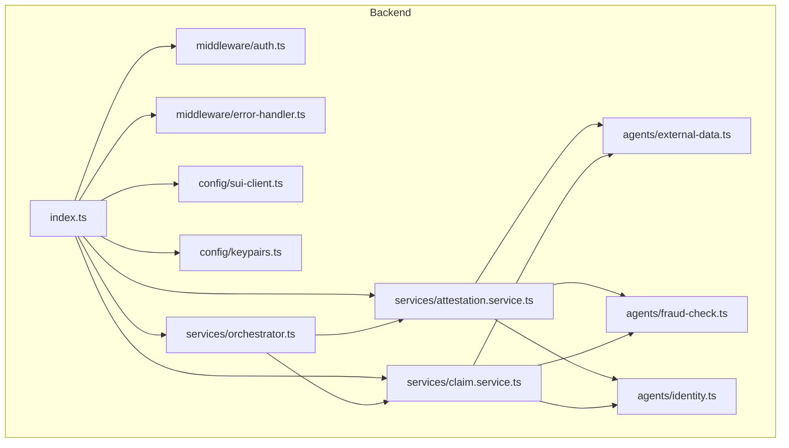
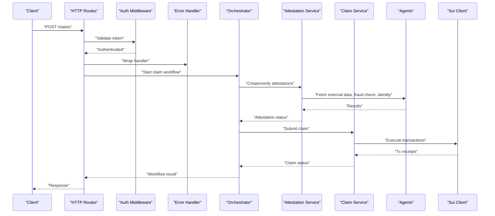
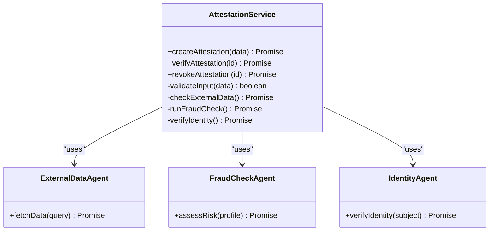
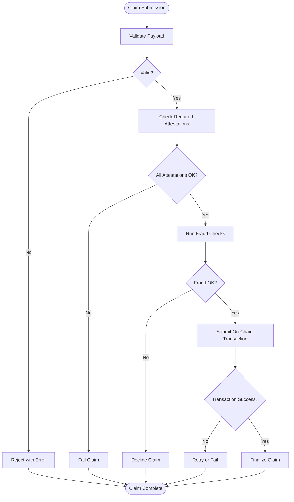
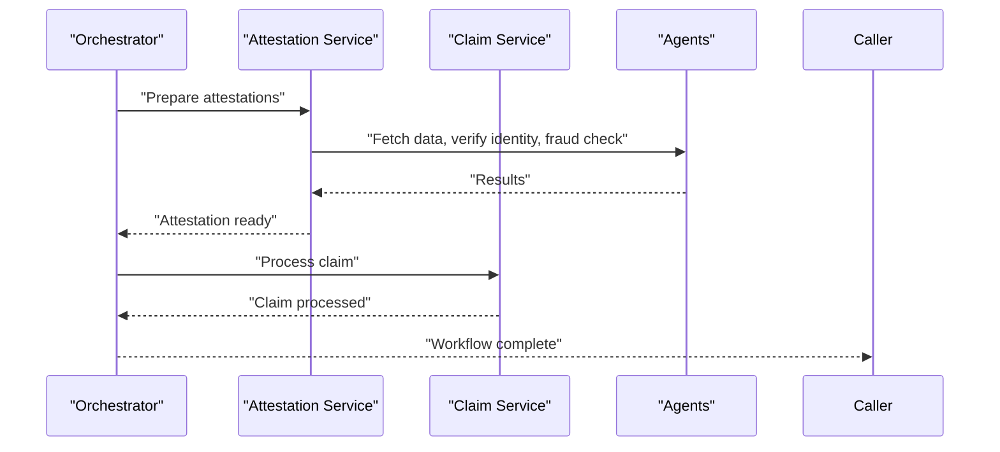
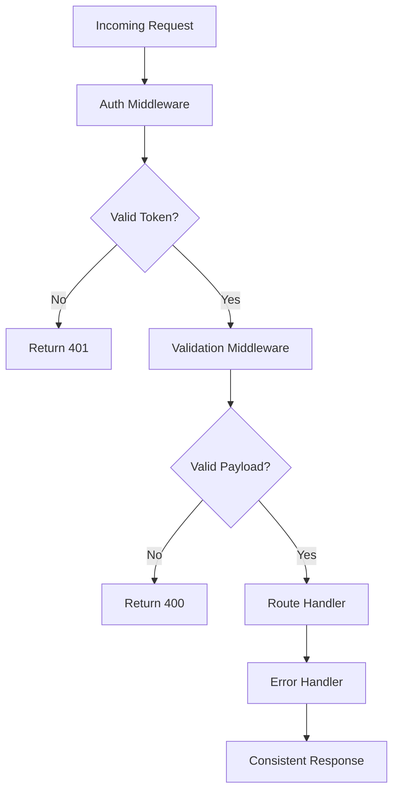
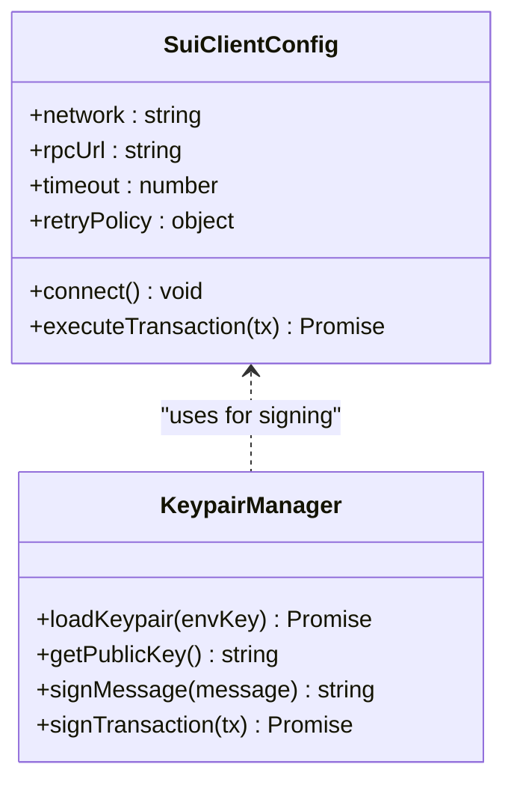
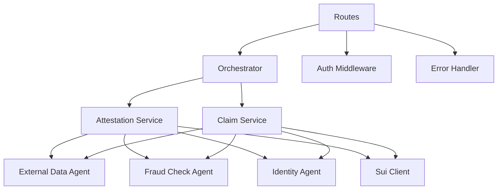

# Backend Services

<cite>
**Referenced Files in This Document**
- [index.ts](file://backend/src/index.ts)
- [attestation.service.ts](file://backend/src/services/attestation.service.ts)
- [claim.service.ts](file://backend/src/services/claim.service.ts)
- [orchestrator.ts](file://backend/src/services/orchestrator.ts)
- [auth.ts](file://backend/src/middleware/auth.ts)
- [error-handler.ts](file://backend/src/middleware/error-handler.ts)
- [sui-client.ts](file://backend/src/config/sui-client.ts)
- [keypairs.ts](file://backend/src/config/keypairs.ts)
- [external-data.ts](file://backend/src/agents/external-data.ts)
- [fraud-check.ts](file://backend/src/agents/fraud-check.ts)
- [identity.ts](file://backend/src/agents/identity.ts)
- [package.json](file://backend/package.json)
- [tsconfig.json](file://backend/tsconfig.json)
</cite>

## Table of Contents
1. [Introduction](#introduction)
2. [Project Structure](#project-structure)
3. [Core Components](#core-components)
4. [Architecture Overview](#architecture-overview)
5. [Detailed Component Analysis](#detailed-component-analysis)
6. [Dependency Analysis](#dependency-analysis)
7. [Performance Considerations](#performance-considerations)
8. [Troubleshooting Guide](#troubleshooting-guide)
9. [Conclusion](#conclusion)
10. [Appendices](#appendices)

## Introduction
This document provides comprehensive backend services documentation for the Insurix API server built with Node.js and TypeScript. It focuses on the service layer architecture, including the attestation service, claim processing service, and orchestrator for workflow coordination. It also documents middleware implementation for authentication, error handling, and request validation; Sui blockchain client configuration and keypair management; RESTful API endpoints, request/response schemas, and error handling strategies; service composition patterns, dependency injection, and configuration management; and examples for extending services and integrating external data sources.

## Project Structure
The backend is organized into clear layers:
- Entry point and HTTP server setup
- Middleware for authentication and error handling
- Configuration for Sui client and keypairs
- Services for business logic (attestations, claims, orchestration)
- Agents for external integrations (data, fraud, identity)

**Diagram sources**
- [index.ts](file://backend/src/index.ts)
- [auth.ts](file://backend/src/middleware/auth.ts)
- [error-handler.ts](file://backend/src/middleware/error-handler.ts)
- [sui-client.ts](file://backend/src/config/sui-client.ts)
- [keypairs.ts](file://backend/src/config/keypairs.ts)
- [attestation.service.ts](file://backend/src/services/attestation.service.ts)
- [claim.service.ts](file://backend/src/services/claim.service.ts)
- [orchestrator.ts](file://backend/src/services/orchestrator.ts)
- [external-data.ts](file://backend/src/agents/external-data.ts)
- [fraud-check.ts](file://backend/src/agents/fraud-check.ts)
- [identity.ts](file://backend/src/agents/identity.ts)

**Section sources**
- [index.ts](file://backend/src/index.ts)
- [package.json](file://backend/package.json)
- [tsconfig.json](file://backend/tsconfig.json)

## Core Components
- Attestation Service: Manages creation, verification, and lifecycle of attestations tied to policy or event triggers.
- Claim Service: Handles claim submission, validation, state transitions, and settlement workflows.
- Orchestrator: Coordinates multi-step workflows across attestations and claims, managing dependencies and sequencing.
- Middleware: Authentication and authorization, centralized error handling, and request validation.
- Sui Client Configuration: Configures network, RPC endpoints, and transaction execution settings.
- Keypair Management: Securely loads and manages signing keys for transactions.
- Agents: External data retrieval, fraud checks, and identity verification integrations.

**Section sources**
- [attestation.service.ts](file://backend/src/services/attestation.service.ts)
- [claim.service.ts](file://backend/src/services/claim.service.ts)
- [orchestrator.ts](file://backend/src/services/orchestrator.ts)
- [auth.ts](file://backend/src/middleware/auth.ts)
- [error-handler.ts](file://backend/src/middleware/error-handler.ts)
- [sui-client.ts](file://backend/src/config/sui-client.ts)
- [keypairs.ts](file://backend/src/config/keypairs.ts)
- [external-data.ts](file://backend/src/agents/external-data.ts)
- [fraud-check.ts](file://backend/src/agents/fraud-check.ts)
- [identity.ts](file://backend/src/agents/identity.ts)

## Architecture Overview
The backend follows a layered architecture with clear separation of concerns:
- HTTP Layer: Express-like routes expose REST endpoints.
- Middleware Layer: Auth and error handling intercept requests early.
- Service Layer: Business logic encapsulated in services.
- Orchestration Layer: Workflow coordination across services.
- Integration Layer: Agents interact with external systems and blockchain via Sui client.

**Diagram sources**
- [index.ts](file://backend/src/index.ts)
- [auth.ts](file://backend/src/middleware/auth.ts)
- [error-handler.ts](file://backend/src/middleware/error-handler.ts)
- [orchestrator.ts](file://backend/src/services/orchestrator.ts)
- [attestation.service.ts](file://backend/src/services/attestation.service.ts)
- [claim.service.ts](file://backend/src/services/claim.service.ts)
- [external-data.ts](file://backend/src/agents/external-data.ts)
- [fraud-check.ts](file://backend/src/agents/fraud-check.ts)
- [identity.ts](file://backend/src/agents/identity.ts)
- [sui-client.ts](file://backend/src/config/sui-client.ts)

## Detailed Component Analysis

### Attestation Service
Responsibilities:
- Create attestations based on events or policies.
- Verify conditions using external agents.
- Persist state and emit events.
- Interact with Sui for on-chain attestations if required.

Key interactions:
- Uses external-data agent for fetching contextual information.
- Uses fraud-check agent to assess risk signals.
- Uses identity agent to validate user/entity identities.

**Diagram sources**
- [attestation.service.ts](file://backend/src/services/attestation.service.ts)
- [external-data.ts](file://backend/src/agents/external-data.ts)
- [fraud-check.ts](file://backend/src/agents/fraud-check.ts)
- [identity.ts](file://backend/src/agents/identity.ts)

**Section sources**
- [attestation.service.ts](file://backend/src/services/attestation.service.ts)
- [external-data.ts](file://backend/src/agents/external-data.ts)
- [fraud-check.ts](file://backend/src/agents/fraud-check.ts)
- [identity.ts](file://backend/src/agents/identity.ts)

### Claim Service
Responsibilities:
- Accept claim submissions with required payloads.
- Validate inputs and enforce business rules.
- Transition claim states through lifecycle stages.
- Coordinate settlement actions via Sui client.

**Diagram sources**
- [claim.service.ts](file://backend/src/services/claim.service.ts)
- [fraud-check.ts](file://backend/src/agents/fraud-check.ts)
- [sui-client.ts](file://backend/src/config/sui-client.ts)

**Section sources**
- [claim.service.ts](file://backend/src/services/claim.service.ts)
- [fraud-check.ts](file://backend/src/agents/fraud-check.ts)
- [sui-client.ts](file://backend/src/config/sui-client.ts)

### Orchestrator
Responsibilities:
- Coordinate multi-step workflows between attestations and claims.
- Manage dependencies, sequencing, and retries.
- Aggregate results and handle failures gracefully.

**Diagram sources**
- [orchestrator.ts](file://backend/src/services/orchestrator.ts)
- [attestation.service.ts](file://backend/src/services/attestation.service.ts)
- [claim.service.ts](file://backend/src/services/claim.service.ts)
- [external-data.ts](file://backend/src/agents/external-data.ts)
- [fraud-check.ts](file://backend/src/agents/fraud-check.ts)
- [identity.ts](file://backend/src/agents/identity.ts)

**Section sources**
- [orchestrator.ts](file://backend/src/services/orchestrator.ts)
- [attestation.service.ts](file://backend/src/services/attestation.service.ts)
- [claim.service.ts](file://backend/src/services/claim.service.ts)
- [external-data.ts](file://backend/src/agents/external-data.ts)
- [fraud-check.ts](file://backend/src/agents/fraud-check.ts)
- [identity.ts](file://backend/src/agents/identity.ts)

### Middleware Implementation
Authentication:
- Validates tokens and extracts user context.
- Enforces role-based access control where applicable.

Error Handling:
- Centralized error formatting and logging.
- Converts internal errors to consistent HTTP responses.

Request Validation:
- Validates payloads against schemas.
- Returns structured error messages for invalid inputs.

**Diagram sources**
- [auth.ts](file://backend/src/middleware/auth.ts)
- [error-handler.ts](file://backend/src/middleware/error-handler.ts)

**Section sources**
- [auth.ts](file://backend/src/middleware/auth.ts)
- [error-handler.ts](file://backend/src/middleware/error-handler.ts)

### Sui Blockchain Client Configuration and Keypair Management
Sui Client:
- Configures network endpoint, RPC settings, and transaction options.
- Provides methods for executing transactions and reading state.

Keypairs:
- Loads private keys securely from environment or secure storage.
- Derives public keys and signs transactions.

**Diagram sources**
- [sui-client.ts](file://backend/src/config/sui-client.ts)
- [keypairs.ts](file://backend/src/config/keypairs.ts)

**Section sources**
- [sui-client.ts](file://backend/src/config/sui-client.ts)
- [keypairs.ts](file://backend/src/config/keypairs.ts)

### RESTful API Endpoints, Request/Response Schemas, and Error Handling
Endpoints:
- POST /attestations: Create new attestations.
- GET /attestations/:id: Retrieve attestation details.
- POST /claims: Submit a new claim.
- GET /claims/:id: Retrieve claim status and history.
- POST /workflow/start: Start an orchestrated workflow.

Request/Response Schemas:
- Attestation payload includes subject, policy reference, and evidence references.
- Claim payload includes claimant info, incident details, and required attestations.
- Responses include standardized fields: status, message, data, and correlationId.

Error Handling Strategies:
- Consistent error objects with code, message, and stack trace (in dev).
- Logging with correlation IDs for tracing.
- Graceful degradation when external services fail.

**Section sources**
- [index.ts](file://backend/src/index.ts)
- [error-handler.ts](file://backend/src/middleware/error-handler.ts)

### Service Composition Patterns, Dependency Injection, and Configuration Management
Service Composition:
- Services are composed via constructors or factory functions.
- Dependencies are injected to promote testability and modularity.

Dependency Injection:
- Use of container or manual wiring to provide instances of services and agents.
- Clear interfaces for each service to enable swapping implementations.

Configuration Management:
- Environment variables for sensitive settings (keys, URLs).
- Centralized config module for runtime settings.

Extending Services:
- Implement new agents by adhering to defined interfaces.
- Add new workflow steps in the orchestrator without modifying existing services.

Integrating External Data Sources:
- Use agents to abstract external calls.
- Implement retry and circuit breaker patterns for resilience.

**Section sources**
- [attestation.service.ts](file://backend/src/services/attestation.service.ts)
- [claim.service.ts](file://backend/src/services/claim.service.ts)
- [orchestrator.ts](file://backend/src/services/orchestrator.ts)
- [external-data.ts](file://backend/src/agents/external-data.ts)
- [fraud-check.ts](file://backend/src/agents/fraud-check.ts)
- [identity.ts](file://backend/src/agents/identity.ts)

## Dependency Analysis
The backend exhibits low coupling between layers due to clear interfaces and dependency injection:
- HTTP routes depend on orchestrator and services.
- Services depend on agents and Sui client.
- Middleware is independent and reusable.

**Diagram sources**
- [index.ts](file://backend/src/index.ts)
- [orchestrator.ts](file://backend/src/services/orchestrator.ts)
- [attestation.service.ts](file://backend/src/services/attestation.service.ts)
- [claim.service.ts](file://backend/src/services/claim.service.ts)
- [external-data.ts](file://backend/src/agents/external-data.ts)
- [fraud-check.ts](file://backend/src/agents/fraud-check.ts)
- [identity.ts](file://backend/src/agents/identity.ts)
- [sui-client.ts](file://backend/src/config/sui-client.ts)
- [auth.ts](file://backend/src/middleware/auth.ts)
- [error-handler.ts](file://backend/src/middleware/error-handler.ts)

**Section sources**
- [index.ts](file://backend/src/index.ts)
- [orchestrator.ts](file://backend/src/services/orchestrator.ts)
- [attestation.service.ts](file://backend/src/services/attestation.service.ts)
- [claim.service.ts](file://backend/src/services/claim.service.ts)
- [external-data.ts](file://backend/src/agents/external-data.ts)
- [fraud-check.ts](file://backend/src/agents/fraud-check.ts)
- [identity.ts](file://backend/src/agents/identity.ts)
- [sui-client.ts](file://backend/src/config/sui-client.ts)
- [auth.ts](file://backend/src/middleware/auth.ts)
- [error-handler.ts](file://backend/src/middleware/error-handler.ts)

## Performance Considerations
- Use connection pooling for external APIs and Sui RPC.
- Implement caching for frequently accessed data (e.g., identity profiles).
- Apply async concurrency limits to avoid overwhelming downstream services.
- Optimize transaction batching for Sui operations where possible.
- Monitor latency and throughput with metrics and distributed tracing.

[No sources needed since this section provides general guidance]

## Troubleshooting Guide
Common Issues:
- Authentication failures: Verify token format and issuer configuration.
- Invalid payloads: Ensure schema validation is enabled and messages are descriptive.
- Sui transaction errors: Check network connectivity, keypair permissions, and gas settings.
- External agent timeouts: Implement retries and fallbacks; log correlation IDs.

Debugging Steps:
- Enable verbose logging in development mode.
- Use correlation IDs to trace requests across services.
- Inspect error handler outputs for structured error details.

**Section sources**
- [error-handler.ts](file://backend/src/middleware/error-handler.ts)
- [auth.ts](file://backend/src/middleware/auth.ts)
- [sui-client.ts](file://backend/src/config/sui-client.ts)

## Conclusion
The Insurix backend provides a robust, modular architecture for insurance workflows involving attestations and claims. The service layer is well-structured with clear responsibilities, supported by middleware for security and reliability. Integration with the Sui blockchain and external agents enables powerful automation and verification. Extensibility is facilitated through dependency injection and well-defined interfaces, allowing seamless addition of new features and integrations.

[No sources needed since this section summarizes without analyzing specific files]

## Appendices
- Configuration Examples:
  - Environment variables for Sui RPC URL, keypair secrets, and agent endpoints.
- Extension Examples:
  - Adding a new agent by implementing fetch and validate methods.
  - Extending the orchestrator with additional workflow steps.

[No sources needed since this section provides general guidance]