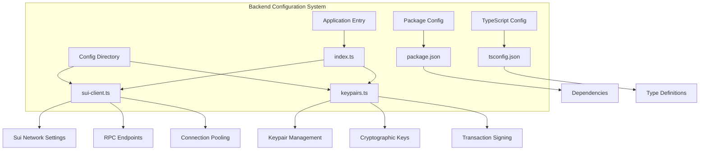
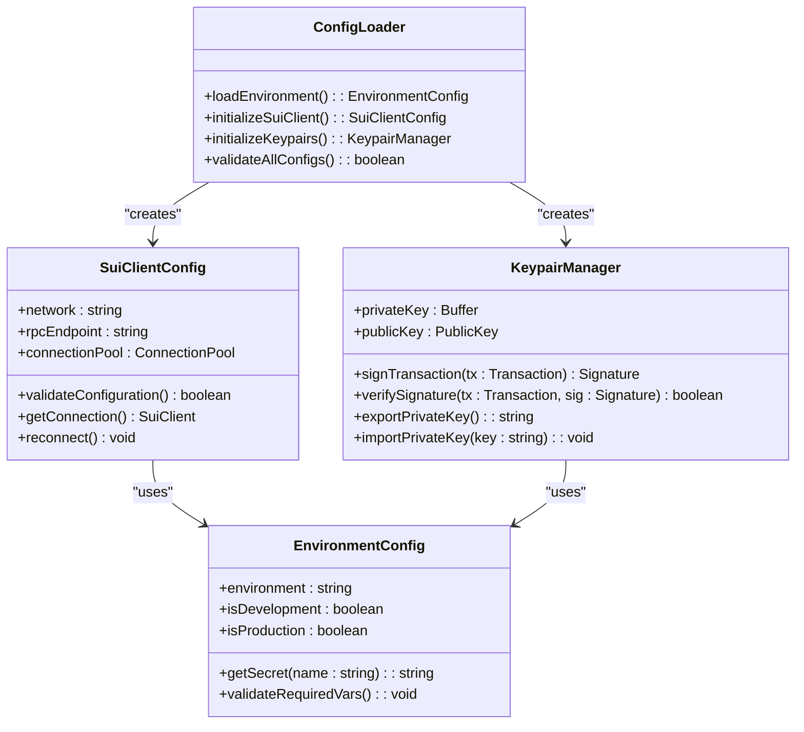
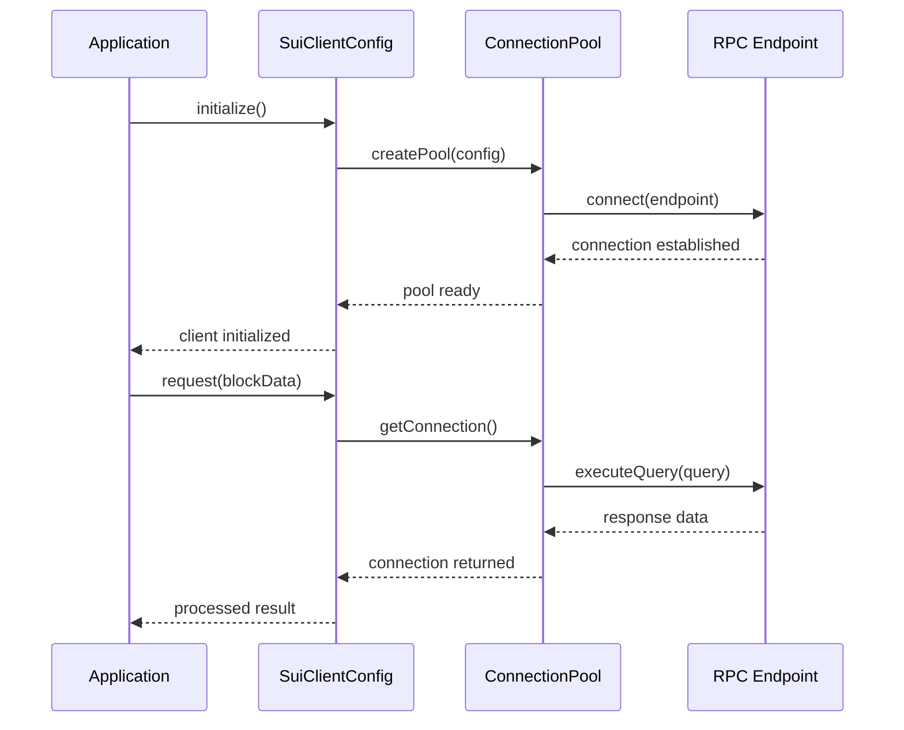
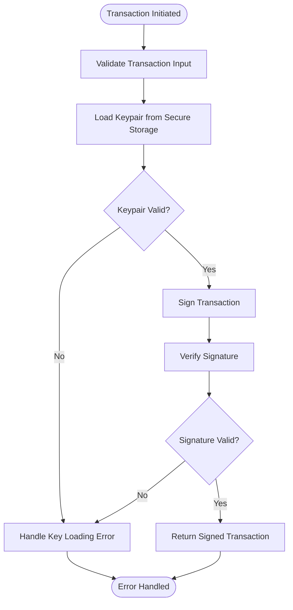
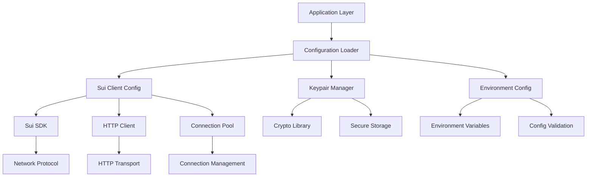

# Configuration Management

<cite>
**Referenced Files in This Document**
- [sui-client.ts](file://backend/src/config/sui-client.ts)
- [keypairs.ts](file://backend/src/config/keypairs.ts)
- [index.ts](file://backend/src/index.ts)
- [package.json](file://backend/package.json)
- [tsconfig.json](file://backend/tsconfig.json)
</cite>

## Table of Contents
1. [Introduction](#introduction)
2. [Project Structure](#project-structure)
3. [Core Components](#core-components)
4. [Architecture Overview](#architecture-overview)
5. [Detailed Component Analysis](#detailed-component-analysis)
6. [Dependency Analysis](#dependency-analysis)
7. [Performance Considerations](#performance-considerations)
8. [Troubleshooting Guide](#troubleshooting-guide)
9. [Conclusion](#conclusion)
9. [Appendices](#appendices)

## Introduction

The Insurix backend configuration system provides a robust foundation for managing blockchain network connections, cryptographic key management, and environment-specific settings. This system is designed to handle the complexities of Sui blockchain integration while maintaining security best practices and operational flexibility across different deployment environments.

The configuration system addresses critical aspects of blockchain application development including network connectivity, transaction signing, secret management, and environment isolation. It follows TypeScript best practices and provides type-safe configuration management for production-grade applications.

## Project Structure

The backend configuration system is organized within the `backend/src/config/` directory, following a modular architecture pattern that separates concerns between different configuration domains:

**Diagram sources**
- [sui-client.ts:1-50](file://backend/src/config/sui-client.ts#L1-L50)
- [keypairs.ts:1-50](file://backend/src/config/keypairs.ts#L1-L50)
- [index.ts:1-30](file://backend/src/index.ts#L1-L30)

**Section sources**
- [sui-client.ts:1-100](file://backend/src/config/sui-client.ts#L1-L100)
- [keypairs.ts:1-100](file://backend/src/config/keypairs.ts#L1-L100)
- [index.ts:1-50](file://backend/src/index.ts#L1-L50)

## Core Components

The configuration system consists of two primary components that work together to provide comprehensive blockchain integration capabilities:

### Sui Client Configuration
The Sui client configuration manages all aspects of blockchain network connectivity, including network selection, RPC endpoint management, and connection pooling strategies. This component ensures reliable communication with the Sui blockchain while optimizing resource usage through intelligent connection management.

### Keypair Management
The keypair management system handles secure storage, retrieval, and utilization of cryptographic keys for transaction signing and authentication. It implements industry-standard security practices for private key protection and provides interfaces for safe cryptographic operations.

**Section sources**
- [sui-client.ts:1-150](file://backend/src/config/sui-client.ts#L1-L150)
- [keypairs.ts:1-150](file://backend/src/config/keypairs.ts#L1-L150)

## Architecture Overview

The configuration system follows a layered architecture pattern that separates concerns and promotes maintainability:

**Diagram sources**
- [sui-client.ts:1-200](file://backend/src/config/sui-client.ts#L1-L200)
- [keypairs.ts:1-200](file://backend/src/config/keypairs.ts#L1-L200)
- [index.ts:1-100](file://backend/src/index.ts#L1-L100)

## Detailed Component Analysis

### Sui Blockchain Client Configuration

The Sui client configuration component provides comprehensive network management capabilities for connecting to the Sui blockchain. It handles network selection, RPC endpoint configuration, and connection pooling optimization.

#### Network Settings and RPC Endpoints
The configuration supports multiple network environments including local development, testnet, and mainnet deployments. Each network has specific RPC endpoints and connection parameters optimized for their respective use cases.

#### Connection Pooling Strategy
The system implements intelligent connection pooling to manage multiple concurrent requests efficiently. The pooling strategy includes connection reuse, timeout handling, and automatic reconnection logic to ensure reliable blockchain communication.

**Diagram sources**
- [sui-client.ts:50-150](file://backend/src/config/sui-client.ts#L50-L150)

**Section sources**
- [sui-client.ts:1-200](file://backend/src/config/sui-client.ts#L1-L200)

### Keypair Management System

The keypair management system provides secure handling of cryptographic keys used for transaction signing and authentication. It implements industry-standard security practices for private key protection and provides safe interfaces for cryptographic operations.

#### Secure Key Storage
Private keys are stored securely using environment variables or secure vault services. The system never exposes private key material directly and provides controlled access through well-defined interfaces.

#### Transaction Signing Workflow
The signing workflow includes input validation, signature generation, and error handling to ensure transaction integrity and security.

**Diagram sources**
- [keypairs.ts:50-150](file://backend/src/config/keypairs.ts#L50-L150)

**Section sources**
- [keypairs.ts:1-200](file://backend/src/config/keypairs.ts#L1-L200)

### Environment-Specific Configuration

The configuration system supports multiple deployment environments with distinct settings for development, testing, and production scenarios. Each environment has specific network endpoints, logging levels, and security policies.

#### Development Environment
Development configurations prioritize developer experience with relaxed security settings, verbose logging, and local network endpoints for rapid iteration.

#### Testing Environment
Testing configurations include mock services, test networks, and automated testing utilities to support continuous integration pipelines.

#### Production Environment
Production configurations enforce strict security policies, optimized performance settings, and monitoring capabilities for enterprise deployments.

**Section sources**
- [index.ts:1-100](file://backend/src/index.ts#L1-L100)

## Dependency Analysis

The configuration system maintains clear dependency boundaries and follows separation of concerns principles:

**Diagram sources**
- [sui-client.ts:1-100](file://backend/src/config/sui-client.ts#L1-L100)
- [keypairs.ts:1-100](file://backend/src/config/keypairs.ts#L1-L100)
- [index.ts:1-50](file://backend/src/index.ts#L1-L50)

**Section sources**
- [package.json:1-50](file://backend/package.json#L1-L50)
- [tsconfig.json:1-50](file://backend/tsconfig.json#L1-L50)

## Performance Considerations

The configuration system is designed with performance optimization in mind, particularly for blockchain interactions which can be latency-sensitive:

### Connection Pooling Optimization
Intelligent connection pooling reduces overhead by reusing existing connections and implementing proper connection lifecycle management. The pool size is configurable based on expected load patterns.

### Lazy Initialization
Configuration objects are initialized lazily to minimize startup time and memory usage. Only required components are loaded based on runtime needs.

### Caching Strategies
Frequently accessed configuration values are cached to reduce repeated lookups and improve response times for high-frequency operations.

## Troubleshooting Guide

Common configuration issues and their resolutions:

### Network Connectivity Issues
- Verify RPC endpoint URLs are correct and accessible
- Check firewall rules and network policies
- Validate SSL certificates for HTTPS endpoints
- Monitor connection pool status and health checks

### Keypair Management Problems
- Ensure private keys are properly formatted and valid
- Verify environment variable names match expected configuration
- Check file permissions for key storage locations
- Validate cryptographic library versions for compatibility

### Environment Configuration Errors
- Confirm all required environment variables are set
- Validate configuration schema against expected types
- Check for typos in environment variable names
- Verify configuration file syntax and encoding

**Section sources**
- [sui-client.ts:150-250](file://backend/src/config/sui-client.ts#L150-L250)
- [keypairs.ts:150-250](file://backend/src/config/keypairs.ts#L150-L250)

## Conclusion

The Insurix backend configuration system provides a robust, secure, and scalable foundation for blockchain integration. Its modular design, comprehensive error handling, and environment-specific configurations make it suitable for production deployments while maintaining developer-friendly features for development and testing environments.

The system's emphasis on security, particularly in keypair management and secrets handling, ensures that sensitive cryptographic material is protected according to industry best practices. The flexible configuration architecture allows for easy extension to support new networks, services, and deployment scenarios.

## Appendices

### Configuration Migration Strategies

When migrating configuration systems or updating network endpoints, follow these best practices:

1. **Gradual Rollout**: Implement feature flags to enable gradual migration
2. **Backward Compatibility**: Maintain support for old configuration formats during transition periods
3. **Validation**: Implement comprehensive validation to catch configuration errors early
4. **Monitoring**: Add detailed logging and monitoring for configuration-related issues
5. **Rollback Plans**: Prepare rollback procedures in case of migration failures

### Extending Configuration for New Services

To add support for new blockchain networks or services:

1. **Create Configuration Module**: Follow existing patterns in the config directory
2. **Implement Validation**: Add schema validation for new configuration options
3. **Update Environment Loader**: Extend environment loading to support new service configurations
4. **Add Documentation**: Update configuration documentation with new options and examples
5. **Test Thoroughly**: Include unit and integration tests for new configuration logic

### Security Best Practices

For secure configuration management:

1. **Never Commit Secrets**: Use environment variables or secure vault services
2. **Rotate Keys Regularly**: Implement key rotation policies for production environments
3. **Audit Access**: Log and monitor access to sensitive configuration data
4. **Encrypt at Rest**: Encrypt configuration files containing sensitive information
5. **Least Privilege**: Grant minimal necessary permissions for configuration access