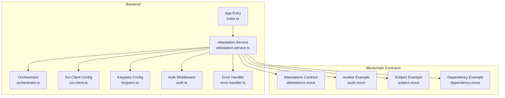
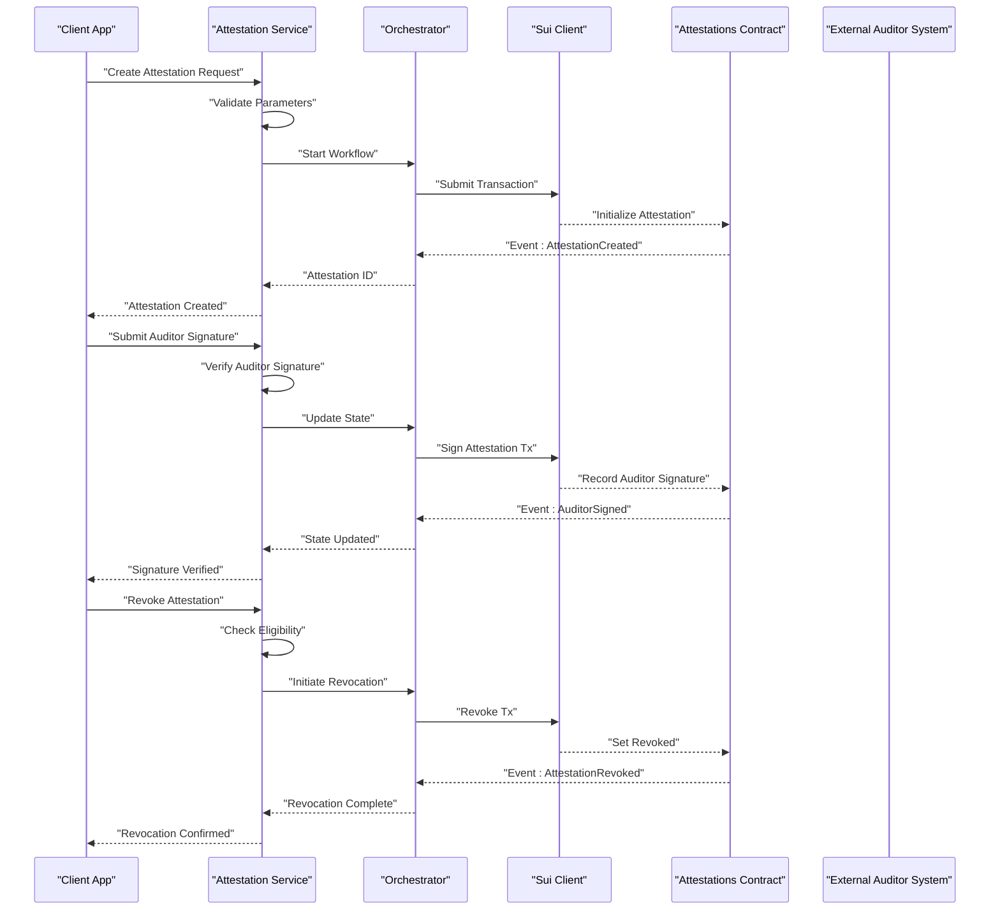
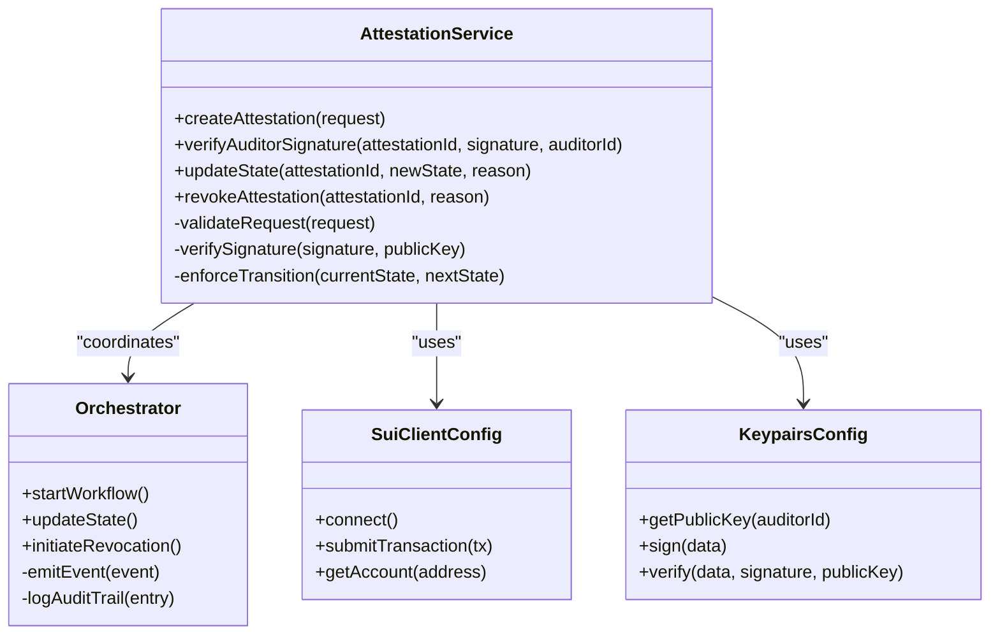
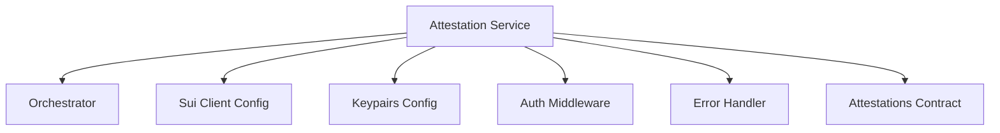
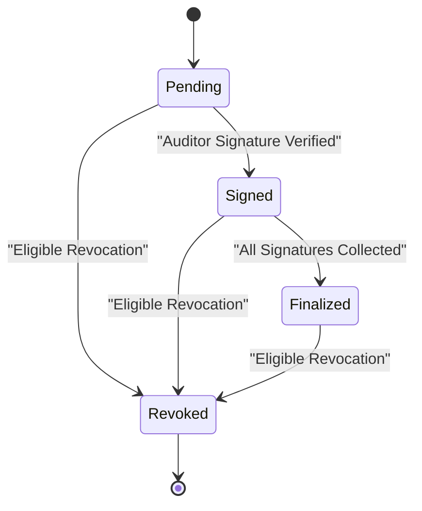

# Attestation Service

<cite>
**Referenced Files in This Document**
- [attestation.service.ts](file://backend/src/services/attestation.service.ts)
- [orchestrator.ts](file://backend/src/services/orchestrator.ts)
- [sui-client.ts](file://backend/src/config/sui-client.ts)
- [keypairs.ts](file://backend/src/config/keypairs.ts)
- [error-handler.ts](file://backend/src/middleware/error-handler.ts)
- [auth.ts](file://backend/src/middleware/auth.ts)
- [index.ts](file://backend/src/index.ts)
- [attestations.move](file://contracts/attestations/packages/attestations/sources/attestations.move)
- [README.md](file://contracts/attestations/README.md)
- [DESIGN.md](file://contracts/attestations/DESIGN.md)
- [AGENTS.md](file://contracts/attestations/AGENTS.md)
- [CONVENTIONS.md](file://contracts/attestations/CONVENTIONS.md)
- [FUTURE-EXTENSIONS.md](file://contracts/attestations/FUTURE-EXTENSIONS.md)
- [SIP-56-COMPARISON.md](file://contracts/attestations/SIP-56-COMPARISON.md)
- [audit.move](file://contracts/attestations/examples/auditor/sources/audit.move)
- [audit_tests.move](file://contracts/attestations/examples/auditor/tests/audit_tests.move)
- [demo-audit.move](file://contracts/attestations/demo/auditor_a/sources/audit.move)
- [demo-audit-v2.move](file://contracts/attestations/demo/auditor_a/upgrade/audit_v2.move)
- [subject.move](file://contracts/attestations/demo/subject_example/sources/subject.move)
- [dependency.move](file://contracts/attestations/demo/dependency_example/sources/dependency.move)
- [dependency_v2.move](file://contracts/attestations/demo/dependency_example/upgrade/dependency_v2.move)
</cite>

## Table of Contents
1. [Introduction](#introduction)
2. [Project Structure](#project-structure)
3. [Core Components](#core-components)
4. [Architecture Overview](#architecture-overview)
5. [Detailed Component Analysis](#detailed-component-analysis)
6. [Dependency Analysis](#dependency-analysis)
7. [Performance Considerations](#performance-considerations)
8. [Troubleshooting Guide](#troubleshooting-guide)
9. [Conclusion](#conclusion)
10. [Appendices](#appendices)

## Introduction
This document provides comprehensive documentation for the Insurix Attestation Service, which manages policy attestations and coordinates auditors. It explains how attestations are created, verified, transitioned through states, and revoked. It also covers integration with blockchain attestations contracts (Move-based on Sui), external auditor systems, error handling patterns, parameter validation, and compliance requirements. The goal is to make the system understandable for both technical and non-technical readers while providing precise references to source files.

## Project Structure
The Attestation Service spans backend services, configuration, middleware, and Move contracts:
- Backend service layer implements attestation orchestration, signature verification, state management, and revocation workflows.
- Configuration modules provide Sui client setup and keypair management.
- Middleware handles authentication and centralized error handling.
- Move contracts define the canonical attestation data model, auditor signatures, and lifecycle transitions on-chain.

**Diagram sources**
- [attestation.service.ts](file://backend/src/services/attestation.service.ts)
- [orchestrator.ts](file://backend/src/services/orchestrator.ts)
- [sui-client.ts](file://backend/src/config/sui-client.ts)
- [keypairs.ts](file://backend/src/config/keypairs.ts)
- [auth.ts](file://backend/src/middleware/auth.ts)
- [error-handler.ts](file://backend/src/middleware/error-handler.ts)
- [index.ts](file://backend/src/index.ts)
- [attestations.move](file://contracts/attestations/packages/attestations/sources/attestations.move)
- [audit.move](file://contracts/attestations/examples/auditor/sources/audit.move)
- [subject.move](file://contracts/attestations/demo/subject_example/sources/subject.move)
- [dependency.move](file://contracts/attestations/demo/dependency_example/sources/dependency.move)

**Section sources**
- [index.ts](file://backend/src/index.ts)
- [attestation.service.ts](file://backend/src/services/attestation.service.ts)
- [orchestrator.ts](file://backend/src/services/orchestrator.ts)
- [sui-client.ts](file://backend/src/config/sui-client.ts)
- [keypairs.ts](file://backend/src/config/keypairs.ts)
- [auth.ts](file://backend/src/middleware/auth.ts)
- [error-handler.ts](file://backend/src/middleware/error-handler.ts)
- [attestations.move](file://contracts/attestations/packages/attestations/sources/attestations.move)
- [README.md](file://contracts/attestations/README.md)
- [DESIGN.md](file://contracts/attestations/DESIGN.md)

## Core Components
- Attestation Service: Implements business logic for creating attestations, verifying auditor signatures, managing state transitions, and processing revocations. It interacts with the Sui client and orchestrates multi-party workflows.
- Orchestrator: Coordinates complex sequences across attestations, auditors, and blockchain transactions, ensuring idempotency and consistent state.
- Sui Client Config: Provides connection parameters, network selection, and transaction submission helpers.
- Keypairs Config: Manages cryptographic keys used for signing and verification operations.
- Auth Middleware: Validates caller identity and permissions before invoking attestation endpoints.
- Error Handler: Centralizes error formatting, logging, and response codes.

Key responsibilities:
- Create new attestations with validated inputs and initial state.
- Verify auditor signatures against public keys or on-chain identities.
- Transition attestation states (e.g., pending, signed, finalized, revoked).
- Handle revocation requests with audit trail updates.
- Emit events and maintain an immutable ledger via blockchain.

**Section sources**
- [attestation.service.ts](file://backend/src/services/attestation.service.ts)
- [orchestrator.ts](file://backend/src/services/orchestrator.ts)
- [sui-client.ts](file://backend/src/config/sui-client.ts)
- [keypairs.ts](file://backend/src/config/keypairs.ts)
- [auth.ts](file://backend/src/middleware/auth.ts)
- [error-handler.ts](file://backend/src/middleware/error-handler.ts)

## Architecture Overview
The Attestation Service integrates frontend clients, backend services, and Move contracts on Sui. Clients submit attestation requests; the service validates inputs, signs where required, and calls contract functions. Auditors sign off using their keys; the service verifies these signatures and updates on-chain state. Revocation flows follow a strict sequence to ensure immutability and auditability.

**Diagram sources**
- [attestation.service.ts](file://backend/src/services/attestation.service.ts)
- [orchestrator.ts](file://backend/src/services/orchestrator.ts)
- [sui-client.ts](file://backend/src/config/sui-client.ts)
- [attestations.move](file://contracts/attestations/packages/attestations/sources/attestations.move)

## Detailed Component Analysis

### Attestation Service
Responsibilities:
- Parameter validation for creation requests.
- Signature verification for auditor submissions.
- State machine enforcement for transitions.
- Revocation workflow coordination.
- Event emission and audit trail maintenance.

Typical methods and behaviors:
- createAttestation(request): Validates request fields, initializes state, emits creation event, returns attestation identifier.
- verifyAuditorSignature(attestationId, signature, auditorId): Checks auditor identity, validates signature against stored public key or on-chain identity, updates state if valid.
- updateState(attestationId, newState, reason): Enforces allowed transitions, records reason, emits state change event.
- revokeAttestation(attestationId, reason): Validates eligibility, initiates revocation, updates state, emits revocation event.

Parameter validation patterns:
- Required fields: attestation metadata, auditor identifiers, signature payloads.
- Type checks: IDs must be valid strings/addresses; timestamps must be ISO format; reasons must be non-empty strings.
- Business rules: Only authorized roles can initiate revocation; auditor must be registered; signature must match auditor’s key.

Error handling patterns:
- Input errors return structured error responses with field-level details.
- Verification failures return specific codes (e.g., invalid signature, unknown auditor).
- Blockchain errors propagate with context and retry guidance.

Compliance and audit trail:
- All state changes emit events recorded on-chain.
- Off-chain logs capture detailed reasoning and actor identities.
- Immutable history supports audits and dispute resolution.

**Section sources**
- [attestation.service.ts](file://backend/src/services/attestation.service.ts)
- [error-handler.ts](file://backend/src/middleware/error-handler.ts)
- [auth.ts](file://backend/src/middleware/auth.ts)

#### Class Diagram

**Diagram sources**
- [attestation.service.ts](file://backend/src/services/attestation.service.ts)
- [orchestrator.ts](file://backend/src/services/orchestrator.ts)
- [sui-client.ts](file://backend/src/config/sui-client.ts)
- [keypairs.ts](file://backend/src/config/keypairs.ts)

### Orchestrator
Responsibilities:
- Sequence management for multi-step processes.
- Idempotency guards to prevent duplicate transactions.
- Event emission and audit log entries.
- Coordination between service and blockchain layers.

Behavior highlights:
- startWorkflow(): Initializes process, sets up tracking, and delegates to appropriate handlers.
- updateState(): Applies state transitions after successful blockchain confirmations.
- initiateRevocation(): Executes revocation steps and ensures finality.

**Section sources**
- [orchestrator.ts](file://backend/src/services/orchestrator.ts)

### Sui Client Config
Responsibilities:
- Establishes connection to Sui network.
- Provides transaction submission utilities.
- Retrieves account information and balances.

Usage patterns:
- connect(): Initializes client with network settings.
- submitTransaction(tx): Sends transaction and returns receipt or error.
- getAccount(address): Fetches account details for verification.

**Section sources**
- [sui-client.ts](file://backend/src/config/sui-client.ts)

### Keypairs Config
Responsibilities:
- Manages cryptographic keys for signing and verification.
- Exposes methods to retrieve auditor public keys and verify signatures.

Usage patterns:
- getPublicKey(auditorId): Returns auditor’s public key for verification.
- sign(data): Signs payload with configured private key.
- verify(data, signature, publicKey): Validates signature integrity.

**Section sources**
- [keypairs.ts](file://backend/src/config/keypairs.ts)

### Middleware
- Auth Middleware: Validates caller identity and permissions before executing attestation operations.
- Error Handler: Standardizes error responses and logs exceptions consistently.

**Section sources**
- [auth.ts](file://backend/src/middleware/auth.ts)
- [error-handler.ts](file://backend/src/middleware/error-handler.ts)

## Dependency Analysis
The Attestation Service depends on configuration modules and orchestrates interactions with blockchain contracts. The following diagram shows core dependencies:

**Diagram sources**
- [attestation.service.ts](file://backend/src/services/attestation.service.ts)
- [orchestrator.ts](file://backend/src/services/orchestrator.ts)
- [sui-client.ts](file://backend/src/config/sui-client.ts)
- [keypairs.ts](file://backend/src/config/keypairs.ts)
- [auth.ts](file://backend/src/middleware/auth.ts)
- [error-handler.ts](file://backend/src/middleware/error-handler.ts)
- [attestations.move](file://contracts/attestations/packages/attestations/sources/attestations.move)

**Section sources**
- [attestation.service.ts](file://backend/src/services/attestation.service.ts)
- [orchestrator.ts](file://backend/src/services/orchestrator.ts)
- [sui-client.ts](file://backend/src/config/sui-client.ts)
- [keypairs.ts](file://backend/src/config/keypairs.ts)
- [auth.ts](file://backend/src/middleware/auth.ts)
- [error-handler.ts](file://backend/src/middleware/error-handler.ts)
- [attestations.move](file://contracts/attestations/packages/attestations/sources/attestations.move)

## Performance Considerations
- Batch operations: Group multiple attestation updates when possible to reduce network overhead.
- Caching: Cache auditor public keys and frequently accessed attestation metadata to minimize repeated queries.
- Retry logic: Implement exponential backoff for transient blockchain errors.
- Event filtering: Use efficient event queries to avoid scanning large histories.
- Idempotency: Ensure operations are safe to retry without duplicating state changes.

[No sources needed since this section provides general guidance]

## Troubleshooting Guide
Common issues and resolutions:
- Invalid signature: Verify auditor public key matches the one used to sign; check timestamp and payload integrity.
- Unknown auditor: Confirm auditor registration and identity mapping in configuration or on-chain registry.
- State transition errors: Review allowed transitions and current state; ensure authorization levels are correct.
- Blockchain errors: Inspect transaction receipts and error messages; adjust gas limits or retry with backoff.
- Authentication failures: Validate tokens and permissions; ensure caller has required roles.

Debugging tips:
- Enable detailed logging for each step in the orchestrator.
- Capture full request/response payloads for signature verification.
- Query on-chain events to trace state changes and auditor actions.

**Section sources**
- [error-handler.ts](file://backend/src/middleware/error-handler.ts)
- [auth.ts](file://backend/src/middleware/auth.ts)

## Conclusion
The Insurix Attestation Service provides a robust framework for managing policy attestations and coordinating auditors. It enforces strict validation, secure signature verification, deterministic state transitions, and comprehensive audit trails. Integration with Move-based contracts on Sui ensures immutability and transparency. By following the documented workflows and error handling patterns, developers can reliably implement attestation creation, verification, and revocation while maintaining compliance and security.

[No sources needed since this section summarizes without analyzing specific files]

## Appendices

### Attestation Lifecycle and State Transitions
States typically include:
- Pending: Initial state after creation.
- Signed: Auditor signature verified and recorded.
- Finalized: All required signatures collected; attestation active.
- Revoked: Attestation invalidated due to disputes or policy changes.

Transitions:
- Pending → Signed: After successful auditor signature verification.
- Signed → Finalized: When all required auditors have signed.
- Any → Revoked: Upon eligible revocation request with proper authorization.

[No sources needed since this diagram shows conceptual workflow, not actual code structure]

### Compliance Requirements
- Immutable audit trail: All state changes recorded on-chain with events.
- Identity assurance: Auditor identities bound to cryptographic keys.
- Authorization controls: Role-based access for sensitive operations like revocation.
- Dispute resolution: Clear evidence chain for auditor disputes and revocations.

[No sources needed since this section provides general guidance]

### Code Examples References
- Creating a new attestation: See method definitions and validation logic in the attestation service file.
- Verifying existing attestations: Refer to signature verification routines and state checks.
- Handling auditor disputes: Review revocation workflows and audit trail updates.

**Section sources**
- [attestation.service.ts](file://backend/src/services/attestation.service.ts)
- [orchestrator.ts](file://backend/src/services/orchestrator.ts)
- [attestations.move](file://contracts/attestations/packages/attestations/sources/attestations.move)
- [audit.move](file://contracts/attestations/examples/auditor/sources/audit.move)
- [audit_tests.move](file://contracts/attestations/examples/auditor/tests/audit_tests.move)
- [demo-audit.move](file://contracts/attestations/demo/auditor_a/sources/audit.move)
- [demo-audit-v2.move](file://contracts/attestations/demo/auditor_a/upgrade/audit_v2.move)
- [subject.move](file://contracts/attestations/demo/subject_example/sources/subject.move)
- [dependency.move](file://contracts/attestations/demo/dependency_example/sources/dependency.move)
- [dependency_v2.move](file://contracts/attestations/demo/dependency_example/upgrade/dependency_v2.move)
- [README.md](file://contracts/attestations/README.md)
- [DESIGN.md](file://contracts/attestations/DESIGN.md)
- [AGENTS.md](file://contracts/attestations/AGENTS.md)
- [CONVENTIONS.md](file://contracts/attestations/CONVENTIONS.md)
- [FUTURE-EXTENSIONS.md](file://contracts/attestations/FUTURE-EXTENSIONS.md)
- [SIP-56-COMPARISON.md](file://contracts/attestations/SIP-56-COMPARISON.md)