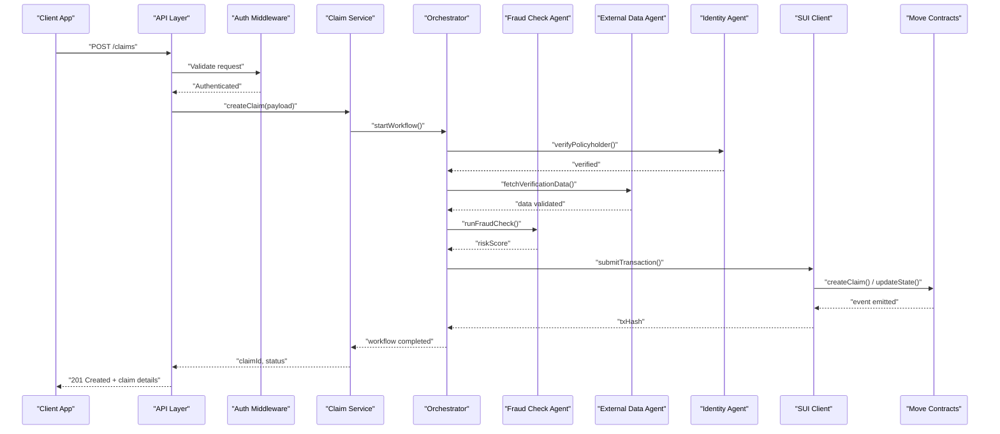
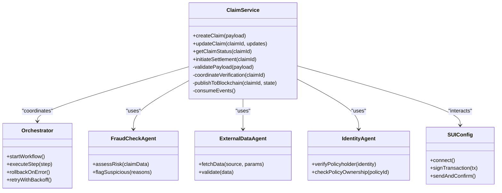
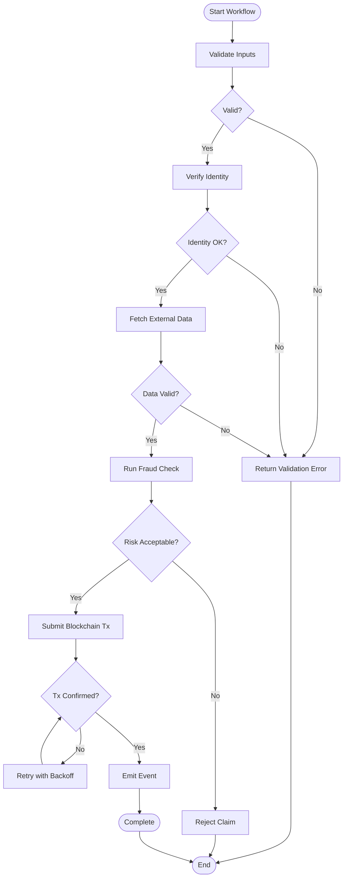
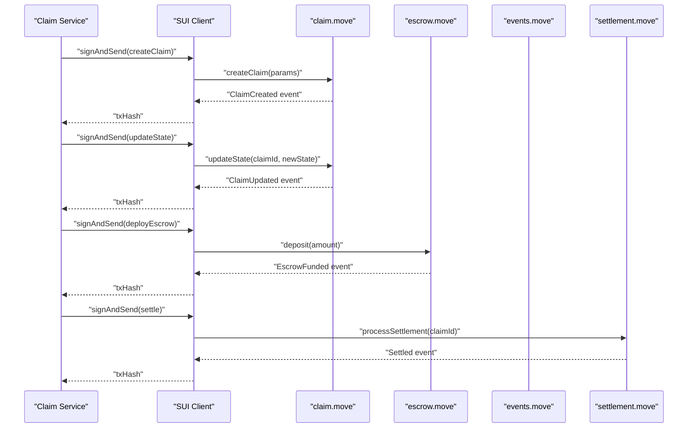
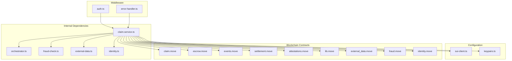

# Claim Service

<cite>
**Referenced Files in This Document**
- [claim.service.ts](file://backend/src/services/claim.service.ts)
- [orchestrator.ts](file://backend/src/services/orchestrator.ts)
- [fraud-check.ts](file://backend/src/agents/fraud-check.ts)
- [external-data.ts](file://backend/src/agents/external-data.ts)
- [identity.ts](file://backend/src/agents/identity.ts)
- [sui-client.ts](file://backend/src/config/sui-client.ts)
- [keypairs.ts](file://backend/src/config/keypairs.ts)
- [error-handler.ts](file://backend/src/middleware/error-handler.ts)
- [auth.ts](file://backend/src/middleware/auth.ts)
- [index.ts](file://backend/src/index.ts)
- [claim.move](file://contracts/insurix-settlement/sources/claim.move)
- [escrow.move](file://contracts/insurix-settlement/sources/escrow.move)
- [events.move](file://contracts/insurix-settlement/sources/events.move)
- [settlement.move](file://contracts/insurix-settlement/sources/settlement.move)
- [attestations.move](file://contracts/attestations/packages/attestations/sources/attestations.move)
- [lib.move](file://contracts/insurix-schemas/sources/lib.move)
- [external_data.move](file://contracts/insurix-schemas/sources/external_data.move)
- [fraud.move](file://contracts/insurix-schemas/sources/fraud.move)
- [identity.move](file://contracts/insurix-schemas/sources/identity.move)
</cite>

## Table of Contents
1. [Introduction](#introduction)
2. [Project Structure](#project-structure)
3. [Core Components](#core-components)
4. [Architecture Overview](#architecture-overview)
5. [Detailed Component Analysis](#detailed-component-analysis)
6. [Dependency Analysis](#dependency-analysis)
7. [Performance Considerations](#performance-considerations)
8. [Troubleshooting Guide](#troubleshooting-guide)
9. [Conclusion](#conclusion)
10. [Appendices](#appendices)

## Introduction
This document provides comprehensive documentation for the Claim Service that implements end-to-end claim processing within Insurix. It covers claim submission, validation, verification workflows, status tracking, and settlement coordination. The service integrates with blockchain contracts for immutable state management, external data sources for verification, and AI agents for fraud detection. It also documents API methods for claim creation, updates, status queries, and settlement processing, along with error handling strategies, retry mechanisms, and transaction rollback procedures. Practical examples illustrate successful claims, rejected claims, and dispute resolution workflows.

## Project Structure
The backend is organized into services, agents, configuration, middleware, and an entry point. Contracts are implemented as Move modules under the contracts directory. The frontend interacts via API clients.

```mermaid
graph TB
subgraph "Backend"
A["index.ts"]
B["services/claim.service.ts"]
C["services/orchestrator.ts"]
D["agents/fraud-check.ts"]
E["agents/external-data.ts"]
F["agents/identity.ts"]
G["config/sui-client.ts"]
H["config/keypairs.ts"]
I["middleware/error-handler.ts"]
J["middleware/auth.ts"]
end
subgraph "Blockchain (Move)"
K["contracts/insurix-settlement/sources/claim.move"]
L["contracts/insurix-settlement/sources/escrow.move"]
M["contracts/insurix-settlement/sources/events.move"]
N["contracts/insurix-settlement/sources/settlement.move"]
O["contracts/attestations/packages/attestations/sources/attestations.move"]
P["contracts/insurix-schemas/sources/lib.move"]
Q["contracts/insurix-schemas/sources/external_data.move"]
R["contracts/insurix-schemas/sources/fraud.move"]
S["contracts/insurix-schemas/sources/identity.move"]
end
A --> B
B --> C
B --> D
B --> E
B --> F
B --> G
B --> H
A --> I
A --> J
B --> K
B --> L
B --> M
B --> N
B --> O
B --> P
B --> Q
B --> R
B --> S
```

**Diagram sources**
- [index.ts](file://backend/src/index.ts)
- [claim.service.ts](file://backend/src/services/claim.service.ts)
- [orchestrator.ts](file://backend/src/services/orchestrator.ts)
- [fraud-check.ts](file://backend/src/agents/fraud-check.ts)
- [external-data.ts](file://backend/src/agents/external-data.ts)
- [identity.ts](file://backend/src/agents/identity.ts)
- [sui-client.ts](file://backend/src/config/sui-client.ts)
- [keypairs.ts](file://backend/src/config/keypairs.ts)
- [error-handler.ts](file://backend/src/middleware/error-handler.ts)
- [auth.ts](file://backend/src/middleware/auth.ts)
- [claim.move](file://contracts/insurix-settlement/sources/claim.move)
- [escrow.move](file://contracts/insurix-settlement/sources/escrow.move)
- [events.move](file://contracts/insurix-settlement/sources/events.move)
- [settlement.move](file://contracts/insurix-settlement/sources/settlement.move)
- [attestations.move](file://contracts/attestations/packages/attestations/sources/attestations.move)
- [lib.move](file://contracts/insurix-schemas/sources/lib.move)
- [external_data.move](file://contracts/insurix-schemas/sources/external_data.move)
- [fraud.move](file://contracts/insurix-schemas/sources/fraud.move)
- [identity.move](file://contracts/insurix-schemas/sources/identity.move)

**Section sources**
- [index.ts](file://backend/src/index.ts)
- [claim.service.ts](file://backend/src/services/claim.service.ts)
- [orchestrator.ts](file://backend/src/services/orchestrator.ts)
- [fraud-check.ts](file://backend/src/agents/fraud-check.ts)
- [external-data.ts](file://backend/src/agents/external-data.ts)
- [identity.ts](file://backend/src/agents/identity.ts)
- [sui-client.ts](file://backend/src/config/sui-client.ts)
- [keypairs.ts](file://backend/src/config/keypairs.ts)
- [error-handler.ts](file://backend/src/middleware/error-handler.ts)
- [auth.ts](file://backend/src/middleware/auth.ts)
- [claim.move](file://contracts/insurix-settlement/sources/claim.move)
- [escrow.move](file://contracts/insurix-settlement/sources/escrow.move)
- [events.move](file://contracts/insurix-settlement/sources/events.move)
- [settlement.move](file://contracts/insurix-settlement/sources/settlement.move)
- [attestations.move](file://contracts/attestations/packages/attestations/sources/attestations.move)
- [lib.move](file://contracts/insurix-schemas/sources/lib.move)
- [external_data.move](file://contracts/insurix-schemas/sources/external_data.move)
- [fraud.move](file://contracts/insurix-schemas/sources/fraud.move)
- [identity.move](file://contracts/insurix-schemas/sources/identity.move)

## Core Components
- Claim Service: Orchestrates claim lifecycle including submission, validation, verification, status tracking, and settlement coordination. Interacts with blockchain via SUI client and keypairs, and coordinates with AI agents for identity and fraud checks.
- Orchestrator: Coordinates multi-step workflows, manages retries, and handles rollbacks across external calls and blockchain transactions.
- Fraud Check Agent: Performs risk scoring and anomaly detection using AI heuristics or models to flag suspicious claims.
- External Data Agent: Retrieves and validates third-party data (e.g., weather, medical records, vehicle history) to support claim verification.
- Identity Agent: Validates policyholder identity and policy ownership through on-chain attestations and off-chain proofs.
- SUI Client Configuration: Provides connection settings and signing utilities for interacting with Move contracts.
- Keypairs Configuration: Manages cryptographic keys used for signing transactions and verifying signatures.
- Error Handler Middleware: Centralizes error formatting, logging, and response standardization.
- Auth Middleware: Enforces authentication and authorization for API endpoints.

**Section sources**
- [claim.service.ts](file://backend/src/services/claim.service.ts)
- [orchestrator.ts](file://backend/src/services/orchestrator.ts)
- [fraud-check.ts](file://backend/src/agents/fraud-check.ts)
- [external-data.ts](file://backend/src/agents/external-data.ts)
- [identity.ts](file://backend/src/agents/identity.ts)
- [sui-client.ts](file://backend/src/config/sui-client.ts)
- [keypairs.ts](file://backend/src/config/keypairs.ts)
- [error-handler.ts](file://backend/src/middleware/error-handler.ts)
- [auth.ts](file://backend/src/middleware/auth.ts)

## Architecture Overview
The Claim Service acts as the central coordinator between HTTP APIs, AI agents, external data sources, and blockchain contracts. Claims flow through validation, verification, and settlement stages, with state persisted immutably on-chain.

**Diagram sources**
- [index.ts](file://backend/src/index.ts)
- [auth.ts](file://backend/src/middleware/auth.ts)
- [claim.service.ts](file://backend/src/services/claim.service.ts)
- [orchestrator.ts](file://backend/src/services/orchestrator.ts)
- [fraud-check.ts](file://backend/src/agents/fraud-check.ts)
- [external-data.ts](file://backend/src/agents/external-data.ts)
- [identity.ts](file://backend/src/agents/identity.ts)
- [sui-client.ts](file://backend/src/config/sui-client.ts)
- [claim.move](file://contracts/insurix-settlement/sources/claim.move)
- [events.move](file://contracts/insurix-settlement/sources/events.move)

## Detailed Component Analysis

### Claim Service
Responsibilities:
- Accepts claim submissions and performs initial validation.
- Coordinates verification steps via the orchestrator.
- Updates claim status based on verification outcomes and blockchain events.
- Initiates settlement processes upon approval.

Key behaviors:
- Input validation and normalization.
- Integration with identity and external data agents.
- Blockchain interaction for state persistence and event consumption.
- Settlement coordination with escrow and settlement contracts.

**Diagram sources**
- [claim.service.ts](file://backend/src/services/claim.service.ts)
- [orchestrator.ts](file://backend/src/services/orchestrator.ts)
- [fraud-check.ts](file://backend/src/agents/fraud-check.ts)
- [external-data.ts](file://backend/src/agents/external-data.ts)
- [identity.ts](file://backend/src/agents/identity.ts)
- [sui-client.ts](file://backend/src/config/sui-client.ts)

**Section sources**
- [claim.service.ts](file://backend/src/services/claim.service.ts)
- [orchestrator.ts](file://backend/src/services/orchestrator.ts)
- [fraud-check.ts](file://backend/src/agents/fraud-check.ts)
- [external-data.ts](file://backend/src/agents/external-data.ts)
- [identity.ts](file://backend/src/agents/identity.ts)
- [sui-client.ts](file://backend/src/config/sui-client.ts)

### Orchestration Workflow
The orchestrator manages multi-step workflows, ensuring each step completes successfully before proceeding. It supports retries and rollbacks when errors occur.

**Diagram sources**
- [orchestrator.ts](file://backend/src/services/orchestrator.ts)
- [identity.ts](file://backend/src/agents/identity.ts)
- [external-data.ts](file://backend/src/agents/external-data.ts)
- [fraud-check.ts](file://backend/src/agents/fraud-check.ts)
- [sui-client.ts](file://backend/src/config/sui-client.ts)

**Section sources**
- [orchestrator.ts](file://backend/src/services/orchestrator.ts)

### Blockchain Integration
The service interacts with Move contracts to manage claim state, emit events, and coordinate settlements. Key contracts include claim management, escrow, events, and settlement logic.

**Diagram sources**
- [claim.service.ts](file://backend/src/services/claim.service.ts)
- [sui-client.ts](file://backend/src/config/sui-client.ts)
- [claim.move](file://contracts/insurix-settlement/sources/claim.move)
- [escrow.move](file://contracts/insurix-settlement/sources/escrow.move)
- [events.move](file://contracts/insurix-settlement/sources/events.move)
- [settlement.move](file://contracts/insurix-settlement/sources/settlement.move)

**Section sources**
- [claim.service.ts](file://backend/src/services/claim.service.ts)
- [sui-client.ts](file://backend/src/config/sui-client.ts)
- [claim.move](file://contracts/insurix-settlement/sources/claim.move)
- [escrow.move](file://contracts/insurix-settlement/sources/escrow.move)
- [events.move](file://contracts/insurix-settlement/sources/events.move)
- [settlement.move](file://contracts/insurix-settlement/sources/settlement.move)

### API Methods
Endpoints exposed by the service:
- POST /claims: Create a new claim with payload validation and workflow initiation.
- PATCH /claims/:id: Update claim details or status during processing.
- GET /claims/:id/status: Query current claim status and audit trail.
- POST /claims/:id/settle: Initiate settlement process after verification completion.

Request/response patterns:
- Creation returns claimId, initial status, and expected next steps.
- Updates return updated status and any pending actions.
- Status queries return detailed state, verification results, and blockchain tx hashes.
- Settlement responses include escrow funding confirmation and payout instructions.

Error handling:
- Standardized error responses with codes and messages.
- Retryable errors for transient network failures.
- Non-retryable errors for validation and policy mismatches.

**Section sources**
- [index.ts](file://backend/src/index.ts)
- [error-handler.ts](file://backend/src/middleware/error-handler.ts)
- [auth.ts](file://backend/src/middleware/auth.ts)

### Error Handling and Retries
Strategies implemented:
- Centralized error handler formats and logs all exceptions consistently.
- Orchestrator applies exponential backoff for transient failures.
- Transaction rollback procedures revert blockchain state changes where possible.
- Dead letter queues for failed verification steps requiring manual intervention.

Rollback procedures:
- Atomicity enforced at contract level for critical operations.
- Compensating transactions issued to reverse partial state changes.
- Audit logs maintained for traceability and compliance.

**Section sources**
- [error-handler.ts](file://backend/src/middleware/error-handler.ts)
- [orchestrator.ts](file://backend/src/services/orchestrator.ts)

### Practical Examples

#### Successful Claim Scenario
Steps:
1. Client submits claim with valid policy and supporting documents.
2. Identity agent verifies policyholder and ownership.
3. External data agent confirms incident details.
4. Fraud check agent returns acceptable risk score.
5. Claim created on-chain; status set to verified.
6. Settlement initiated; funds released from escrow.

Outcome:
- Claim status transitions to settled.
- All events recorded on-chain.
- Client receives confirmation with payout details.

#### Rejected Claim Scenario
Triggers:
- Invalid policy or missing documentation.
- High fraud risk score.
- Inconsistent external data.

Process:
- Verification fails at one or more steps.
- Claim marked as rejected with reason codes.
- No blockchain state changes beyond rejection event.

Outcome:
- Client notified with detailed rejection reasons.
- Option to resubmit with corrected information.

#### Dispute Resolution Workflow
Initiation:
- Policyholder disputes claim decision.
- Dispute filed via API with supporting evidence.

Resolution:
- Independent review triggered by AI agents.
- Additional external data fetched for re-evaluation.
- If upheld, original decision stands; if overturned, settlement proceeds.

Outcome:
- Final decision recorded on-chain.
- Audit trail includes all review steps and decisions.

[No sources needed since this section doesn't analyze specific files]

## Dependency Analysis
The Claim Service depends on multiple internal and external components. Understanding these relationships helps identify potential bottlenecks and failure points.

**Diagram sources**
- [claim.service.ts](file://backend/src/services/claim.service.ts)
- [orchestrator.ts](file://backend/src/services/orchestrator.ts)
- [fraud-check.ts](file://backend/src/agents/fraud-check.ts)
- [external-data.ts](file://backend/src/agents/external-data.ts)
- [identity.ts](file://backend/src/agents/identity.ts)
- [sui-client.ts](file://backend/src/config/sui-client.ts)
- [keypairs.ts](file://backend/src/config/keypairs.ts)
- [auth.ts](file://backend/src/middleware/auth.ts)
- [error-handler.ts](file://backend/src/middleware/error-handler.ts)
- [claim.move](file://contracts/insurix-settlement/sources/claim.move)
- [escrow.move](file://contracts/insurix-settlement/sources/escrow.move)
- [events.move](file://contracts/insurix-settlement/sources/events.move)
- [settlement.move](file://contracts/insurix-settlement/sources/settlement.move)
- [attestations.move](file://contracts/attestations/packages/attestations/sources/attestations.move)
- [lib.move](file://contracts/insurix-schemas/sources/lib.move)
- [external_data.move](file://contracts/insurix-schemas/sources/external_data.move)
- [fraud.move](file://contracts/insurix-schemas/sources/fraud.move)
- [identity.move](file://contracts/insurix-schemas/sources/identity.move)

**Section sources**
- [claim.service.ts](file://backend/src/services/claim.service.ts)
- [orchestrator.ts](file://backend/src/services/orchestrator.ts)
- [fraud-check.ts](file://backend/src/agents/fraud-check.ts)
- [external-data.ts](file://backend/src/agents/external-data.ts)
- [identity.ts](file://backend/src/agents/identity.ts)
- [sui-client.ts](file://backend/src/config/sui-client.ts)
- [keypairs.ts](file://backend/src/config/keypairs.ts)
- [auth.ts](file://backend/src/middleware/auth.ts)
- [error-handler.ts](file://backend/src/middleware/error-handler.ts)
- [claim.move](file://contracts/insurix-settlement/sources/claim.move)
- [escrow.move](file://contracts/insurix-settlement/sources/escrow.move)
- [events.move](file://contracts/insurix-settlement/sources/events.move)
- [settlement.move](file://contracts/insurix-settlement/sources/settlement.move)
- [attestations.move](file://contracts/attestations/packages/attestations/sources/attestations.move)
- [lib.move](file://contracts/insurix-schemas/sources/lib.move)
- [external_data.move](file://contracts/insurix-schemas/sources/external_data.move)
- [fraud.move](file://contracts/insurix-schemas/sources/fraud.move)
- [identity.move](file://contracts/insurix-schemas/sources/identity.move)

## Performance Considerations
- Batch processing for high-volume claim submissions to reduce blockchain transaction overhead.
- Caching frequently accessed external data to minimize latency.
- Asynchronous processing for non-critical verification steps.
- Connection pooling for database and external API calls.
- Monitoring and alerting for slow verification steps and blockchain confirmations.

[No sources needed since this section provides general guidance]

## Troubleshooting Guide
Common issues and resolutions:
- Authentication failures: Verify token validity and permissions.
- Validation errors: Check claim payload structure and required fields.
- External data timeouts: Implement retry logic and fallback data sources.
- Blockchain transaction failures: Review gas limits and contract state requirements.
- Fraud detection false positives: Tune risk thresholds and review model inputs.

Debugging utilities:
- Enable detailed logging for verification steps.
- Use blockchain explorers to inspect transaction states.
- Monitor agent health and response times.

**Section sources**
- [error-handler.ts](file://backend/src/middleware/error-handler.ts)
- [auth.ts](file://backend/src/middleware/auth.ts)

## Conclusion
The Claim Service provides a robust, scalable solution for end-to-end claim processing in Insurix. By integrating AI agents, external data sources, and blockchain contracts, it ensures secure, transparent, and efficient claim handling. The modular architecture enables easy maintenance and extension, while comprehensive error handling and monitoring ensure reliability in production environments.

[No sources needed since this section summarizes without analyzing specific files]

## Appendices

### API Reference Summary
- POST /claims: Create claim with payload validation and workflow initiation.
- PATCH /claims/:id: Update claim details or status.
- GET /claims/:id/status: Retrieve claim status and audit trail.
- POST /claims/:id/settle: Initiate settlement after verification completion.

### State Transitions
- Draft: Initial claim creation.
- Verified: Successfully passed all verification steps.
- Settled: Funds disbursed from escrow.
- Rejected: Failed verification or fraud detection.
- Disputed: Under review due to policyholder dispute.

[No sources needed since this section provides general reference information]