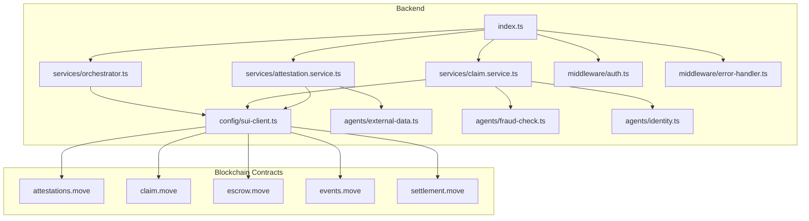
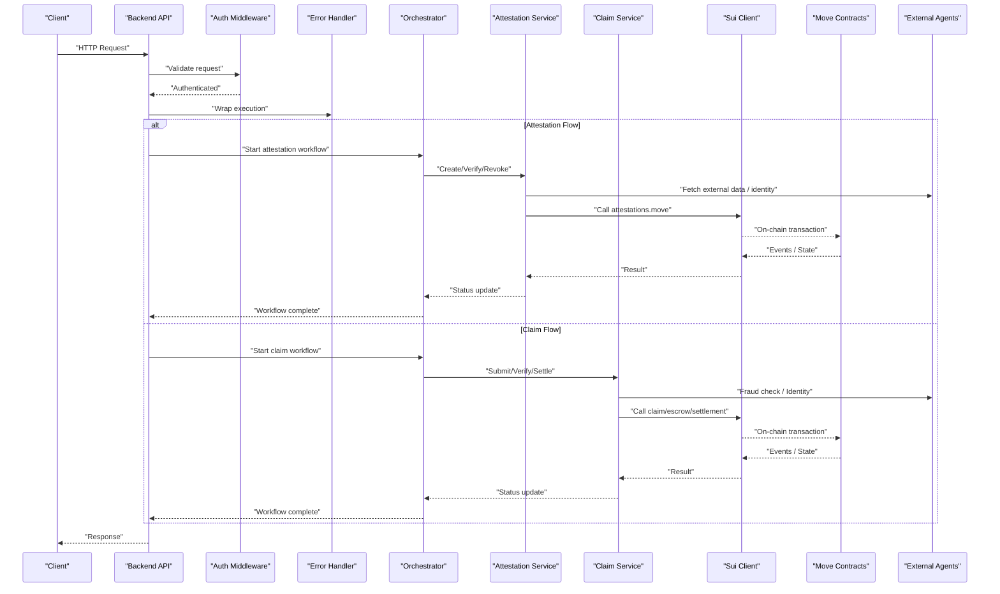
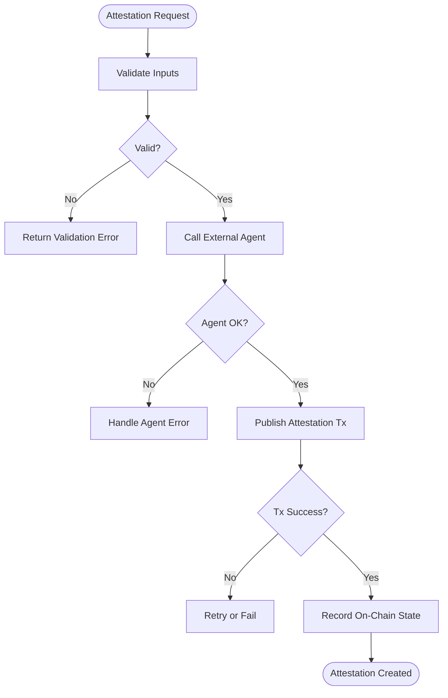
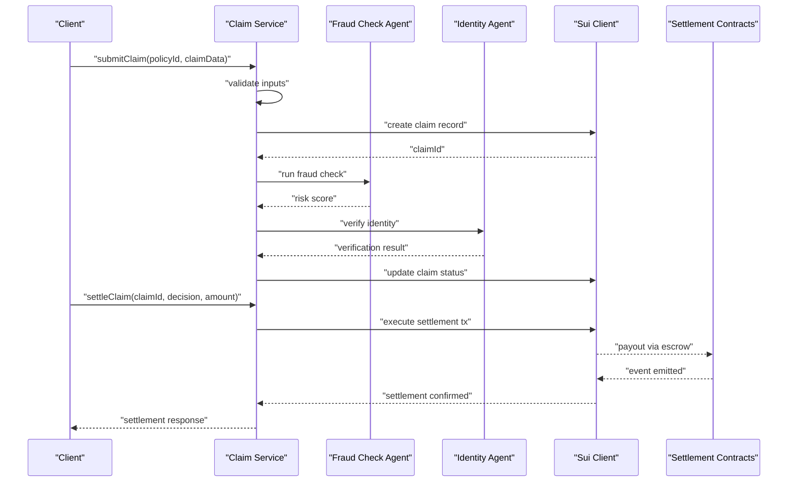
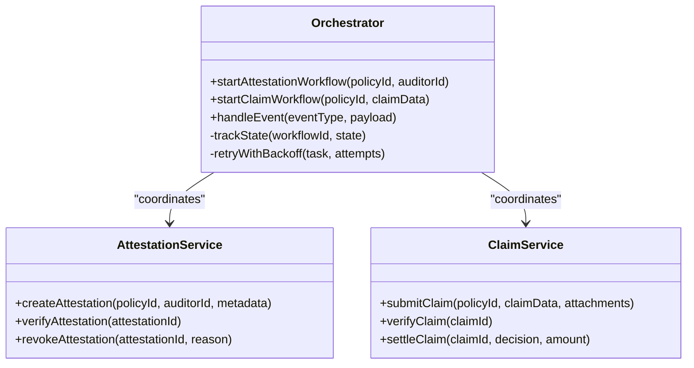
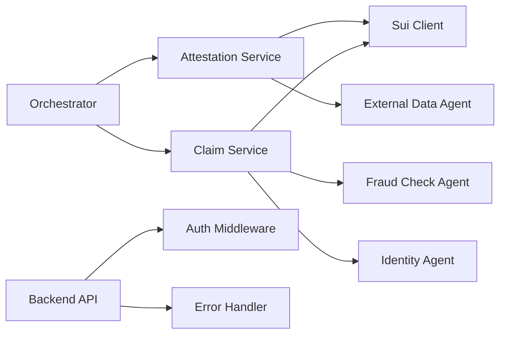

# Core Services

<cite>
**Referenced Files in This Document**
- [index.ts](file://backend/src/index.ts)
- [attestation.service.ts](file://backend/src/services/attestation.service.ts)
- [claim.service.ts](file://backend/src/services/claim.service.ts)
- [orchestrator.ts](file://backend/src/services/orchestrator.ts)
- [sui-client.ts](file://backend/src/config/sui-client.ts)
- [keypairs.ts](file://backend/src/config/keypairs.ts)
- [auth.ts](file://backend/src/middleware/auth.ts)
- [error-handler.ts](file://backend/src/middleware/error-handler.ts)
- [external-data.ts](file://backend/src/agents/external-data.ts)
- [fraud-check.ts](file://backend/src/agents/fraud-check.ts)
- [identity.ts](file://backend/src/agents/identity.ts)
- [attestations.move](file://contracts/attestations/packages/attestations/sources/attestations.move)
- [claim.move](file://contracts/insurix-settlement/sources/claim.move)
- [escrow.move](file://contracts/insurix-settlement/sources/escrow.move)
- [events.move](file://contracts/insurix-settlement/sources/events.move)
- [settlement.move](file://contracts/insurix-settlement/sources/settlement.move)
</cite>

## Table of Contents
1. [Introduction](#introduction)
2. [Project Structure](#project-structure)
3. [Core Components](#core-components)
4. [Architecture Overview](#architecture-overview)
5. [Detailed Component Analysis](#detailed-component-analysis)
6. [Dependency Analysis](#dependency-analysis)
7. [Performance Considerations](#performance-considerations)
8. [Troubleshooting Guide](#troubleshooting-guide)
9. [Conclusion](#conclusion)

## Introduction
This document provides comprehensive documentation for the core backend services in Insurix, focusing on:
- Attestation Service: manages policy attestations and auditor coordination, including creation, verification, and revocation workflows.
- Claim Service: handles end-to-end claim processing from submission through verification to settlement.
- Orchestrator Service: coordinates between components and manages business workflows across attestation and claim lifecycles.

It also covers service interfaces, method signatures, error handling patterns, integration points with blockchain contracts (Sui Move), and external agents. Practical usage examples are provided via code snippet paths to guide implementation and troubleshooting.

## Project Structure
The backend is organized into modular layers:
- Entry point and server bootstrap
- Configuration for Sui client and key management
- Middleware for authentication and error handling
- Services implementing core business logic
- Agents integrating external data sources and specialized checks
- Contracts defining on-chain state and events

**Diagram sources**
- [index.ts](file://backend/src/index.ts)
- [attestation.service.ts](file://backend/src/services/attestation.service.ts)
- [claim.service.ts](file://backend/src/services/claim.service.ts)
- [orchestrator.ts](file://backend/src/services/orchestrator.ts)
- [sui-client.ts](file://backend/src/config/sui-client.ts)
- [external-data.ts](file://backend/src/agents/external-data.ts)
- [fraud-check.ts](file://backend/src/agents/fraud-check.ts)
- [identity.ts](file://backend/src/agents/identity.ts)
- [attestations.move](file://contracts/attestations/packages/attestations/sources/attestations.move)
- [claim.move](file://contracts/insurix-settlement/sources/claim.move)
- [escrow.move](file://contracts/insurix-settlement/sources/escrow.move)
- [events.move](file://contracts/insurix-settlement/sources/events.move)
- [settlement.move](file://contracts/insurix-settlement/sources/settlement.move)

**Section sources**
- [index.ts](file://backend/src/index.ts)
- [sui-client.ts](file://backend/src/config/sui-client.ts)
- [keypairs.ts](file://backend/src/config/keypairs.ts)
- [auth.ts](file://backend/src/middleware/auth.ts)
- [error-handler.ts](file://backend/src/middleware/error-handler.ts)

## Core Components
- Attestation Service: Provides methods to create, verify, and revoke attestations; coordinates with auditors and updates on-chain state via Sui client.
- Claim Service: Implements the full claim lifecycle: submission, validation, fraud checks, identity verification, settlement, and payout orchestration.
- Orchestrator Service: Coordinates multi-step workflows across attestation and claim services, manages state transitions, retries, and event-driven triggers.

Key responsibilities:
- Enforce business rules and validations before invoking blockchain transactions.
- Manage asynchronous tasks and ensure idempotency where necessary.
- Centralize error handling and logging for consistent observability.

**Section sources**
- [attestation.service.ts](file://backend/src/services/attestation.service.ts)
- [claim.service.ts](file://backend/src/services/claim.service.ts)
- [orchestrator.ts](file://backend/src/services/orchestrator.ts)

## Architecture Overview
The system integrates backend services with Sui blockchain contracts and external agents:
- Services expose APIs and coordinate workflows.
- Sui client interacts with published Move modules for immutable state and verifiable events.
- Agents provide specialized capabilities such as external data retrieval, fraud detection, and identity verification.

**Diagram sources**
- [index.ts](file://backend/src/index.ts)
- [auth.ts](file://backend/src/middleware/auth.ts)
- [error-handler.ts](file://backend/src/middleware/error-handler.ts)
- [orchestrator.ts](file://backend/src/services/orchestrator.ts)
- [attestation.service.ts](file://backend/src/services/attestation.service.ts)
- [claim.service.ts](file://backend/src/services/claim.service.ts)
- [sui-client.ts](file://backend/src/config/sui-client.ts)
- [attestations.move](file://contracts/attestations/packages/attestations/sources/attestations.move)
- [claim.move](file://contracts/insurix-settlement/sources/claim.move)
- [escrow.move](file://contracts/insurix-settlement/sources/escrow.move)
- [events.move](file://contracts/insurix-settlement/sources/events.move)
- [settlement.move](file://contracts/insurix-settlement/sources/settlement.move)
- [external-data.ts](file://backend/src/agents/external-data.ts)
- [fraud-check.ts](file://backend/src/agents/fraud-check.ts)
- [identity.ts](file://backend/src/agents/identity.ts)

## Detailed Component Analysis

### Attestation Service
Responsibilities:
- Create attestations for policies, coordinating with auditors.
- Verify existing attestations against on-chain records.
- Revoke attestations when conditions change or audits fail.

Key methods:
- createAttestation(policyId, auditorId, metadata): Initiates audit and publishes attestation on-chain.
- verifyAttestation(attestationId): Validates signature and on-chain state.
- revokeAttestation(attestationId, reason): Revokes and records reason on-chain.

Integration points:
- Sui client for contract calls to attestations.move.
- External agents for data validation and identity checks.

Error handling:
- Input validation errors return structured responses.
- Blockchain call failures are retried with backoff and logged.
- Auditor coordination timeouts handled with fallback states.

Usage example references:
- Creating an attestation: [attestation.service.ts](file://backend/src/services/attestation.service.ts)
- Verifying an attestation: [attestation.service.ts](file://backend/src/services/attestation.service.ts)
- Revoking an attestation: [attestation.service.ts](file://backend/src/services/attestation.service.ts)

**Diagram sources**
- [attestation.service.ts](file://backend/src/services/attestation.service.ts)
- [external-data.ts](file://backend/src/agents/external-data.ts)
- [identity.ts](file://backend/src/agents/identity.ts)
- [sui-client.ts](file://backend/src/config/sui-client.ts)
- [attestations.move](file://contracts/attestations/packages/attestations/sources/attestations.move)

**Section sources**
- [attestation.service.ts](file://backend/src/services/attestation.service.ts)
- [sui-client.ts](file://backend/src/config/sui-client.ts)
- [keypairs.ts](file://backend/src/config/keypairs.ts)
- [external-data.ts](file://backend/src/agents/external-data.ts)
- [identity.ts](file://backend/src/agents/identity.ts)
- [attestations.move](file://contracts/attestations/packages/attestations/sources/attestations.move)

### Claim Service
Responsibilities:
- Submit claims with supporting documents and metadata.
- Perform verification steps including fraud checks and identity validation.
- Orchestrate settlement and payout via escrow and settlement contracts.

Key methods:
- submitClaim(policyId, claimData, attachments): Validates and stores claim intent.
- verifyClaim(claimId): Runs fraud checks and identity verification.
- settleClaim(claimId, decision, amount): Executes settlement and payout.

Integration points:
- Sui client for claim.move, escrow.move, settlement.move interactions.
- Fraud-check agent for risk scoring and anomaly detection.
- Identity agent for KYC/AML verification.

Error handling:
- Claim submission validates required fields and formats.
- Verification failures trigger rework or rejection flows.
- Settlement errors include rollback mechanisms and alerts.

Usage example references:
- Submitting a claim: [claim.service.ts](file://backend/src/services/claim.service.ts)
- Verifying a claim: [claim.service.ts](file://backend/src/services/claim.service.ts)
- Settling a claim: [claim.service.ts](file://backend/src/services/claim.service.ts)

**Diagram sources**
- [claim.service.ts](file://backend/src/services/claim.service.ts)
- [fraud-check.ts](file://backend/src/agents/fraud-check.ts)
- [identity.ts](file://backend/src/agents/identity.ts)
- [sui-client.ts](file://backend/src/config/sui-client.ts)
- [claim.move](file://contracts/insurix-settlement/sources/claim.move)
- [escrow.move](file://contracts/insurix-settlement/sources/escrow.move)
- [settlement.move](file://contracts/insurix-settlement/sources/settlement.move)
- [events.move](file://contracts/insurix-settlement/sources/events.move)

**Section sources**
- [claim.service.ts](file://backend/src/services/claim.service.ts)
- [fraud-check.ts](file://backend/src/agents/fraud-check.ts)
- [identity.ts](file://backend/src/agents/identity.ts)
- [sui-client.ts](file://backend/src/config/sui-client.ts)
- [claim.move](file://contracts/insurix-settlement/sources/claim.move)
- [escrow.move](file://contracts/insurix-settlement/sources/escrow.move)
- [settlement.move](file://contracts/insurix-settlement/sources/settlement.move)
- [events.move](file://contracts/insurix-settlement/sources/events.move)

### Orchestrator Service
Responsibilities:
- Coordinate multi-step workflows across attestation and claim services.
- Manage state transitions, retries, and compensating actions.
- Emit events for monitoring and auditing.

Key methods:
- startAttestationWorkflow(policyId, auditorId): Initializes and tracks attestation lifecycle.
- startClaimWorkflow(policyId, claimData): Initializes and tracks claim lifecycle.
- handleEvent(eventType, payload): Processes blockchain events and updates internal state.

Integration points:
- Direct calls to Attestation and Claim services.
- Event listeners for blockchain events via Sui client.
- Logging and metrics for observability.

Error handling:
- Workflow-level retries with exponential backoff.
- Dead-letter queues for failed events.
- Consistent error propagation to API layer.

Usage example references:
- Starting attestation workflow: [orchestrator.ts](file://backend/src/services/orchestrator.ts)
- Starting claim workflow: [orchestrator.ts](file://backend/src/services/orchestrator.ts)
- Handling events: [orchestrator.ts](file://backend/src/services/orchestrator.ts)

**Diagram sources**
- [orchestrator.ts](file://backend/src/services/orchestrator.ts)
- [attestation.service.ts](file://backend/src/services/attestation.service.ts)
- [claim.service.ts](file://backend/src/services/claim.service.ts)

**Section sources**
- [orchestrator.ts](file://backend/src/services/orchestrator.ts)
- [attestation.service.ts](file://backend/src/services/attestation.service.ts)
- [claim.service.ts](file://backend/src/services/claim.service.ts)

## Dependency Analysis
Services depend on configuration, middleware, and agents:
- Sui client centralizes blockchain connectivity and transaction signing.
- Keypairs manage cryptographic keys securely.
- Middleware ensures authenticated requests and standardized error responses.
- Agents encapsulate external integrations for data and verification.

**Diagram sources**
- [attestation.service.ts](file://backend/src/services/attestation.service.ts)
- [claim.service.ts](file://backend/src/services/claim.service.ts)
- [orchestrator.ts](file://backend/src/services/orchestrator.ts)
- [sui-client.ts](file://backend/src/config/sui-client.ts)
- [external-data.ts](file://backend/src/agents/external-data.ts)
- [fraud-check.ts](file://backend/src/agents/fraud-check.ts)
- [identity.ts](file://backend/src/agents/identity.ts)
- [auth.ts](file://backend/src/middleware/auth.ts)
- [error-handler.ts](file://backend/src/middleware/error-handler.ts)

**Section sources**
- [sui-client.ts](file://backend/src/config/sui-client.ts)
- [keypairs.ts](file://backend/src/config/keypairs.ts)
- [auth.ts](file://backend/src/middleware/auth.ts)
- [error-handler.ts](file://backend/src/middleware/error-handler.ts)

## Performance Considerations
- Batch blockchain transactions where possible to reduce latency and costs.
- Implement caching for frequently accessed on-chain data.
- Use async processing for long-running verification steps.
- Monitor and tune retry strategies to avoid overwhelming external agents.
- Optimize Sui client connection pooling and request throttling.

[No sources needed since this section provides general guidance]

## Troubleshooting Guide
Common issues and resolutions:
- Authentication failures: Ensure valid tokens and correct middleware configuration.
- Blockchain transaction errors: Check network status, gas fees, and contract compatibility.
- Agent timeouts: Implement circuit breakers and fallback providers.
- Event processing delays: Review queue sizes and worker scaling.

Debugging tips:
- Enable detailed logging for service methods and blockchain calls.
- Use structured error codes and messages for easier diagnosis.
- Monitor health endpoints and dependency statuses.

**Section sources**
- [auth.ts](file://backend/src/middleware/auth.ts)
- [error-handler.ts](file://backend/src/middleware/error-handler.ts)
- [sui-client.ts](file://backend/src/config/sui-client.ts)

## Conclusion
Insurix’s core backend services provide robust, scalable functionality for managing policy attestations and end-to-end claim processing. The orchestrator ensures reliable coordination across components, while blockchain integration guarantees transparency and immutability. Proper error handling, performance optimization, and observability practices are essential for maintaining system reliability and user trust.

[No sources needed since this section summarizes without analyzing specific files]