# Orchestrator Service

<cite>
**Referenced Files in This Document**
- [orchestrator.ts](file://backend/src/services/orchestrator.ts)
- [attestation.service.ts](file://backend/src/services/attestation.service.ts)
- [claim.service.ts](file://backend/src/services/claim.service.ts)
- [external-data.ts](file://backend/src/agents/external-data.ts)
- [fraud-check.ts](file://backend/src/agents/fraud-check.ts)
- [identity.ts](file://backend/src/agents/identity.ts)
- [sui-client.ts](file://backend/src/config/sui-client.ts)
- [keypairs.ts](file://backend/src/config/keypairs.ts)
- [index.ts](file://backend/src/index.ts)
- [error-handler.ts](file://backend/src/middleware/error-handler.ts)
- [auth.ts](file://backend/src/middleware/auth.ts)
- [insurix-settlement Move.toml](file://contracts/insurix-settlement/Move.toml)
- [attestations.move](file://contracts/attestations/packages/attestations/sources/attestations.move)
- [claim.move](file://contracts/insurix-settlement/sources/claim.move)
- [escrow.move](file://contracts/insurix-settlement/sources/escrow.move)
- [events.move](file://contracts/insurix-settlement/sources/events.move)
- [settlement.move](file://contracts/insurix-settlement/sources/settlement.move)
</cite>

## Table of Contents
1. [Introduction](#introduction)
2. [Project Structure](#project-structure)
3. [Core Components](#core-components)
4. [Architecture Overview](#architecture-overview)
5. [Detailed Component Analysis](#detailed-component-analysis)
6. [Dependency Analysis](#dependency-analysis)
7. [Performance Considerations](#performance-considerations)
8. [Troubleshooting Guide](#troubleshooting-guide)
9. [Conclusion](#conclusion)
10. [Appendices](#appendices)

## Introduction
This document provides comprehensive documentation for the Orchestrator Service in Insurix. The Orchestrator coordinates multi-step business workflows across the attestation service, claim service, blockchain contracts on Sui, and external agents. It defines workflow templates, schedules tasks, manages dependencies, propagates errors, and exposes APIs to start, monitor, and control workflows. It also documents event-driven patterns used for inter-service communication and presents examples such as claim processing pipelines, attestation verification chains, and settlement automation sequences.

## Project Structure
The backend is organized into services, agents, configuration, middleware, and an entrypoint. The Orchestrator lives under services and collaborates with:
- Attestation service for verifying and managing attestations
- Claim service for claim lifecycle management
- External agents for identity checks, fraud detection, and external data retrieval
- Sui client configuration for interacting with smart contracts
- Middleware for authentication and error handling

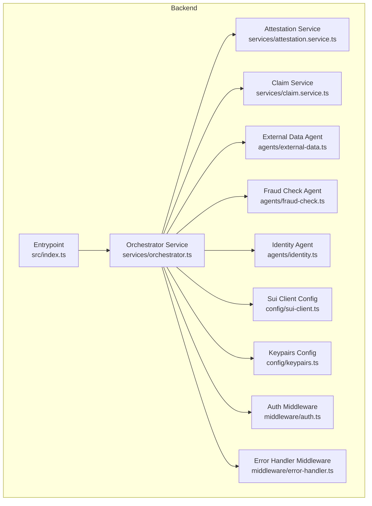

**Diagram sources**
- [orchestrator.ts](file://backend/src/services/orchestrator.ts)
- [attestation.service.ts](file://backend/src/services/attestation.service.ts)
- [claim.service.ts](file://backend/src/services/claim.service.ts)
- [external-data.ts](file://backend/src/agents/external-data.ts)
- [fraud-check.ts](file://backend/src/agents/fraud-check.ts)
- [identity.ts](file://backend/src/agents/identity.ts)
- [sui-client.ts](file://backend/src/config/sui-client.ts)
- [keypairs.ts](file://backend/src/config/keypairs.ts)
- [index.ts](file://backend/src/index.ts)
- [auth.ts](file://backend/src/middleware/auth.ts)
- [error-handler.ts](file://backend/src/middleware/error-handler.ts)

**Section sources**
- [index.ts](file://backend/src/index.ts)
- [orchestrator.ts](file://backend/src/services/orchestrator.ts)

## Core Components
- Orchestrator Service: Defines workflow templates, schedules tasks, tracks state, and coordinates calls to other services and agents.
- Attestation Service: Validates and verifies attestations, interacts with attestation contracts, and returns verification results.
- Claim Service: Manages claim creation, validation, status transitions, and settlement coordination.
- External Agents: Provide specialized capabilities like identity verification, fraud scoring, and fetching external data.
- Sui Client Configuration: Provides connection settings and keypair management for blockchain interactions.
- Middleware: Authentication and centralized error handling for consistent request/response behavior.

Key responsibilities:
- Workflow definition and versioning
- Task scheduling and dependency resolution
- Event emission and subscription for progress tracking
- Error propagation and retry policies
- Integration with blockchain contracts for immutability and settlement

**Section sources**
- [orchestrator.ts](file://backend/src/services/orchestrator.ts)
- [attestation.service.ts](file://backend/src/services/attestation.service.ts)
- [claim.service.ts](file://backend/src/services/claim.service.ts)
- [external-data.ts](file://backend/src/agents/external-data.ts)
- [fraud-check.ts](file://backend/src/agents/fraud-check.ts)
- [identity.ts](file://backend/src/agents/identity.ts)
- [sui-client.ts](file://backend/src/config/sui-client.ts)
- [keypairs.ts](file://backend/src/config/keypairs.ts)
- [auth.ts](file://backend/src/middleware/auth.ts)
- [error-handler.ts](file://backend/src/middleware/error-handler.ts)

## Architecture Overview
The Orchestrator follows an event-driven architecture where workflows are defined as directed acyclic graphs (DAGs). Each node represents a task; edges encode dependencies. Tasks emit events upon completion or failure, which drive subsequent steps. Blockchain interactions are performed via the Sui client using configured keypairs.

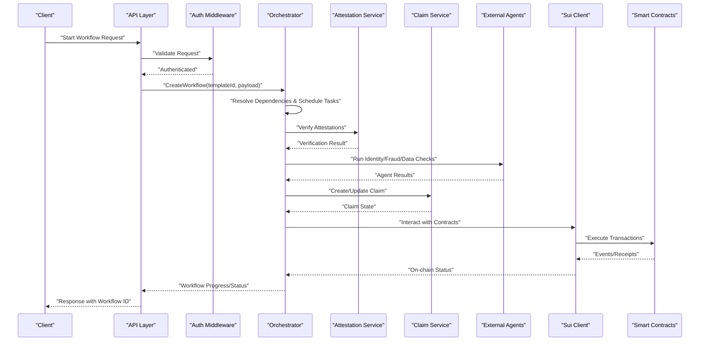

**Diagram sources**
- [orchestrator.ts](file://backend/src/services/orchestrator.ts)
- [attestation.service.ts](file://backend/src/services/attestation.service.ts)
- [claim.service.ts](file://backend/src/services/claim.service.ts)
- [external-data.ts](file://backend/src/agents/external-data.ts)
- [fraud-check.ts](file://backend/src/agents/fraud-check.ts)
- [identity.ts](file://backend/src/agents/identity.ts)
- [sui-client.ts](file://backend/src/config/sui-client.ts)
- [keypairs.ts](file://backend/src/config/keypairs.ts)

## Detailed Component Analysis

### Orchestrator Service
Responsibilities:
- Define and register workflow templates with tasks and dependencies
- Start workflows from templates and payloads
- Schedule tasks based on dependency resolution
- Track workflow state and emit progress events
- Propagate errors and implement retry/backoff strategies
- Coordinate multi-step processes across services and agents

Key methods and flows:
- CreateWorkflow: validates template, initializes state, schedules initial tasks
- ExecuteTask: runs a task, handles success/failure, emits events
- ResolveDependencies: computes next tasks based on completed nodes
- MonitorWorkflow: returns current state and history
- HandleFailure: applies retry policy, escalates if needed

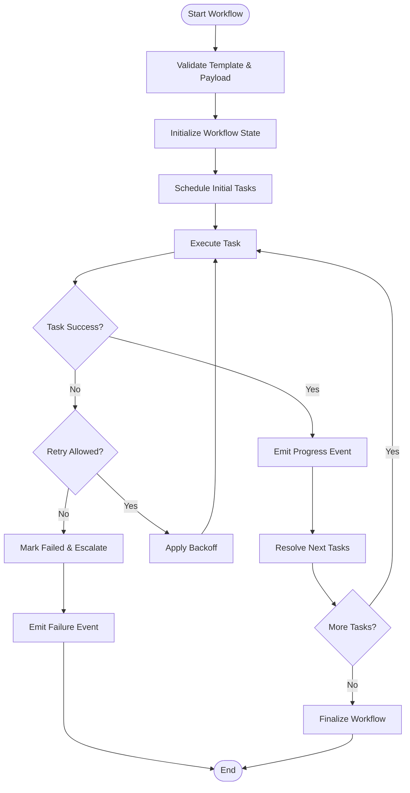

**Diagram sources**
- [orchestrator.ts](file://backend/src/services/orchestrator.ts)

**Section sources**
- [orchestrator.ts](file://backend/src/services/orchestrator.ts)

### Attestation Service
Responsibilities:
- Verify attestations against on-chain records
- Validate auditor signatures and subject bindings
- Return structured verification results for orchestrator consumption

Integration points:
- Called by orchestrator during verification stages
- Interacts with attestation contracts via Sui client
- Emits verification events for auditability

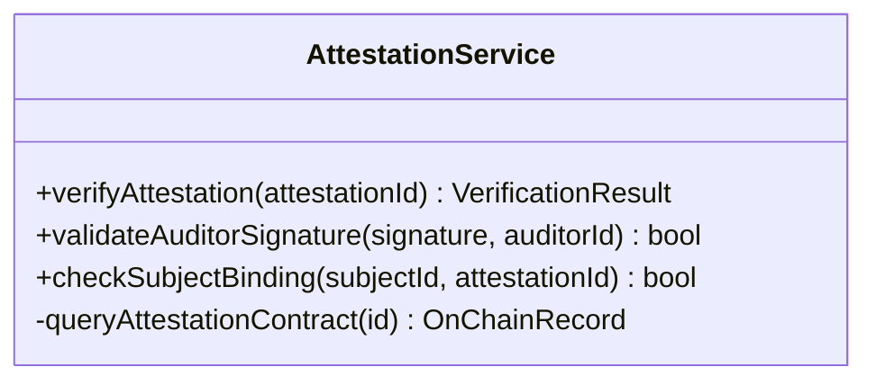

**Diagram sources**
- [attestation.service.ts](file://backend/src/services/attestation.service.ts)
- [attestations.move](file://contracts/attestations/packages/attestations/sources/attestations.move)

**Section sources**
- [attestation.service.ts](file://backend/src/services/attestation.service.ts)
- [attestations.move](file://contracts/attestations/packages/attestations/sources/attestations.move)

### Claim Service
Responsibilities:
- Manage claim lifecycle: creation, validation, review, approval, settlement
- Maintain claim state and history
- Coordinate with orchestrator for workflow-driven transitions

Integration points:
- Receives updates from orchestrator after verification and agent checks
- Persists claim state and emits claim events

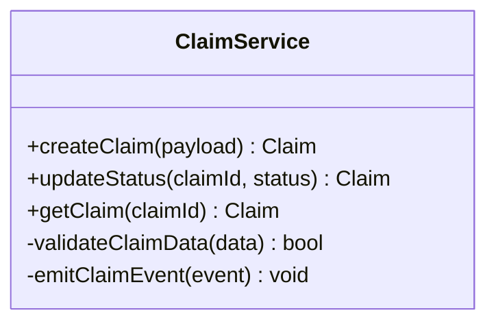

**Diagram sources**
- [claim.service.ts](file://backend/src/services/claim.service.ts)
- [claim.move](file://contracts/insurix-settlement/sources/claim.move)

**Section sources**
- [claim.service.ts](file://backend/src/services/claim.service.ts)
- [claim.move](file://contracts/insurix-settlement/sources/claim.move)

### External Agents
Responsibilities:
- Identity verification: confirm user identity and KYC status
- Fraud detection: analyze risk signals and produce scores
- External data retrieval: fetch required data from third-party sources

Integration points:
- Invoked by orchestrator as part of verification pipeline
- Return standardized results consumed by downstream tasks

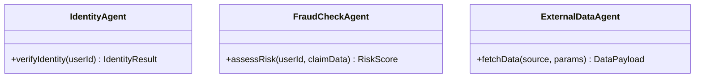

**Diagram sources**
- [identity.ts](file://backend/src/agents/identity.ts)
- [fraud-check.ts](file://backend/src/agents/fraud-check.ts)
- [external-data.ts](file://backend/src/agents/external-data.ts)

**Section sources**
- [identity.ts](file://backend/src/agents/identity.ts)
- [fraud-check.ts](file://backend/src/agents/fraud-check.ts)
- [external-data.ts](file://backend/src/agents/external-data.ts)

### Blockchain Integration
Responsibilities:
- Interact with Sui smart contracts for attestations and settlements
- Use configured keypairs to sign transactions
- Parse on-chain events to update workflow state

Integration points:
- Orchestrator calls Sui client to execute contract functions
- Claims and settlements are recorded on-chain for immutability

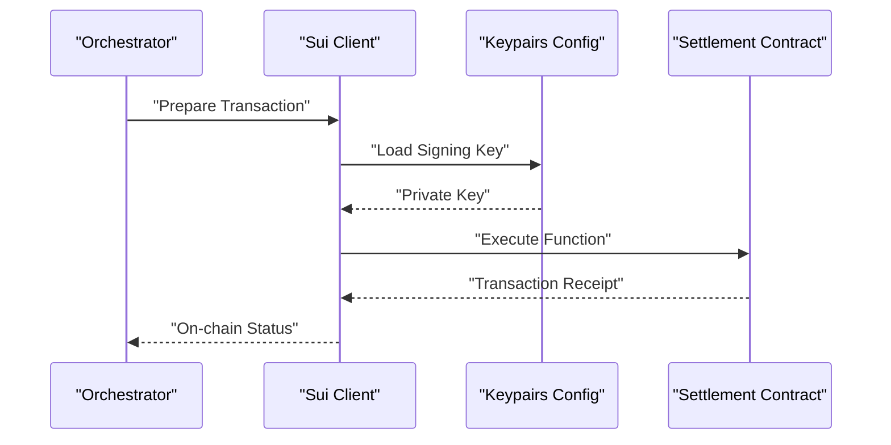

**Diagram sources**
- [sui-client.ts](file://backend/src/config/sui-client.ts)
- [keypairs.ts](file://backend/src/config/keypairs.ts)
- [settlement.move](file://contracts/insurix-settlement/sources/settlement.move)
- [escrow.move](file://contracts/insurix-settlement/sources/escrow.move)
- [events.move](file://contracts/insurix-settlement/sources/events.move)

**Section sources**
- [sui-client.ts](file://backend/src/config/sui-client.ts)
- [keypairs.ts](file://backend/src/config/keypairs.ts)
- [settlement.move](file://contracts/insurix-settlement/sources/settlement.move)
- [escrow.move](file://contracts/insurix-settlement/sources/escrow.move)
- [events.move](file://contracts/insurix-settlement/sources/events.move)

### Middleware
Responsibilities:
- Authentication: validate requests and enforce access control
- Error handling: centralize error responses and logging

Integration points:
- Applied to API routes before reaching orchestrator handlers
- Ensures consistent security posture and error semantics

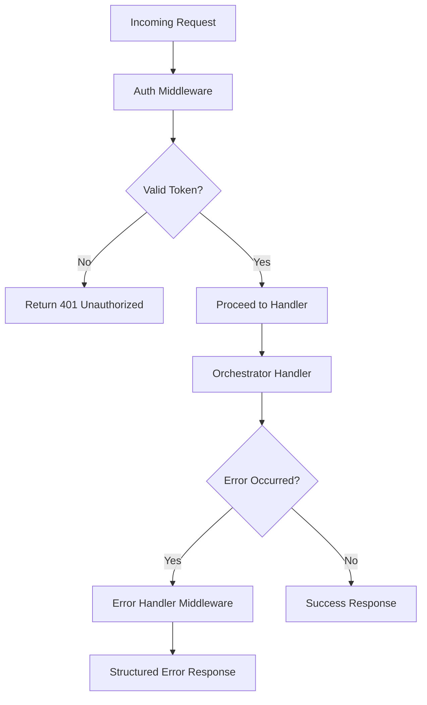

**Diagram sources**
- [auth.ts](file://backend/src/middleware/auth.ts)
- [error-handler.ts](file://backend/src/middleware/error-handler.ts)

**Section sources**
- [auth.ts](file://backend/src/middleware/auth.ts)
- [error-handler.ts](file://backend/src/middleware/error-handler.ts)

## Dependency Analysis
The Orchestrator depends on multiple services and agents, forming a cohesive system with clear separation of concerns.

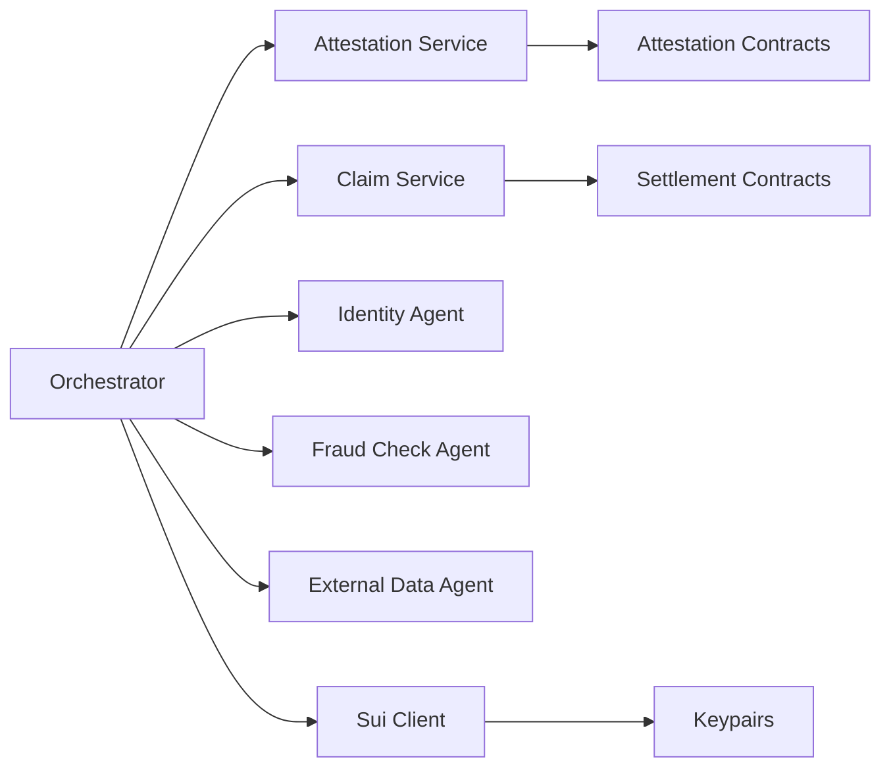

**Diagram sources**
- [orchestrator.ts](file://backend/src/services/orchestrator.ts)
- [attestation.service.ts](file://backend/src/services/attestation.service.ts)
- [claim.service.ts](file://backend/src/services/claim.service.ts)
- [external-data.ts](file://backend/src/agents/external-data.ts)
- [fraud-check.ts](file://backend/src/agents/fraud-check.ts)
- [identity.ts](file://backend/src/agents/identity.ts)
- [sui-client.ts](file://backend/src/config/sui-client.ts)
- [keypairs.ts](file://backend/src/config/keypairs.ts)
- [attestations.move](file://contracts/attestations/packages/attestations/sources/attestations.move)
- [claim.move](file://contracts/insurix-settlement/sources/claim.move)
- [settlement.move](file://contracts/insurix-settlement/sources/settlement.move)

**Section sources**
- [orchestrator.ts](file://backend/src/services/orchestrator.ts)
- [attestation.service.ts](file://backend/src/services/attestation.service.ts)
- [claim.service.ts](file://backend/src/services/claim.service.ts)
- [external-data.ts](file://backend/src/agents/external-data.ts)
- [fraud-check.ts](file://backend/src/agents/fraud-check.ts)
- [identity.ts](file://backend/src/agents/identity.ts)
- [sui-client.ts](file://backend/src/config/sui-client.ts)
- [keypairs.ts](file://backend/src/config/keypairs.ts)
- [attestations.move](file://contracts/attestations/packages/attestations/sources/attestations.move)
- [claim.move](file://contracts/insurix-settlement/sources/claim.move)
- [settlement.move](file://contracts/insurix-settlement/sources/settlement.move)

## Performance Considerations
- Parallel execution: Independent tasks should be executed concurrently to reduce latency
- Caching: Cache frequently accessed attestations and external data to minimize redundant calls
- Backpressure: Implement rate limiting and queueing to handle bursts of workflow requests
- Event batching: Batch event emissions to reduce overhead during high-throughput scenarios
- Database indexing: Ensure claim and workflow states are indexed for fast queries
- Retry policies: Use exponential backoff with jitter to avoid thundering herd problems

[No sources needed since this section provides general guidance]

## Troubleshooting Guide
Common issues and resolutions:
- Authentication failures: Verify token validity and middleware configuration
- Task timeouts: Increase timeouts or optimize slow external calls
- Blockchain errors: Check network connectivity, gas limits, and contract state
- Dependency cycles: Validate workflow DAG definitions to prevent deadlocks
- Error propagation: Ensure errors are captured and logged with context

Diagnostic steps:
- Inspect workflow state and task history
- Review emitted events for anomalies
- Check Sui client logs and transaction receipts
- Validate input payloads against schema requirements

**Section sources**
- [error-handler.ts](file://backend/src/middleware/error-handler.ts)
- [orchestrator.ts](file://backend/src/services/orchestrator.ts)

## Conclusion
The Orchestrator Service serves as the central coordinator for Insurix’s complex business workflows. By leveraging an event-driven architecture, it effectively manages dependencies, schedules tasks, and integrates with external services and blockchain contracts. Its design promotes scalability, reliability, and maintainability while providing clear interfaces for starting, monitoring, and controlling workflows. Proper error handling, performance optimizations, and robust integration patterns ensure smooth operation across diverse use cases such as claim processing, attestation verification, and settlement automation.

[No sources needed since this section summarizes without analyzing specific files]

## Appendices

### Example Workflows

#### Claim Processing Pipeline
Steps:
- Receive claim submission
- Validate identity and perform fraud checks
- Verify supporting attestations
- Update claim status and initiate settlement if approved
- Record final outcome on-chain

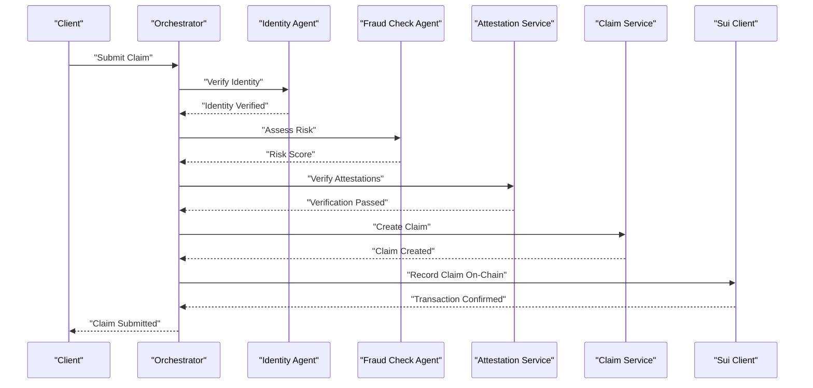

**Diagram sources**
- [orchestrator.ts](file://backend/src/services/orchestrator.ts)
- [identity.ts](file://backend/src/agents/identity.ts)
- [fraud-check.ts](file://backend/src/agents/fraud-check.ts)
- [attestation.service.ts](file://backend/src/services/attestation.service.ts)
- [claim.service.ts](file://backend/src/services/claim.service.ts)
- [sui-client.ts](file://backend/src/config/sui-client.ts)

#### Attestation Verification Chain
Steps:
- Submit attestation for verification
- Validate auditor signature and subject binding
- Query on-chain attestation records
- Return verification result to caller

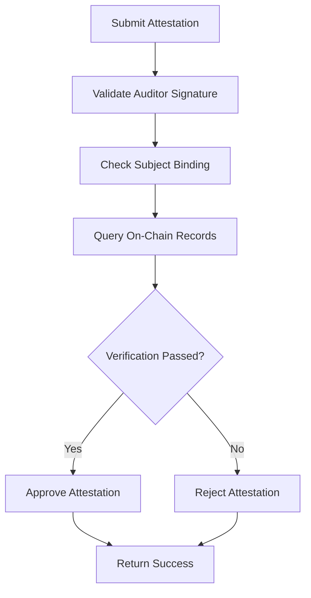

**Diagram sources**
- [attestation.service.ts](file://backend/src/services/attestation.service.ts)
- [attestations.move](file://contracts/attestations/packages/attestations/sources/attestations.move)

#### Settlement Automation Sequence
Steps:
- Trigger settlement based on claim approval
- Transfer funds via escrow contract
- Emit settlement events
- Update claim status to settled

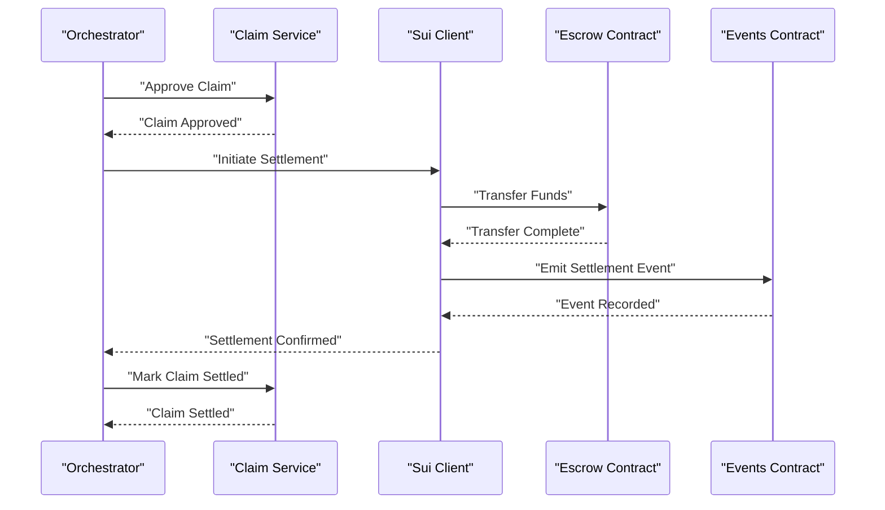

**Diagram sources**
- [orchestrator.ts](file://backend/src/services/orchestrator.ts)
- [claim.service.ts](file://backend/src/services/claim.service.ts)
- [sui-client.ts](file://backend/src/config/sui-client.ts)
- [escrow.move](file://contracts/insurix-settlement/sources/escrow.move)
- [events.move](file://contracts/insurix-settlement/sources/events.move)
- [settlement.move](file://contracts/insurix-settlement/sources/settlement.move)