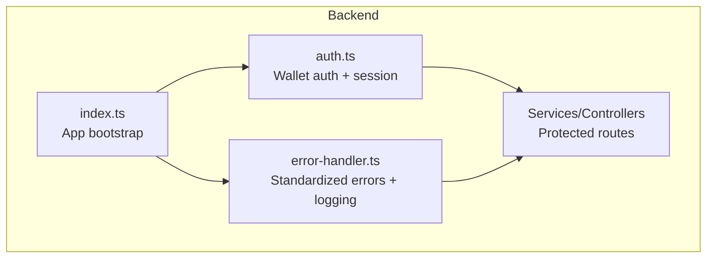
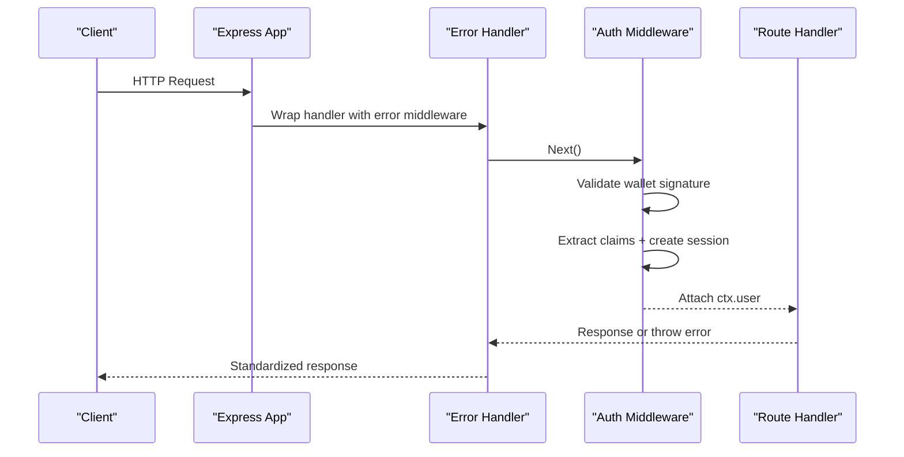
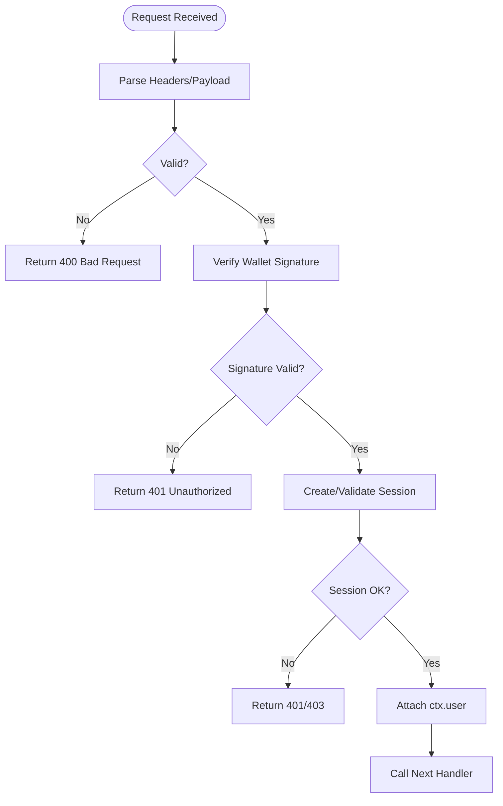
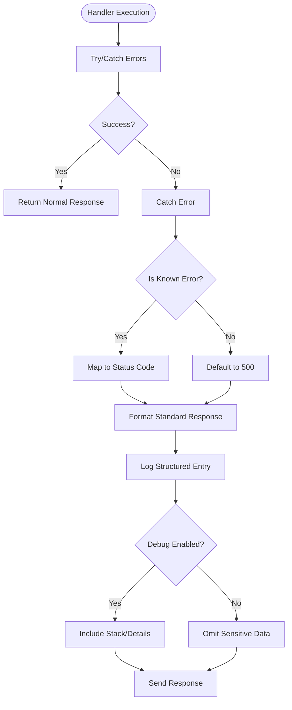
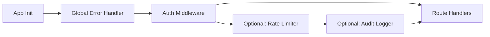
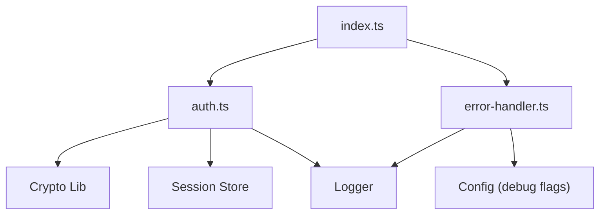

# Middleware Layer

<cite>
**Referenced Files in This Document**
- [backend/src/middleware/auth.ts](file://backend/src/middleware/auth.ts)
- [backend/src/middleware/error-handler.ts](file://backend/src/middleware/error-handler.ts)
- [backend/src/index.ts](file://backend/src/index.ts)
</cite>

## Table of Contents
1. [Introduction](#introduction)
2. [Project Structure](#project-structure)
3. [Core Components](#core-components)
4. [Architecture Overview](#architecture-overview)
5. [Detailed Component Analysis](#detailed-component-analysis)
6. [Dependency Analysis](#dependency-analysis)
7. [Performance Considerations](#performance-considerations)
8. [Troubleshooting Guide](#troubleshooting-guide)
9. [Conclusion](#conclusion)
10. [Appendices](#appendices)

## Introduction
This document explains the middleware layer implementation in the Insurix backend, focusing on:
- Authentication middleware for wallet-based authentication and session management
- Request validation patterns within the auth flow
- Error handling middleware that standardizes error responses, logging, and debugging
- Middleware composition patterns used to assemble request pipelines
- Guidance for creating custom middleware (request/response transformation, rate limiting, audit logging)
- Configuration examples and troubleshooting common authentication issues

The goal is to provide both a conceptual overview and code-level insights so that developers can extend and maintain the middleware layer confidently.

## Project Structure
The middleware layer resides under backend/src/middleware with two primary modules:
- Authentication middleware
- Error handling middleware

These are composed at the application entry point to form the HTTP request pipeline.

**Diagram sources**
- [backend/src/index.ts](file://backend/src/index.ts)
- [backend/src/middleware/auth.ts](file://backend/src/middleware/auth.ts)
- [backend/src/middleware/error-handler.ts](file://backend/src/middleware/error-handler.ts)

**Section sources**
- [backend/src/index.ts](file://backend/src/index.ts)
- [backend/src/middleware/auth.ts](file://backend/src/middleware/auth.ts)
- [backend/src/middleware/error-handler.ts](file://backend/src/middleware/error-handler.ts)

## Core Components
- Authentication middleware: Validates wallet signatures, extracts identity claims, and manages user sessions. It enforces request validation rules relevant to authentication and attaches authenticated context to requests.
- Error handling middleware: Centralizes error formatting, logging, and optional debug payloads. It ensures consistent HTTP status codes and safe error messages for clients while preserving detailed logs for operators.

Key responsibilities:
- Consistent error responses across all endpoints
- Secure handling of sensitive data in logs
- Clear separation between public and protected routes
- Extensibility for additional middleware (rate limiting, audit logging, request/response transforms)

**Section sources**
- [backend/src/middleware/auth.ts](file://backend/src/middleware/auth.ts)
- [backend/src/middleware/error-handler.ts](file://backend/src/middleware/error-handler.ts)

## Architecture Overview
The middleware pipeline composes error handling globally and applies authentication selectively to protected routes. Requests flow through error handling first, then authentication, then route handlers. Responses follow the reverse path, allowing centralized error formatting and logging.

**Diagram sources**
- [backend/src/index.ts](file://backend/src/index.ts)
- [backend/src/middleware/auth.ts](file://backend/src/middleware/auth.ts)
- [backend/src/middleware/error-handler.ts](file://backend/src/middleware/error-handler.ts)

## Detailed Component Analysis

### Authentication Middleware
Responsibilities:
- Wallet-based authentication: Verifies cryptographic signatures from client wallets against expected identities or policies.
- Request validation: Ensures required headers, payloads, and parameters are present and well-formed before processing.
- Session management: Creates or validates sessions tied to authenticated wallet identities; persists session state securely.
- Context injection: Attaches authenticated user information to the request context for downstream handlers.

Typical flow:
- Parse and validate incoming request metadata
- Verify wallet signature and resolve identity claims
- Create or refresh session tokens/state
- Enforce access policies based on roles or scopes
- Proceed to route handler with enriched context

Security considerations:
- Reject malformed or tampered signatures early
- Limit session lifetime and enforce secure storage
- Avoid logging secrets or raw payloads
- Use strict CORS and CSRF protections where applicable

**Diagram sources**
- [backend/src/middleware/auth.ts](file://backend/src/middleware/auth.ts)

**Section sources**
- [backend/src/middleware/auth.ts](file://backend/src/middleware/auth.ts)

### Error Handling Middleware
Responsibilities:
- Centralized error formatting: Converts internal errors into standardized JSON responses with appropriate HTTP status codes.
- Logging: Records structured logs including request IDs, timestamps, and sanitized details.
- Debug mode: Optionally includes stack traces or extra diagnostics when enabled by configuration.
- Graceful degradation: Prevents crashes from leaking sensitive information and ensures consistent client behavior.

Common patterns:
- Global error wrapper around route handlers
- Custom error classes with typed payloads
- Safe serialization of error objects
- Correlation IDs for tracing across services

**Diagram sources**
- [backend/src/middleware/error-handler.ts](file://backend/src/middleware/error-handler.ts)

**Section sources**
- [backend/src/middleware/error-handler.ts](file://backend/src/middleware/error-handler.ts)

### Middleware Composition Patterns
Composition strategy:
- Global error handling middleware applied once at app initialization
- Authentication middleware applied per-route or grouped via route prefixes
- Optional chaining for future middleware (rate limiting, audit logging, request/response transforms)

Recommended pattern:
- Define a middleware factory for reusable logic
- Compose middlewares using a pipeline function or framework-native composition
- Keep concerns separated: auth, validation, logging, metrics, rate limiting

[No sources needed since this diagram shows conceptual workflow, not actual code structure]

## Dependency Analysis
The middleware modules depend on:
- HTTP server framework primitives (e.g., request/response objects)
- Cryptographic libraries for wallet signature verification
- Session storage backends (in-memory, Redis, or database-backed)
- Logging infrastructure (structured logger)

Coupling and cohesion:
- High cohesion within each middleware module
- Low coupling between auth and error handling
- Clear boundaries for adding new middleware without modifying existing ones

Potential circular dependencies:
- Avoid importing route handlers inside middleware
- Keep shared types in separate modules if reused

External integrations:
- Wallet providers and identity resolvers
- Session stores and caches
- Logging sinks (console, file, external log aggregation)

**Diagram sources**
- [backend/src/middleware/auth.ts](file://backend/src/middleware/auth.ts)
- [backend/src/middleware/error-handler.ts](file://backend/src/middleware/error-handler.ts)
- [backend/src/index.ts](file://backend/src/index.ts)

**Section sources**
- [backend/src/middleware/auth.ts](file://backend/src/middleware/auth.ts)
- [backend/src/middleware/error-handler.ts](file://backend/src/middleware/error-handler.ts)
- [backend/src/index.ts](file://backend/src/index.ts)

## Performance Considerations
- Minimize synchronous operations in middleware to avoid blocking the event loop
- Cache identity resolution results where safe and compliant
- Use connection pooling for session stores and databases
- Avoid heavy payload parsing unless necessary; stream large bodies when possible
- Enable compression and efficient JSON serialization
- Profile hot paths with load testing and adjust timeouts accordingly

[No sources needed since this section provides general guidance]

## Troubleshooting Guide
Common authentication issues:
- Invalid or expired wallet signatures: Ensure correct algorithm and key derivation; verify timestamp and nonce handling
- Missing or malformed headers: Validate Content-Type, Authorization, and required fields
- Session failures: Check store connectivity, TTL settings, and cookie/domain configurations
- CORS and CSRF errors: Confirm allowed origins and methods; ensure proper preflight handling

Diagnostic steps:
- Enable debug mode temporarily to capture detailed logs
- Inspect correlation IDs in logs to trace request lifecycle
- Validate environment variables and secrets
- Test with known-good wallet signatures and payloads

Logging best practices:
- Redact secrets and personal data
- Include request ID, method, path, and user context when available
- Separate info/warn/error levels appropriately

**Section sources**
- [backend/src/middleware/auth.ts](file://backend/src/middleware/auth.ts)
- [backend/src/middleware/error-handler.ts](file://backend/src/middleware/error-handler.ts)

## Conclusion
The Insurix backend middleware layer provides robust wallet-based authentication, standardized error handling, and a clear composition model for extending functionality. By following the patterns outlined here—secure signature verification, structured logging, and modular middleware—you can safely add features like rate limiting and audit logging while maintaining security and performance.

[No sources needed since this section summarizes without analyzing specific files]

## Appendices

### Creating Custom Middleware
Guidelines:
- Request/response transformation: Parse, normalize, or enrich payloads; attach computed fields to context
- Rate limiting: Track request counts per IP or user; return 429 with retry-after headers
- Audit logging: Record sensitive actions with correlation IDs and minimal PII

Example composition:
- Apply global error handler
- Add auth middleware to protected routes
- Insert rate limiter before business logic
- Append audit logger after successful operations

Configuration tips:
- Use environment-specific settings for debug and logging verbosity
- Centralize middleware options in a config module
- Provide defaults and allow overrides per route group

[No sources needed since this section provides general guidance]