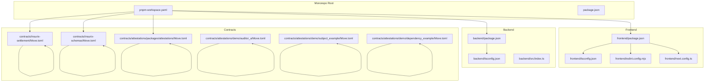
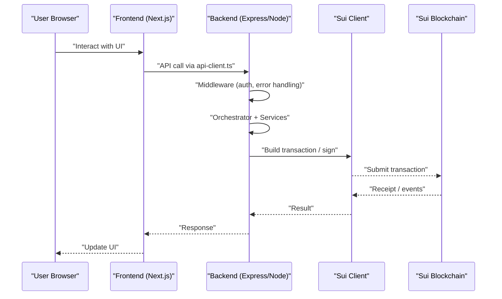
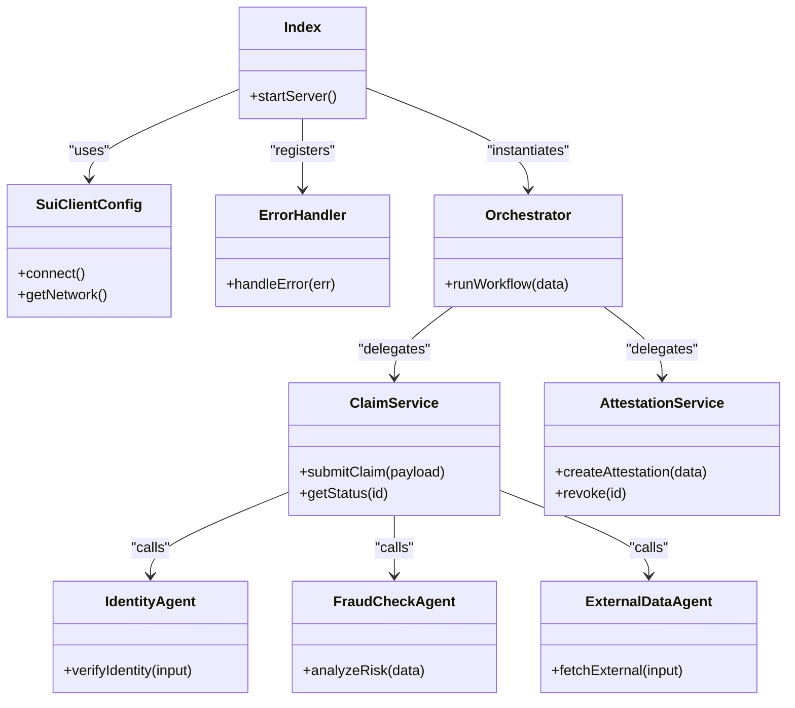
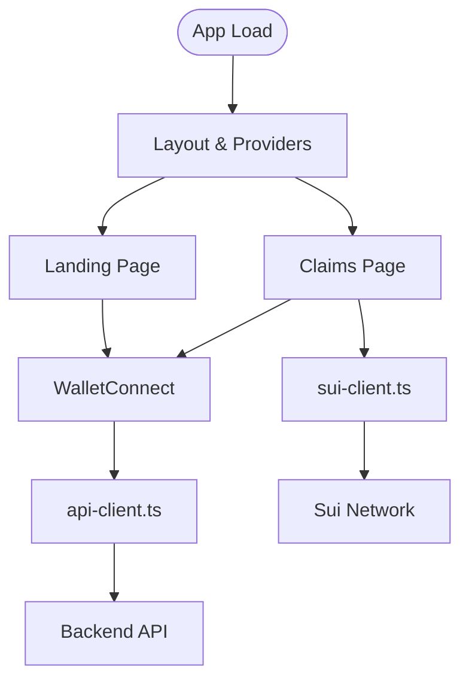
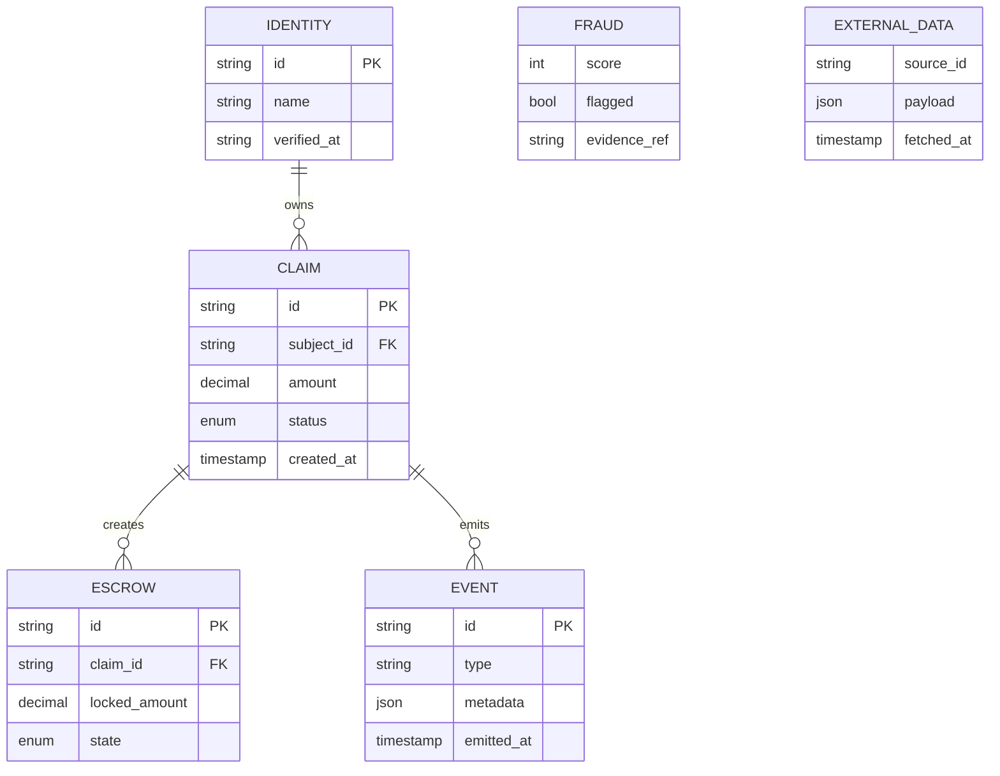
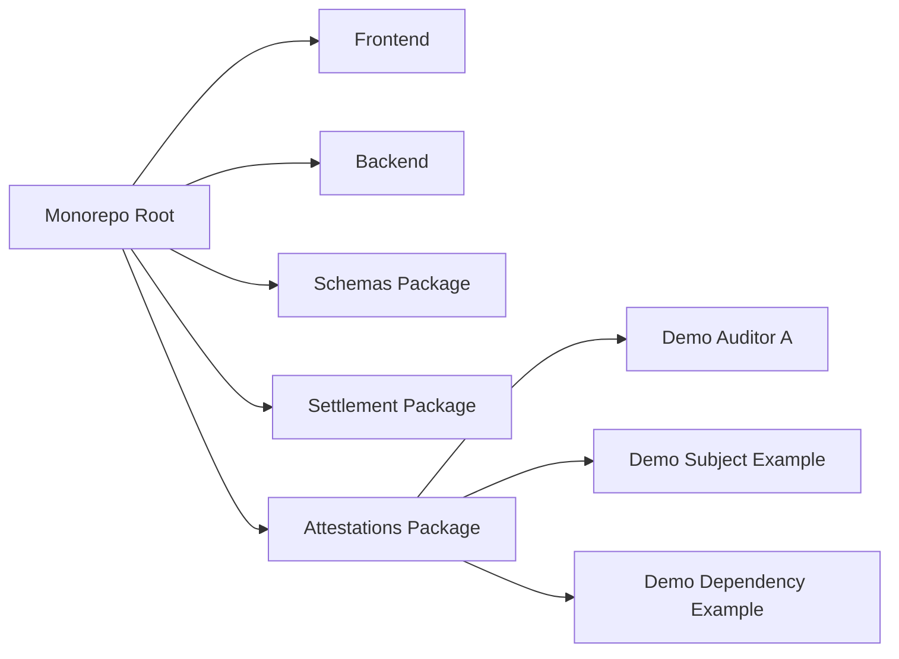

# Contributing Guide

<cite>
**Referenced Files in This Document**
- [package.json](file://package.json)
- [pnpm-workspace.yaml](file://pnpm-workspace.yaml)
- [backend/package.json](file://backend/package.json)
- [backend/tsconfig.json](file://backend/tsconfig.json)
- [frontend/package.json](file://frontend/package.json)
- [frontend/tsconfig.json](file://frontend/tsconfig.json)
- [frontend/eslint.config.mjs](file://frontend/eslint.config.mjs)
- [contracts/insurix-schemas/Move.toml](file://contracts/insurix-schemas/Move.toml)
- [contracts/insurix-settlement/Move.toml](file://contracts/insurix-settlement/Move.toml)
- [contracts/attestations/packages/attestations/Move.toml](file://contracts/attestations/packages/attestations/Move.toml)
- [contracts/attestations/demo/auditor_a/Move.toml](file://contracts/attestations/demo/auditor_a/Move.toml)
- [contracts/attestations/demo/subject_example/Move.toml](file://contracts/attestations/demo/subject_example/Move.toml)
- [contracts/attestations/demo/dependency_example/Move.toml](file://contracts/attestations/demo/dependency_example/Move.toml)
- [contracts/attestations/demo/scripts/run-demo.sh](file://contracts/attestations/demo/scripts/run-demo.sh)
- [contracts/attestations/demo/scripts/test-publish.sh](file://contracts/attestations/demo/scripts/test-publish.sh)
- [contracts/attestations/demo/scripts/localnets.py](file://contracts/attestations/demo/scripts/localnets.py)
- [contracts/attestations/demo/scripts/demo-up.sh](file://contracts/attestations/demo/scripts/demo-up.sh)
- [contracts/attestations/demo/scripts/demo-down.sh](file://contracts/attestations/demo/scripts/demo-down.sh)
- [contracts/attestations/demo/scripts/demo.sh](file://contracts/attestations/demo/scripts/demo.sh)
- [contracts/attestations/CONVENTIONS.md](file://contracts/attestations/CONVENTIONS.md)
- [contracts/attestations/DESIGN.md](file://contracts/attestations/DESIGN.md)
- [contracts/attestations/README.md](file://contracts/attestations/README.md)
- [contracts/attestations/AGENTS.md](file://contracts/attestations/AGENTS.md)
- [contracts/attestations/CLAUDE.md](file://contracts/attestations/CLAUDE.md)
- [contracts/attestations/examples/auditor/Move.toml](file://contracts/attestations/examples/auditor/Move.toml)
- [contracts/insurix-schemas/sources/lib.move](file://contracts/insurix-schemas/sources/lib.move)
- [contracts/insurix-schemas/sources/identity.move](file://contracts/insurix-schemas/sources/identity.move)
- [contracts/insurix-schemas/sources/fraud.move](file://contracts/insurix-schemas/sources/fraud.move)
- [contracts/insurix-schemas/sources/external_data.move](file://contracts/insurix-schemas/sources/external_data.move)
- [contracts/insurix-settlement/sources/settlement.move](file://contracts/insurix-settlement/sources/settlement.move)
- [contracts/insurix-settlement/sources/claim.move](file://contracts/insurix-settlement/sources/claim.move)
- [contracts/insurix-settlement/sources/escrow.move](file://contracts/insurix-settlement/sources/escrow.move)
- [contracts/insurix-settlement/sources/events.move](file://contracts/insurix-settlement/sources/events.move)
- [backend/src/index.ts](file://backend/src/index.ts)
- [backend/src/config/sui-client.ts](file://backend/src/config/sui-client.ts)
- [backend/src/middleware/error-handler.ts](file://backend/src/middleware/error-handler.ts)
- [backend/src/services/orchestrator.ts](file://backend/src/services/orchestrator.ts)
- [backend/src/services/claim.service.ts](file://backend/src/services/claim.service.ts)
- [backend/src/services/attestation.service.ts](file://backend/src/services/attestation.service.ts)
- [backend/src/agents/identity.ts](file://backend/src/agents/identity.ts)
- [backend/src/agents/fraud-check.ts](file://backend/src/agents/fraud-check.ts)
- [backend/src/agents/external-data.ts](file://backend/src/agents/external-data.ts)
- [frontend/src/lib/api-client.ts](file://frontend/src/lib/api-client.ts)
- [frontend/src/lib/sui-client.ts](file://frontend/src/lib/sui-client.ts)
- [frontend/src/app/layout.tsx](file://frontend/src/app/layout.tsx)
- [frontend/src/app/(landing)/layout.tsx](file://frontend/src/app/(landing)/layout.tsx)
- [frontend/src/app/(landing)/page.tsx](file://frontend/src/app/(landing)/page.tsx)
- [frontend/src/components/WalletConnect.tsx](file://frontend/src/components/WalletConnect.tsx)
- [frontend/next.config.ts](file://frontend/next.config.ts)
- [frontend/postcss.config.mjs](file://frontend/postcss.config.mjs)
- [frontend/.gitignore](file://frontend/.gitignore)
- [frontend/AGENTS.md](file://frontend/AGENTS.md)
- [frontend/CLAUDE.md](file://frontend/CLAUDE.md)
- [frontend/README.md](file://frontend/README.md)
- [docs/design/insurix-ai-workflow.md](file://docs/design/insurix-ai-workflow.md)
- [docs/implementation/backlog.md](file://docs/implementation/backlog.md)
</cite>

## Table of Contents
1. [Introduction](#introduction)
2. [Project Structure](#project-structure)
3. [Core Components](#core-components)
4. [Architecture Overview](#architecture-overview)
5. [Detailed Component Analysis](#detailed-component-analysis)
6. [Dependency Analysis](#dependency-analysis)
7. [Performance Considerations](#performance-considerations)
8. [Troubleshooting Guide](#troubleshooting-guide)
9. [Conclusion](#conclusion)
10. [Appendices](#appendices)

## Introduction
This Contributing Guide explains how to set up the Insurix development environment, work across the monorepo, follow code style and linting rules for TypeScript and Move, run tests and demos, submit changes via pull requests, and participate in reviews and releases. It also covers community guidelines and communication channels.

## Project Structure
Insurix is a multi-package monorepo managed with pnpm workspaces:
- backend: TypeScript server (Next-compatible API surface), Sui client configuration, middleware, services, and agents
- frontend: Next.js application with React components, routing, and wallet integration
- contracts: Move packages for schemas, settlement logic, and attestations (including demo modules and scripts)
- docs: Design and implementation documentation

**Diagram sources**
- [pnpm-workspace.yaml](file://pnpm-workspace.yaml)
- [package.json](file://package.json)
- [frontend/package.json](file://frontend/package.json)
- [frontend/tsconfig.json](file://frontend/tsconfig.json)
- [frontend/eslint.config.mjs](file://frontend/eslint.config.mjs)
- [frontend/next.config.ts](file://frontend/next.config.ts)
- [backend/package.json](file://backend/package.json)
- [backend/tsconfig.json](file://backend/tsconfig.json)
- [contracts/insurix-settlement/Move.toml](file://contracts/insurix-settlement/Move.toml)
- [contracts/insurix-schemas/Move.toml](file://contracts/insurix-schemas/Move.toml)
- [contracts/attestations/packages/attestations/Move.toml](file://contracts/attestations/packages/attestations/Move.toml)
- [contracts/attestations/demo/auditor_a/Move.toml](file://contracts/attestations/demo/auditor_a/Move.toml)
- [contracts/attestations/demo/subject_example/Move.toml](file://contracts/attestations/demo/subject_example/Move.toml)
- [contracts/attestations/demo/dependency_example/Move.toml](file://contracts/attestations/demo/dependency_example/Move.toml)

**Section sources**
- [pnpm-workspace.yaml](file://pnpm-workspace.yaml)
- [package.json](file://package.json)
- [frontend/package.json](file://frontend/package.json)
- [backend/package.json](file://backend/package.json)
- [contracts/insurix-schemas/Move.toml](file://contracts/insurix-schemas/Move.toml)
- [contracts/insurix-settlement/Move.toml](file://contracts/insurix-settlement/Move.toml)
- [contracts/attestations/packages/attestations/Move.toml](file://contracts/attestations/packages/attestations/Move.toml)

## Core Components
- Backend (TypeScript): Entry point, Sui client configuration, error handling middleware, orchestrator service, claim and attestation services, and specialized agents for identity, fraud checks, and external data.
- Frontend (Next.js): App router pages, layout, wallet connection component, API client, and Sui client utilities.
- Contracts (Move): Schemas, settlement logic, events, and attestations package; includes demo modules and scripts for local testing.

Key responsibilities:
- Backend orchestrates business flows and integrates with Sui via configured client and middleware.
- Frontend provides UI, wallet connectivity, and communicates with the backend API.
- Move contracts define on-chain state, claims, escrow, events, and attestation schemas.

**Section sources**
- [backend/src/index.ts](file://backend/src/index.ts)
- [backend/src/config/sui-client.ts](file://backend/src/config/sui-client.ts)
- [backend/src/middleware/error-handler.ts](file://backend/src/middleware/error-handler.ts)
- [backend/src/services/orchestrator.ts](file://backend/src/services/orchestrator.ts)
- [backend/src/services/claim.service.ts](file://backend/src/services/claim.service.ts)
- [backend/src/services/attestation.service.ts](file://backend/src/services/attestation.service.ts)
- [backend/src/agents/identity.ts](file://backend/src/agents/identity.ts)
- [backend/src/agents/fraud-check.ts](file://backend/src/agents/fraud-check.ts)
- [backend/src/agents/external-data.ts](file://backend/src/agents/external-data.ts)
- [frontend/src/lib/api-client.ts](file://frontend/src/lib/api-client.ts)
- [frontend/src/lib/sui-client.ts](file://frontend/src/lib/sui-client.ts)
- [frontend/src/components/WalletConnect.tsx](file://frontend/src/components/WalletConnect.tsx)
- [contracts/insurix-schemas/sources/lib.move](file://contracts/insurix-schemas/sources/lib.move)
- [contracts/insurix-schemas/sources/identity.move](file://contracts/insurix-schemas/sources/identity.move)
- [contracts/insurix-schemas/sources/fraud.move](file://contracts/insurix-schemas/sources/fraud.move)
- [contracts/insurix-schemas/sources/external_data.move](file://contracts/insurix-schemas/sources/external_data.move)
- [contracts/insurix-settlement/sources/settlement.move](file://contracts/insurix-settlement/sources/settlement.move)
- [contracts/insurix-settlement/sources/claim.move](file://contracts/insurix-settlement/sources/claim.move)
- [contracts/insurix-settlement/sources/escrow.move](file://contracts/insurix-settlement/sources/escrow.move)
- [contracts/insurix-settlement/sources/events.move](file://contracts/insurix-settlement/sources/events.move)

## Architecture Overview
High-level flow from user interaction to on-chain execution:

**Diagram sources**
- [frontend/src/lib/api-client.ts](file://frontend/src/lib/api-client.ts)
- [backend/src/index.ts](file://backend/src/index.ts)
- [backend/src/middleware/error-handler.ts](file://backend/src/middleware/error-handler.ts)
- [backend/src/services/orchestrator.ts](file://backend/src/services/orchestrator.ts)
- [backend/src/config/sui-client.ts](file://backend/src/config/sui-client.ts)

## Detailed Component Analysis

### Backend Development
- Entry and configuration: The server entry initializes services and middleware; Sui client configuration centralizes network and keypair settings.
- Middleware: Error handler standardizes responses and logging.
- Services: Orchestrator coordinates claim and attestation workflows; dedicated services encapsulate domain logic.
- Agents: Specialized modules handle identity verification, fraud checks, and external data fetching.

**Diagram sources**
- [backend/src/index.ts](file://backend/src/index.ts)
- [backend/src/config/sui-client.ts](file://backend/src/config/sui-client.ts)
- [backend/src/middleware/error-handler.ts](file://backend/src/middleware/error-handler.ts)
- [backend/src/services/orchestrator.ts](file://backend/src/services/orchestrator.ts)
- [backend/src/services/claim.service.ts](file://backend/src/services/claim.service.ts)
- [backend/src/services/attestation.service.ts](file://backend/src/services/attestation.service.ts)
- [backend/src/agents/identity.ts](file://backend/src/agents/identity.ts)
- [backend/src/agents/fraud-check.ts](file://backend/src/agents/fraud-check.ts)
- [backend/src/agents/external-data.ts](file://backend/src/agents/external-data.ts)

**Section sources**
- [backend/src/index.ts](file://backend/src/index.ts)
- [backend/src/config/sui-client.ts](file://backend/src/config/sui-client.ts)
- [backend/src/middleware/error-handler.ts](file://backend/src/middleware/error-handler.ts)
- [backend/src/services/orchestrator.ts](file://backend/src/services/orchestrator.ts)
- [backend/src/services/claim.service.ts](file://backend/src/services/claim.service.ts)
- [backend/src/services/attestation.service.ts](file://backend/src/services/attestation.service.ts)
- [backend/src/agents/identity.ts](file://backend/src/agents/identity.ts)
- [backend/src/agents/fraud-check.ts](file://backend/src/agents/fraud-check.ts)
- [backend/src/agents/external-data.ts](file://backend/src/agents/external-data.ts)

### Frontend Development
- Routing and layouts: App Router organizes landing and app sections; shared layout defines global styles and providers.
- Wallet integration: WalletConnect component handles connection and signing flows.
- API and Sui clients: Centralized clients abstract HTTP calls and Sui interactions.

**Diagram sources**
- [frontend/src/app/layout.tsx](file://frontend/src/app/layout.tsx)
- [frontend/src/app/(landing)/layout.tsx](file://frontend/src/app/(landing)/layout.tsx)
- [frontend/src/app/(landing)/page.tsx](file://frontend/src/app/(landing)/page.tsx)
- [frontend/src/components/WalletConnect.tsx](file://frontend/src/components/WalletConnect.tsx)
- [frontend/src/lib/api-client.ts](file://frontend/src/lib/api-client.ts)
- [frontend/src/lib/sui-client.ts](file://frontend/src/lib/sui-client.ts)

**Section sources**
- [frontend/src/app/layout.tsx](file://frontend/src/app/layout.tsx)
- [frontend/src/app/(landing)/layout.tsx](file://frontend/src/app/(landing)/layout.tsx)
- [frontend/src/app/(landing)/page.tsx](file://frontend/src/app/(landing)/page.tsx)
- [frontend/src/components/WalletConnect.tsx](file://frontend/src/components/WalletConnect.tsx)
- [frontend/src/lib/api-client.ts](file://frontend/src/lib/api-client.ts)
- [frontend/src/lib/sui-client.ts](file://frontend/src/lib/sui-client.ts)

### Move Contracts Development
- Schemas: Define reusable types for identity, fraud, and external data.
- Settlement: Implements claim lifecycle, escrow management, and event emission.
- Attestations: Package and examples demonstrate auditor/subject patterns and dependencies.

**Diagram sources**
- [contracts/insurix-schemas/sources/identity.move](file://contracts/insurix-schemas/sources/identity.move)
- [contracts/insurix-schemas/sources/fraud.move](file://contracts/insurix-schemas/sources/fraud.move)
- [contracts/insurix-schemas/sources/external_data.move](file://contracts/insurix-schemas/sources/external_data.move)
- [contracts/insurix-settlement/sources/claim.move](file://contracts/insurix-settlement/sources/claim.move)
- [contracts/insurix-settlement/sources/escrow.move](file://contracts/insurix-settlement/sources/escrow.move)
- [contracts/insurix-settlement/sources/events.move](file://contracts/insurix-settlement/sources/events.move)

**Section sources**
- [contracts/insurix-schemas/sources/lib.move](file://contracts/insurix-schemas/sources/lib.move)
- [contracts/insurix-schemas/sources/identity.move](file://contracts/insurix-schemas/sources/identity.move)
- [contracts/insurix-schemas/sources/fraud.move](file://contracts/insurix-schemas/sources/fraud.move)
- [contracts/insurix-schemas/sources/external_data.move](file://contracts/insurix-schemas/sources/external_data.move)
- [contracts/insurix-settlement/sources/settlement.move](file://contracts/insurix-settlement/sources/settlement.move)
- [contracts/insurix-settlement/sources/claim.move](file://contracts/insurix-settlement/sources/claim.move)
- [contracts/insurix-settlement/sources/escrow.move](file://contracts/insurix-settlement/sources/escrow.move)
- [contracts/insurix-settlement/sources/events.move](file://contracts/insurix-settlement/sources/events.move)

## Dependency Analysis
Workspace and package relationships:

**Diagram sources**
- [pnpm-workspace.yaml](file://pnpm-workspace.yaml)
- [frontend/package.json](file://frontend/package.json)
- [backend/package.json](file://backend/package.json)
- [contracts/insurix-schemas/Move.toml](file://contracts/insurix-schemas/Move.toml)
- [contracts/insurix-settlement/Move.toml](file://contracts/insurix-settlement/Move.toml)
- [contracts/attestations/packages/attestations/Move.toml](file://contracts/attestations/packages/attestations/Move.toml)
- [contracts/attestations/demo/auditor_a/Move.toml](file://contracts/attestations/demo/auditor_a/Move.toml)
- [contracts/attestations/demo/subject_example/Move.toml](file://contracts/attestations/demo/subject_example/Move.toml)
- [contracts/attestations/demo/dependency_example/Move.toml](file://contracts/attestations/demo/dependency_example/Move.toml)

**Section sources**
- [pnpm-workspace.yaml](file://pnpm-workspace.yaml)
- [frontend/package.json](file://frontend/package.json)
- [backend/package.json](file://backend/package.json)
- [contracts/insurix-schemas/Move.toml](file://contracts/insurix-schemas/Move.toml)
- [contracts/insurix-settlement/Move.toml](file://contracts/insurix-settlement/Move.toml)
- [contracts/attestations/packages/attestations/Move.toml](file://contracts/attestations/packages/attestations/Move.toml)
- [contracts/attestations/demo/auditor_a/Move.toml](file://contracts/attestations/demo/auditor_a/Move.toml)
- [contracts/attestations/demo/subject_example/Move.toml](file://contracts/attestations/demo/subject_example/Move.toml)
- [contracts/attestations/demo/dependency_example/Move.toml](file://contracts/attestations/demo/dependency_example/Move.toml)

## Performance Considerations
- Backend:
  - Keep Sui client initialization centralized and reuse connections where possible.
  - Use structured logging and avoid heavy synchronous operations in request handlers.
  - Cache external data results when appropriate to reduce latency.
- Frontend:
  - Prefer client-side caching and optimistic updates for better UX.
  - Defer heavy computations off the main thread if needed.
- Contracts:
  - Minimize storage footprint and gas usage by using compact structs and efficient iteration.
  - Emit concise events with essential metadata only.

[No sources needed since this section provides general guidance]

## Troubleshooting Guide
Common issues and resolutions:
- Environment setup:
  - Ensure Node.js and pnpm are installed and compatible with workspace scripts.
  - Verify Sui CLI and localnet availability for contract testing.
- Backend:
  - Check environment variables for Sui client configuration.
  - Inspect error handler logs for stack traces and request context.
- Frontend:
  - Validate Next.js build outputs and ensure API endpoints are reachable.
  - Confirm wallet provider is correctly initialized and connected.
- Contracts:
  - Run Move test suites per package; review failure messages for type mismatches or missing dependencies.
  - Use demo scripts to spin up local environments and validate flows end-to-end.

**Section sources**
- [backend/src/middleware/error-handler.ts](file://backend/src/middleware/error-handler.ts)
- [backend/src/config/sui-client.ts](file://backend/src/config/sui-client.ts)
- [frontend/src/lib/api-client.ts](file://frontend/src/lib/api-client.ts)
- [frontend/src/lib/sui-client.ts](file://frontend/src/lib/sui-client.ts)
- [contracts/attestations/demo/scripts/run-demo.sh](file://contracts/attestations/demo/scripts/run-demo.sh)
- [contracts/attestations/demo/scripts/test-publish.sh](file://contracts/attestations/demo/scripts/test-publish.sh)
- [contracts/attestations/demo/scripts/localnets.py](file://contracts/attestations/demo/scripts/localnets.py)
- [contracts/attestations/demo/scripts/demo-up.sh](file://contracts/attestations/demo/scripts/demo-up.sh)
- [contracts/attestations/demo/scripts/demo-down.sh](file://contracts/attestations/demo/scripts/demo-down.sh)
- [contracts/attestations/demo/scripts/demo.sh](file://contracts/attestations/demo/scripts/demo.sh)

## Conclusion
Follow the monorepo conventions, use the provided tooling for linting and testing, and adhere to the Move conventions and TypeScript standards outlined below. Submit well-scoped changes with clear descriptions, ensure all quality gates pass, and engage reviewers early for complex features.

[No sources needed since this section summarizes without analyzing specific files]

## Appendices

### Development Workflow
- Branch strategy:
  - Use feature branches named feature/<short-description>.
  - For bug fixes, use fix/<short-description>.
  - Keep main stable and deployable at all times.
- Commit conventions:
  - Use conventional commits: feat:, fix:, chore:, docs:, refactor:, test:.
  - Keep messages concise and descriptive; reference issue numbers when applicable.
- Pull request process:
  - Create PR against main with a clear description, affected packages, and testing steps.
  - Request reviews from relevant maintainers.
  - Ensure CI passes and address review feedback promptly.

[No sources needed since this section provides general guidance]

### Code Style Guidelines
- TypeScript (backend and frontend):
  - Follow ESLint rules defined in the frontend configuration; extend similar rules in backend if not already present.
  - Use strict TypeScript settings; prefer explicit types and avoid any.
  - Organize imports consistently; group third-party, internal, and relative imports.
- Move:
  - Adhere to Move conventions documented in the attestations package.
  - Keep modules focused and small; use libraries for shared logic.
  - Write comprehensive tests for critical functions and edge cases.

**Section sources**
- [frontend/eslint.config.mjs](file://frontend/eslint.config.mjs)
- [backend/tsconfig.json](file://backend/tsconfig.json)
- [frontend/tsconfig.json](file://frontend/tsconfig.json)
- [contracts/attestations/CONVENTIONS.md](file://contracts/attestations/CONVENTIONS.md)

### Linting and Formatting Standards
- Frontend:
  - Run ESLint via the configured script; fix reported issues before committing.
  - Use consistent formatting (e.g., Prettier if configured).
- Backend:
  - Apply ESLint and TypeScript compiler checks; ensure no warnings remain.
- Move:
  - Use Move linter and formatter tools as per package instructions.

**Section sources**
- [frontend/eslint.config.mjs](file://frontend/eslint.config.mjs)
- [backend/tsconfig.json](file://backend/tsconfig.json)
- [frontend/tsconfig.json](file://frontend/tsconfig.json)

### Monorepo Usage
- Install dependencies:
  - Use pnpm at the repository root to install workspace dependencies.
- Run commands:
  - Use workspace scripts to run tasks across packages (e.g., build, test, lint).
- Add new packages:
  - Create a new directory with its own package.json or Move.toml; register it in the workspace configuration.

**Section sources**
- [pnpm-workspace.yaml](file://pnpm-workspace.yaml)
- [package.json](file://package.json)
- [frontend/package.json](file://frontend/package.json)
- [backend/package.json](file://backend/package.json)
- [contracts/insurix-schemas/Move.toml](file://contracts/insurix-schemas/Move.toml)
- [contracts/insurix-settlement/Move.toml](file://contracts/insurix-settlement/Move.toml)
- [contracts/attestations/packages/attestations/Move.toml](file://contracts/attestations/packages/attestations/Move.toml)

### Setup Instructions
- Prerequisites:
  - Node.js and pnpm installed.
  - Sui CLI available for contract testing and publishing.
- Backend:
  - Configure Sui client settings and environment variables.
  - Start the server and verify health endpoints.
- Frontend:
  - Install dependencies and start the dev server.
  - Configure wallet provider and API base URL.
- Contracts:
  - Use demo scripts to initialize local networks and run examples.
  - Execute Move tests within each package.

**Section sources**
- [backend/src/config/sui-client.ts](file://backend/src/config/sui-client.ts)
- [backend/src/index.ts](file://backend/src/index.ts)
- [frontend/src/lib/api-client.ts](file://frontend/src/lib/api-client.ts)
- [frontend/src/lib/sui-client.ts](file://frontend/src/lib/sui-client.ts)
- [contracts/attestations/demo/scripts/localnets.py](file://contracts/attestations/demo/scripts/localnets.py)
- [contracts/attestations/demo/scripts/run-demo.sh](file://contracts/attestations/demo/scripts/run-demo.sh)

### Debugging and Local Testing
- Backend:
  - Enable verbose logging and inspect error handler output.
  - Use breakpoints in IDE for service and agent methods.
- Frontend:
  - Use browser developer tools and network tab to trace API calls.
  - Validate wallet connection states and signing flows.
- Contracts:
  - Run Move tests and examine event emissions.
  - Use demo scripts to simulate end-to-end scenarios locally.

**Section sources**
- [backend/src/middleware/error-handler.ts](file://backend/src/middleware/error-handler.ts)
- [frontend/src/components/WalletConnect.tsx](file://frontend/src/components/WalletConnect.tsx)
- [contracts/attestations/demo/scripts/test-publish.sh](file://contracts/attestations/demo/scripts/test-publish.sh)
- [contracts/attestations/demo/scripts/demo-up.sh](file://contracts/attestations/demo/scripts/demo-up.sh)
- [contracts/attestations/demo/scripts/demo-down.sh](file://contracts/attestations/demo/scripts/demo-down.sh)

### Review Process and Quality Gates
- Reviews:
  - Require at least one maintainer approval.
  - Address all comments and re-request review after changes.
- Quality gates:
  - All linting and type checks must pass.
  - Tests must succeed for modified packages.
  - Demo scripts should run successfully for contract changes.

**Section sources**
- [frontend/eslint.config.mjs](file://frontend/eslint.config.mjs)
- [backend/tsconfig.json](file://backend/tsconfig.json)
- [contracts/attestations/CONVENTIONS.md](file://contracts/attestations/CONVENTIONS.md)

### Release Procedures
- Versioning:
  - Follow semantic versioning for packages.
  - Update changelogs and release notes.
- Publishing:
  - Build all packages and run full test suite.
  - Publish Move packages according to their README instructions.
  - Tag releases and push tags to the repository.

**Section sources**
- [contracts/attestations/README.md](file://contracts/attestations/README.md)
- [frontend/README.md](file://frontend/README.md)

### Reporting Bugs and Requesting Features
- Bug reports:
  - Provide steps to reproduce, expected behavior, and environment details.
  - Include logs and screenshots where applicable.
- Feature requests:
  - Describe the problem, proposed solution, and impact.
  - Link to related issues or discussions.

[No sources needed since this section provides general guidance]

### Documentation Changes
- Update relevant READMEs and design documents when changing functionality.
- Keep implementation backlogs aligned with current priorities.

**Section sources**
- [docs/design/insurix-ai-workflow.md](file://docs/design/insurix-ai-workflow.md)
- [docs/implementation/backlog.md](file://docs/implementation/backlog.md)

### Community Guidelines and Communication Channels
- Be respectful and inclusive in discussions.
- Use designated channels for questions, proposals, and announcements.
- Follow project-specific AI assistant guidelines when contributing with automated tools.

**Section sources**
- [frontend/AGENTS.md](file://frontend/AGENTS.md)
- [frontend/CLAUDE.md](file://frontend/CLAUDE.md)
- [contracts/attestations/AGENTS.md](file://contracts/attestations/AGENTS.md)
- [contracts/attestations/CLAUDE.md](file://contracts/attestations/CLAUDE.md)