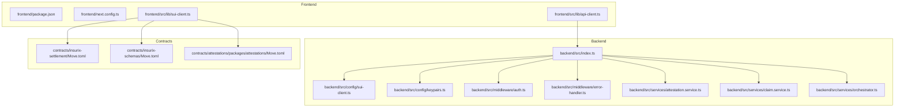
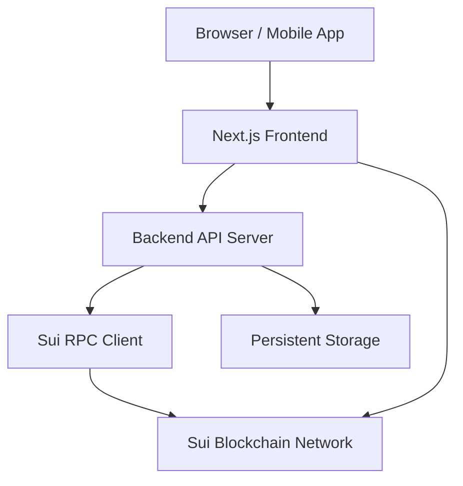
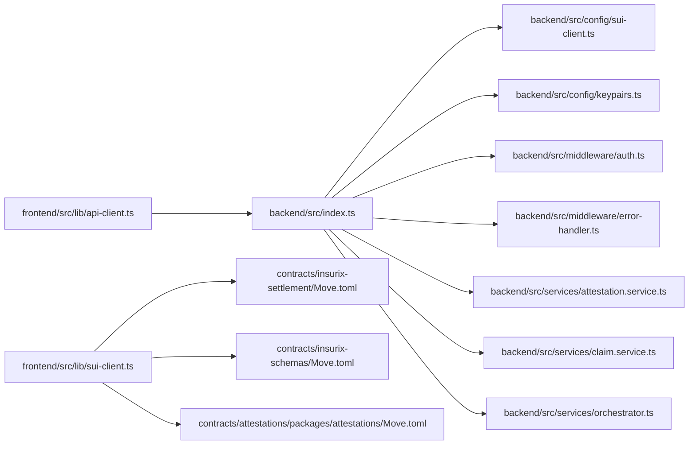

# Deployment Guide

<cite>
**Referenced Files in This Document**
- [backend/src/index.ts](file://backend/src/index.ts)
- [backend/package.json](file://backend/package.json)
- [backend/tsconfig.json](file://backend/tsconfig.json)
- [backend/src/config/sui-client.ts](file://backend/src/config/sui-client.ts)
- [backend/src/config/keypairs.ts](file://backend/src/config/keypairs.ts)
- [backend/src/middleware/auth.ts](file://backend/src/middleware/auth.ts)
- [backend/src/middleware/error-handler.ts](file://backend/src/middleware/error-handler.ts)
- [backend/src/services/attestation.service.ts](file://backend/src/services/attestation.service.ts)
- [backend/src/services/claim.service.ts](file://backend/src/services/claim.service.ts)
- [backend/src/services/orchestrator.ts](file://backend/src/services/orchestrator.ts)
- [contracts/insurix-settlement/Move.toml](file://contracts/insurix-settlement/Move.toml)
- [contracts/insurix-schemas/Move.toml](file://contracts/insurix-schemas/Move.toml)
- [contracts/attestations/packages/attestations/Move.toml](file://contracts/attestations/packages/attestations/Move.toml)
- [frontend/package.json](file://frontend/package.json)
- [frontend/next.config.ts](file://frontend/next.config.ts)
- [frontend/src/lib/api-client.ts](file://frontend/src/lib/api-client.ts)
- [frontend/src/lib/sui-client.ts](file://frontend/src/lib/sui-client.ts)
</cite>

## Table of Contents
1. [Introduction](#introduction)
2. [Project Structure](#project-structure)
3. [Core Components](#core-components)
4. [Architecture Overview](#architecture-overview)
5. [Detailed Component Analysis](#detailed-component-analysis)
6. [Dependency Analysis](#dependency-analysis)
7. [Performance Considerations](#performance-considerations)
8. [Troubleshooting Guide](#troubleshooting-guide)
9. [Conclusion](#conclusion)
10. [Appendices](#appendices)

## Introduction
This deployment guide provides end-to-end instructions for deploying the Insurix protocol across development, staging, and production environments. It covers containerization strategies, environment configuration, infrastructure requirements, smart contract deployment on Sui blockchain networks, backend service scaling and load balancing, frontend hosting and CDN configuration, monitoring and alerting, backup and recovery procedures, disaster recovery plans, maintenance schedules, and CI/CD pipeline automation.

## Project Structure
Insurix is a multi-package workspace with:
- Backend API services written in TypeScript (Node.js)
- Smart contracts authored in Move for the Sui blockchain
- Frontend application built with Next.js

Key directories:
- backend: Node.js API server, middleware, services, and Sui client configuration
- contracts: Move packages for attestations, schemas, and settlement logic
- frontend: Next.js application with wallet integration and API client

**Diagram sources**
- [backend/src/index.ts](file://backend/src/index.ts)
- [backend/src/config/sui-client.ts](file://backend/src/config/sui-client.ts)
- [backend/src/config/keypairs.ts](file://backend/src/config/keypairs.ts)
- [backend/src/middleware/auth.ts](file://backend/src/middleware/auth.ts)
- [backend/src/middleware/error-handler.ts](file://backend/src/middleware/error-handler.ts)
- [backend/src/services/attestation.service.ts](file://backend/src/services/attestation.service.ts)
- [backend/src/services/claim.service.ts](file://backend/src/services/claim.service.ts)
- [backend/src/services/orchestrator.ts](file://backend/src/services/orchestrator.ts)
- [contracts/insurix-settlement/Move.toml](file://contracts/insurix-settlement/Move.toml)
- [contracts/insurix-schemas/Move.toml](file://contracts/insurix-schemas/Move.toml)
- [contracts/attestations/packages/attestations/Move.toml](file://contracts/attestations/packages/attestations/Move.toml)
- [frontend/src/lib/api-client.ts](file://frontend/src/lib/api-client.ts)
- [frontend/src/lib/sui-client.ts](file://frontend/src/lib/sui-client.ts)

**Section sources**
- [backend/package.json](file://backend/package.json)
- [backend/tsconfig.json](file://backend/tsconfig.json)
- [frontend/package.json](file://frontend/package.json)
- [frontend/next.config.ts](file://frontend/next.config.ts)

## Core Components
- Backend entrypoint orchestrates HTTP routes, middleware, and business services. It initializes Sui client configuration and keypair management for signing transactions.
- Middleware handles authentication and centralized error handling to standardize responses and logging.
- Services implement domain logic for attestations, claims, and orchestration of cross-service workflows.
- Contracts define on-chain state machines for attestations, identity, fraud checks, external data, and settlement flows.
- Frontend integrates with the backend API and interacts directly with Sui via a configured client.

**Section sources**
- [backend/src/index.ts](file://backend/src/index.ts)
- [backend/src/middleware/auth.ts](file://backend/src/middleware/auth.ts)
- [backend/src/middleware/error-handler.ts](file://backend/src/middleware/error-handler.ts)
- [backend/src/services/attestation.service.ts](file://backend/src/services/attestation.service.ts)
- [backend/src/services/claim.service.ts](file://backend/src/services/claim.service.ts)
- [backend/src/services/orchestrator.ts](file://backend/src/services/orchestrator.ts)
- [contracts/insurix-settlement/Move.toml](file://contracts/insurix-settlement/Move.toml)
- [contracts/insurix-schemas/Move.toml](file://contracts/insurix-schemas/Move.toml)
- [contracts/attestations/packages/attestations/Move.toml](file://contracts/attestations/packages/attestations/Move.toml)
- [frontend/src/lib/api-client.ts](file://frontend/src/lib/api-client.ts)
- [frontend/src/lib/sui-client.ts](file://frontend/src/lib/sui-client.ts)

## Architecture Overview
The system comprises three layers:
- Frontend: Next.js app serving UI, integrating wallet connectivity and calling backend APIs.
- Backend: Node.js API providing business logic, interacting with Sui blockchain through a configured client, and managing keys securely.
- Contracts: Move-based smart contracts deployed on Sui networks (Devnet, Testnet, Mainnet).

[No sources needed since this diagram shows conceptual workflow, not actual code structure]

## Detailed Component Analysis

### Backend Service Deployment
- Entrypoint initializes the server, registers middleware, and exposes endpoints.
- Configuration modules manage Sui client settings and keypairs used for transaction signing.
- Middleware enforces authentication and standardized error responses.
- Services encapsulate business logic for attestations, claims, and orchestration.

Containerization strategy:
- Build a minimal runtime image using a Node.js base image.
- Copy only necessary artifacts from the backend package.
- Set environment variables for network endpoints, secrets, and feature flags.
- Expose the HTTP port and configure health check endpoints.

Scaling considerations:
- Run multiple replicas behind a load balancer.
- Use horizontal pod autoscaling based on CPU/memory or request rate.
- Ensure stateless design; store session/state externally if needed.

Load balancing:
- Place an ingress controller or reverse proxy in front of backend pods.
- Configure sticky sessions only if required by specific features.

Health checks and readiness:
- Implement liveness and readiness probes that validate Sui connectivity and database availability.

**Section sources**
- [backend/src/index.ts](file://backend/src/index.ts)
- [backend/src/config/sui-client.ts](file://backend/src/config/sui-client.ts)
- [backend/src/config/keypairs.ts](file://backend/src/config/keypairs.ts)
- [backend/src/middleware/auth.ts](file://backend/src/middleware/auth.ts)
- [backend/src/middleware/error-handler.ts](file://backend/src/middleware/error-handler.ts)
- [backend/src/services/attestation.service.ts](file://backend/src/services/attestation.service.ts)
- [backend/src/services/claim.service.ts](file://backend/src/services/claim.service.ts)
- [backend/src/services/orchestrator.ts](file://backend/src/services/orchestrator.ts)

### Smart Contract Deployment on Sui
- Move packages are defined under contracts with Move.toml manifests specifying dependencies and published versions.
- Settlement, schemas, and attestations packages must be published in order to satisfy dependency constraints.
- Deployment targets include Devnet, Testnet, and Mainnet, each requiring distinct network endpoints and account configurations.

Deployment procedure:
- Verify package integrity and run tests locally.
- Publish packages sequentially according to dependency order.
- Record published module IDs and verify on-chain state.
- Update backend configuration to reference the correct network and module addresses.

Upgrade strategy:
- Maintain upgradeable modules where applicable.
- Follow Move upgrade patterns and ensure compatibility with existing on-chain state.

**Section sources**
- [contracts/insurix-settlement/Move.toml](file://contracts/insurix-settlement/Move.toml)
- [contracts/insurix-schemas/Move.toml](file://contracts/insurix-schemas/Move.toml)
- [contracts/attestations/packages/attestations/Move.toml](file://contracts/attestations/packages/attestations/Move.toml)

### Frontend Deployment and CDN Configuration
- The Next.js application builds static assets and can be deployed to hosting platforms supporting Node.js or static hosting.
- Environment variables control API base URLs and Sui network endpoints.
- CDN caching policies should cache immutable assets aggressively while allowing dynamic pages to bypass cache when necessary.

Hosting options:
- Platform-as-a-Service providers with build hooks and environment variable injection.
- Static hosting for prebuilt output with appropriate headers and redirects.

Security and performance:
- Enable HTTPS and HSTS.
- Configure CORS to restrict origins to trusted domains.
- Use compression and asset versioning for cache busting.

**Section sources**
- [frontend/package.json](file://frontend/package.json)
- [frontend/next.config.ts](file://frontend/next.config.ts)
- [frontend/src/lib/api-client.ts](file://frontend/src/lib/api-client.ts)
- [frontend/src/lib/sui-client.ts](file://frontend/src/lib/sui-client.ts)

### Monitoring, Logging, and Alerting
- Centralized logging should capture request logs, error traces, and Sui RPC interactions.
- Metrics collection includes latency, throughput, error rates, and Sui node health.
- Alerting rules trigger on elevated error rates, slow responses, and blockchain connectivity issues.

Implementation recommendations:
- Integrate structured logging with correlation IDs.
- Export metrics to a time-series database.
- Configure alerts for critical thresholds and notify via incident channels.

[No sources needed since this section provides general guidance]

### Backup and Recovery Procedures
- Back up persistent storage volumes containing application state and metadata.
- Snapshot database contents regularly and retain per retention policy.
- Store backups in geographically redundant locations.

Recovery steps:
- Restore latest known-good snapshot.
- Validate data integrity and replay necessary transactions.
- Reconnect to Sui network and reconcile on-chain state if needed.

Disaster recovery plan:
- Define RTO and RPO targets.
- Automate failover to secondary regions.
- Conduct periodic drills to validate recovery procedures.

[No sources needed since this section provides general guidance]

### Maintenance Schedule
- Regularly update dependencies and security patches.
- Rotate secrets and keys at defined intervals.
- Review and prune unused resources and logs.
- Perform capacity planning and scale proactively.

[No sources needed since this section provides general guidance]

### CI/CD Pipeline Configuration
- Automated builds for frontend and backend with linting and type checks.
- Unit and integration tests executed in CI.
- Container images built and pushed to registry upon successful tests.
- Deployments triggered by branch policies and environment gates.
- Rollback mechanisms enabled via immutable tags and versioned releases.

Pipeline stages:
- Build
- Test
- Security scan
- Image build and push
- Deploy to staging
- Smoke tests
- Promote to production

[No sources needed since this section provides general guidance]

## Dependency Analysis
The backend depends on Sui client configuration and keypairs, middleware for auth and errors, and services for business logic. The frontend depends on API client and Sui client libraries. Contracts define on-chain dependencies between packages.

**Diagram sources**
- [frontend/src/lib/api-client.ts](file://frontend/src/lib/api-client.ts)
- [frontend/src/lib/sui-client.ts](file://frontend/src/lib/sui-client.ts)
- [backend/src/index.ts](file://backend/src/index.ts)
- [backend/src/config/sui-client.ts](file://backend/src/config/sui-client.ts)
- [backend/src/config/keypairs.ts](file://backend/src/config/keypairs.ts)
- [backend/src/middleware/auth.ts](file://backend/src/middleware/auth.ts)
- [backend/src/middleware/error-handler.ts](file://backend/src/middleware/error-handler.ts)
- [backend/src/services/attestation.service.ts](file://backend/src/services/attestation.service.ts)
- [backend/src/services/claim.service.ts](file://backend/src/services/claim.service.ts)
- [backend/src/services/orchestrator.ts](file://backend/src/services/orchestrator.ts)
- [contracts/insurix-settlement/Move.toml](file://contracts/insurix-settlement/Move.toml)
- [contracts/insurix-schemas/Move.toml](file://contracts/insurix-schemas/Move.toml)
- [contracts/attestations/packages/attestations/Move.toml](file://contracts/attestations/packages/attestations/Move.toml)

**Section sources**
- [backend/package.json](file://backend/package.json)
- [frontend/package.json](file://frontend/package.json)

## Performance Considerations
- Optimize backend response times by minimizing synchronous operations and leveraging async processing.
- Cache frequently accessed data and use connection pooling for external services.
- Tune Sui RPC client timeouts and retries to handle network variability.
- Scale horizontally during traffic spikes and monitor resource utilization.

[No sources needed since this section provides general guidance]

## Troubleshooting Guide
Common issues and resolutions:
- Authentication failures: Verify token validation and secret rotation.
- Sui connectivity errors: Check network endpoints, firewall rules, and rate limits.
- Contract interaction errors: Confirm module IDs and account permissions.
- Frontend API errors: Validate CORS settings and environment variables.

Logging and diagnostics:
- Enable detailed request/response logs with correlation IDs.
- Capture stack traces and context for errors.
- Use distributed tracing to identify bottlenecks.

**Section sources**
- [backend/src/middleware/auth.ts](file://backend/src/middleware/auth.ts)
- [backend/src/middleware/error-handler.ts](file://backend/src/middleware/error-handler.ts)

## Conclusion
This guide outlines the complete deployment strategy for Insurix across environments, covering containerization, configuration, infrastructure, smart contract deployment, backend scaling, frontend hosting, monitoring, backup and recovery, and CI/CD automation. Following these practices ensures reliable, secure, and scalable operation of the Insurix protocol on Sui blockchain networks.

[No sources needed since this section summarizes without analyzing specific files]

## Appendices

### Environment Variables Reference
- Backend:
  - SUI_RPC_URL: Sui network endpoint
  - SUI_NETWORK: Target network identifier
  - KEYPAIR_SECRET: Secure key material reference
  - API_PORT: HTTP server port
  - LOG_LEVEL: Logging verbosity
- Frontend:
  - NEXT_PUBLIC_API_BASE_URL: Backend API base URL
  - NEXT_PUBLIC_SUI_RPC_URL: Sui RPC endpoint for browser usage
  - NEXT_PUBLIC_SUI_NETWORK: Network identifier for wallet connections

[No sources needed since this section provides general guidance]

### Container Images and Registries
- Backend image: Node.js runtime with application artifacts
- Frontend image: Static build or Node.js server depending on hosting platform
- Registry: Private or public container registry with access controls

[No sources needed since this section provides general guidance]

### Health Check Endpoints
- Liveness probe: Validates process health
- Readiness probe: Checks Sui connectivity and dependencies
- Custom health endpoint: Aggregates status of subsystems

[No sources needed since this section provides general guidance]