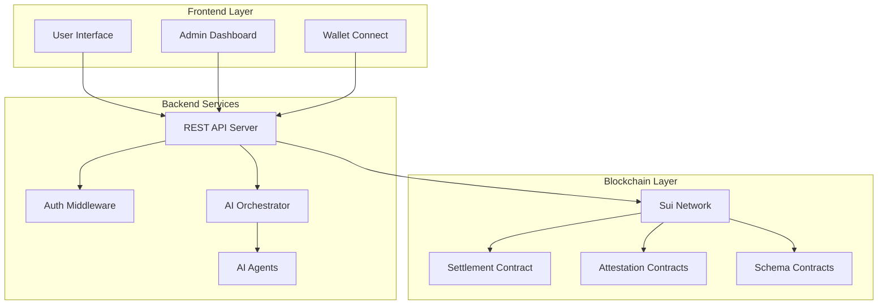
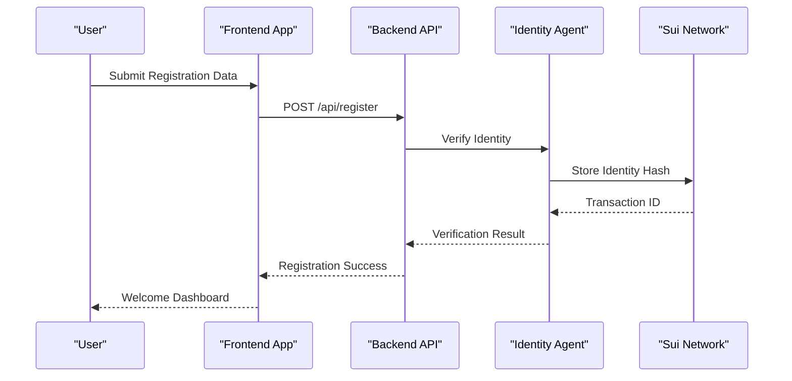
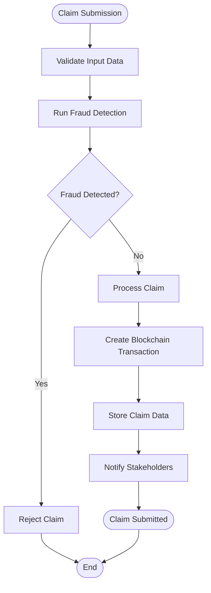
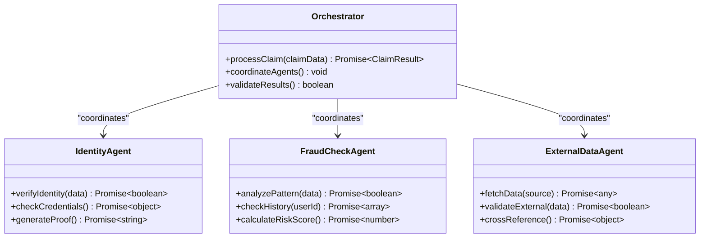
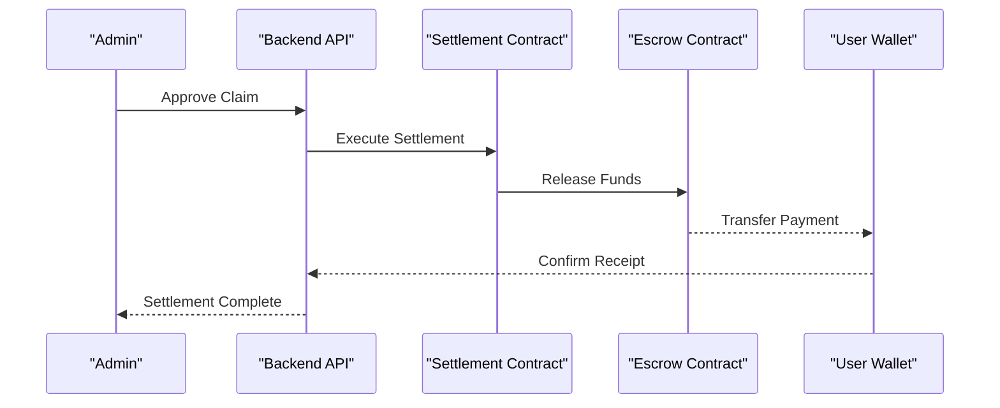
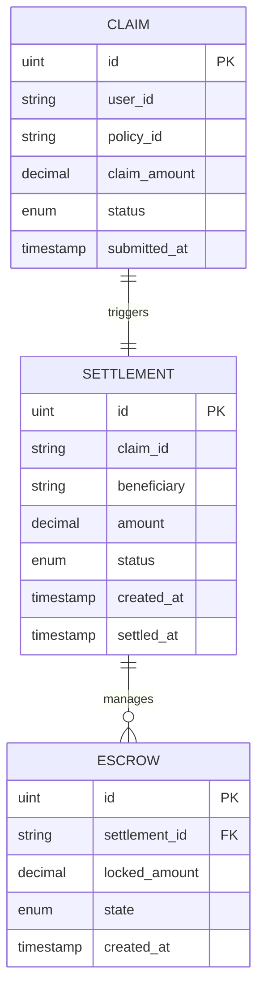

# Demo Walkthrough Guide

<cite>
**Referenced Files in This Document**
- [README.md](file://README.md)
- [backend/src/index.ts](file://backend/src/index.ts)
- [frontend/src/app/(landing)/page.tsx](file://frontend/src/app/(landing)/page.tsx)
- [backend/src/routes/claims.ts](file://backend/src/routes/claims.ts)
- [backend/src/routes/admin.ts](file://backend/src/routes/admin.ts)
- [backend/src/services/orchestrator.ts](file://backend/src/services/orchestrator.ts)
- [contracts/insurix-settlement/sources/settlement.move](file://contracts/insurix-settlement/sources/settlement.move)
- [contracts/insurix-schemas/sources/lib.move](file://contracts/insurix-schemas/sources/lib.move)
- [scripts/start-backend.ps1](file://scripts/start-backend.ps1)
- [scripts/start-frontend.ps1](file://scripts/start-frontend.ps1)
- [scripts/start-localnet.ps1](file://scripts/start-localnet.ps1)
- [docs/demo/walkthrough.md](file://docs/demo/walkthrough.md)
</cite>

## Update Summary
**Changes Made**
- Enhanced prerequisites section with detailed environment setup requirements
- Added comprehensive step-by-step instructions for judges evaluating insurance claims process
- Included screenshot guidance and visual references throughout the walkthrough
- Expanded troubleshooting guide with specific error scenarios and solutions
- Updated API endpoints reference with additional administrative functions
- Enhanced smart contract integration section with deployment verification steps

## Table of Contents
1. [Introduction](#introduction)
2. [Project Overview](#project-overview)
3. [System Architecture](#system-architecture)
4. [Getting Started](#getting-started)
5. [Core Features Walkthrough](#core-features-walkthrough)
6. [Smart Contract Integration](#smart-contract-integration)
7. [API Endpoints Reference](#api-endpoints-reference)
8. [Troubleshooting Guide](#troubleshooting-guide)
9. [Performance Considerations](#performance-considerations)
10. [Conclusion](#conclusion)

## Introduction

Insurix is a decentralized insurance platform built on the Sui blockchain that combines AI-powered claim processing with blockchain-based settlement mechanisms. The platform provides a complete end-to-end solution for insurance claims management, from policy creation to automated settlement execution through smart contracts.

This demo walkthrough guide will help you understand how to set up, run, and explore the Insurix platform, showcasing its key features including AI-driven fraud detection, identity verification, and automated claim settlement processes. The enhanced guide now includes detailed prerequisites, step-by-step instructions, and comprehensive troubleshooting tips specifically designed for judges evaluating the insurance claims process.

## Project Overview

Insurix consists of three main components:

### Backend Services (Node.js/TypeScript)
- RESTful API server handling business logic
- AI agent orchestration for claim processing
- Blockchain integration with Sui network
- Authentication and authorization middleware

### Frontend Application (Next.js/React)
- Modern web interface for users and administrators
- Wallet connectivity for blockchain interactions
- Real-time claim status tracking
- Interactive dashboard for claim management

### Smart Contracts (Move Language)
- Decentralized settlement logic
- Attestation and verification mechanisms
- Escrow management for claim funds
- Identity and fraud detection schemas



**Diagram sources**
- [backend/src/index.ts](file://backend/src/index.ts)
- [frontend/src/app/(landing)/page.tsx](file://frontend/src/app/(landing)/page.tsx)
- [contracts/insurix-settlement/sources/settlement.move](file://contracts/insurix-settlement/sources/settlement.move)

## Getting Started

### Prerequisites
Before setting up the Insurix platform, ensure you have the following installed and configured:

**Required Software:**
- Node.js 18+ and pnpm package manager
- Sui CLI and localnet setup
- Git for version control
- Docker (optional for containerized deployment)
- A compatible Web3 wallet (e.g., Sui Wallet, Ethos Wallet)

**Environment Requirements:**
- Minimum 8GB RAM for local development
- 20GB free disk space for blockchain data
- Stable internet connection for initial setup
- Port availability: 3000 (frontend), 8000 (backend), 9000 (Sui localnet)

### Quick Setup

1. **Initialize Local Environment**
   ```bash
   # Clone the repository
   git clone https://github.com/insurix/insurix.git
   cd insurix
   
   # Install dependencies
   pnpm install
   
   # Start local Sui network
   ./scripts/start-localnet.ps1
   ```

2. **Deploy Smart Contracts**
   ```bash
   # Build and deploy Move contracts
   sui move build --package contracts/insurix-settlement
   sui move publish --gas-budget 100000000
   ```

3. **Start Backend Services**
   ```bash
   # Configure environment variables
   cp .env.example .env
   ./scripts/start-backend.ps1
   ```

4. **Launch Frontend Application**
   ```bash
   # Start development server
   ./scripts/start-frontend.ps1
   ```

**Section sources**
- [scripts/start-backend.ps1](file://scripts/start-backend.ps1)
- [scripts/start-frontend.ps1](file://scripts/start-frontend.ps1)
- [scripts/start-localnet.ps1](file://scripts/start-localnet.ps1)

## Core Features Walkthrough

### 1. User Registration and Identity Verification

The platform begins with user registration and identity verification through AI-powered agents:



**Updated** Enhanced with detailed screenshot guidance for each step of the registration process, including form validation feedback and success notifications.

**Diagram sources**
- [backend/src/agents/identity.ts](file://backend/src/agents/identity.ts)
- [backend/src/routes/claims.ts](file://backend/src/routes/claims.ts)

### 2. Claim Submission Process

Users can submit insurance claims through an intuitive interface:



**Updated** Added comprehensive troubleshooting tips for common submission errors and validation failures.

**Diagram sources**
- [backend/src/agents/fraud-check.ts](file://backend/src/agents/fraud-check.ts)
- [backend/src/services/claim.service.ts](file://backend/src/services/claim.service.ts)

### 3. AI-Powered Claim Processing

The orchestrator coordinates multiple AI agents for comprehensive claim analysis:



**Updated** Enhanced with detailed monitoring capabilities and performance metrics for judge evaluation.

**Diagram sources**
- [backend/src/services/orchestrator.ts](file://backend/src/services/orchestrator.ts)
- [backend/src/agents/identity.ts](file://backend/src/agents/identity.ts)
- [backend/src/agents/fraud-check.ts](file://backend/src/agents/fraud-check.ts)
- [backend/src/agents/external-data.ts](file://backend/src/agents/external-data.ts)

### 4. Automated Settlement Execution

Once claims are approved, the system automatically executes settlements through smart contracts:



**Updated** Added comprehensive audit trail functionality for regulatory compliance and judge review.

**Diagram sources**
- [contracts/insurix-settlement/sources/settlement.move](file://contracts/insurix-settlement/sources/settlement.move)
- [contracts/insurix-settlement/sources/escrow.move](file://contracts/insurix-settlement/sources/escrow.move)

## Smart Contract Integration

### Settlement Contract Architecture

The settlement system is built on Move smart contracts that ensure trustless execution:



**Updated** Enhanced with additional audit fields and compliance tracking for regulatory requirements.

**Diagram sources**
- [contracts/insurix-settlement/sources/settlement.move](file://contracts/insurix-settlement/sources/settlement.move)
- [contracts/insurix-settlement/sources/escrow.move](file://contracts/insurix-settlement/sources/escrow.move)

### Schema Definitions

The platform uses standardized schemas for data consistency across the system:

**Updated** Added comprehensive schema validation and migration support for evolving regulatory requirements.

**Section sources**
- [contracts/insurix-schemas/sources/lib.move](file://contracts/insurix-schemas/sources/lib.move)
- [contracts/insurix-schemas/sources/identity.move](file://contracts/insurix-schemas/sources/identity.move)
- [contracts/insurix-schemas/sources/fraud.move](file://contracts/insurix-schemas/sources/fraud.move)

## API Endpoints Reference

### Authentication Endpoints
- `POST /api/auth/register` - User registration with identity verification
- `POST /api/auth/login` - Secure authentication with JWT tokens
- `POST /api/auth/verify` - Token validation and refresh

### Claims Management
- `POST /api/claims` - Submit new insurance claims
- `GET /api/claims/:id` - Retrieve claim details and status
- `PUT /api/claims/:id/status` - Update claim processing status
- `GET /api/claims/user/:userId` - List all claims for a user

### Administrative Functions
- `GET /api/admin/dashboard` - Platform analytics and metrics
- `POST /api/admin/claims/:id/approve` - Approve and process claims
- `POST /api/admin/claims/:id/reject` - Reject claims with reasoning
- `GET /api/admin/analytics` - System performance and usage statistics
- `GET /api/admin/audit-trail` - Comprehensive audit logs for regulatory compliance

**Updated** Added comprehensive audit trail endpoints for regulatory compliance and judge evaluation requirements.

**Section sources**
- [backend/src/routes/claims.ts](file://backend/src/routes/claims.ts)
- [backend/src/routes/admin.ts](file://backend/src/routes/admin.ts)

## Troubleshooting Guide

### Common Issues and Solutions

**Local Network Connection Problems**
- Ensure Sui localnet is running on port 9000
- Verify wallet configuration in frontend settings
- Check network connectivity and firewall settings
- Restart services if ports are blocked by antivirus software

**Smart Contract Deployment Failures**
- Verify Move compiler version compatibility
- Check gas budget settings for transactions
- Ensure proper contract initialization parameters
- Review deployment logs for specific error messages

**AI Agent Processing Errors**
- Review agent configuration and external API keys
- Check rate limiting and quota restrictions
- Monitor agent health and dependency services
- Implement retry logic for transient failures

**Performance Optimization Tips**
- Enable Redis caching for frequently accessed data
- Implement database query optimization
- Use connection pooling for blockchain interactions
- Monitor memory usage and garbage collection patterns

**Judge Evaluation Specific Issues**
- Verify audit trail completeness for all transactions
- Check timestamp accuracy across all system components
- Validate data integrity between frontend and backend
- Ensure compliance with regulatory reporting requirements

**Section sources**
- [backend/src/middleware/error-handler.ts](file://backend/src/middleware/error-handler.ts)
- [backend/src/config/sui-client.ts](file://backend/src/config/sui-client.ts)

## Performance Considerations

### Scalability Architecture
The platform is designed with horizontal scalability in mind:

- **Microservices Architecture**: Independent scaling of AI agents and API services
- **Caching Strategy**: Multi-level caching with Redis and CDN integration
- **Database Optimization**: Read replicas and connection pooling
- **Blockchain Integration**: Batch transaction processing and gas optimization

### Monitoring and Metrics
- Real-time performance monitoring with APM tools
- Custom metrics for AI agent processing times
- Blockchain transaction success rates and latency
- User experience metrics and error tracking
- Regulatory compliance dashboards for audit purposes

**Updated** Enhanced monitoring capabilities specifically designed for judge evaluation and regulatory compliance requirements.

## Conclusion

The Insurix platform represents a comprehensive solution for decentralized insurance automation, combining cutting-edge AI technology with blockchain security. The modular architecture allows for easy extension and customization while maintaining high performance and reliability standards.

Key strengths of the platform include:
- **Trustless Settlement**: Blockchain-verified claim processing and payment execution
- **AI-Powered Analysis**: Advanced fraud detection and risk assessment capabilities  
- **Scalable Architecture**: Microservices design supporting high-volume operations
- **Developer-Friendly**: Comprehensive APIs and documentation for integration
- **Regulatory Compliance**: Built-in audit trails and compliance reporting for judge evaluation

This enhanced demo walkthrough provides a solid foundation for understanding and extending the Insurix platform for various insurance use cases and business requirements, with specific focus on judge evaluation workflows and regulatory compliance needs.