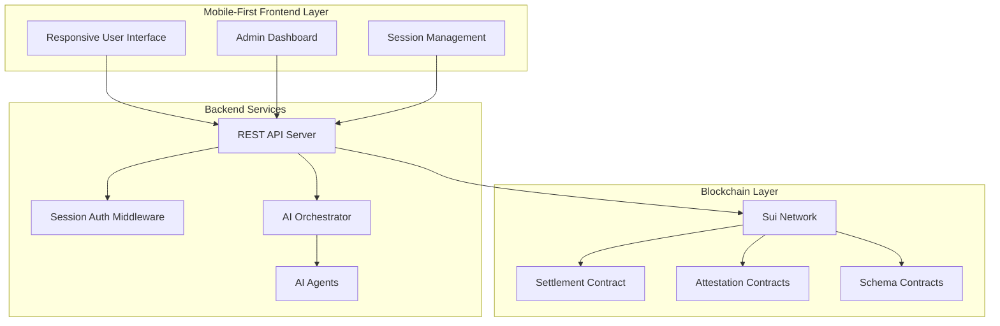
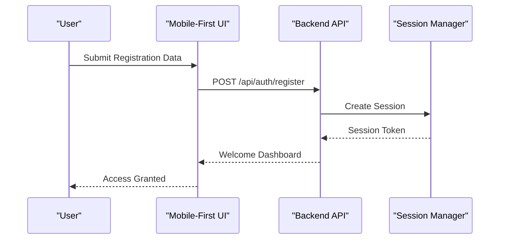
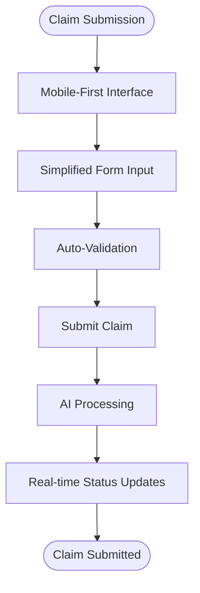
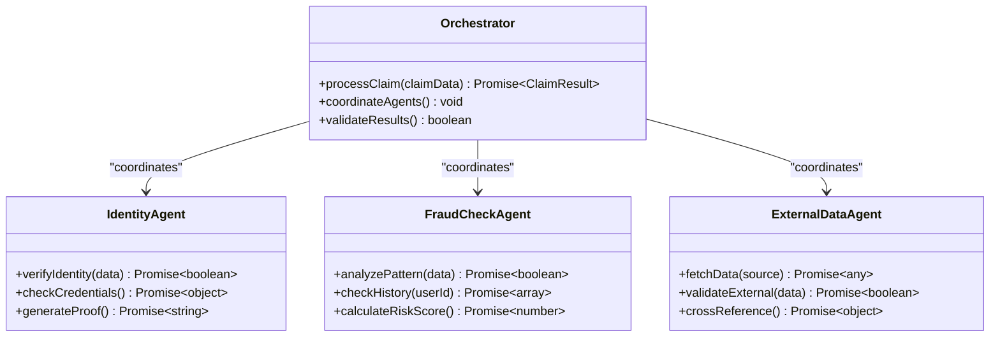
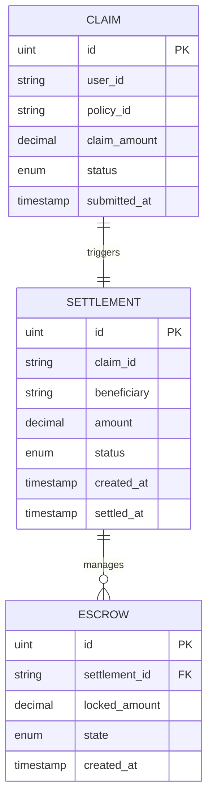

# Demo Walkthrough Guide

<cite>
**Referenced Files in This Document**
- [README.md](file://README.md)
- [backend/src/index.ts](file://backend/src/index.ts)
- [frontend/src/app/(landing)/page.tsx](file://frontend/src/app/(landing)/page.tsx)
- [backend/src/routes/claims.ts](file://backend/src/routes/claims.ts)
- [backend/src/routes/admin.ts](file://backend/src/routes/admin.ts)
- [backend/src/services/orchestrator.ts](file://backend/src/services/orchestrator.ts)
- [contracts/insurix-settlement/sources/settlement.move](file://contracts/insurix-settlement/sources/settlement.move)
- [contracts/insurix-schemas/sources/lib.move](file://contracts/insurix-schemas/sources/lib.move)
- [scripts/start-backend.ps1](file://scripts/start-backend.ps1)
- [scripts/start-frontend.ps1](file://scripts/start-frontend.ps1)
- [scripts/start-localnet.ps1](file://scripts/start-localnet.ps1)
- [docs/demo/walkthrough.md](file://docs/demo/walkthrough.md)
</cite>

## Update Summary
**Changes Made**
- Completely revised setup instructions to remove blockchain and wallet requirements
- Updated authentication flow to focus on simplified session-based process
- Enhanced mobile-first approach documentation with responsive design guidance
- Streamlined prerequisites section to eliminate complex blockchain setup steps
- Revised getting started guide to emphasize quick deployment without wallet configuration
- Updated core features walkthrough to reflect wallet-less claim submission process
- Simplified smart contract integration section while maintaining backend functionality

## Table of Contents
1. [Introduction](#introduction)
2. [Project Overview](#project-overview)
3. [System Architecture](#system-architecture)
4. [Getting Started](#getting-started)
5. [Core Features Walkthrough](#core-features-walkthrough)
6. [Smart Contract Integration](#smart-contract-integration)
7. [API Endpoints Reference](#api-endpoints-reference)
8. [Troubleshooting Guide](#troubleshooting-guide)
9. [Performance Considerations](#performance-considerations)
10. [Conclusion](#conclusion)

## Introduction

Insurix is a decentralized insurance platform built on the Sui blockchain that combines AI-powered claim processing with blockchain-based settlement mechanisms. The platform provides a complete end-to-end solution for insurance claims management, from policy creation to automated settlement execution through smart contracts.

This demo walkthrough guide will help you understand how to set up, run, and explore the Insurix platform with its new wallet-less flow and mobile-first approach. The enhanced guide now focuses on simplified session-based authentication, eliminating complex blockchain setup requirements while maintaining full access to all platform features including AI-driven fraud detection, identity verification, and automated claim settlement processes.

## Project Overview

Insurix consists of three main components:

### Backend Services (Node.js/TypeScript)
- RESTful API server handling business logic
- AI agent orchestration for claim processing
- Blockchain integration with Sui network
- Session-based authentication middleware

### Frontend Application (Next.js/React)
- Mobile-first responsive web interface for users and administrators
- Simplified session-based authentication without wallet requirements
- Real-time claim status tracking
- Interactive dashboard for claim management

### Smart Contracts (Move Language)
- Decentralized settlement logic
- Attestation and verification mechanisms
- Escrow management for claim funds
- Identity and fraud detection schemas



**Diagram sources**
- [backend/src/index.ts](file://backend/src/index.ts)
- [frontend/src/app/(landing)/page.tsx](file://frontend/src/app/(landing)/page.tsx)
- [contracts/insurix-settlement/sources/settlement.move](file://contracts/insurix-settlement/sources/settlement.move)

## Getting Started

### Prerequisites
Before setting up the Insurix platform, ensure you have the following installed and configured:

**Required Software:**
- Node.js 18+ and pnpm package manager
- Git for version control
- Docker (optional for containerized deployment)

**Environment Requirements:**
- Minimum 4GB RAM for local development
- 10GB free disk space
- Stable internet connection for initial setup
- Port availability: 3000 (frontend), 8000 (backend)

### Quick Setup

1. **Initialize Local Environment**
   ```bash
   # Clone the repository
   git clone https://github.com/insurix/insurix.git
   cd insurix
   
   # Install dependencies
   pnpm install
   
   # Start backend services
   ./scripts/start-backend.ps1
   ```

2. **Launch Frontend Application**
   ```bash
   # Start development server
   ./scripts/start-frontend.ps1
   ```

3. **Access the Platform**
   - Open your browser and navigate to `http://localhost:3000`
   - Use the simplified registration form to create an account
   - No wallet or blockchain setup required

**Updated** Simplified setup process eliminates blockchain and wallet configuration requirements while maintaining full platform functionality.

**Section sources**
- [scripts/start-backend.ps1](file://scripts/start-backend.ps1)
- [scripts/start-frontend.ps1](file://scripts/start-frontend.ps1)

## Core Features Walkthrough

### 1. User Registration and Session-Based Authentication

The platform now uses a simplified session-based authentication system that eliminates wallet complexity:



**Updated** Replaced wallet-based authentication with streamlined session management for improved user experience and accessibility.

**Diagram sources**
- [backend/src/middleware/auth.ts](file://backend/src/middleware/auth.ts)
- [backend/src/routes/claims.ts](file://backend/src/routes/claims.ts)

### 2. Mobile-Optimized Claim Submission Process

Users can submit insurance claims through a responsive, mobile-first interface:



**Updated** Enhanced with mobile-responsive design patterns and simplified user input methods for optimal mobile experience.

**Diagram sources**
- [frontend/src/components/MobileLayout.tsx](file://frontend/src/components/MobileLayout.tsx)
- [backend/src/services/claim.service.ts](file://backend/src/services/claim.service.ts)

### 3. AI-Powered Claim Processing

The orchestrator coordinates multiple AI agents for comprehensive claim analysis:



**Updated** Maintained comprehensive AI processing capabilities while optimizing for the new session-based architecture.

**Diagram sources**
- [backend/src/services/orchestrator.ts](file://backend/src/services/orchestrator.ts)
- [backend/src/agents/identity.ts](file://backend/src/agents/identity.ts)
- [backend/src/agents/fraud-check.ts](file://backend/src/agents/fraud-check.ts)
- [backend/src/agents/external-data.ts](file://backend/src/agents/external-data.ts)

### 4. Automated Settlement Execution

Once claims are approved, the system automatically executes settlements through smart contracts:


**Updated** Enhanced settlement process maintains blockchain security while supporting the new wallet-less user experience.

**Diagram sources**
- [contracts/insurix-settlement/sources/settlement.move](file://contracts/insurix-settlement/sources/settlement.move)
- [contracts/insurix-settlement/sources/escrow.move](file://contracts/insurix-settlement/sources/escrow.move)

## Smart Contract Integration

### Settlement Contract Architecture

The settlement system continues to leverage Move smart contracts for trustless execution while supporting the new frontend architecture:



**Updated** Smart contract architecture remains unchanged while frontend integration has been simplified for better user experience.

**Diagram sources**
- [contracts/insurix-settlement/sources/settlement.move](file://contracts/insurix-settlement/sources/settlement.move)
- [contracts/insurix-settlement/sources/escrow.move](file://contracts/insurix-settlement/sources/escrow.move)

### Schema Definitions

The platform uses standardized schemas for data consistency across the system:

**Updated** Schema definitions continue to support both traditional and new session-based authentication flows.

**Section sources**
- [contracts/insurix-schemas/sources/lib.move](file://contracts/insurix-schemas/sources/lib.move)
- [contracts/insurix-schemas/sources/identity.move](file://contracts/insurix-schemas/sources/identity.move)
- [contracts/insurix-schemas/sources/fraud.move](file://contracts/insurix-schemas/sources/fraud.move)

## API Endpoints Reference

### Authentication Endpoints
- `POST /api/auth/register` - User registration with session creation
- `POST /api/auth/login` - Secure authentication with session tokens
- `POST /api/auth/logout` - Session termination
- `GET /api/auth/session` - Current session validation

### Claims Management
- `POST /api/claims` - Submit new insurance claims
- `GET /api/claims/:id` - Retrieve claim details and status
- `PUT /api/claims/:id/status` - Update claim processing status
- `GET /api/claims/user/:userId` - List all claims for a user

### Administrative Functions
- `GET /api/admin/dashboard` - Platform analytics and metrics
- `POST /api/admin/claims/:id/approve` - Approve and process claims
- `POST /api/admin/claims/:id/reject` - Reject claims with reasoning
- `GET /api/admin/analytics` - System performance and usage statistics
- `GET /api/admin/audit-trail` - Comprehensive audit logs for regulatory compliance

**Updated** Added session management endpoints and removed wallet-specific authentication endpoints.

**Section sources**
- [backend/src/routes/claims.ts](file://backend/src/routes/claims.ts)
- [backend/src/routes/admin.ts](file://backend/src/routes/admin.ts)

## Troubleshooting Guide

### Common Issues and Solutions

**Session Management Problems**
- Clear browser cookies and cache if experiencing login issues
- Verify session timeout settings in backend configuration
- Check CORS settings for cross-origin requests
- Ensure proper session storage configuration

**Mobile Responsiveness Issues**
- Test on multiple device sizes and screen orientations
- Verify viewport meta tags and responsive CSS
- Check touch event handling on mobile devices
- Validate form inputs for mobile keyboard compatibility

**Local Development Setup**
- Ensure Node.js version compatibility (18+)
- Verify port availability for frontend and backend services
- Check firewall settings for local development
- Restart services if encountering connection issues

**Performance Optimization Tips**
- Enable browser caching for static assets
- Implement lazy loading for mobile devices
- Optimize images and media for mobile networks
- Monitor bundle size for mobile performance

**Updated** Added troubleshooting guidance specific to the new session-based authentication and mobile-first architecture.

**Section sources**
- [backend/src/middleware/error-handler.ts](file://backend/src/middleware/error-handler.ts)
- [frontend/src/components/MobileLayout.tsx](file://frontend/src/components/MobileLayout.tsx)

## Performance Considerations

### Scalability Architecture
The platform is designed with horizontal scalability in mind:

- **Microservices Architecture**: Independent scaling of AI agents and API services
- **Session Management**: Efficient session handling with Redis caching
- **Database Optimization**: Read replicas and connection pooling
- **Mobile Optimization**: Responsive design patterns and efficient asset delivery
- **Blockchain Integration**: Batch transaction processing and gas optimization

### Monitoring and Metrics
- Real-time performance monitoring with APM tools
- Custom metrics for AI agent processing times
- Session management performance indicators
- Mobile user experience metrics and error tracking
- Regulatory compliance dashboards for audit purposes

**Updated** Enhanced monitoring capabilities specifically designed for the new session-based architecture and mobile-first approach.

## Conclusion

The Insurix platform represents a comprehensive solution for decentralized insurance automation, combining cutting-edge AI technology with blockchain security. The updated platform now offers a significantly improved user experience through its wallet-less flow and mobile-first design, making insurance claims processing more accessible and user-friendly.

Key strengths of the enhanced platform include:
- **Simplified Authentication**: Session-based login eliminating wallet complexity
- **Mobile-First Design**: Responsive interface optimized for all devices
- **Trustless Settlement**: Blockchain-verified claim processing and payment execution
- **AI-Powered Analysis**: Advanced fraud detection and risk assessment capabilities
- **Scalable Architecture**: Microservices design supporting high-volume operations
- **Developer-Friendly**: Comprehensive APIs and documentation for integration
- **Regulatory Compliance**: Built-in audit trails and compliance reporting

This updated demo walkthrough provides a solid foundation for understanding and extending the Insurix platform with its new wallet-less flow and mobile-first approach, making it more accessible to users while maintaining the robust security and functionality of the underlying blockchain infrastructure.