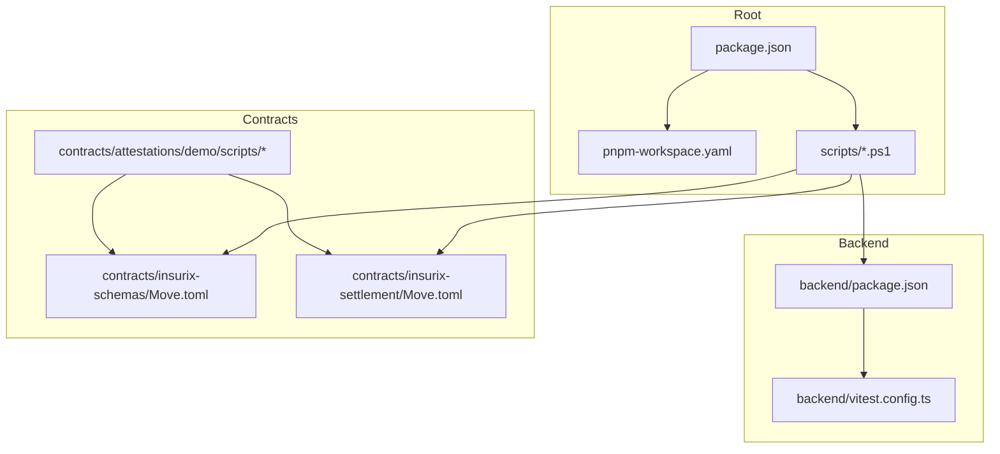
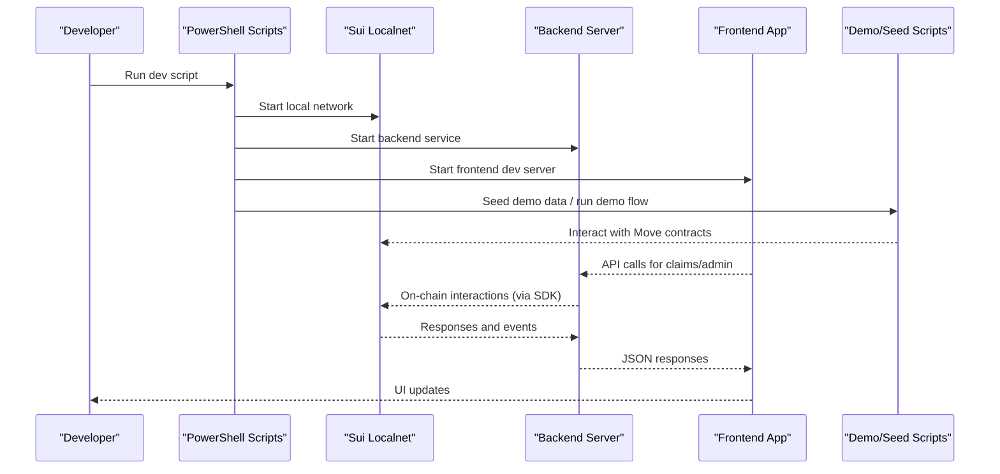
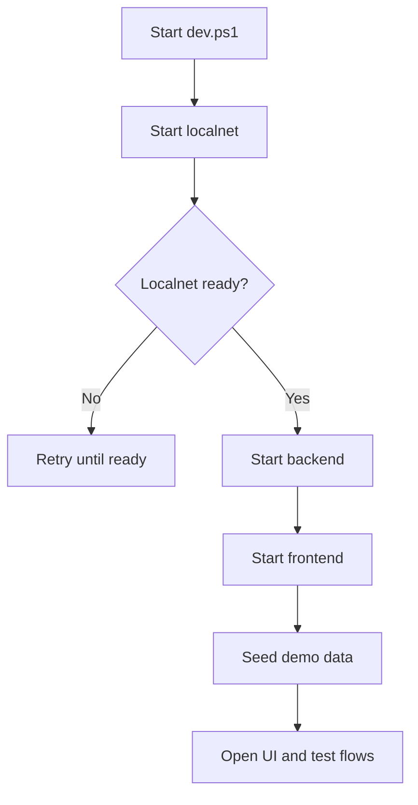
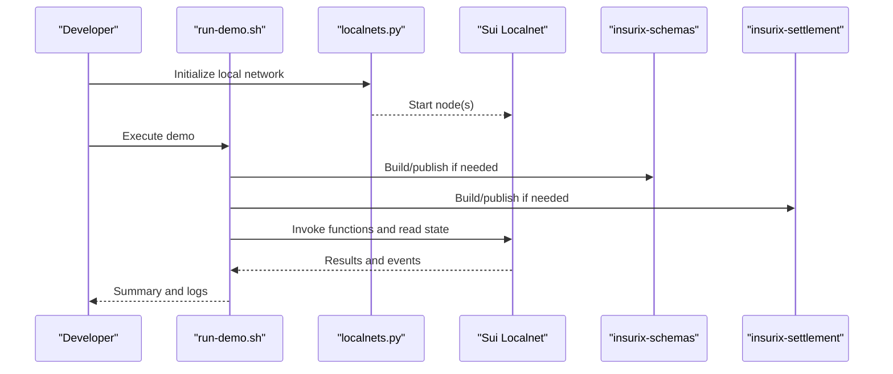
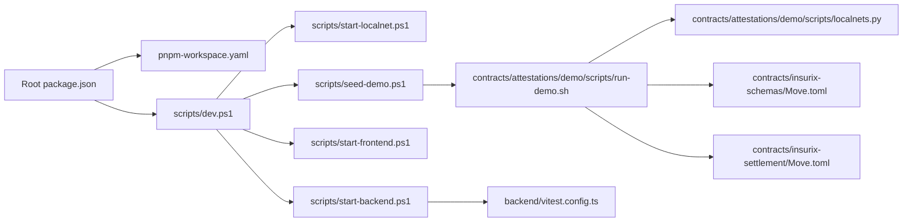

# Development Scripts & Automation

<cite>
**Referenced Files in This Document**
- [package.json](file://package.json)
- [pnpm-workspace.yaml](file://pnpm-workspace.yaml)
- [scripts/dev.ps1](file://scripts/dev.ps1)
- [scripts/seed-demo.ps1](file://scripts/seed-demo.ps1)
- [scripts/start-backend.ps1](file://scripts/start-backend.ps1)
- [scripts/start-frontend.ps1](file://scripts/start-frontend.ps1)
- [scripts/start-localnet.ps1](file://scripts/start-localnet.ps1)
- [backend/package.json](file://backend/package.json)
- [backend/vitest.config.ts](file://backend/vitest.config.ts)
- [contracts/attestations/demo/scripts/run-demo.sh](file://contracts/attestations/demo/scripts/run-demo.sh)
- [contracts/attestations/demo/scripts/localnets.py](file://contracts/attestations/demo/scripts/localnets.py)
- [contracts/insurix-schemas/Move.toml](file://contracts/insurix-schemas/Move.toml)
- [contracts/insurix-settlement/Move.toml](file://contracts/insurix-settlement/Move.toml)
</cite>

## Table of Contents
1. [Introduction](#introduction)
2. [Project Structure](#project-structure)
3. [Core Components](#core-components)
4. [Architecture Overview](#architecture-overview)
5. [Detailed Component Analysis](#detailed-component-analysis)
6. [Dependency Analysis](#dependency-analysis)
7. [Performance Considerations](#performance-considerations)
8. [Troubleshooting Guide](#troubleshooting-guide)
9. [Conclusion](#conclusion)

## Introduction
This document explains the development scripts and automation used across the Insurix project. It covers how to start local services, run tests, seed demo data, and interact with Move contracts on a local Sui network. The goal is to help developers quickly set up a consistent environment and execute common workflows reliably.

## Project Structure
The repository uses a monorepo layout managed by pnpm workspaces. Development automation spans:
- Root-level package configuration and workspace settings
- PowerShell scripts for Windows-based local development
- Shell and Python scripts under contracts for Sui localnet and demo flows
- Backend tooling (Vitest) and frontend build tooling configured via their respective package manifests

**Diagram sources**
- [package.json](file://package.json)
- [pnpm-workspace.yaml](file://pnpm-workspace.yaml)
- [scripts/dev.ps1](file://scripts/dev.ps1)
- [backend/package.json](file://backend/package.json)
- [backend/vitest.config.ts](file://backend/vitest.config.ts)
- [contracts/attestations/demo/scripts/run-demo.sh](file://contracts/attestations/demo/scripts/run-demo.sh)
- [contracts/insurix-schemas/Move.toml](file://contracts/insurix-schemas/Move.toml)
- [contracts/insurix-settlement/Move.toml](file://contracts/insurix-settlement/Move.toml)

**Section sources**
- [package.json](file://package.json)
- [pnpm-workspace.yaml](file://pnpm-workspace.yaml)

## Core Components
- Root package.json: Defines workspace tasks and convenience scripts that orchestrate backend/frontend operations and testing.
- pnpm-workspace.yaml: Declares workspace packages and ensures consistent dependency resolution across modules.
- PowerShell scripts (scripts/*.ps1): Provide one-command setup for local development, including starting the local Sui network, backend, and frontend; and seeding demo data.
- Contracts scripts: Shell and Python utilities to manage local networks and run demos against Move packages.
- Backend test config: Vitest configuration for running backend unit/integration tests.

Key responsibilities:
- Local environment bootstrapping (Sui localnet, backend, frontend)
- Demo data seeding for quick validation
- Test execution for backend logic
- Contract interaction helpers for demos and verification

**Section sources**
- [package.json](file://package.json)
- [pnpm-workspace.yaml](file://pnpm-workspace.yaml)
- [scripts/dev.ps1](file://scripts/dev.ps1)
- [scripts/start-backend.ps1](file://scripts/start-backend.ps1)
- [scripts/start-frontend.ps1](file://scripts/start-frontend.ps1)
- [scripts/start-localnet.ps1](file://scripts/start-localnet.ps1)
- [scripts/seed-demo.ps1](file://scripts/seed-demo.ps1)
- [backend/vitest.config.ts](file://backend/vitest.config.ts)

## Architecture Overview
The development automation orchestrates three main layers:
- Blockchain layer: Sui localnet managed via scripts and tools referenced by contract scripts.
- Application layer: Backend API server and Next.js frontend.
- Data layer: Seed data and demo state created by scripts before or during runtime.

**Diagram sources**
- [scripts/dev.ps1](file://scripts/dev.ps1)
- [scripts/start-localnet.ps1](file://scripts/start-localnet.ps1)
- [scripts/start-backend.ps1](file://scripts/start-backend.ps1)
- [scripts/start-frontend.ps1](file://scripts/start-frontend.ps1)
- [scripts/seed-demo.ps1](file://scripts/seed-demo.ps1)
- [contracts/attestations/demo/scripts/run-demo.sh](file://contracts/attestations/demo/scripts/run-demo.sh)

## Detailed Component Analysis

### Root Package Configuration and Workspaces
- package.json: Central entry point for workspace commands. Typically includes scripts to install dependencies, start services, and run tests across packages.
- pnpm-workspace.yaml: Declares which directories are part of the workspace, enabling unified dependency management and shared scripts.

Operational impact:
- Enables single-command bootstrap from the repository root.
- Ensures consistent versions and resolutions across backend and frontend.

**Section sources**
- [package.json](file://package.json)
- [pnpm-workspace.yaml](file://pnpm-workspace.yaml)

### PowerShell Development Scripts
- scripts/dev.ps1: Orchestrates full local development experience. Expected to start localnet, backend, frontend, and optionally seed/demo steps.
- scripts/start-localnet.ps1: Starts the Sui localnet process and ensures it is reachable.
- scripts/start-backend.ps1: Launches the backend server with appropriate environment variables and ports.
- scripts/start-frontend.ps1: Starts the Next.js development server and proxies API calls to the backend.
- scripts/seed-demo.ps1: Seeds initial data into the backend and/or interacts with contracts to create demo state.

Typical workflow:
1. Start localnet.
2. Start backend and frontend.
3. Seed demo data.
4. Open browser to frontend and verify flows.

**Diagram sources**
- [scripts/dev.ps1](file://scripts/dev.ps1)
- [scripts/start-localnet.ps1](file://scripts/start-localnet.ps1)
- [scripts/start-backend.ps1](file://scripts/start-backend.ps1)
- [scripts/start-frontend.ps1](file://scripts/start-frontend.ps1)
- [scripts/seed-demo.ps1](file://scripts/seed-demo.ps1)

**Section sources**
- [scripts/dev.ps1](file://scripts/dev.ps1)
- [scripts/start-localnet.ps1](file://scripts/start-localnet.ps1)
- [scripts/start-backend.ps1](file://scripts/start-backend.ps1)
- [scripts/start-frontend.ps1](file://scripts/start-frontend.ps1)
- [scripts/seed-demo.ps1](file://scripts/seed-demo.ps1)

### Backend Testing Setup
- backend/package.json: Contains npm scripts for building, running, and testing the backend.
- backend/vitest.config.ts: Configures Vitest for unit and integration tests, including environment setup and test file patterns.

Usage:
- Run all tests: use the workspace command defined at the root.
- Watch mode: enable incremental test runs during development.

**Section sources**
- [backend/package.json](file://backend/package.json)
- [backend/vitest.config.ts](file://backend/vitest.config.ts)

### Contracts and Demo Automation
- contracts/insurix-schemas/Move.toml: Declares the schemas package used by other contracts and scripts.
- contracts/insurix-settlement/Move.toml: Declares the settlement package for claim processing and escrow logic.
- contracts/attestations/demo/scripts/run-demo.sh: Executes a demo flow against published or locally built Move packages.
- contracts/attestations/demo/scripts/localnets.py: Utility to manage local Sui networks for demo/testing scenarios.

Workflow highlights:
- Build and publish Move packages as needed.
- Use demo scripts to exercise attestations, fraud checks, and settlement flows.
- Leverage localnets utility to spin up isolated environments.

**Diagram sources**
- [contracts/attestations/demo/scripts/run-demo.sh](file://contracts/attestations/demo/scripts/run-demo.sh)
- [contracts/attestations/demo/scripts/localnets.py](file://contracts/attestations/demo/scripts/localnets.py)
- [contracts/insurix-schemas/Move.toml](file://contracts/insurix-schemas/Move.toml)
- [contracts/insurix-settlement/Move.toml](file://contracts/insurix-settlement/Move.toml)

**Section sources**
- [contracts/insurix-schemas/Move.toml](file://contracts/insurix-schemas/Move.toml)
- [contracts/insurix-settlement/Move.toml](file://contracts/insurix-settlement/Move.toml)
- [contracts/attestations/demo/scripts/run-demo.sh](file://contracts/attestations/demo/scripts/run-demo.sh)
- [contracts/attestations/demo/scripts/localnets.py](file://contracts/attestations/demo/scripts/localnets.py)

## Dependency Analysis
Development scripts depend on:
- Node.js and pnpm for workspace orchestration.
- Sui CLI and localnet binaries invoked by PowerShell and shell scripts.
- Python for certain localnet utilities.
- Backend and frontend package managers for installing and running services.

**Diagram sources**
- [package.json](file://package.json)
- [pnpm-workspace.yaml](file://pnpm-workspace.yaml)
- [scripts/dev.ps1](file://scripts/dev.ps1)
- [scripts/start-localnet.ps1](file://scripts/start-localnet.ps1)
- [scripts/start-backend.ps1](file://scripts/start-backend.ps1)
- [scripts/start-frontend.ps1](file://scripts/start-frontend.ps1)
- [scripts/seed-demo.ps1](file://scripts/seed-demo.ps1)
- [contracts/attestations/demo/scripts/run-demo.sh](file://contracts/attestations/demo/scripts/run-demo.sh)
- [contracts/attestations/demo/scripts/localnets.py](file://contracts/attestations/demo/scripts/localnets.py)
- [contracts/insurix-schemas/Move.toml](file://contracts/insurix-schemas/Move.toml)
- [contracts/insurix-settlement/Move.toml](file://contracts/insurix-settlement/Move.toml)
- [backend/vitest.config.ts](file://backend/vitest.config.ts)

**Section sources**
- [package.json](file://package.json)
- [pnpm-workspace.yaml](file://pnpm-workspace.yaml)
- [scripts/dev.ps1](file://scripts/dev.ps1)
- [scripts/start-localnet.ps1](file://scripts/start-localnet.ps1)
- [scripts/start-backend.ps1](file://scripts/start-backend.ps1)
- [scripts/start-frontend.ps1](file://scripts/start-frontend.ps1)
- [scripts/seed-demo.ps1](file://scripts/seed-demo.ps1)
- [contracts/attestations/demo/scripts/run-demo.sh](file://contracts/attestations/demo/scripts/run-demo.sh)
- [contracts/attestations/demo/scripts/localnets.py](file://contracts/attestations/demo/scripts/localnets.py)
- [contracts/insurix-schemas/Move.toml](file://contracts/insurix-schemas/Move.toml)
- [contracts/insurix-settlement/Move.toml](file://contracts/insurix-settlement/Move.toml)
- [backend/vitest.config.ts](file://backend/vitest.config.ts)

## Performance Considerations
- Parallelize startup: Ensure localnet readiness checks are efficient to avoid unnecessary retries.
- Incremental builds: Use watch modes for backend and frontend during active development.
- Minimal seed data: Keep demo seeds small to reduce initialization time.
- Isolated localnets: Reuse existing localnet instances when possible to avoid restart overhead.

[No sources needed since this section provides general guidance]

## Troubleshooting Guide
Common issues and resolutions:
- Localnet not starting: Verify Sui CLI installation and port availability; check logs from the localnet process.
- Backend fails to connect: Confirm backend environment variables match localnet endpoints and credentials.
- Frontend proxy errors: Ensure backend is running on the expected port and CORS is configured appropriately.
- Demo script failures: Validate Move packages are built/published; ensure localnet is healthy and accessible.
- Tests failing: Check Vitest configuration and required environment variables; run tests in isolation to identify flaky suites.

**Section sources**
- [scripts/start-localnet.ps1](file://scripts/start-localnet.ps1)
- [scripts/start-backend.ps1](file://scripts/start-backend.ps1)
- [scripts/start-frontend.ps1](file://scripts/start-frontend.ps1)
- [scripts/seed-demo.ps1](file://scripts/seed-demo.ps1)
- [contracts/attestations/demo/scripts/run-demo.sh](file://contracts/attestations/demo/scripts/run-demo.sh)
- [contracts/attestations/demo/scripts/localnets.py](file://contracts/attestations/demo/scripts/localnets.py)
- [backend/vitest.config.ts](file://backend/vitest.config.ts)

## Conclusion
The Insurix development scripts provide a cohesive automation layer for local blockchain, backend, and frontend operations. By leveraging pnpm workspaces, PowerShell orchestration, and contract demo utilities, developers can rapidly iterate and validate features end-to-end. Following the recommended workflows and troubleshooting steps will streamline local development and improve productivity.