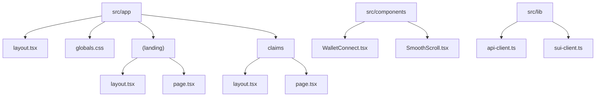
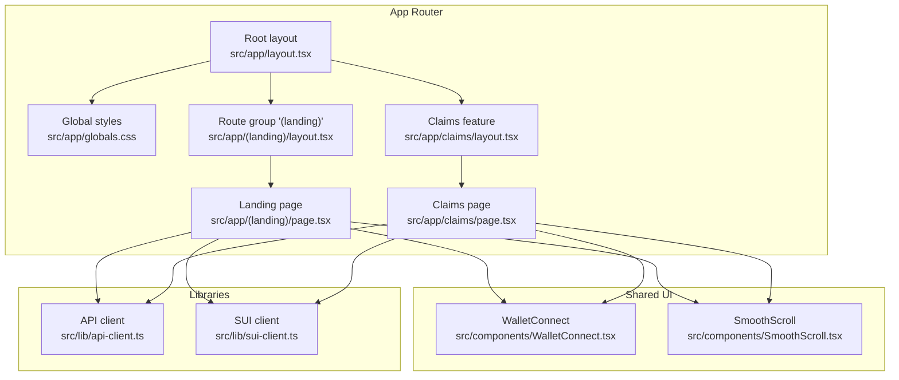
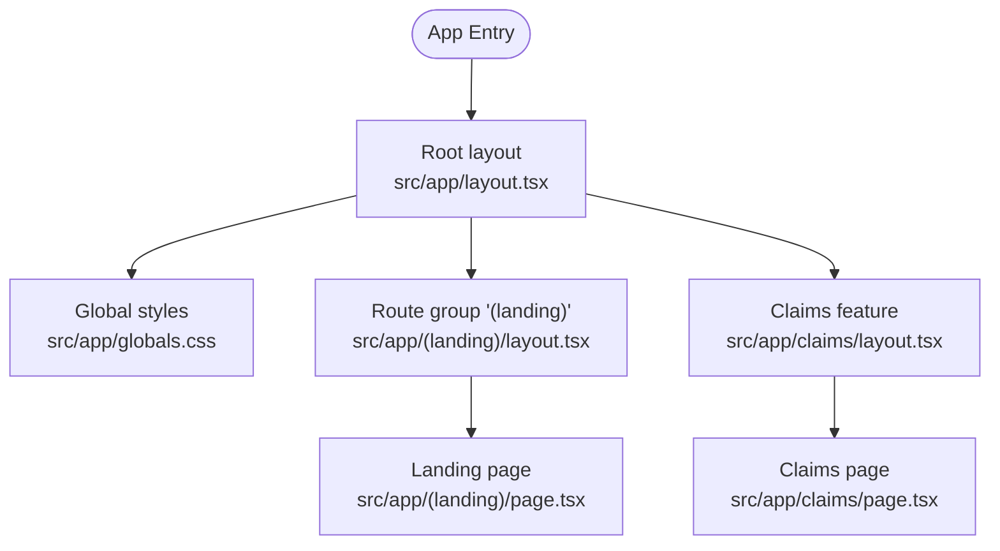
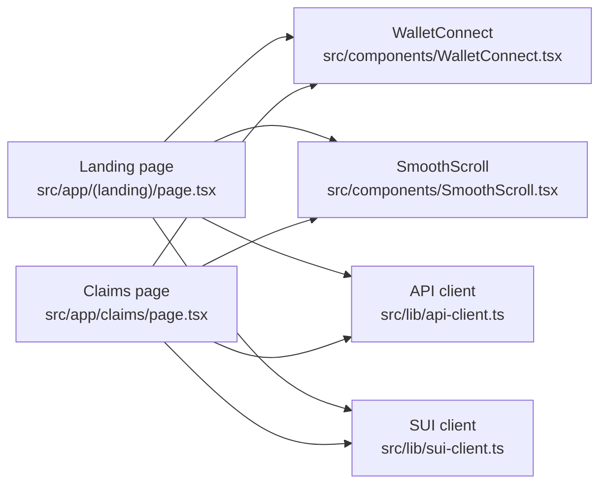

# Application Structure & Architecture

<cite>
**Referenced Files in This Document**
- [frontend/next.config.ts](file://frontend/next.config.ts)
- [frontend/tsconfig.json](file://frontend/tsconfig.json)
- [frontend/package.json](file://frontend/package.json)
- [frontend/src/app/layout.tsx](file://frontend/src/app/layout.tsx)
- [frontend/src/app/globals.css](file://frontend/src/app/globals.css)
- [frontend/src/app/(landing)/layout.tsx](file://frontend/src/app/(landing)/layout.tsx)
- [frontend/src/app/(landing)/page.tsx](file://frontend/src/app/(landing)/page.tsx)
- [frontend/src/app/claims/layout.tsx](file://frontend/src/app/claims/layout.tsx)
- [frontend/src/app/claims/page.tsx](file://frontend/src/app/claims/page.tsx)
- [frontend/src/components/WalletConnect.tsx](file://frontend/src/components/WalletConnect.tsx)
- [frontend/src/components/SmoothScroll.tsx](file://frontend/src/components/SmoothScroll.tsx)
- [frontend/src/lib/api-client.ts](file://frontend/src/lib/api-client.ts)
- [frontend/src/lib/sui-client.ts](file://frontend/src/lib/sui-client.ts)
</cite>

## Table of Contents
1. [Introduction](#introduction)
2. [Project Structure](#project-structure)
3. [Core Components](#core-components)
4. [Architecture Overview](#architecture-overview)
5. [Detailed Component Analysis](#detailed-component-analysis)
6. [Dependency Analysis](#dependency-analysis)
7. [Performance Considerations](#performance-considerations)
8. [Troubleshooting Guide](#troubleshooting-guide)
9. [Conclusion](#conclusion)
10. [Appendices](#appendices)

## Introduction
This document explains the Insurix Next.js application structure and architecture with a focus on the App Router organization, route groups, layout hierarchy, and component composition patterns. It also documents project configuration (Next.js settings, TypeScript configuration, and build optimization), folder structure conventions, naming patterns, and provides guidance for creating new pages, layouts, and components following established architectural patterns.

## Project Structure
The frontend is organized under the Next.js App Router convention:
- Top-level app directory: src/app
  - Root layout and global styles define the base shell and shared styles.
  - Route groups are used to segment different areas of the application without affecting URLs.
  - Feature-specific routes (e.g., claims) have their own layout and page files.
- Shared UI components live under src/components.
- Client libraries and utilities are placed under src/lib.

**Diagram sources**
- [frontend/src/app/layout.tsx](file://frontend/src/app/layout.tsx)
- [frontend/src/app/globals.css](file://frontend/src/app/globals.css)
- [frontend/src/app/(landing)/layout.tsx](file://frontend/src/app/(landing)/layout.tsx)
- [frontend/src/app/(landing)/page.tsx](file://frontend/src/app/(landing)/page.tsx)
- [frontend/src/app/claims/layout.tsx](file://frontend/src/app/claims/layout.tsx)
- [frontend/src/app/claims/page.tsx](file://frontend/src/app/claims/page.tsx)
- [frontend/src/components/WalletConnect.tsx](file://frontend/src/components/WalletConnect.tsx)
- [frontend/src/components/SmoothScroll.tsx](file://frontend/src/components/SmoothScroll.tsx)
- [frontend/src/lib/api-client.ts](file://frontend/src/lib/api-client.ts)
- [frontend/src/lib/sui-client.ts](file://frontend/src/lib/sui-client.ts)

**Section sources**
- [frontend/src/app/layout.tsx](file://frontend/src/app/layout.tsx)
- [frontend/src/app/globals.css](file://frontend/src/app/globals.css)
- [frontend/src/app/(landing)/layout.tsx](file://frontend/src/app/(landing)/layout.tsx)
- [frontend/src/app/(landing)/page.tsx](file://frontend/src/app/(landing)/page.tsx)
- [frontend/src/app/claims/layout.tsx](file://frontend/src/app/claims/layout.tsx)
- [frontend/src/app/claims/page.tsx](file://frontend/src/app/claims/page.tsx)
- [frontend/src/components/WalletConnect.tsx](file://frontend/src/components/WalletConnect.tsx)
- [frontend/src/components/SmoothScroll.tsx](file://frontend/src/components/SmoothScroll.tsx)
- [frontend/src/lib/api-client.ts](file://frontend/src/lib/api-client.ts)
- [frontend/src/lib/sui-client.ts](file://frontend/src/lib/sui-client.ts)

## Core Components
- Root layout: Provides the top-level HTML structure and global style imports for the entire application.
- Landing route group: Encapsulates marketing/landing experience with its own layout and page.
- Claims feature: Contains a dedicated layout and page for claim-related functionality.
- Shared components: Reusable UI elements such as wallet connection and smooth scrolling behavior.
- Libraries: Centralized client modules for API interactions and blockchain connectivity.

Key responsibilities:
- Layouts compose shared chrome and navigation context.
- Pages implement route-specific content and data fetching logic.
- Components encapsulate UI and interaction concerns.
- Libraries abstract external integrations behind typed interfaces.

**Section sources**
- [frontend/src/app/layout.tsx](file://frontend/src/app/layout.tsx)
- [frontend/src/app/(landing)/layout.tsx](file://frontend/src/app/(landing)/layout.tsx)
- [frontend/src/app/(landing)/page.tsx](file://frontend/src/app/(landing)/page.tsx)
- [frontend/src/app/claims/layout.tsx](file://frontend/src/app/claims/layout.tsx)
- [frontend/src/app/claims/page.tsx](file://frontend/src/app/claims/page.tsx)
- [frontend/src/components/WalletConnect.tsx](file://frontend/src/components/WalletConnect.tsx)
- [frontend/src/components/SmoothScroll.tsx](file://frontend/src/components/SmoothScroll.tsx)
- [frontend/src/lib/api-client.ts](file://frontend/src/lib/api-client.ts)
- [frontend/src/lib/sui-client.ts](file://frontend/src/lib/sui-client.ts)

## Architecture Overview
The application follows the Next.js App Router model:
- Routes are defined by file paths within src/app.
- Route groups use parentheses directories to organize code without impacting URL segments.
- Layouts nest to provide hierarchical chrome and state sharing across nested routes.
- Global styles are applied at the root level.

**Diagram sources**
- [frontend/src/app/layout.tsx](file://frontend/src/app/layout.tsx)
- [frontend/src/app/globals.css](file://frontend/src/app/globals.css)
- [frontend/src/app/(landing)/layout.tsx](file://frontend/src/app/(landing)/layout.tsx)
- [frontend/src/app/(landing)/page.tsx](file://frontend/src/app/(landing)/page.tsx)
- [frontend/src/app/claims/layout.tsx](file://frontend/src/app/claims/layout.tsx)
- [frontend/src/app/claims/page.tsx](file://frontend/src/app/claims/page.tsx)
- [frontend/src/components/WalletConnect.tsx](file://frontend/src/components/WalletConnect.tsx)
- [frontend/src/components/SmoothScroll.tsx](file://frontend/src/components/SmoothScroll.tsx)
- [frontend/src/lib/api-client.ts](file://frontend/src/lib/api-client.ts)
- [frontend/src/lib/sui-client.ts](file://frontend/src/lib/sui-client.ts)

## Detailed Component Analysis

### App Router and Layout Hierarchy
- Root layout defines the base HTML shell and includes global CSS.
- The landing route group contains its own layout and page, isolating landing-specific chrome and metadata.
- The claims feature has a dedicated layout and page, enabling feature-scoped context and styling.

**Diagram sources**
- [frontend/src/app/layout.tsx](file://frontend/src/app/layout.tsx)
- [frontend/src/app/globals.css](file://frontend/src/app/globals.css)
- [frontend/src/app/(landing)/layout.tsx](file://frontend/src/app/(landing)/layout.tsx)
- [frontend/src/app/(landing)/page.tsx](file://frontend/src/app/(landing)/page.tsx)
- [frontend/src/app/claims/layout.tsx](file://frontend/src/app/claims/layout.tsx)
- [frontend/src/app/claims/page.tsx](file://frontend/src/app/claims/page.tsx)

**Section sources**
- [frontend/src/app/layout.tsx](file://frontend/src/app/layout.tsx)
- [frontend/src/app/(landing)/layout.tsx](file://frontend/src/app/(landing)/layout.tsx)
- [frontend/src/app/(landing)/page.tsx](file://frontend/src/app/(landing)/page.tsx)
- [frontend/src/app/claims/layout.tsx](file://frontend/src/app/claims/layout.tsx)
- [frontend/src/app/claims/page.tsx](file://frontend/src/app/claims/page.tsx)

### Shared Components
- WalletConnect: Handles wallet connection flows and exposes connection state/actions to consumers.
- SmoothScroll: Implements smooth scrolling behavior and can be composed into pages or layouts.

These components are reusable across routes and are imported where needed.

**Section sources**
- [frontend/src/components/WalletConnect.tsx](file://frontend/src/components/WalletConnect.tsx)
- [frontend/src/components/SmoothScroll.tsx](file://frontend/src/components/SmoothScroll.tsx)

### Libraries and Integrations
- api-client: Centralizes HTTP requests to backend services, providing typed methods for domain operations.
- sui-client: Encapsulates SUI blockchain interactions, exposing functions for account and transaction operations.

Pages and components should import these libraries rather than calling network or blockchain APIs directly.

**Section sources**
- [frontend/src/lib/api-client.ts](file://frontend/src/lib/api-client.ts)
- [frontend/src/lib/sui-client.ts](file://frontend/src/lib/sui-client.ts)

## Dependency Analysis
The frontend depends on:
- Next.js runtime and App Router conventions.
- Shared components for UI consistency.
- Libraries for API and blockchain integration.

**Diagram sources**
- [frontend/src/app/(landing)/page.tsx](file://frontend/src/app/(landing)/page.tsx)
- [frontend/src/app/claims/page.tsx](file://frontend/src/app/claims/page.tsx)
- [frontend/src/components/WalletConnect.tsx](file://frontend/src/components/WalletConnect.tsx)
- [frontend/src/components/SmoothScroll.tsx](file://frontend/src/components/SmoothScroll.tsx)
- [frontend/src/lib/api-client.ts](file://frontend/src/lib/api-client.ts)
- [frontend/src/lib/sui-client.ts](file://frontend/src/lib/sui-client.ts)

**Section sources**
- [frontend/src/app/(landing)/page.tsx](file://frontend/src/app/(landing)/page.tsx)
- [frontend/src/app/claims/page.tsx](file://frontend/src/app/claims/page.tsx)
- [frontend/src/components/WalletConnect.tsx](file://frontend/src/components/WalletConnect.tsx)
- [frontend/src/components/SmoothScroll.tsx](file://frontend/src/components/SmoothScroll.tsx)
- [frontend/src/lib/api-client.ts](file://frontend/src/lib/api-client.ts)
- [frontend/src/lib/sui-client.ts](file://frontend/src/lib/sui-client.ts)

## Performance Considerations
- Use Next.js App Router features like server components and streaming rendering where appropriate.
- Keep client-only logic inside components that explicitly opt into client-side execution.
- Prefer lazy loading for heavy components and libraries when possible.
- Leverage Next.js built-in optimizations such as image optimization and static generation for static content.
- Minimize bundle size by avoiding unnecessary dependencies and tree-shaking unused code.

[No sources needed since this section provides general guidance]

## Troubleshooting Guide
Common issues and resolutions:
- Routing errors: Ensure route files follow App Router conventions (page.tsx for routes, layout.tsx for layouts).
- Missing dependencies: Verify package installations and workspace configurations.
- Build failures: Check TypeScript configuration and ensure all types are correctly referenced.
- Network calls: Validate API endpoints and environment variables for backend connectivity.
- Blockchain interactions: Confirm wallet availability and correct network configuration.

**Section sources**
- [frontend/package.json](file://frontend/package.json)
- [frontend/tsconfig.json](file://frontend/tsconfig.json)
- [frontend/next.config.ts](file://frontend/next.config.ts)

## Conclusion
The Insurix Next.js application leverages the App Router for clean routing, route groups for logical separation, and a layered component architecture for reusability. Configuration files centralize build and type settings, while libraries abstract external integrations. Following the documented patterns ensures consistent development, maintainable code, and optimal performance.

[No sources needed since this section summarizes without analyzing specific files]

## Appendices

### Project Configuration
- Next.js configuration: Defines build options, bundling behavior, and runtime settings.
- TypeScript configuration: Sets compiler options, module resolution, and path mappings.
- Package management: Declares dependencies, scripts, and workspace settings.

**Section sources**
- [frontend/next.config.ts](file://frontend/next.config.ts)
- [frontend/tsconfig.json](file://frontend/tsconfig.json)
- [frontend/package.json](file://frontend/package.json)

### Creating New Pages, Layouts, and Components
- New page: Add a page.tsx file under the desired route directory. For grouped routes, place it within the corresponding parentheses directory.
- New layout: Create a layout.tsx file next to the page or route group to share chrome and context.
- New component: Place reusable UI in src/components and import where needed.
- New library: Add modules under src/lib and export typed interfaces for consumers.

Follow naming conventions:
- Pages: page.tsx
- Layouts: layout.tsx
- Components: PascalCase.tsx
- Libraries: kebab-case.ts or tsx

**Section sources**
- [frontend/src/app/(landing)/page.tsx](file://frontend/src/app/(landing)/page.tsx)
- [frontend/src/app/(landing)/layout.tsx](file://frontend/src/app/(landing)/layout.tsx)
- [frontend/src/app/claims/page.tsx](file://frontend/src/app/claims/page.tsx)
- [frontend/src/app/claims/layout.tsx](file://frontend/src/app/claims/layout.tsx)
- [frontend/src/components/WalletConnect.tsx](file://frontend/src/components/WalletConnect.tsx)
- [frontend/src/components/SmoothScroll.tsx](file://frontend/src/components/SmoothScroll.tsx)
- [frontend/src/lib/api-client.ts](file://frontend/src/lib/api-client.ts)
- [frontend/src/lib/sui-client.ts](file://frontend/src/lib/sui-client.ts)