# Frontend Dashboard System

<cite>
**Referenced Files in This Document**
- [layout.tsx](file://frontend/src/app/layout.tsx)
- [app-layout.tsx](file://frontend/src/app/(app)/layout.tsx)
- [landing-layout.tsx](file://frontend/src/app/(landing)/layout.tsx)
- [api-client.ts](file://frontend/src/lib/api-client.ts)
- [sui-client.ts](file://frontend/src/lib/sui-client.ts)
- [wallet-connect.tsx](file://frontend/src/components/WalletConnect.tsx)
- [smooth-scroll.tsx](file://frontend/src/components/SmoothScroll.tsx)
- [claims-page.tsx](file://frontend/src/app/claims/page.tsx)
- [claims-detail-client.tsx](file://frontend/src/app/claims/[id]/claim-detail-client.tsx)
- [admin-page.tsx](file://frontend/src/app/admin/page.tsx)
- [package.json](file://frontend/package.json)
</cite>

## Table of Contents
1. [Introduction](#introduction)
2. [Project Structure](#project-structure)
3. [Core Components](#core-components)
4. [Architecture Overview](#architecture-overview)
5. [Detailed Component Analysis](#detailed-component-analysis)
6. [Dependency Analysis](#dependency-analysis)
7. [Performance Considerations](#performance-considerations)
8. [Troubleshooting Guide](#troubleshooting-guide)
9. [Conclusion](#conclusion)

## Introduction

The Insurix Frontend Dashboard System is a modern web application built with Next.js that serves as the user interface for an insurance platform integrated with blockchain technology. The system provides a comprehensive dashboard for managing insurance claims, administrative functions, and user interactions with the Sui blockchain network.

The frontend architecture follows Next.js App Router conventions, implementing a modular component-based design that separates public landing pages from authenticated application interfaces. It integrates with both REST APIs for business logic and the Sui blockchain for decentralized operations.

## Project Structure

The frontend application follows a well-organized directory structure that separates concerns between different functional areas:

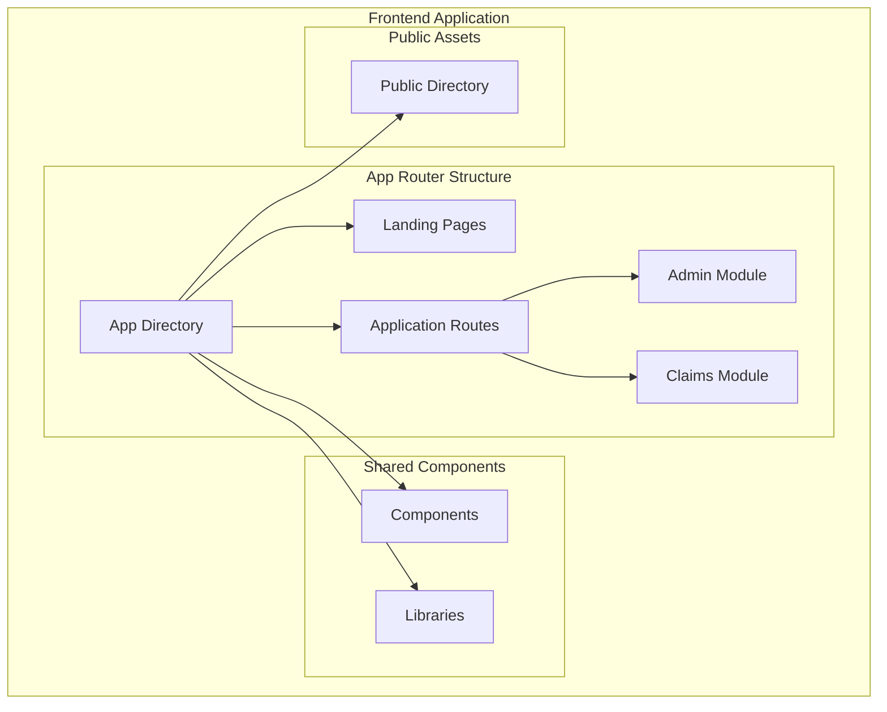

**Diagram sources**
- [layout.tsx:1-50](file://frontend/src/app/layout.tsx#L1-L50)
- [app-layout.tsx:1-30](file://frontend/src/app/(app)/layout.tsx#L1-L30)

The application implements a dual-route structure:
- **Landing Pages**: Public-facing marketing and informational content
- **Application Routes**: Authenticated dashboard functionality
- **Admin Module**: Administrative controls and oversight
- **Claims Module**: Core insurance claim management workflow

**Section sources**
- [layout.tsx:1-100](file://frontend/src/app/layout.tsx#L1-L100)
- [app-layout.tsx:1-50](file://frontend/src/app/(app)/layout.tsx#L1-L50)

## Core Components

### Layout Architecture

The application uses a hierarchical layout system that provides consistent styling and behavior across different sections:

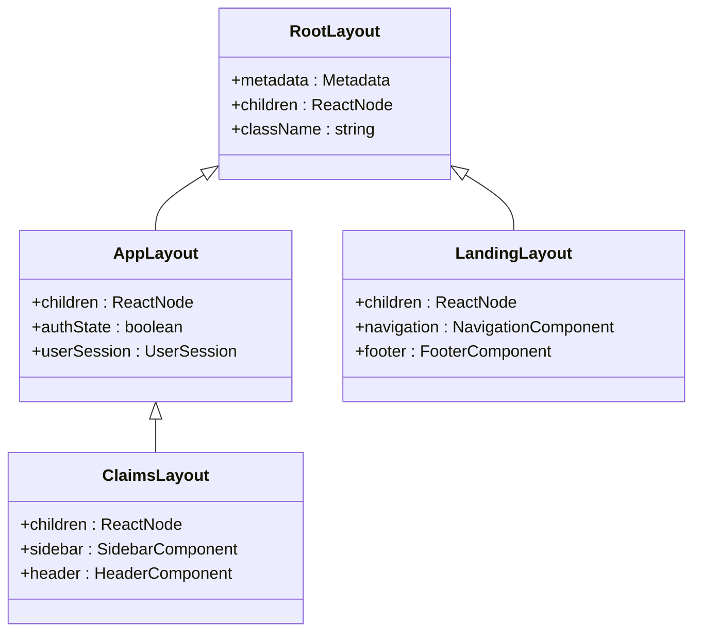

**Diagram sources**
- [layout.tsx:1-80](file://frontend/src/app/layout.tsx#L1-L80)
- [app-layout.tsx:1-60](file://frontend/src/app/(app)/layout.tsx#L1-L60)

### API Client Layer

The API client provides a centralized communication layer with the backend services:

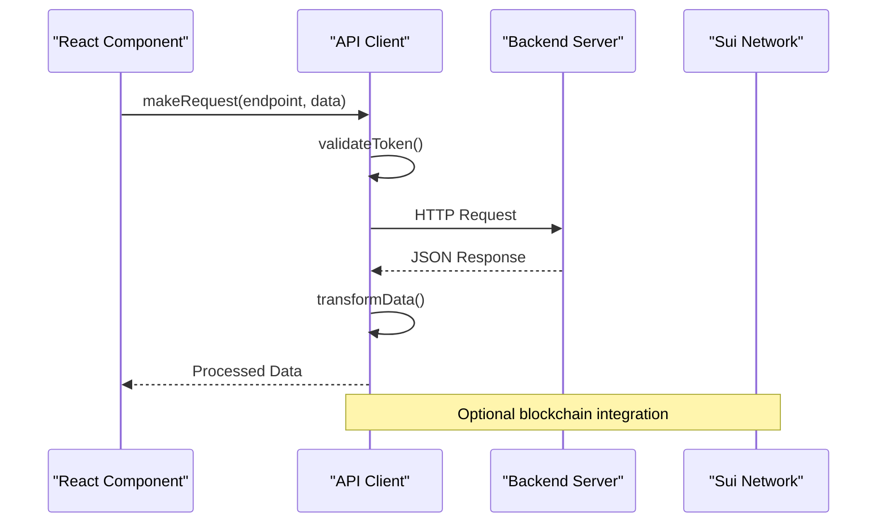

**Diagram sources**
- [api-client.ts:1-150](file://frontend/src/lib/api-client.ts#L1-L150)

### Wallet Integration

The wallet connection component manages blockchain authentication and transaction signing:

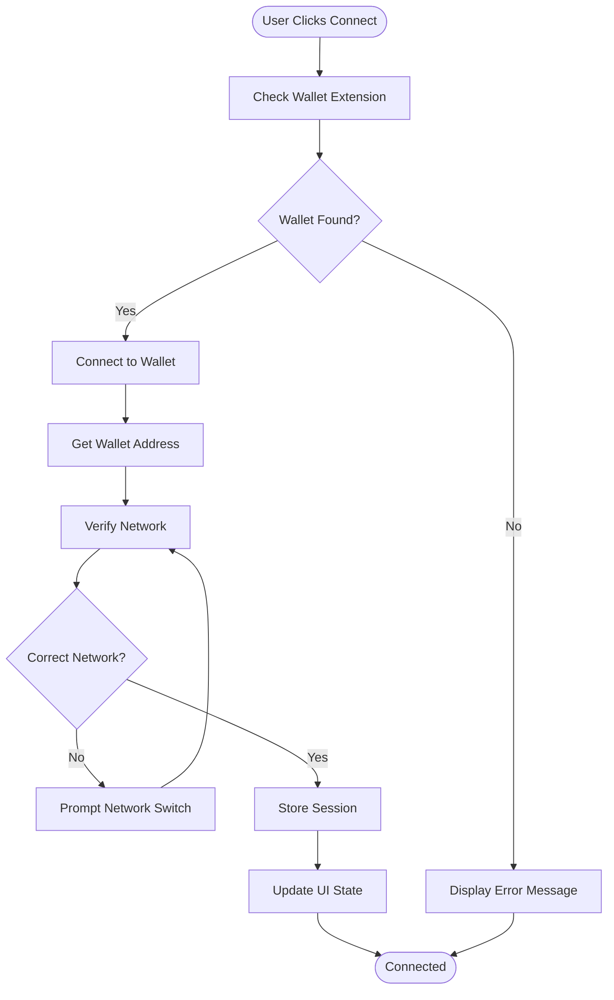

**Diagram sources**
- [wallet-connect.tsx:1-200](file://frontend/src/components/WalletConnect.tsx#L1-L200)
- [sui-client.ts:1-100](file://frontend/src/lib/sui-client.ts#L1-L100)

**Section sources**
- [api-client.ts:1-200](file://frontend/src/lib/api-client.ts#L1-L200)
- [sui-client.ts:1-150](file://frontend/src/lib/sui-client.ts#L1-L150)
- [wallet-connect.tsx:1-250](file://frontend/src/components/WalletConnect.tsx#L1-L250)

## Architecture Overview

The frontend architecture follows a layered approach with clear separation of concerns:

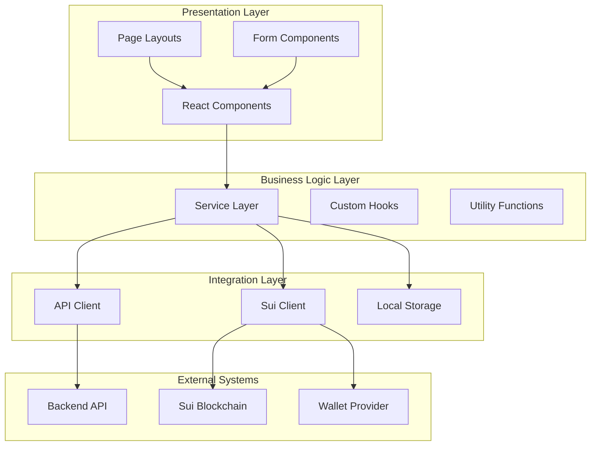

**Diagram sources**
- [api-client.ts:1-100](file://frontend/src/lib/api-client.ts#L1-L100)
- [sui-client.ts:1-80](file://frontend/src/lib/sui-client.ts#L1-L80)

### Data Flow Architecture

The application implements a unidirectional data flow pattern:

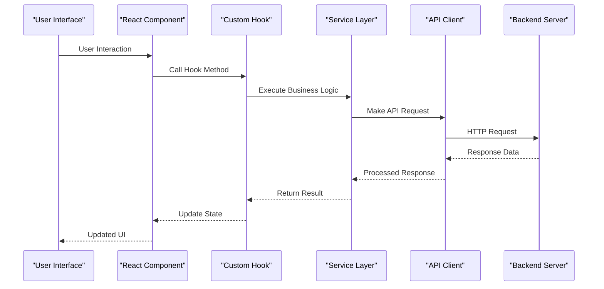

**Diagram sources**
- [api-client.ts:1-120](file://frontend/src/lib/api-client.ts#L1-L120)

## Detailed Component Analysis

### Claims Management System

The claims module provides comprehensive insurance claim lifecycle management:

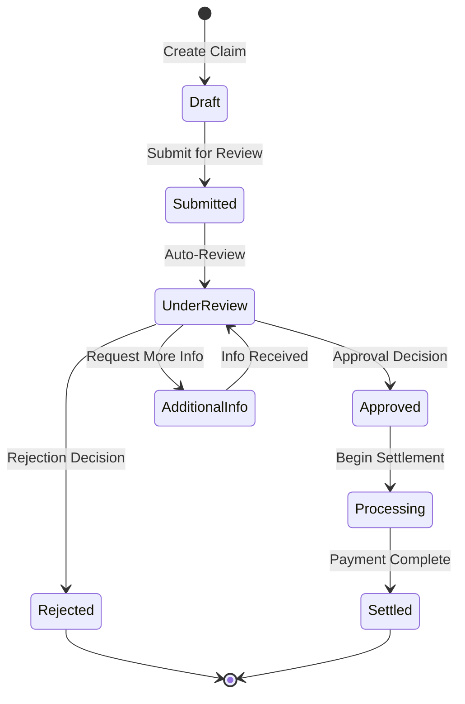

**Diagram sources**
- [claims-page.tsx:1-300](file://frontend/src/app/claims/page.tsx#L1-L300)
- [claim-detail-client.tsx:1-250](file://frontend/src/app/claims/[id]/claim-detail-client.tsx#L1-L250)

### Admin Dashboard

The administrative interface provides oversight and control capabilities:

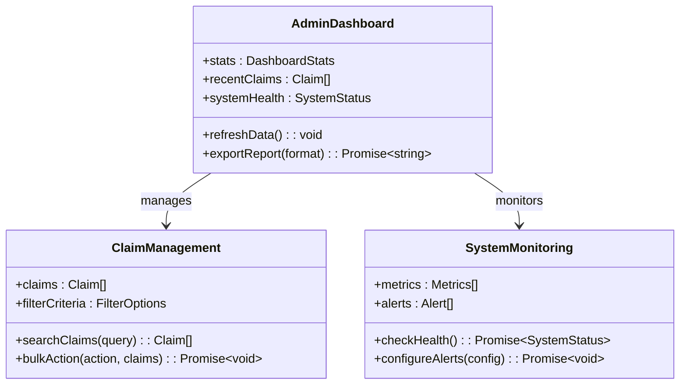

**Diagram sources**
- [admin-page.tsx:1-200](file://frontend/src/app/admin/page.tsx#L1-L200)

### Landing Page Components

The landing page features interactive 3D elements and responsive design:

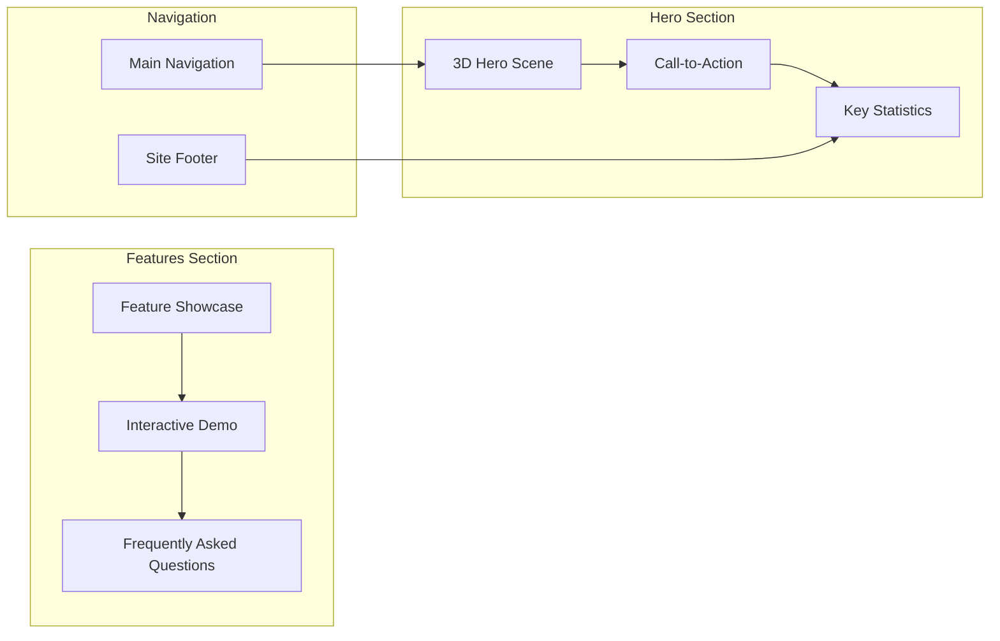

**Diagram sources**
- [hero-section.tsx:1-150](file://frontend/src/app/(landing)/components/HeroSection.tsx#L1-L150)
- [features-section.tsx:1-120](file://frontend/src/app/(landing)/components/FeaturesSection.tsx#L1-L120)

**Section sources**
- [claims-page.tsx:1-400](file://frontend/src/app/claims/page.tsx#L1-L400)
- [claim-detail-client.tsx:1-300](file://frontend/src/app/claims/[id]/claim-detail-client.tsx#L1-L300)
- [admin-page.tsx:1-250](file://frontend/src/app/admin/page.tsx#L1-L250)

## Dependency Analysis

The frontend application maintains clear dependency relationships:

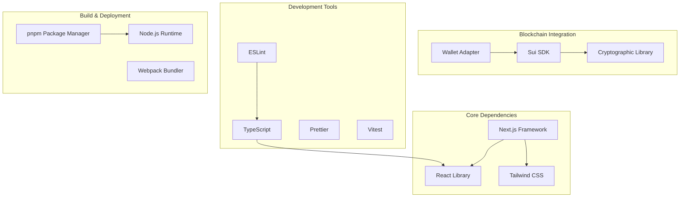

**Diagram sources**
- [package.json:1-100](file://frontend/package.json#L1-L100)

### External Service Dependencies

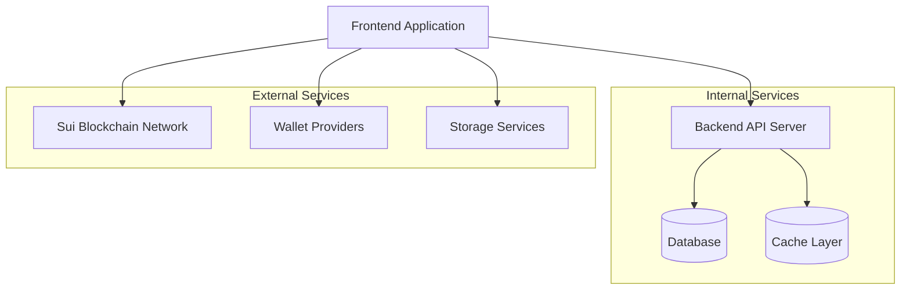

**Diagram sources**
- [api-client.ts:1-80](file://frontend/src/lib/api-client.ts#L1-L80)
- [sui-client.ts:1-60](file://frontend/src/lib/sui-client.ts#L1-L60)

**Section sources**
- [package.json:1-150](file://frontend/package.json#L1-L150)

## Performance Considerations

The frontend implementation includes several performance optimization strategies:

### Code Splitting and Lazy Loading

The application leverages Next.js automatic code splitting to optimize bundle size and loading performance. Components are loaded on-demand, reducing initial payload size.

### State Management Optimization

Efficient state management patterns are implemented to minimize re-renders and optimize memory usage:

- **Local State**: Component-level state for UI-only data
- **Global State**: Centralized state for cross-component data sharing
- **Server State**: Optimistic updates with background synchronization

### Asset Optimization

- **Image Optimization**: Automatic image resizing and format conversion
- **Font Loading**: Efficient font loading strategies
- **Static Asset Caching**: Proper caching headers for static resources

### Network Optimization

- **Request Deduplication**: Preventing duplicate API calls
- **Caching Strategies**: Multi-layer caching for improved response times
- **Compression**: Gzip/Brotli compression for API responses

## Troubleshooting Guide

### Common Issues and Solutions

#### Wallet Connection Problems

**Issue**: Wallet extension not detected
**Solution**: Ensure wallet extension is installed and enabled
**Debug Steps**:
1. Check browser console for error messages
2. Verify wallet extension is active
3. Confirm correct network configuration

#### API Communication Errors

**Issue**: Network requests failing
**Solution**: Verify backend server availability and CORS configuration
**Debug Steps**:
1. Check network tab in browser developer tools
2. Validate API endpoint URLs
3. Verify authentication tokens

#### Blockchain Transaction Failures

**Issue**: Transactions not executing properly
**Solution**: Check network connectivity and gas fees
**Debug Steps**:
1. Verify Sui network status
2. Check wallet balance for gas fees
3. Review transaction parameters

### Development Environment Setup

**Prerequisites**:
- Node.js (LTS version recommended)
- pnpm package manager
- Modern web browser with wallet extension

**Setup Commands**:
```bash
pnpm install
pnpm dev
```

**Environment Variables**:
- `NEXT_PUBLIC_API_URL`: Backend API endpoint
- `NEXT_PUBLIC_SUI_NETWORK`: Sui network configuration
- `NEXT_PUBLIC_WALLET_CONFIG`: Wallet provider settings

**Section sources**
- [api-client.ts:1-200](file://frontend/src/lib/api-client.ts#L1-L200)
- [sui-client.ts:1-150](file://frontend/src/lib/sui-client.ts#L1-L150)

## Conclusion

The Insurix Frontend Dashboard System represents a modern, scalable web application architecture that successfully bridges traditional web technologies with blockchain capabilities. The system demonstrates best practices in Next.js development, including proper component organization, efficient state management, and robust error handling.

Key strengths of the implementation include:

- **Modular Architecture**: Clear separation of concerns with reusable components
- **Blockchain Integration**: Seamless integration with Sui blockchain for decentralized operations
- **Responsive Design**: Mobile-first approach ensuring accessibility across devices
- **Performance Optimization**: Comprehensive strategies for optimal loading and runtime performance
- **Developer Experience**: Well-documented codebase with TypeScript support and modern tooling

The system provides a solid foundation for insurance industry applications, offering both user-friendly interfaces and powerful administrative capabilities while maintaining security and reliability through blockchain integration.

Future enhancements could include advanced analytics dashboards, real-time collaboration features, and expanded blockchain interoperability with other networks.