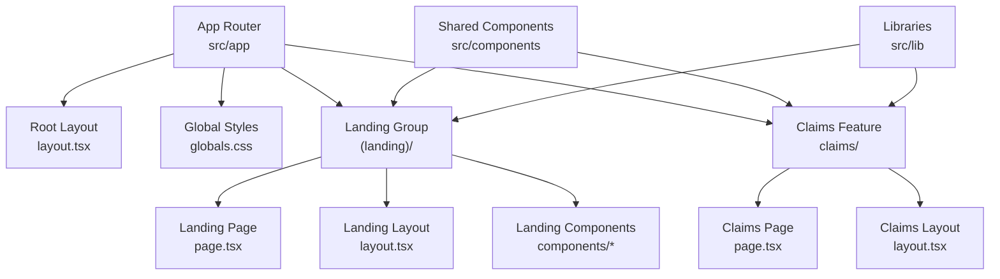
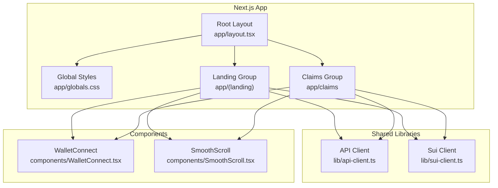
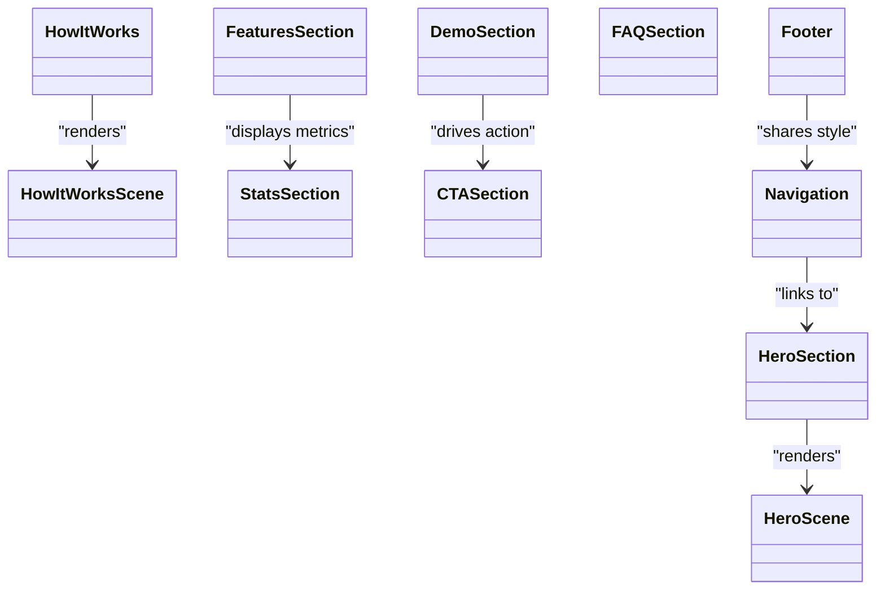
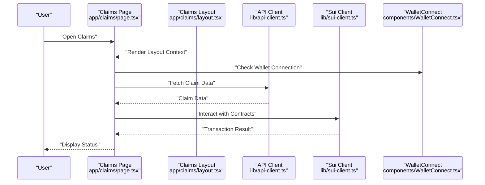
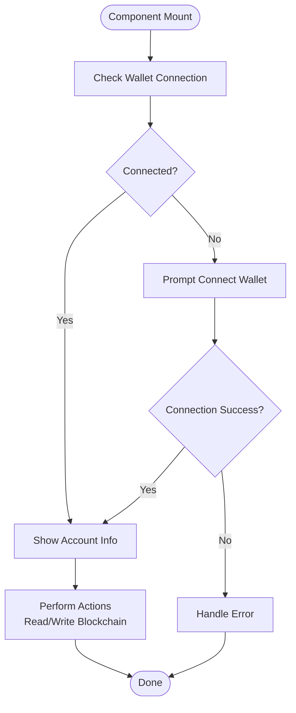
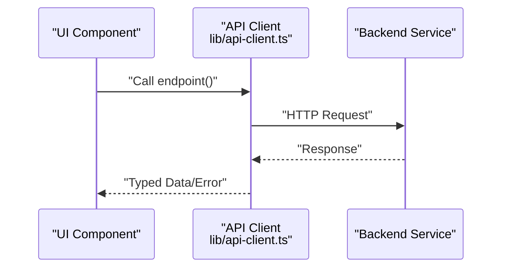
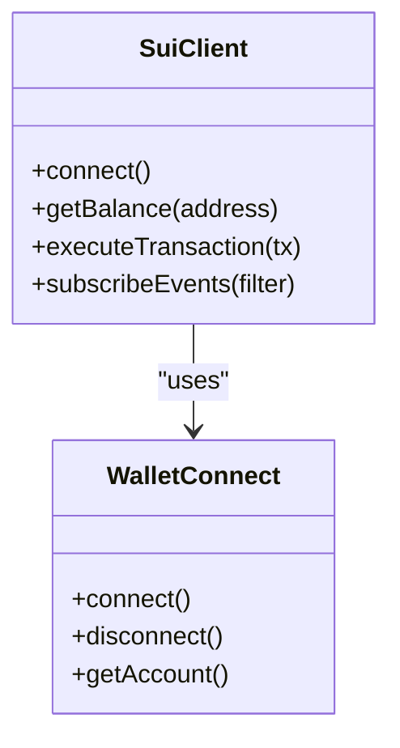
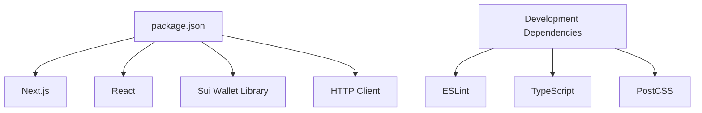

# Frontend Application

<cite>
**Referenced Files in This Document**
- [frontend/README.md](file://frontend/README.md)
- [frontend/package.json](file://frontend/package.json)
- [frontend/next.config.ts](file://frontend/next.config.ts)
- [frontend/tsconfig.json](file://frontend/tsconfig.json)
- [frontend/src/app/layout.tsx](file://frontend/src/app/layout.tsx)
- [frontend/src/app/globals.css](file://frontend/src/app/globals.css)
- [frontend/src/app/(landing)/layout.tsx](file://frontend/src/app/(landing)/layout.tsx)
- [frontend/src/app/(landing)/page.tsx](file://frontend/src/app/(landing)/page.tsx)
- [frontend/src/app/(landing)/components/HeroSection.tsx](file://frontend/src/app/(landing)/components/HeroSection.tsx)
- [frontend/src/app/(landing)/components/HeroScene.tsx](file://frontend/src/app/(landing)/components/HeroScene.tsx)
- [frontend/src/app/(landing)/components/FeaturesSection.tsx](file://frontend/src/app/(landing)/components/FeaturesSection.tsx)
- [frontend/src/app/(landing)/components/DemoSection.tsx](file://frontend/src/app/(landing)/components/DemoSection.tsx)
- [frontend/src/app/(landing)/components/HowItWorks.tsx](file://frontend/src/app/(landing)/components/HowItWorks.tsx)
- [frontend/src/app/(landing)/components/HowItWorksScene.tsx](file://frontend/src/app/(landing)/components/HowItWorksScene.tsx)
- [frontend/src/app/(landing)/components/StatsSection.tsx](file://frontend/src/app/(landing)/components/StatsSection.tsx)
- [frontend/src/app/(landing)/components/FAQSection.tsx](file://frontend/src/app/(landing)/components/FAQSection.tsx)
- [frontend/src/app/(landing)/components/CTASection.tsx](file://frontend/src/app/(landing)/components/CTASection.tsx)
- [frontend/src/app/(landing)/components/Footer.tsx](file://frontend/src/app/(landing)/components/Footer.tsx)
- [frontend/src/app/(landing)/components/Navigation.tsx](file://frontend/src/app/(landing)/components/Navigation.tsx)
- [frontend/src/app/claims/layout.tsx](file://frontend/src/app/claims/layout.tsx)
- [frontend/src/app/claims/page.tsx](file://frontend/src/app/claims/page.tsx)
- [frontend/src/components/WalletConnect.tsx](file://frontend/src/components/WalletConnect.tsx)
- [frontend/src/components/SmoothScroll.tsx](file://frontend/src/components/SmoothScroll.tsx)
- [frontend/src/lib/api-client.ts](file://frontend/src/lib/api-client.ts)
- [frontend/src/lib/sui-client.ts](file://frontend/src/lib/sui-client.ts)
</cite>

## Table of Contents
1. [Introduction](#introduction)
2. [Project Structure](#project-structure)
3. [Core Components](#core-components)
4. [Architecture Overview](#architecture-overview)
5. [Detailed Component Analysis](#detailed-component-analysis)
6. [Dependency Analysis](#dependency-analysis)
7. [Performance Considerations](#performance-considerations)
8. [Troubleshooting Guide](#troubleshooting-guide)
9. [Conclusion](#conclusion)
10. [Appendices](#appendices)

## Introduction
This document provides comprehensive frontend application documentation for the Insurix Next.js web interface. It explains the application structure using the Next.js App Router, component architecture, and state management patterns. It also details wallet connectivity via Sui wallet integration, the API client for backend communication, and utilities for interacting with the Sui blockchain. The guide covers UI components, responsive design patterns, accessibility compliance, routing structure, page components, layout organization, guidelines for adding new features, styling with CSS, and performance optimization techniques.

## Project Structure
The frontend is organized under the frontend directory and follows the Next.js App Router conventions:
- app/: Contains route groups and pages.
  - (landing)/: Landing page group with its own layout and page.
  - claims/: Claims feature with its own layout and page.
  - layout.tsx: Root layout shared across all routes.
  - globals.css: Global styles applied site-wide.
- components/: Reusable UI components such as WalletConnect and SmoothScroll.
- lib/: Utility modules including the API client and Sui client.
- public/: Static assets served by Next.js.

**Diagram sources**
- [frontend/src/app/layout.tsx](file://frontend/src/app/layout.tsx)
- [frontend/src/app/globals.css](file://frontend/src/app/globals.css)
- [frontend/src/app/(landing)/layout.tsx](file://frontend/src/app/(landing)/layout.tsx)
- [frontend/src/app/(landing)/page.tsx](file://frontend/src/app/(landing)/page.tsx)
- [frontend/src/app/claims/layout.tsx](file://frontend/src/app/claims/layout.tsx)
- [frontend/src/app/claims/page.tsx](file://frontend/src/app/claims/page.tsx)

**Section sources**
- [frontend/README.md](file://frontend/README.md)
- [frontend/package.json](file://frontend/package.json)
- [frontend/next.config.ts](file://frontend/next.config.ts)
- [frontend/tsconfig.json](file://frontend/tsconfig.json)

## Core Components
Key reusable components include:
- WalletConnect: Handles Sui wallet connection and user session state.
- SmoothScroll: Provides smooth scrolling behavior for anchor links and navigation.

These components are designed to be framework-agnostic within React and can be composed across landing and claims sections.

**Section sources**
- [frontend/src/components/WalletConnect.tsx](file://frontend/src/components/WalletConnect.tsx)
- [frontend/src/components/SmoothScroll.tsx](file://frontend/src/components/SmoothScroll.tsx)

## Architecture Overview
The frontend uses the Next.js App Router for file-based routing and server-side rendering where applicable. The root layout defines global providers and styles, while route groups encapsulate specific features like the landing experience and claims workflow. Shared libraries abstract backend API calls and Sui blockchain interactions, enabling clean separation between UI and data access layers.

**Diagram sources**
- [frontend/src/app/layout.tsx](file://frontend/src/app/layout.tsx)
- [frontend/src/app/globals.css](file://frontend/src/app/globals.css)
- [frontend/src/app/(landing)/layout.tsx](file://frontend/src/app/(landing)/layout.tsx)
- [frontend/src/app/(landing)/page.tsx](file://frontend/src/app/(landing)/page.tsx)
- [frontend/src/app/claims/layout.tsx](file://frontend/src/app/claims/layout.tsx)
- [frontend/src/app/claims/page.tsx](file://frontend/src/app/claims/page.tsx)
- [frontend/src/lib/api-client.ts](file://frontend/src/lib/api-client.ts)
- [frontend/src/lib/sui-client.ts](file://frontend/src/lib/sui-client.ts)
- [frontend/src/components/WalletConnect.tsx](file://frontend/src/components/WalletConnect.tsx)
- [frontend/src/components/SmoothScroll.tsx](file://frontend/src/components/SmoothScroll.tsx)

## Detailed Component Analysis

### Landing Page Components
The landing section is composed of multiple focused components that collectively present product information, interactive demos, and calls-to-action. Each component encapsulates a specific domain concern and can be independently tested and styled.

**Diagram sources**
- [frontend/src/app/(landing)/components/HeroSection.tsx](file://frontend/src/app/(landing)/components/HeroSection.tsx)
- [frontend/src/app/(landing)/components/HeroScene.tsx](file://frontend/src/app/(landing)/components/HeroScene.tsx)
- [frontend/src/app/(landing)/components/FeaturesSection.tsx](file://frontend/src/app/(landing)/components/FeaturesSection.tsx)
- [frontend/src/app/(landing)/components/DemoSection.tsx](file://frontend/src/app/(landing)/components/DemoSection.tsx)
- [frontend/src/app/(landing)/components/HowItWorks.tsx](file://frontend/src/app/(landing)/components/HowItWorks.tsx)
- [frontend/src/app/(landing)/components/HowItWorksScene.tsx](file://frontend/src/app/(landing)/components/HowItWorksScene.tsx)
- [frontend/src/app/(landing)/components/StatsSection.tsx](file://frontend/src/app/(landing)/components/StatsSection.tsx)
- [frontend/src/app/(landing)/components/FAQSection.tsx](file://frontend/src/app/(landing)/components/FAQSection.tsx)
- [frontend/src/app/(landing)/components/CTASection.tsx](file://frontend/src/app/(landing)/components/CTASection.tsx)
- [frontend/src/app/(landing)/components/Footer.tsx](file://frontend/src/app/(landing)/components/Footer.tsx)
- [frontend/src/app/(landing)/components/Navigation.tsx](file://frontend/src/app/(landing)/components/Navigation.tsx)

**Section sources**
- [frontend/src/app/(landing)/page.tsx](file://frontend/src/app/(landing)/page.tsx)
- [frontend/src/app/(landing)/layout.tsx](file://frontend/src/app/(landing)/layout.tsx)
- [frontend/src/app/(landing)/components/HeroSection.tsx](file://frontend/src/app/(landing)/components/HeroSection.tsx)
- [frontend/src/app/(landing)/components/HeroScene.tsx](file://frontend/src/app/(landing)/components/HeroScene.tsx)
- [frontend/src/app/(landing)/components/FeaturesSection.tsx](file://frontend/src/app/(landing)/components/FeaturesSection.tsx)
- [frontend/src/app/(landing)/components/DemoSection.tsx](file://frontend/src/app/(landing)/components/DemoSection.tsx)
- [frontend/src/app/(landing)/components/HowItWorks.tsx](file://frontend/src/app/(landing)/components/HowItWorks.tsx)
- [frontend/src/app/(landing)/components/HowItWorksScene.tsx](file://frontend/src/app/(landing)/components/HowItWorksScene.tsx)
- [frontend/src/app/(landing)/components/StatsSection.tsx](file://frontend/src/app/(landing)/components/StatsSection.tsx)
- [frontend/src/app/(landing)/components/FAQSection.tsx](file://frontend/src/app/(landing)/components/FAQSection.tsx)
- [frontend/src/app/(landing)/components/CTASection.tsx](file://frontend/src/app/(landing)/components/CTASection.tsx)
- [frontend/src/app/(landing)/components/Footer.tsx](file://frontend/src/app/(landing)/components/Footer.tsx)
- [frontend/src/app/(landing)/components/Navigation.tsx](file://frontend/src/app/(landing)/components/Navigation.tsx)

### Claims Feature
The claims feature includes a dedicated layout and page component. It likely orchestrates claim creation, status tracking, and interactions with backend services and the Sui blockchain through the shared libraries.

**Diagram sources**
- [frontend/src/app/claims/page.tsx](file://frontend/src/app/claims/page.tsx)
- [frontend/src/app/claims/layout.tsx](file://frontend/src/app/claims/layout.tsx)
- [frontend/src/lib/api-client.ts](file://frontend/src/lib/api-client.ts)
- [frontend/src/lib/sui-client.ts](file://frontend/src/lib/sui-client.ts)
- [frontend/src/components/WalletConnect.tsx](file://frontend/src/components/WalletConnect.tsx)

**Section sources**
- [frontend/src/app/claims/page.tsx](file://frontend/src/app/claims/page.tsx)
- [frontend/src/app/claims/layout.tsx](file://frontend/src/app/claims/layout.tsx)

### Wallet Connectivity Implementation
WalletConnect encapsulates Sui wallet integration, handling connection prompts, account discovery, and transaction signing flows. It exposes hooks or methods to check connection status and trigger actions like sending transactions or reading balances.

**Diagram sources**
- [frontend/src/components/WalletConnect.tsx](file://frontend/src/components/WalletConnect.tsx)
- [frontend/src/lib/sui-client.ts](file://frontend/src/lib/sui-client.ts)

**Section sources**
- [frontend/src/components/WalletConnect.tsx](file://frontend/src/components/WalletConnect.tsx)
- [frontend/src/lib/sui-client.ts](file://frontend/src/lib/sui-client.ts)

### API Client for Backend Communication
The API client centralizes HTTP requests to the backend, providing typed methods for endpoints related to claims, attestations, and other business operations. It handles error responses, retries, and request configuration.

**Diagram sources**
- [frontend/src/lib/api-client.ts](file://frontend/src/lib/api-client.ts)

**Section sources**
- [frontend/src/lib/api-client.ts](file://frontend/src/lib/api-client.ts)

### Sui Blockchain Interaction Utilities
The Sui client abstracts interactions with the Sui blockchain, including reading state, executing transactions, and handling events. It integrates with WalletConnect to sign transactions and manage accounts.

**Diagram sources**
- [frontend/src/lib/sui-client.ts](file://frontend/src/lib/sui-client.ts)
- [frontend/src/components/WalletConnect.tsx](file://frontend/src/components/WalletConnect.tsx)

**Section sources**
- [frontend/src/lib/sui-client.ts](file://frontend/src/lib/sui-client.ts)
- [frontend/src/components/WalletConnect.tsx](file://frontend/src/components/WalletConnect.tsx)

## Dependency Analysis
The frontend dependencies are defined in package.json and managed via pnpm. Key runtime dependencies include Next.js, React, and libraries for Sui wallet integration and HTTP clients. Development dependencies cover linting, TypeScript, and build tooling.

**Diagram sources**
- [frontend/package.json](file://frontend/package.json)

**Section sources**
- [frontend/package.json](file://frontend/package.json)

## Performance Considerations
- Use Next.js App Router benefits like server-side rendering and static generation where appropriate to reduce client-side load.
- Implement code splitting at route and component levels to minimize bundle size.
- Optimize images and assets; leverage Next.js image optimization.
- Debounce or throttle expensive operations like blockchain queries and network requests.
- Utilize Suspense and streaming for better perceived performance.
- Avoid unnecessary re-renders by memoizing components and using proper state management patterns.

[No sources needed since this section provides general guidance]

## Troubleshooting Guide
Common issues and resolutions:
- Wallet connection failures: Ensure the Sui wallet extension is installed and enabled. Verify network configuration matches the expected Sui network.
- API errors: Check CORS settings on the backend and ensure correct base URLs. Inspect network tab for failed requests and validate response payloads.
- Transaction errors: Validate input parameters and gas limits. Confirm the connected wallet has sufficient funds and permissions.
- Styling conflicts: Review global styles and component-specific CSS to avoid overrides. Use CSS modules or scoped styles when necessary.

**Section sources**
- [frontend/src/components/WalletConnect.tsx](file://frontend/src/components/WalletConnect.tsx)
- [frontend/src/lib/api-client.ts](file://frontend/src/lib/api-client.ts)
- [frontend/src/lib/sui-client.ts](file://frontend/src/lib/sui-client.ts)
- [frontend/src/app/globals.css](file://frontend/src/app/globals.css)

## Conclusion
The Insurix frontend leverages Next.js App Router for scalable routing and modular layouts, with clear separation between UI components and data access layers. Wallet connectivity and blockchain interactions are abstracted into reusable utilities, ensuring maintainability and testability. Following the guidelines in this document will help developers extend features consistently, optimize performance, and deliver accessible, responsive experiences.

[No sources needed since this section summarizes without analyzing specific files]

## Appendices

### Routing Structure
- Root layout: Defines global providers and styles.
- Landing group: Encapsulates marketing and informational content.
- Claims feature: Dedicated route for insurance claim workflows.

**Section sources**
- [frontend/src/app/layout.tsx](file://frontend/src/app/layout.tsx)
- [frontend/src/app/(landing)/layout.tsx](file://frontend/src/app/(landing)/layout.tsx)
- [frontend/src/app/(landing)/page.tsx](file://frontend/src/app/(landing)/page.tsx)
- [frontend/src/app/claims/layout.tsx](file://frontend/src/app/claims/layout.tsx)
- [frontend/src/app/claims/page.tsx](file://frontend/src/app/claims/page.tsx)

### Adding New Features
- Create a new route group or page under app/.
- Add reusable components under components/ if they are shared across routes.
- Extend api-client.ts with new endpoints and types.
- Integrate Sui interactions via sui-client.ts and WalletConnect as needed.
- Update global styles in globals.css or add scoped styles per component.

**Section sources**
- [frontend/src/app/layout.tsx](file://frontend/src/app/layout.tsx)
- [frontend/src/app/(landing)/layout.tsx](file://frontend/src/app/(landing)/layout.tsx)
- [frontend/src/app/claims/layout.tsx](file://frontend/src/app/claims/layout.tsx)
- [frontend/src/components/WalletConnect.tsx](file://frontend/src/components/WalletConnect.tsx)
- [frontend/src/lib/api-client.ts](file://frontend/src/lib/api-client.ts)
- [frontend/src/lib/sui-client.ts](file://frontend/src/lib/sui-client.ts)
- [frontend/src/app/globals.css](file://frontend/src/app/globals.css)

### Styling with CSS
- Use Tailwind CSS classes for utility-first styling if configured.
- Apply global resets and typography in globals.css.
- Prefer component-scoped styles to avoid conflicts.
- Maintain consistent spacing and color tokens across components.

**Section sources**
- [frontend/src/app/globals.css](file://frontend/src/app/globals.css)

### Accessibility Compliance
- Ensure semantic HTML elements and proper heading hierarchy.
- Provide alt text for images and descriptive labels for interactive elements.
- Support keyboard navigation and focus management.
- Test with screen readers and accessibility tools.

[No sources needed since this section provides general guidance]