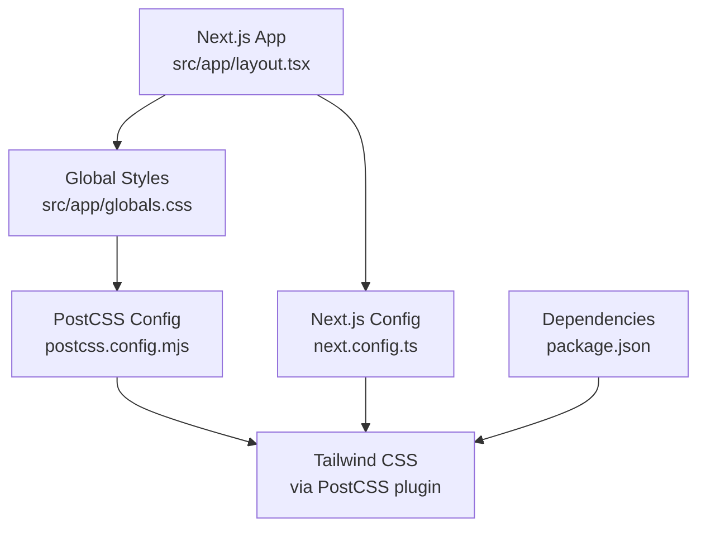
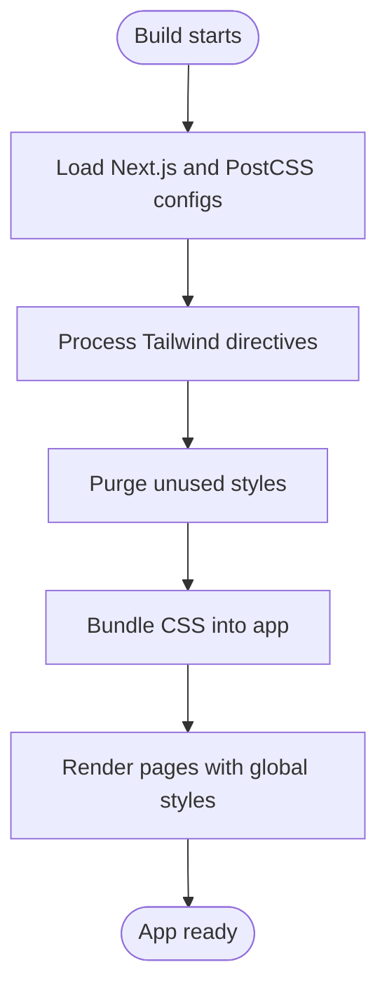
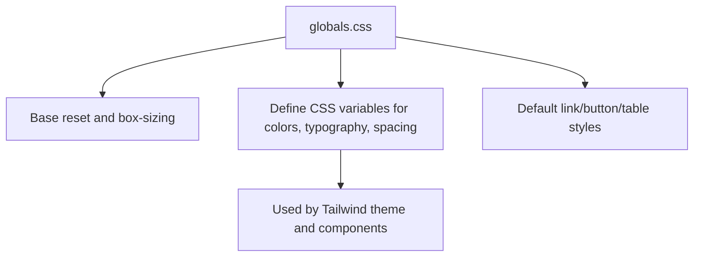
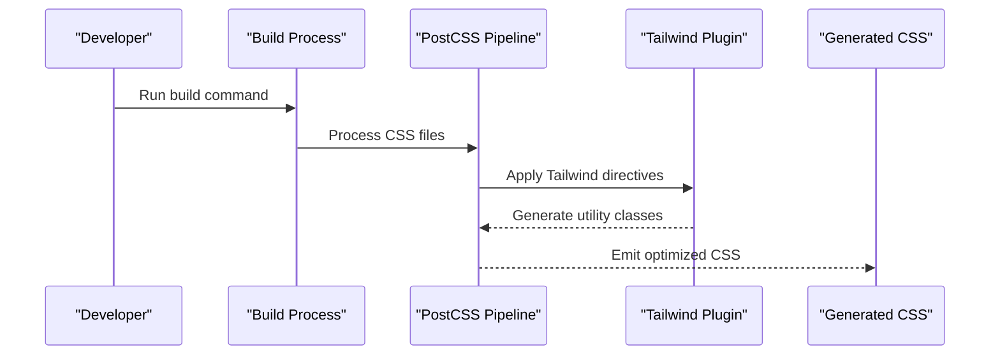
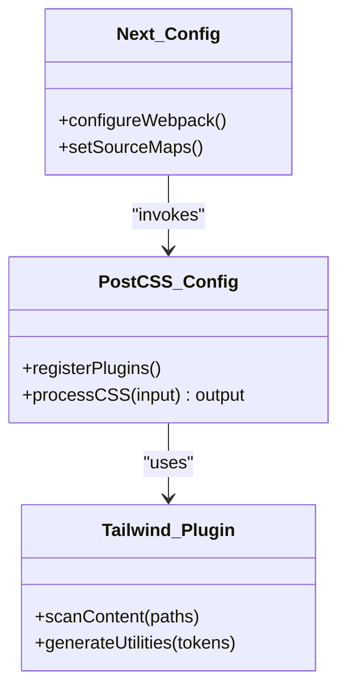
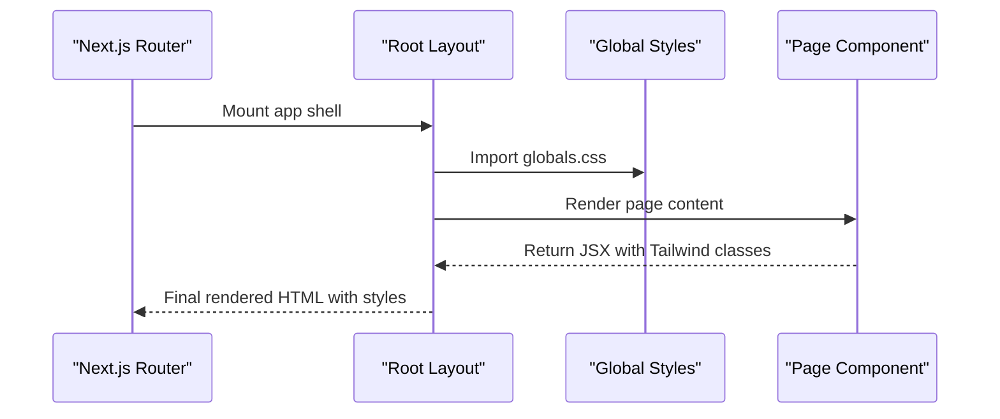
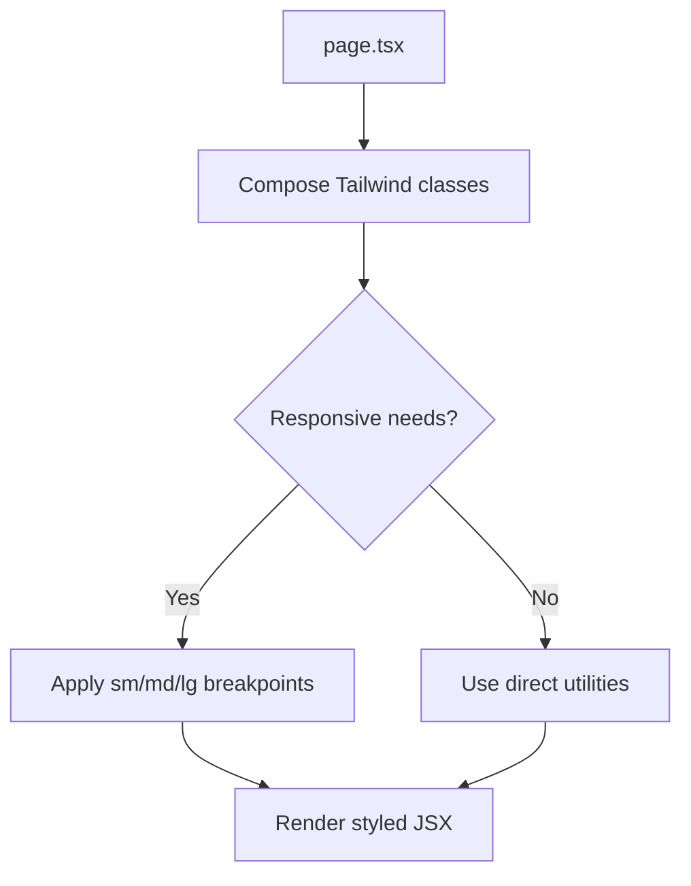
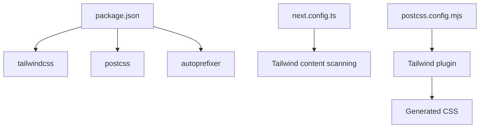

# Styling & Theming System

<cite>
**Referenced Files in This Document**
- [globals.css](file://frontend/src/app/globals.css)
- [postcss.config.mjs](file://frontend/postcss.config.mjs)
- [next.config.ts](file://frontend/next.config.ts)
- [package.json](file://frontend/package.json)
- [layout.tsx](file://frontend/src/app/layout.tsx)
- [page.tsx](file://frontend/src/app/(landing)/page.tsx)
</cite>

## Table of Contents
1. [Introduction](#introduction)
2. [Project Structure](#project-structure)
3. [Core Components](#core-components)
4. [Architecture Overview](#architecture-overview)
5. [Detailed Component Analysis](#detailed-component-analysis)
6. [Dependency Analysis](#dependency-analysis)
7. [Performance Considerations](#performance-considerations)
8. [Troubleshooting Guide](#troubleshooting-guide)
9. [Conclusion](#conclusion)
10. [Appendices](#appendices)

## Introduction
This document explains the styling and theming system used in the Insurix frontend. It covers the CSS architecture, Tailwind CSS configuration, PostCSS setup, global styles, component-specific styling patterns, responsive design implementation, color schemes, typography systems, and design tokens. It also provides guidelines for adding new styles, maintaining consistency, and optimizing CSS performance.

## Project Structure
The styling system is centered around a Next.js application with Tailwind CSS and PostCSS. The key files include:
- Global stylesheet entry point
- PostCSS configuration that wires Tailwind and other processors
- Next.js configuration that integrates Tailwind
- Package dependencies for Tailwind and related tooling
- App layout and page files where styles are applied

**Diagram sources**
- [layout.tsx](file://frontend/src/app/layout.tsx)
- [globals.css](file://frontend/src/app/globals.css)
- [postcss.config.mjs](file://frontend/postcss.config.mjs)
- [next.config.ts](file://frontend/next.config.ts)
- [package.json](file://frontend/package.json)

**Section sources**
- [globals.css](file://frontend/src/app/globals.css)
- [postcss.config.mjs](file://frontend/postcss.config.mjs)
- [next.config.ts](file://frontend/next.config.ts)
- [package.json](file://frontend/package.json)
- [layout.tsx](file://frontend/src/app/layout.tsx)

## Core Components
- Global styles: Centralized base styles and theme variables are defined in the global stylesheet.
- PostCSS pipeline: PostCSS orchestrates processing steps including Tailwind CSS to generate utility classes and purge unused styles.
- Tailwind integration: Tailwind is configured via PostCSS and Next.js config to enable utilities and custom theme extensions.
- App shell: The root layout imports global styles and sets up the HTML structure for consistent theming across pages.

Guidelines:
- Keep global styles minimal and focused on resets, base typography, and theme tokens.
- Prefer Tailwind utility classes for component-level styling to maintain consistency and reduce CSS bloat.
- Use semantic class names only when necessary; rely on Tailwind’s design system for most cases.

**Section sources**
- [globals.css](file://frontend/src/app/globals.css)
- [postcss.config.mjs](file://frontend/postcss.config.mjs)
- [next.config.ts](file://frontend/next.config.ts)
- [package.json](file://frontend/package.json)
- [layout.tsx](file://frontend/src/app/layout.tsx)

## Architecture Overview
The styling architecture follows a layered approach:
- Base layer: Global reset and theme tokens (colors, typography, spacing).
- Utility layer: Tailwind CSS utilities for layout, spacing, colors, and responsive behavior.
- Component layer: Reusable UI components styled primarily with Tailwind classes.
- Page layer: Page-specific overrides or compositions of utilities.

[No sources needed since this diagram shows conceptual workflow, not actual code structure]

## Detailed Component Analysis

### Global Styles and Theme Tokens
- Purpose: Define base typography, color palette, spacing scale, and any custom CSS variables.
- Location: Global stylesheet file.
- Best practices:
  - Use CSS custom properties for theme tokens to enable easy overrides and dark mode support.
  - Avoid heavy rules here; keep it lean for fast rendering.
  - Ensure cross-browser compatibility by including necessary vendor prefixes if needed.

**Section sources**
- [globals.css](file://frontend/src/app/globals.css)

### PostCSS Configuration
- Purpose: Configure the PostCSS pipeline to process Tailwind CSS and any additional plugins.
- Key responsibilities:
  - Register Tailwind CSS plugin.
  - Optionally configure autoprefixer or other transformations.
  - Ensure source maps and minification settings align with build targets.

**Section sources**
- [postcss.config.mjs](file://frontend/postcss.config.mjs)

### Tailwind CSS Integration
- Purpose: Enable Tailwind utilities and extend the default theme with project-specific tokens.
- Integration points:
  - PostCSS plugin registration.
  - Next.js configuration to ensure Tailwind scans template files.
- Customization:
  - Extend theme with design tokens (colors, fonts, breakpoints).
  - Configure content paths to scan relevant files for class usage.

**Section sources**
- [postcss.config.mjs](file://frontend/postcss.config.mjs)
- [next.config.ts](file://frontend/next.config.ts)
- [package.json](file://frontend/package.json)

### App Layout and Style Application
- Purpose: Import global styles and establish the root HTML structure for consistent theming.
- Responsibilities:
  - Include global stylesheet at the app level.
  - Set language and meta tags affecting text rendering.
  - Provide context for theme providers if applicable.

**Section sources**
- [layout.tsx](file://frontend/src/app/layout.tsx)
- [globals.css](file://frontend/src/app/globals.css)

### Landing Page Styling Patterns
- Purpose: Demonstrate how pages compose Tailwind utilities to achieve layouts and responsive behavior.
- Patterns:
  - Use responsive prefixes (sm:, md:, lg:) for adaptive layouts.
  - Compose spacing and typography utilities consistently.
  - Keep page-specific overrides minimal; prefer shared utilities.

**Section sources**
- [page.tsx](file://frontend/src/app/(landing)/page.tsx)

## Dependency Analysis
Styling-related dependencies and their roles:
- Tailwind CSS: Provides utility-first CSS framework and theme extension capabilities.
- PostCSS: Orchestrates the CSS processing pipeline, including Tailwind and optional plugins.
- Next.js: Integrates Tailwind scanning and bundling within the build process.
- Package manager: Declares dependencies and scripts for development and production builds.

**Diagram sources**
- [package.json](file://frontend/package.json)
- [next.config.ts](file://frontend/next.config.ts)
- [postcss.config.mjs](file://frontend/postcss.config.mjs)

**Section sources**
- [package.json](file://frontend/package.json)
- [next.config.ts](file://frontend/next.config.ts)
- [postcss.config.mjs](file://frontend/postcss.config.mjs)

## Performance Considerations
- Purge unused styles: Ensure Tailwind’s content scanning includes all relevant files to minimize CSS size.
- Minify CSS: Enable minification in production builds to reduce payload.
- Avoid large global stylesheets: Keep global styles small and defer heavy component styles to Tailwind utilities.
- Leverage browser caching: Use long-lived cache headers for static assets.
- Monitor bundle size: Track CSS growth over time and refactor when necessary.

[No sources needed since this section provides general guidance]

## Troubleshooting Guide
Common issues and resolutions:
- Tailwind classes not applied:
  - Verify content paths in Tailwind configuration include all template files.
  - Ensure PostCSS is correctly registered and running during build.
- Styles not updating locally:
  - Clear caches and restart the dev server.
  - Check for conflicting global styles overriding utilities.
- Dark mode or theme variables not working:
  - Confirm CSS variables are defined and referenced correctly.
  - Validate media queries or class-based toggles for theme switching.

**Section sources**
- [postcss.config.mjs](file://frontend/postcss.config.mjs)
- [globals.css](file://frontend/src/app/globals.css)

## Conclusion
The Insurix frontend employs a modern, scalable styling system built on Tailwind CSS and PostCSS. By centralizing theme tokens in global styles and leveraging Tailwind utilities for component-level styling, the project maintains consistency, responsiveness, and performance. Following the provided guidelines ensures a cohesive design system and efficient CSS management.

[No sources needed since this section summarizes without analyzing specific files]

## Appendices

### Guidelines for Adding New Styles
- Prefer Tailwind utilities for new styles; avoid writing custom CSS unless necessary.
- If custom CSS is required, add it to the global stylesheet under clearly labeled sections.
- Use CSS variables for theme tokens to maintain consistency across components.
- Update Tailwind content paths if introducing new file types or directories.

### Maintaining Consistency
- Establish naming conventions for any custom classes.
- Document design tokens and share them across the team.
- Use shared components to enforce consistent styling patterns.

### Optimizing CSS Performance
- Regularly audit unused styles and remove them.
- Enable CSS minification and compression in production.
- Monitor CSS bundle size and set thresholds in CI pipelines.

[No sources needed since this section provides general guidance]