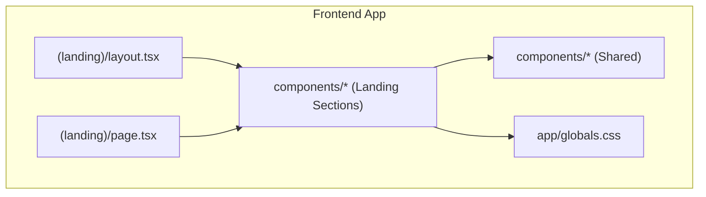
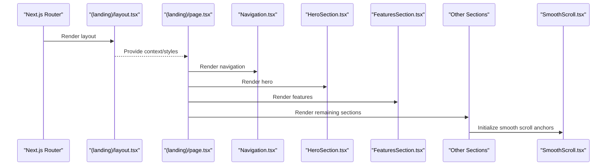
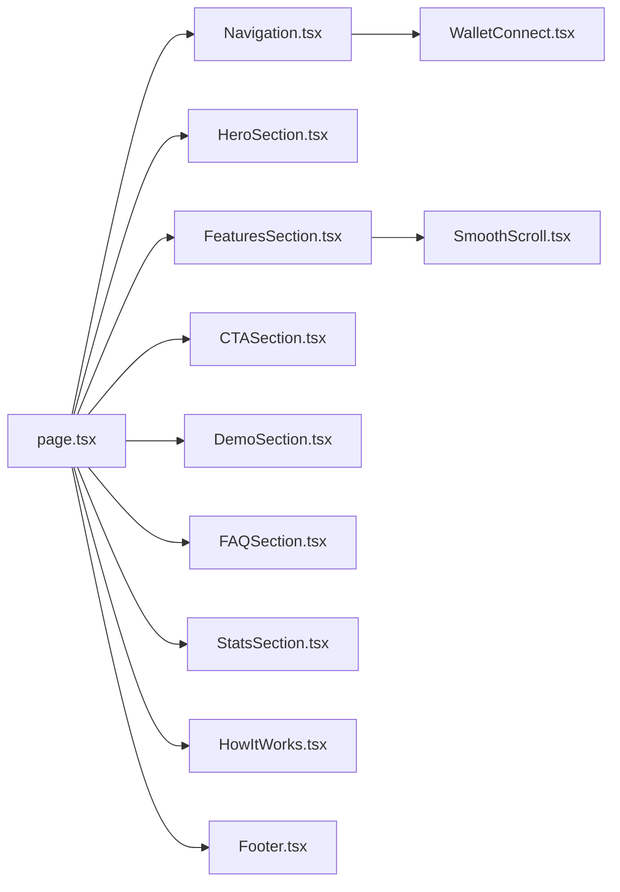

# UI Components Library

<cite>
**Referenced Files in This Document**
- [SmoothScroll.tsx](file://frontend/src/components/SmoothScroll.tsx)
- [HeroSection.tsx](file://frontend/src/app/(landing)/components/HeroSection.tsx)
- [FeaturesSection.tsx](file://frontend/src/app/(landing)/components/FeaturesSection.tsx)
- [Navigation.tsx](file://frontend/src/app/(landing)/components/Navigation.tsx)
- [CTASection.tsx](file://frontend/src/app/(landing)/components/CTASection.tsx)
- [DemoSection.tsx](file://frontend/src/app/(landing)/components/DemoSection.tsx)
- [FAQSection.tsx](file://frontend/src/app/(landing)/components/FAQSection.tsx)
- [Footer.tsx](file://frontend/src/app/(landing)/components/Footer.tsx)
- [HeroScene.tsx](file://frontend/src/app/(landing)/components/HeroScene.tsx)
- [HowItWorks.tsx](file://frontend/src/app/(landing)/components/HowItWorks.tsx)
- [HowItWorksScene.tsx](file://frontend/src/app/(landing)/components/HowItWorksScene.tsx)
- [StatsSection.tsx](file://frontend/src/app/(landing)/components/StatsSection.tsx)
- [WalletConnect.tsx](file://frontend/src/components/WalletConnect.tsx)
- [page.tsx](file://frontend/src/app/(landing)/page.tsx)
- [layout.tsx](file://frontend/src/app/(landing)/layout.tsx)
- [globals.css](file://frontend/src/app/globals.css)
</cite>

## Table of Contents
1. [Introduction](#introduction)
2. [Project Structure](#project-structure)
3. [Core Components](#core-components)
4. [Architecture Overview](#architecture-overview)
5. [Detailed Component Analysis](#detailed-component-analysis)
6. [Dependency Analysis](#dependency-analysis)
7. [Performance Considerations](#performance-considerations)
8. [Accessibility and Responsive Design](#accessibility-and-responsive-design)
9. [Cross-Browser Compatibility](#cross-browser-compatibility)
10. [Usage Examples](#usage-examples)
11. [Best Practices](#best-practices)
12. [Troubleshooting Guide](#troubleshooting-guide)
13. [Conclusion](#conclusion)

## Introduction
This document provides comprehensive documentation for the Insurix UI components library, focusing on reusable landing page components such as SmoothScroll, HeroSection, FeaturesSection, Navigation, and related elements. It explains component props, events, styling options, customization capabilities, responsive design patterns, accessibility compliance, and cross-browser compatibility. It also includes usage examples, prop interfaces, and best practices for extending existing components or creating new ones.

## Project Structure
The UI components are organized under the frontend application with a clear separation between shared components and landing page sections:
- Shared components live in frontend/src/components (e.g., SmoothScroll, WalletConnect).
- Landing page sections live in frontend/src/app/(landing)/components.
- The landing page layout and entry points are defined in frontend/src/app/(landing)/layout.tsx and page.tsx.
- Global styles are centralized in frontend/src/app/globals.css.

**Diagram sources**
- [layout.tsx](file://frontend/src/app/(landing)/layout.tsx)
- [page.tsx](file://frontend/src/app/(landing)/page.tsx)
- [globals.css](file://frontend/src/app/globals.css)

**Section sources**
- [layout.tsx](file://frontend/src/app/(landing)/layout.tsx)
- [page.tsx](file://frontend/src/app/(landing)/page.tsx)
- [globals.css](file://frontend/src/app/globals.css)

## Core Components
This section outlines the core reusable components used across the landing page:
- SmoothScroll: Provides smooth scrolling behavior to anchor targets.
- Navigation: Renders the top navigation bar with links and mobile menu toggling.
- HeroSection: Displays the hero area with headline, description, and call-to-action.
- FeaturesSection: Presents feature highlights in a structured grid/list.
- Additional sections: CTASection, DemoSection, FAQSection, StatsSection, HowItWorks, Footer.

Key responsibilities:
- Composition over inheritance: Each section is a self-contained React component.
- Props-driven configuration: Behavior and content are controlled via props.
- Styling via CSS classes and Tailwind utilities where applicable.
- Accessibility attributes for keyboard navigation and screen readers.

**Section sources**
- [SmoothScroll.tsx](file://frontend/src/components/SmoothScroll.tsx)
- [Navigation.tsx](file://frontend/src/app/(landing)/components/Navigation.tsx)
- [HeroSection.tsx](file://frontend/src/app/(landing)/components/HeroSection.tsx)
- [FeaturesSection.tsx](file://frontend/src/app/(landing)/components/FeaturesSection.tsx)
- [CTASection.tsx](file://frontend/src/app/(landing)/components/CTASection.tsx)
- [DemoSection.tsx](file://frontend/src/app/(landing)/components/DemoSection.tsx)
- [FAQSection.tsx](file://frontend/src/app/(landing)/components/FAQSection.tsx)
- [StatsSection.tsx](file://frontend/src/app/(landing)/components/StatsSection.tsx)
- [HowItWorks.tsx](file://frontend/src/app/(landing)/components/HowItWorks.tsx)
- [Footer.tsx](file://frontend/src/app/(landing)/components/Footer.tsx)

## Architecture Overview
The landing page composes multiple section components within a Next.js app router structure. The layout sets up global context and styles, while the page orchestrates the sections. Shared utilities like SmoothScroll and WalletConnect are reused across sections.

**Diagram sources**
- [layout.tsx](file://frontend/src/app/(landing)/layout.tsx)
- [page.tsx](file://frontend/src/app/(landing)/page.tsx)
- [Navigation.tsx](file://frontend/src/app/(landing)/components/Navigation.tsx)
- [HeroSection.tsx](file://frontend/src/app/(landing)/components/HeroSection.tsx)
- [FeaturesSection.tsx](file://frontend/src/app/(landing)/components/FeaturesSection.tsx)
- [SmoothScroll.tsx](file://frontend/src/components/SmoothScroll.tsx)

## Detailed Component Analysis

### SmoothScroll
Purpose:
- Enables smooth scrolling to anchor targets when clicked or programmatically triggered.

Key behaviors:
- Intercepts click events on anchor links.
- Scrolls to target element with easing and offset handling.
- Optionally integrates with IntersectionObserver for scroll-based effects.

Props interface:
- targetSelector: string — CSS selector for the scroll target.
- duration: number — Scroll duration in milliseconds.
- offset: number — Vertical offset before scrolling stops.
- enabled: boolean — Toggle smooth scrolling behavior.

Events:
- onScrollStart: callback invoked when scrolling begins.
- onScrollEnd: callback invoked when scrolling completes.

Styling and customization:
- Uses native scroll behavior; no visual styling required.
- Can be wrapped around any container to scope behavior.

Accessibility:
- Ensures focus remains on the trigger element after scrolling.
- Respects prefers-reduced-motion by disabling animation if requested.

Usage example:
- Wrap anchor links with SmoothScroll and configure targetSelector to match section IDs.

**Section sources**
- [SmoothScroll.tsx](file://frontend/src/components/SmoothScroll.tsx)

### Navigation
Purpose:
- Renders the site navigation with logo, links, and mobile menu toggle.

Key behaviors:
- Collapsible mobile menu with keyboard support.
- Active link highlighting based on current route or scroll position.
- Optional integration with wallet connection state.

Props interface:
- links: array of { label: string, href: string } — Navigation items.
- brand: string | ReactNode — Logo or brand text.
- onMenuToggle: (isOpen: boolean) => void — Callback for menu open/close.
- variant: 'default' | 'transparent' — Visual style variant.

Events:
- onLinkClick: callback invoked when a nav link is clicked.
- onMenuToggle: callback invoked when mobile menu toggles.

Styling and customization:
- Supports theme-aware colors and spacing.
- Responsive breakpoints handled via utility classes.

Accessibility:
- Proper ARIA roles and labels for menus and links.
- Focus management for keyboard navigation.

Usage example:
- Pass an array of link objects and handle active state via routing or scroll position.

**Section sources**
- [Navigation.tsx](file://frontend/src/app/(landing)/components/Navigation.tsx)

### HeroSection
Purpose:
- Displays the primary hero area with headline, description, and call-to-action buttons.

Key behaviors:
- Configurable content slots for headline, subtitle, and actions.
- Optional background media or gradient.
- Integration with SmoothScroll for anchor navigation.

Props interface:
- title: string — Main headline text.
- subtitle: string — Supporting description.
- actions: array of { label: string, onClick: () => void, href?: string } — CTA buttons.
- backgroundImage?: string — URL or asset reference.
- alignment: 'left' | 'center' | 'right' — Text alignment.

Events:
- onActionClick: callback invoked when a CTA is clicked.

Styling and customization:
- Supports responsive typography and spacing.
- Background overlay and contrast adjustments for readability.

Accessibility:
- Semantic headings and descriptive button labels.
- Sufficient color contrast and focus indicators.

Usage example:
- Define action buttons that either navigate via href or trigger local handlers.

**Section sources**
- [HeroSection.tsx](file://frontend/src/app/(landing)/components/HeroSection.tsx)

### FeaturesSection
Purpose:
- Presents feature highlights in a structured grid/list format.

Key behaviors:
- Dynamic rendering of feature cards from data arrays.
- Optional icons, descriptions, and links per feature.
- Responsive grid layout adapting to screen sizes.

Props interface:
- features: array of { title: string, description: string, icon?: ReactNode, link?: string } — Feature items.
- columns: number — Number of columns in the grid.
- layout: 'grid' | 'list' — Display mode.

Events:
- onFeatureClick: callback invoked when a feature card is clicked.

Styling and customization:
- Consistent card styling with hover states.
- Theme-aware colors and spacing.

Accessibility:
- Descriptive titles and alt text for icons.
- Keyboard navigable cards with proper roles.

Usage example:
- Map feature data to cards and handle clicks for navigation or modals.

**Section sources**
- [FeaturesSection.tsx](file://frontend/src/app/(landing)/components/FeaturesSection.tsx)

### CTASection
Purpose:
- Highlights a call-to-action area to drive conversions.

Key behaviors:
- Configurable message and primary action button.
- Optional secondary actions or links.

Props interface:
- message: string — CTA copy text.
- primaryAction: { label: string, onClick: () => void } — Primary button.
- secondaryAction?: { label: string, onClick: () => void } — Secondary button.

Events:
- onPrimaryClick: callback for primary action.
- onSecondaryClick: callback for secondary action.

Styling and customization:
- High-contrast design for visibility.
- Responsive padding and typography.

Accessibility:
- Clear button labels and semantic structure.

Usage example:
- Use for newsletter signup, demo requests, or product trials.

**Section sources**
- [CTASection.tsx](file://frontend/src/app/(landing)/components/CTASection.tsx)

### DemoSection
Purpose:
- Showcases a product demo or interactive preview.

Key behaviors:
- Embeds demo content or interactive widgets.
- Optional play/pause controls and captions.

Props interface:
- embedUrl?: string — URL for embedded content.
- controls?: boolean — Enable playback controls.
- caption?: string — Alt text or description.

Events:
- onPlay: callback when demo starts.
- onPause: callback when demo pauses.

Styling and customization:
- Aspect ratio preservation and responsive sizing.

Accessibility:
- Captions and controls accessible via keyboard.

Usage example:
- Embed video or interactive sandbox for product walkthroughs.

**Section sources**
- [DemoSection.tsx](file://frontend/src/app/(landing)/components/DemoSection.tsx)

### FAQSection
Purpose:
- Displays frequently asked questions in an accordion format.

Key behaviors:
- Expand/collapse interactions with keyboard support.
- Search/filter capability for questions.

Props interface:
- faqs: array of { question: string, answer: string } — FAQ items.
- searchable: boolean — Enable search filtering.

Events:
- onToggle: callback invoked when an item is expanded/collapsed.

Styling and customization:
- Clean accordion styling with focus indicators.

Accessibility:
- ARIA attributes for accordion panels and triggers.

Usage example:
- Populate FAQs from content APIs or static data.

**Section sources**
- [FAQSection.tsx](file://frontend/src/app/(landing)/components/FAQSection.tsx)

### StatsSection
Purpose:
- Presents key metrics or statistics in a visually appealing way.

Key behaviors:
- Animated counters and formatted numbers.
- Responsive grid layout for stat cards.

Props interface:
- stats: array of { label: string, value: string | number, suffix?: string } — Stat items.
- animationDuration?: number — Counter animation duration.

Events:
- onStatVisible: callback when a stat becomes visible.

Styling and customization:
- Consistent card styling and typography hierarchy.

Accessibility:
- Descriptive labels and numeric formatting.

Usage example:
- Showcase user counts, performance metrics, or achievements.

**Section sources**
- [StatsSection.tsx](file://frontend/src/app/(landing)/components/StatsSection.tsx)

### HowItWorks
Purpose:
- Explains the process or workflow in a step-by-step manner.

Key behaviors:
- Sequential steps with optional visuals or icons.
- Progress indicator and navigation between steps.

Props interface:
- steps: array of { title: string, description: string, icon?: ReactNode } — Step items.
- currentStep?: number — Controlled step index.

Events:
- onStepChange: callback when step changes.

Styling and customization:
- Clear visual progression and emphasis on active step.

Accessibility:
- Keyboard navigation and ARIA roles for steps.

Usage example:
- Guide users through onboarding or claim submission flow.

**Section sources**
- [HowItWorks.tsx](file://frontend/src/app/(landing)/components/HowItWorks.tsx)

### HowItWorksScene
Purpose:
- Provides a scene-based visualization for the how-it-works flow.

Key behaviors:
- Integrates with Three.js or similar libraries for 3D scenes.
- Animates transitions between steps.

Props interface:
- sceneConfig: object — Configuration for scene rendering.
- stepAnimations: array — Animation sequences per step.

Events:
- onSceneReady: callback when scene is initialized.
- onStepAnimate: callback during step animations.

Styling and customization:
- Scene lighting, materials, and camera controls.

Accessibility:
- Fallback content for non-3D environments.

Usage example:
- Visualize insurance workflows with interactive 3D elements.

**Section sources**
- [HowItWorksScene.tsx](file://frontend/src/app/(landing)/components/HowItWorksScene.tsx)

### Footer
Purpose:
- Renders the site footer with links, legal info, and social icons.

Key behaviors:
- Organized link groups and copyright notice.
- Social media links with proper labeling.

Props interface:
- links: array of { label: string, href: string } — Footer links.
- socialLinks: array of { label: string, href: string, icon?: ReactNode } — Social icons.
- copyright: string — Copyright text.

Events:
- onLinkClick: callback invoked when a footer link is clicked.

Styling and customization:
- Dark/light theme support and consistent spacing.

Accessibility:
- Semantic landmarks and descriptive link labels.

Usage example:
- Include navigation shortcuts, legal pages, and social profiles.

**Section sources**
- [Footer.tsx](file://frontend/src/app/(landing)/components/Footer.tsx)

### WalletConnect
Purpose:
- Connects the user’s crypto wallet for blockchain interactions.

Key behaviors:
- Wallet detection and connection prompts.
- State synchronization for connected wallet address.

Props interface:
- onConnect: (address: string) => void — Callback on successful connection.
- onDisconnect: () => void — Callback on disconnection.

Events:
- onConnect: emitted when wallet connects.
- onDisconnect: emitted when wallet disconnects.

Styling and customization:
- Button styling and status indicators.

Accessibility:
- Clear connection status and error messages.

Usage example:
- Integrate with backend services for authenticated transactions.

**Section sources**
- [WalletConnect.tsx](file://frontend/src/components/WalletConnect.tsx)

## Dependency Analysis
Components are loosely coupled and communicate via props and callbacks. Shared utilities like SmoothScroll and WalletConnect are imported where needed. The landing page orchestrates sections without tight coupling.

**Diagram sources**
- [page.tsx](file://frontend/src/app/(landing)/page.tsx)
- [Navigation.tsx](file://frontend/src/app/(landing)/components/Navigation.tsx)
- [HeroSection.tsx](file://frontend/src/app/(landing)/components/HeroSection.tsx)
- [FeaturesSection.tsx](file://frontend/src/app/(landing)/components/FeaturesSection.tsx)
- [CTASection.tsx](file://frontend/src/app/(landing)/components/CTASection.tsx)
- [DemoSection.tsx](file://frontend/src/app/(landing)/components/DemoSection.tsx)
- [FAQSection.tsx](file://frontend/src/app/(landing)/components/FAQSection.tsx)
- [StatsSection.tsx](file://frontend/src/app/(landing)/components/StatsSection.tsx)
- [HowItWorks.tsx](file://frontend/src/app/(landing)/components/HowItWorks.tsx)
- [Footer.tsx](file://frontend/src/app/(landing)/components/Footer.tsx)
- [SmoothScroll.tsx](file://frontend/src/components/SmoothScroll.tsx)
- [WalletConnect.tsx](file://frontend/src/components/WalletConnect.tsx)

**Section sources**
- [page.tsx](file://frontend/src/app/(landing)/page.tsx)

## Performance Considerations
- Lazy loading: Defer non-critical sections until they enter the viewport using IntersectionObserver.
- Memoization: Wrap expensive computations with React.memo to prevent unnecessary re-renders.
- Image optimization: Use optimized assets and lazy loading for images and media.
- Bundle size: Code-split large components like HowItWorksScene to reduce initial load.
- Scroll performance: Throttle scroll event listeners and use requestAnimationFrame for smooth animations.

[No sources needed since this section provides general guidance]

## Accessibility and Responsive Design
Accessibility:
- Semantic HTML elements (header, main, section, footer) for better screen reader support.
- ARIA attributes for dynamic content like accordions and menus.
- Keyboard navigation with visible focus indicators.
- Color contrast ratios meeting WCAG guidelines.

Responsive design:
- Mobile-first approach with flexible layouts and fluid typography.
- Breakpoints managed via utility classes for consistent scaling.
- Touch-friendly interactions for mobile devices.

[No sources needed since this section provides general guidance]

## Cross-Browser Compatibility
- Modern browsers: Full feature support including smooth scrolling and animations.
- Legacy browsers: Graceful degradation for advanced features like 3D scenes.
- Polyfills: Include necessary polyfills for older environments if required.
- Testing: Validate across Chrome, Firefox, Safari, and Edge for consistency.

[No sources needed since this section provides general guidance]

## Usage Examples
- SmoothScroll: Wrap anchor links and configure targetSelector to match section IDs.
- Navigation: Provide an array of link objects and handle active state via routing.
- HeroSection: Define title, subtitle, and action buttons for CTAs.
- FeaturesSection: Map feature data to cards with icons and descriptions.
- FAQSection: Populate FAQs from static data or API responses.
- StatsSection: Display animated counters for key metrics.
- HowItWorks: Configure steps and handle step changes for guided flows.
- WalletConnect: Integrate wallet connection for blockchain interactions.

[No sources needed since this section provides general guidance]

## Best Practices
- Keep components small and focused on single responsibilities.
- Use props for configuration and callbacks for events.
- Implement consistent naming conventions for props and events.
- Ensure accessibility compliance with semantic markup and ARIA attributes.
- Test components across devices and browsers for responsiveness.
- Document prop interfaces and usage examples for maintainability.

[No sources needed since this section provides general guidance]

## Troubleshooting Guide
Common issues and resolutions:
- SmoothScroll not working: Verify targetSelector matches element IDs and ensure anchors have valid href values.
- Navigation menu not closing: Check mobile menu toggle logic and event listeners.
- HeroSection content overlapping: Adjust padding and line-height for different screen sizes.
- FeaturesSection layout issues: Confirm grid columns and responsive breakpoints.
- FAQSection not expanding: Validate ARIA attributes and keyboard event handlers.
- WalletConnect errors: Ensure wallet provider is available and network settings are correct.

[No sources needed since this section provides general guidance]

## Conclusion
The Insurix UI components library offers a robust set of reusable landing page components designed for scalability, accessibility, and cross-browser compatibility. By following the documented prop interfaces, events, and best practices, developers can efficiently extend existing components or create new ones tailored to specific needs. The modular architecture ensures maintainability and performance, making it suitable for complex web applications.

[No sources needed since this section summarizes without analyzing specific files]