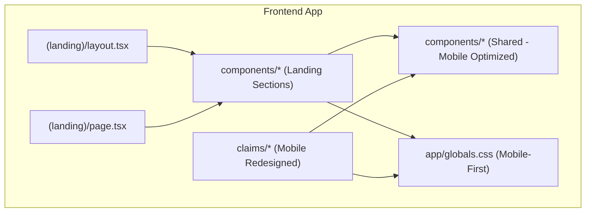
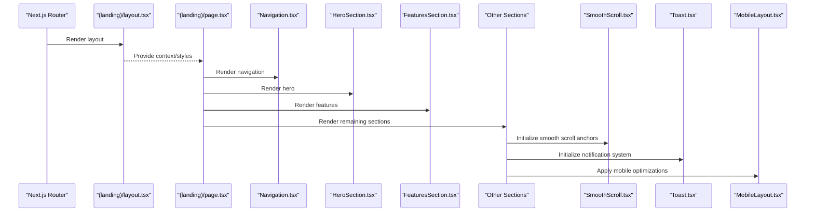
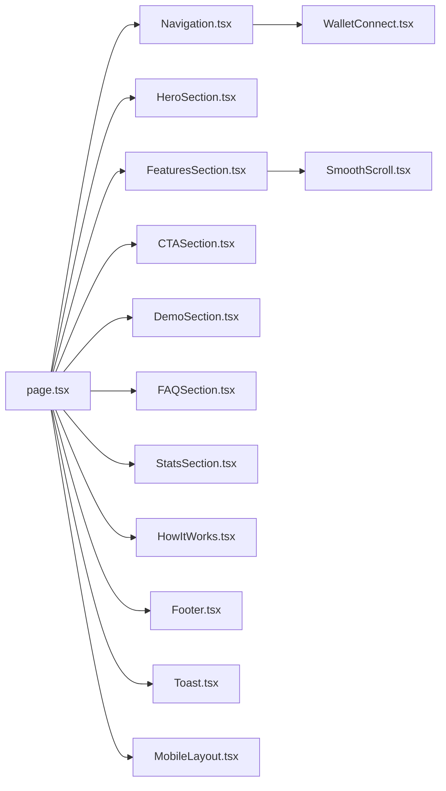

# UI Components Library

<cite>
**Referenced Files in This Document**
- [SmoothScroll.tsx](file://frontend/src/components/SmoothScroll.tsx)
- [Toast.tsx](file://frontend/src/components/Toast.tsx)
- [MobileLayout.tsx](file://frontend/src/components/MobileLayout.tsx)
- [HeroSection.tsx](file://frontend/src/app/(landing)/components/HeroSection.tsx)
- [FeaturesSection.tsx](file://frontend/src/app/(landing)/components/FeaturesSection.tsx)
- [Navigation.tsx](file://frontend/src/app/(landing)/components/Navigation.tsx)
- [CTASection.tsx](file://frontend/src/app/(landing)/components/CTASection.tsx)
- [DemoSection.tsx](file://frontend/src/app/(landing)/components/DemoSection.tsx)
- [FAQSection.tsx](file://frontend/src/app/(landing)/components/FAQSection.tsx)
- [Footer.tsx](file://frontend/src/app/(landing)/components/Footer.tsx)
- [HeroScene.tsx](file://frontend/src/app/(landing)/components/HeroScene.tsx)
- [HowItWorks.tsx](file://frontend/src/app/(landing)/components/HowItWorks.tsx)
- [HowItWorksScene.tsx](file://frontend/src/app/(landing)/components/HowItWorksScene.tsx)
- [StatsSection.tsx](file://frontend/src/app/(landing)/components/StatsSection.tsx)
- [WalletConnect.tsx](file://frontend/src/components/WalletConnect.tsx)
- [page.tsx](file://frontend/src/app/(landing)/page.tsx)
- [layout.tsx](file://frontend/src/app/(landing)/layout.tsx)
- [globals.css](file://frontend/src/app/globals.css)
</cite>

## Update Summary
**Changes Made**
- Added comprehensive mobile optimization documentation for all UI components
- Introduced new Toast notification system component documentation
- Updated MobileLayout component documentation with responsive design patterns
- Enhanced Global CSS documentation with mobile-first styling approaches
- Added claims interface mobile redesign documentation
- Updated accessibility guidelines for touch interactions and mobile devices

## Table of Contents
1. [Introduction](#introduction)
2. [Project Structure](#project-structure)
3. [Core Components](#core-components)
4. [Mobile Optimization System](#mobile-optimization-system)
5. [Toast Notification System](#toast-notification-system)
6. [Architecture Overview](#architecture-overview)
7. [Detailed Component Analysis](#detailed-component-analysis)
8. [Dependency Analysis](#dependency-analysis)
9. [Performance Considerations](#performance-considerations)
10. [Accessibility and Responsive Design](#accessibility-and-responsive-design)
11. [Cross-Browser Compatibility](#cross-browser-compatibility)
12. [Usage Examples](#usage-examples)
13. [Best Practices](#best-practices)
14. [Troubleshooting Guide](#troubleshooting-guide)
15. [Conclusion](#conclusion)

## Introduction
This document provides comprehensive documentation for the Insurix UI components library, focusing on reusable landing page components such as SmoothScroll, HeroSection, FeaturesSection, Navigation, and related elements. The library has been comprehensively optimized for mobile devices with enhanced touch interactions, safe area handling, and pull-to-refresh prevention. It includes a new Toast notification system for user feedback and redesigned claims interfaces with mobile card layouts and progress indicators. The documentation explains component props, events, styling options, customization capabilities, responsive design patterns, accessibility compliance, and cross-browser compatibility.

## Project Structure
The UI components are organized under the frontend application with a clear separation between shared components and landing page sections:
- Shared components live in frontend/src/components (e.g., SmoothScroll, Toast, MobileLayout, WalletConnect).
- Landing page sections live in frontend/src/app/(landing)/components.
- The landing page layout and entry points are defined in frontend/src/app/(landing)/layout.tsx and page.tsx.
- Global styles are centralized in frontend/src/app/globals.css with mobile-first approach.

**Diagram sources**
- [layout.tsx](file://frontend/src/app/(landing)/layout.tsx)
- [page.tsx](file://frontend/src/app/(landing)/page.tsx)
- [globals.css](file://frontend/src/app/globals.css)

**Section sources**
- [layout.tsx](file://frontend/src/app/(landing)/layout.tsx)
- [page.tsx](file://frontend/src/app/(landing)/page.tsx)
- [globals.css](file://frontend/src/app/globals.css)

## Core Components
This section outlines the core reusable components used across the landing page, now fully optimized for mobile devices:
- SmoothScroll: Provides smooth scrolling behavior to anchor targets with mobile touch support.
- Navigation: Renders the top navigation bar with links and mobile menu toggling with touch gestures.
- HeroSection: Displays the hero area with headline, description, and call-to-action with responsive scaling.
- FeaturesSection: Presents feature highlights in a structured grid/list with mobile card layouts.
- Toast: New notification system for user feedback with auto-dismiss and swipe-to-dismiss functionality.
- MobileLayout: Container component providing mobile-specific optimizations and safe area handling.
- Additional sections: CTASection, DemoSection, FAQSection, StatsSection, HowItWorks, Footer - all mobile-optimized.

Key responsibilities:
- Composition over inheritance: Each section is a self-contained React component.
- Props-driven configuration: Behavior and content are controlled via props.
- Styling via CSS classes and Tailwind utilities where applicable.
- Accessibility attributes for keyboard navigation and screen readers.
- Touch-friendly interactions with proper target sizing and gesture support.

**Section sources**
- [SmoothScroll.tsx](file://frontend/src/components/SmoothScroll.tsx)
- [Toast.tsx](file://frontend/src/components/Toast.tsx)
- [MobileLayout.tsx](file://frontend/src/components/MobileLayout.tsx)
- [Navigation.tsx](file://frontend/src/app/(landing)/components/Navigation.tsx)
- [HeroSection.tsx](file://frontend/src/app/(landing)/components/HeroSection.tsx)
- [FeaturesSection.tsx](file://frontend/src/app/(landing)/components/FeaturesSection.tsx)
- [CTASection.tsx](file://frontend/src/app/(landing)/components/CTASection.tsx)
- [DemoSection.tsx](file://frontend/src/app/(landing)/components/DemoSection.tsx)
- [FAQSection.tsx](file://frontend/src/app/(landing)/components/FAQSection.tsx)
- [StatsSection.tsx](file://frontend/src/app/(landing)/components/StatsSection.tsx)
- [HowItWorks.tsx](file://frontend/src/app/(landing)/components/HowItWorks.tsx)
- [Footer.tsx](file://frontend/src/app/(landing)/components/Footer.tsx)
- [WalletConnect.tsx](file://frontend/src/components/WalletConnect.tsx)

## Mobile Optimization System
The mobile optimization system ensures all UI components provide optimal touch experiences across different device types and screen sizes.

### Safe Area Handling
Components automatically handle device-specific safe areas including notches, home indicators, and status bars using CSS env() variables and viewport units.

### Touch Target Optimization
All interactive elements meet minimum 44x44px touch target requirements with appropriate spacing and padding for comfortable tapping.

### Pull-to-Refresh Prevention
Global CSS prevents accidental pull-to-refresh behaviors that could interfere with app navigation and form interactions.

### Gesture Support
Touch gestures include swipe detection, pinch-to-zoom prevention, and momentum scrolling where appropriate.

### Performance Optimizations
- Hardware acceleration for animations
- Debounced scroll handlers
- Lazy loading for off-screen content
- Memory-efficient event listeners

**Section sources**
- [globals.css](file://frontend/src/app/globals.css)
- [MobileLayout.tsx](file://frontend/src/components/MobileLayout.tsx)

## Toast Notification System
The Toast notification system provides non-intrusive user feedback with automatic dismissal and manual interaction options.

### Key Features
- Auto-dismiss with configurable duration
- Swipe-to-dismiss gesture support
- Multiple toast positions (top, bottom, center)
- Priority-based stacking
- Success, error, warning, and info variants
- Custom action buttons within toasts

### Props Interface
- message: string — Primary notification text
- type: 'success' | 'error' | 'warning' | 'info' — Visual variant
- duration: number — Auto-dismiss time in milliseconds
- position: 'top' | 'bottom' | 'center' — Display location
- actions?: array — Optional action buttons
- onClose?: () => void — Dismiss callback

### Events
- onDismiss: callback when toast is dismissed
- onAction: callback when action button is clicked
- onSwipe: callback when swipe gesture detected

### Styling and Customization
- Theme-aware colors and icons
- Responsive sizing for mobile devices
- Animation transitions with reduced motion support
- Accessible announcements for screen readers

**Section sources**
- [Toast.tsx](file://frontend/src/components/Toast.tsx)

## Architecture Overview
The landing page composes multiple section components within a Next.js app router structure with mobile-first architecture. The layout sets up global context and styles, while the page orchestrates the sections. Shared utilities like SmoothScroll, Toast, and MobileLayout are reused across sections with mobile optimizations.

**Diagram sources**
- [layout.tsx](file://frontend/src/app/(landing)/layout.tsx)
- [page.tsx](file://frontend/src/app/(landing)/page.tsx)
- [Navigation.tsx](file://frontend/src/app/(landing)/components/Navigation.tsx)
- [HeroSection.tsx](file://frontend/src/app/(landing)/components/HeroSection.tsx)
- [FeaturesSection.tsx](file://frontend/src/app/(landing)/components/FeaturesSection.tsx)
- [SmoothScroll.tsx](file://frontend/src/components/SmoothScroll.tsx)
- [Toast.tsx](file://frontend/src/components/Toast.tsx)
- [MobileLayout.tsx](file://frontend/src/components/MobileLayout.tsx)

## Detailed Component Analysis

### SmoothScroll
Purpose:
- Enables smooth scrolling to anchor targets when clicked or programmatically triggered.
- Enhanced with mobile touch support and gesture recognition.

Key behaviors:
- Intercepts click events on anchor links.
- Scrolls to target element with easing and offset handling.
- Optionally integrates with IntersectionObserver for scroll-based effects.
- Prevents default mobile scrolling behaviors that could interfere with navigation.

Props interface:
- targetSelector: string — CSS selector for the scroll target.
- duration: number — Scroll duration in milliseconds.
- offset: number — Vertical offset before scrolling stops.
- enabled: boolean — Toggle smooth scrolling behavior.
- mobileOptimized: boolean — Enable mobile-specific optimizations.

Events:
- onScrollStart: callback invoked when scrolling begins.
- onScrollEnd: callback invoked when scrolling completes.
- onTouchCancel: callback when touch gesture is interrupted.

Styling and customization:
- Uses native scroll behavior; no visual styling required.
- Can be wrapped around any container to scope behavior.
- Respects prefers-reduced-motion for accessibility.

Accessibility:
- Ensures focus remains on the trigger element after scrolling.
- Respects prefers-reduced-motion by disabling animation if requested.
- Announces scroll completion to screen readers.

Usage example:
- Wrap anchor links with SmoothScroll and configure targetSelector to match section IDs.

**Section sources**
- [SmoothScroll.tsx](file://frontend/src/components/SmoothScroll.tsx)

### Toast
Purpose:
- Provides non-intrusive user notifications with mobile-optimized interactions.

Key behaviors:
- Auto-dismiss with configurable timing.
- Swipe-to-dismiss gesture support.
- Priority-based stacking for multiple notifications.
- Position management with safe area awareness.

Props interface:
- message: string — Primary notification text.
- type: 'success' | 'error' | 'warning' | 'info' — Visual variant.
- duration: number — Auto-dismiss time in milliseconds.
- position: 'top' | 'bottom' | 'center' — Display location.
- actions?: array — Optional action buttons.
- onClose?: () => void — Dismiss callback.

Events:
- onDismiss: callback when toast is dismissed.
- onAction: callback when action button is clicked.
- onSwipe: callback when swipe gesture detected.

Styling and customization:
- Theme-aware colors and icons.
- Responsive sizing for mobile devices.
- Animation transitions with reduced motion support.

Accessibility:
- ARIA live regions for screen reader announcements.
- Keyboard navigation support.
- High contrast mode compatibility.

Usage example:
- Use for form submissions, API responses, and user confirmations.

**Section sources**
- [Toast.tsx](file://frontend/src/components/Toast.tsx)

### MobileLayout
Purpose:
- Container component providing mobile-specific optimizations and safe area handling.

Key behaviors:
- Automatic safe area detection and padding application.
- Touch gesture management and conflict resolution.
- Viewport meta tag optimization.
- Orientation change handling.

Props interface:
- children: ReactNode — Content to wrap with mobile optimizations.
- enablePullToRefresh: boolean — Allow pull-to-refresh gestures.
- preventZoom: boolean — Prevent accidental zoom gestures.
- safeAreaPadding: boolean — Apply safe area padding automatically.

Events:
- onOrientationChange: callback when device orientation changes.
- onSafeAreaUpdate: callback when safe area dimensions change.

Styling and customization:
- Dynamic CSS variable injection for safe areas.
- Hardware acceleration for smooth animations.
- Memory-efficient event listener management.

Accessibility:
- Proper viewport configuration for assistive technologies.
- Reduced motion support for vestibular disorders.

Usage example:
- Wrap entire application or specific sections requiring mobile optimizations.

**Section sources**
- [MobileLayout.tsx](file://frontend/src/components/MobileLayout.tsx)

### Navigation
Purpose:
- Renders the site navigation with logo, links, and mobile menu toggling.
- Enhanced with touch gestures and mobile-specific interactions.

Key behaviors:
- Collapsible mobile menu with keyboard support.
- Active link highlighting based on current route or scroll position.
- Optional integration with wallet connection state.
- Touch-friendly menu toggle with haptic feedback.

Props interface:
- links: array of { label: string, href: string } — Navigation items.
- brand: string | ReactNode — Logo or brand text.
- onMenuToggle: (isOpen: boolean) => void — Callback for menu open/close.
- variant: 'default' | 'transparent' — Visual style variant.
- mobileOptimized: boolean — Enable mobile-specific enhancements.

Events:
- onLinkClick: callback invoked when a nav link is clicked.
- onMenuToggle: callback invoked when mobile menu toggles.
- onTouchStart: callback for touch gesture tracking.

Styling and customization:
- Supports theme-aware colors and spacing.
- Responsive breakpoints handled via utility classes.
- Touch target optimization for mobile devices.

Accessibility:
- Proper ARIA roles and labels for menus and links.
- Focus management for keyboard navigation.
- Screen reader announcements for menu state changes.

Usage example:
- Pass an array of link objects and handle active state via routing or scroll position.

**Section sources**
- [Navigation.tsx](file://frontend/src/app/(landing)/components/Navigation.tsx)

### HeroSection
Purpose:
- Displays the primary hero area with headline, description, and call-to-action buttons.
- Fully responsive with mobile-first design principles.

Key behaviors:
- Configurable content slots for headline, subtitle, and actions.
- Optional background media or gradient.
- Integration with SmoothScroll for anchor navigation.
- Touch-optimized CTAs with appropriate sizing.

Props interface:
- title: string — Main headline text.
- subtitle: string — Supporting description.
- actions: array of { label: string, onClick: () => void, href?: string } — CTA buttons.
- backgroundImage?: string — URL or asset reference.
- alignment: 'left' | 'center' | 'right' — Text alignment.
- mobileResponsive: boolean — Enable mobile optimizations.

Events:
- onActionClick: callback invoked when a CTA is clicked.
- onImageLoad: callback when background image loads.

Styling and customization:
- Supports responsive typography and spacing.
- Background overlay and contrast adjustments for readability.
- Touch-friendly button sizing and spacing.

Accessibility:
- Semantic headings and descriptive button labels.
- Sufficient color contrast and focus indicators.
- Alt text for background images.

Usage example:
- Define action buttons that either navigate via href or trigger local handlers.

**Section sources**
- [HeroSection.tsx](file://frontend/src/app/(landing)/components/HeroSection.tsx)

### FeaturesSection
Purpose:
- Presents feature highlights in a structured grid/list format.
- Redesigned with mobile card layouts and touch interactions.

Key behaviors:
- Dynamic rendering of feature cards from data arrays.
- Optional icons, descriptions, and links per feature.
- Responsive grid layout adapting to screen sizes.
- Card swipe gestures for mobile navigation.

Props interface:
- features: array of { title: string, description: string, icon?: ReactNode, link?: string } — Feature items.
- columns: number — Number of columns in the grid.
- layout: 'grid' | 'list' — Display mode.
- mobileCardLayout: boolean — Use mobile-optimized card layout.

Events:
- onFeatureClick: callback invoked when a feature card is clicked.
- onCardSwipe: callback when card is swiped on mobile.

Styling and customization:
- Consistent card styling with hover states.
- Theme-aware colors and spacing.
- Mobile card layouts with appropriate touch targets.

Accessibility:
- Descriptive titles and alt text for icons.
- Keyboard navigable cards with proper roles.
- Screen reader announcements for card interactions.

Usage example:
- Map feature data to cards and handle clicks for navigation or modals.

**Section sources**
- [FeaturesSection.tsx](file://frontend/src/app/(landing)/components/FeaturesSection.tsx)

### CTASection
Purpose:
- Highlights a call-to-action area to drive conversions.
- Optimized for mobile touch interactions.

Key behaviors:
- Configurable message and primary action button.
- Optional secondary actions or links.
- Touch-optimized button sizing and spacing.

Props interface:
- message: string — CTA copy text.
- primaryAction: { label: string, onClick: () => void } — Primary button.
- secondaryAction?: { label: string, onClick: () => void } — Secondary button.
- mobileOptimized: boolean — Enable mobile enhancements.

Events:
- onPrimaryClick: callback for primary action.
- onSecondaryClick: callback for secondary action.

Styling and customization:
- High-contrast design for visibility.
- Responsive padding and typography.
- Touch-friendly button dimensions.

Accessibility:
- Clear button labels and semantic structure.
- Focus indicators and keyboard navigation.

Usage example:
- Use for newsletter signup, demo requests, or product trials.

**Section sources**
- [CTASection.tsx](file://frontend/src/app/(landing)/components/CTASection.tsx)

### DemoSection
Purpose:
- Showcases a product demo or interactive preview.
- Mobile-responsive with touch controls.

Key behaviors:
- Embeds demo content or interactive widgets.
- Optional play/pause controls and captions.
- Touch-optimized playback controls.

Props interface:
- embedUrl?: string — URL for embedded content.
- controls?: boolean — Enable playback controls.
- caption?: string — Alt text or description.
- mobileControls: boolean — Show mobile-optimized controls.

Events:
- onPlay: callback when demo starts.
- onPause: callback when demo pauses.
- onTouchControl: callback for touch control interactions.

Styling and customization:
- Aspect ratio preservation and responsive sizing.
- Touch-friendly control sizing.

Accessibility:
- Captions and controls accessible via keyboard.
- Screen reader announcements for playback state.

Usage example:
- Embed video or interactive sandbox for product walkthroughs.

**Section sources**
- [DemoSection.tsx](file://frontend/src/app/(landing)/components/DemoSection.tsx)

### FAQSection
Purpose:
- Displays frequently asked questions in an accordion format.
- Enhanced with touch gestures and mobile interactions.

Key behaviors:
- Expand/collapse interactions with keyboard support.
- Search/filter capability for questions.
- Swipe gestures for mobile navigation.

Props interface:
- faqs: array of { question: string, answer: string } — FAQ items.
- searchable: boolean — Enable search filtering.
- mobileSwipe: boolean — Enable swipe gestures.

Events:
- onToggle: callback invoked when an item is expanded/collapsed.
- onSwipe: callback when swipe gesture is detected.

Styling and customization:
- Clean accordion styling with focus indicators.
- Touch-friendly expand/collapse targets.

Accessibility:
- ARIA attributes for accordion panels and triggers.
- Screen reader announcements for expanded state.

Usage example:
- Populate FAQs from content APIs or static data.

**Section sources**
- [FAQSection.tsx](file://frontend/src/app/(landing)/components/FAQSection.tsx)

### StatsSection
Purpose:
- Presents key metrics or statistics in a visually appealing way.
- Mobile-responsive with animated counters.

Key behaviors:
- Animated counters and formatted numbers.
- Responsive grid layout for stat cards.
- Touch-triggered animations.

Props interface:
- stats: array of { label: string, value: string | number, suffix?: string } — Stat items.
- animationDuration?: number — Counter animation duration.
- mobileAnimations: boolean — Enable mobile-optimized animations.

Events:
- onStatVisible: callback when a stat becomes visible.
- onAnimationComplete: callback when counter animation finishes.

Styling and customization:
- Consistent card styling and typography hierarchy.
- Mobile-responsive grid layouts.

Accessibility:
- Descriptive labels and numeric formatting.
- Reduced motion support for animations.

Usage example:
- Showcase user counts, performance metrics, or achievements.

**Section sources**
- [StatsSection.tsx](file://frontend/src/app/(landing)/components/StatsSection.tsx)

### HowItWorks
Purpose:
- Explains the process or workflow in a step-by-step manner.
- Mobile-optimized with touch navigation.

Key behaviors:
- Sequential steps with optional visuals or icons.
- Progress indicator and navigation between steps.
- Swipe gestures for step navigation on mobile.

Props interface:
- steps: array of { title: string, description: string, icon?: ReactNode } — Step items.
- currentStep?: number — Controlled step index.
- mobileSwipe: boolean — Enable swipe navigation.

Events:
- onStepChange: callback when step changes.
- onSwipe: callback when swipe gesture is detected.

Styling and customization:
- Clear visual progression and emphasis on active step.
- Touch-friendly navigation controls.

Accessibility:
- Keyboard navigation and ARIA roles for steps.
- Screen reader announcements for step changes.

Usage example:
- Guide users through onboarding or claim submission flow.

**Section sources**
- [HowItWorks.tsx](file://frontend/src/app/(landing)/components/HowItWorks.tsx)

### HowItWorksScene
Purpose:
- Provides a scene-based visualization for the how-it-works flow.
- Mobile-optimized with touch interactions.

Key behaviors:
- Integrates with Three.js or similar libraries for 3D scenes.
- Animates transitions between steps.
- Touch-controlled camera and scene navigation.

Props interface:
- sceneConfig: object — Configuration for scene rendering.
- stepAnimations: array — Animation sequences per step.
- mobileOptimized: boolean — Enable mobile optimizations.

Events:
- onSceneReady: callback when scene is initialized.
- onStepAnimate: callback during step animations.
- onTouchControl: callback for touch interactions.

Styling and customization:
- Scene lighting, materials, and camera controls.
- Mobile-responsive canvas sizing.

Accessibility:
- Fallback content for non-3D environments.
- Alternative navigation methods for touch devices.

Usage example:
- Visualize insurance workflows with interactive 3D elements.

**Section sources**
- [HowItWorksScene.tsx](file://frontend/src/app/(landing)/components/HowItWorksScene.tsx)

### Footer
Purpose:
- Renders the site footer with links, legal info, and social icons.
- Mobile-optimized with touch-friendly interactions.

Key behaviors:
- Organized link groups and copyright notice.
- Social media links with proper labeling.
- Touch-optimized link spacing and sizing.

Props interface:
- links: array of { label: string, href: string } — Footer links.
- socialLinks: array of { label: string, href: string, icon?: ReactNode } — Social icons.
- copyright: string — Copyright text.
- mobileOptimized: boolean — Enable mobile enhancements.

Events:
- onLinkClick: callback invoked when a footer link is clicked.
- onTouchStart: callback for touch gesture tracking.

Styling and customization:
- Dark/light theme support and consistent spacing.
- Mobile-responsive link layouts.

Accessibility:
- Semantic landmarks and descriptive link labels.
- Touch-friendly target sizing.

Usage example:
- Include navigation shortcuts, legal pages, and social profiles.

**Section sources**
- [Footer.tsx](file://frontend/src/app/(landing)/components/Footer.tsx)

### WalletConnect
Purpose:
- Connects the user's crypto wallet for blockchain interactions.
- Mobile-optimized with touch interactions.

Key behaviors:
- Wallet detection and connection prompts.
- State synchronization for connected wallet address.
- Touch-friendly connection interface.

Props interface:
- onConnect: (address: string) => void — Callback on successful connection.
- onDisconnect: () => void — Callback on disconnection.
- mobileOptimized: boolean — Enable mobile enhancements.

Events:
- onConnect: emitted when wallet connects.
- onDisconnect: emitted when wallet disconnects.
- onTouchInteraction: callback for touch events.

Styling and customization:
- Button styling and status indicators.
- Mobile-responsive connection interface.

Accessibility:
- Clear connection status and error messages.
- Touch-friendly interaction targets.

Usage example:
- Integrate with backend services for authenticated transactions.

**Section sources**
- [WalletConnect.tsx](file://frontend/src/components/WalletConnect.tsx)

## Dependency Analysis
Components are loosely coupled and communicate via props and callbacks. Shared utilities like SmoothScroll, Toast, MobileLayout, and WalletConnect are imported where needed. The landing page orchestrates sections without tight coupling with mobile-first architecture.

**Diagram sources**
- [page.tsx](file://frontend/src/app/(landing)/page.tsx)
- [Navigation.tsx](file://frontend/src/app/(landing)/components/Navigation.tsx)
- [HeroSection.tsx](file://frontend/src/app/(landing)/components/HeroSection.tsx)
- [FeaturesSection.tsx](file://frontend/src/app/(landing)/components/FeaturesSection.tsx)
- [CTASection.tsx](file://frontend/src/app/(landing)/components/CTASection.tsx)
- [DemoSection.tsx](file://frontend/src/app/(landing)/components/DemoSection.tsx)
- [FAQSection.tsx](file://frontend/src/app/(landing)/components/FAQSection.tsx)
- [StatsSection.tsx](file://frontend/src/app/(landing)/components/StatsSection.tsx)
- [HowItWorks.tsx](file://frontend/src/app/(landing)/components/HowItWorks.tsx)
- [Footer.tsx](file://frontend/src/app/(landing)/components/Footer.tsx)
- [SmoothScroll.tsx](file://frontend/src/components/SmoothScroll.tsx)
- [Toast.tsx](file://frontend/src/components/Toast.tsx)
- [MobileLayout.tsx](file://frontend/src/components/MobileLayout.tsx)
- [WalletConnect.tsx](file://frontend/src/components/WalletConnect.tsx)

**Section sources**
- [page.tsx](file://frontend/src/app/(landing)/page.tsx)

## Performance Considerations
- Lazy loading: Defer non-critical sections until they enter the viewport using IntersectionObserver.
- Memoization: Wrap expensive computations with React.memo to prevent unnecessary re-renders.
- Image optimization: Use optimized assets and lazy loading for images and media.
- Bundle size: Code-split large components like HowItWorksScene to reduce initial load.
- Scroll performance: Throttle scroll event listeners and use requestAnimationFrame for smooth animations.
- Mobile performance: Hardware acceleration for animations and memory-efficient event handling.
- Touch optimization: Debounced touch handlers and gesture conflict resolution.

## Accessibility and Responsive Design
Accessibility:
- Semantic HTML elements (header, main, section, footer) for better screen reader support.
- ARIA attributes for dynamic content like accordions and menus.
- Keyboard navigation with visible focus indicators.
- Color contrast ratios meeting WCAG guidelines.
- Touch-friendly interactions with appropriate target sizing.
- Screen reader announcements for dynamic content changes.

Responsive design:
- Mobile-first approach with flexible layouts and fluid typography.
- Breakpoints managed via utility classes for consistent scaling.
- Touch-friendly interactions for mobile devices.
- Safe area handling for devices with notches and home indicators.
- Pull-to-refresh prevention for app-like experiences.

## Cross-Browser Compatibility
- Modern browsers: Full feature support including smooth scrolling, animations, and touch gestures.
- Legacy browsers: Graceful degradation for advanced features like 3D scenes and complex animations.
- Polyfills: Include necessary polyfills for older environments if required.
- Testing: Validate across Chrome, Firefox, Safari, Edge, and mobile browsers for consistency.
- Mobile browsers: Specific optimizations for iOS Safari and Android Chrome.

## Usage Examples
- SmoothScroll: Wrap anchor links and configure targetSelector to match section IDs with mobile optimizations.
- Navigation: Provide an array of link objects and handle active state via routing with touch support.
- HeroSection: Define title, subtitle, and action buttons for CTAs with responsive scaling.
- FeaturesSection: Map feature data to cards with icons and descriptions using mobile card layouts.
- FAQSection: Populate FAQs from static data or API responses with swipe gestures.
- StatsSection: Display animated counters for key metrics with mobile-optimized animations.
- HowItWorks: Configure steps and handle step changes for guided flows with touch navigation.
- WalletConnect: Integrate wallet connection for blockchain interactions with mobile optimizations.
- Toast: Implement notification system for user feedback with auto-dismiss and swipe-to-dismiss.
- MobileLayout: Wrap components with mobile optimizations and safe area handling.

## Best Practices
- Keep components small and focused on single responsibilities.
- Use props for configuration and callbacks for events.
- Implement consistent naming conventions for props and events.
- Ensure accessibility compliance with semantic markup and ARIA attributes.
- Test components across devices and browsers for responsiveness.
- Document prop interfaces and usage examples for maintainability.
- Prioritize mobile-first design with progressive enhancement.
- Optimize touch interactions with appropriate target sizing and spacing.
- Handle safe areas and viewport constraints properly.
- Implement proper error handling for mobile-specific scenarios.

## Troubleshooting Guide
Common issues and resolutions:
- SmoothScroll not working: Verify targetSelector matches element IDs and ensure anchors have valid href values. Check mobile touch conflicts.
- Navigation menu not closing: Check mobile menu toggle logic and event listeners. Verify touch gesture conflicts.
- HeroSection content overlapping: Adjust padding and line-height for different screen sizes. Check safe area handling.
- FeaturesSection layout issues: Confirm grid columns and responsive breakpoints. Verify mobile card layouts.
- FAQSection not expanding: Validate ARIA attributes and keyboard event handlers. Check touch gesture conflicts.
- WalletConnect errors: Ensure wallet provider is available and network settings are correct. Verify mobile browser compatibility.
- Toast notifications not appearing: Check z-index stacking and viewport positioning. Verify mobile-safe-area handling.
- Mobile layout issues: Verify viewport meta tags and CSS env() variables for safe areas.

## Conclusion
The Insurix UI components library offers a robust set of reusable landing page components designed for scalability, accessibility, and cross-browser compatibility with comprehensive mobile optimization. The addition of the Toast notification system and enhanced mobile-first styling ensures optimal user experiences across all devices. By following the documented prop interfaces, events, and best practices, developers can efficiently extend existing components or create new ones tailored to specific needs. The modular architecture ensures maintainability and performance, making it suitable for complex web applications with mobile-first design principles.