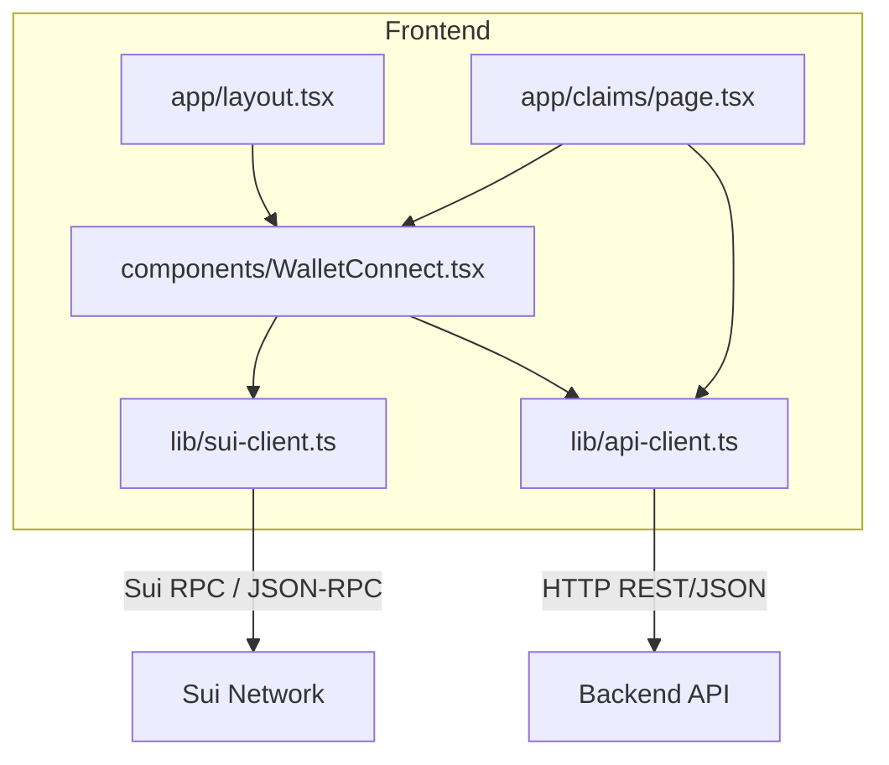
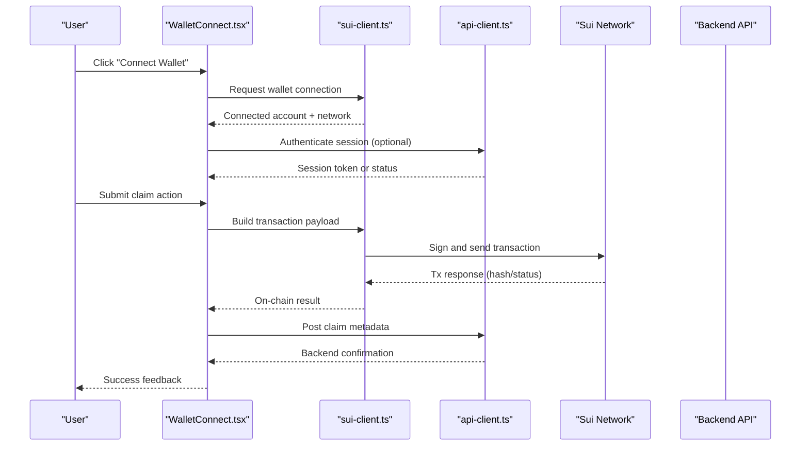
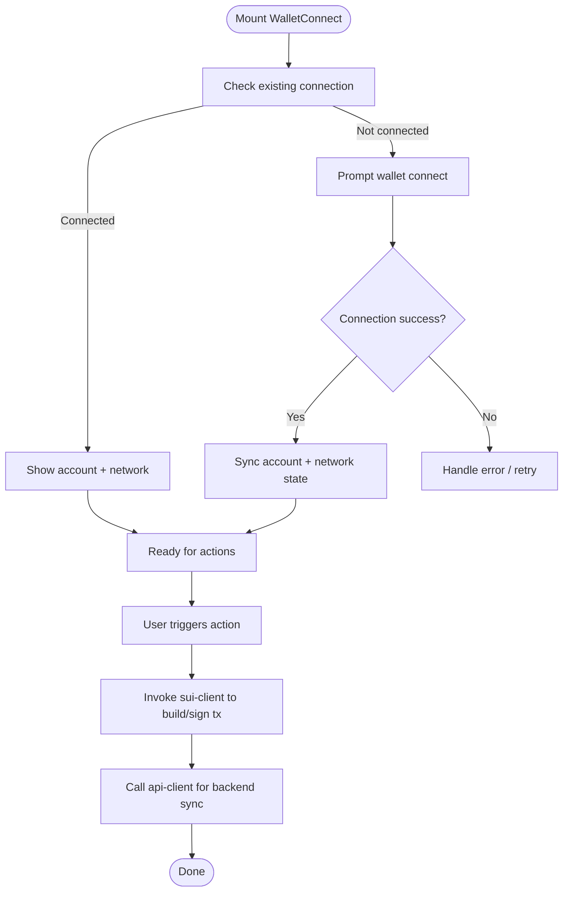
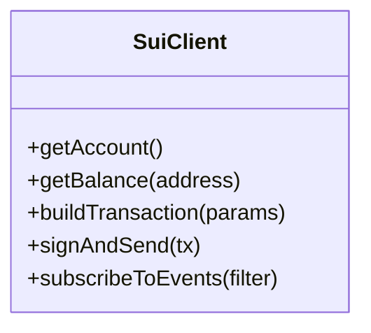
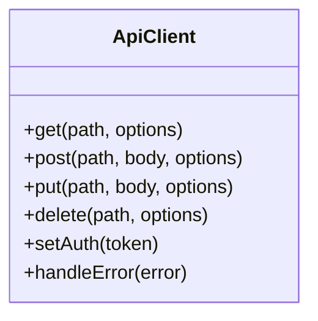
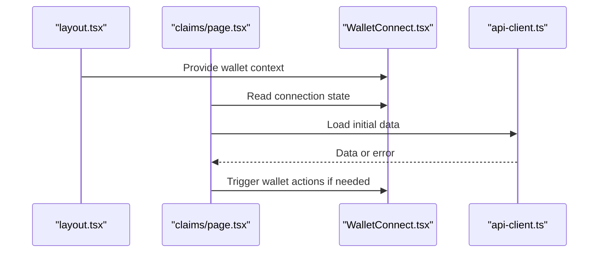
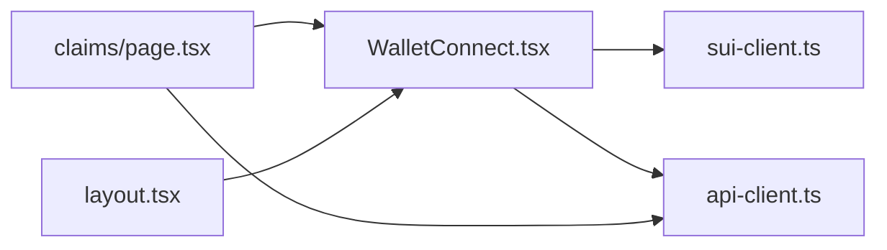

# Wallet Connectivity & Blockchain Integration

<cite>
**Referenced Files in This Document**
- [WalletConnect.tsx](file://frontend/src/components/WalletConnect.tsx)
- [sui-client.ts](file://frontend/src/lib/sui-client.ts)
- [api-client.ts](file://frontend/src/lib/api-client.ts)
- [layout.tsx](file://frontend/src/app/layout.tsx)
- [claims/page.tsx](file://frontend/src/app/claims/page.tsx)
</cite>

## Table of Contents
1. [Introduction](#introduction)
2. [Project Structure](#project-structure)
3. [Core Components](#core-components)
4. [Architecture Overview](#architecture-overview)
5. [Detailed Component Analysis](#detailed-component-analysis)
6. [Dependency Analysis](#dependency-analysis)
7. [Performance Considerations](#performance-considerations)
8. [Troubleshooting Guide](#troubleshooting-guide)
9. [Conclusion](#conclusion)

## Introduction
This document explains how the Insurix frontend integrates with Sui wallets and blockchain services, covering wallet connection, authentication flow, session management, Sui client utilities for blockchain interactions, transaction signing, account management, and the API client used to communicate with the backend. It also provides practical examples and guidance for handling connection states and errors.

## Project Structure
The relevant frontend code for wallet connectivity and blockchain integration is organized under:
- UI components for wallet connection and user interaction
- Library modules for Sui client utilities and API communication
- App layout and feature pages that consume these modules

**Diagram sources**
- [WalletConnect.tsx](file://frontend/src/components/WalletConnect.tsx)
- [sui-client.ts](file://frontend/src/lib/sui-client.ts)
- [api-client.ts](file://frontend/src/lib/api-client.ts)
- [layout.tsx](file://frontend/src/app/layout.tsx)
- [claims/page.tsx](file://frontend/src/app/claims/page.tsx)

**Section sources**
- [WalletConnect.tsx](file://frontend/src/components/WalletConnect.tsx)
- [sui-client.ts](file://frontend/src/lib/sui-client.ts)
- [api-client.ts](file://frontend/src/lib/api-client.ts)
- [layout.tsx](file://frontend/src/app/layout.tsx)
- [claims/page.tsx](file://frontend/src/app/claims/page.tsx)

## Core Components
- WalletConnect component: Manages wallet discovery, connection prompts, and state synchronization (connected/disconnected accounts, network).
- Sui client utilities: Provide methods to interact with the Sui network, including fetching account info, building transactions, and signing via the connected wallet.
- API client: Encapsulates HTTP requests to the backend, standardizing error handling, retries, and request/response patterns.

Key responsibilities:
- Maintain a consistent connection state across the app
- Trigger wallet prompts when needed
- Build and sign transactions using the active wallet
- Communicate with the backend for off-chain operations and attestation workflows

**Section sources**
- [WalletConnect.tsx](file://frontend/src/components/WalletConnect.tsx)
- [sui-client.ts](file://frontend/src/lib/sui-client.ts)
- [api-client.ts](file://frontend/src/lib/api-client.ts)

## Architecture Overview
The frontend orchestrates wallet connectivity and blockchain interactions through a layered approach:
- UI layer triggers actions (connect wallet, submit claims)
- WalletConnect manages wallet lifecycle and exposes hooks/state
- Sui client handles on-chain calls and transaction signing
- API client communicates with the backend for business logic and data persistence

**Diagram sources**
- [WalletConnect.tsx](file://frontend/src/components/WalletConnect.tsx)
- [sui-client.ts](file://frontend/src/lib/sui-client.ts)
- [api-client.ts](file://frontend/src/lib/api-client.ts)

## Detailed Component Analysis

### WalletConnect Component
Responsibilities:
- Detect available wallets and prompt connection
- Track connection state (account address, chain/network)
- Expose helpers to trigger signed transactions from the UI
- Integrate with the API client to establish sessions after successful connection

Typical usage:
- Wrap application features behind a connected-wallet guard
- Display account details and network info
- Provide buttons to initiate blockchain actions

**Diagram sources**
- [WalletConnect.tsx](file://frontend/src/components/WalletConnect.tsx)
- [sui-client.ts](file://frontend/src/lib/sui-client.ts)
- [api-client.ts](file://frontend/src/lib/api-client.ts)

**Section sources**
- [WalletConnect.tsx](file://frontend/src/components/WalletConnect.tsx)

### Sui Client Utilities
Responsibilities:
- Initialize and configure the Sui client for the target network
- Fetch account information and balances
- Build transaction blocks and call Move functions
- Delegate signing to the connected wallet and return results

Common operations:
- Get current account and network
- Build and execute transactions
- Handle provider-specific signing flows

**Diagram sources**
- [sui-client.ts](file://frontend/src/lib/sui-client.ts)

**Section sources**
- [sui-client.ts](file://frontend/src/lib/sui-client.ts)

### API Client
Responsibilities:
- Centralize HTTP requests to the backend
- Attach authentication headers when available
- Normalize errors and provide typed responses
- Support retries and timeouts where appropriate

Patterns:
- Use a base URL and environment variables
- Wrap common endpoints (auth, claims, attestations)
- Convert network errors into user-friendly messages

**Diagram sources**
- [api-client.ts](file://frontend/src/lib/api-client.ts)

**Section sources**
- [api-client.ts](file://frontend/src/lib/api-client.ts)

### App Layout and Feature Pages
- The root layout initializes global providers and may inject wallet context.
- Feature pages (e.g., claims) consume WalletConnect and API client to orchestrate user flows.

**Diagram sources**
- [layout.tsx](file://frontend/src/app/layout.tsx)
- [claims/page.tsx](file://frontend/src/app/claims/page.tsx)
- [WalletConnect.tsx](file://frontend/src/components/WalletConnect.tsx)
- [api-client.ts](file://frontend/src/lib/api-client.ts)

**Section sources**
- [layout.tsx](file://frontend/src/app/layout.tsx)
- [claims/page.tsx](file://frontend/src/app/claims/page.tsx)

## Dependency Analysis
- WalletConnect depends on Sui client utilities for on-chain operations and on the API client for backend synchronization.
- Feature pages depend on WalletConnect for state and on the API client for data operations.
- Sui client abstracts network specifics; API client abstracts HTTP concerns.

**Diagram sources**
- [WalletConnect.tsx](file://frontend/src/components/WalletConnect.tsx)
- [sui-client.ts](file://frontend/src/lib/sui-client.ts)
- [api-client.ts](file://frontend/src/lib/api-client.ts)
- [claims/page.tsx](file://frontend/src/app/claims/page.tsx)
- [layout.tsx](file://frontend/src/app/layout.tsx)

**Section sources**
- [WalletConnect.tsx](file://frontend/src/components/WalletConnect.tsx)
- [sui-client.ts](file://frontend/src/lib/sui-client.ts)
- [api-client.ts](file://frontend/src/lib/api-client.ts)
- [claims/page.tsx](file://frontend/src/app/claims/page.tsx)
- [layout.tsx](file://frontend/src/app/layout.tsx)

## Performance Considerations
- Cache frequent read-only queries (balances, metadata) to reduce RPC load.
- Debounce rapid wallet state changes to avoid excessive re-renders.
- Use pagination and selective fields for large datasets from the backend.
- Implement optimistic updates where safe to improve perceived responsiveness.
- Set sensible timeouts and retry policies for network requests.

[No sources needed since this section provides general guidance]

## Troubleshooting Guide
Common issues and resolutions:
- Wallet not detected: Ensure the browser has a supported Sui wallet extension installed and enabled.
- Connection fails: Verify network configuration and CORS settings for both wallet provider and backend.
- Transaction signing errors: Confirm the correct account and network are selected; validate transaction parameters.
- API errors: Check authentication headers, endpoint availability, and error payloads returned by the backend.

Operational tips:
- Log connection events and errors at each layer (wallet, Sui client, API client).
- Surface user-friendly messages for network failures and invalid inputs.
- Provide retry mechanisms for transient errors.

**Section sources**
- [WalletConnect.tsx](file://frontend/src/components/WalletConnect.tsx)
- [sui-client.ts](file://frontend/src/lib/sui-client.ts)
- [api-client.ts](file://frontend/src/lib/api-client.ts)

## Conclusion
The Insurix frontend integrates Sui wallets and blockchain interactions through a clear separation of concerns: a wallet connector UI, robust Sui client utilities, and a standardized API client. This architecture enables reliable connection management, secure transaction signing, and consistent backend communication while providing a smooth user experience.

[No sources needed since this section summarizes without analyzing specific files]