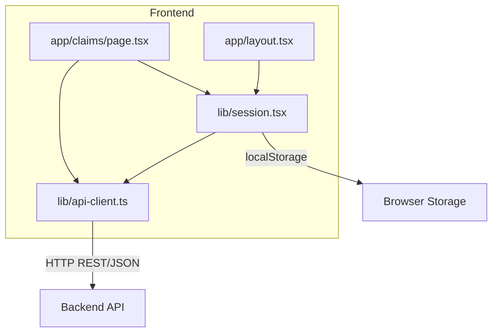
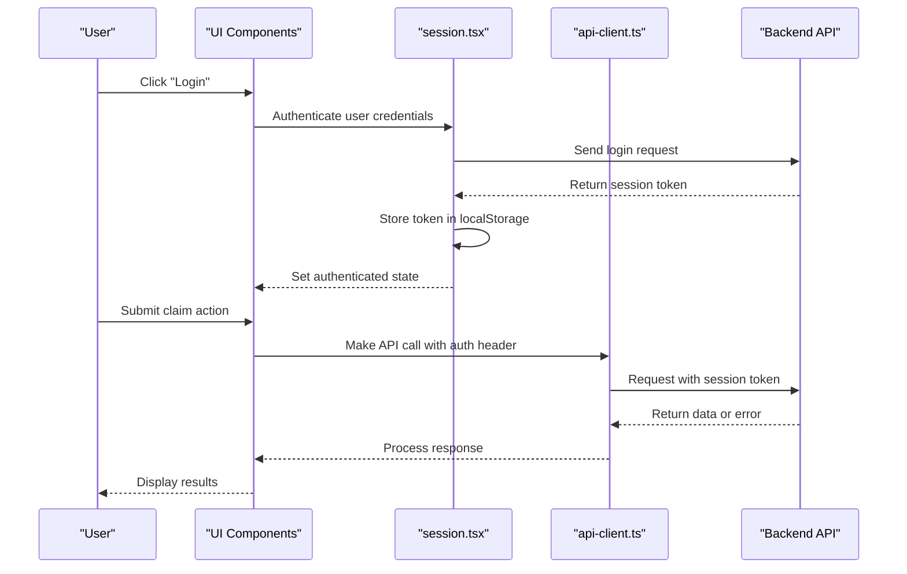
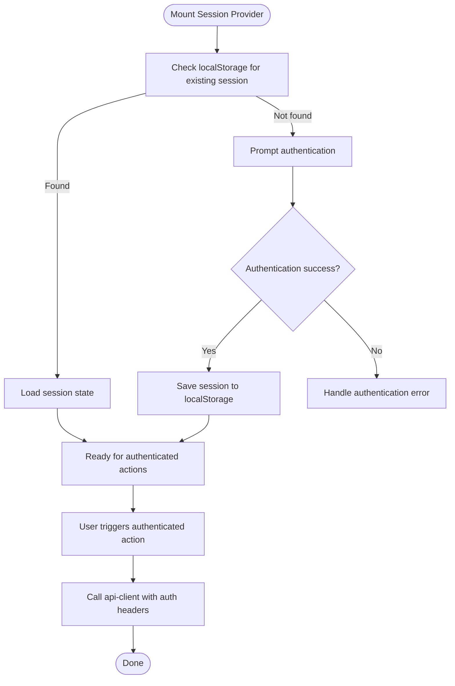
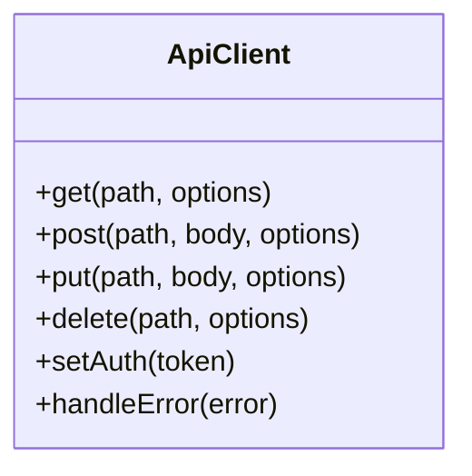
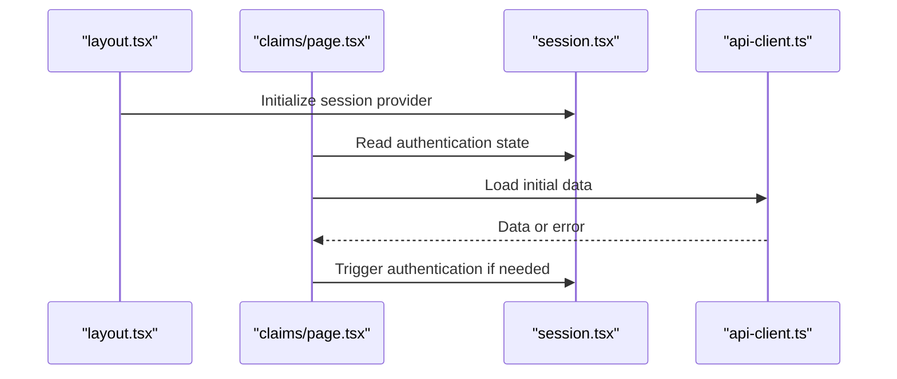
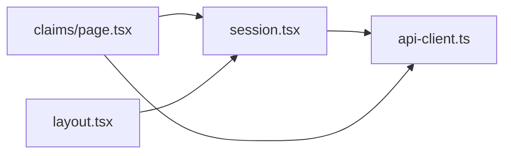

# Wallet Connectivity & Blockchain Integration

<cite>
**Referenced Files in This Document**
- [session.tsx](file://frontend/src/lib/session.tsx)
- [api-client.ts](file://frontend/src/lib/api-client.ts)
- [layout.tsx](file://frontend/src/app/layout.tsx)
- [claims/page.tsx](file://frontend/src/app/claims/page.tsx)
</cite>

## Update Summary
**Changes Made**
- Completely removed all wallet connectivity and blockchain integration references
- Updated architecture to reflect localStorage-based session management
- Removed all @mysten/dapp-kit, wallet provider configuration, and blockchain transaction signing content
- Replaced with session-based authentication flow documentation
- Updated all diagrams and examples to reflect the new architecture

## Table of Contents
1. [Introduction](#introduction)
2. [Project Structure](#project-structure)
3. [Core Components](#core-components)
4. [Architecture Overview](#architecture-overview)
5. [Detailed Component Analysis](#detailed-component-analysis)
6. [Dependency Analysis](#dependency-analysis)
7. [Performance Considerations](#performance-considerations)
8. [Troubleshooting Guide](#troubleshooting-guide)
9. [Conclusion](#conclusion)

## Introduction
This document explains how the Insurix frontend manages user sessions and communicates with backend services. The application has transitioned from blockchain wallet connectivity to a localStorage-based session management system. This approach provides a simpler, more accessible authentication flow while maintaining secure communication with the backend API for business logic and data persistence.

## Project Structure
The relevant frontend code for session management and API communication is organized under:
- Session management utilities for localStorage-based authentication
- Library modules for API communication and error handling
- App layout and feature pages that consume these modules

**Diagram sources**
- [session.tsx](file://frontend/src/lib/session.tsx)
- [api-client.ts](file://frontend/src/lib/api-client.ts)
- [layout.tsx](file://frontend/src/app/layout.tsx)
- [claims/page.tsx](file://frontend/src/app/claims/page.tsx)

**Section sources**
- [session.tsx](file://frontend/src/lib/session.tsx)
- [api-client.ts](file://frontend/src/lib/api-client.ts)
- [layout.tsx](file://frontend/src/app/layout.tsx)
- [claims/page.tsx](file://frontend/src/app/claims/page.tsx)

## Core Components
- Session management: Handles localStorage-based authentication, session persistence, and user state synchronization across the application.
- API client: Encapsulates HTTP requests to the backend, standardizing error handling, retries, and request/response patterns.
- Layout components: Initialize global providers and manage authentication context throughout the application.

Key responsibilities:
- Maintain consistent session state across the app using localStorage
- Handle authentication flows without blockchain dependencies
- Communicate with the backend for off-chain operations and business logic
- Provide secure session management and token handling

**Section sources**
- [session.tsx](file://frontend/src/lib/session.tsx)
- [api-client.ts](file://frontend/src/lib/api-client.ts)

## Architecture Overview
The frontend orchestrates session management and backend communication through a streamlined approach:
- UI layer triggers actions (login, submit claims)
- Session management handles authentication state and localStorage persistence
- API client communicates with the backend for business logic and data persistence

**Diagram sources**
- [session.tsx](file://frontend/src/lib/session.tsx)
- [api-client.ts](file://frontend/src/lib/api-client.ts)

## Detailed Component Analysis

### Session Management
Responsibilities:
- Manage user authentication state using localStorage
- Handle session persistence across browser sessions
- Provide hooks and utilities for accessing current user state
- Manage logout and session cleanup

Typical usage:
- Wrap application features behind an authenticated guard
- Access current user information and permissions
- Trigger authentication flows when needed

**Diagram sources**
- [session.tsx](file://frontend/src/lib/session.tsx)
- [api-client.ts](file://frontend/src/lib/api-client.ts)

**Section sources**
- [session.tsx](file://frontend/src/lib/session.tsx)

### API Client
Responsibilities:
- Centralize HTTP requests to the backend
- Attach authentication headers when available
- Normalize errors and provide typed responses
- Support retries and timeouts where appropriate

Patterns:
- Use a base URL and environment variables
- Wrap common endpoints (auth, claims, attestations)
- Convert network errors into user-friendly messages

**Diagram sources**
- [api-client.ts](file://frontend/src/lib/api-client.ts)

**Section sources**
- [api-client.ts](file://frontend/src/lib/api-client.ts)

### App Layout and Feature Pages
- The root layout initializes global providers and manages authentication context.
- Feature pages consume session management and API client to orchestrate user flows.

**Diagram sources**
- [layout.tsx](file://frontend/src/app/layout.tsx)
- [claims/page.tsx](file://frontend/src/app/claims/page.tsx)
- [session.tsx](file://frontend/src/lib/session.tsx)
- [api-client.ts](file://frontend/src/lib/api-client.ts)

**Section sources**
- [layout.tsx](file://frontend/src/app/layout.tsx)
- [claims/page.tsx](file://frontend/src/app/claims/page.tsx)

## Dependency Analysis
- Session management depends on localStorage for persistence and the API client for backend communication.
- Feature pages depend on session management for authentication state and on the API client for data operations.
- API client abstracts HTTP concerns and handles authentication automatically.

**Diagram sources**
- [session.tsx](file://frontend/src/lib/session.tsx)
- [api-client.ts](file://frontend/src/lib/api-client.ts)
- [claims/page.tsx](file://frontend/src/app/claims/page.tsx)
- [layout.tsx](file://frontend/src/app/layout.tsx)

**Section sources**
- [session.tsx](file://frontend/src/lib/session.tsx)
- [api-client.ts](file://frontend/src/lib/api-client.ts)
- [claims/page.tsx](file://frontend/src/app/claims/page.tsx)
- [layout.tsx](file://frontend/src/app/layout.tsx)

## Performance Considerations
- Cache frequently accessed session data to reduce localStorage operations.
- Implement optimistic updates for better perceived responsiveness.
- Use pagination and selective fields for large datasets from the backend.
- Set sensible timeouts and retry policies for network requests.
- Debounce rapid state changes to avoid excessive re-renders.

## Troubleshooting Guide
Common issues and resolutions:
- Session not persisting: Verify localStorage availability and storage permissions in the browser.
- Authentication fails: Check backend endpoint availability and network connectivity.
- API errors: Verify authentication headers, endpoint availability, and error payloads returned by the backend.
- State synchronization issues: Ensure proper session provider initialization and state updates.

Operational tips:
- Log authentication events and errors at each layer (session, API client).
- Surface user-friendly messages for network failures and invalid inputs.
- Provide retry mechanisms for transient errors.
- Monitor localStorage usage and implement cleanup for expired sessions.

**Section sources**
- [session.tsx](file://frontend/src/lib/session.tsx)
- [api-client.ts](file://frontend/src/lib/api-client.ts)

## Conclusion
The Insurix frontend now uses a streamlined localStorage-based session management system instead of blockchain wallet connectivity. This approach provides a simpler, more accessible authentication flow while maintaining secure communication with the backend API. The architecture focuses on reliable session management, efficient API communication, and a smooth user experience without the complexity of blockchain interactions.