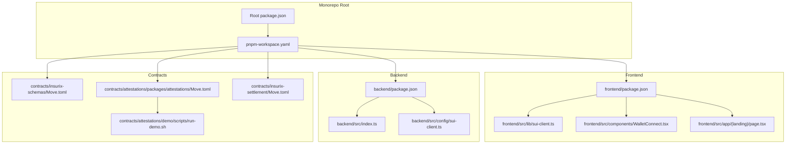
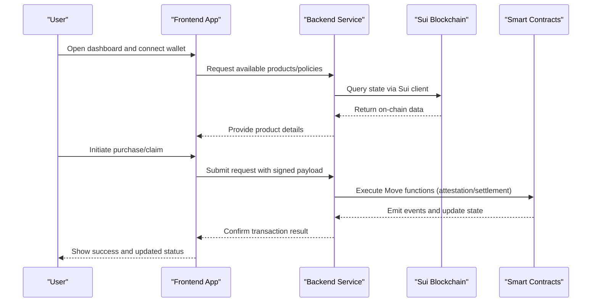
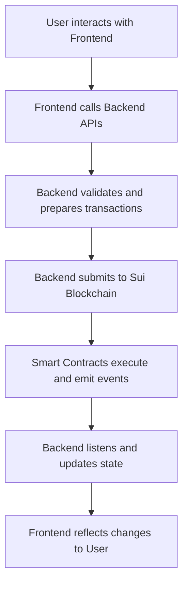
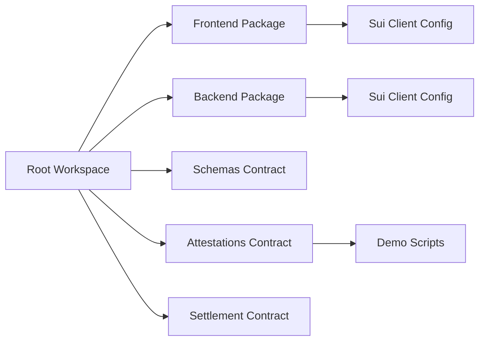

# Getting Started

<cite>
**Referenced Files in This Document**
- [package.json](file://package.json)
- [pnpm-workspace.yaml](file://pnpm-workspace.yaml)
- [frontend/package.json](file://frontend/package.json)
- [backend/package.json](file://backend/package.json)
- [contracts/insurix-schemas/Move.toml](file://contracts/insurix-schemas/Move.toml)
- [contracts/insurix-settlement/Move.toml](file://contracts/insurix-settlement/Move.toml)
- [contracts/attestations/packages/attestations/Move.toml](file://contracts/attestations/packages/attestations/Move.toml)
- [frontend/src/lib/sui-client.ts](file://frontend/src/lib/sui-client.ts)
- [backend/src/config/sui-client.ts](file://backend/src/config/sui-client.ts)
- [frontend/src/components/WalletConnect.tsx](file://frontend/src/components/WalletConnect.tsx)
- [frontend/src/app/(landing)/page.tsx](file://frontend/src/app/(landing)/page.tsx)
- [backend/src/index.ts](file://backend/src/index.ts)
- [contracts/attestations/demo/scripts/run-demo.sh](file://contracts/attestations/demo/scripts/run-demo.sh)
</cite>

## Table of Contents
1. [Introduction](#introduction)
2. [Project Structure](#project-structure)
3. [Core Components](#core-components)
4. [Architecture Overview](#architecture-overview)
5. [Detailed Component Analysis](#detailed-component-analysis)
6. [Dependency Analysis](#dependency-analysis)
7. [Performance Considerations](#performance-considerations)
8. [Troubleshooting Guide](#troubleshooting-guide)
9. [Conclusion](#conclusion)
10. [Appendices](#appendices)

## Introduction
Insurix is a decentralized insurance protocol built on the Sui blockchain. It combines smart contracts for policy and claim settlement with an AI-driven backend workflow and a modern web frontend to deliver transparent, automated insurance processes. The monorepo organizes frontend, backend, and Move smart contracts into cohesive packages that can be developed and deployed independently or together.

This guide helps you set up your environment, understand the architecture, and run the project locally. Beginners will find step-by-step instructions, while experienced developers can quickly navigate the monorepo and use essential commands.

## Project Structure
The repository is a pnpm workspace containing:
- Frontend (Next.js app)
- Backend (TypeScript service)
- Smart Contracts (Move packages for schemas, attestations, and settlement)
- Shared scripts and documentation

**Diagram sources**
- [package.json](file://package.json)
- [pnpm-workspace.yaml](file://pnpm-workspace.yaml)
- [frontend/package.json](file://frontend/package.json)
- [backend/package.json](file://backend/package.json)
- [contracts/insurix-schemas/Move.toml](file://contracts/insurix-schemas/Move.toml)
- [contracts/attestations/packages/attestations/Move.toml](file://contracts/attestations/packages/attestations/Move.toml)
- [contracts/insurix-settlement/Move.toml](file://contracts/insurix-settlement/Move.toml)
- [contracts/attestations/demo/scripts/run-demo.sh](file://contracts/attestations/demo/scripts/run-demo.sh)

**Section sources**
- [package.json](file://package.json)
- [pnpm-workspace.yaml](file://pnpm-workspace.yaml)
- [frontend/package.json](file://frontend/package.json)
- [backend/package.json](file://backend/package.json)

## Core Components
- Frontend: Next.js application providing user interfaces for browsing, connecting wallets, and interacting with claims and policies.
- Backend: TypeScript service orchestrating AI agents, external data, and Sui interactions for attestation and claim workflows.
- Smart Contracts: Move modules defining data schemas, attestation logic, and settlement flows.

Key integration points:
- Sui client configuration in both frontend and backend for network and RPC settings.
- Wallet connection component enabling user authentication and transaction signing.
- Demo scripts for local contract deployment and testing.

**Section sources**
- [frontend/src/lib/sui-client.ts](file://frontend/src/lib/sui-client.ts)
- [backend/src/config/sui-client.ts](file://backend/src/config/sui-client.ts)
- [frontend/src/components/WalletConnect.tsx](file://frontend/src/components/WalletConnect.tsx)
- [contracts/attestations/demo/scripts/run-demo.sh](file://contracts/attestations/demo/scripts/run-demo.sh)

## Architecture Overview
High-level flow from user interaction to on-chain settlement:

**Diagram sources**
- [frontend/src/lib/sui-client.ts](file://frontend/src/lib/sui-client.ts)
- [backend/src/config/sui-client.ts](file://backend/src/config/sui-client.ts)
- [contracts/insurix-schemas/Move.toml](file://contracts/insurix-schemas/Move.toml)
- [contracts/insurix-settlement/Move.toml](file://contracts/insurix-settlement/Move.toml)
- [contracts/attestations/packages/attestations/Move.toml](file://contracts/attestations/packages/attestations/Move.toml)

## Detailed Component Analysis

### Frontend Setup and Usage
- Purpose: Provides UI for wallet connection, product browsing, and claim management.
- Key files:
  - Sui client configuration for network and RPC endpoints.
  - Wallet connection component for user authentication and signing.
  - Landing page entry point for initial navigation.

Steps:
1. Install dependencies using pnpm.
2. Configure Sui client environment variables for the desired network.
3. Start the development server and open the landing page.
4. Connect a Sui-compatible wallet to interact with on-chain features.

**Section sources**
- [frontend/package.json](file://frontend/package.json)
- [frontend/src/lib/sui-client.ts](file://frontend/src/lib/sui-client.ts)
- [frontend/src/components/WalletConnect.tsx](file://frontend/src/components/WalletConnect.tsx)
- [frontend/src/app/(landing)/page.tsx](file://frontend/src/app/(landing)/page.tsx)

### Backend Setup and Usage
- Purpose: Orchestrates AI agents, external data retrieval, and Sui interactions for attestations and claims.
- Key files:
  - Main entry point for the service.
  - Sui client configuration for network access.

Steps:
1. Install dependencies using pnpm.
2. Configure Sui client environment variables for the target network.
3. Start the backend service and verify health endpoints.
4. Use API endpoints to trigger attestations and claim processing.

**Section sources**
- [backend/package.json](file://backend/package.json)
- [backend/src/index.ts](file://backend/src/index.ts)
- [backend/src/config/sui-client.ts](file://backend/src/config/sui-client.ts)

### Smart Contracts (Move)
- Purpose: Implements core insurance logic including schemas, attestations, and settlement.
- Key packages:
  - insurix-schemas: Data models and shared types.
  - attestations: Attestation workflows and auditing.
  - insurix-settlement: Claim settlement and escrow mechanisms.

Development steps:
1. Ensure Sui CLI and toolchain are installed.
2. Navigate to each Move package directory.
3. Build and test contracts using standard Move commands.
4. Deploy to localnet or testnet as needed.

**Section sources**
- [contracts/insurix-schemas/Move.toml](file://contracts/insurix-schemas/Move.toml)
- [contracts/attestations/packages/attestations/Move.toml](file://contracts/attestations/packages/attestations/Move.toml)
- [contracts/insurix-settlement/Move.toml](file://contracts/insurix-settlement/Move.toml)

### Conceptual Overview
The system integrates three layers:
- Frontend layer for user interactions and wallet connectivity.
- Backend layer for business logic, AI orchestration, and Sui communication.
- On-chain layer for immutable policy and settlement rules.

[No sources needed since this diagram shows conceptual workflow, not actual code structure]

## Dependency Analysis
The monorepo uses pnpm workspaces to manage dependencies across frontend, backend, and contracts. Each package has its own package.json or Move.toml, allowing independent versioning and builds.

**Diagram sources**
- [package.json](file://package.json)
- [pnpm-workspace.yaml](file://pnpm-workspace.yaml)
- [frontend/package.json](file://frontend/package.json)
- [backend/package.json](file://backend/package.json)
- [contracts/insurix-schemas/Move.toml](file://contracts/insurix-schemas/Move.toml)
- [contracts/attestations/packages/attestations/Move.toml](file://contracts/attestations/packages/attestations/Move.toml)
- [contracts/insurix-settlement/Move.toml](file://contracts/insurix-settlement/Move.toml)
- [contracts/attestations/demo/scripts/run-demo.sh](file://contracts/attestations/demo/scripts/run-demo.sh)

**Section sources**
- [package.json](file://package.json)
- [pnpm-workspace.yaml](file://pnpm-workspace.yaml)

## Performance Considerations
- Optimize Sui client connections by reusing instances and configuring appropriate timeouts.
- Cache frequently accessed on-chain data in the backend to reduce RPC calls.
- Use efficient Move patterns to minimize gas costs and improve transaction throughput.
- Implement pagination and filtering in frontend queries to enhance responsiveness.

[No sources needed since this section provides general guidance]

## Troubleshooting Guide
Common issues and resolutions:
- Wallet connection failures: Verify network configuration and ensure the wallet supports the selected Sui network.
- Backend startup errors: Check environment variables for Sui client configuration and ensure required services are running.
- Contract deployment problems: Validate Move toolchain installation and confirm localnet/testnet accessibility.

**Section sources**
- [frontend/src/lib/sui-client.ts](file://frontend/src/lib/sui-client.ts)
- [backend/src/config/sui-client.ts](file://backend/src/config/sui-client.ts)
- [contracts/attestations/demo/scripts/run-demo.sh](file://contracts/attestations/demo/scripts/run-demo.sh)

## Conclusion
You now have a foundational understanding of Insurix’s architecture and how to set up the development environment. Start with the frontend and backend setup, then explore the Move contracts. Use the provided scripts and configurations to iterate quickly and deploy to test environments. For advanced usage, dive into the AI agent workflows and custom attestation modules.

[No sources needed since this section summarizes without analyzing specific files]

## Appendices

### Prerequisites
- Node.js (LTS recommended)
- pnpm package manager
- Sui CLI and toolchain
- Sui-compatible wallet (e.g., Sui Wallet, Ethos, etc.)
- Access to Sui localnet or testnet

### Installation Steps
1. Clone the repository and install dependencies:
   - Run pnpm install at the monorepo root.
2. Set up environment variables:
   - Configure Sui client endpoints in frontend and backend.
3. Start services:
   - Launch the frontend development server.
   - Start the backend service.
4. Deploy contracts:
   - Use Move commands to build and deploy contracts to localnet or testnet.

### Quick Start Tutorial
1. Connect your wallet to the frontend.
2. Browse available insurance products.
3. Initiate a policy purchase or claim submission.
4. Monitor transaction status and results in the UI.

### Essential Commands
- Monorepo:
  - pnpm install: Install all dependencies.
  - pnpm dev: Start development servers for workspace packages.
- Frontend:
  - pnpm dev: Run the Next.js development server.
  - pnpm build: Build for production.
- Backend:
  - pnpm dev: Start the backend service.
  - pnpm start: Run the compiled service.
- Contracts:
  - sui move build: Build Move packages.
  - sui move test: Run tests for Move modules.

**Section sources**
- [frontend/package.json](file://frontend/package.json)
- [backend/package.json](file://backend/package.json)
- [contracts/insurix-schemas/Move.toml](file://contracts/insurix-schemas/Move.toml)
- [contracts/attestations/packages/attestations/Move.toml](file://contracts/attestations/packages/attestations/Move.toml)
- [contracts/insurix-settlement/Move.toml](file://contracts/insurix-settlement/Move.toml)