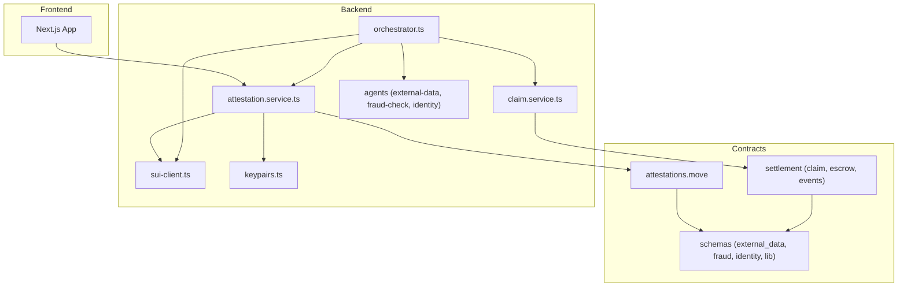
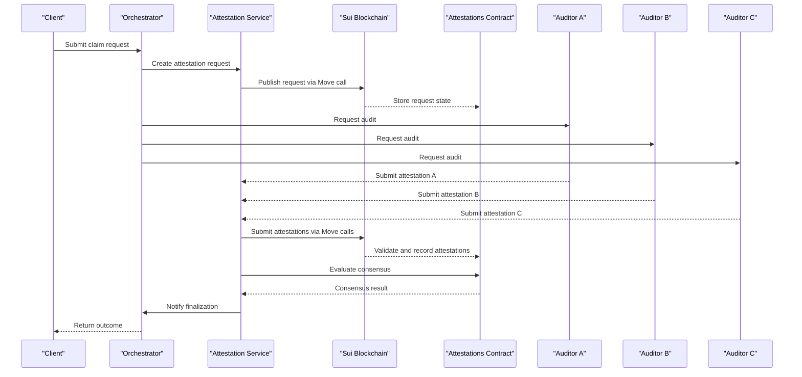
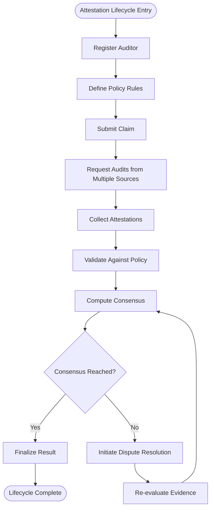
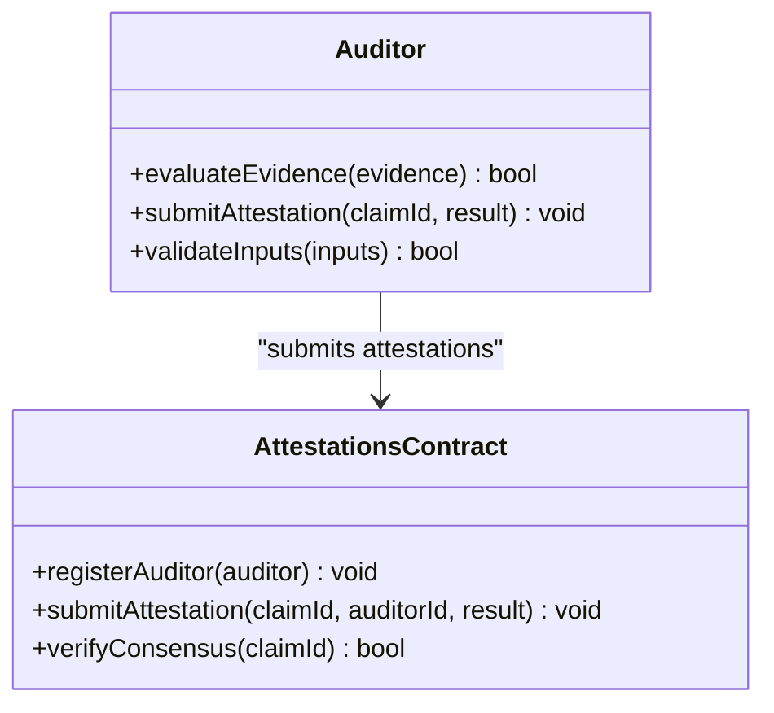
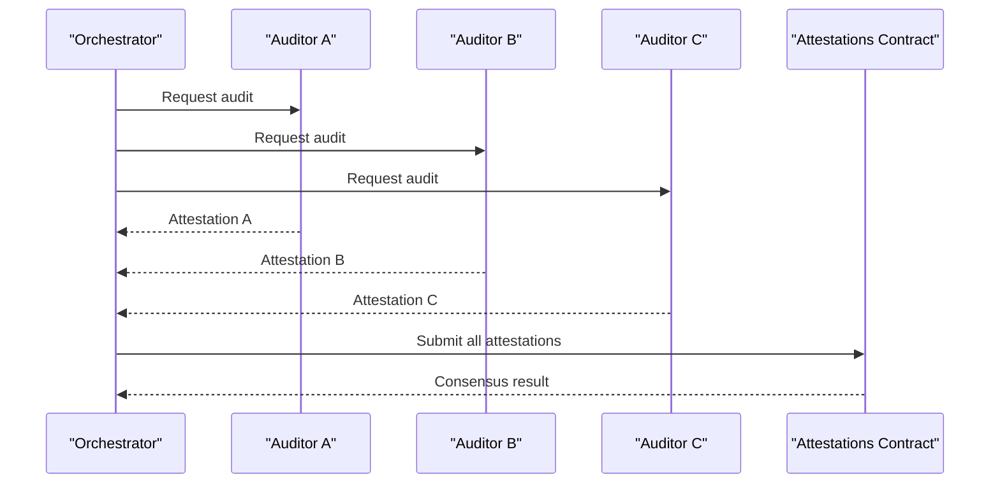
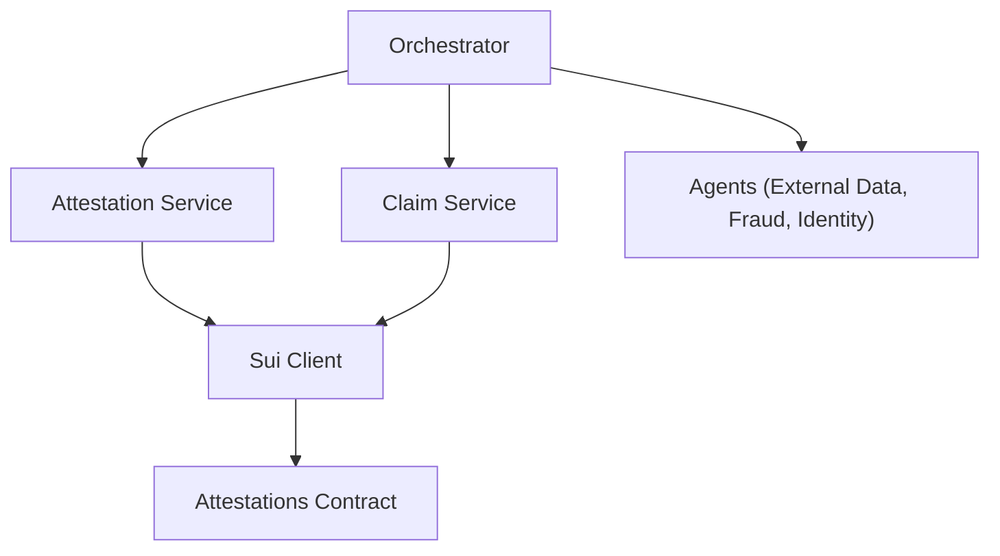
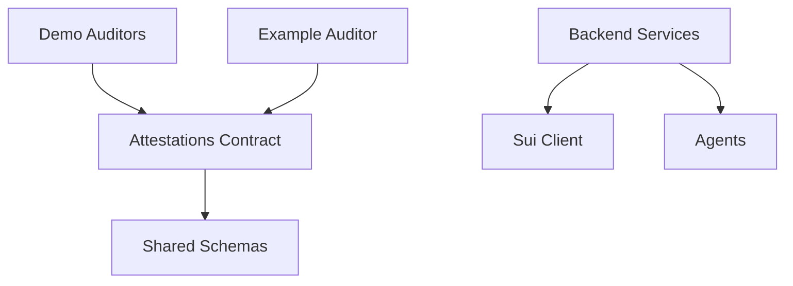

# Attestation System

<cite>
**Referenced Files in This Document**
- [attestations.move](file://contracts/attestations/packages/attestations/sources/attestations.move)
- [attestations_tests.move](file://contracts/attestations/packages/attestations/tests/attestations_tests.move)
- [README.md](file://contracts/attestations/README.md)
- [DESIGN.md](file://contracts/attestations/DESIGN.md)
- [CONVENTIONS.md](file://contracts/attestations/CONVENTIONS.md)
- [FUTURE-EXTENSIONS.md](file://contracts/attestations/FUTURE-EXTENSIONS.md)
- [SIP-56-COMPARISON.md](file://contracts/attestations/SIP-56-COMPARISON.md)
- [Move.toml](file://contracts/attestations/packages/attestations/Move.toml)
- [Published.toml](file://contracts/attestations/packages/attestations/Published.toml)
- [audit.move (example auditor)](file://contracts/attestations/examples/auditor/sources/audit.move)
- [audit_tests.move (example auditor tests)](file://contracts/attestations/examples/auditor/tests/audit_tests.move)
- [Move.toml (example auditor)](file://contracts/attestations/examples/auditor/Move.toml)
- [audit_a.move (demo auditor A)](file://contracts/attestations/demo/auditor_a/sources/audit.move)
- [audit_b.move (demo auditor B)](file://contracts/attestations/demo/auditor_b/sources/audit.move)
- [audit_c.move (demo auditor C)](file://contracts/attestations/demo/auditor_c/sources/audit.move)
- [subject.move (demo subject)](file://contracts/attestations/demo/subject_example/sources/subject.move)
- [dependency.move (demo dependency)](file://contracts/attestations/demo/dependency_example/sources/dependency.move)
- [scripts/run-demo.sh](file://contracts/attestations/demo/scripts/run-demo.sh)
- [scripts/demo.sh](file://contracts/attestations/demo/scripts/demo.sh)
- [scripts/localnets.py](file://contracts/attestations/demo/scripts/localnets.py)
- [attest-audit.sh](file://contracts/attestations/scripts/attest-audit.sh)
- [check.sh](file://contracts/attestations/scripts/check.sh)
- [create-box.sh](file://contracts/attestations/scripts/create-box.sh)
- [revoke-audit.sh](file://contracts/attestations/scripts/revoke-audit.sh)
- [attestation.service.ts](file://backend/src/services/attestation.service.ts)
- [claim.service.ts](file://backend/src/services/claim.service.ts)
- [orchestrator.ts](file://backend/src/services/orchestrator.ts)
- [sui-client.ts](file://backend/src/config/sui-client.ts)
- [keypairs.ts](file://backend/src/config/keypairs.ts)
- [external-data.ts](file://backend/src/agents/external-data.ts)
- [fraud-check.ts](file://backend/src/agents/fraud-check.ts)
- [identity.ts](file://backend/src/agents/identity.ts)
- [index.ts](file://backend/src/index.ts)
</cite>

## Table of Contents
1. [Introduction](#introduction)
2. [Project Structure](#project-structure)
3. [Core Components](#core-components)
4. [Architecture Overview](#architecture-overview)
5. [Detailed Component Analysis](#detailed-component-analysis)
6. [Dependency Analysis](#dependency-analysis)
7. [Performance Considerations](#performance-considerations)
8. [Troubleshooting Guide](#troubleshooting-guide)
9. [Conclusion](#conclusion)
10. [Appendices](#appendices)

## Introduction
This document provides comprehensive documentation for the Insurix attestation system built with Move smart contracts on Sui. It explains the multi-auditor verification architecture, policy attestation lifecycle, and auditor coordination mechanisms. The core attestations.move contract manages state, auditor registration, verification workflows, and dispute resolution. Auditors submit independent attestations; claims are verified through multiple sources; consensus is reached via protocol rules. Integration patterns with backend services are documented alongside testing strategies, deployment procedures, and security considerations specific to the attestation system.

## Project Structure
The repository is organized into three primary layers:
- Contracts: Move packages implementing the attestation engine, schemas, and settlement logic.
- Backend: TypeScript services orchestrating claim processing, external data retrieval, fraud checks, identity verification, and Sui interactions.
- Frontend: Next.js application for user interfaces and wallet integration.

Key directories relevant to the attestation system:
- contracts/attestations: Core attestation package, examples, demos, scripts, and design docs.
- contracts/insurix-schemas: Shared Move types for external data, fraud, identity, and library utilities.
- contracts/insurix-settlement: Claim, escrow, events, and settlement logic that consumes attestations.
- backend/src/services: Attestation service, claim service, and orchestrator coordinating flows.
- backend/src/config: Sui client configuration and keypair management.
- backend/src/agents: External data, fraud check, and identity agents used by the backend.

**Diagram sources**
- [attestations.move](file://contracts/attestations/packages/attestations/sources/attestations.move)
- [attestation.service.ts](file://backend/src/services/attestation.service.ts)
- [claim.service.ts](file://backend/src/services/claim.service.ts)
- [orchestrator.ts](file://backend/src/services/orchestrator.ts)
- [sui-client.ts](file://backend/src/config/sui-client.ts)
- [keypairs.ts](file://backend/src/config/keypairs.ts)
- [external-data.ts](file://backend/src/agents/external-data.ts)
- [fraud-check.ts](file://backend/src/agents/fraud-check.ts)
- [identity.ts](file://backend/src/agents/identity.ts)

**Section sources**
- [README.md](file://contracts/attestations/README.md)
- [DESIGN.md](file://contracts/attestations/DESIGN.md)
- [CONVENTIONS.md](file://contracts/attestations/CONVENTIONS.md)
- [Move.toml](file://contracts/attestations/packages/attestations/Move.toml)
- [Published.toml](file://contracts/attestations/packages/attestations/Published.toml)

## Core Components
- Attestations Contract (attestations.move): Implements the core attestation engine including auditor registry, attestation submission, verification workflow, consensus evaluation, and dispute handling.
- Example Auditor Packages: Demonstrate how auditors implement audit logic and interact with the attestation engine.
- Demo Auditors (A/B/C): Provide a multi-auditor scenario with independent sources and coordinated verification.
- Subject and Dependency Examples: Show how subjects can be attested and dependencies managed across packages.
- Backend Services: Orchestrate claim creation, attestation requests, auditor submissions, and settlement integration.

Key responsibilities:
- State management for auditors, attestations, and policies.
- Registration and revocation of auditors.
- Submission and validation of attestations from multiple sources.
- Consensus determination based on predefined thresholds or rules.
- Dispute resolution flow and recovery mechanisms.

**Section sources**
- [attestations.move](file://contracts/attestations/packages/attestations/sources/attestations.move)
- [attestations_tests.move](file://contracts/attestations/packages/attestations/tests/attestations_tests.move)
- [audit.move (example auditor)](file://contracts/attestations/examples/auditor/sources/audit.move)
- [audit_tests.move (example auditor tests)](file://contracts/attestations/examples/auditor/tests/audit_tests.move)
- [audit_a.move (demo auditor A)](file://contracts/attestations/demo/auditor_a/sources/audit.move)
- [audit_b.move (demo auditor B)](file://contracts/attestations/demo/auditor_b/sources/audit.move)
- [audit_c.move (demo auditor C)](file://contracts/attestations/demo/auditor_c/sources/audit.move)
- [subject.move (demo subject)](file://contracts/attestations/demo/subject_example/sources/subject.move)
- [dependency.move (demo dependency)](file://contracts/attestations/demo/dependency_example/sources/dependency.move)

## Architecture Overview
The attestation system follows a multi-auditor verification model where independent auditors evaluate claims against policy rules and submit attestations. The backend coordinates the process by requesting audits, collecting results, and invoking the Move contracts to finalize consensus and trigger downstream settlement actions.

**Diagram sources**
- [orchestrator.ts](file://backend/src/services/orchestrator.ts)
- [attestation.service.ts](file://backend/src/services/attestation.service.ts)
- [attestations.move](file://contracts/attestations/packages/attestations/sources/attestations.move)

## Detailed Component Analysis

### Attestations Contract (attestations.move)
The core contract manages:
- Auditor registry: registration, permissions, and revocation.
- Policy definitions: rules governing acceptable attestation outcomes and thresholds.
- Attestation lifecycle: creation, submission, validation, and finalization.
- Verification workflow: multi-source aggregation and consensus evaluation.
- Dispute resolution: mechanisms to challenge and resolve conflicting attestations.

State management includes:
- Auditor entries with credentials and status.
- Attestation records linked to claims/policies.
- Aggregated results and consensus flags.
- Event emissions for off-chain observability.

Verification workflow:
- Multiple auditors independently evaluate evidence.
- Attestations are validated against policy constraints.
- Consensus is computed using threshold rules or majority voting.
- Finalized results trigger downstream actions (e.g., settlement).

Dispute resolution:
- Allows stakeholders to contest outcomes.
- Triggers re-evaluation or arbitration steps.
- Updates state and emits events for transparency.

**Diagram sources**
- [attestations.move](file://contracts/attestations/packages/attestations/sources/attestations.move)

**Section sources**
- [attestations.move](file://contracts/attestations/packages/attestations/sources/attestations.move)
- [attestations_tests.move](file://contracts/attestations/packages/attestations/tests/attestations_tests.move)

### Example Auditor Package
Demonstrates how an auditor implements audit logic and interacts with the attestation contract:
- Defines audit functions to evaluate evidence.
- Submits attestations via Move calls.
- Handles errors and edge cases.

Testing strategy includes unit tests validating audit outcomes and integration with the attestation engine.

**Diagram sources**
- [audit.move (example auditor)](file://contracts/attestations/examples/auditor/sources/audit.move)
- [attestations.move](file://contracts/attestations/packages/attestations/sources/attestations.move)

**Section sources**
- [audit.move (example auditor)](file://contracts/attestations/examples/auditor/sources/audit.move)
- [audit_tests.move (example auditor tests)](file://contracts/attestations/examples/auditor/tests/audit_tests.move)
- [Move.toml (example auditor)](file://contracts/attestations/examples/auditor/Move.toml)

### Demo Multi-Auditor Scenario
Three independent auditors (A, B, C) demonstrate coordinated verification:
- Each auditor has distinct sources and logic.
- Backend aggregates results and invokes consensus evaluation.
- Scripts automate demo flows and localnet testing.

**Diagram sources**
- [audit_a.move (demo auditor A)](file://contracts/attestations/demo/auditor_a/sources/audit.move)
- [audit_b.move (demo auditor B)](file://contracts/attestations/demo/auditor_b/sources/audit.move)
- [audit_c.move (demo auditor C)](file://contracts/attestations/demo/auditor_c/sources/audit.move)
- [attestations.move](file://contracts/attestations/packages/attestations/sources/attestations.move)

**Section sources**
- [audit_a.move (demo auditor A)](file://contracts/attestations/demo/auditor_a/sources/audit.move)
- [audit_b.move (demo auditor B)](file://contracts/attestations/demo/auditor_b/sources/audit.move)
- [audit_c.move (demo auditor C)](file://contracts/attestations/demo/auditor_c/sources/audit.move)
- [scripts/run-demo.sh](file://contracts/attestations/demo/scripts/run-demo.sh)
- [scripts/demo.sh](file://contracts/attestations/demo/scripts/demo.sh)
- [scripts/localnets.py](file://contracts/attestations/demo/scripts/localnets.py)

### Backend Integration Patterns
The backend orchestrates the entire attestation lifecycle:
- Attestation service manages request creation, auditor coordination, and result aggregation.
- Claim service integrates with settlement logic to finalize outcomes.
- Orchestrator coordinates agents (external data, fraud check, identity) and Sui interactions.
- Sui client and keypairs handle blockchain communication and signing.

**Diagram sources**
- [orchestrator.ts](file://backend/src/services/orchestrator.ts)
- [attestation.service.ts](file://backend/src/services/attestation.service.ts)
- [claim.service.ts](file://backend/src/services/claim.service.ts)
- [sui-client.ts](file://backend/src/config/sui-client.ts)
- [keypairs.ts](file://backend/src/config/keypairs.ts)
- [external-data.ts](file://backend/src/agents/external-data.ts)
- [fraud-check.ts](file://backend/src/agents/fraud-check.ts)
- [identity.ts](file://backend/src/agents/identity.ts)

**Section sources**
- [attestation.service.ts](file://backend/src/services/attestation.service.ts)
- [claim.service.ts](file://backend/src/services/claim.service.ts)
- [orchestrator.ts](file://backend/src/services/orchestrator.ts)
- [sui-client.ts](file://backend/src/config/sui-client.ts)
- [keypairs.ts](file://backend/src/config/keypairs.ts)
- [external-data.ts](file://backend/src/agents/external-data.ts)
- [fraud-check.ts](file://backend/src/agents/fraud-check.ts)
- [identity.ts](file://backend/src/agents/identity.ts)
- [index.ts](file://backend/src/index.ts)

## Dependency Analysis
The attestation system exhibits clear separation between Move contracts and backend orchestration:
- Contracts depend on shared schemas for consistent data types.
- Backend depends on Sui client for blockchain interaction and agents for external data.
- Demos and examples provide reusable patterns for auditor implementations.

**Diagram sources**
- [attestations.move](file://contracts/attestations/packages/attestations/sources/attestations.move)
- [external_data.move](file://contracts/insurix-schemas/sources/external_data.move)
- [fraud.move](file://contracts/insurix-schemas/sources/fraud.move)
- [identity.move](file://contracts/insurix-schemas/sources/identity.move)
- [lib.move](file://contracts/insurix-schemas/sources/lib.move)
- [attestation.service.ts](file://backend/src/services/attestation.service.ts)
- [orchestrator.ts](file://backend/src/services/orchestrator.ts)
- [sui-client.ts](file://backend/src/config/sui-client.ts)
- [external-data.ts](file://backend/src/agents/external-data.ts)
- [fraud-check.ts](file://backend/src/agents/fraud-check.ts)
- [identity.ts](file://backend/src/agents/identity.ts)

**Section sources**
- [Move.toml](file://contracts/attestations/packages/attestations/Move.toml)
- [Published.toml](file://contracts/attestations/packages/attestations/Published.toml)

## Performance Considerations
- Minimize on-chain storage by aggregating attestations efficiently.
- Use events for off-chain indexing to reduce query costs.
- Implement batching for multiple auditor submissions when possible.
- Optimize consensus algorithms to avoid excessive computation on-chain.
- Leverage Sui’s parallel execution model for independent auditor evaluations.

[No sources needed since this section provides general guidance]

## Troubleshooting Guide
Common issues and resolutions:
- Auditor registration failures: Verify permissions and credentials in the auditor registry.
- Attestation validation errors: Ensure policy rules are correctly defined and inputs conform to expected formats.
- Consensus not reached: Check auditor participation and threshold configurations.
- Dispute resolution delays: Review evidence quality and arbitration processes.
- Backend integration errors: Validate Sui client configuration and keypair permissions.

Useful scripts for debugging:
- attest-audit.sh: Automates attestation submission and verification.
- check.sh: Validates contract state and auditor status.
- create-box.sh: Creates necessary resources for testing.
- revoke-audit.sh: Revokes auditor permissions for cleanup.

**Section sources**
- [attest-audit.sh](file://contracts/attestations/scripts/attest-audit.sh)
- [check.sh](file://contracts/attestations/scripts/check.sh)
- [create-box.sh](file://contracts/attestations/scripts/create-box.sh)
- [revoke-audit.sh](file://contracts/attestations/scripts/revoke-audit.sh)

## Conclusion
The Insurix attestation system provides a robust, multi-auditor verification framework built on Move smart contracts. Its modular architecture enables flexible auditor implementations, secure state management, and efficient consensus mechanisms. Backend services orchestrate the lifecycle seamlessly, while demos and examples facilitate rapid development and testing. Adhering to best practices in security, performance, and testing ensures reliable operation in production environments.

[No sources needed since this section summarizes without analyzing specific files]

## Appendices
- Design documents and conventions guide implementation standards.
- Future extensions outline potential enhancements and scalability improvements.
- SIP-56 comparison highlights architectural decisions relative to Sui standards.

**Section sources**
- [DESIGN.md](file://contracts/attestations/DESIGN.md)
- [CONVENTIONS.md](file://contracts/attestations/CONVENTIONS.md)
- [FUTURE-EXTENSIONS.md](file://contracts/attestations/FUTURE-EXTENSIONS.md)
- [SIP-56-COMPARISON.md](file://contracts/attestations/SIP-56-COMPARISON.md)