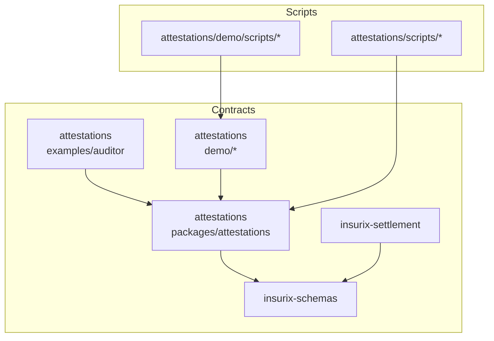
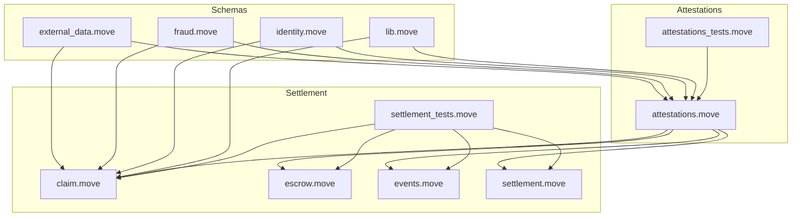
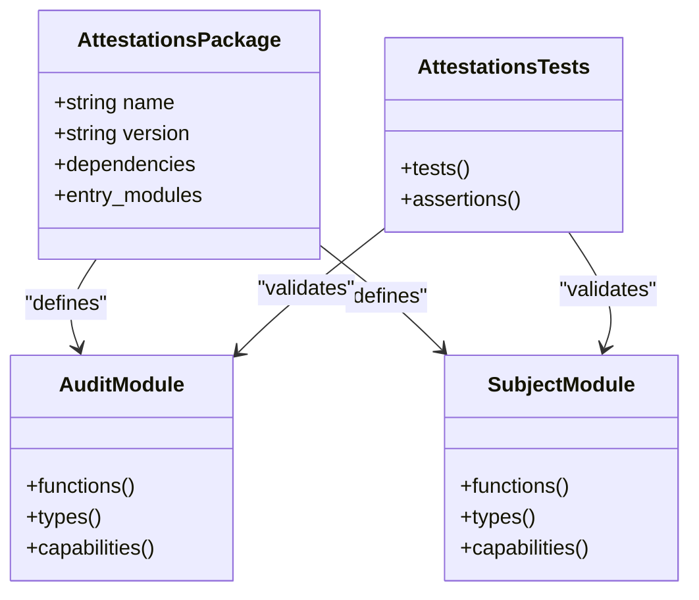
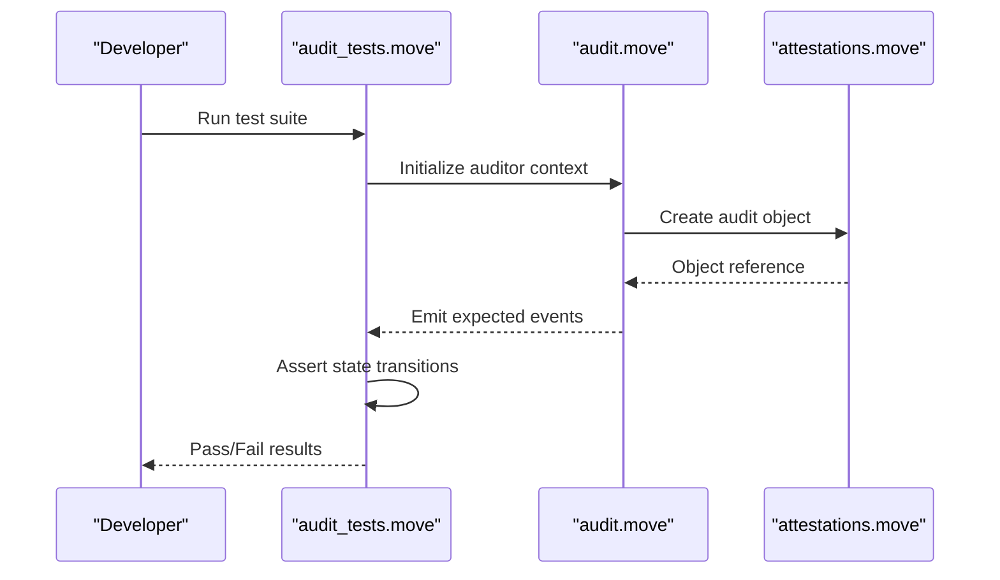
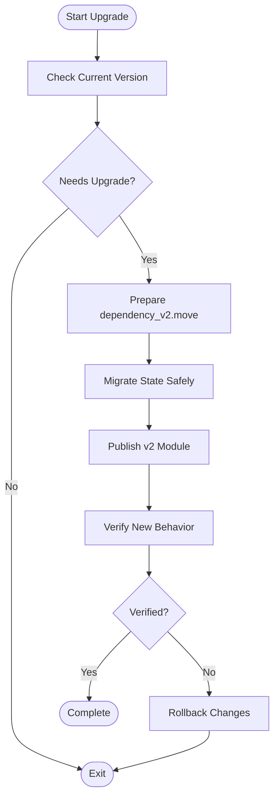
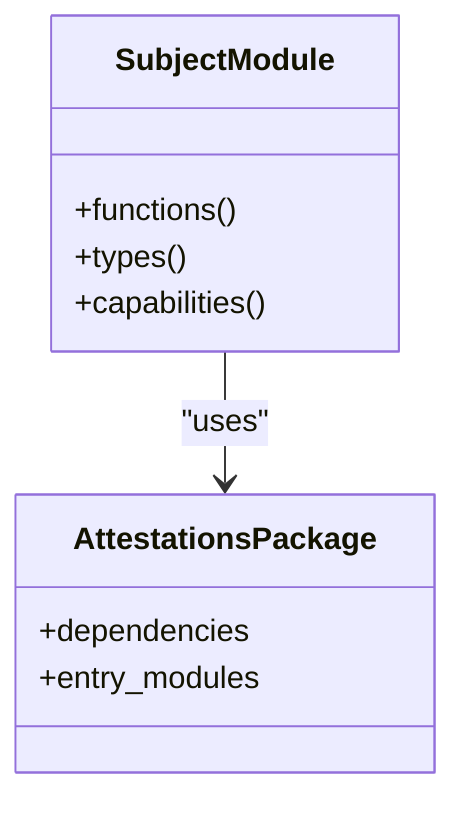
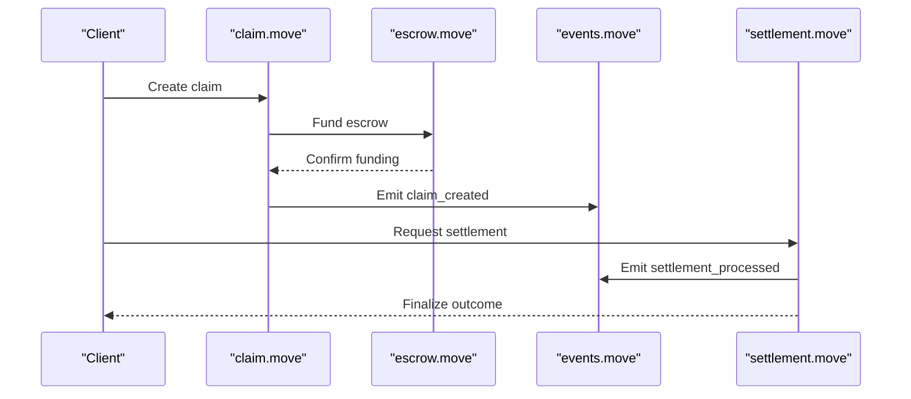
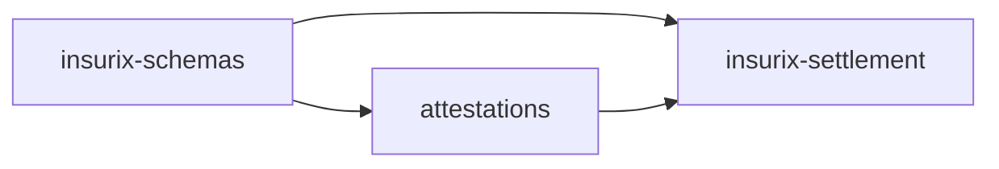

# Contract Development Guide

<cite>
**Referenced Files in This Document**
- [Move.toml](file://contracts/attestations/packages/attestations/Move.toml)
- [Published.toml](file://contracts/attestations/packages/attestations/Published.toml)
- [attestations.move](file://contracts/attestations/packages/attestations/sources/attestations.move)
- [attestations_tests.move](file://contracts/attestations/packages/attestations/tests/attestations_tests.move)
- [audit.move](file://contracts/attestations/examples/auditor/sources/audit.move)
- [audit_tests.move](file://contracts/attestations/examples/auditor/tests/audit_tests.move)
- [dependency.move](file://contracts/attestations/demo/dependency_example/sources/dependency.move)
- [dependency_v2.move](file://contracts/attestations/demo/dependency_example/upgrade/dependency_v2.move)
- [subject.move](file://contracts/attestations/demo/subject_example/sources/subject.move)
- [external_data.move](file://contracts/insurix-schemas/sources/external_data.move)
- [fraud.move](file://contracts/insurix-schemas/sources/fraud.move)
- [identity.move](file://contracts/insurix-schemas/sources/identity.move)
- [lib.move](file://contracts/insurix-schemas/sources/lib.move)
- [external_data_tests.move](file://contracts/insurix-schemas/tests/external_data_tests.move)
- [fraud_tests.move](file://contracts/insurix-schemas/tests/fraud_tests.move)
- [identity_tests.move](file://contracts/insurix-schemas/tests/identity_tests.move)
- [claim.move](file://contracts/insurix-settlement/sources/claim.move)
- [escrow.move](file://contracts/insurix-settlement/sources/escrow.move)
- [events.move](file://contracts/insurix-settlement/sources/events.move)
- [settlement.move](file://contracts/insurix-settlement/sources/settlement.move)
- [settlement_tests.move](file://contracts/insurix-settlement/tests/settlement_tests.move)
- [demo-up.sh](file://contracts/attestations/demo/scripts/demo-up.sh)
- [demo-down.sh](file://contracts/attestations/demo/scripts/demo-down.sh)
- [demo.sh](file://contracts/attestations/demo/scripts/demo.sh)
- [run-demo.sh](file://contracts/attestations/demo/scripts/run-demo.sh)
- [test-publish.sh](file://contracts/attestations/demo/scripts/test-publish.sh)
- [localnets.py](file://contracts/attestations/demo/scripts/localnets.py)
- [attest-audit.sh](file://contracts/attestations/scripts/attest-audit.sh)
- [check.sh](file://contracts/attestations/scripts/check.sh)
- [create-box.sh](file://contracts/attestations/scripts/create-box.sh)
- [revoke-audit.sh](file://contracts/attestations/scripts/revoke-audit.sh)
- [README.md](file://contracts/attestations/README.md)
- [CONVENTIONS.md](file://contracts/attestations/CONVENTIONS.md)
- [DESIGN.md](file://contracts/attestations/DESIGN.md)
- [FUTURE-EXTENSIONS.md](file://contracts/attestations/FUTURE-EXTENSIONS.md)
- [SIP-56-COMPARISON.md](file://contracts/attestations/SIP-56-COMPARISON.md)
- [AGENTS.md](file://contracts/attestations/AGENTS.md)
- [CLAUDE.md](file://contracts/attestations/CLAUDE.md)
</cite>

## Table of Contents
1. [Introduction](#introduction)
2. [Project Structure](#project-structure)
3. [Core Components](#core-components)
4. [Architecture Overview](#architecture-overview)
5. [Detailed Component Analysis](#detailed-component-analysis)
6. [Dependency Analysis](#dependency-analysis)
7. [Performance Considerations](#performance-considerations)
8. [Troubleshooting Guide](#troubleshooting-guide)
9. [Conclusion](#conclusion)
10. [Appendices](#appendices)

## Introduction
This guide explains how to develop, test, and deploy Insurix Move smart contracts on the Sui blockchain. It covers project structure, Move.toml configuration, environment setup, build and test workflows, upgrade patterns, versioning strategies, gas optimization, security auditing, code organization, common Move patterns, error handling, integration testing, and script utilities for contract management. The goal is to enable both new and experienced developers to work effectively with the Insurix Move packages: attestations, insurix-schemas, and insurix-settlement.

## Project Structure
The Insurix repository organizes Move code into multiple packages under contracts/:
- contracts/attestations: Core attestation logic, examples, demos, and scripts
  - packages/attestations: Primary attestation package (sources, tests, Move.toml, Published.toml)
  - examples/auditor: Example auditor module with tests
  - demo/*: Demo modules (auditors A/B/C, dependency example, subject example) and orchestration scripts
  - scripts: Utility scripts for attestation lifecycle operations
- contracts/insurix-schemas: Shared data schemas used across Insurix contracts
- contracts/insurix-settlement: Settlement and escrow logic for claims



**Diagram sources**
- [Move.toml](file://contracts/attestations/packages/attestations/Move.toml)
- [attestations.move](file://contracts/attestations/packages/attestations/sources/attestations.move)
- [attestations_tests.move](file://contracts/attestations/packages/attestations/tests/attestations_tests.move)
- [audit.move](file://contracts/attestations/examples/auditor/sources/audit.move)
- [audit_tests.move](file://contracts/attestations/examples/auditor/tests/audit_tests.move)
- [dependency.move](file://contracts/attestations/demo/dependency_example/sources/dependency.move)
- [dependency_v2.move](file://contracts/attestations/demo/dependency_example/upgrade/dependency_v2.move)
- [subject.move](file://contracts/attestations/demo/subject_example/sources/subject.move)
- [external_data.move](file://contracts/insurix-schemas/sources/external_data.move)
- [fraud.move](file://contracts/insurix-schemas/sources/fraud.move)
- [identity.move](file://contracts/insurix-schemas/sources/identity.move)
- [lib.move](file://contracts/insurix-schemas/sources/lib.move)
- [external_data_tests.move](file://contracts/insurix-schemas/tests/external_data_tests.move)
- [fraud_tests.move](file://contracts/insurix-schemas/tests/fraud_tests.move)
- [identity_tests.move](file://contracts/insurix-schemas/tests/identity_tests.move)
- [claim.move](file://contracts/insurix-settlement/sources/claim.move)
- [escrow.move](file://contracts/insurix-settlement/sources/escrow.move)
- [events.move](file://contracts/insurix-settlement/sources/events.move)
- [settlement.move](file://contracts/insurix-settlement/sources/settlement.move)
- [settlement_tests.move](file://contracts/insurix-settlement/tests/settlement_tests.move)
- [attest-audit.sh](file://contracts/attestations/scripts/attest-audit.sh)
- [check.sh](file://contracts/attestations/scripts/check.sh)
- [create-box.sh](file://contracts/attestations/scripts/create-box.sh)
- [revoke-audit.sh](file://contracts/attestations/scripts/revoke-audit.sh)
- [demo-up.sh](file://contracts/attestations/demo/scripts/demo-up.sh)
- [demo-down.sh](file://contracts/attestations/demo/scripts/demo-down.sh)
- [demo.sh](file://contracts/attestations/demo/scripts/demo.sh)
- [run-demo.sh](file://contracts/attestations/demo/scripts/run-demo.sh)
- [test-publish.sh](file://contracts/attestations/demo/scripts/test-publish.sh)
- [localnets.py](file://contracts/attestations/demo/scripts/localnets.py)

**Section sources**
- [README.md](file://contracts/attestations/README.md)
- [CONVENTIONS.md](file://contracts/attestations/CONVENTIONS.md)
- [DESIGN.md](file://contracts/attestations/DESIGN.md)
- [FUTURE-EXTENSIONS.md](file://contracts/attestations/FUTURE-EXTENSIONS.md)
- [SIP-56-COMPARISON.md](file://contracts/attestations/SIP-56-COMPARISON.md)
- [AGENTS.md](file://contracts/attestations/AGENTS.md)
- [CLAUDE.md](file://contracts/attestations/CLAUDE.md)

## Core Components
Insurix consists of three primary Move packages:
- Attestations Package: Implements core attestation issuance, verification, and lifecycle management. Includes published metadata and tests.
- Insurix Schemas: Defines shared types and libraries for external data, fraud detection, identity, and common utilities.
- Insurix Settlement: Manages claim lifecycle, escrow mechanics, and settlement events.

Key responsibilities:
- Attestations: Define core objects, capabilities, and functions for audit and subject domains; provide tests and publishing artifacts.
- Schemas: Provide reusable data structures and validation helpers consumed by other packages.
- Settlement: Coordinate claim creation, escrow funding, and settlement outcomes using events for transparency.

**Section sources**
- [Move.toml](file://contracts/attestations/packages/attestations/Move.toml)
- [Published.toml](file://contracts/attestations/packages/attestations/Published.toml)
- [attestations.move](file://contracts/attestations/packages/attestations/sources/attestations.move)
- [attestations_tests.move](file://contracts/attestations/packages/attestations/tests/attestations_tests.move)
- [external_data.move](file://contracts/insurix-schemas/sources/external_data.move)
- [fraud.move](file://contracts/insurix-schemas/sources/fraud.move)
- [identity.move](file://contracts/insurix-schemas/sources/identity.move)
- [lib.move](file://contracts/insurix-schemas/sources/lib.move)
- [claim.move](file://contracts/insurix-settlement/sources/claim.move)
- [escrow.move](file://contracts/insurix-settlement/sources/escrow.move)
- [events.move](file://contracts/insurix-settlement/sources/events.move)
- [settlement.move](file://contracts/insurix-settlement/sources/settlement.move)

## Architecture Overview
The Insurix architecture separates concerns across packages:
- Schemas define canonical data models and utilities.
- Attestations builds on schemas to implement domain-specific logic for audits and subjects.
- Settlement composes attestations and schemas to manage claims and escrows, emitting events for observability.



**Diagram sources**
- [external_data.move](file://contracts/insurix-schemas/sources/external_data.move)
- [fraud.move](file://contracts/insurix-schemas/sources/fraud.move)
- [identity.move](file://contracts/insurix-schemas/sources/identity.move)
- [lib.move](file://contracts/insurix-schemas/sources/lib.move)
- [attestations.move](file://contracts/attestations/packages/attestations/sources/attestations.move)
- [attestations_tests.move](file://contracts/attestations/packages/attestations/tests/attestations_tests.move)
- [claim.move](file://contracts/insurix-settlement/sources/claim.move)
- [escrow.move](file://contracts/insurix-settlement/sources/escrow.move)
- [events.move](file://contracts/insurix-settlement/sources/events.move)
- [settlement.move](file://contracts/insurix-settlement/sources/settlement.move)
- [settlement_tests.move](file://contracts/insurix-settlement/tests/settlement_tests.move)

## Detailed Component Analysis

### Attestations Package
The attestations package provides core functionality for issuing and managing audits and subjects. It includes a Move.toml defining package metadata, dependencies, and versioning, along with a Published.toml artifact for deployment records. Tests validate behavior and edge cases.

Key aspects:
- Package configuration via Move.toml specifies name, version, dependencies, and entry points.
- Published.toml captures on-chain publication details for traceability.
- Source files implement modules and types for auditors and subjects.
- Test suite ensures correctness and regression safety.



**Diagram sources**
- [Move.toml](file://contracts/attestations/packages/attestations/Move.toml)
- [Published.toml](file://contracts/attestations/packages/attestations/Published.toml)
- [attestations.move](file://contracts/attestations/packages/attestations/sources/attestations.move)
- [attestations_tests.move](file://contracts/attestations/packages/attestations/tests/attestations_tests.move)

**Section sources**
- [Move.toml](file://contracts/attestations/packages/attestations/Move.toml)
- [Published.toml](file://contracts/attestations/packages/attestations/Published.toml)
- [attestations.move](file://contracts/attestations/packages/attestations/sources/attestations.move)
- [attestations_tests.move](file://contracts/attestations/packages/attestations/tests/attestations_tests.move)

### Auditor Example Module
The auditor example demonstrates how an auditor module interacts with attestations. It includes source code and tests that exercise typical workflows such as issuing audits and verifying results.



**Diagram sources**
- [audit.move](file://contracts/attestations/examples/auditor/sources/audit.move)
- [audit_tests.move](file://contracts/attestations/examples/auditor/tests/audit_tests.move)
- [attestations.move](file://contracts/attestations/packages/attestations/sources/attestations.move)

**Section sources**
- [audit.move](file://contracts/attestations/examples/auditor/sources/audit.move)
- [audit_tests.move](file://contracts/attestations/examples/auditor/tests/audit_tests.move)

### Dependency Example and Upgrade Pattern
The dependency example shows how one module depends on another and how upgrades are managed. The v2 upgrade module illustrates safe migration practices.



**Diagram sources**
- [dependency.move](file://contracts/attestations/demo/dependency_example/sources/dependency.move)
- [dependency_v2.move](file://contracts/attestations/demo/dependency_example/upgrade/dependency_v2.move)

**Section sources**
- [dependency.move](file://contracts/attestations/demo/dependency_example/sources/dependency.move)
- [dependency_v2.move](file://contracts/attestations/demo/dependency_example/upgrade/dependency_v2.move)

### Subject Example Module
The subject example defines how subjects interact with auditors and attestations, demonstrating ownership and verification flows.



**Diagram sources**
- [subject.move](file://contracts/attestations/demo/subject_example/sources/subject.move)
- [attestations.move](file://contracts/attestations/packages/attestations/sources/attestations.move)

**Section sources**
- [subject.move](file://contracts/attestations/demo/subject_example/sources/subject.move)

### Insurix Schemas
Shared schemas define canonical types for external data, fraud signals, identity attributes, and utility functions. These are consumed by attestations and settlement packages.

```mermaid
erDiagram
EXTERNAL_DATA {
string id PK
string source
timestamp created_at
json payload
}
FRAUD_SIGNAL {
string id PK
string type
float confidence
timestamp detected_at
}
IDENTITY {
string id PK
string owner
string verified_field
timestamp updated_at
}
LIB_UTILITIES {
function hash(data)
function verify_signature(sig, data)
}
EXTERNAL_DATA ||--o{ FRAUD_SIGNAL : "generates"
IDENTITY ||--o{ EXTERNAL_DATA : "produces"
```

**Diagram sources**
- [external_data.move](file://contracts/insurix-schemas/sources/external_data.move)
- [fraud.move](file://contracts/insurix-schemas/sources/fraud.move)
- [identity.move](file://contracts/insurix-schemas/sources/identity.move)
- [lib.move](file://contracts/insurix-schemas/sources/lib.move)

**Section sources**
- [external_data.move](file://contracts/insurix-schemas/sources/external_data.move)
- [fraud.move](file://contracts/insurix-schemas/sources/fraud.move)
- [identity.move](file://contracts/insurix-schemas/sources/identity.move)
- [lib.move](file://contracts/insurix-schemas/sources/lib.move)

### Insurix Settlement
Settlement coordinates claim lifecycle, escrow funding, and settlement outcomes. Events provide transparency and enable off-chain monitoring.



**Diagram sources**
- [claim.move](file://contracts/insurix-settlement/sources/claim.move)
- [escrow.move](file://contracts/insurix-settlement/sources/escrow.move)
- [events.move](file://contracts/insurix-settlement/sources/events.move)
- [settlement.move](file://contracts/insurix-settlement/sources/settlement.move)

**Section sources**
- [claim.move](file://contracts/insurix-settlement/sources/claim.move)
- [escrow.move](file://contracts/insurix-settlement/sources/escrow.move)
- [events.move](file://contracts/insurix-settlement/sources/events.move)
- [settlement.move](file://contracts/insurix-settlement/sources/settlement.move)

## Dependency Analysis
Insurix enforces clear separation between schemas, attestations, and settlement. Schemas are foundational and reused across packages. Attestations depends on schemas and exposes domain logic. Settlement composes attestations and schemas to implement business processes.



**Diagram sources**
- [external_data.move](file://contracts/insurix-schemas/sources/external_data.move)
- [fraud.move](file://contracts/insurix-schemas/sources/fraud.move)
- [identity.move](file://contracts/insurix-schemas/sources/identity.move)
- [lib.move](file://contracts/insurix-schemas/sources/lib.move)
- [attestations.move](file://contracts/attestations/packages/attestations/sources/attestations.move)
- [claim.move](file://contracts/insurix-settlement/sources/claim.move)
- [escrow.move](file://contracts/insurix-settlement/sources/escrow.move)
- [events.move](file://contracts/insurix-settlement/sources/events.move)
- [settlement.move](file://contracts/insurix-settlement/sources/settlement.move)

**Section sources**
- [attestations.move](file://contracts/attestations/packages/attestations/sources/attestations.move)
- [claim.move](file://contracts/insurix-settlement/sources/claim.move)
- [escrow.move](file://contracts/insurix-settlement/sources/escrow.move)
- [events.move](file://contracts/insurix-settlement/sources/events.move)
- [settlement.move](file://contracts/insurix-settlement/sources/settlement.move)

## Performance Considerations
- Gas Optimization:
  - Minimize storage footprint by using compact structs and avoiding unnecessary fields.
  - Batch operations where possible to reduce transaction overhead.
  - Prefer immutable data patterns to avoid costly rewrites.
- Security Auditing:
  - Validate all inputs rigorously and enforce access control via capabilities.
  - Use explicit checks for ownership and permissions before state mutations.
  - Implement robust error handling with descriptive errors for easier debugging.
- Code Organization:
  - Keep modules focused and cohesive; split large modules into smaller, testable units.
  - Centralize shared logic in lib.move within schemas to promote reuse.
  - Maintain clear separation between data definitions, business logic, and event emissions.

[No sources needed since this section provides general guidance]

## Troubleshooting Guide
Common issues and resolutions:
- Build Failures:
  - Ensure Move.toml dependencies are correctly specified and versions match.
  - Verify that all required modules are present and imports are correct.
- Test Failures:
  - Review assertions in test suites for expected state changes and events.
  - Check environment setup and localnet availability when running integration tests.
- Deployment Issues:
  - Confirm network connectivity and account permissions.
  - Validate Published.toml artifacts and ensure consistent versioning.

Useful scripts:
- Localnet and demo orchestration:
  - demo-up.sh, demo-down.sh, demo.sh, run-demo.sh, test-publish.sh, localnets.py
- Attestation lifecycle:
  - attest-audit.sh, check.sh, create-box.sh, revoke-audit.sh

**Section sources**
- [demo-up.sh](file://contracts/attestations/demo/scripts/demo-up.sh)
- [demo-down.sh](file://contracts/attestations/demo/scripts/demo-down.sh)
- [demo.sh](file://contracts/attestations/demo/scripts/demo.sh)
- [run-demo.sh](file://contracts/attestations/demo/scripts/run-demo.sh)
- [test-publish.sh](file://contracts/attestations/demo/scripts/test-publish.sh)
- [localnets.py](file://contracts/attestations/demo/scripts/localnets.py)
- [attest-audit.sh](file://contracts/attestations/scripts/attest-audit.sh)
- [check.sh](file://contracts/attestations/scripts/check.sh)
- [create-box.sh](file://contracts/attestations/scripts/create-box.sh)
- [revoke-audit.sh](file://contracts/attestations/scripts/revoke-audit.sh)

## Conclusion
Insurix provides a well-structured Move-based system for insurance-related workflows on Sui. By separating schemas, attestations, and settlement logic, it enables modular development, clear upgrade paths, and robust testing. Following the best practices outlined here will help you build secure, efficient, and maintainable smart contracts aligned with Insurix’s design goals.

[No sources needed since this section summarizes without analyzing specific files]

## Appendices

### Environment Setup and Build Processes
- Install Sui toolchain and configure localnet for development.
- Navigate to each package directory and use standard Move commands to build and test.
- Use Move.toml to manage dependencies and versions per package.

**Section sources**
- [Move.toml](file://contracts/attestations/packages/attestations/Move.toml)

### Testing Frameworks and Simulation Tools
- Unit tests reside in tests directories alongside source modules.
- Integration tests leverage localnet scripts to simulate real-world scenarios.
- Use assertion patterns and event checks to validate behavior comprehensively.

**Section sources**
- [attestations_tests.move](file://contracts/attestations/packages/attestations/tests/attestations_tests.move)
- [audit_tests.move](file://contracts/attestations/examples/auditor/tests/audit_tests.move)
- [external_data_tests.move](file://contracts/insurix-schemas/tests/external_data_tests.move)
- [fraud_tests.move](file://contracts/insurix-schemas/tests/fraud_tests.move)
- [identity_tests.move](file://contracts/insurix-schemas/tests/identity_tests.move)
- [settlement_tests.move](file://contracts/insurix-settlement/tests/settlement_tests.move)

### Deployment Procedures and Upgrade Patterns
- Publish packages using Move publish commands with appropriate network flags.
- Manage upgrades by introducing new modules (e.g., v2) and migrating state safely.
- Track deployments via Published.toml artifacts for auditability.

**Section sources**
- [Published.toml](file://contracts/attestations/packages/attestations/Published.toml)
- [dependency_v2.move](file://contracts/attestations/demo/dependency_example/upgrade/dependency_v2.move)

### Script Utilities for Contract Management
- Orchestrate localnet lifecycle and demo environments with shell scripts.
- Automate attestation operations like creating, checking, and revoking audits.
- Integrate with Python utilities for advanced localnet management.

**Section sources**
- [demo-up.sh](file://contracts/attestations/demo/scripts/demo-up.sh)
- [demo-down.sh](file://contracts/attestations/demo/scripts/demo-down.sh)
- [demo.sh](file://contracts/attestations/demo/scripts/demo.sh)
- [run-demo.sh](file://contracts/attestations/demo/scripts/run-demo.sh)
- [test-publish.sh](file://contracts/attestations/demo/scripts/test-publish.sh)
- [localnets.py](file://contracts/attestations/demo/scripts/localnets.py)
- [attest-audit.sh](file://contracts/attestations/scripts/attest-audit.sh)
- [check.sh](file://contracts/attestations/scripts/check.sh)
- [create-box.sh](file://contracts/attestations/scripts/create-box.sh)
- [revoke-audit.sh](file://contracts/attestations/scripts/revoke-audit.sh)