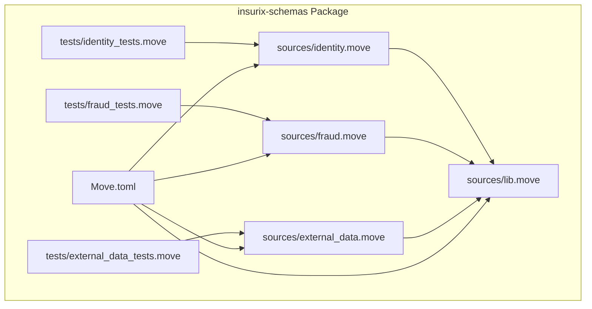
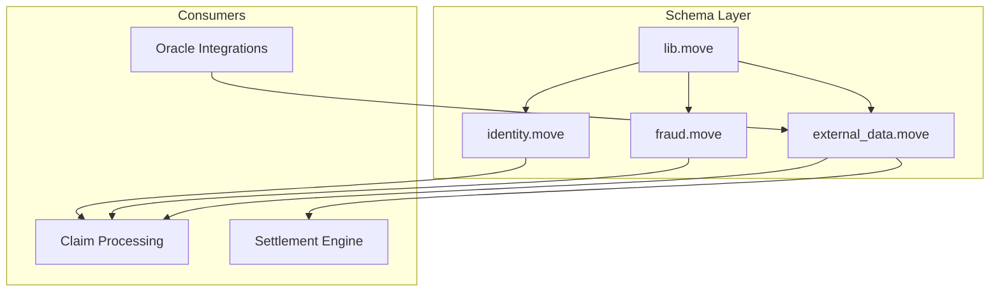
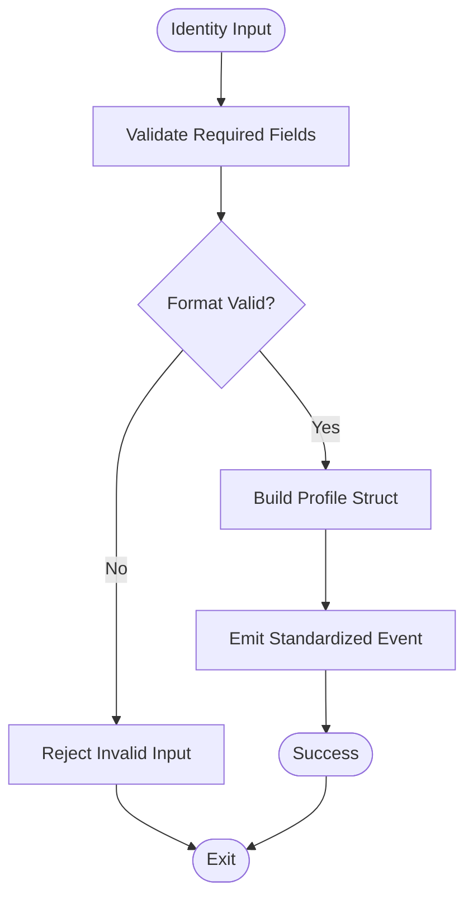
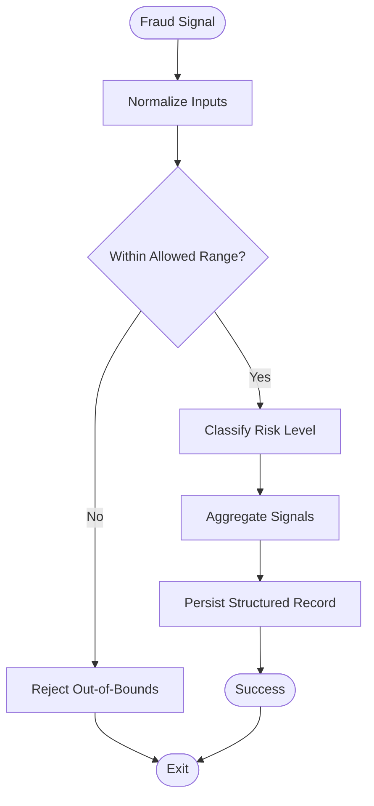
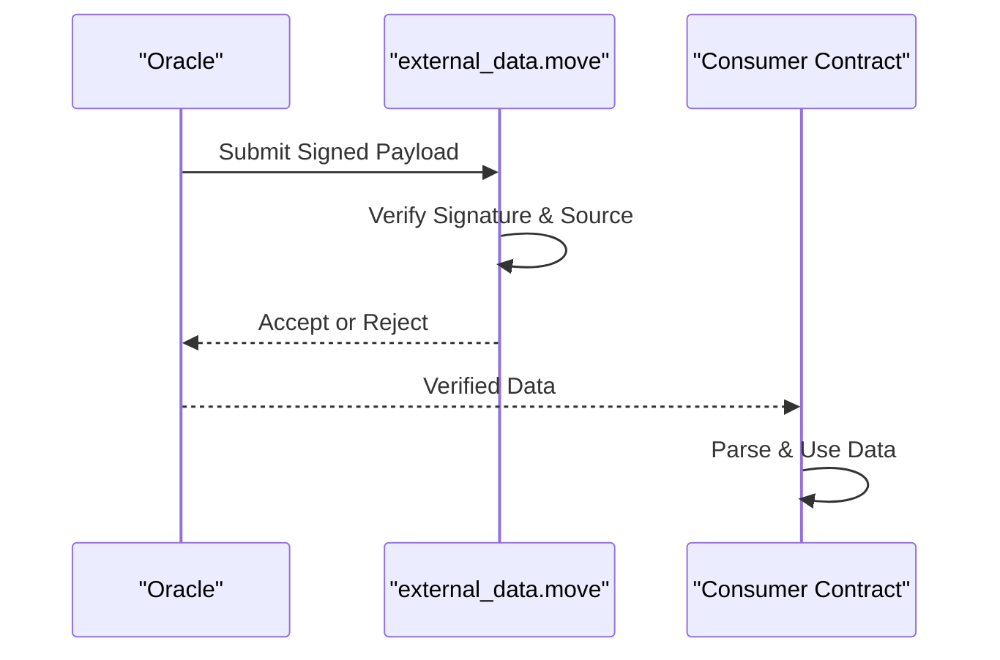
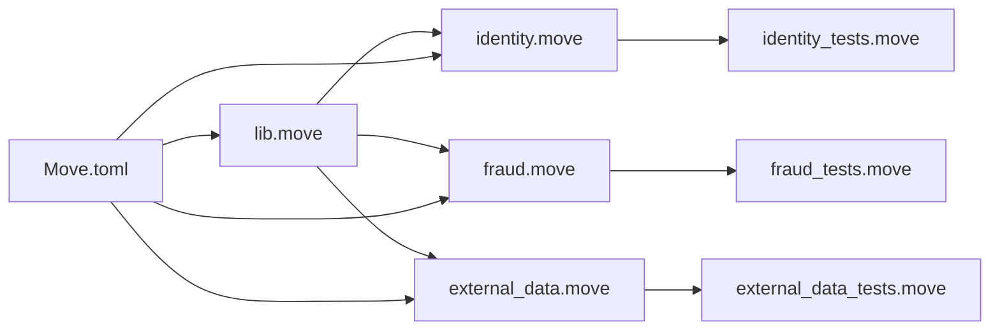

# Schema Definitions

<cite>
**Referenced Files in This Document**
- [Move.toml](file://contracts/insurix-schemas/Move.toml)
- [identity.move](file://contracts/insurix-schemas/sources/identity.move)
- [fraud.move](file://contracts/insurix-schemas/sources/fraud.move)
- [external_data.move](file://contracts/insurix-schemas/sources/external_data.move)
- [lib.move](file://contracts/insurix-schemas/sources/lib.move)
- [identity_tests.move](file://contracts/insurix-schemas/tests/identity_tests.move)
- [fraud_tests.move](file://contracts/insurix-schemas/tests/fraud_tests.move)
- [external_data_tests.move](file://contracts/insurix-schemas/tests/external_data_tests.move)
</cite>

## Table of Contents
1. [Introduction](#introduction)
2. [Project Structure](#project-structure)
3. [Core Components](#core-components)
4. [Architecture Overview](#architecture-overview)
5. [Detailed Component Analysis](#detailed-component-analysis)
6. [Dependency Analysis](#dependency-analysis)
7. [Performance Considerations](#performance-considerations)
8. [Troubleshooting Guide](#troubleshooting-guide)
9. [Conclusion](#conclusion)
10. [Appendices](#appendices)

## Introduction
This document describes the Insurix schema definitions implemented as Move smart contracts within the insurix-schemas package. It focuses on:
- Identity schema for user profiles and KYC compliance
- Fraud detection schemas for risk assessment and pattern recognition
- External data schemas for oracle integrations
- Shared library utilities used across schemas

The documentation explains data structures, validation rules, type definitions, serialization formats, and how these schemas ensure consistency, support cross-contract communication, and maintain backward compatibility. It also provides examples of usage patterns, integration points with AI agents and external data sources, testing strategies, and migration procedures for schema evolution.

## Project Structure
The insurix-schemas package organizes schema definitions and tests under a standard Move project layout:
- sources: core schema modules (identity, fraud, external_data, lib)
- tests: module-level tests validating behavior and constraints
- Move.toml: package configuration and dependencies

**Diagram sources**
- [Move.toml](file://contracts/insurix-schemas/Move.toml)
- [identity.move](file://contracts/insurix-schemas/sources/identity.move)
- [fraud.move](file://contracts/insurix-schemas/sources/fraud.move)
- [external_data.move](file://contracts/insurix-schemas/sources/external_data.move)
- [lib.move](file://contracts/insurix-schemas/sources/lib.move)
- [identity_tests.move](file://contracts/insurix-schemas/tests/identity_tests.move)
- [fraud_tests.move](file://contracts/insurix-schemas/tests/fraud_tests.move)
- [external_data_tests.move](file://contracts/insurix-schemas/tests/external_data_tests.move)

**Section sources**
- [Move.toml](file://contracts/insurix-schemas/Move.toml)

## Core Components
The schema package defines four primary modules:
- identity.move: User profile and KYC-related types and validators
- fraud.move: Risk scoring, pattern flags, and fraud event structures
- external_data.move: Oracle input schemas and verification helpers
- lib.move: Shared utilities, constants, and common validation routines

These modules collectively enforce strict typing, validate inputs, and provide stable interfaces for other Insurix contracts to consume consistent data shapes.

**Section sources**
- [identity.move](file://contracts/insurix-schemas/sources/identity.move)
- [fraud.move](file://contracts/insurix-schemas/sources/fraud.move)
- [external_data.move](file://contracts/insurix-schemas/sources/external_data.move)
- [lib.move](file://contracts/insurix-schemas/sources/lib.move)

## Architecture Overview
At a high level, the schema layer acts as a contract-agnostic data contract:
- Upstream components (e.g., claim processing, settlement) depend on schema-defined types
- Oracles feed external_data into the system following the external_data schema
- Identity and fraud modules provide validated structures consumed by business logic
- lib.move centralizes shared logic to reduce duplication and ensure consistency

[No sources needed since this diagram shows conceptual workflow, not actual code structure]

## Detailed Component Analysis

### Identity Schema (User Profiles and KYC)
Purpose:
- Define canonical user profile fields and KYC attributes
- Provide validation functions to ensure required fields are present and well-formed
- Support versioning and optional fields for backward compatibility

Key aspects:
- Type definitions for profile fields and KYC status
- Validation routines for format checks and completeness
- Serialization-friendly structures suitable for storage and events

Usage patterns:
- Create or update user profiles through validated constructors
- Enforce KYC requirements before allowing sensitive operations
- Emit standardized events for auditability

Testing strategy:
- Unit tests verify valid and invalid inputs
- Edge cases include missing fields, malformed identifiers, and unsupported statuses

**Section sources**
- [identity.move](file://contracts/insurix-schemas/sources/identity.move)
- [identity_tests.move](file://contracts/insurix-schemas/tests/identity_tests.move)

### Fraud Detection Schema (Risk Assessment and Pattern Recognition)
Purpose:
- Model risk scores, flags, and pattern indicators
- Provide deterministic validation for incoming signals
- Enable consistent aggregation and downstream decision-making

Key aspects:
- Types for risk metrics, thresholds, and classification labels
- Validators for score ranges and flag combinations
- Stable serialization for historical analysis and model training

Usage patterns:
- Ingest risk signals from internal engines or external models
- Apply validation and normalization before storing or acting upon
- Combine multiple signals using defined composition rules

Testing strategy:
- Tests cover boundary conditions for scores and flags
- Negative tests ensure invalid combinations are rejected

**Section sources**
- [fraud.move](file://contracts/insurix-schemas/sources/fraud.move)
- [fraud_tests.move](file://contracts/insurix-schemas/tests/fraud_tests.move)

### External Data Schema (Oracle Integrations)
Purpose:
- Define canonical formats for oracle-provided data
- Ensure integrity via signature verification and source tagging
- Facilitate cross-contract consumption with predictable layouts

Key aspects:
- Types for data payloads, timestamps, and provenance metadata
- Verification helpers for signatures and source authenticity
- Versioned fields to evolve schemas without breaking consumers

Usage patterns:
- Oracles publish signed payloads conforming to the schema
- Contracts verify signatures and parse payloads safely
- Consumers rely on stable field names and ordering

Testing strategy:
- Tests validate correct parsing and rejection of tampered data
- Coverage includes edge cases like expired timestamps and unknown sources

**Diagram sources**
- [external_data.move](file://contracts/insurix-schemas/sources/external_data.move)
- [external_data_tests.move](file://contracts/insurix-schemas/tests/external_data_tests.move)

**Section sources**
- [external_data.move](file://contracts/insurix-schemas/sources/external_data.move)
- [external_data_tests.move](file://contracts/insurix-schemas/tests/external_data_tests.move)

### Shared Library Utilities (lib.move)
Purpose:
- Centralize common validation routines, constants, and helper functions
- Reduce duplication across identity, fraud, and external_data modules
- Provide stable APIs for safe parsing and formatting

Key aspects:
- Reusable validators for strings, numbers, and enums
- Constants for limits, timeouts, and supported versions
- Utility functions for encoding/decoding and checksums

Usage patterns:
- Import lib.move into schema modules to reuse logic
- Extend utilities carefully to preserve backward compatibility

Testing strategy:
- Tests assert correctness of helpers and their error paths

**Section sources**
- [lib.move](file://contracts/insurix-schemas/sources/lib.move)

## Dependency Analysis
The schema modules share a common dependency on lib.move for utilities. The package configuration ties together modules and tests, ensuring consistent builds and test execution.

**Diagram sources**
- [Move.toml](file://contracts/insurix-schemas/Move.toml)
- [identity.move](file://contracts/insurix-schemas/sources/identity.move)
- [fraud.move](file://contracts/insurix-schemas/sources/fraud.move)
- [external_data.move](file://contracts/insurix-schemas/sources/external_data.move)
- [lib.move](file://contracts/insurix-schemas/sources/lib.move)
- [identity_tests.move](file://contracts/insurix-schemas/tests/identity_tests.move)
- [fraud_tests.move](file://contracts/insurix-schemas/tests/fraud_tests.move)
- [external_data_tests.move](file://contracts/insurix-schemas/tests/external_data_tests.move)

**Section sources**
- [Move.toml](file://contracts/insurix-schemas/Move.toml)

## Performance Considerations
- Keep payload sizes minimal to reduce gas costs; prefer compact types and avoid unnecessary nesting
- Use deterministic validation to minimize branching and early exits on invalid inputs
- Cache frequently accessed constants and avoid recomputation where possible
- Prefer immutable data structures to simplify reasoning and reduce copy overhead
- Batch validations when processing multiple records to amortize overhead

[No sources needed since this section provides general guidance]

## Troubleshooting Guide
Common issues and resolutions:
- Invalid input formats: Ensure all required fields are present and correctly typed; consult validation functions in each module
- Signature verification failures: Check oracle keys, timestamps, and payload integrity; confirm source tags match expected values
- Backward compatibility errors: When evolving schemas, add new fields as optional and maintain default behaviors for older consumers
- Test failures: Review unit tests for expected error paths and boundary conditions; replicate failing scenarios locally

**Section sources**
- [identity_tests.move](file://contracts/insurix-schemas/tests/identity_tests.move)
- [fraud_tests.move](file://contracts/insurix-schemas/tests/fraud_tests.move)
- [external_data_tests.move](file://contracts/insurix-schemas/tests/external_data_tests.move)

## Conclusion
The Insurix schema definitions provide a robust, versioned, and validated foundation for identity, fraud detection, and external data handling. By centralizing shared logic and enforcing strict typing, the schemas ensure consistency across the protocol, enable reliable cross-contract communication, and support smooth evolution over time. Comprehensive tests and clear usage patterns facilitate integration with AI agents and external data sources while maintaining security and performance.

[No sources needed since this section summarizes without analyzing specific files]

## Appendices

### Data Structures and Validation Rules Summary
- Identity: Canonical profile fields, KYC status, and validators for completeness and format
- Fraud: Risk scores, flags, and classification rules with range checks and combination constraints
- External Data: Oracle payloads with provenance metadata, signature verification, and timestamp checks
- Lib: Shared constants, parsers, and utility functions reused across modules

**Section sources**
- [identity.move](file://contracts/insurix-schemas/sources/identity.move)
- [fraud.move](file://contracts/insurix-schemas/sources/fraud.move)
- [external_data.move](file://contracts/insurix-schemas/sources/external_data.move)
- [lib.move](file://contracts/insurix-schemas/sources/lib.move)

### Integration with AI Agents and External Data Sources
- AI agents should produce outputs conforming to the fraud schema, including normalized scores and interpretable flags
- External data sources must sign payloads according to the external_data schema and include verifiable provenance
- Consumers should validate all inputs using schema functions before use in business logic

**Section sources**
- [fraud.move](file://contracts/insurix-schemas/sources/fraud.move)
- [external_data.move](file://contracts/insurix-schemas/sources/external_data.move)

### Testing Strategies for Schema Validation
- Unit tests per module covering valid inputs, invalid inputs, and edge cases
- Property-based tests for range constraints and combination rules
- Integration tests verifying end-to-end flows from oracle submission to consumer parsing

**Section sources**
- [identity_tests.move](file://contracts/insurix-schemas/tests/identity_tests.move)
- [fraud_tests.move](file://contracts/insurix-schemas/tests/fraud_tests.move)
- [external_data_tests.move](file://contracts/insurix-schemas/tests/external_data_tests.move)

### Migration Procedures for Schema Evolution
- Add new fields as optional with sensible defaults
- Maintain backward-compatible parsers that ignore unknown fields
- Deprecate old fields gradually with clear versioning and migration guides
- Update tests to cover both legacy and new schema versions during transition

**Section sources**
- [external_data.move](file://contracts/insurix-schemas/sources/external_data.move)
- [identity.move](file://contracts/insurix-schemas/sources/identity.move)
- [fraud.move](file://contracts/insurix-schemas/sources/fraud.move)