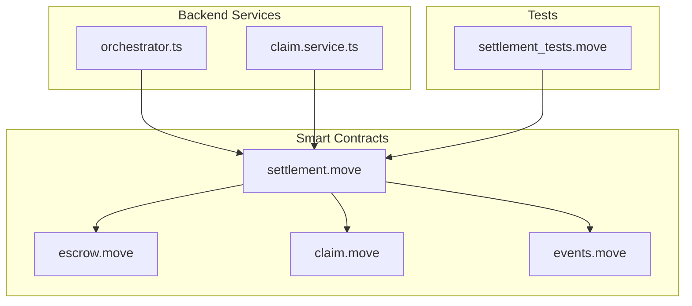
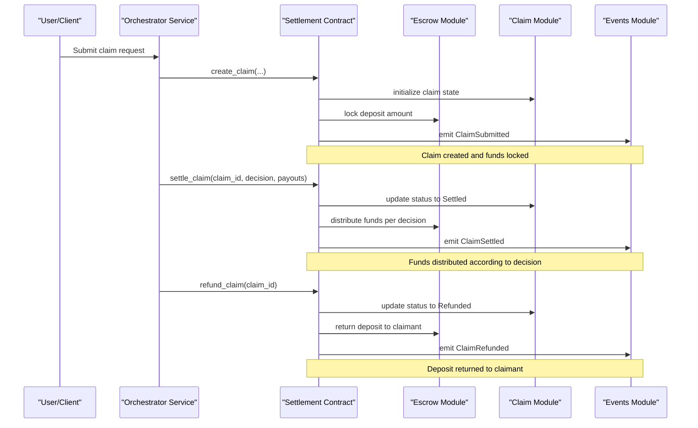
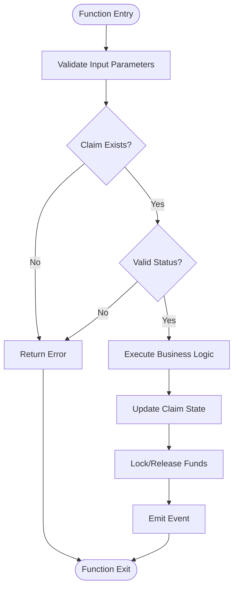
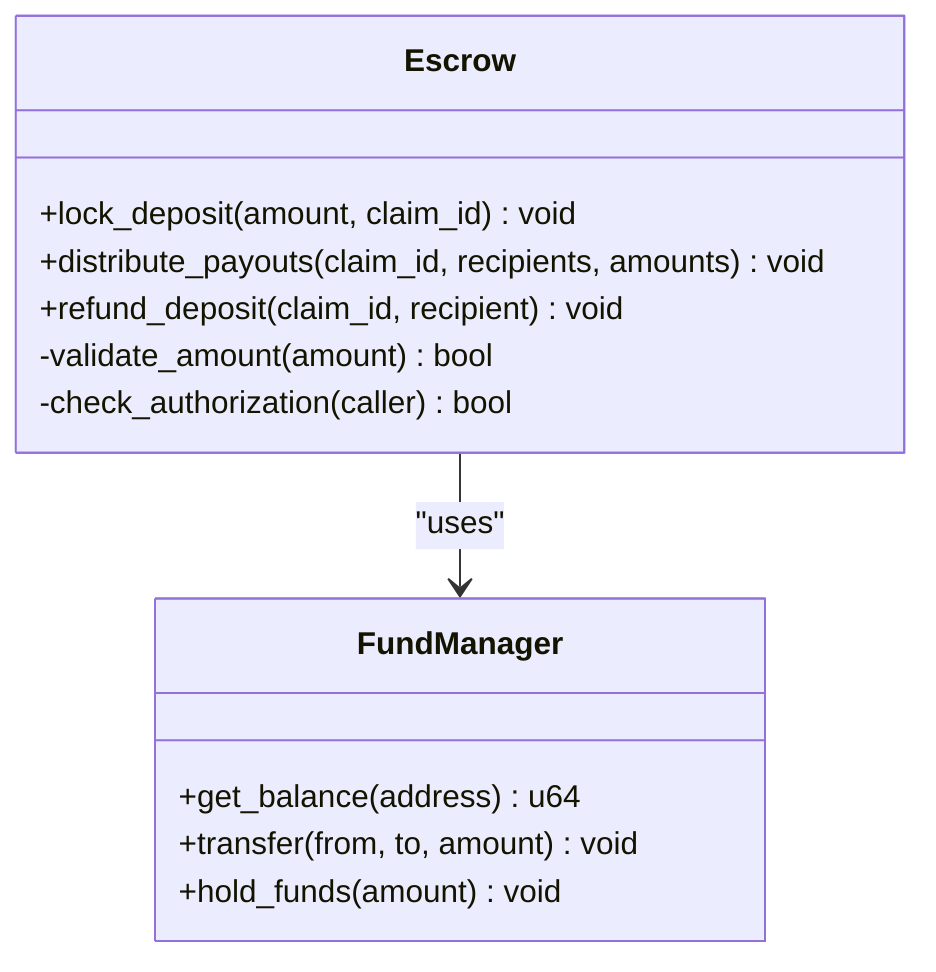
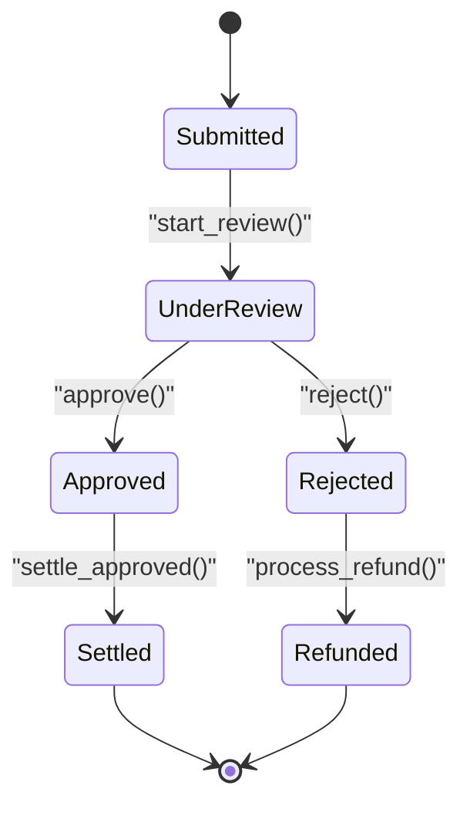
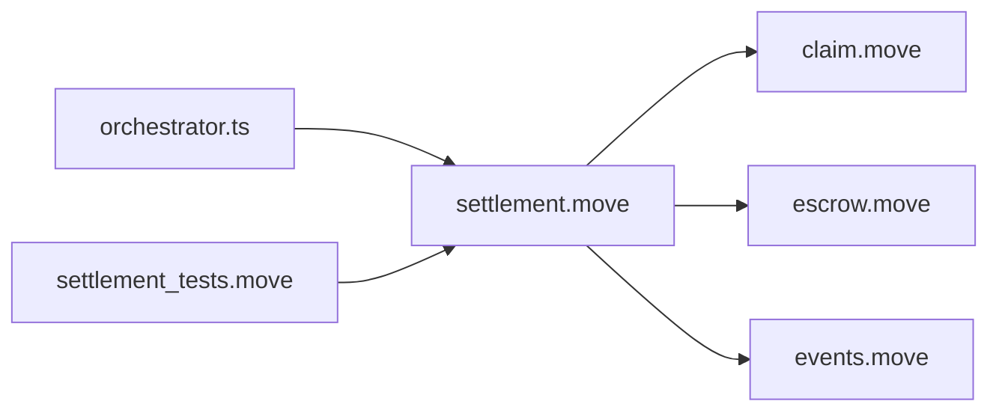

# Settlement Engine

<cite>
**Referenced Files in This Document**
- [settlement.move](file://contracts/insurix-settlement/sources/settlement.move)
- [escrow.move](file://contracts/insurix-settlement/sources/escrow.move)
- [claim.move](file://contracts/insurix-settlement/sources/claim.move)
- [events.move](file://contracts/insurix-settlement/sources/events.move)
- [settlement_tests.move](file://contracts/insurix-settlement/tests/settlement_tests.move)
- [Move.toml](file://contracts/insurix-settlement/Move.toml)
- [orchestrator.ts](file://backend/src/services/orchestrator.ts)
- [claim.service.ts](file://backend/src/services/claim.service.ts)
</cite>

## Table of Contents
1. [Introduction](#introduction)
2. [Project Structure](#project-structure)
3. [Core Components](#core-components)
4. [Architecture Overview](#architecture-overview)
5. [Detailed Component Analysis](#detailed-component-analysis)
6. [Dependency Analysis](#dependency-analysis)
7. [Performance Considerations](#performance-considerations)
8. [Troubleshooting Guide](#troubleshooting-guide)
9. [Conclusion](#conclusion)
10. [Appendices](#appendices)

## Introduction
This document provides comprehensive documentation for the Insurix settlement engine smart contracts on Sui. It explains the automated claim processing workflow, escrow management, and payout distribution mechanisms. The core components include:
- settlement.move: Main orchestration contract that coordinates claims, escrows, and payouts.
- escrow.move: Manages locked funds and release logic.
- claim.move: Tracks claim state and lifecycle transitions.
- events.move: Emits blockchain events for observability and off-chain indexing.

The document covers the complete claim lifecycle from submission to settlement, including status transitions, fund locking/unlocking, multi-party interactions, examples of claim creation, settlement execution, refund processes, testing approaches, gas optimization techniques, and integration patterns with the backend orchestration layer.

## Project Structure
The settlement engine resides under contracts/insurix-settlement with Move sources and tests. The backend orchestrates off-chain workflows and interacts with the contracts via Sui client calls.

**Diagram sources**
- [settlement.move](file://contracts/insurix-settlement/sources/settlement.move)
- [escrow.move](file://contracts/insurix-settlement/sources/escrow.move)
- [claim.move](file://contracts/insurix-settlement/sources/claim.move)
- [events.move](file://contracts/insurix-settlement/sources/events.move)
- [orchestrator.ts](file://backend/src/services/orchestrator.ts)
- [claim.service.ts](file://backend/src/services/claim.service.ts)
- [settlement_tests.move](file://contracts/insurix-settlement/tests/settlement_tests.move)

**Section sources**
- [Move.toml](file://contracts/insurix-settlement/Move.toml)

## Core Components
- settlement.move: Entry point for claim creation, settlement execution, and refund operations. Coordinates interactions between claim state, escrow funds, and event emission.
- escrow.move: Implements fund locking, partial or full releases, and safe transfer primitives. Ensures deterministic fund distribution based on claim outcomes.
- claim.move: Maintains claim lifecycle states (e.g., submitted, under review, approved, settled, refunded), tracks parties, amounts, timestamps, and approvals.
- events.move: Defines structured events for claim lifecycle changes, fund locks/releases, and settlement outcomes. Enables off-chain indexing and monitoring.

Key responsibilities:
- Enforce business rules for claim approval and settlement.
- Ensure atomicity of fund movements and state updates.
- Emit auditable events for each critical action.
- Provide clear interfaces for backend orchestration.

**Section sources**
- [settlement.move](file://contracts/insurix-settlement/sources/settlement.move)
- [escrow.move](file://contracts/insurix-settlement/sources/escrow.move)
- [claim.move](file://contracts/insurix-settlement/sources/claim.move)
- [events.move](file://contracts/insurix-settlement/sources/events.move)

## Architecture Overview
The settlement engine follows a modular architecture where the main contract orchestrates claim state and escrow management while emitting events for observability. Backend services trigger contract functions based on off-chain decisions (fraud checks, identity verification, external data).

**Diagram sources**
- [settlement.move](file://contracts/insurix-settlement/sources/settlement.move)
- [escrow.move](file://contracts/insurix-settlement/sources/escrow.move)
- [claim.move](file://contracts/insurix-settlement/sources/claim.move)
- [events.move](file://contracts/insurix-settlement/sources/events.move)
- [orchestrator.ts](file://backend/src/services/orchestrator.ts)

## Detailed Component Analysis

### Settlement Contract (settlement.move)
The main contract exposes functions for claim lifecycle management:
- create_claim: Initializes claim state, validates inputs, locks funds via escrow, and emits events.
- settle_claim: Executes settlement based on decision parameters, distributes funds, updates claim status, and emits settlement events.
- refund_claim: Cancels a claim and returns deposited funds to the claimant.

Key design patterns:
- State validation before fund operations.
- Atomic updates to claim state and escrow balances.
- Event-driven architecture for off-chain synchronization.

**Diagram sources**
- [settlement.move](file://contracts/insurix-settlement/sources/settlement.move)

**Section sources**
- [settlement.move](file://contracts/insurix-settlement/sources/settlement.move)

### Escrow Contract (escrow.move)
Manages fund locking and distribution with safety guarantees:
- lock_deposit: Locks specified amount for a claim.
- distribute_payouts: Distributes funds based on settlement decision.
- refund_deposit: Returns funds to original depositor.

Security considerations:
- Reentrancy protection through state checks.
- Amount validation to prevent overflow/underflow.
- Access control for authorized callers.

**Diagram sources**
- [escrow.move](file://contracts/insurix-settlement/sources/escrow.move)

**Section sources**
- [escrow.move](file://contracts/insurix-settlement/sources/escrow.move)

### Claim Contract (claim.move)
Tracks claim lifecycle and metadata:
- State transitions: Submitted → Under Review → Approved/Rejected → Settled/Refunded
- Party tracking: Claimant, insurer, arbitrators
- Amount tracking: Deposited amount, payout amounts
- Timestamp tracking: Creation, review completion, settlement dates

Data structures:
- Claim struct with fields for ID, parties, amounts, status, timestamps
- Validation functions for state transitions
- Query functions for claim retrieval

**Diagram sources**
- [claim.move](file://contracts/insurix-settlement/sources/claim.move)

**Section sources**
- [claim.move](file://contracts/insurix-settlement/sources/claim.move)

### Events Contract (events.move)
Defines structured events for blockchain observability:
- ClaimSubmitted: Emitted when a new claim is created
- ClaimSettled: Emitted when a claim is settled with payouts
- ClaimRefunded: Emitted when a claim is refunded
- FundLocked: Emitted when funds are locked in escrow
- FundReleased: Emitted when funds are released from escrow

Event structure includes:
- Claim ID
- Timestamp
- Parties involved
- Amounts and addresses
- Decision details

**Section sources**
- [events.move](file://contracts/insurix-settlement/sources/events.move)

## Dependency Analysis
The settlement engine has clear dependency relationships:
- settlement.move depends on claim.move, escrow.move, and events.move
- Backend services depend on settlement.move for contract interactions
- Tests depend on all modules for comprehensive coverage

**Diagram sources**
- [settlement.move](file://contracts/insurix-settlement/sources/settlement.move)
- [claim.move](file://contracts/insurix-settlement/sources/claim.move)
- [escrow.move](file://contracts/insurix-settlement/sources/escrow.move)
- [events.move](file://contracts/insurix-settlement/sources/events.move)
- [orchestrator.ts](file://backend/src/services/orchestrator.ts)
- [settlement_tests.move](file://contracts/insurix-settlement/tests/settlement_tests.move)

**Section sources**
- [settlement.move](file://contracts/insurix-settlement/sources/settlement.move)
- [orchestrator.ts](file://backend/src/services/orchestrator.ts)

## Performance Considerations
Gas optimization techniques implemented:
- Batch operations where possible to reduce transaction overhead
- Efficient data structures using Move's native types
- Minimal storage access patterns
- Optimized event emission to reduce gas costs
- Proper resource management to avoid memory leaks

Best practices:
- Use immutable data structures where possible
- Minimize nested function calls
- Optimize loop iterations for large datasets
- Use appropriate integer types to prevent overflow

## Troubleshooting Guide
Common issues and solutions:
- Invalid claim status transitions: Verify current state before calling transition functions
- Insufficient funds: Check escrow balance before settlement operations
- Authorization errors: Ensure proper caller permissions
- Event indexing failures: Verify event format matches expected schema

Debugging steps:
- Check claim state using query functions
- Monitor emitted events for transaction history
- Validate input parameters against contract requirements
- Test edge cases in unit tests

**Section sources**
- [settlement_tests.move](file://contracts/insurix-settlement/tests/settlement_tests.move)

## Conclusion
The Insurix settlement engine provides a robust, secure, and efficient platform for automated insurance claim processing. The modular architecture separates concerns between claim state management, fund handling, and event emission. The system ensures transparency through blockchain-based audit trails and enables seamless integration with backend orchestration services.

## Appendices

### Example Workflows

#### Claim Creation Process
1. Client submits claim with required documents and deposit
2. Backend validates claim data and initiates contract call
3. Contract creates claim state and locks deposit in escrow
4. Event emitted for off-chain indexing

#### Settlement Execution Flow
1. Backend performs fraud checks and identity verification
2. Decision made by authorized party (insurer/arbitrator)
3. Settlement function called with decision parameters
4. Funds distributed according to settlement decision
5. Claim status updated and settlement event emitted

#### Refund Process
1. Claim rejected or cancelled during review
2. Refund function called by authorized party
3. Deposit returned to original claimant
4. Claim status updated to refunded

### Testing Approaches
Comprehensive test coverage includes:
- Unit tests for individual functions
- Integration tests for complete workflows
- Edge case testing for error conditions
- Gas optimization testing
- Security vulnerability testing

**Section sources**
- [settlement_tests.move](file://contracts/insurix-settlement/tests/settlement_tests.move)

### Backend Integration Patterns
The backend orchestration layer follows these patterns:
- Asynchronous claim processing with retry logic
- Event-driven architecture for real-time updates
- Transaction batching for efficiency
- Comprehensive logging and monitoring
- Error handling and recovery mechanisms

**Section sources**
- [orchestrator.ts](file://backend/src/services/orchestrator.ts)
- [claim.service.ts](file://backend/src/services/claim.service.ts)