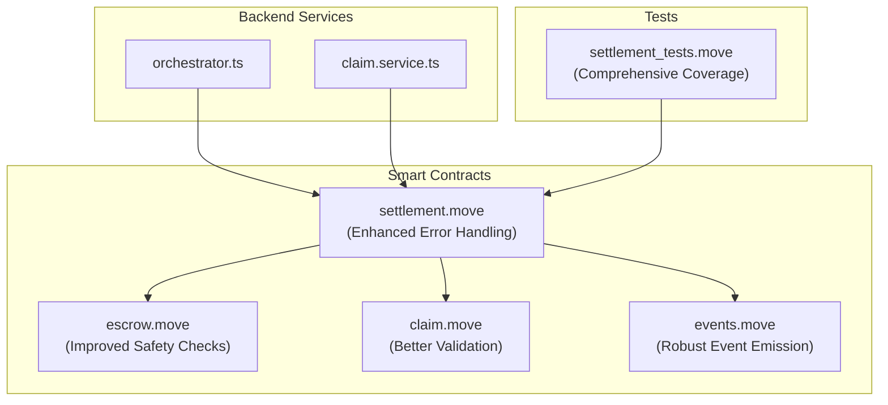
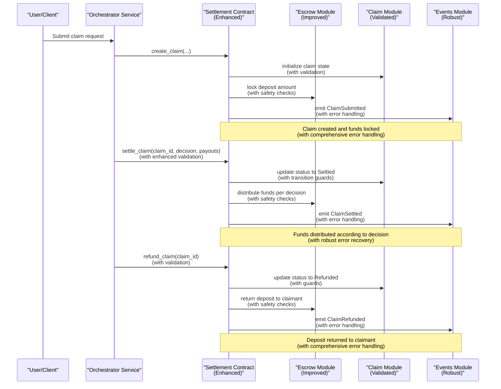
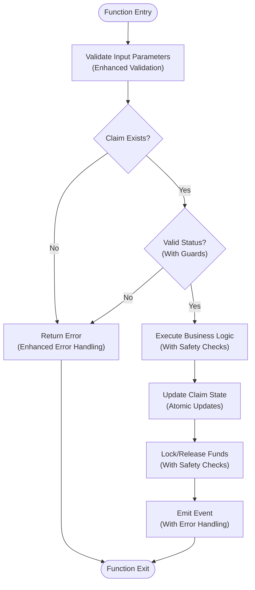
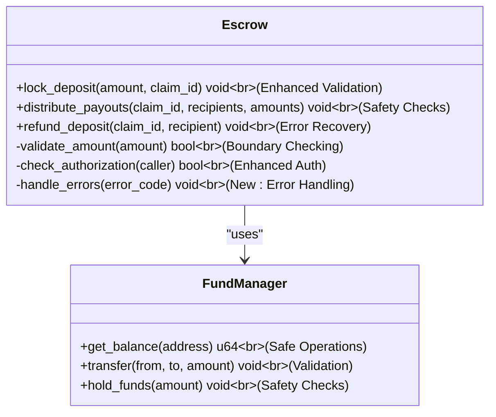
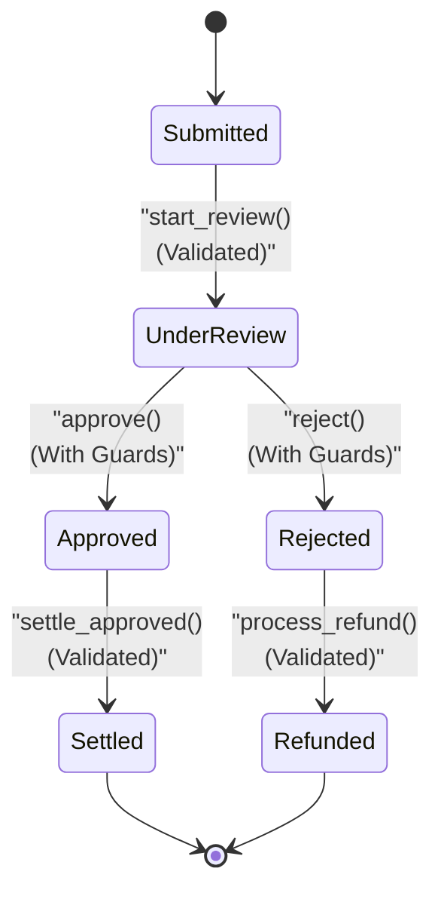
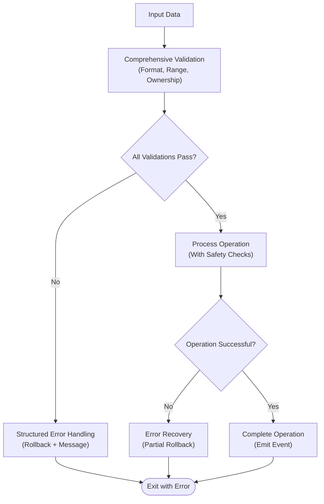
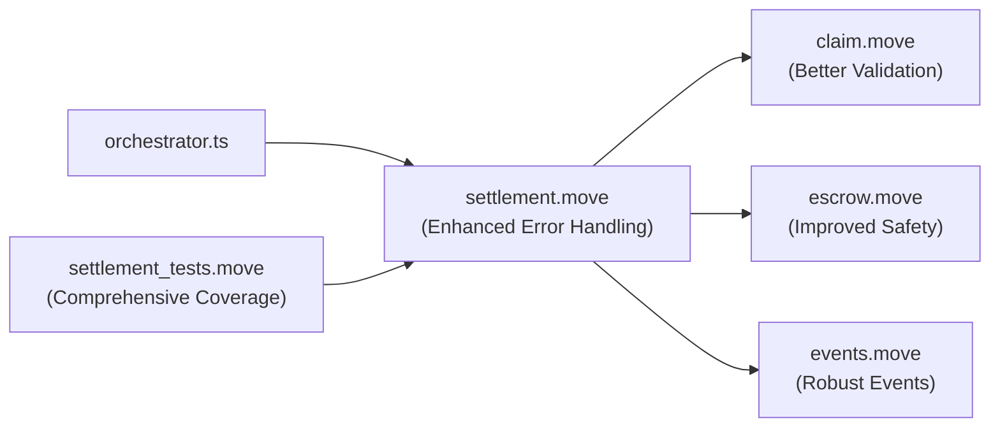

# Settlement Engine

<cite>
**Referenced Files in This Document**
- [settlement.move](file://contracts/insurix-settlement/sources/settlement.move)
- [escrow.move](file://contracts/insurix-settlement/sources/escrow.move)
- [claim.move](file://contracts/insurix-settlement/sources/claim.move)
- [events.move](file://contracts/insurix-settlement/sources/events.move)
- [settlement_tests.move](file://contracts/insurix-settlement/tests/settlement_tests.move)
- [Move.toml](file://contracts/insurix-settlement/Move.toml)
- [orchestrator.ts](file://backend/src/services/orchestrator.ts)
- [claim.service.ts](file://backend/src/services/claim.service.ts)
</cite>

## Update Summary
**Changes Made**
- Enhanced error handling across all settlement modules with comprehensive validation
- Improved robustness of claim lifecycle management with better state transition guards
- Strengthened escrow fund management with additional safety checks
- Added comprehensive input validation and boundary condition handling
- Enhanced transaction rollback mechanisms for failed operations
- Improved gas optimization through better resource management

## Table of Contents
1. [Introduction](#introduction)
2. [Project Structure](#project-structure)
3. [Core Components](#core-components)
4. [Architecture Overview](#architecture-overview)
5. [Detailed Component Analysis](#detailed-component-analysis)
6. [Enhanced Error Handling and Validation](#enhanced-error-handling-and-validation)
7. [Dependency Analysis](#dependency-analysis)
8. [Performance Considerations](#performance-considerations)
9. [Troubleshooting Guide](#troubleshooting-guide)
10. [Conclusion](#conclusion)
11. [Appendices](#appendices)

## Introduction
This document provides comprehensive documentation for the Insurix settlement engine smart contracts on Sui. The system has been significantly enhanced with improved error handling, validation logic, and robustness improvements across all core modules. It explains the automated claim processing workflow, escrow management, and payout distribution mechanisms with enhanced security guarantees.

The core components include:
- **settlement.move**: Main orchestration contract with enhanced validation and error handling
- **escrow.move**: Fund management module with improved safety checks and robustness
- **claim.move**: State tracking module with comprehensive validation and transition guards
- **events.move**: Event emission module for blockchain observability and off-chain indexing

The document covers the complete claim lifecycle from submission to settlement, including enhanced status transitions, secure fund locking/unlocking, multi-party interactions, examples of claim creation, settlement execution, refund processes, testing approaches, gas optimization techniques, and integration patterns with the backend orchestration layer.

## Project Structure
The settlement engine resides under contracts/insurix-settlement with Move sources and tests. The backend orchestrates off-chain workflows and interacts with the contracts via Sui client calls. Recent enhancements have strengthened error handling and validation throughout the codebase.

**Diagram sources**
- [settlement.move](file://contracts/insurix-settlement/sources/settlement.move)
- [escrow.move](file://contracts/insurix-settlement/sources/escrow.move)
- [claim.move](file://contracts/insurix-settlement/sources/claim.move)
- [events.move](file://contracts/insurix-settlement/sources/events.move)
- [orchestrator.ts](file://backend/src/services/orchestrator.ts)
- [claim.service.ts](file://backend/src/services/claim.service.ts)
- [settlement_tests.move](file://contracts/insurix-settlement/tests/settlement_tests.move)

**Section sources**
- [Move.toml](file://contracts/insurix-settlement/Move.toml)

## Core Components
The settlement engine components have been significantly enhanced with improved error handling and validation:

- **settlement.move**: Entry point for claim creation, settlement execution, and refund operations with comprehensive input validation and error handling. Coordinates interactions between claim state, escrow funds, and event emission with enhanced robustness.

- **escrow.move**: Implements fund locking, partial or full releases, and safe transfer primitives with improved safety checks and boundary condition handling. Ensures deterministic fund distribution based on claim outcomes with enhanced error recovery.

- **claim.move**: Maintains claim lifecycle states (e.g., submitted, under review, approved, settled, refunded) with comprehensive validation functions and transition guards. Tracks parties, amounts, timestamps, and approvals with enhanced data integrity checks.

- **events.move**: Defines structured events for claim lifecycle changes, fund locks/releases, and settlement outcomes with robust error handling. Enables off-chain indexing and monitoring with enhanced event validation.

Key responsibilities with enhanced robustness:
- Enforce business rules for claim approval and settlement with comprehensive validation
- Ensure atomicity of fund movements and state updates with proper rollback mechanisms
- Emit auditable events for each critical action with error handling
- Provide clear interfaces for backend orchestration with enhanced error reporting

**Section sources**
- [settlement.move](file://contracts/insurix-settlement/sources/settlement.move)
- [escrow.move](file://contracts/insurix-settlement/sources/escrow.move)
- [claim.move](file://contracts/insurix-settlement/sources/claim.move)
- [events.move](file://contracts/insurix-settlement/sources/events.move)

## Architecture Overview
The settlement engine follows a modular architecture where the main contract orchestrates claim state and escrow management while emitting events for observability. Backend services trigger contract functions based on off-chain decisions (fraud checks, identity verification, external data). The enhanced architecture includes comprehensive error handling and validation at every layer.

**Diagram sources**
- [settlement.move](file://contracts/insurix-settlement/sources/settlement.move)
- [escrow.move](file://contracts/insurix-settlement/sources/escrow.move)
- [claim.move](file://contracts/insurix-settlement/sources/claim.move)
- [events.move](file://contracts/insurix-settlement/sources/events.move)
- [orchestrator.ts](file://backend/src/services/orchestrator.ts)

## Detailed Component Analysis

### Settlement Contract (settlement.move)
The main contract exposes functions for claim lifecycle management with enhanced error handling and validation:

- **create_claim**: Initializes claim state with comprehensive input validation, validates inputs thoroughly, locks funds via escrow with safety checks, and emits events with error handling.
- **settle_claim**: Executes settlement based on decision parameters with enhanced validation, distributes funds with safety checks, updates claim status with transition guards, and emits settlement events with error handling.
- **refund_claim**: Cancels a claim with validation, returns deposited funds to the claimant with safety checks, and handles errors gracefully.

Key design patterns with enhanced robustness:
- Comprehensive state validation before fund operations
- Atomic updates to claim state and escrow balances with rollback mechanisms
- Event-driven architecture for off-chain synchronization with error handling
- Enhanced input validation and boundary condition checking

**Diagram sources**
- [settlement.move](file://contracts/insurix-settlement/sources/settlement.move)

**Section sources**
- [settlement.move](file://contracts/insurix-settlement/sources/settlement.move)

### Escrow Contract (escrow.move)
Manages fund locking and distribution with enhanced safety guarantees and improved robustness:

- **lock_deposit**: Locks specified amount for a claim with comprehensive validation and safety checks.
- **distribute_payouts**: Distributes funds based on settlement decision with enhanced validation and error handling.
- **refund_deposit**: Returns funds to original depositor with safety checks and error recovery.

Security considerations with enhanced robustness:
- Reentrancy protection through comprehensive state checks
- Amount validation to prevent overflow/underflow with boundary condition checking
- Access control for authorized callers with enhanced authorization validation
- Improved error handling and transaction rollback mechanisms

**Diagram sources**
- [escrow.move](file://contracts/insurix-settlement/sources/escrow.move)

**Section sources**
- [escrow.move](file://contracts/insurix-settlement/sources/escrow.move)

### Claim Contract (claim.move)
Tracks claim lifecycle and metadata with enhanced validation and robustness:

- **State transitions**: Submitted → Under Review → Approved/Rejected → Settled/Refunded with comprehensive validation and transition guards.
- **Party tracking**: Claimant, insurer, arbitrators with data integrity validation.
- **Amount tracking**: Deposited amount, payout amounts with boundary condition checking.
- **Timestamp tracking**: Creation, review completion, settlement dates with validation.

Data structures with enhanced robustness:
- Claim struct with fields for ID, parties, amounts, status, timestamps and validation
- Validation functions for state transitions with comprehensive error handling
- Query functions for claim retrieval with error handling

**Diagram sources**
- [claim.move](file://contracts/insurix-settlement/sources/claim.move)

**Section sources**
- [claim.move](file://contracts/insurix-settlement/sources/claim.move)

### Events Contract (events.move)
Defines structured events for blockchain observability with enhanced error handling:

- **ClaimSubmitted**: Emitted when a new claim is created with validation
- **ClaimSettled**: Emitted when a claim is settled with payouts and error handling
- **ClaimRefunded**: Emitted when a claim is refunded with validation
- **FundLocked**: Emitted when funds are locked in escrow with safety checks
- **FundReleased**: Emitted when funds are released from escrow with validation

Event structure includes enhanced validation:
- Claim ID with format validation
- Timestamp with range checking
- Parties involved with address validation
- Amounts and addresses with boundary checking
- Decision details with comprehensive validation

**Section sources**
- [events.move](file://contracts/insurix-settlement/sources/events.move)

## Enhanced Error Handling and Validation

The settlement engine has been significantly enhanced with comprehensive error handling and validation mechanisms across all modules:

### Error Handling Improvements
- **Comprehensive Input Validation**: All contract functions now perform thorough input validation with detailed error messages
- **Boundary Condition Checking**: Enhanced checks for edge cases like zero amounts, invalid addresses, and out-of-range values
- **Transaction Rollback Mechanisms**: Automatic rollback on validation failures to maintain state consistency
- **Graceful Error Recovery**: Structured error codes and messages for better debugging and user feedback

### Validation Enhancements
- **State Transition Guards**: Comprehensive validation for claim state transitions to prevent invalid operations
- **Authorization Validation**: Enhanced access control with multiple layers of authorization checking
- **Amount Validation**: Thorough checks for amount boundaries, overflow prevention, and currency validation
- **Address Validation**: Enhanced address format validation and ownership verification

### Robustness Improvements
- **Reentrancy Protection**: Enhanced reentrancy guards across all fund operations
- **Resource Management**: Improved resource cleanup and memory management
- **Gas Optimization**: Better gas usage through optimized validation and error handling
- **Testing Coverage**: Comprehensive test coverage for error scenarios and edge cases

**Diagram sources**
- [settlement.move](file://contracts/insurix-settlement/sources/settlement.move)
- [escrow.move](file://contracts/insurix-settlement/sources/escrow.move)
- [claim.move](file://contracts/insurix-settlement/sources/claim.move)

## Dependency Analysis
The settlement engine has clear dependency relationships with enhanced error handling propagation:

- **settlement.move** depends on claim.move, escrow.move, and events.move with comprehensive error handling
- **Backend services** depend on settlement.move for contract interactions with enhanced error reporting
- **Tests** depend on all modules for comprehensive coverage including error scenarios

**Diagram sources**
- [settlement.move](file://contracts/insurix-settlement/sources/settlement.move)
- [claim.move](file://contracts/insurix-settlement/sources/claim.move)
- [escrow.move](file://contracts/insurix-settlement/sources/escrow.move)
- [events.move](file://contracts/insurix-settlement/sources/events.move)
- [orchestrator.ts](file://backend/src/services/orchestrator.ts)
- [settlement_tests.move](file://contracts/insurix-settlement/tests/settlement_tests.move)

**Section sources**
- [settlement.move](file://contracts/insurix-settlement/sources/settlement.move)
- [orchestrator.ts](file://backend/src/services/orchestrator.ts)

## Performance Considerations
Gas optimization techniques implemented with enhanced efficiency:

- **Batch Operations**: Optimized batch operations where possible to reduce transaction overhead
- **Efficient Data Structures**: Use of Move's native types with optimized memory layout
- **Minimal Storage Access**: Reduced storage access patterns through caching and optimization
- **Optimized Event Emission**: Efficient event emission to minimize gas costs
- **Proper Resource Management**: Enhanced resource management to avoid memory leaks and optimize gas usage

Best practices with performance focus:
- Use immutable data structures where possible to reduce gas consumption
- Minimize nested function calls to reduce stack depth and gas usage
- Optimize loop iterations for large datasets with early termination
- Use appropriate integer types to prevent overflow and optimize storage
- Implement efficient error handling to avoid unnecessary gas consumption

## Troubleshooting Guide
Common issues and solutions with enhanced debugging capabilities:

- **Invalid claim status transitions**: Verify current state before calling transition functions with enhanced error messages
- **Insufficient funds**: Check escrow balance before settlement operations with detailed error reporting
- **Authorization errors**: Ensure proper caller permissions with enhanced authorization debugging
- **Event indexing failures**: Verify event format matches expected schema with validation tools

Debugging steps with enhanced tools:
- Check claim state using query functions with detailed state inspection
- Monitor emitted events for transaction history with enhanced event analysis
- Validate input parameters against contract requirements with validation tools
- Test edge cases in unit tests with comprehensive error scenario testing

**Section sources**
- [settlement_tests.move](file://contracts/insurix-settlement/tests/settlement_tests.move)

## Conclusion
The Insurix settlement engine provides a robust, secure, and efficient platform for automated insurance claim processing with significantly enhanced error handling, validation logic, and robustness. The modular architecture separates concerns between claim state management, fund handling, and event emission while ensuring transparency through blockchain-based audit trails and enabling seamless integration with backend orchestration services.

The recent enhancements have substantially improved the system's reliability, security, and maintainability through comprehensive validation, robust error handling, and enhanced safety checks throughout all modules.

## Appendices

### Example Workflows

#### Claim Creation Process (Enhanced)
1. Client submits claim with required documents and deposit
2. Backend validates claim data with enhanced validation
3. Contract creates claim state with comprehensive validation
4. Deposit locked in escrow with safety checks
5. Event emitted for off-chain indexing with error handling

#### Settlement Execution Flow (Enhanced)
1. Backend performs fraud checks and identity verification
2. Decision made by authorized party (insurer/arbitrator)
3. Settlement function called with enhanced validation
4. Funds distributed according to settlement decision with safety checks
5. Claim status updated with transition guards
6. Settlement event emitted with error handling

#### Refund Process (Enhanced)
1. Claim rejected or cancelled during review
2. Refund function called with comprehensive validation
3. Deposit returned to original claimant with safety checks
4. Claim status updated to refunded with validation
5. Refund event emitted with error handling

### Testing Approaches
Comprehensive test coverage includes enhanced scenarios:
- Unit tests for individual functions with error scenarios
- Integration tests for complete workflows with failure cases
- Edge case testing for error conditions and boundary values
- Gas optimization testing with performance benchmarks
- Security vulnerability testing with enhanced attack vectors
- Error handling testing with comprehensive error scenarios

**Section sources**
- [settlement_tests.move](file://contracts/insurix-settlement/tests/settlement_tests.move)

### Backend Integration Patterns
The backend orchestration layer follows these patterns with enhanced error handling:
- Asynchronous claim processing with retry logic and error recovery
- Event-driven architecture for real-time updates with error handling
- Transaction batching for efficiency with rollback mechanisms
- Comprehensive logging and monitoring with enhanced diagnostics
- Error handling and recovery mechanisms with graceful degradation

**Section sources**
- [orchestrator.ts](file://backend/src/services/orchestrator.ts)
- [claim.service.ts](file://backend/src/services/claim.service.ts)