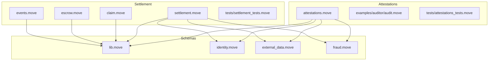
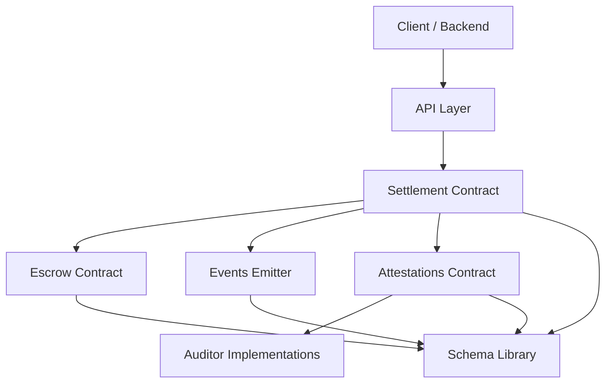
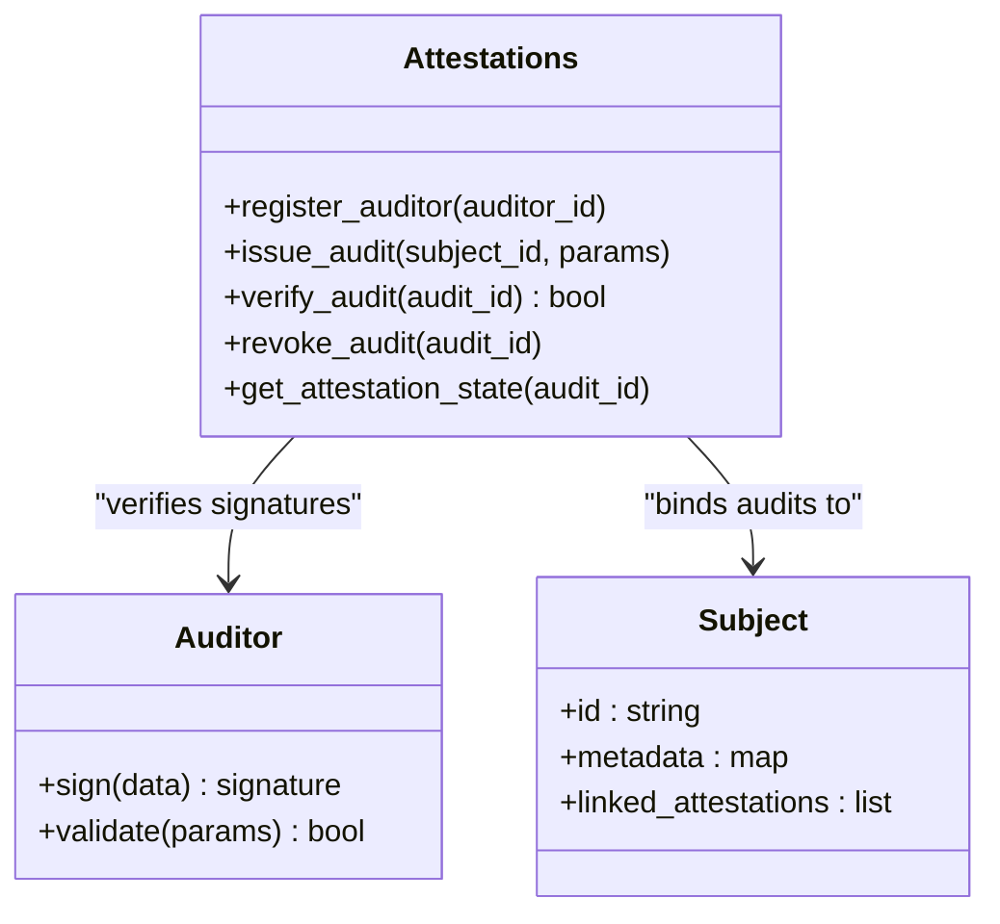
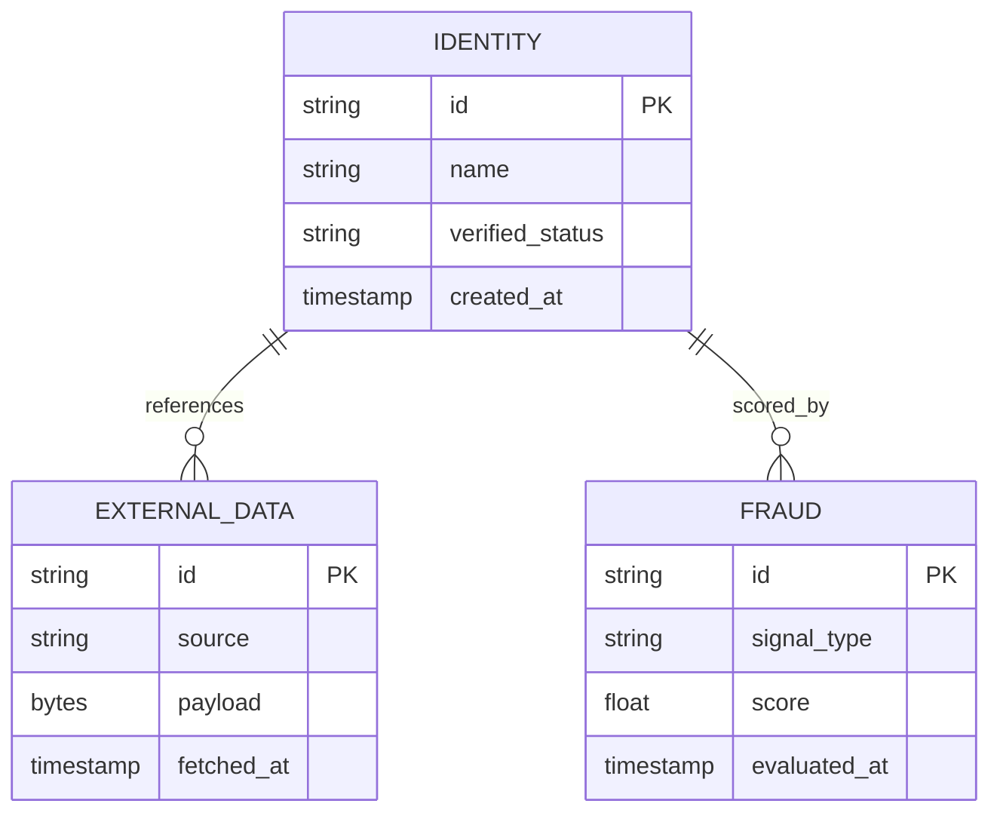
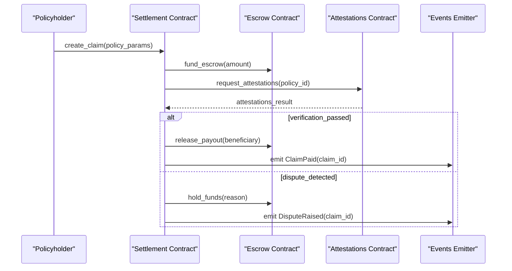
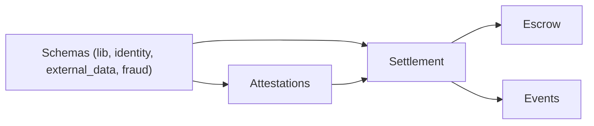

# Smart Contracts

<cite>
**Referenced Files in This Document**
- [README.md](file://contracts/attestations/README.md)
- [DESIGN.md](file://contracts/attestations/DESIGN.md)
- [CONVENTIONS.md](file://contracts/attestations/CONVENTIONS.md)
- [AGENTS.md](file://contracts/attestations/AGENTS.md)
- [FUTURE-EXTENSIONS.md](file://contracts/attestations/FUTURE-EXTENSIONS.md)
- [SIP-56-COMPARISON.md](file://contracts/attestations/SIP-56-COMPARISON.md)
- [Move.toml](file://contracts/insurix-schemas/Move.toml)
- [lib.move](file://contracts/insurix-schemas/sources/lib.move)
- [identity.move](file://contracts/insurix-schemas/sources/identity.move)
- [external_data.move](file://contracts/insurix-schemas/sources/external_data.move)
- [fraud.move](file://contracts/insurix-schemas/sources/fraud.move)
- [Move.toml](file://contracts/insurix-settlement/Move.toml)
- [settlement.move](file://contracts/insurix-settlement/sources/settlement.move)
- [claim.move](file://contracts/insurix-settlement/sources/claim.move)
- [escrow.move](file://contracts/insurix-settlement/sources/escrow.move)
- [events.move](file://contracts/insurix-settlement/sources/events.move)
- [attestations_tests.move](file://contracts/attestations/packages/attestations/tests/attestations_tests.move)
- [attestations.move](file://contracts/attestations/packages/attestations/sources/attestations.move)
- [audit.move](file://contracts/attestations/examples/auditor/sources/audit.move)
- [settlement_tests.move](file://contracts/insurix-settlement/tests/settlement_tests.move)
</cite>

## Table of Contents
1. Introduction
2. Project Structure
3. Core Components
4. Architecture Overview
5. Detailed Component Analysis
6. Dependency Analysis
7. Performance Considerations
8. Troubleshooting Guide
9. Conclusion
10. Appendices

## Introduction
This document provides comprehensive smart contract documentation for the Insurix protocol built on the Sui blockchain using Move. It covers the attestation system for policy verification, the settlement engine for automated claim processing, and schema definitions for data structures. It explains contract architecture, state management, event handling patterns, multi-auditor verification, dispute resolution mechanisms, deployment procedures, testing strategies, upgrade patterns, security considerations, gas optimization, and best practices for Move development. Integration patterns for backend interaction are also included.

## Project Structure
The repository organizes contracts into three primary areas:
- Attestations package: Implements the auditor framework, subject types, and shared attestation primitives used across auditors.
- Schemas package: Defines canonical data models for identity, external data, fraud signals, and shared library utilities.
- Settlement package: Encodes claims, escrows, events, and the settlement workflow that automates payouts based on attestations.

**Diagram sources**
- [attestations.move](file://contracts/attestations/packages/attestations/sources/attestations.move)
- [audit.move](file://contracts/attestations/examples/auditor/sources/audit.move)
- [attestations_tests.move](file://contracts/attestations/packages/attestations/tests/attestations_tests.move)
- [lib.move](file://contracts/insurix-schemas/sources/lib.move)
- [identity.move](file://contracts/insurix-schemas/sources/identity.move)
- [external_data.move](file://contracts/insurix-schemas/sources/external_data.move)
- [fraud.move](file://contracts/insurix-schemas/sources/fraud.move)
- [settlement.move](file://contracts/insurix-settlement/sources/settlement.move)
- [claim.move](file://contracts/insurix-settlement/sources/claim.move)
- [escrow.move](file://contracts/insurix-settlement/sources/escrow.move)
- [events.move](file://contracts/insurix-settlement/sources/events.move)
- [settlement_tests.move](file://contracts/insurix-settlement/tests/settlement_tests.move)

**Section sources**
- [README.md](file://contracts/attestations/README.md)
- [DESIGN.md](file://contracts/attestations/DESIGN.md)
- [CONVENTIONS.md](file://contracts/attestations/CONVENTIONS.md)
- [AGENTS.md](file://contracts/attestations/AGENTS.md)
- [FUTURE-EXTENSIONS.md](file://contracts/attestations/FUTURE-EXTENSIONS.md)
- [SIP-56-COMPARISON.md](file://contracts/attestations/SIP-56-COMPARISON.md)
- [Move.toml](file://contracts/insurix-schemas/Move.toml)
- [Move.toml](file://contracts/insurix-settlement/Move.toml)

## Core Components
- Attestation Framework: Provides a reusable auditor interface and shared primitives for creating, verifying, and revoking audits against subjects. Supports multiple auditors and aggregation of attestations to drive downstream decisions.
- Schema Library: Centralized definitions for identity, external data, and fraud-related structures with validation helpers and common types used by both attestation and settlement modules.
- Settlement Engine: Manages claim lifecycle, escrow funding, payout logic, and event emission. Integrates with attestations to automate claim resolution and disbursements.

Key responsibilities:
- Attestations: Auditor registration, audit issuance, verification, and revocation; subject modeling; cross-auditor consensus rules.
- Schemas: Canonical data models, serialization helpers, and validation functions.
- Settlement: Claim creation, evidence collection (via attestations), escrow management, payout or refund, and dispute handling.

**Section sources**
- [attestations.move](file://contracts/attestations/packages/attestations/sources/attestations.move)
- [lib.move](file://contracts/insurix-schemas/sources/lib.move)
- [identity.move](file://contracts/insurix-schemas/sources/identity.move)
- [external_data.move](file://contracts/insurix-schemas/sources/external_data.move)
- [fraud.move](file://contracts/insurix-schemas/sources/fraud.move)
- [settlement.move](file://contracts/insurix-settlement/sources/settlement.move)
- [claim.move](file://contracts/insurix-settlement/sources/claim.move)
- [escrow.move](file://contracts/insurix-settlement/sources/escrow.move)
- [events.move](file://contracts/insurix-settlement/sources/events.move)

## Architecture Overview
Insurix composes three layers:
- Data Layer (Schemas): Strongly typed models for identity, external data, and fraud signals.
- Verification Layer (Attestations): Multi-auditor system producing verifiable attestations bound to subjects and policies.
- Execution Layer (Settlement): Automated claim processing using attestations as evidence to trigger payouts from escrows.

**Diagram sources**
- [settlement.move](file://contracts/insurix-settlement/sources/settlement.move)
- [escrow.move](file://contracts/insurix-settlement/sources/escrow.move)
- [events.move](file://contracts/insurix-settlement/sources/events.move)
- [attestations.move](file://contracts/attestations/packages/attestations/sources/attestations.move)
- [audit.move](file://contracts/attestations/examples/auditor/sources/audit.move)
- [lib.move](file://contracts/insurix-schemas/sources/lib.move)

## Detailed Component Analysis

### Attestations Package
The attestation system enables auditors to issue verifiable statements about subjects and policies. It supports:
- Auditor registry and capability checks
- Subject modeling and linkage to attestations
- Audit issuance, verification, and revocation
- Aggregation rules for multi-auditor consensus

**Diagram sources**
- [attestations.move](file://contracts/attestations/packages/attestations/sources/attestations.move)
- [audit.move](file://contracts/attestations/examples/auditor/sources/audit.move)

Key implementation patterns:
- Capability-based access control for auditor actions
- Immutable audit records with revocation flags
- Event emission for audit lifecycle changes
- Validation hooks for auditor-specific business rules

**Section sources**
- [attestations.move](file://contracts/attestations/packages/attestations/sources/attestations.move)
- [audit.move](file://contracts/attestations/examples/auditor/sources/audit.move)
- [attestations_tests.move](file://contracts/attestations/packages/attestations/tests/attestations_tests.move)

### Schemas Package
Canonical data models ensure consistency across contracts:
- Identity: Person or entity identifiers, KYC attributes, and verification status
- External Data: Oracles or off-chain data bindings with provenance
- Fraud: Signals and risk scores derived from analytics engines
- Lib: Shared utilities, type aliases, and validation helpers

**Diagram sources**
- [identity.move](file://contracts/insurix-schemas/sources/identity.move)
- [external_data.move](file://contracts/insurix-schemas/sources/external_data.move)
- [fraud.move](file://contracts/insurix-schemas/sources/fraud.move)
- [lib.move](file://contracts/insurix-schemas/sources/lib.move)

Best practices:
- Use Move structs with explicit fields and immutability where possible
- Provide validation functions to enforce constraints at construction time
- Emit events for critical state transitions involving schemas

**Section sources**
- [lib.move](file://contracts/insurix-schemas/sources/lib.move)
- [identity.move](file://contracts/insurix-schemas/sources/identity.move)
- [external_data.move](file://contracts/insurix-schemas/sources/external_data.move)
- [fraud.move](file://contracts/insurix-schemas/sources/fraud.move)

### Settlement Package
The settlement engine automates claim processing:
- Claim creation with policy parameters and required attestations
- Escrow funding and custody of funds until conditions are met
- Payout upon successful verification or refund on disputes
- Event-driven updates for transparency and off-chain indexing

**Diagram sources**
- [settlement.move](file://contracts/insurix-settlement/sources/settlement.move)
- [claim.move](file://contracts/insurix-settlement/sources/claim.move)
- [escrow.move](file://contracts/insurix-settlement/sources/escrow.move)
- [events.move](file://contracts/insurix-settlement/sources/events.move)

State management highlights:
- Claims transition through states: Created, Under Review, Approved, Paid, Disputed, Resolved
- Escrow balances tracked per claim with strict access controls
- Events emitted for each state change to support off-chain monitoring

Dispute resolution mechanisms:
- Multi-signature arbitration or time-bound challenges
- Conditional release based on auditor consensus or oracle results
- Refund paths when claims are invalidated

**Section sources**
- [settlement.move](file://contracts/insurix-settlement/sources/settlement.move)
- [claim.move](file://contracts/insurix-settlement/sources/claim.move)
- [escrow.move](file://contracts/insurix-settlement/sources/escrow.move)
- [events.move](file://contracts/insurix-settlement/sources/events.move)
- [settlement_tests.move](file://contracts/insurix-settlement/tests/settlement_tests.move)

## Dependency Analysis
The contracts exhibit clear separation of concerns with minimal coupling:
- Attestations depend on Schemas for data modeling
- Settlement depends on both Attestations and Schemas
- Escrow is isolated but uses Schemas for consistent data types
- Events module emits standardized events consumed by off-chain systems

**Diagram sources**
- [lib.move](file://contracts/insurix-schemas/sources/lib.move)
- [identity.move](file://contracts/insurix-schemas/sources/identity.move)
- [external_data.move](file://contracts/insurix-schemas/sources/external_data.move)
- [fraud.move](file://contracts/insurix-schemas/sources/fraud.move)
- [attestations.move](file://contracts/attestations/packages/attestations/sources/attestations.move)
- [settlement.move](file://contracts/insurix-settlement/sources/settlement.move)
- [escrow.move](file://contracts/insurix-settlement/sources/escrow.move)
- [events.move](file://contracts/insurix-settlement/sources/events.move)

Potential circular dependencies: None detected. All modules follow a unidirectional dependency flow toward Schemas.

**Section sources**
- [Move.toml](file://contracts/insurix-schemas/Move.toml)
- [Move.toml](file://contracts/insurix-settlement/Move.toml)

## Performance Considerations
- Gas Optimization:
  - Minimize storage writes by batching operations where possible
  - Use immutable structs to reduce copy overhead
  - Avoid unnecessary event emissions in hot paths
- State Management:
  - Keep frequently accessed data compact to reduce deserialization costs
  - Leverage Move’s object model for efficient ownership transfers
- Event Handling:
  - Emit only essential events to lower indexing load
  - Use structured events for easy parsing by off-chain services

[No sources needed since this section provides general guidance]

## Troubleshooting Guide
Common issues and resolutions:
- Invalid Auditor Signature: Ensure auditor keys are correctly registered and signatures match expected formats
- Escrow Funding Failures: Verify sufficient balance and correct token types
- Claim Rejection: Check attestation requirements and policy validity
- Event Indexing Gaps: Confirm event emission points and network connectivity

Debugging strategies:
- Enable verbose logging in local test environments
- Use Move debugger for step-by-step execution analysis
- Validate schema constraints before contract interactions

**Section sources**
- [attestations_tests.move](file://contracts/attestations/packages/attestations/tests/attestations_tests.move)
- [settlement_tests.move](file://contracts/insurix-settlement/tests/settlement_tests.move)

## Conclusion
Insurix provides a robust foundation for insurance automation on Sui through its modular design. The attestation system ensures trustworthy verification, while the settlement engine automates claim processing with transparent event tracking. By following the documented best practices and leveraging the provided schemas, developers can build secure, efficient, and scalable insurance applications.

[No sources needed since this section summarizes without analyzing specific files]

## Appendices

### Deployment Procedures
- Publish Schemas first to establish canonical data types
- Deploy Attestations package with auditor configurations
- Deploy Settlement and Escrow contracts with proper initialization
- Configure backend services to interact with deployed contracts

Testing Strategies:
- Unit tests for individual modules using Move test framework
- Integration tests covering end-to-end claim workflows
- Stress tests for high-volume scenarios and edge cases

Upgrade Patterns:
- Implement versioned upgrades for auditors and settlement logic
- Maintain backward compatibility for existing claims and attestations
- Use migration scripts to transfer state safely between versions

Security Considerations:
- Enforce strict access controls for sensitive operations
- Validate all inputs to prevent injection attacks
- Regular audits of smart contract code and dependencies

Integration Patterns:
- Backend should call contract entry points via Sui SDK
- Handle events asynchronously for real-time updates
- Implement retry logic for failed transactions

**Section sources**
- [README.md](file://contracts/attestations/README.md)
- [DESIGN.md](file://contracts/attestations/DESIGN.md)
- [CONVENTIONS.md](file://contracts/attestations/CONVENTIONS.md)
- [AGENTS.md](file://contracts/attestations/AGENTS.md)
- [FUTURE-EXTENSIONS.md](file://contracts/attestations/FUTURE-EXTENSIONS.md)
- [SIP-56-COMPARISON.md](file://contracts/attestations/SIP-56-COMPARISON.md)