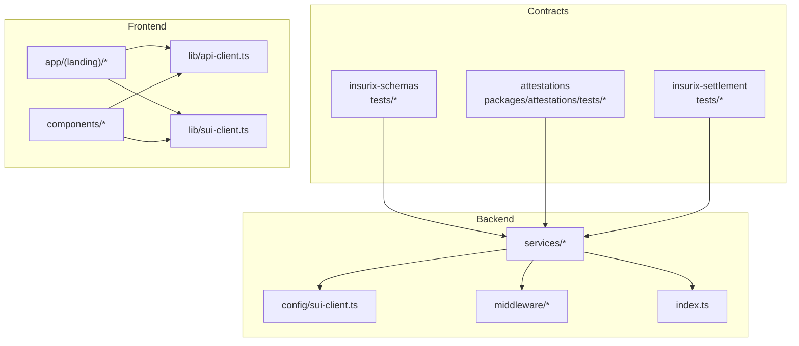
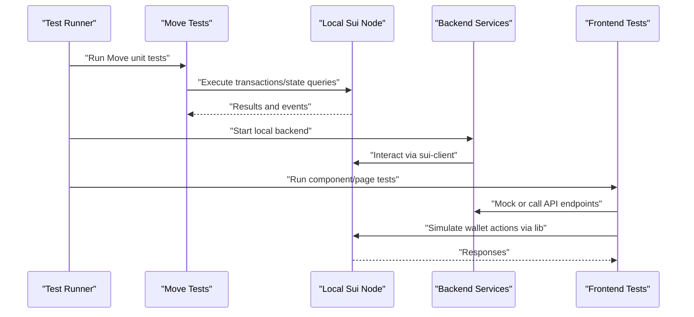
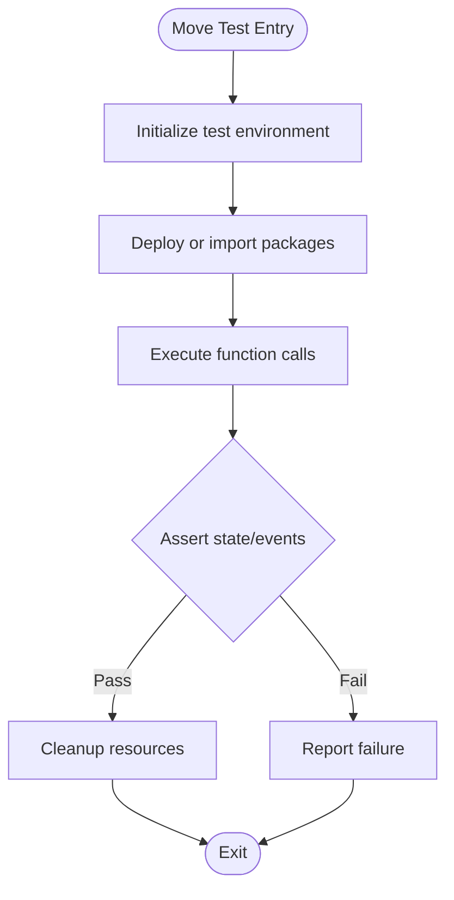
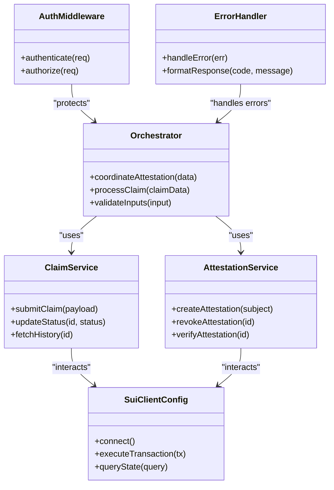
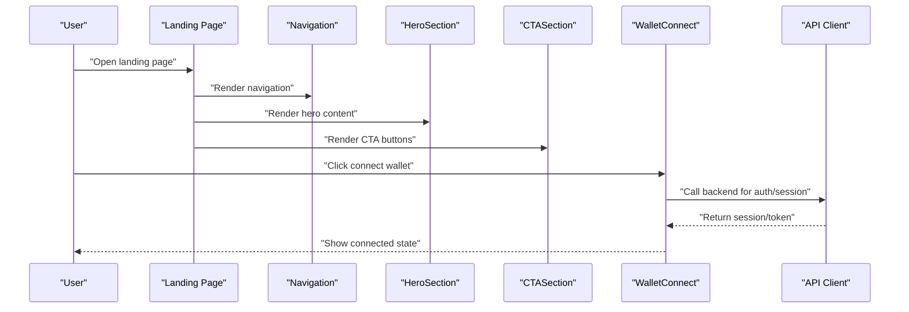
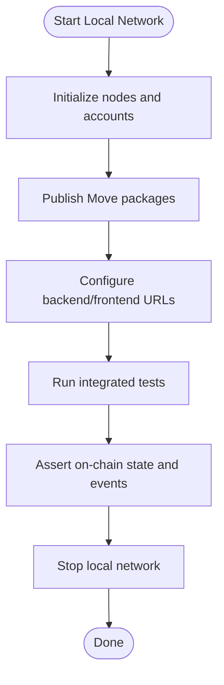
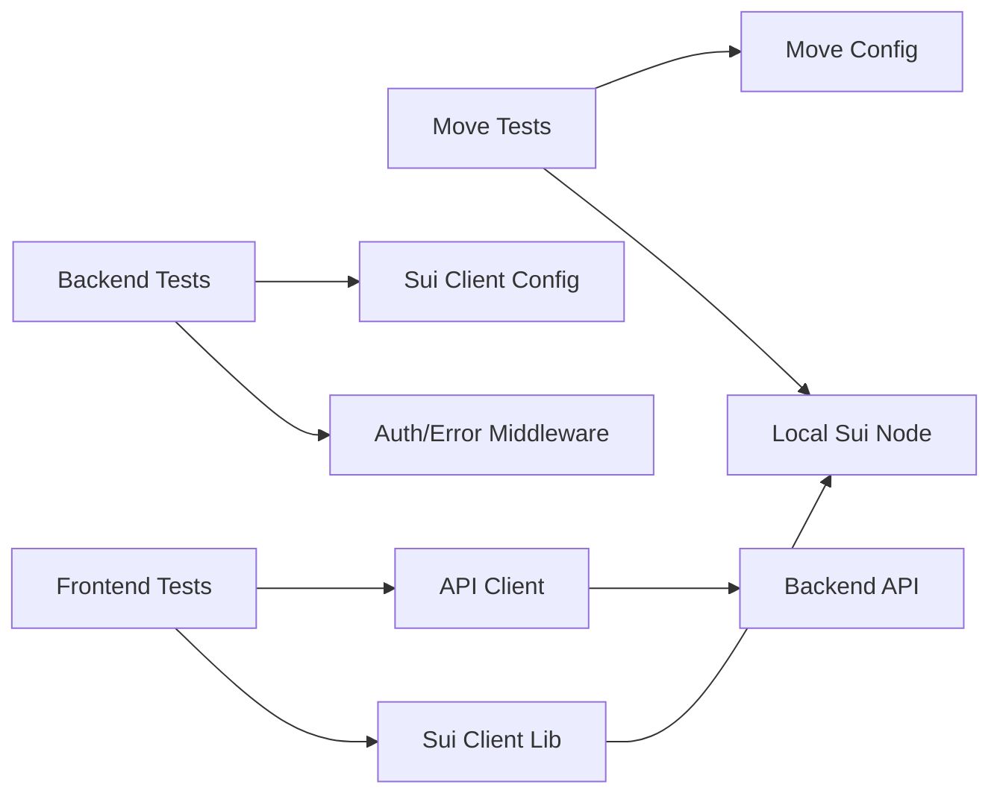

# Testing Guide

<cite>
**Referenced Files in This Document**
- [Move.toml](file://contracts/insurix-schemas/Move.toml)
- [external_data_tests.move](file://contracts/insurix-schemas/tests/external_data_tests.move)
- [fraud_tests.move](file://contracts/insurix-schemas/tests/fraud_tests.move)
- [identity_tests.move](file://contracts/insurix-schemas/tests/identity_tests.move)
- [attestations_tests.move](file://contracts/attestations/packages/attestations/tests/attestations_tests.move)
- [settlement_tests.move](file://contracts/insurix-settlement/tests/settlement_tests.move)
- [sui-client.ts](file://backend/src/config/sui-client.ts)
- [keypairs.ts](file://backend/src/config/keypairs.ts)
- [orchestrator.ts](file://backend/src/services/orchestrator.ts)
- [claim.service.ts](file://backend/src/services/claim.service.ts)
- [attestation.service.ts](file://backend/src/services/attestation.service.ts)
- [auth.ts](file://backend/src/middleware/auth.ts)
- [error-handler.ts](file://backend/src/middleware/error-handler.ts)
- [index.ts](file://backend/src/index.ts)
- [package.json](file://backend/package.json)
- [api-client.ts](file://frontend/src/lib/api-client.ts)
- [sui-client.ts](file://frontend/src/lib/sui-client.ts)
- [page.tsx](file://frontend/src/app/(landing)/page.tsx)
- [layout.tsx](file://frontend/src/app/(landing)/layout.tsx)
- [CTASection.tsx](file://frontend/src/app/(landing)/components/CTASection.tsx)
- [HeroSection.tsx](file://frontend/src/app/(landing)/components/HeroSection.tsx)
- [Navigation.tsx](file://frontend/src/app/(landing)/components/Navigation.tsx)
- [WalletConnect.tsx](file://frontend/src/components/WalletConnect.tsx)
- [demo-up.sh](file://contracts/attestations/demo/scripts/demo-up.sh)
- [test-publish.sh](file://contracts/attestations/demo/scripts/test-publish.sh)
- [localnets.py](file://contracts/attestations/demo/scripts/localnets.py)
</cite>

## Table of Contents
1. [Introduction](#introduction)
2. [Project Structure](#project-structure)
3. [Core Components](#core-components)
4. [Architecture Overview](#architecture-overview)
5. [Detailed Component Analysis](#detailed-component-analysis)
6. [Dependency Analysis](#dependency-analysis)
7. [Performance Considerations](#performance-considerations)
8. [Troubleshooting Guide](#troubleshooting-guide)
9. [Conclusion](#conclusion)
10. [Appendices](#appendices)

## Introduction
This Testing Guide provides a comprehensive, layer-by-layer approach to testing the Insurix protocol. It covers Move smart contract testing strategies and frameworks, backend service testing (unit, integration, API), frontend testing for components and pages, blockchain testing with local Sui network simulation and testnet deployment, performance and load testing, security testing methodologies, mocking strategies, continuous integration setup, debugging techniques, and test coverage analysis. The guide is designed to be accessible to both new contributors and experienced engineers working across the full stack.

## Project Structure
Insurix is organized into three primary layers:
- Contracts: Move packages for schemas, attestations, and settlement logic.
- Backend: TypeScript services interacting with Sui and business logic.
- Frontend: Next.js application with wallet connectivity and UI components.

**Diagram sources**
- [Move.toml](file://contracts/insurix-schemas/Move.toml)
- [attestations_tests.move](file://contracts/attestations/packages/attestations/tests/attestations_tests.move)
- [settlement_tests.move](file://contracts/insurix-settlement/tests/settlement_tests.move)
- [sui-client.ts](file://backend/src/config/sui-client.ts)
- [orchestrator.ts](file://backend/src/services/orchestrator.ts)
- [claim.service.ts](file://backend/src/services/claim.service.ts)
- [attestation.service.ts](file://backend/src/services/attestation.service.ts)
- [api-client.ts](file://frontend/src/lib/api-client.ts)
- [sui-client.ts](file://frontend/src/lib/sui-client.ts)
- [page.tsx](file://frontend/src/app/(landing)/page.tsx)
- [layout.tsx](file://frontend/src/app/(landing)/layout.tsx)
- [CTASection.tsx](file://frontend/src/app/(landing)/components/CTASection.tsx)
- [HeroSection.tsx](file://frontend/src/app/(landing)/components/HeroSection.tsx)
- [Navigation.tsx](file://frontend/src/app/(landing)/components/Navigation.tsx)
- [WalletConnect.tsx](file://frontend/src/components/WalletConnect.tsx)

**Section sources**
- [package.json](file://backend/package.json)
- [Move.toml](file://contracts/insurix-schemas/Move.toml)

## Core Components
This section outlines the core testing targets across layers:
- Move contracts: unit tests per module, property-based checks where applicable, and cross-package interactions.
- Backend services: unit tests for pure functions, integration tests against a local Sui node, and API endpoint tests.
- Frontend: component tests, page-level tests, and user interaction flows using React Testing Library and Playwright/Cypress.
- Blockchain: local Sui network simulation via scripts and testnet deployments.

Key files involved:
- Move tests under insurix-schemas, attestations, and insurix-settlement.
- Backend configuration and services for Sui client and orchestration.
- Frontend lib modules for API and Sui client usage.
- Scripts for local network management and demo/test publishing.

**Section sources**
- [external_data_tests.move](file://contracts/insurix-schemas/tests/external_data_tests.move)
- [fraud_tests.move](file://contracts/insurix-schemas/tests/fraud_tests.move)
- [identity_tests.move](file://contracts/insurix-schemas/tests/identity_tests.move)
- [attestations_tests.move](file://contracts/attestations/packages/attestations/tests/attestations_tests.move)
- [settlement_tests.move](file://contracts/insurix-settlement/tests/settlement_tests.move)
- [sui-client.ts](file://backend/src/config/sui-client.ts)
- [keypairs.ts](file://backend/src/config/keypairs.ts)
- [orchestrator.ts](file://backend/src/services/orchestrator.ts)
- [claim.service.ts](file://backend/src/services/claim.service.ts)
- [attestation.service.ts](file://backend/src/services/attestation.service.ts)
- [api-client.ts](file://frontend/src/lib/api-client.ts)
- [sui-client.ts](file://frontend/src/lib/sui-client.ts)
- [demo-up.sh](file://contracts/attestations/demo/scripts/demo-up.sh)
- [test-publish.sh](file://contracts/attestations/demo/scripts/test-publish.sh)
- [localnets.py](file://contracts/attestations/demo/scripts/localnets.py)

## Architecture Overview
The testing architecture spans multiple layers with clear boundaries:
- Move tests validate on-chain logic and state transitions.
- Backend tests ensure correct Sui client usage, service orchestration, and API behavior.
- Frontend tests verify UI rendering, user flows, and wallet integrations.
- Local Sui network simulation enables end-to-end validation without external dependencies.

**Diagram sources**
- [sui-client.ts](file://backend/src/config/sui-client.ts)
- [orchestrator.ts](file://backend/src/services/orchestrator.ts)
- [api-client.ts](file://frontend/src/lib/api-client.ts)
- [sui-client.ts](file://frontend/src/lib/sui-client.ts)
- [demo-up.sh](file://contracts/attestations/demo/scripts/demo-up.sh)

## Detailed Component Analysis

### Move Smart Contract Testing
Insurix uses Move’s native testing framework within each package. Tests are colocated under tests directories and executed per package.

- Strategy:
  - Unit tests per module to assert state changes, event emissions, and error conditions.
  - Cross-package tests to validate interactions between schemas, attestations, and settlement logic.
  - Property-based checks for invariant preservation across complex workflows.

- Framework and execution:
  - Use Move’s built-in test harness; run tests per package configuration.
  - Leverage local Sui node for transactional tests when needed.

- Best practices:
  - Isolate tests with fresh state per scenario.
  - Mock external data sources by injecting deterministic inputs.
  - Assert events and object states explicitly.
  - Keep tests fast by avoiding heavy I/O; use local networks only when necessary.

- Examples and references:
  - Schema tests: external data, fraud detection, identity modules.
  - Attestation package tests for audit lifecycle.
  - Settlement tests for claim lifecycle and escrow operations.

**Diagram sources**
- [external_data_tests.move](file://contracts/insurix-schemas/tests/external_data_tests.move)
- [fraud_tests.move](file://contracts/insurix-schemas/tests/fraud_tests.move)
- [identity_tests.move](file://contracts/insurix-schemas/tests/identity_tests.move)
- [attestations_tests.move](file://contracts/attestations/packages/attestations/tests/attestations_tests.move)
- [settlement_tests.move](file://contracts/insurix-settlement/tests/settlement_tests.move)

**Section sources**
- [Move.toml](file://contracts/insurix-schemas/Move.toml)
- [external_data_tests.move](file://contracts/insurix-schemas/tests/external_data_tests.move)
- [fraud_tests.move](file://contracts/insurix-schemas/tests/fraud_tests.move)
- [identity_tests.move](file://contracts/insurix-schemas/tests/identity_tests.move)
- [attestations_tests.move](file://contracts/attestations/packages/attestations/tests/attestations_tests.move)
- [settlement_tests.move](file://contracts/insurix-settlement/tests/settlement_tests.move)

### Backend Service Testing
Backend tests cover unit logic, integration with Sui, and API endpoints.

- Unit tests:
  - Pure functions in services should be tested in isolation.
  - Mock Sui client methods to avoid real network calls.
  - Validate input/output transformations and error handling.

- Integration tests:
  - Spin up a local Sui node and run end-to-end flows through orchestrator and services.
  - Use deterministic keypairs for reproducible scenarios.
  - Assert on-chain state changes and emitted events.

- API endpoint tests:
  - Use HTTP clients to hit backend routes.
  - Mock external dependencies (e.g., identity providers).
  - Verify status codes, payloads, and error responses.

- Key files:
  - Sui client configuration and keypair management.
  - Orchestrator coordinating attestations and claims.
  - Claim and attestation services encapsulating business logic.
  - Middleware for authentication and error handling.

**Diagram sources**
- [orchestrator.ts](file://backend/src/services/orchestrator.ts)
- [claim.service.ts](file://backend/src/services/claim.service.ts)
- [attestation.service.ts](file://backend/src/services/attestation.service.ts)
- [sui-client.ts](file://backend/src/config/sui-client.ts)
- [auth.ts](file://backend/src/middleware/auth.ts)
- [error-handler.ts](file://backend/src/middleware/error-handler.ts)

**Section sources**
- [sui-client.ts](file://backend/src/config/sui-client.ts)
- [keypairs.ts](file://backend/src/config/keypairs.ts)
- [orchestrator.ts](file://backend/src/services/orchestrator.ts)
- [claim.service.ts](file://backend/src/services/claim.service.ts)
- [attestation.service.ts](file://backend/src/services/attestation.service.ts)
- [auth.ts](file://backend/src/middleware/auth.ts)
- [error-handler.ts](file://backend/src/middleware/error-handler.ts)
- [index.ts](file://backend/src/index.ts)
- [package.json](file://backend/package.json)

### Frontend Testing Approaches
Frontend tests focus on component rendering, user interactions, and wallet connectivity.

- Component tests:
  - Use React Testing Library to render components and assert DOM output.
  - Mock wallet provider and Sui client methods to simulate blockchain interactions.
  - Validate props handling and state updates.

- Page tests:
  - Render landing and claims pages, assert navigation and content.
  - Simulate user flows like connecting wallets and submitting forms.

- User interaction tests:
  - Use Playwright or Cypress for end-to-end flows.
  - Interact with Navigation, HeroSection, CTASection, and WalletConnect components.
  - Assert routing and API calls via api-client mocks.

- Key files:
  - Landing page layout and components.
  - WalletConnect component for Sui wallet integration.
  - API client and Sui client libraries for mocking.

**Diagram sources**
- [page.tsx](file://frontend/src/app/(landing)/page.tsx)
- [layout.tsx](file://frontend/src/app/(landing)/layout.tsx)
- [Navigation.tsx](file://frontend/src/app/(landing)/components/Navigation.tsx)
- [HeroSection.tsx](file://frontend/src/app/(landing)/components/HeroSection.tsx)
- [CTASection.tsx](file://frontend/src/app/(landing)/components/CTASection.tsx)
- [WalletConnect.tsx](file://frontend/src/components/WalletConnect.tsx)
- [api-client.ts](file://frontend/src/lib/api-client.ts)
- [sui-client.ts](file://frontend/src/lib/sui-client.ts)

**Section sources**
- [page.tsx](file://frontend/src/app/(landing)/page.tsx)
- [layout.tsx](file://frontend/src/app/(landing)/layout.tsx)
- [Navigation.tsx](file://frontend/src/app/(landing)/components/Navigation.tsx)
- [HeroSection.tsx](file://frontend/src/app/(landing)/components/HeroSection.tsx)
- [CTASection.tsx](file://frontend/src/app/(landing)/components/CTASection.tsx)
- [WalletConnect.tsx](file://frontend/src/components/WalletConnect.tsx)
- [api-client.ts](file://frontend/src/lib/api-client.ts)
- [sui-client.ts](file://frontend/src/lib/sui-client.ts)

### Blockchain Testing with Local Sui Network Simulation
Local Sui network simulation enables realistic testing without external dependencies.

- Tools and scripts:
  - demo-up.sh to start local network and deploy contracts.
  - test-publish.sh to publish and test contracts locally.
  - localnets.py for managing multiple local nodes.

- Workflow:
  - Initialize local network and fund test accounts.
  - Publish Move packages and record addresses.
  - Run backend and frontend tests against local endpoints.
  - Assert on-chain state and events post-execution.

**Diagram sources**
- [demo-up.sh](file://contracts/attestations/demo/scripts/demo-up.sh)
- [test-publish.sh](file://contracts/attestations/demo/scripts/test-publish.sh)
- [localnets.py](file://contracts/attestations/demo/scripts/localnets.py)

**Section sources**
- [demo-up.sh](file://contracts/attestations/demo/scripts/demo-up.sh)
- [test-publish.sh](file://contracts/attestations/demo/scripts/test-publish.sh)
- [localnets.py](file://contracts/attestations/demo/scripts/localnets.py)

## Dependency Analysis
Testing dependencies span across layers with clear interfaces:
- Move tests depend on package configurations and local Sui node.
- Backend tests depend on Sui client configuration and middleware.
- Frontend tests depend on API client and Sui client libraries.

**Diagram sources**
- [Move.toml](file://contracts/insurix-schemas/Move.toml)
- [sui-client.ts](file://backend/src/config/sui-client.ts)
- [auth.ts](file://backend/src/middleware/auth.ts)
- [error-handler.ts](file://backend/src/middleware/error-handler.ts)
- [api-client.ts](file://frontend/src/lib/api-client.ts)
- [sui-client.ts](file://frontend/src/lib/sui-client.ts)

**Section sources**
- [Move.toml](file://contracts/insurix-schemas/Move.toml)
- [sui-client.ts](file://backend/src/config/sui-client.ts)
- [auth.ts](file://backend/src/middleware/auth.ts)
- [error-handler.ts](file://backend/src/middleware/error-handler.ts)
- [api-client.ts](file://frontend/src/lib/api-client.ts)
- [sui-client.ts](file://frontend/src/lib/sui-client.ts)

## Performance Considerations
- Move tests:
  - Minimize transaction overhead by batching operations where possible.
  - Use deterministic inputs to reduce randomness in assertions.
  - Profile gas usage for critical paths to identify bottlenecks.

- Backend tests:
  - Mock heavy I/O operations to keep tests fast.
  - Use connection pooling for Sui client in integration tests.
  - Parallelize independent test suites to reduce CI time.

- Frontend tests:
  - Avoid full-page renders in unit tests; prefer component-level tests.
  - Debounce or mock network requests to prevent flakiness.
  - Use headless browsers for e2e tests and limit viewport sizes.

[No sources needed since this section provides general guidance]

## Troubleshooting Guide
Common issues and debugging techniques:
- Move tests failing due to state mismatches:
  - Ensure fresh state per test and verify object IDs and events.
  - Check package versions and upgrade compatibility.

- Backend integration failures:
  - Validate Sui client configuration and network endpoints.
  - Inspect middleware for auth errors and error handler formatting.

- Frontend test flakiness:
  - Mock wallet provider consistently and handle async state.
  - Use stable selectors and avoid timing-dependent assertions.

- Local network problems:
  - Restart local nodes and re-publish contracts if addresses change.
  - Confirm funding of test accounts before running tests.

**Section sources**
- [auth.ts](file://backend/src/middleware/auth.ts)
- [error-handler.ts](file://backend/src/middleware/error-handler.ts)
- [sui-client.ts](file://backend/src/config/sui-client.ts)
- [demo-up.sh](file://contracts/attestations/demo/scripts/demo-up.sh)
- [test-publish.sh](file://contracts/attestations/demo/scripts/test-publish.sh)

## Conclusion
This Testing Guide outlines a robust, multi-layered approach to testing Insurix. By combining Move unit tests, backend integration and API tests, frontend component and e2e tests, and local Sui network simulation, teams can achieve high confidence in correctness, performance, and security. Adopting best practices for mocking, coverage analysis, and CI automation will further strengthen reliability and accelerate development cycles.

[No sources needed since this section summarizes without analyzing specific files]

## Appendices

### Continuous Integration Setup
- Stages:
  - Lint and type-check across all layers.
  - Run Move tests per package.
  - Start local Sui node and execute backend integration tests.
  - Build frontend and run component/e2e tests.
  - Publish artifacts and report coverage.

- Recommended tools:
  - GitHub Actions or similar CI platform.
  - Docker containers for consistent environments.
  - Coverage tools for Move, backend, and frontend.

[No sources needed since this section provides general guidance]

### Debugging Techniques
- Move:
  - Use logging statements and event inspection.
  - Step through transactions with local debugger if available.

- Backend:
  - Enable verbose logging for Sui client calls.
  - Use request/response interceptors for API tests.

- Frontend:
  - Utilize browser devtools and React DevTools.
  - Log wallet interactions and API payloads.

[No sources needed since this section provides general guidance]

### Test Coverage Analysis
- Move:
  - Track line and branch coverage per package.
  - Focus on critical paths like claim lifecycle and attestation verification.

- Backend:
  - Measure coverage for services and middleware.
  - Exclude generated code and third-party libraries.

- Frontend:
  - Cover components and hooks thoroughly.
  - Include user flow coverage in e2e tests.

[No sources needed since this section provides general guidance]