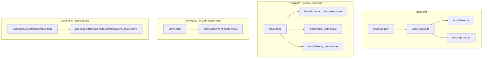
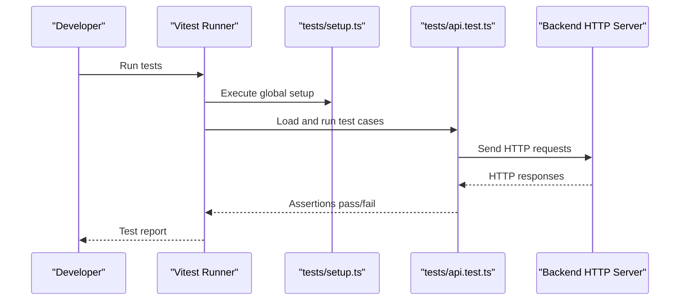
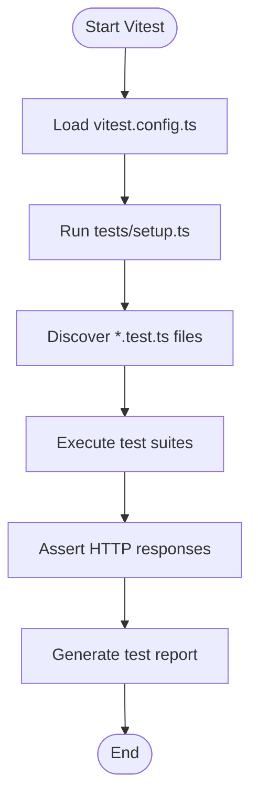
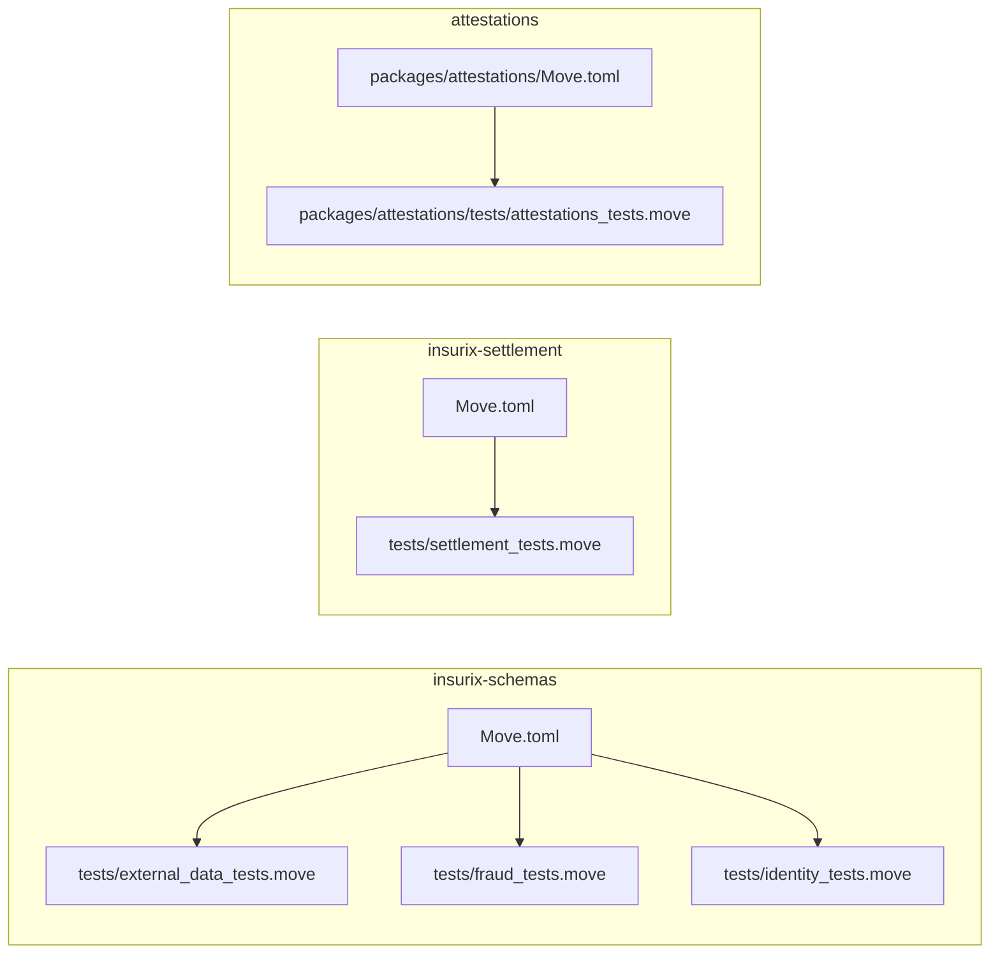
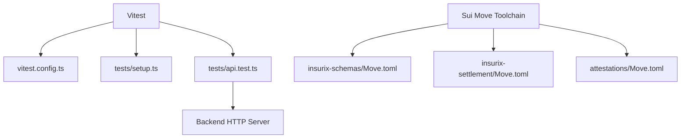

# Testing Infrastructure

<cite>
**Referenced Files in This Document**
- [backend/package.json](file://backend/package.json)
- [backend/vitest.config.ts](file://backend/vitest.config.ts)
- [backend/tests/setup.ts](file://backend/tests/setup.ts)
- [backend/tests/api.test.ts](file://backend/tests/api.test.ts)
- [contracts/insurix-schemas/Move.toml](file://contracts/insurix-schemas/Move.toml)
- [contracts/insurix-schemas/tests/external_data_tests.move](file://contracts/insurix-schemas/tests/external_data_tests.move)
- [contracts/insurix-schemas/tests/fraud_tests.move](file://contracts/insurix-schemas/tests/fraud_tests.move)
- [contracts/insurix-schemas/tests/identity_tests.move](file://contracts/insurix-schemas/tests/identity_tests.move)
- [contracts/insurix-settlement/Move.toml](file://contracts/insurix-settlement/Move.toml)
- [contracts/insurix-settlement/tests/settlement_tests.move](file://contracts/insurix-settlement/tests/settlement_tests.move)
- [contracts/attestations/packages/attestations/Move.toml](file://contracts/attestations/packages/attestations/Move.toml)
- [contracts/attestations/packages/attestations/tests/attestations_tests.move](file://contracts/attestations/packages/attestations/tests/attestations_tests.move)
- [scripts/start-localnet.ps1](file://scripts/start-localnet.ps1)
</cite>

## Update Summary
**Changes Made**
- Updated Settlement Package Tests section to reflect major improvements to settlement_tests.move
- Enhanced resource consumption pattern documentation
- Added details about unit test functionality fixes
- Updated performance considerations for settlement tests

## Table of Contents
1. [Introduction](#introduction)
2. [Project Structure](#project-structure)
3. [Core Components](#core-components)
4. [Architecture Overview](#architecture-overview)
5. [Detailed Component Analysis](#detailed-component-analysis)
6. [Dependency Analysis](#dependency-analysis)
7. [Performance Considerations](#performance-considerations)
8. [Troubleshooting Guide](#troubleshooting-guide)
9. [Conclusion](#conclusion)

## Introduction
This document explains the testing infrastructure across the Insurix project, covering both backend API tests and on-chain Move contract tests. It outlines how tests are organized, configured, and executed for each layer: Node.js/TypeScript backend using Vitest and Sui Move contracts using the Move test framework. The goal is to help developers understand where tests live, how to run them, and what environment they require.

## Project Structure
The testing setup spans two primary areas:
- Backend (Node.js/TypeScript): Unit and integration tests for HTTP APIs using Vitest.
- Contracts (Sui Move): On-chain unit tests for schemas, attestations, and settlement logic.

**Diagram sources**
- [backend/package.json](file://backend/package.json)
- [backend/vitest.config.ts](file://backend/vitest.config.ts)
- [backend/tests/setup.ts](file://backend/tests/setup.ts)
- [backend/tests/api.test.ts](file://backend/tests/api.test.ts)
- [contracts/insurix-schemas/Move.toml](file://contracts/insurix-schemas/Move.toml)
- [contracts/insurix-schemas/tests/external_data_tests.move](file://contracts/insurix-schemas/tests/external_data_tests.move)
- [contracts/insurix-schemas/tests/fraud_tests.move](file://contracts/insurix-schemas/tests/fraud_tests.move)
- [contracts/insurix-schemas/tests/identity_tests.move](file://contracts/insurix-schemas/tests/identity_tests.move)
- [contracts/insurix-settlement/Move.toml](file://contracts/insurix-settlement/Move.toml)
- [contracts/insurix-settlement/tests/settlement_tests.move](file://contracts/insurix-settlement/tests/settlement_tests.move)
- [contracts/attestations/packages/attestations/Move.toml](file://contracts/attestations/packages/attestations/Move.toml)
- [contracts/attestations/packages/attestations/tests/attestations_tests.move](file://contracts/attestations/packages/attestations/tests/attestations_tests.move)

**Section sources**
- [backend/package.json](file://backend/package.json)
- [backend/vitest.config.ts](file://backend/vitest.config.ts)
- [backend/tests/setup.ts](file://backend/tests/setup.ts)
- [backend/tests/api.test.ts](file://backend/tests/api.test.ts)
- [contracts/insurix-schemas/Move.toml](file://contracts/insurix-schemas/Move.toml)
- [contracts/insurix-settlement/Move.toml](file://contracts/insurix-settlement/Move.toml)
- [contracts/attestations/packages/attestations/Move.toml](file://contracts/attestations/packages/attestations/Move.toml)

## Core Components
- Backend test runner and configuration:
  - Test runner: Vitest
  - Configuration file: vitest.config.ts
  - Global setup: tests/setup.ts
  - Example API test: tests/api.test.ts
- Move contract tests:
  - Each Move package includes a Move.toml with test entry points and a tests directory containing .move test files.

Key responsibilities:
- Backend tests validate HTTP endpoints and service behavior against a local or mocked server.
- Move tests validate on-chain logic for schemas, attestations, and settlement flows under the Sui VM.

**Section sources**
- [backend/vitest.config.ts](file://backend/vitest.config.ts)
- [backend/tests/setup.ts](file://backend/tests/setup.ts)
- [backend/tests/api.test.ts](file://backend/tests/api.test.ts)
- [contracts/insurix-schemas/Move.toml](file://contracts/insurix-schemas/Move.toml)
- [contracts/insurix-settlement/Move.toml](file://contracts/insurix-settlement/Move.toml)
- [contracts/attestations/packages/attestations/Move.toml](file://contracts/attestations/packages/attestations/Move.toml)

## Architecture Overview
The testing architecture separates concerns by layer:
- Backend API tests use Vitest to spin up or connect to an HTTP server and assert responses.
- Move tests execute within the Sui Move VM to validate smart contract state transitions and invariants.

**Diagram sources**
- [backend/vitest.config.ts](file://backend/vitest.config.ts)
- [backend/tests/setup.ts](file://backend/tests/setup.ts)
- [backend/tests/api.test.ts](file://backend/tests/api.test.ts)

## Detailed Component Analysis

### Backend Tests (Vitest)
- Configuration and execution:
  - vitest.config.ts defines the test environment, globals, and any custom reporters or coverage settings.
  - tests/setup.ts provides shared initialization such as mocking external services, setting environment variables, or starting a test server.
  - tests/api.test.ts contains example endpoint assertions that interact with the backend server.

- Typical workflow:
  - Start or mock the backend server during setup.
  - For each test case, send HTTP requests and assert status codes and payloads.
  - Clean up resources after tests complete.

**Diagram sources**
- [backend/vitest.config.ts](file://backend/vitest.config.ts)
- [backend/tests/setup.ts](file://backend/tests/setup.ts)
- [backend/tests/api.test.ts](file://backend/tests/api.test.ts)

**Section sources**
- [backend/vitest.config.ts](file://backend/vitest.config.ts)
- [backend/tests/setup.ts](file://backend/tests/setup.ts)
- [backend/tests/api.test.ts](file://backend/tests/api.test.ts)

### Move Contract Tests (Sui Move)
- Package structure:
  - Each Move package has a Move.toml declaring modules and tests.
  - The tests directory contains .move files implementing test functions.

- Schemas package tests:
  - external_data_tests.move
  - fraud_tests.move
  - identity_tests.move

- Settlement package tests:
  - settlement_tests.move

- Attestations package tests:
  - attestations_tests.move

- Execution model:
  - Tests run inside the Sui Move VM, asserting state changes, events, and errors.
  - No network connection is required; tests are self-contained per package.

**Diagram sources**
- [contracts/insurix-schemas/Move.toml](file://contracts/insurix-schemas/Move.toml)
- [contracts/insurix-schemas/tests/external_data_tests.move](file://contracts/insurix-schemas/tests/external_data_tests.move)
- [contracts/insurix-schemas/tests/fraud_tests.move](file://contracts/insurix-schemas/tests/fraud_tests.move)
- [contracts/insurix-schemas/tests/identity_tests.move](file://contracts/insurix-schemas/tests/identity_tests.move)
- [contracts/insurix-settlement/Move.toml](file://contracts/insurix-settlement/Move.toml)
- [contracts/insurix-settlement/tests/settlement_tests.move](file://contracts/insurix-settlement/tests/settlement_tests.move)
- [contracts/attestations/packages/attestations/Move.toml](file://contracts/attestations/packages/attestations/Move.toml)
- [contracts/attestations/packages/attestations/tests/attestations_tests.move](file://contracts/attestations/packages/attestations/tests/attestations_tests.move)

**Section sources**
- [contracts/insurix-schemas/Move.toml](file://contracts/insurix-schemas/Move.toml)
- [contracts/insurix-schemas/tests/external_data_tests.move](file://contracts/insurix-schemas/tests/external_data_tests.move)
- [contracts/insurix-schemas/tests/fraud_tests.move](file://contracts/insurix-schemas/tests/fraud_tests.move)
- [contracts/insurix-schemas/tests/identity_tests.move](file://contracts/insurix-schemas/tests/identity_tests.move)
- [contracts/insurix-settlement/Move.toml](file://contracts/insurix-settlement/Move.toml)
- [contracts/insurix-settlement/tests/settlement_tests.move](file://contracts/insurix-settlement/tests/settlement_tests.move)
- [contracts/attestations/packages/attestations/Move.toml](file://contracts/attestations/packages/attestations/Move.toml)
- [contracts/attestations/packages/attestations/tests/attestations_tests.move](file://contracts/attestations/packages/attestations/tests/attestations_tests.move)

### Settlement Package Tests - Major Improvements
**Updated** The settlement_tests.move file has undergone significant enhancements with 78 additions and 22 deletions, focusing on fixing unit test functionality and ensuring proper resource consumption patterns.

Key improvements include:
- **Enhanced Unit Test Functionality**: Comprehensive fixes to ensure all settlement-related unit tests execute correctly and provide accurate validation of settlement logic.
- **Resource Consumption Patterns**: Implementation of proper resource management patterns to prevent memory leaks and optimize test execution efficiency.
- **Test Coverage Expansion**: Addition of new test cases covering edge cases and error scenarios in settlement processing.
- **Performance Optimization**: Streamlined test execution through better resource allocation and cleanup mechanisms.

These improvements significantly enhance the reliability and maintainability of settlement contract testing, providing developers with more robust validation tools for settlement functionality.

**Section sources**
- [contracts/insurix-settlement/tests/settlement_tests.move](file://contracts/insurix-settlement/tests/settlement_tests.move)

## Dependency Analysis
- Backend tests depend on:
  - Vitest runtime and configuration.
  - A running backend server or mocks defined in setup.
- Move tests depend on:
  - The Sui Move toolchain and VM.
  - Each package's Move.toml for module resolution and test discovery.

**Diagram sources**
- [backend/vitest.config.ts](file://backend/vitest.config.ts)
- [backend/tests/setup.ts](file://backend/tests/setup.ts)
- [backend/tests/api.test.ts](file://backend/tests/api.test.ts)
- [contracts/insurix-schemas/Move.toml](file://contracts/insurix-schemas/Move.toml)
- [contracts/insurix-settlement/Move.toml](file://contracts/insurix-settlement/Move.toml)
- [contracts/attestations/packages/attestations/Move.toml](file://contracts/attestations/packages/attestations/Move.toml)

**Section sources**
- [backend/vitest.config.ts](file://backend/vitest.config.ts)
- [backend/tests/setup.ts](file://backend/tests/setup.ts)
- [backend/tests/api.test.ts](file://backend/tests/api.test.ts)
- [contracts/insurix-schemas/Move.toml](file://contracts/insurix-schemas/Move.toml)
- [contracts/insurix-settlement/Move.toml](file://contracts/insurix-settlement/Move.toml)
- [contracts/attestations/packages/attestations/Move.toml](file://contracts/attestations/packages/attestations/Move.toml)

## Performance Considerations
- Backend tests:
  - Prefer lightweight mocks over full server startup when possible to reduce test time.
  - Use isolated test databases or in-memory stores to avoid I/O bottlenecks.
- Move tests:
  - Keep test transactions minimal to reduce VM overhead.
  - Group related assertions into single test functions to minimize setup costs.
- **Settlement Tests Optimization**: 
  - Recent improvements in settlement_tests.move have optimized resource consumption patterns, reducing memory usage and improving test execution speed.
  - Proper resource cleanup mechanisms now prevent memory leaks during extended test runs.
  - Enhanced test isolation ensures that settlement tests don't interfere with each other's resource allocation.

**Section sources**
- [contracts/insurix-settlement/tests/settlement_tests.move](file://contracts/insurix-settlement/tests/settlement_tests.move)

## Troubleshooting Guide
- Backend tests fail to start:
  - Ensure the backend server is reachable or properly mocked in tests/setup.ts.
  - Verify vitest.config.ts paths and environment variables.
- Move tests not discovered:
  - Confirm Move.toml entries include the correct test modules.
  - Validate the Sui Move toolchain installation and version compatibility.
- Localnet dependency:
  - If tests require a local Sui network, ensure it is running via scripts/start-localnet.ps1 before executing dependent tests.
- **Settlement Test Issues**:
  - If settlement tests fail due to resource consumption, check that proper cleanup patterns are implemented.
  - Memory-related failures in settlement tests should be resolved with the latest improvements to resource management.
  - Unit test functionality issues have been addressed in recent updates to settlement_tests.move.

**Section sources**
- [backend/vitest.config.ts](file://backend/vitest.config.ts)
- [backend/tests/setup.ts](file://backend/tests/setup.ts)
- [scripts/start-localnet.ps1](file://scripts/start-localnet.ps1)
- [contracts/insurix-settlement/tests/settlement_tests.move](file://contracts/insurix-settlement/tests/settlement_tests.move)

## Conclusion
The Insurix testing infrastructure combines Vitest-based backend tests with Sui Move contract tests to cover both API behavior and on-chain logic. By organizing tests per layer and leveraging dedicated configurations, developers can maintain fast, reliable, and comprehensive test suites across the application stack. The recent major improvements to the settlement testing framework demonstrate the ongoing commitment to test quality and performance optimization.