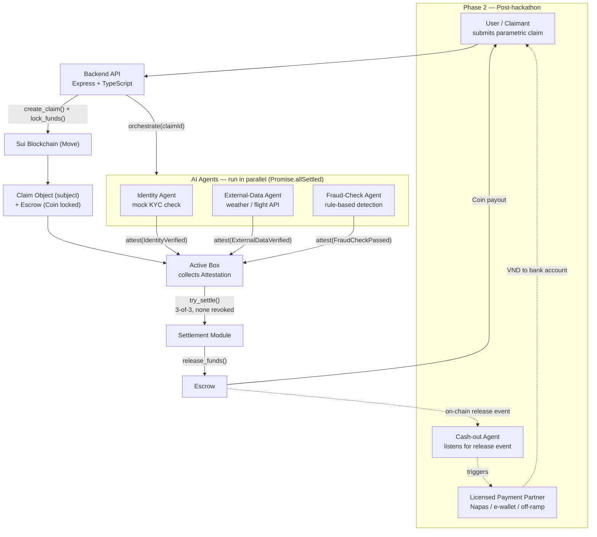

# Insurix

> Parametric insurance claims automation on Sui blockchain with AI-powered verification and on-chain attestations

[](https://sui.io)
[](https://nextjs.org)
[](https://www.typescriptlang.org)
[](https://expressjs.com)
[](#license)

---

## Overview

**Insurix** automates the slowest, most expensive part of insurance — the claims and disbursement process — by replacing manual KYC, document verification, and fraud checks with three parallel AI agents that issue **typed on-chain attestations** via the [`MystenLabs/attestations`](https://github.com/MystenLabs/attestations) framework on Sui.

**Key innovation:** parametric triggers + AI agents + Sui attestations. When a claim is submitted, three independent agents (Identity, External-Data, Fraud-Check) run in parallel, each verifying one aspect and issuing a cryptographically signed attestation on-chain. Once all three pass, a Move smart contract automatically releases escrowed funds to the claimant — no manual approval, no intermediaries, fully auditable on Sui Explorer.

> **PoC scope:** Payouts are crypto-native (`Coin<SUI>` on testnet). Fiat off-ramp (VND bank transfer) is a Phase 2 concern handled by a separate Cash-out Agent — see [Design Doc §4.5](docs/design/insurix-ai-workflow.md#45-giải-ngân-crypto-trong-poc-cash-bridge-ở-phase-2--payout-crypto-in-the-poc-cash-bridge-in-phase-2).

---

## Architecture



**How it works:**

1. User submits a parametric claim (e.g., flight-delay) via the frontend
2. Backend creates an on-chain `Claim` object and locks `Coin<SUI>` in an `Escrow`
3. Three AI agents run in parallel — each holds a typed `Permit<T>` that authorizes it to issue exactly one attestation type
4. Each agent calls `attest()` to issue its attestation into the Claim's active box
5. When all 3 attestations are present (and none revoked), `try_settle()` releases the escrow to the claimant
6. **Phase 2:** A Cash-out Agent listens for the on-chain release event and calls a licensed payment partner to move VND into the customer's bank account

---

## Tech Stack

| Layer | Technology |
|---|---|
| Smart Contracts | Sui Move (edition 2024) + [MystenLabs/attestations](https://github.com/MystenLabs/attestations) |
| Backend | Node.js, Express 4, TypeScript 5, `@mysten/sui` SDK, Axios, CORS, dotenv |
| Frontend | Next.js 16 (App Router), React 19, TypeScript 5, Tailwind CSS v4 |
| 3D & Animation | Three.js, `@react-three/fiber`, `@react-three/drei`, GSAP, Framer Motion, Lenis |
| Wallet | `@mysten/dapp-kit`, `@mysten/sui` v2 |
| AI Agents | TypeScript — mock KYC, real weather/flight APIs (OpenWeatherMap, AviationStack), rule-based fraud detection |
| Testing | Vitest (backend), `sui move test` (contracts) |

---

## Monorepo Structure

```
insurix/
├── contracts/
│   ├── attestations/           # MystenLabs/attestations (git submodule)
│   ├── insurix-schemas/        # Identity, ExternalData, FraudCheck schemas + Move tests
│   └── insurix-settlement/     # Claim, Escrow, Settlement logic + Move tests
├── backend/
│   ├── src/
│   │   ├── agents/             # identity.ts, external-data.ts, fraud-check.ts
│   │   ├── config/             # sui-client.ts, keypairs.ts
│   │   ├── middleware/         # auth.ts, error-handler.ts
│   │   ├── routes/             # claims.ts, admin.ts
│   │   ├── services/           # attestation.service.ts, claim.service.ts, orchestrator.ts
│   │   └── index.ts            # Express app entry point
│   └── tests/                  # Vitest integration tests
├── frontend/
│   └── src/
│       ├── app/
│       │   ├── (landing)/       # Three.js hero, features, how-it-works, FAQ, CTA
│       │   ├── (app)/          # App shell with wallet provider + React Query
│       │   ├── claims/         # Claim submission form, list, detail with attestation polling
│       │   └── admin/          # Admin dashboard, claim detail, attestation management
│       ├── components/         # WalletConnect, SmoothScroll
│       └── lib/                # api-client.ts, sui-client.ts
├── scripts/                    # PowerShell setup scripts
│   ├── dev.ps1                 # Start everything (localnet + backend + frontend)
│   ├── start-localnet.ps1      # Sui localnet + contract deployment
│   ├── start-backend.ps1       # Express API on :3001
│   ├── start-frontend.ps1      # Next.js on :3000
│   └── seed-demo.ps1           # Seed a demo flight-delay claim
└── docs/
    ├── design/                 # AI workflow & attestation design doc (bilingual VI/EN)
    ├── implementation/         # Story backlog with dependency graph
    └── demo/                   # Step-by-step demo walkthrough
```

---

## Prerequisites

- **Node.js** 20+ — [download](https://nodejs.org/)
- **pnpm** 9+ — `npm install -g pnpm`
- **Sui CLI** — for localnet and contract deployment ([install guide](https://docs.sui.io/guides/developer/getting-started/sui-install))
- **PowerShell** 5.1+ (Windows) — comes pre-installed on Windows 10+
- **Git** — for cloning with submodules

---

## Getting Started

### Quick Start (all-in-one)

```powershell
# Clone with submodules (includes MystenLabs/attestations)
git clone --recurse-submodules <repo-url>
cd insurix

# Install dependencies
pnpm install

# Copy environment config
Copy-Item .env.example .env
# Edit .env with your Sui network config, API keys, and keypairs

# Start everything (localnet + backend + frontend)
.\scripts\dev.ps1
```

### Start Services Individually

```powershell
.\scripts\start-localnet.ps1   # Start Sui localnet + deploy contracts
.\scripts\start-backend.ps1    # Start Express API on http://localhost:3001
.\scripts\start-frontend.ps1   # Start Next.js on http://localhost:3000
```

### Seed Demo Data

```powershell
.\scripts\seed-demo.ps1        # Create a demo flight-delay claim (VN123, 3h delay, 1 SUI)
```

### Environment Variables

Key variables to configure in `.env` (see [`.env.example`](.env.example) for the full list):

| Variable | Description |
|---|---|
| `SUI_NETWORK` | `localnet` or `testnet` |
| `SUI_RPC_URL` | Sui RPC endpoint |
| `SCHEMAS_PKG_ID` | Published `insurix-schemas` package ID |
| `SETTLEMENT_PKG_ID` | Published `insurix-settlement` package ID |
| `REGISTRY_ID` | Attestation Registry shared object ID |
| `IDENTITY_AGENT_KEY` | Ed25519 secret key for Identity Agent |
| `EXTERNAL_DATA_AGENT_KEY` | Ed25519 secret key for External-Data Agent |
| `FRAUD_AGENT_KEY` | Ed25519 secret key for Fraud-Check Agent |
| `ADMIN_API_KEY` | Admin panel API key |
| `OPENWEATHERMAP_API_KEY` | OpenWeatherMap API key (weather claims) |
| `AVIATIONSTACK_API_KEY` | AviationStack API key (flight claims) |

---

## API Reference

### Claims API

| Method | Endpoint | Description |
|---|---|---|
| `POST` | `/api/claims` | Create a new claim (creates on-chain Claim + locks escrow + triggers agents) |
| `GET` | `/api/claims?wallet=0x...` | List claims for a wallet address |
| `GET` | `/api/claims/:id` | Get claim details + attestation status for each schema |
| `POST` | `/api/claims/:id/settle` | Settle a claim on-chain (calls `try_settle`) |
| `GET` | `/api/health` | Health check endpoint |

### Admin API (requires API key)

| Method | Endpoint | Description |
|---|---|---|
| `GET` | `/api/admin/stats` | Platform statistics (total claims, settled, rejected, pending) |
| `POST` | `/api/admin/claims/:id/revoke` | Revoke an attestation by claim ID and schema type |

Admin routes require an `x-api-key` header matching `ADMIN_API_KEY`.

---

## Demo Flow

> Full step-by-step guide: [docs/demo/walkthrough.md](docs/demo/walkthrough.md)

1. Open **http://localhost:3000** — landing page with 3D animation and smooth scroll
2. Click **Connect Wallet** — connect your Sui Wallet
3. Navigate to **/claims** → click **New Claim** — create a flight-delay claim
4. Watch AI agents verify in real-time — attestation cards update as each agent issues its on-chain attestation
5. Click **Settle Claim** when all 3 attestations pass — escrow releases funds to your wallet
6. Visit **/admin** — admin panel with claim filters, attestation management, and platform stats (API key required)

---

## Project Status

| Metric | Value |
|---|---|
| Total stories | 50 |
| PoC stories complete | 43 / 50 |
| Phase 2 (Cash-out Agent) | Roadmap defined — not yet implemented |
| Smart contracts | 8 / 9 Move stories complete (Phase 2 schema pending) |
| Backend | 10 / 11 stories complete (Cash-out Agent pending) |
| Frontend | 22 / 22 PoC stories complete |
| Admin panel | 4 / 4 stories complete |
| DevOps & testing | 3 / 4 stories complete (E2E suite pending) |

> Full progress and dependency graph: [docs/implementation/backlog.md](docs/implementation/backlog.md)

---

## Development

### Commands

```powershell
pnpm run dev           # Start backend + frontend concurrently
pnpm run dev:backend    # Start backend only
pnpm run dev:frontend   # Start frontend only
pnpm run build:backend   # Build backend (TypeScript → dist/)
pnpm run build:frontend  # Build frontend (Next.js production build)
pnpm run test           # Run tests across all packages
pnpm run lint           # Lint all packages
```

### Smart Contracts

```powershell
# Build all Move packages
sui move build --path contracts/insurix-schemas
sui move build --path contracts/insurix-settlement

# Run Move unit tests
sui move test --path contracts/insurix-schemas
sui move test --path contracts/insurix-settlement
```

---

## Documentation

| Document | Description |
|---|---|
| [AI Workflow Design](docs/design/insurix-ai-workflow.md) | Bilingual (VI/EN) design doc — attestation model, architecture, processing flow, Phase 2 cash-out |
| [Implementation Backlog](docs/implementation/backlog.md) | 50 stories across 7 epics with full dependency graph and wave progression |
| [Demo Walkthrough](docs/demo/walkthrough.md) | Step-by-step guide for hackathon judges |

---

## License & Credits

**License:** MIT

**Built for Sui Hackathon**

This project uses:

- [MystenLabs/attestations](https://github.com/MystenLabs/attestations) — A Move primitive for typed, on-chain attestations
- [Sui Blockchain](https://sui.io) — L1 blockchain with Move smart contracts
- [OpenWeatherMap](https://openweathermap.org) — Weather data for parametric triggers
- [AviationStack](https://aviationstack.com) — Flight status data for delay claims

### Team

Insurix — parametric insurance on Sui with AI-powered verification and on-chain attestations.
