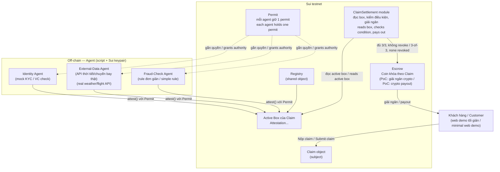
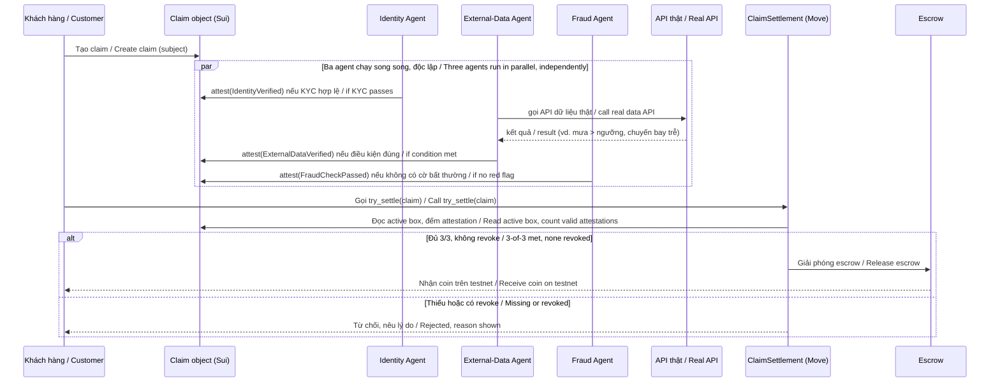
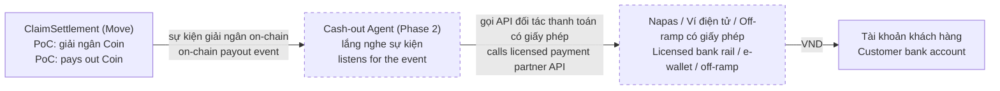

# Insurix — AI Agent Workflow & Sui Attestation Design
## Tự động hóa xác thực & giải ngân bảo hiểm bằng AI Agent + Sui Attestation

*Bilingual design document (VI/EN) — mỗi mục có cả tiếng Việt và tiếng Anh, đặt cạnh nhau. / Every section carries both Vietnamese and English, side by side.*

> **VI:** Bản thiết kế dùng [`MystenLabs/attestations`](https://github.com/MystenLabs/attestations) — một Move primitive nhẹ cho attestation on-chain có kiểu (typed), phù hợp build trong một hackathon 24h. Không dùng Nautilus (framework TEE/AWS Nitro Enclave) vì quá nặng hạ tầng cho scope này.
>
> **EN:** This design uses [`MystenLabs/attestations`](https://github.com/MystenLabs/attestations) — a lightweight Move primitive for typed on-chain attestations, realistic to build within a 24-hour hackathon. Nautilus (the TEE / AWS Nitro Enclave framework) is intentionally not used — too much infrastructure for this scope.

---

## 1. Bối cảnh / Context

**VI:** Phần lớn công ty bảo hiểm đã số hóa khâu bán hàng: mua bảo hiểm online, ký điện tử, thanh toán phí gần như tức thời. Nhưng khâu giải quyết quyền lợi (claims) và giải ngân (payout) — nơi khách hàng thực sự cần tiền — vẫn vận hành gần như thủ công, xuyên suốt nhiều hệ thống rời rạc: hồ sơ giấy/PDF, KYC lặp lại ở từng bước, đối soát bên thứ ba qua email, phê duyệt nội bộ nhiều cấp, giải ngân qua ngân hàng truyền thống (T+3~T+7).

Nghịch lý: bảo hiểm bán "lời hứa trả tiền khi rủi ro xảy ra", nhưng chính khâu hiện thực hóa lời hứa đó lại là khâu chậm, đắt và thiếu minh bạch nhất.

**EN:** Most insurers have digitized the *sales* side: buying a policy online, e-signing, and paying premiums happen almost instantly. But the *claims and disbursement* side — the moment a customer actually needs the money — still runs almost entirely on manual work across disconnected systems: paper/PDF files, KYC repeated at every step, email-based reconciliation with third parties, multi-level internal approvals, and payouts through traditional banking rails (T+3 to T+7).

The paradox: insurance sells "a promise to pay when risk happens," yet the step that fulfills that promise is the slowest, most expensive, and least transparent part of the whole experience.

---

## 2. Luồng giải ngân hiện tại / Current (as-is) disbursement flow

```mermaid
flowchart LR
    A["Khách hàng nộp yêu cầu bồi thường\nCustomer files a claim"] --> B["Nhập liệu thủ công\nManual data entry"]
    B --> C["KYC lặp lại\nRepeated KYC"]
    C --> D["Giám định hiện trường\nOn-site adjuster visit"]
    D --> E["Đối soát bên thứ 3\n3rd-party reconciliation"]
    E --> F["Kiểm tra gian lận thủ công\nManual fraud check"]
    F --> G["Phê duyệt nội bộ nhiều cấp\nMulti-level internal approval"]
    G --> H["Lập lệnh chi\nPayment order"]
    H --> I["Chuyển khoản ngân hàng T+3~T+7\nBank transfer T+3~T+7"]
    I --> J["Khách hàng nhận tiền\nCustomer receives payout"]

    style C fill:#3a2a1a,stroke:#c97a2b,color:#fff
    style D fill:#3a2a1a,stroke:#c97a2b,color:#fff
    style E fill:#3a2a1a,stroke:#c97a2b,color:#fff
    style F fill:#3a2a1a,stroke:#c97a2b,color:#fff
    style G fill:#3a2a1a,stroke:#c97a2b,color:#fff
```

**VI:** Các bước tô màu là nơi thời gian và chi phí "rò rỉ" nhiều nhất — mỗi bước là một điểm chờ người, không phải điểm chờ dữ liệu.

**EN:** The highlighted steps are where most time and cost leak out — each one is a wait-for-a-human bottleneck, not a wait-for-data bottleneck.

---

## 3. Mô hình hóa các điểm nghẽn / Pain-point modeling

| # | Điểm nghẽn / Pain point | Actor bị ảnh hưởng / Affected actor | Nguyên nhân gốc / Root cause | Hệ quả / Consequence |
|---|---|---|---|---|
| P1 | **KYC/xác thực lặp lại** *Repeated identity/KYC checks* | Khách hàng, vận hành *Customer, operations* | Danh tính không mang theo được giữa các hệ thống *No portable verified identity across systems* | Mất thời gian, chi phí KYC nhân nhiều lần *Wasted time, KYC cost multiplied per person* |
| P2 | **Thu thập & xác minh chứng từ** *Document collection & verification* | Khách hàng, giám định viên *Customer, adjuster* | Chứng từ là ảnh/PDF không kiểm chứng được nguồn gốc *Documents are unverifiable photos/PDFs* | Chậm hàng tuần, dễ bị làm giả *Weeks of delay, easy to forge* |
| P3 | **Giám định hiện trường** *On-site adjuster visits* | Bảo hiểm, khách hàng *Insurer, customer* | Thiếu dữ liệu khách quan real-time tại thời điểm sự kiện *No objective real-time data at the moment of the event* | Chi phí đi lại, chờ lịch, rủi ro thiên vị *Travel cost, scheduling delay, bias risk* |
| P4 | **Đối soát bên thứ 3** *Third-party reconciliation* | Bộ phận claims *Claims team* | Không có kênh dữ liệu tin cậy chung *No shared trusted data channel* | Vòng lặp hỏi–đáp kéo dài nhiều tuần *Weeks of back-and-forth* |
| P5 | **Phát hiện gian lận thủ công** *Manual fraud detection* | Underwriting/SIU | Thiếu dữ liệu tổng hợp real-time liên công ty *No real-time cross-company aggregated data* | Chi phí điều tra cao, hồ sơ hợp lệ bị trì hoãn lây *High investigation cost, valid claims delayed too* |
| P6 | **Phê duyệt nội bộ đa cấp** *Multi-level internal approval* | Vận hành *Operations* | Không có cơ chế "niềm tin từng phần" *No partial-trust mechanism* | Claim nhỏ, rõ ràng vẫn chậm như claim lớn *Small, clear claims move as slowly as large ones* |
| P7 | **Giải ngân qua ngân hàng truyền thống** *Payout via traditional banking* | Khách hàng *Customer* | Độ trễ bù trừ liên ngân hàng *Interbank settlement latency* | T+3~T+7, phí trung gian *T+3 to T+7, intermediary fees* |
| P8 | **Tranh chấp/khiếu nại kéo dài** *Prolonged disputes* | Khách hàng, pháp lý *Customer, legal* | Không có nhật ký minh bạch dùng chung *No shared transparent log* | Khiếu kiện kéo dài, mất niềm tin *Long litigation, eroded trust* |
| P9 | **Tái bảo hiểm & đối soát liên công ty** *Reinsurance & inter-company reconciliation* | Bảo hiểm, reinsurer *Insurer, reinsurer* | Đối soát bằng file rời rạc, không sổ cái chung *Reconciliation via scattered files, no shared ledger* | Chậm quyết toán, sai lệch số liệu *Slow settlement, data mismatches* |
| P10 | **Thiếu minh bạch trạng thái** *Lack of status transparency* | Khách hàng *Customer* | Trạng thái claim chỉ nằm trong hệ thống nội bộ *Claim status lives only in internal systems* | Tăng cuộc gọi CSKH, trải nghiệm kém *More support calls, poor experience* |

**Ba nguyên nhân gốc chung / Three shared root causes:**

1. **VI:** Không có "sự thật có thể kiểm chứng" tại nguồn — dữ liệu sự kiện được số hóa *sau* khi qua tay người, nên bảo hiểm phải tự xác minh lại từ đầu.
   **EN:** No verifiable ground truth at the source — event data is digitized *after* passing through human hands, so the insurer must re-verify everything from scratch.
2. **VI:** Danh tính và niềm tin không mang theo được — mỗi bên tự xây "đảo niềm tin" riêng, không ai tin thẳng kết quả xác thực của bên khác.
   **EN:** Identity and trust are not portable — every party builds its own "trust island," and no one accepts another party's verification result at face value.
3. **VI:** Quy trình tuần tự do người thực hiện, không để lại bằng chứng minh bạch, kiểm toán được giữa các bước.
   **EN:** The process is a sequential, human-run chain that leaves no transparent, auditable evidence between steps.

---

## 4. Giải pháp PoC / PoC solution — Insurix on `MystenLabs/attestations`

### 4.1 Vì sao là `attestations`, không phải Nautilus / Why `attestations`, not Nautilus

**VI:** [`MystenLabs/attestations`](https://github.com/MystenLabs/attestations) tự mô tả là *"a Move primitive for typed, on-chain attestations"* — một PoC cố tình giữ tối giản: không TEE, không enclave, không hạ tầng AWS Nitro. Mô hình dữ liệu gồm bốn khối:

- **`Registry`** — shared object gốc, sinh địa chỉ box theo từng subject.
- **`Box`** — hai box dẫn xuất cho mỗi subject: *active* (còn hiệu lực) và *revoked* (đã thu hồi).
- **`Attestation<T>`** — bản ghi có kiểu, gắn với một schema `T` cụ thể (vd. `IdentityVerified`, `WeatherThresholdMet`).
- **`Permit<T>`** — capability đảm bảo chỉ package định nghĩa `T` mới được mint `Attestation<T>` — danh tính "ai được phép xác nhận điều gì" gắn cứng ở compile-time.

Thao tác chính: `attest()` (phát hành), `revoke()` (thu hồi), `register_display()` (gắn quy ước như `expires_at`). Không cần enclave, không cần reproducible build — đúng độ nhẹ để clone repo và có demo chạy trên localnet trong vài giờ.

**Đánh đổi phải nói rõ:** vì không có TEE, `attestations` chỉ chứng minh *"agent X (một danh tính được định danh, giữ Permit<T>) đã ký khẳng định Y on-chain, có thể thu hồi, có thể kiểm toán"* — chứ không chứng minh *"quá trình tính toán của agent X không bị giả mạo"* như Nautilus làm được qua attestation phần cứng. Đây là mô hình **issuer-attested** (giống verifiable credentials truyền thống), không phải **hardware-verified computation**.

**EN:** [`MystenLabs/attestations`](https://github.com/MystenLabs/attestations) describes itself as *"a Move primitive for typed, on-chain attestations"* — a PoC deliberately kept minimal: no TEE, no enclave, no AWS Nitro infrastructure. The data model has four building blocks:

- **`Registry`** — the root shared object that derives box addresses per subject.
- **`Box`** — two derived boxes per subject: *active* (currently valid) and *revoked*.
- **`Attestation<T>`** — a typed record tied to a specific schema `T` (e.g. `IdentityVerified`, `WeatherThresholdMet`).
- **`Permit<T>`** — a capability that guarantees only the package that defines `T` can mint `Attestation<T>` — "who may attest to what" is bound at compile time, not stored as a spoofable data field.

Core operations: `attest()` (issue), `revoke()` (withdraw), `register_display()` (attach conventions like `expires_at`). No enclave, no reproducible build requirement — light enough to clone and get a working localnet demo running in a few hours.

**The trade-off to be explicit about:** without a TEE, `attestations` only proves *"agent X — an identified party holding `Permit<T>` — signed claim Y on-chain, revocably and auditably"* — it does **not** prove *"agent X's internal computation was tamper-proof,"* the way Nautilus does via hardware attestation. This is an **issuer-attested** trust model (like traditional verifiable credentials), not **hardware-verified computation**.

### 4.2 Ánh xạ mô hình attestation vào nghiệp vụ bảo hiểm / Mapping the attestation model to insurance

| Khái niệm trong `attestations` / Concept in `attestations` | Vai trò trong Insurix / Role in Insurix |
|---|---|
| **Subject** (object có ID / object with an ID) | `Claim` object — một yêu cầu bồi thường cụ thể *a specific claim* |
| **Schema `T`** | Loại kiểm tra / check type: `IdentityVerified`, `DocumentVerified`, `ExternalDataVerified` (vd. thời tiết/chuyến bay / e.g. weather, flight status), `FraudCheckPassed` |
| **Attester giữ `Permit<T>`** *Attester holding `Permit<T>`* | Một AI Agent (off-chain service giữ Sui keypair) được cấp quyền phát hành đúng loại attestation đó *an AI agent (off-chain service holding a Sui keypair) authorized to issue exactly that attestation type* |
| **Active box của Claim** *Claim's active box* | "Hồ sơ xác minh sống" — tập hợp mọi xác nhận còn hiệu lực, enumerate được qua indexer *a "living verification file" — the set of currently valid confirmations, enumerable via an indexer* |
| **Revoke** | Khi agent phát hiện sai sót/gian lận sau khi đã attest, có thể thu hồi *if an agent finds an error or fraud after attesting, it can withdraw the attestation* |

### 4.3 Kiến trúc PoC (scope 24h) / PoC architecture (24h scope)

### 4.4 Luồng xử lý / Processing flow

### 4.5 Giải ngân: crypto trong PoC, cash bridge ở Phase 2 / Payout: crypto in the PoC, cash bridge in Phase 2

> **Phase boundary — ranh giới giai đoạn / Phase boundary:**
> **VI:** Mọi thứ từ mục 4.1–4.4 thuộc phạm vi PoC (24h hackathon). Cash-out Agent, fiat bridge, VND payout ở bên dưới là Phase 2 — chỉ định nghĩa roadmap, chưa triển khai.
> **EN:** Everything in sections 4.1–4.4 is in PoC scope (24h hackathon). The Cash-out Agent, fiat bridge, and VND payout below are Phase 2 — roadmap only, not implemented.

**VI:** Quyết định thiết kế quan trọng cần nói rõ ngay từ đầu: **claimable package trong PoC là crypto, không phải cash.** `claim_settlement` chỉ giữ và trả `Coin<SUI>`/stablecoin testnet — đây là phần việc smart contract tự làm được ngay khi đủ attestation, không cần đối tác thanh toán hay giấy phép nào, và chứng minh trọn vẹn vòng lặp *attest → settle → payout*, kiểm tra được trực tiếp trên Sui Explorer.

Cash (VND vào tài khoản ngân hàng) là một lớp khác hẳn: cần đối tác thanh toán được cấp phép (napas, ví điện tử, cổng off-ramp), và khung pháp lý giải ngân bảo hiểm bằng crypto tại Việt Nam hiện chưa rõ ràng — không thể giải quyết trong 24h, và không nên giả vờ là đã giải quyết.

Đường đi hợp lý: giữ nguyên settlement logic on-chain bằng crypto — đó là phần "trustless" thật sự của hệ thống — rồi thêm một **Cash-out Agent** riêng ở Phase 2. Agent này chỉ lắng nghe sự kiện escrow đã giải ngân on-chain, rồi gọi API đối tác thanh toán được cấp phép để chuyển VND ra tài khoản khách hàng. Tách lớp này ra giúp phần lõi (attestation + settlement) không phụ thuộc giấy phép thanh toán, còn phần cash chỉ là một "adapter" có thể thay đổi theo từng thị trường/đối tác mà không đụng vào logic on-chain.

**EN:** An important design decision to state up front: **the claimable package in the PoC is crypto, not cash.** `claim_settlement` only holds and pays out `Coin<SUI>`/testnet stablecoin — this is the part a smart contract can do trustlessly the moment enough attestations exist, with no payment partner or license required, and it proves the full *attest → settle → payout* loop end to end, verifiable on Sui Explorer.

Cash (VND landing in a bank account) is an entirely different layer: it needs a licensed payment partner (Napas, e-wallets, a licensed off-ramp), and the legal framework for crypto-based insurance disbursement in Vietnam is not yet clear — not solvable in 24 hours, and not something to fake as solved.

The sensible path: keep the on-chain settlement logic crypto-native — that's the genuinely trustless part of the system — and add a separate **Cash-out Agent** in Phase 2. This agent only listens for the on-chain escrow-release event, then calls a licensed payment partner's API to move VND into the customer's bank account. Separating this layer keeps the core (attestation + settlement) free of payment licensing dependencies, while the cash side becomes a swappable "adapter" per market/partner that never touches the on-chain logic.

| Giai đoạn / Phase | Loại tài sản giải ngân / Payout asset | Cơ chế / Mechanism | Cần giấy phép? / License needed? |
|---|---|---|---|
| PoC (24h) | Crypto — `Coin<SUI>`/stablecoin testnet | Escrow on-chain, tự động, trustless *On-chain escrow, automatic, trustless* | Không / No |
| Phase 2 (sau hackathon / post-hackathon) | Cash — VND | Cash-out Agent gọi đối tác thanh toán sau khi bắt được sự kiện on-chain *Cash-out Agent calls a payment partner after picking up the on-chain event* | Có / Yes — cần đối tác được cấp phép *Yes — requires a licensed partner* |

---

## 5. So sánh trước / sau — Before / after comparison

| Tiêu chí / Criterion | Hiện tại / As-is | Insurix PoC |
|---|---|---|
| Thời gian xử lý claim parametric / Processing time for a parametric claim | Vài ngày–vài tuần / Days to weeks | Vài phút / A few minutes (giới hạn bởi thời gian gọi API + block / bounded by API call + block time) |
| Số lần KYC lặp lại / KYC repetitions | 2–3 lần / times | 1 lần → 1 attestation dùng lại được / once → one reusable attestation |
| Bằng chứng cho khách hàng / Evidence for the customer | Không có, phải hỏi CSKH / None, must call support | Attestation tra được on-chain (Sui Explorer) / On-chain, queryable via Sui Explorer |
| Đường đi của tiền / Money path | Ngân hàng trung gian, T+3~T+7 / Bank intermediaries, T+3 to T+7 | Escrow on-chain, giải ngân ngay khi đủ điều kiện / On-chain escrow, released as soon as conditions are met |
| Loại tài sản giải ngân / Payout asset type | VND qua ngân hàng / VND via bank | **PoC: crypto** (`Coin<SUI>`/stablecoin testnet); **Phase 2: VND** qua Cash-out Agent — xem mục 4.5 *PoC: crypto; Phase 2: VND via the Cash-out Agent — see section 4.5* |
| Vai trò con người / Human role | Xử lý mọi hồ sơ / Handles every case | Chỉ khi thiếu attestation/có revoke/ngoài phạm vi PoC / Only when an attestation is missing, revoked, or out of PoC scope |

---

## 6. Rủi ro & giới hạn — nói thật / Risks & limitations — kept honest

- **VI:** Đây là mô hình tin cậy "issuer-attested", không phải "verified computation". Một attestation chỉ nói lên "agent giữ Permit<T> này đã ký xác nhận", không chứng minh logic bên trong agent chạy đúng. Giảm thiểu: nhiều agent độc lập cùng phải attest (M-trên-N), cơ chế `revoke()` sẵn có, về sau có thể nâng một số agent nhạy cảm lên chạy trong TEE.
  **EN:** This is an "issuer-attested" trust model, not "verified computation." An attestation only says "the agent holding this `Permit<T>` signed a confirmation" — it does not prove the agent's internal logic ran correctly. Mitigation: require multiple independent agents to attest (M-of-N), use the built-in `revoke()` mechanism, and later move sensitive agents into a TEE.

- **VI:** Quản lý `Permit<T>`/khóa của agent là điểm sống còn — trong PoC mỗi agent giữ một keypair testnet; bản thật cần multisig/HSM.
  **EN:** Managing `Permit<T>`/agent keys is the critical point — in the PoC each agent holds a testnet keypair; a real deployment needs multisig/HSM.

- **VI:** `attestations` là PoC của chính Mysten Labs (`FUTURE-EXTENSIONS.md` liệt kê phần cố tình chưa làm, vd. expiration chỉ là quy ước Display chứ chưa enforce on-chain) — không dùng nguyên bản cho production.
  **EN:** `attestations` is Mysten Labs' own PoC (`FUTURE-EXTENSIONS.md` lists deliberately deferred parts, e.g. expiration is only a Display convention, not enforced on-chain) — do not use as-is in production.

- **VI:** External-Data Agent phụ thuộc nguồn dữ liệu thật có sẵn — trong 24h chỉ nên chọn nguồn có API công khai, miễn phí (thời tiết, lịch bay); dữ liệu bệnh viện/công an/garage tại Việt Nam chưa có API.
  **EN:** The External-Data Agent depends on real, available data sources — within 24h, stick to free public APIs (weather, flight status); hospital/police/garage data in Vietnam has no API yet.

- **VI:** Giải ngân bằng SUI/coin trên testnet là demo, không phải giải ngân VND thật — off-ramp và khung pháp lý nằm ngoài phạm vi PoC. Đây là lựa chọn thiết kế có chủ đích, không phải thiếu sót: xem mục 4.5 cho lý do và đường đi sang cash ở Phase 2 qua Cash-out Agent.
  **EN:** Payout in SUI/testnet coin is a demo, not a real VND disbursement — the fiat off-ramp and legal framework are out of PoC scope. This is a deliberate design choice, not an oversight: see section 4.5 for the reasoning and the Phase-2 path to cash via the Cash-out Agent.

- **VI:** Không thay thế con người cho claim phức tạp/tranh chấp — PoC chỉ nhắm claim parametric, nhị phân, dễ verify.
  **EN:** This does not replace humans for complex or disputed claims — the PoC only targets binary, easily verifiable parametric claims.

---

## 7. Kế hoạch hackathon 24h / 24-hour hackathon plan

**VI:** Chọn một sản phẩm bảo hiểm parametric đơn giản nhất để toàn bộ vòng lặp "attest → settle → payout" chạy thật, không vướng OCR/hồ sơ giấy: ví dụ **bảo hiểm trễ chuyến bay** hoặc **bảo hiểm mưa lớn nông nghiệp**.

**EN:** Pick the simplest possible parametric insurance product so the full "attest → settle → payout" loop runs for real, without OCR or paperwork: e.g. **flight-delay insurance** or **heavy-rain agricultural insurance**.

| Khung giờ / Time block | Việc làm / Task | Kết quả cần có / Expected outcome |
|---|---|---|
| 0–2h | Clone `MystenLabs/attestations`, chạy localnet, đọc `packages/attestations` + `examples/auditor` *Clone the repo, run localnet, read the core package + example* | Hiểu rõ `Registry/Box/Attestation<T>/Permit<T>`, demo gốc chạy được *Understand the primitives, original demo runs* |
| 2–6h | Viết package schema bảo hiểm: `Claim` object, 3 schema (`IdentityVerified`, `ExternalDataVerified`, `FraudCheckPassed`) + `Permit` cho từng schema *Write the insurance schema package: Claim object, 3 schemas, one Permit each* | Move package biên dịch, publish lên localnet/testnet *Package compiles and publishes* |
| 6–10h | Viết module `claim_settlement`: tạo claim + escrow, hàm `try_settle` đọc active box, giải phóng escrow nếu đủ điều kiện *Write the `claim_settlement` module: claim + escrow creation, `try_settle` reads the box and releases funds* | Gọi `try_settle` bằng tay và thấy coin chuyển *Manually call `try_settle` and see the coin move* |
| 10–16h | Viết 3 agent script (TS/Python + Sui SDK): Identity (mock), External-Data (API thật), Fraud (rule đơn giản) *Write 3 agent scripts: Identity (mock), External-Data (real API), Fraud (simple rule)* | 3 agent chạy độc lập, attestation xuất hiện trong active box (kiểm bằng Sui Explorer) *3 agents run independently, attestations show up in the active box* |
| 16–20h | Web/CLI demo tối giản: nộp claim → hiển thị trạng thái 3 attestation → nút "Settle" → hiển thị tx giải ngân *Minimal web/CLI demo: submit claim → show attestation status → "Settle" button → show payout tx* | Luồng end-to-end chạy trên testnet, không cần thao tác tay ở giữa *End-to-end flow works on testnet with no manual steps in between* |
| 20–24h | Chạy thử lại từ đầu, quay demo, chuẩn bị slide: vấn đề → giải pháp → demo trực tiếp *Re-run from scratch, record demo, prepare slides: problem → solution → live demo* | Bản demo ổn định, có kịch bản dự phòng nếu API bên ngoài lỗi *Stable demo with a fallback plan if the external API fails* |

**VI — Sau hackathon (ngoài scope 24h):** mở rộng sang claim có chứng từ (Document Agent + OCR), tích hợp đối tác dữ liệu thật (bệnh viện, garage), thêm **Cash-out Agent** làm off-ramp thanh toán VND (mục 4.5), cân nhắc nâng một số agent lên chạy trong TEE khi cần mức tin cậy cao hơn "issuer-attested".

**EN — After the hackathon (out of the 24h scope):** extend to document-based claims (Document Agent + OCR), integrate real data partners (hospitals, garages), add the **Cash-out Agent** as a VND payment off-ramp (section 4.5), and consider moving some agents into a TEE when a higher trust bar than "issuer-attested" is needed.

---

*Nguồn tham khảo kỹ thuật / Technical reference: [MystenLabs/attestations](https://github.com/MystenLabs/attestations) — "A Move primitive for typed, on-chain attestations" (PoC).*
