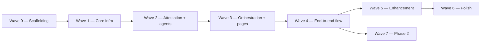
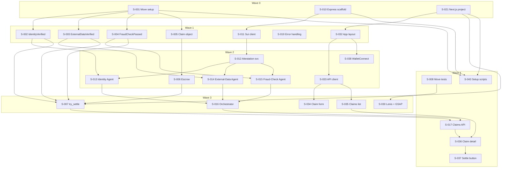
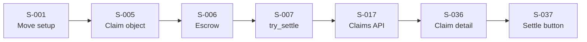
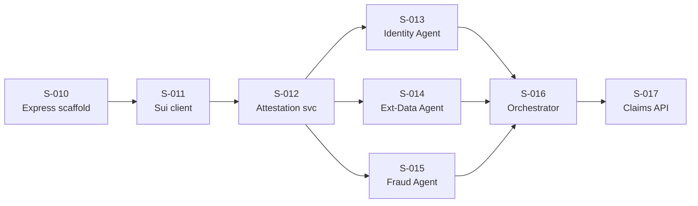
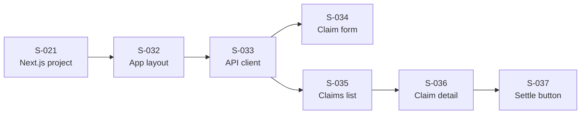
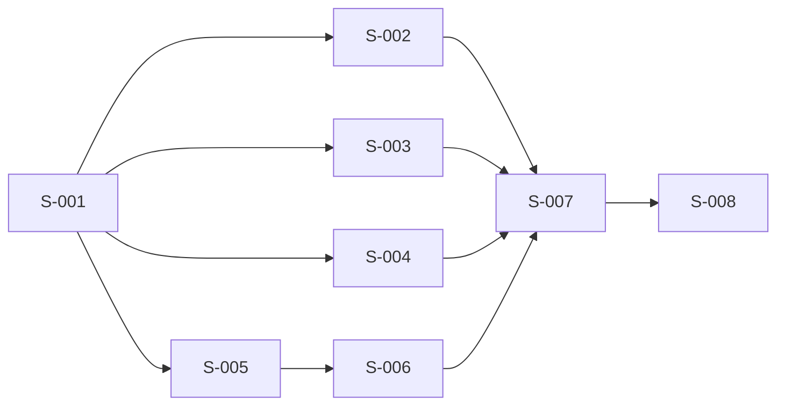
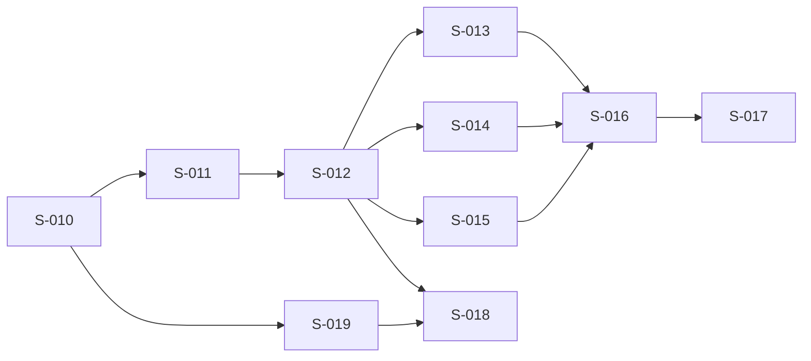
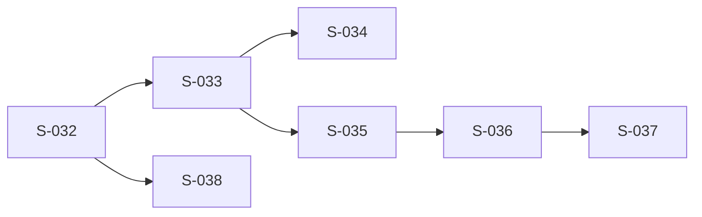
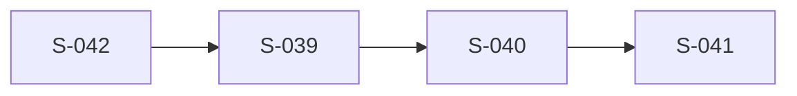
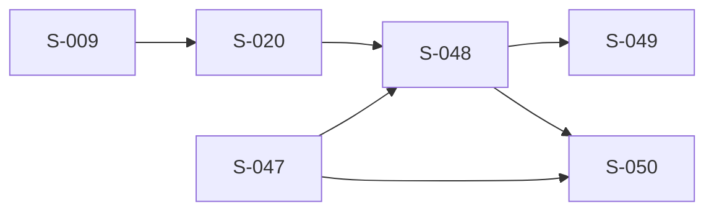

# Insurix — Implementation Backlog

> **Scope:** PoC (24-hour hackathon) + Phase 2 roadmap
> **Design doc:** [`docs/design/insurix-ai-workflow.md`](../design/insurix-ai-workflow.md)
> **Last updated:** 2026-08-02

---

## Backlog structure

This backlog is organized by **Phase** and **Power Lane** (priority tier). Each entry is a **Story** — an implementable unit of work tagged with its originating **Epic** (functional area).

| Field | Meaning |
|---|---|
| **ID** | Story identifier (`S-xxx`) |
| **Title** | Short description of the deliverable |
| **Epic** | Originating epic: **SC** = Smart Contracts, **BE** = Backend, **LP** = Landing Page, **AD** = App Dashboard, **AP** = Admin Panel, **DO** = DevOps & Testing, **CO** = Cash-out & Fiat Off-ramp |
| **Priority** | `P0` = must-have, `P1` = important, `P2` = nice-to-have |
| **Acceptance criteria** | Checklist of conditions that must be met |
| **Dependencies** | Other stories that must be completed first |

### Power Lanes

| Lane | Meaning | Scope |
|---|---|---|
| **Foundation** (P0) | Must-have — the PoC demo cannot function without this | PoC |
| **Enhancement** (P1) | Important — significantly improves the demo experience or completeness | PoC |
| **Polish** (P2) | Nice-to-have — polish and extras if time permits | PoC |
| **Phase 2** (P2) | Post-hackathon — fiat off-ramp and production hardening | Phase 2 |

---

## Story index

| ID | Title | Epic | Lane | Phase |
|---|---|---|---|---|
| S-001 | Set up Move project structure + vendor attestations | SC | Foundation | PoC |
| S-002 | Define IdentityVerified schema + admin cap + attest/revoke | SC | Foundation | PoC |
| S-003 | Define ExternalDataVerified schema | SC | Foundation | PoC |
| S-004 | Define FraudCheckPassed schema | SC | Foundation | PoC |
| S-005 | Implement Claim object + create_claim | SC | Foundation | PoC |
| S-006 | Implement Escrow with lock/release/reclaim | SC | Foundation | PoC |
| S-007 | Implement try_settle settlement logic | SC | Foundation | PoC |
| S-008 | Move unit tests for all contracts | SC | Foundation | PoC |
| S-009 | Define CashOutCompleted schema | CO | Phase 2 | Phase 2 |
| S-010 | Express + TypeScript project scaffolding | BE | Foundation | PoC |
| S-011 | Sui client config + keypair management | BE | Foundation | PoC |
| S-012 | Attestation service (derive box addresses, query active box) | BE | Foundation | PoC |
| S-013 | Identity Agent (mock KYC) | BE | Foundation | PoC |
| S-014 | External-Data Agent (weather/flight APIs + circuit breaker) | BE | Foundation | PoC |
| S-015 | Fraud-Check Agent (rule-based) | BE | Foundation | PoC |
| S-016 | Agent orchestrator (Promise.allSettled parallel) | BE | Foundation | PoC |
| S-017 | Claims API routes (POST, GET, GET :id, settle) | BE | Foundation | PoC |
| S-018 | Admin API routes (revoke, stats) | BE | Enhancement | PoC |
| S-019 | Error handling + auth middleware | BE | Foundation | PoC |
| S-020 | Cash-out Agent (event listener + fiat bridge) | CO | Phase 2 | Phase 2 |
| S-021 | Next.js 15 project with route groups (landing)/(app) | LP | Foundation | PoC |
| S-022 | Landing page layout + navigation + footer | LP | Enhancement | PoC |
| S-023 | Hero section with 3D react-three-fiber scene + GSAP text reveal | LP | Enhancement | PoC |
| S-024 | Features section with animated cards | LP | Enhancement | PoC |
| S-025 | How It Works section with 3D workflow visualization | LP | Enhancement | PoC |
| S-026 | Live Stats section | LP | Polish | PoC |
| S-027 | Interactive Demo section | LP | Polish | PoC |
| S-028 | FAQ section with accordion | LP | Polish | PoC |
| S-029 | CTA section with parallax | LP | Polish | PoC |
| S-030 | Lenis smooth scroll + GSAP ScrollTrigger integration | LP | Enhancement | PoC |
| S-031 | Performance optimization (AdaptiveDpr, lazy-load, dynamic imports) | LP | Enhancement | PoC |
| S-032 | App layout with Sui wallet provider + React Query | AD | Foundation | PoC |
| S-033 | API client + Sui client helpers | AD | Foundation | PoC |
| S-034 | Claim submission form page | AD | Foundation | PoC |
| S-035 | Claims list page | AD | Foundation | PoC |
| S-036 | Claim detail page with attestation status polling | AD | Foundation | PoC |
| S-037 | Settle button + settlement result display | AD | Foundation | PoC |
| S-038 | WalletConnect component | AD | Foundation | PoC |
| S-039 | Admin dashboard with claim filters | AP | Enhancement | PoC |
| S-040 | Admin claim detail with attestation management | AP | Enhancement | PoC |
| S-041 | Admin manual revoke/settle/reject actions | AP | Enhancement | PoC |
| S-042 | Admin API key authentication | AP | Enhancement | PoC |
| S-043 | PowerShell setup scripts (localnet + testnet) | DO | Foundation | PoC |
| S-044 | Demo walkthrough script | DO | Enhancement | PoC |
| S-045 | Vitest integration tests | DO | Foundation | PoC |
| S-046 | End-to-end test suite | DO | Enhancement | PoC |
| S-047 | CashOutCompleted Move schema package | CO | Phase 2 | Phase 2 |
| S-048 | Cash-out Agent off-chain service | CO | Phase 2 | Phase 2 |
| S-049 | Fiat bridge API integration | CO | Phase 2 | Phase 2 |
| S-050 | Cash-out revocation pathway | CO | Phase 2 | Phase 2 |

### Story counts by epic and phase

| Epic | Total | Foundation (P0) | Enhancement (P1) | Polish (P2) | Phase 2 |
|---|---|---|---|---|---|
| SC — Smart Contracts (Move) | 9 | 8 | 0 | 0 | 1 |
| BE — Backend (Express + TS) | 11 | 9 | 1 | 0 | 1 |
| LP — Frontend: Landing Page | 11 | 1 | 5 | 4 | 0 |
| AD — Frontend: App Dashboard | 7 | 7 | 0 | 0 | 0 |
| AP — Admin Panel | 4 | 0 | 4 | 0 | 0 |
| DO — DevOps & Testing | 4 | 2 | 2 | 0 | 0 |
| CO — Cash-out & Fiat Off-ramp | 4 | 0 | 0 | 0 | 4 |
| **Total** | **50** | **27** | **12** | **4** | **7** |

---

## Implementation order

### Recommended build sequence

The stories are grouped into **waves** — each wave can begin once all its dependencies from prior waves are complete. Stories within the same wave have no inter-dependencies and can be worked on in parallel.

| Wave | Stories | Rationale |
|---|---|---|
| **Wave 0 — Scaffolding** | S-001, S-010, S-021 | Project skeletons for all three workstreams (Move, backend, frontend). Everything else builds on these. |
| **Wave 1 — Core infra** | S-002, S-003, S-004, S-005, S-011, S-019, S-032 | On-chain schemas + Claim object, backend Sui client + error handling, frontend app shell with wallet. |
| **Wave 2 — Attestation + agents** | S-006, S-012, S-013, S-014, S-015, S-033, S-038 | Escrow, attestation service, all 3 AI agents, frontend API client + wallet component. |
| **Wave 3 — Orchestration + pages** | S-007, S-016, S-030, S-034, S-035 | Settlement logic, agent orchestrator, smooth scroll integration, claim form + list pages. |
| **Wave 4 — End-to-end flow** | S-008, S-017, S-036, S-037, S-043 | Move tests, Claims API routes, claim detail + settle UI, setup scripts. The full demo loop is now possible. |
| **Wave 5 — Enhancement** | S-018, S-022, S-023, S-024, S-025, S-031, S-039, S-040, S-041, S-042, S-044, S-045, S-046 | Admin APIs + panel, landing page visuals, performance, demo script, tests. |
| **Wave 6 — Polish** | S-026, S-027, S-028, S-029 | Landing page extras: live stats, interactive demo, FAQ, CTA parallax. |
| **Wave 7 — Phase 2** | S-009, S-020, S-047, S-048, S-049, S-050 | Cash-out schema, agent, fiat bridge, revocation pathway. |

## Dependency chain

### Wave progression

Each wave unlocks once all dependencies from prior waves are complete. Stories **within** a wave can run in parallel.

### Full dependency graph

### Critical path

The longest sequential chain — determines the minimum time to a working end-to-end demo:

**Narrative:** Move project setup (S-001) enables all schema definitions (S-002/003/004) and the Claim object (S-005). Escrow (S-006) depends on Claim, and settlement (S-007) depends on all schemas + escrow. On the backend side, scaffolding (S-010) leads to Sui client (S-011) and attestation service (S-012), which enable the three agents (S-013/014/015), which feed into the orchestrator (S-016). The Claims API (S-017) ties settlement + orchestrator together. Finally, the frontend claim detail page (S-036) and settle button (S-037) consume the API.

### Per-epic dependency chains

**SC — Smart Contracts (Move):**

**BE — Backend (Express + TypeScript):**

**AD — App Dashboard:**

**AP — Admin Panel:**

**CO — Phase 2: Cash-out & Fiat Off-ramp:**

### Cross-epic dependencies

These stories bridge multiple epics — they depend on deliverables from a different epic:

| Story | Depends on (cross-epic) | Integration point |
|---|---|---|
| S-013 Identity Agent | S-002 (SC) | Attests `IdentityVerified` on-chain |
| S-014 External-Data Agent | S-003 (SC) | Attests `ExternalDataVerified` on-chain |
| S-015 Fraud-Check Agent | S-004 (SC) | Attests `FraudCheckPassed` on-chain |
| S-017 Claims API | S-005, S-006, S-007 (SC) | Creates Claim, locks escrow, calls try_settle |
| S-034 Claim form | S-017 (BE) | Calls POST /api/claims |
| S-036 Claim detail | S-017 (BE) | Calls GET /api/claims/:id |
| S-037 Settle button | S-017 (BE) | Calls POST /api/claims/:id/settle |
| S-039 Admin dashboard | S-017 (BE), S-042 (AP) | Reads claims, requires auth |
| S-040 Admin detail | S-018 (BE) | Calls admin revoke API |
| S-043 Setup scripts | S-001 (SC), S-010 (BE), S-021 (LP) | Orchestrates all project setup |
| S-026 Live Stats | S-018 (BE) | Fetches from /api/admin/stats |

---

## Phase 1 — PoC (Hackathon)

### Foundation (P0) — Must-have

> The PoC demo cannot function without these stories. Ship these or there is no demo.

#### Smart Contracts (Move)

##### S-001 — Set up Move project structure + vendor attestations

| | |
|---|---|
| **Epic** | SC — Smart Contracts |
| **Dependencies** | — |

**Acceptance criteria:**
- [x] Move project initialized with `sui move new` and correct `Move.toml`
- [x] `MystenLabs/attestations` vendored as a dependency (git subtree or `[dependencies]` entry)
- [x] Project compiles cleanly with `sui move build`
- [x] Directory layout separates schema definitions from settlement logic

---

##### S-002 — Define IdentityVerified schema + admin cap + attest/revoke

| | |
|---|---|
| **Epic** | SC — Smart Contracts |
| **Dependencies** | S-001 |

**Acceptance criteria:**
- [x] `IdentityVerified` struct defined with fields: `subject_id`, `verified_at`, optional `kyc_provider`
- [x] `Permit<IdentityVerified>` minted and assigned to the Identity Agent keypair
- [x] `attest()` function issues an `Attestation<IdentityVerified>` into the subject's active box
- [x] `revoke()` function moves the attestation from active box to revoked box
- [x] Admin capability (`AdminCap`) guards schema registration and permit minting

---

##### S-003 — Define ExternalDataVerified schema

| | |
|---|---|
| **Epic** | SC — Smart Contracts |
| **Dependencies** | S-001 |

**Acceptance criteria:**
- [x] `ExternalDataVerified` struct defined with fields: `subject_id`, `data_source`, `data_type` (e.g., `weather`, `flight`), `value`, `threshold`, `verified_at`
- [x] `Permit<ExternalDataVerified>` minted and assigned to the External-Data Agent keypair
- [x] `attest()` and `revoke()` functions work for this schema
- [x] Schema supports both weather-threshold and flight-delay data types

---

##### S-004 — Define FraudCheckPassed schema

| | |
|---|---|
| **Epic** | SC — Smart Contracts |
| **Dependencies** | S-001 |

**Acceptance criteria:**
- [x] `FraudCheckPassed` struct defined with fields: `subject_id`, `check_type`, `risk_score`, `passed_at`
- [x] `Permit<FraudCheckPassed>` minted and assigned to the Fraud-Check Agent keypair
- [x] `attest()` and `revoke()` functions work for this schema
- [x] Schema captures enough metadata to display meaningful fraud-check results on-chain

---

##### S-005 — Implement Claim object + create_claim

| | |
|---|---|
| **Epic** | SC — Smart Contracts |
| **Dependencies** | S-001 |

**Acceptance criteria:**
- [x] `Claim` struct defined as a Sui object with `UID` (making it a valid attestation subject)
- [x] Fields include: `id`, `policyholder` (address), `claim_type`, `description`, `amount`, `status`, `created_at`
- [x] `create_claim` entry function creates a new `Claim` object and transfers it to the caller
- [x] `register_display()` called on Claim to enable Sui Explorer display conventions

---

##### S-006 — Implement Escrow with lock/release/reclaim

| | |
|---|---|
| **Epic** | SC — Smart Contracts |
| **Dependencies** | S-005 |

**Acceptance criteria:**
- [x] `Escrow` struct wraps a `Coin<SUI>` tied to a specific `Claim` ID
- [x] `lock_funds` entry function accepts `Coin<SUI>` and creates an `Escrow` object linked to a Claim
- [x] `release_funds` transfers the escrowed coin to the claim's policyholder (callable only by settlement module)
- [x] `reclaim_funds` returns the coin to the original funder if the claim is rejected or expired
- [x] Access control ensures only authorized functions can release or reclaim

---

##### S-007 — Implement try_settle settlement logic

| | |
|---|---|
| **Epic** | SC — Smart Contracts |
| **Dependencies** | S-002, S-003, S-004, S-006 |

**Acceptance criteria:**
- [x] `try_settle(claim)` reads the Claim's active box and enumerates attestations
- [x] Verifies all 3 required attestations are present: `IdentityVerified`, `ExternalDataVerified`, `FraudCheckPassed`
- [x] Verifies none of the required attestations have been revoked
- [x] On success (3-of-3, no revocations): calls `release_funds` on the linked Escrow
- [x] On failure: emits a rejection event with the reason (missing attestation type or revoked attestation)
- [x] Claim status updated to `Settled` or `Rejected` accordingly

---

##### S-008 — Move unit tests for all contracts

| | |
|---|---|
| **Epic** | SC — Smart Contracts |
| **Dependencies** | S-002, S-003, S-004, S-005, S-006, S-007 |

**Acceptance criteria:**
- [x] Test: create a Claim and verify object fields
- [x] Test: attest all 3 schemas and verify attestations appear in the active box
- [x] Test: `try_settle` succeeds with 3-of-3 attestations → escrow released
- [x] Test: `try_settle` fails with missing attestation → claim rejected with reason
- [x] Test: `try_settle` fails after revoke → claim rejected with reason
- [x] Test: `reclaim_funds` returns coin to funder on rejected claim
- [x] All tests pass with `sui move test`

---

#### Backend (Express + TypeScript)

##### S-010 — Express + TypeScript project scaffolding

| | |
|---|---|
| **Epic** | BE — Backend |
| **Dependencies** | — |

**Acceptance criteria:**
- [x] Express project initialized with TypeScript, ESLint, and Prettier
- [x] Directory structure: `src/routes`, `src/services`, `src/agents`, `src/middleware`, `src/config`
- [x] Health check endpoint (`GET /health`) returns 200
- [x] Environment config loaded from `.env` via `dotenv`
- [x] `tsconfig.json` configured with strict mode

---

##### S-011 — Sui client config + keypair management

| | |
|---|---|
| **Epic** | BE — Backend |
| **Dependencies** | S-010 |

**Acceptance criteria:**
- [x] `SuiClient` instance configured for the target network (localnet / testnet) via env var
- [x] Helper to load agent keypairs from env vars or local key files
- [x] Separate keypair configs for: admin, Identity Agent, External-Data Agent, Fraud-Check Agent
- [x] Helper to query object contents by ID
- [x] Connection verified with a simple read call on startup

---

##### S-012 — Attestation service (derive box addresses, query active box)

| | |
|---|---|
| **Epic** | BE — Backend |
| **Dependencies** | S-011 |

**Acceptance criteria:**
- [x] `AttestationService` class wraps attestation framework interactions
- [x] `deriveBoxAddress(registryId, subjectId)` returns the active box address for a given Claim
- [x] `getActiveAttestations(claimId)` queries and returns all attestations in a Claim's active box
- [x] `getAttestationStatus(claimId)` returns a map of schema → present/absent/revoked
- [x] Results are cacheable with a configurable TTL

---

##### S-013 — Identity Agent (mock KYC)

| | |
|---|---|
| **Epic** | BE — Backend |
| **Dependencies** | S-011, S-012, S-002 |

**Acceptance criteria:**
- [x] Agent receives a Claim ID and policyholder address
- [x] Performs mock KYC check (e.g., address format validation, blocklist check)
- [x] On pass: calls `attest()` on-chain with `Permit<IdentityVerified>` to issue attestation to the Claim's active box
- [x] On fail: logs reason and does not attest
- [x] Configurable pass/fail via env var for demo purposes

---

##### S-014 — External-Data Agent (weather/flight APIs + circuit breaker)

| | |
|---|---|
| **Epic** | BE — Backend |
| **Dependencies** | S-011, S-012, S-003 |

**Acceptance criteria:**
- [x] Agent receives a Claim ID and claim parameters (type, location, date)
- [x] For weather claims: calls a real weather API (e.g., OpenWeatherMap) and checks rainfall against threshold
- [x] For flight claims: calls a real flight status API and checks delay against threshold
- [x] Circuit breaker pattern: after N consecutive API failures, short-circuit with a fallback/mock response
- [x] On condition met: calls `attest()` on-chain with `Permit<ExternalDataVerified>`
- [x] On condition not met: logs reason and does not attest
- [x] API keys loaded from env vars

---

##### S-015 — Fraud-Check Agent (rule-based)

| | |
|---|---|
| **Epic** | BE — Backend |
| **Dependencies** | S-011, S-012, S-004 |

**Acceptance criteria:**
- [x] Agent receives a Claim ID and claim metadata
- [x] Applies rule-based fraud checks: duplicate claim detection (same claim ID submitted twice), amount anomaly (amount exceeds configurable threshold), velocity check (same address, too many claims in time window)
- [x] On pass (no flags): calls `attest()` on-chain with `Permit<FraudCheckPassed>`
- [x] On fail (flag raised): logs the specific rule triggered and does not attest
- [x] Rules are configurable via env vars or a config file

---

##### S-016 — Agent orchestrator (Promise.allSettled parallel)

| | |
|---|---|
| **Epic** | BE — Backend |
| **Dependencies** | S-013, S-014, S-015 |

**Acceptance criteria:**
- [x] `orchestrate(claimId)` launches all 3 agents in parallel via `Promise.allSettled`
- [x] Collects results: each agent's outcome (fulfilled/rejected) and attestation status
- [x] Returns a summary: which attestations were issued, which failed, which errored
- [x] Timeout per agent is configurable (default 30s)
- [x] Errors in one agent do not block the others

---

##### S-017 — Claims API routes (POST, GET, GET :id, settle)

| | |
|---|---|
| **Epic** | BE — Backend |
| **Dependencies** | S-010, S-016, S-005, S-006, S-007 |

**Acceptance criteria:**
- [ ] `POST /api/claims` — creates a Claim on-chain, locks escrow funds, triggers agent orchestration, returns claim ID
- [ ] `GET /api/claims` — returns list of claims (from on-chain indexing or local cache)
- [ ] `GET /api/claims/:id` — returns claim details + attestation status for each schema
- [ ] `POST /api/claims/:id/settle` — calls `try_settle` on-chain, returns settlement result (settled/rejected + reason)
- [ ] All routes return consistent JSON response format with appropriate HTTP status codes

---

##### S-019 — Error handling + auth middleware

| | |
|---|---|
| **Epic** | BE — Backend |
| **Dependencies** | S-010 |

**Acceptance criteria:**
- [x] Global error handler catches unhandled exceptions and returns structured JSON errors
- [x] Custom error classes: `NotFoundError`, `ValidationError`, `SuiTransactionError`
- [x] API key authentication middleware for admin routes
- [x] Rate limiting middleware on public endpoints
- [x] Request logging middleware (method, path, status, duration)

---

#### Frontend — Landing Page

##### S-021 — Next.js 15 project with route groups (landing)/(app)

| | |
|---|---|
| **Epic** | LP — Landing Page |
| **Dependencies** | — |

**Acceptance criteria:**
- [x] Next.js 15 project initialized with App Router and TypeScript
- [x] Route groups: `(landing)` for public pages, `(app)` for dashboard pages
- [x] Shared layout components: fonts, global styles, metadata
- [x] ESLint + Prettier configured
- [x] Dev server runs with `npm run dev`

---

#### Frontend — Application Dashboard

##### S-032 — App layout with Sui wallet provider + React Query

| | |
|---|---|
| **Epic** | AD — App Dashboard |
| **Dependencies** | S-021 |

**Acceptance criteria:**
- [x] `@mysten/dapp-kit` `WalletProvider` wrapping the `(app)` route group
- [x] `QueryClientProvider` from `@tanstack/react-query` configured with sensible defaults
- [x] App shell: sidebar or top-nav with navigation links (Submit Claim, My Claims)
- [x] Wallet connection status displayed in header
- [x] Loading and error boundary components

---

##### S-033 — API client + Sui client helpers

| | |
|---|---|
| **Epic** | AD — App Dashboard |
| **Dependencies** | S-032 |

**Acceptance criteria:**
- [x] Typed API client wrapping `fetch` calls to the backend (`/api/claims`, `/api/claims/:id`, `/api/claims/:id/settle`)
- [x] Helper to read on-chain Claim object state via Sui SDK
- [x] Helper to read attestation status from a Claim's active box
- [x] React Query hooks: `useClaims`, `useClaim`, `useAttestationStatus`, `useSettle`
- [x] Base URL configurable via env var

---

##### S-034 — Claim submission form page

| | |
|---|---|
| **Epic** | AD — App Dashboard |
| **Dependencies** | S-032, S-033 |

**Acceptance criteria:**
- [ ] Form fields: claim type (dropdown: flight-delay, weather), description, amount, location/date parameters
- [ ] Wallet must be connected to submit (prompt to connect if not)
- [ ] On submit: calls `POST /api/claims`, which creates the on-chain Claim + locks escrow + triggers agents
- [ ] Loading state during transaction signing and submission
- [ ] On success: redirects to the new claim's detail page
- [ ] On error: displays user-friendly error message

---

##### S-035 — Claims list page

| | |
|---|---|
| **Epic** | AD — App Dashboard |
| **Dependencies** | S-032, S-033 |

**Acceptance criteria:**
- [ ] Displays all claims for the connected wallet address
- [ ] Each row shows: claim ID, type, amount, status (Pending/Settled/Rejected), attestation progress (e.g., 2/3), created date
- [ ] Status badges with color coding (pending=yellow, settled=green, rejected=red)
- [ ] Click a row to navigate to the claim detail page
- [ ] Empty state when no claims exist
- [ ] Auto-refresh via React Query polling

---

##### S-036 — Claim detail page with attestation status polling

| | |
|---|---|
| **Epic** | AD — App Dashboard |
| **Dependencies** | S-033, S-035 |

**Acceptance criteria:**
- [ ] Displays full claim details: ID, type, description, amount, policyholder, status, timestamps
- [ ] Attestation status panel: shows each schema (IdentityVerified, ExternalDataVerified, FraudCheckPassed) with status indicator (pending, attested, revoked)
- [ ] Polls attestation status every 3 seconds while claim is in "Pending" state
- [ ] Visual progress indicator (e.g., 3-step checklist that fills in as attestations arrive)
- [ ] Displays on-chain transaction links (Sui Explorer) for the claim and each attestation

---

##### S-037 — Settle button + settlement result display

| | |
|---|---|
| **Epic** | AD — App Dashboard |
| **Dependencies** | S-036 |

**Acceptance criteria:**
- [ ] "Settle Claim" button visible on claim detail page when claim is in "Pending" state
- [ ] Button enabled only when all 3 attestations are present (visual indicator shows readiness)
- [ ] On click: calls `POST /api/claims/:id/settle`
- [ ] Loading state during settlement transaction
- [ ] On success: displays settlement result — "Settled" badge, payout amount, transaction link
- [ ] On rejection: displays rejection reason (which attestation was missing or revoked)
- [ ] Button hidden after settlement (settled or rejected)

---

##### S-038 — WalletConnect component

| | |
|---|---|
| **Epic** | AD — App Dashboard |
| **Dependencies** | S-032 |

**Acceptance criteria:**
- [x] Wallet connect button using `@mysten/dapp-kit` `ConnectButton`
- [x] Displays connected address (truncated) with disconnect option
- [x] Supports Sui Wallet and Ethos Wallet
- [x] Network indicator showing current network (localnet/testnet)
- [x] Graceful handling of wallet disconnection

---

#### DevOps & Testing

##### S-043 — PowerShell setup scripts (localnet + testnet)

| | |
|---|---|
| **Epic** | DO — DevOps & Testing |
| **Dependencies** | S-001, S-010, S-021 |

**Acceptance criteria:**
- [ ] `scripts/setup-localnet.ps1` — starts `sui start` (localnet), builds and publishes Move packages, funds test accounts, writes package IDs to `.env`
- [ ] `scripts/setup-testnet.ps1` — same flow targeting testnet with faucet-funded accounts
- [ ] Scripts are idempotent (safe to re-run)
- [ ] Output clearly shows package IDs, object IDs, and funded addresses
- [ ] README section in script headers explaining usage

---

##### S-045 — Vitest integration tests

| | |
|---|---|
| **Epic** | DO — DevOps & Testing |
| **Dependencies** | S-010, S-017 |

**Acceptance criteria:**
- [ ] Vitest configured in the backend project
- [ ] Integration tests for the Claims API: POST creates claim, GET returns claims, GET :id returns detail, settle endpoint works
- [ ] Tests for the agent orchestrator: all agents run in parallel, results collected correctly
- [ ] Mock Sui client for unit-level tests of attestation service
- [ ] All tests pass with `npm test`

---

### Enhancement (P1) — Important

> Significantly improves the demo experience or completeness. Ship if time allows.

#### Backend

##### S-018 — Admin API routes (revoke, stats)

| | |
|---|---|
| **Epic** | BE — Backend |
| **Dependencies** | S-010, S-012, S-042 |

**Acceptance criteria:**
- [ ] `POST /api/admin/revoke` — revokes a specific attestation by claim ID and schema type
- [ ] `GET /api/admin/stats` — returns aggregate stats: total claims, settled, rejected, pending, attestation counts
- [ ] Routes are protected by admin API key authentication (S-042)
- [ ] Returns meaningful error messages for invalid inputs

---

#### Frontend — Landing Page

##### S-022 — Landing page layout + navigation + footer

| | |
|---|---|
| **Epic** | LP — Landing Page |
| **Dependencies** | S-021 |

**Acceptance criteria:**
- [x] Responsive navigation bar with Insurix logo, section links (Features, How It Works, Demo, FAQ), and CTA button
- [x] Mobile hamburger menu with smooth open/close animation
- [x] Footer with project links, tech stack badges, and copyright
- [x] Navigation highlights active section on scroll

---

##### S-023 — Hero section with 3D react-three-fiber scene + GSAP text reveal

| | |
|---|---|
| **Epic** | LP — Landing Page |
| **Dependencies** | S-021 |

**Acceptance criteria:**
- [x] Full-viewport hero section with headline, subheadline, and CTA button
- [x] 3D scene rendered via `@react-three/fiber` and `@react-three/drei` (e.g., abstract shield/network visualization representing trust/attestation)
- [x] GSAP text reveal animation on headline (staggered character or word animation)
- [x] Scene responds to mouse movement (parallax or orbit controls)
- [x] Graceful fallback (static image or simplified scene) on low-end devices

---

##### S-024 — Features section with animated cards

| | |
|---|---|
| **Epic** | LP — Landing Page |
| **Dependencies** | S-021 |

**Acceptance criteria:**
- [x] Grid of feature cards (3–4 key features: AI Agents, On-chain Attestation, Instant Settlement, Transparent Audit Trail)
- [x] Each card has an icon, title, and short description
- [x] Cards animate in on scroll (Framer Motion or GSAP ScrollTrigger)
- [x] Hover effect with subtle elevation/glow

---

##### S-025 — How It Works section with 3D workflow visualization

| | |
|---|---|
| **Epic** | LP — Landing Page |
| **Dependencies** | S-021 |

**Acceptance criteria:**
- [x] Step-by-step visualization of the attest → settle → payout flow (matching design doc §4.4)
- [x] 3D or animated diagram showing: Claim submission → 3 Agents running in parallel → attestation → settlement → payout
- [x] Steps highlight progressively as the user scrolls or on a timed animation
- [x] Responsive layout: horizontal on desktop, vertical on mobile

---

##### S-030 — Lenis smooth scroll + GSAP ScrollTrigger integration

| | |
|---|---|
| **Epic** | LP — Landing Page |
| **Dependencies** | S-021 |

**Acceptance criteria:**
- [x] `@studio-freight/lenis` (or `lenis`) integrated as the scroll container
- [x] GSAP `ScrollTrigger` registered and synced with Lenis for scroll-driven animations
- [x] All scroll-triggered animations (features cards, how-it-works steps, stats count-up) use the unified scroll system
- [x] Smooth scroll disabled for users who prefer reduced motion (`prefers-reduced-motion`)

---

##### S-031 — Performance optimization (AdaptiveDpr, lazy-load, dynamic imports)

| | |
|---|---|
| **Epic** | LP — Landing Page |
| **Dependencies** | S-023, S-025, S-030 |

**Acceptance criteria:**
- [x] `AdaptiveDpr` from drei enabled on the 3D canvas for dynamic pixel ratio adjustment
- [x] 3D scene components lazy-loaded via `React.lazy` + `Suspense`
- [x] Heavy sections (3D, animations) dynamically imported to keep initial bundle small
- [x] Images use `next/image` with appropriate formats (WebP/AVIF)
- [x] Lighthouse performance score ≥ 80 on desktop

---

#### Admin Panel

##### S-039 — Admin dashboard with claim filters

| | |
|---|---|
| **Epic** | AP — Admin Panel |
| **Dependencies** | S-021, S-017, S-042 |

**Acceptance criteria:**
- [ ] Table view of all claims with sortable columns: ID, type, amount, status, attestation count, created date
- [ ] Filter controls: by status (All/Pending/Settled/Rejected), by claim type, by date range
- [ ] Pagination or infinite scroll
- [ ] Requires admin API key authentication (S-042)

---

##### S-040 — Admin claim detail with attestation management

| | |
|---|---|
| **Epic** | AP — Admin Panel |
| **Dependencies** | S-039, S-018 |

**Acceptance criteria:**
- [ ] Full claim detail view with all on-chain data displayed
- [ ] Attestation list showing each attestation with: schema type, attester, timestamp, status (active/revoked)
- [ ] Button to revoke individual attestations (calls admin revoke API)
- [ ] Confirmation dialog before revocation

---

##### S-041 — Admin manual revoke/settle/reject actions

| | |
|---|---|
| **Epic** | AP — Admin Panel |
| **Dependencies** | S-040, S-018 |

**Acceptance criteria:**
- [ ] Manual "Force Settle" action (admin override — calls `try_settle` regardless of attestation count, with audit log)
- [ ] Manual "Reject" action with reason text field
- [ ] Manual "Revoke All" action to revoke all attestations on a claim
- [ ] All actions require confirmation dialog
- [ ] Action results displayed with success/error feedback

---

##### S-042 — Admin API key authentication

| | |
|---|---|
| **Epic** | AP — Admin Panel |
| **Dependencies** | S-019 |

**Acceptance criteria:**
- [ ] Admin pages prompt for API key entry (stored in session/localStorage)
- [ ] API key sent as `Authorization: Bearer <key>` header on all admin API calls
- [ ] Backend validates key against `ADMIN_API_KEY` env var
- [ ] Invalid/expired key redirects to login prompt
- [ ] Logout button clears stored key

---

#### DevOps & Testing

##### S-044 — Demo walkthrough script

| | |
|---|---|
| **Epic** | DO — DevOps & Testing |
| **Dependencies** | S-017, S-034, S-037 |

**Acceptance criteria:**
- [ ] `scripts/demo-walkthrough.ps1` or shell script that runs the full demo flow end-to-end via CLI/curl
- [ ] Steps: create claim → wait for agent attestations → check status → settle → verify payout
- [ ] Output is presentable for a live demo (clear step labels, transaction links)
- [ ] Includes a fallback mode if external APIs are unavailable (force-attest via admin override)

---

##### S-046 — End-to-end test suite

| | |
|---|---|
| **Epic** | DO — DevOps & Testing |
| **Dependencies** | S-017, S-034, S-037, S-043 |

**Acceptance criteria:**
- [ ] E2E test (Playwright or Cypress) covering: connect wallet → submit claim → wait for attestations → settle → verify result
- [ ] Tests run against localnet with pre-published packages
- [ ] Test data setup script to seed test accounts and fund escrow
- [ ] Tests can run headless in CI

---

### Polish (P2) — Nice-to-have

> Extras and polish if time permits during the hackathon. None of these block the demo.

#### Frontend — Landing Page

##### S-026 — Live Stats section

| | |
|---|---|
| **Epic** | LP — Landing Page |
| **Dependencies** | S-021, S-017 |

**Acceptance criteria:**
- [x] Displays real-time counters: total claims processed, total settled, total attestation count, average settlement time
- [x] Numbers animate on load (count-up effect)
- [x] Data fetched from backend `/api/admin/stats` endpoint
- [x] Graceful loading state and error fallback

---

##### S-027 — Interactive Demo section

| | |
|---|---|
| **Epic** | LP — Landing Page |
| **Dependencies** | S-021 |

**Acceptance criteria:**
- [x] Embedded interactive walkthrough: user can click through a simulated claim flow without wallet connection
- [x] Shows mock attestation progress and settlement result
- [x] "Try the full demo" CTA linking to the app dashboard
- [x] Works on mobile with touch-friendly interactions

---

##### S-028 — FAQ section with accordion

| | |
|---|---|
| **Epic** | LP — Landing Page |
| **Dependencies** | S-021 |

**Acceptance criteria:**
- [x] Accordion component with 5–8 common questions (What is Insurix? How do attestations work? Is this real insurance? etc.)
- [x] Smooth open/close animation (Framer Motion)
- [x] Only one item open at a time (or configurable)
- [x] Keyboard accessible (Enter/Space to toggle)

---

##### S-029 — CTA section with parallax

| | |
|---|---|
| **Epic** | LP — Landing Page |
| **Dependencies** | S-021 |

**Acceptance criteria:**
- [x] Full-width CTA section with compelling headline and "Get Started" button
- [x] Parallax background effect on scroll
- [x] Button links to the app dashboard or wallet connect

---

## Phase 2 — Cash-out & Fiat Off-ramp

> Post-hackathon work to bridge on-chain settlement to real-world fiat (VND) payouts.
> Per design doc §4.5: the PoC payout is crypto-only (`Coin<SUI>`/testnet stablecoin). Cash (VND) is a Phase 2 concern handled by the **Cash-out Agent** — a deliberate adapter pattern that listens for on-chain escrow-release events and calls a licensed payment partner API. This separation keeps the core attestation + settlement logic free of payment licensing dependencies.

##### S-009 — Define CashOutCompleted schema

| | |
|---|---|
| **Epic** | SC — Smart Contracts |
| **Dependencies** | S-001, S-007 |

**Acceptance criteria:**
- [ ] `CashOutCompleted` struct defined with fields: `claim_id`, `amount_vnd`, `payment_partner`, `transaction_ref`, `completed_at`
- [ ] `Permit<CashOutCompleted>` minted for the Cash-out Agent keypair
- [ ] `attest()` records the fiat off-ramp completion on-chain for auditability
- [ ] Schema does not interfere with PoC settlement logic

---

##### S-020 — Cash-out Agent (event listener + fiat bridge)

| | |
|---|---|
| **Epic** | BE — Backend |
| **Dependencies** | S-007, S-009, S-011 |

**Acceptance criteria:**
- [ ] Agent listens for on-chain escrow-release events (adapter pattern per design doc §4.5)
- [ ] On detecting a release event: calls licensed payment partner API to initiate VND transfer
- [ ] Attests `CashOutCompleted` on-chain after successful fiat transfer
- [ ] Implements retry logic with exponential backoff for payment API failures
- [ ] Dead-letter queue for failed cash-out attempts requiring manual review

---

##### S-047 — CashOutCompleted Move schema package

| | |
|---|---|
| **Epic** | CO — Cash-out & Fiat Off-ramp |
| **Dependencies** | S-001 |

**Acceptance criteria:**
- [ ] Separate Move package (or module extension) defining `CashOutCompleted` schema
- [ ] `Permit<CashOutCompleted>` minted for the Cash-out Agent
- [ ] Schema records: claim ID, fiat amount, payment partner, transaction reference, timestamp
- [ ] Does not modify or break PoC settlement logic

---

##### S-048 — Cash-out Agent off-chain service

| | |
|---|---|
| **Epic** | CO — Cash-out & Fiat Off-ramp |
| **Dependencies** | S-020, S-047 |

**Acceptance criteria:**
- [ ] Standalone service (or backend module) that subscribes to on-chain escrow-release events
- [ ] On event detection: extracts claim ID and payout amount
- [ ] Calls licensed payment partner API to initiate VND bank transfer
- [ ] Attests `CashOutCompleted` on-chain upon successful fiat transfer
- [ ] Idempotent: re-processing the same event does not duplicate the fiat transfer
- [ ] Monitoring and alerting for failed cash-out attempts

---

##### S-049 — Fiat bridge API integration

| | |
|---|---|
| **Epic** | CO — Cash-out & Fiat Off-ramp |
| **Dependencies** | S-048 |

**Acceptance criteria:**
- [ ] Integration with at least one licensed payment partner (Napas, e-wallet, or off-ramp provider)
- [ ] API client with authentication, request signing, and error handling
- [ ] Support for: initiate transfer, query transfer status, handle webhook callbacks
- [ ] Sandbox/test environment configuration for development
- [ ] Compliance logging for all fiat transactions

---

##### S-050 — Cash-out revocation pathway

| | |
|---|---|
| **Epic** | CO — Cash-out & Fiat Off-ramp |
| **Dependencies** | S-047, S-048 |

**Acceptance criteria:**
- [ ] Admin can revoke a `CashOutCompleted` attestation if the fiat transfer failed or was fraudulent
- [ ] Revocation triggers a notification to the payment partner to halt or reverse the transfer (if supported)
- [ ] Audit trail on-chain showing the full lifecycle: settle → cash-out → revoke (if applicable)
- [ ] Dashboard UI for admin to view and manage cash-out revocations
